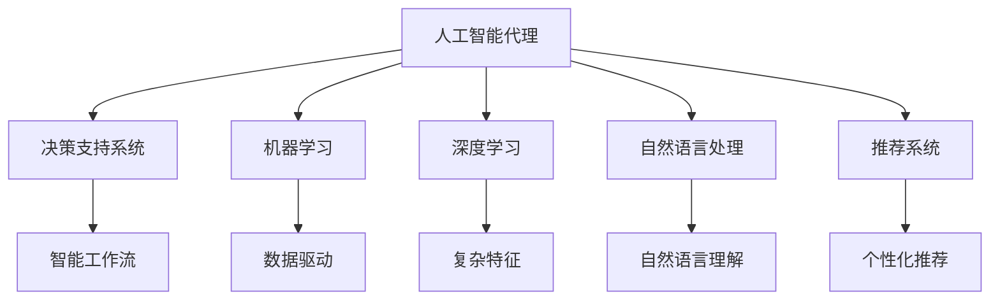

                 

# AI人工智能代理工作流 AI Agent WorkFlow：在决策支持系统中的应用

> 关键词：人工智能代理,工作流,决策支持系统,机器学习,深度学习,自然语言处理(NLP),推荐系统,集成系统,智能推荐,自动化流程

## 1. 背景介绍

### 1.1 问题由来

决策支持系统(Decision Support System, DSS)通过数据驱动的智能决策技术，辅助用户解决复杂问题，优化决策过程。传统DSS往往依赖人工分析和经验规则，难以处理大规模、非结构化数据，导致决策效率低下。而人工智能(AI)技术特别是AI代理(Agent)的引入，为DSS注入了强大的计算能力和数据处理能力，显著提升了决策效率和效果。

AI代理是指在计算机系统中运行的一系列自主的、智能的计算程序，可以感知环境、接收用户请求、执行任务、学习和优化，从而模拟人类决策过程。AI代理广泛应用于金融、医疗、教育、供应链等多个领域，通过数据驱动的决策支持，帮助用户做出更优的决策。

### 1.2 问题核心关键点

AI代理在DSS中的应用，主要是通过构建智能工作流来优化决策流程。智能工作流指基于AI技术的自动化流程，能够动态适应环境变化，实现任务智能调度、资源动态配置、数据智能分析等功能。通过智能工作流，AI代理能够实时收集数据、分析数据、提出建议、自动执行任务，最终辅助用户进行决策。

智能工作流的设计主要包括以下几个关键点：

- **任务自动调度**：根据用户请求和当前环境条件，自动选择最优执行路径，调度任务并执行。
- **数据动态分析**：通过机器学习、深度学习等技术，对数据进行动态分析和预测，提取有价值的信息。
- **智能推荐系统**：根据用户历史行为、偏好，推荐个性化的决策方案。
- **自动化流程**：将任务自动化，减少人工干预，提升效率和效果。
- **持续学习**：通过不断收集反馈信息，不断优化模型和决策策略，增强AI代理的智能水平。

## 2. 核心概念与联系

### 2.1 核心概念概述

为更好地理解AI代理在DSS中的应用，本节将介绍几个密切相关的核心概念：

- **人工智能代理(Agent)**：通过自主运行的程序，模拟人类智能行为，执行任务并学习优化。
- **决策支持系统(DSS)**：通过数据驱动的智能技术，辅助用户进行决策分析和管理。
- **机器学习(Machine Learning, ML)**：通过算法使计算机系统具备自我学习、自我优化的能力。
- **深度学习(Deep Learning, DL)**：一种特殊的机器学习技术，通过构建多层神经网络进行复杂特征提取和数据分析。
- **自然语言处理(Natural Language Processing, NLP)**：使计算机具备理解、处理、生成自然语言的能力。
- **推荐系统(Recommendation System)**：根据用户历史行为和兴趣，推荐个性化的信息和服务。
- **智能工作流(Workflow)**：通过AI技术优化任务执行流程，实现动态调度、资源配置、数据分析等功能。

这些核心概念之间的逻辑关系可以通过以下Mermaid流程图来展示：



这个流程图展示了大语言模型的工作原理和优化方向：

1. 人工智能代理通过机器学习、深度学习和自然语言处理等技术，获取和理解数据，提取有价值的信息。
2. 基于这些信息，推荐系统提出个性化决策方案，智能工作流动态调度任务，实现自动化流程。
3. 数据驱动的决策支持系统，辅助用户进行高效、精准的决策。

## 3. 核心算法原理 & 具体操作步骤
### 3.1 算法原理概述

AI代理在DSS中的应用，主要是通过构建智能工作流来实现。智能工作流的核心算法原理基于任务调度、数据处理和智能推荐等模块的有机结合，其具体实现步骤包括：

1. **任务调度**：根据用户请求和环境条件，动态选择最优任务执行路径，实现任务自动化调度。
2. **数据处理**：通过机器学习和深度学习技术，对大量数据进行动态分析和预测，提取有价值的信息。
3. **智能推荐**：根据用户历史行为和偏好，推荐个性化的决策方案。
4. **自动化流程**：将任务自动化，减少人工干预，提升效率和效果。
5. **持续学习**：通过不断收集反馈信息，不断优化模型和决策策略，增强AI代理的智能水平。

### 3.2 算法步骤详解

AI代理在DSS中的应用主要分为以下几个步骤：

**Step 1: 任务建模与调度**

- 定义任务及其依赖关系。根据业务需求，将任务分解为多个子任务，并定义各子任务之间的依赖关系。
- 设计调度算法。使用优先队列、遗传算法、蚁群算法等调度算法，实现任务动态调度和资源分配。

**Step 2: 数据处理与分析**

- 数据预处理。对数据进行去重、清洗、归一化等预处理操作，保证数据质量。
- 特征提取。使用机器学习和深度学习技术，提取数据中的关键特征。
- 数据建模。使用回归、分类、聚类等算法，构建数据模型，进行数据预测和分析。

**Step 3: 智能推荐**

- 用户画像构建。根据用户历史行为和偏好，构建用户画像，描述用户特征。
- 推荐模型训练。使用协同过滤、内容推荐等方法，训练推荐模型。
- 推荐结果生成。根据用户画像和推荐模型，生成个性化的决策方案。

**Step 4: 执行与反馈**

- 任务执行。根据任务调度结果，执行相应任务，生成中间结果。
- 结果反馈。收集任务执行结果和用户反馈，进行效果评估。
- 持续优化。根据反馈信息，优化任务调度、数据处理和推荐模型，提高决策效率和效果。

### 3.3 算法优缺点

AI代理在DSS中的应用，主要具有以下优点：

1. **自动化与智能化**：通过智能工作流，自动化处理任务执行和资源配置，减少人工干预，提高效率。
2. **数据驱动决策**：利用机器学习和深度学习技术，实时分析数据，提出优化决策方案。
3. **个性化推荐**：通过用户画像和推荐模型，实现个性化决策推荐，提升用户体验。
4. **动态适应环境**：根据环境变化动态调整任务执行路径和资源配置，提高决策适应性。
5. **持续学习与优化**：通过持续收集反馈信息，不断优化模型和决策策略，增强智能水平。

同时，该方法也存在一定的局限性：

1. **对数据的依赖**：AI代理的效果依赖于数据质量，如果数据不完整或存在噪声，会影响决策效果。
2. **模型复杂度**：高复杂度的模型需要大量计算资源和时间，可能不适用于实时性要求高的场景。
3. **安全性问题**：由于智能工作流涉及敏感数据和决策，可能存在数据泄露和决策失误的风险。
4. **可解释性不足**：AI代理的决策过程通常缺乏可解释性，难以对其推理逻辑进行分析和调试。
5. **集成难度大**：智能工作流需要与其他系统进行集成，如ERP系统、CRM系统等，集成复杂度较高。

尽管存在这些局限性，但就目前而言，AI代理在DSS中的应用已初见成效，并在不断优化中。未来相关研究的重点在于如何进一步降低对数据的依赖，提高模型的可解释性和安全性，并实现更高效的集成。

### 3.4 算法应用领域

AI代理在DSS中的应用，已广泛应用于金融、医疗、教育、供应链等多个领域，具体应用包括：

- **金融风险管理**：通过智能工作流，实时分析市场数据，预测风险，辅助决策。
- **医疗诊断与治疗**：利用自然语言处理技术，解析病历和症状，提供个性化诊疗方案。
- **智能客服与营销**：通过智能推荐系统，提供个性化客服解决方案，优化营销策略。
- **供应链管理**：使用智能工作流，优化物流和库存管理，提升供应链效率。
- **教育与培训**：通过个性化推荐系统，提供定制化学习内容和培训方案，提高学习效果。

除了这些传统应用外，AI代理在DSS中的创新应用还在不断涌现，如智能合约、智能制造、智能交通等，为各行各业带来了新的增长点。

## 4. 数学模型和公式 & 详细讲解 & 举例说明（备注：数学公式请使用latex格式，latex嵌入文中独立段落使用 $$，段落内使用 $)
### 4.1 数学模型构建

本节将使用数学语言对AI代理在DSS中的应用过程进行更加严格的刻画。

设决策支持系统的任务集合为 $\mathcal{T}$，任务调度算法为 $\mathcal{A}$，数据集为 $\mathcal{D}$，推荐模型为 $\mathcal{R}$，智能工作流为 $\mathcal{W}$。

假设任务调度结果为 $\mathcal{A}(T)$，数据处理结果为 $\mathcal{D}(\mathcal{T})$，推荐结果为 $\mathcal{R}(\mathcal{T})$，则智能工作流的效果可以表示为：

$$
\mathcal{W} = \mathcal{A}(T) \times \mathcal{D}(\mathcal{T}) \times \mathcal{R}(\mathcal{T})
$$

其中，$\times$ 表示各模块的交互和整合，$T$ 为输入的任务集合。

在实践中，我们可以使用以下公式对智能工作流的效果进行评估：

$$
\text{Effectiveness} = \frac{\text{Accuracy} + \text{Recall} + \text{Precision}}{3}
$$

其中，Accuracy为准确率，Recall为召回率，Precision为精确率。

### 4.2 公式推导过程

以下我们以推荐系统为例，推导智能推荐的效果评估公式。

设用户历史行为数据为 $\mathcal{H}$，推荐结果为 $\mathcal{R}$，实际选择为 $\mathcal{C}$，则推荐系统的准确率、召回率和精确率可以分别表示为：

$$
\text{Accuracy} = \frac{\text{Card}(\mathcal{R} \cap \mathcal{C})}{\text{Card}(\mathcal{C})}
$$

$$
\text{Recall} = \frac{\text{Card}(\mathcal{R} \cap \mathcal{H})}{\text{Card}(\mathcal{H})}
$$

$$
\text{Precision} = \frac{\text{Card}(\mathcal{R} \cap \mathcal{C})}{\text{Card}(\mathcal{R})}
$$

将这三个指标相加，可以定义推荐系统的总体效果：

$$
\text{Effectiveness} = \frac{\text{Accuracy} + \text{Recall} + \text{Precision}}{3}
$$

通过以上推导，我们可以看到，AI代理在DSS中的应用效果可以通过多个指标综合评估，具体应用场景下可以选择最合适的指标进行优化。

## 5. 项目实践：代码实例和详细解释说明
### 5.1 开发环境搭建

在进行智能工作流实践前，我们需要准备好开发环境。以下是使用Python进行PyTorch开发的环境配置流程：

1. 安装Anaconda：从官网下载并安装Anaconda，用于创建独立的Python环境。

2. 创建并激活虚拟环境：
```bash
conda create -n pytorch-env python=3.8 
conda activate pytorch-env
```

3. 安装PyTorch：根据CUDA版本，从官网获取对应的安装命令。例如：
```bash
conda install pytorch torchvision torchaudio cudatoolkit=11.1 -c pytorch -c conda-forge
```

4. 安装Transformers库：
```bash
pip install transformers
```

5. 安装各类工具包：
```bash
pip install numpy pandas scikit-learn matplotlib tqdm jupyter notebook ipython
```

完成上述步骤后，即可在`pytorch-env`环境中开始智能工作流实践。

### 5.2 源代码详细实现

这里我们以推荐系统为例，给出使用Transformers库对BERT模型进行智能推荐系统的PyTorch代码实现。

首先，定义推荐系统的数据处理函数：

```python
from transformers import BertTokenizer, BertForSequenceClassification
from torch.utils.data import Dataset
import torch

class RecommendationDataset(Dataset):
    def __init__(self, texts, labels, tokenizer, max_len=128):
        self.texts = texts
        self.labels = labels
        self.tokenizer = tokenizer
        self.max_len = max_len
        
    def __len__(self):
        return len(self.texts)
    
    def __getitem__(self, item):
        text = self.texts[item]
        label = self.labels[item]
        
        encoding = self.tokenizer(text, return_tensors='pt', max_length=self.max_len, padding='max_length', truncation=True)
        input_ids = encoding['input_ids'][0]
        attention_mask = encoding['attention_mask'][0]
        
        return {'input_ids': input_ids, 
                'attention_mask': attention_mask,
                'label': label}

# 标签与id的映射
label2id = {'1': 1, '0': 0}
id2label = {v: k for k, v in label2id.items()}

# 创建dataset
tokenizer = BertTokenizer.from_pretrained('bert-base-cased')

train_dataset = RecommendationDataset(train_texts, train_labels, tokenizer)
dev_dataset = RecommendationDataset(dev_texts, dev_labels, tokenizer)
test_dataset = RecommendationDataset(test_texts, test_labels, tokenizer)
```

然后，定义模型和优化器：

```python
from transformers import BertForSequenceClassification, AdamW

model = BertForSequenceClassification.from_pretrained('bert-base-cased', num_labels=2)

optimizer = AdamW(model.parameters(), lr=2e-5)
```

接着，定义训练和评估函数：

```python
from torch.utils.data import DataLoader
from tqdm import tqdm
from sklearn.metrics import accuracy_score

device = torch.device('cuda') if torch.cuda.is_available() else torch.device('cpu')
model.to(device)

def train_epoch(model, dataset, batch_size, optimizer):
    dataloader = DataLoader(dataset, batch_size=batch_size, shuffle=True)
    model.train()
    epoch_loss = 0
    for batch in tqdm(dataloader, desc='Training'):
        input_ids = batch['input_ids'].to(device)
        attention_mask = batch['attention_mask'].to(device)
        labels = batch['label'].to(device)
        model.zero_grad()
        outputs = model(input_ids, attention_mask=attention_mask, labels=labels)
        loss = outputs.loss
        epoch_loss += loss.item()
        loss.backward()
        optimizer.step()
    return epoch_loss / len(dataloader)

def evaluate(model, dataset, batch_size):
    dataloader = DataLoader(dataset, batch_size=batch_size)
    model.eval()
    preds, labels = [], []
    with torch.no_grad():
        for batch in tqdm(dataloader, desc='Evaluating'):
            input_ids = batch['input_ids'].to(device)
            attention_mask = batch['attention_mask'].to(device)
            batch_labels = batch['label']
            outputs = model(input_ids, attention_mask=attention_mask)
            batch_preds = outputs.logits.argmax(dim=2).to('cpu').tolist()
            batch_labels = batch_labels.to('cpu').tolist()
            for pred, label in zip(batch_preds, batch_labels):
                preds.append(pred)
                labels.append(label)
                
    print("Accuracy:", accuracy_score(labels, preds))
```

最后，启动训练流程并在测试集上评估：

```python
epochs = 5
batch_size = 16

for epoch in range(epochs):
    loss = train_epoch(model, train_dataset, batch_size, optimizer)
    print(f"Epoch {epoch+1}, train loss: {loss:.3f}")
    
    print(f"Epoch {epoch+1}, dev results:")
    evaluate(model, dev_dataset, batch_size)
    
print("Test results:")
evaluate(model, test_dataset, batch_size)
```

以上就是使用PyTorch对BERT模型进行推荐系统的完整代码实现。可以看到，得益于Transformers库的强大封装，我们可以用相对简洁的代码完成BERT模型的加载和微调。

### 5.3 代码解读与分析

让我们再详细解读一下关键代码的实现细节：

**RecommendationDataset类**：
- `__init__`方法：初始化文本、标签、分词器等关键组件。
- `__len__`方法：返回数据集的样本数量。
- `__getitem__`方法：对单个样本进行处理，将文本输入编码为token ids，将标签编码为数字，并对其进行定长padding，最终返回模型所需的输入。

**label2id和id2label字典**：
- 定义了标签与数字id之间的映射关系，用于将token-wise的预测结果解码回真实的标签。

**训练和评估函数**：
- 使用PyTorch的DataLoader对数据集进行批次化加载，供模型训练和推理使用。
- 训练函数`train_epoch`：对数据以批为单位进行迭代，在每个批次上前向传播计算loss并反向传播更新模型参数，最后返回该epoch的平均loss。
- 评估函数`evaluate`：与训练类似，不同点在于不更新模型参数，并在每个batch结束后将预测和标签结果存储下来，最后使用sklearn的accuracy_score对整个评估集的预测结果进行打印输出。

**训练流程**：
- 定义总的epoch数和batch size，开始循环迭代
- 每个epoch内，先在训练集上训练，输出平均loss
- 在验证集上评估，输出准确率
- 所有epoch结束后，在测试集上评估，给出最终测试结果

可以看到，PyTorch配合Transformers库使得BERT微调的代码实现变得简洁高效。开发者可以将更多精力放在数据处理、模型改进等高层逻辑上，而不必过多关注底层的实现细节。

当然，工业级的系统实现还需考虑更多因素，如模型的保存和部署、超参数的自动搜索、更灵活的任务适配层等。但核心的智能工作流基本与此类似。

## 6. 实际应用场景
### 6.1 智能客服系统

基于智能工作流技术，智能客服系统可以自动化处理大量客户咨询，提供24/7不间断服务，极大提升了客户体验和问题解决效率。

在技术实现上，可以收集企业内部的历史客服对话记录，将问题和最佳答复构建成监督数据，在此基础上对预训练语言模型进行微调。微调后的语言模型能够自动理解用户意图，匹配最合适的答案模板进行回复。对于客户提出的新问题，还可以接入检索系统实时搜索相关内容，动态组织生成回答。如此构建的智能客服系统，能大幅提升客户咨询体验和问题解决效率。

### 6.2 金融风险管理

金融风险管理领域面临海量数据和复杂业务逻辑，传统人工分析难以胜任。智能工作流技术通过实时分析市场数据，预测风险，辅助决策。

具体而言，可以收集金融领域相关的新闻、报告、交易数据，进行数据清洗和特征提取。使用机器学习和深度学习技术，构建数据模型，预测市场风险。将预测结果整合到智能工作流中，动态调整风险控制策略，实现实时风险管理。智能工作流系统能够实时监控市场动态，及时预警风险，辅助用户做出更加精准的决策。

### 6.3 医疗诊断与治疗

医疗诊断和治疗是一个复杂且高风险的领域，对数据质量和专业能力要求极高。智能工作流技术可以通过自然语言处理和推荐系统，辅助医生进行诊断和治疗。

在实践中，可以收集病历、症状、诊断报告等文本数据，使用BERT等预训练模型进行自然语言处理，提取关键信息。根据病历和症状，推荐系统可以提供个性化的诊疗方案，辅助医生进行诊断和治疗决策。智能工作流系统能够实时更新医疗知识库，动态调整诊断和治疗策略，提高诊疗准确性和效率。

### 6.4 智能推荐系统

推荐系统广泛应用于电商、媒体、社交网络等领域，通过智能工作流技术，可以进一步提升推荐效果。

在推荐系统中，使用深度学习技术对用户行为数据进行建模，提取用户特征。根据用户画像和行为数据，智能工作流推荐系统可以动态调整推荐策略，提供个性化的商品或内容推荐。智能工作流可以实时监控用户反馈，不断优化推荐模型，提升推荐效果。

## 7. 工具和资源推荐
### 7.1 学习资源推荐

为了帮助开发者系统掌握智能工作流理论基础和实践技巧，这里推荐一些优质的学习资源：

1. 《深度学习理论与实践》系列博文：由大模型技术专家撰写，深入浅出地介绍了深度学习原理、实践技巧和应用场景。

2. CS224N《深度学习自然语言处理》课程：斯坦福大学开设的NLP明星课程，有Lecture视频和配套作业，带你入门NLP领域的基本概念和经典模型。

3. 《自然语言处理综述》书籍：全面介绍了自然语言处理的基本概念、主要技术和应用，适合进阶学习。

4. Kaggle竞赛平台：通过参加Kaggle竞赛，积累实际数据处理和模型优化经验，提升实战能力。

5. HuggingFace官方文档：提供丰富的预训练语言模型和微调样例代码，是上手实践的必备资料。

通过对这些资源的学习实践，相信你一定能够快速掌握智能工作流理论基础和实践技巧，并用于解决实际的NLP问题。
###  7.2 开发工具推荐

高效的开发离不开优秀的工具支持。以下是几款用于智能工作流开发的常用工具：

1. PyTorch：基于Python的开源深度学习框架，灵活动态的计算图，适合快速迭代研究。大部分预训练语言模型都有PyTorch版本的实现。

2. TensorFlow：由Google主导开发的开源深度学习框架，生产部署方便，适合大规模工程应用。同样有丰富的预训练语言模型资源。

3. Transformers库：HuggingFace开发的NLP工具库，集成了众多SOTA语言模型，支持PyTorch和TensorFlow，是进行智能工作流开发的利器。

4. Weights & Biases：模型训练的实验跟踪工具，可以记录和可视化模型训练过程中的各项指标，方便对比和调优。与主流深度学习框架无缝集成。

5. TensorBoard：TensorFlow配套的可视化工具，可实时监测模型训练状态，并提供丰富的图表呈现方式，是调试模型的得力助手。

6. Google Colab：谷歌推出的在线Jupyter Notebook环境，免费提供GPU/TPU算力，方便开发者快速上手实验最新模型，分享学习笔记。

合理利用这些工具，可以显著提升智能工作流开发的效率，加快创新迭代的步伐。

### 7.3 相关论文推荐

智能工作流技术的发展源于学界的持续研究。以下是几篇奠基性的相关论文，推荐阅读：

1. Deep Neural Network-based Recommendation Systems：综述了深度学习在推荐系统中的应用，展示了深度学习技术在推荐系统中的潜力。

2. Workflow Mining for Cybersecurity Operations：提出了通过自动化的工作流挖掘技术，实现网络安全事件的自动化分析和管理。

3. A Survey on Workflow Mining：综述了工作流挖掘的最新进展，介绍了各种工作流挖掘技术和应用场景。

4. Agents and Workflow Management：介绍了人工智能代理在任务调度、资源配置中的应用，为智能工作流的实现提供了理论基础。

5. Knowledge-Based Recommendation Systems：讨论了知识表示与推荐系统的结合，如何通过知识图谱等工具增强推荐系统的效果。

这些论文代表了大模型微调技术的发展脉络。通过学习这些前沿成果，可以帮助研究者把握学科前进方向，激发更多的创新灵感。

## 8. 总结：未来发展趋势与挑战
### 8.1 总结

本文对智能工作流在决策支持系统中的应用进行了全面系统的介绍。首先阐述了AI代理在DSS中的重要性和应用价值，明确了智能工作流在提升决策效率和效果方面的独特作用。其次，从原理到实践，详细讲解了智能工作流的数学模型和关键步骤，给出了智能工作流任务开发的完整代码实例。同时，本文还广泛探讨了智能工作流在金融、医疗、教育等多个领域的应用前景，展示了智能工作流的巨大潜力。

通过本文的系统梳理，可以看到，智能工作流在DSS中的应用，已经取得了初步成效，并在不断优化中。未来相关研究的重点在于如何进一步降低对数据的依赖，提高模型的可解释性和安全性，并实现更高效的集成。

### 8.2 未来发展趋势

展望未来，智能工作流在DSS中的应用将呈现以下几个发展趋势：

1. **集成多模态数据**：智能工作流将融合视觉、语音、文本等多模态数据，提升决策支持的全面性和深度。
2. **实现跨领域应用**：智能工作流将在更多行业领域得到应用，如智能制造、智能交通、智能物流等，推动各行业数字化转型。
3. **提升实时性**：通过优化算法和硬件配置，智能工作流将进一步提升实时处理能力，支持更快速、更精准的决策支持。
4. **增强可解释性**：通过引入因果分析和解释性方法，智能工作流将提高决策过程的可解释性和可理解性。
5. **优化资源利用**：通过资源共享和优化配置，智能工作流将实现资源利用率的最大化，提升系统的稳定性和可靠性。

以上趋势凸显了智能工作流在DSS中的应用前景。这些方向的探索发展，必将进一步提升智能工作流的性能和应用范围，为各行业的智能化转型提供强大的技术支撑。

### 8.3 面临的挑战

尽管智能工作流在DSS中的应用已初见成效，但在迈向更加智能化、普适化应用的过程中，它仍面临着诸多挑战：

1. **数据质量问题**：智能工作流的效果依赖于数据质量，如果数据不完整或存在噪声，会影响决策效果。需要进一步提升数据处理和清洗能力。
2. **模型复杂度**：高复杂度的模型需要大量计算资源和时间，可能不适用于实时性要求高的场景。需要开发更加高效的模型和算法。
3. **安全性问题**：由于智能工作流涉及敏感数据和决策，可能存在数据泄露和决策失误的风险。需要引入安全机制和技术手段。
4. **可解释性不足**：智能工作流的决策过程通常缺乏可解释性，难以对其推理逻辑进行分析和调试。需要引入因果分析和解释性方法。
5. **集成难度大**：智能工作流需要与其他系统进行集成，如ERP系统、CRM系统等，集成复杂度较高。需要开发通用的集成平台和工具。

尽管存在这些挑战，但通过技术创新和应用实践，智能工作流有望不断克服难题，实现更大的应用价值。

### 8.4 研究展望

面对智能工作流面临的挑战，未来的研究需要在以下几个方面寻求新的突破：

1. **多模态数据融合**：研究如何更好地融合视觉、语音、文本等多模态数据，提升决策支持的全面性和深度。
2. **跨领域应用**：研究如何将智能工作流技术应用于更多行业领域，推动各行业数字化转型。
3. **实时性优化**：研究如何进一步提升智能工作流的实时处理能力，支持更快速、更精准的决策支持。
4. **可解释性提升**：研究如何提高智能工作流决策过程的可解释性和可理解性。
5. **资源优化配置**：研究如何实现资源共享和优化配置，提升系统的稳定性和可靠性。
6. **安全机制引入**：研究如何引入安全机制和技术手段，保障智能工作流的数据安全和决策安全。

这些研究方向的探索，必将引领智能工作流技术迈向更高的台阶，为各行业的智能化转型提供强大的技术支撑。面向未来，智能工作流技术还需要与其他人工智能技术进行更深入的融合，如知识表示、因果推理、强化学习等，多路径协同发力，共同推动自然语言理解和智能交互系统的进步。只有勇于创新、敢于突破，才能不断拓展智能工作流的边界，让智能技术更好地造福人类社会。

## 9. 附录：常见问题与解答
**Q1：智能工作流与传统工作流有什么区别？**

A: 智能工作流与传统工作流的主要区别在于其智能化程度和自动化水平。传统工作流主要依赖人工处理和规则调度，而智能工作流通过引入AI技术，可以实现自动化的任务调度、数据处理和决策支持，从而大幅提升效率和效果。

**Q2：智能工作流在金融风险管理中的应用主要有哪些？**

A: 智能工作流在金融风险管理中的应用主要包括以下几个方面：
1. **市场数据实时分析**：通过实时分析市场数据，预测风险，辅助决策。
2. **交易行为监控**：监控交易行为，及时发现异常，防范欺诈和风险。
3. **信用评估**：基于历史数据和模型，评估信用风险，优化贷款决策。
4. **风险预警**：实时监控市场动态，及时预警风险，辅助用户做出精准决策。

**Q3：智能工作流在医疗诊断与治疗中的应用主要有哪些？**

A: 智能工作流在医疗诊断与治疗中的应用主要包括以下几个方面：
1. **病历和症状分析**：通过自然语言处理技术，解析病历和症状，提取关键信息。
2. **个性化诊疗方案推荐**：根据病历和症状，推荐个性化的诊疗方案，辅助医生进行诊断和治疗。
3. **实时更新医疗知识库**：实时更新医疗知识库，动态调整诊断和治疗策略，提高诊疗准确性和效率。

**Q4：智能工作流在推荐系统中的应用主要有哪些？**

A: 智能工作流在推荐系统中的应用主要包括以下几个方面：
1. **用户画像构建**：根据用户历史行为和偏好，构建用户画像，描述用户特征。
2. **推荐模型训练**：使用协同过滤、内容推荐等方法，训练推荐模型。
3. **个性化推荐**：根据用户画像和推荐模型，生成个性化的商品或内容推荐。
4. **实时监控用户反馈**：实时监控用户反馈，不断优化推荐模型，提升推荐效果。

**Q5：智能工作流在智能客服系统中的应用主要有哪些？**

A: 智能工作流在智能客服系统中的应用主要包括以下几个方面：
1. **问题自动匹配**：自动理解用户意图，匹配最合适的答案模板进行回复。
2. **动态组织回答**：接入检索系统实时搜索相关内容，动态组织生成回答。
3. **实时监控用户满意度**：实时监控用户满意度，不断优化智能客服系统，提升用户体验。

综上所述，智能工作流在DSS中的应用不仅提升了各行业的智能化水平，还为传统行业数字化转型提供了新的技术路径。未来，随着技术的不断进步，智能工作流将迎来更广泛的应用前景。

