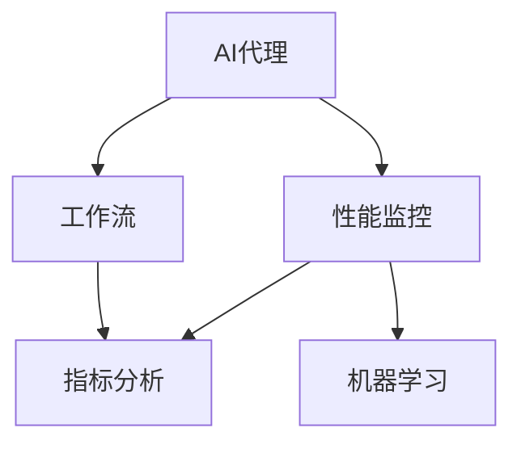

                 

# AI人工智能代理工作流AI Agent WorkFlow：AI代理性能监控指标与分析技术

> 关键词：AI代理,工作流,性能监控,指标分析,机器学习

## 1. 背景介绍

### 1.1 问题由来
随着人工智能技术的快速发展和广泛应用，AI代理（AI Agent）在企业自动化、自动化客服、智能决策等领域扮演着越来越重要的角色。AI代理通过与人类交互，自动处理各种任务，极大地提高了工作效率和响应速度。然而，如何保证AI代理的性能、稳定性和可靠性，成为了亟需解决的问题。

AI代理的性能不仅与其算法和模型有关，还受到系统架构、数据质量、用户行为等多方面因素的影响。因此，对AI代理进行全面的性能监控和分析，对于提升其效果、优化系统设计和维护具有重要意义。

### 1.2 问题核心关键点
AI代理性能监控与分析的核心在于通过科学合理的指标和分析方法，对AI代理的执行效果进行评估和反馈，进而指导算法改进、系统优化和维护。其关键点包括：

1. **指标选择与构建**：选择合适的性能指标，并构建科学的评估体系。
2. **数据收集与处理**：全面、准确地收集AI代理的运行数据，并进行清洗和预处理。
3. **分析方法与模型**：应用机器学习等技术，对收集到的数据进行分析，挖掘潜在问题，提取有价值的信息。
4. **反馈与改进**：根据分析结果，反馈给AI代理的设计和训练环节，进行算法和模型的改进。
5. **可视化与报告**：通过可视化的方式，展示监控结果，为开发人员和运营人员提供直观的反馈。

### 1.3 问题研究意义
对AI代理进行性能监控与分析，不仅能够提高其处理效率和准确性，还能显著提升用户体验。研究AI代理的性能监控指标与分析技术，对于优化AI代理的工作流程、提升整体业务效率具有重要意义：

1. **提高效率**：通过监控和分析，及时发现并解决性能瓶颈，提升AI代理的运行效率。
2. **保障质量**：保证AI代理的输出结果准确、可靠，提高用户体验。
3. **增强稳定性**：监控AI代理的运行状态，及时预警潜在问题，防止系统崩溃。
4. **推动创新**：通过分析结果，指导AI代理的算法和模型改进，推动技术创新。
5. **支持决策**：为管理层提供详细的监控报告，支持决策和资源配置。

## 2. 核心概念与联系

### 2.1 核心概念概述

为更好地理解AI代理性能监控与分析技术，本节将介绍几个密切相关的核心概念：

- **AI代理（AI Agent）**：指能够通过感知、学习、决策、执行等能力，自动完成特定任务的人工智能实体。常见的AI代理包括聊天机器人、自动化决策系统等。
- **工作流（Workflow）**：指在特定任务下，AI代理处理数据和执行操作的序列。工作流的设计直接影响到AI代理的性能和稳定性。
- **性能监控（Performance Monitoring）**：指对AI代理的工作流程进行实时监控，收集其性能数据的过程。通过监控，可以及时发现和解决性能问题。
- **指标分析（Metrics Analysis）**：指对收集到的性能数据进行分析，提取有价值的信息和问题的过程。指标分析是性能监控的核心部分。
- **机器学习（Machine Learning）**：指通过算法和模型，对数据进行分析和预测的过程。机器学习是实现指标分析的主要技术手段。

这些核心概念之间的逻辑关系可以通过以下Mermaid流程图来展示：



这个流程图展示了这个领域的核心概念及其之间的关系：

1. AI代理通过工作流处理任务，其性能受到工作流设计的影响。
2. 性能监控对AI代理的工作流程进行实时监控，收集性能数据。
3. 指标分析对收集到的性能数据进行分析，提取有价值的信息和问题。
4. 机器学习是实现指标分析的主要技术手段。

这些概念共同构成了AI代理性能监控与分析技术的框架，为其研究和实践提供了基础。

## 3. 核心算法原理 & 具体操作步骤
### 3.1 算法原理概述

AI代理性能监控与分析的原理是，通过对AI代理的工作流程进行实时监控，收集其性能数据，再通过机器学习等技术对数据进行分析，挖掘潜在问题，提取有价值的信息。其核心步骤如下：

1. **数据收集**：全面、准确地收集AI代理的运行数据，包括输入输出、运行时间、资源消耗等。
2. **数据清洗**：对收集到的数据进行清洗和预处理，去除噪声和异常值，保证数据的准确性。
3. **指标选择**：选择合适的性能指标，如响应时间、准确率、错误率等。
4. **模型训练**：利用机器学习模型对数据进行训练，建立预测模型，用于指标分析。
5. **指标分析**：对训练好的模型进行应用，对收集到的数据进行分析，提取有价值的信息和问题。
6. **可视化报告**：通过可视化的方式，展示监控结果和分析结果，提供直观的反馈。

### 3.2 算法步骤详解

以下是AI代理性能监控与分析的具体操作步骤：

**Step 1: 数据收集**
- 使用日志、监控工具等技术手段，全面收集AI代理的运行数据。例如，可以使用Prometheus等监控系统，收集CPU、内存、网络等资源的使用情况。
- 收集AI代理的输入数据和输出数据，例如，聊天机器人的对话记录、自动化决策的执行结果等。

**Step 2: 数据清洗**
- 对收集到的数据进行清洗，去除噪声和异常值。例如，使用数据清洗工具或编写脚本，检测并移除异常的日志记录。
- 对数据进行标准化处理，例如，对文本数据进行分词、去除停用词等操作。

**Step 3: 指标选择**
- 根据AI代理的任务和目标，选择合适的性能指标。例如，对于聊天机器人，可以关注响应时间、对话准确率等指标。
- 根据指标的重要性，对指标进行权重分配，建立综合评价体系。

**Step 4: 模型训练**
- 选择合适的机器学习模型，例如，回归模型、分类模型等。
- 使用历史数据对模型进行训练，例如，使用线性回归、决策树等算法，建立预测模型。
- 对模型进行调参，例如，调整学习率、迭代次数等，提高模型的准确性和稳定性。

**Step 5: 指标分析**
- 对训练好的模型进行应用，对收集到的数据进行分析，提取有价值的信息和问题。例如，使用回归模型预测响应时间，识别出响应时间过长的对话记录。
- 对分析结果进行可视化，例如，使用matplotlib、Seaborn等工具，绘制图表展示分析结果。

**Step 6: 可视化报告**
- 将分析结果通过可视化的方式展示，例如，使用Jupyter Notebook、Tableau等工具，生成报告。
- 报告内容包括性能指标的趋势图、问题点的分布图等，为开发人员和运营人员提供直观的反馈。

### 3.3 算法优缺点

AI代理性能监控与分析的优点包括：

1. **全面性**：能够全面、准确地监控AI代理的运行数据，提供全面的性能评估。
2. **实时性**：通过实时监控，及时发现和解决问题，保障系统的稳定性。
3. **可扩展性**：通过标准化数据格式和接口，支持多种类型的AI代理和任务。
4. **科学性**：利用机器学习等技术，进行科学的数据分析和问题挖掘，提高分析结果的准确性和可靠性。

其缺点包括：

1. **复杂性**：涉及数据收集、数据清洗、指标选择、模型训练等多个环节，实施复杂。
2. **数据依赖**：需要全面、准确地收集数据，对于数据质量有较高要求。
3. **算法选择**：需要选择合适的机器学习模型和算法，对算法调参有一定的挑战。

尽管存在这些局限性，但AI代理性能监控与分析仍是提升AI代理性能的重要手段。未来研究应聚焦于如何降低实施复杂性、提高数据质量、优化算法选择等，进一步提升性能监控与分析的效果。

### 3.4 算法应用领域

AI代理性能监控与分析技术广泛应用于以下领域：

- **自动化客服**：对客服聊天机器人的对话进行监控和分析，提升客服效率和用户满意度。
- **金融交易**：对自动化交易系统的执行情况进行监控和分析，保障交易系统的稳定性和准确性。
- **医疗诊断**：对AI医生的诊断结果进行监控和分析，提高诊断的准确性和可靠性。
- **智能推荐**：对推荐系统的推荐结果进行监控和分析，提升推荐的个性化和准确性。
- **智能决策**：对决策系统的执行情况进行监控和分析，优化决策策略和执行效果。

## 4. 数学模型和公式 & 详细讲解
### 4.1 数学模型构建

AI代理性能监控与分析的数学模型主要涉及以下几个方面：

- **数据模型**：描述AI代理运行数据的基本形式。
- **指标模型**：定义性能指标的基本形式，如回归模型、分类模型等。
- **模型训练**：建立和训练机器学习模型，用于指标分析。
- **分析模型**：应用机器学习模型对数据进行分析，提取有价值的信息和问题。

以下是几个典型的数学模型示例：

**回归模型**：

$$
y = w_0 + w_1x_1 + w_2x_2 + \cdots + w_nx_n + \epsilon
$$

其中，$y$ 表示预测结果，$x_1, x_2, \cdots, x_n$ 表示输入特征，$w_0, w_1, w_2, \cdots, w_n$ 表示模型参数，$\epsilon$ 表示误差项。

**分类模型**：

$$
P(y|x) = \frac{e^{w_0 + w_1x_1 + w_2x_2 + \cdots + w_nx_n}}{\sum_{k=1}^{K} e^{w_0 + w_1x_1 + w_2x_2 + \cdots + w_nx_n}}
$$

其中，$P(y|x)$ 表示在输入特征 $x$ 下，预测结果 $y$ 的概率，$K$ 表示类别数。

### 4.2 公式推导过程

以回归模型为例，推导其训练过程和预测过程：

**训练过程**：

假设训练数据集为 $(x_i, y_i)$，其中 $x_i$ 表示输入特征，$y_i$ 表示预测结果。

- **损失函数**：回归模型的损失函数通常为均方误差损失函数，即 $L = \frac{1}{n} \sum_{i=1}^{n}(y_i - \hat{y_i})^2$。
- **梯度下降**：通过梯度下降算法，更新模型参数 $w$，使得损失函数最小化。具体步骤如下：
  $$
  w \leftarrow w - \eta \nabla L(w)
  $$
  其中，$\eta$ 表示学习率。

**预测过程**：

给定输入特征 $x$，预测结果 $y$ 可以通过回归模型计算得到：

- **线性预测**：回归模型将输入特征 $x$ 线性映射到预测结果 $y$，即 $\hat{y} = w_0 + w_1x_1 + w_2x_2 + \cdots + w_nx_n$。
- **回归分析**：通过回归模型，对输入特征 $x$ 进行回归分析，预测结果 $y$。

### 4.3 案例分析与讲解

**案例1：响应时间监控**

假设AI代理的响应时间为 $x_i$，响应时间越长，用户体验越差。可以使用回归模型对响应时间进行分析：

- **数据模型**：$y = w_0 + w_1x_1 + w_2x_2 + \cdots + w_nx_n + \epsilon$
- **指标模型**：$y = x_i$，即预测响应时间。
- **训练过程**：使用历史数据 $(x_i, y_i)$ 对回归模型进行训练，优化模型参数 $w$。
- **预测过程**：给定新的输入特征 $x$，预测响应时间 $y$。

通过监控和分析响应时间，可以识别出响应时间过长的对话记录，进而进行优化。

**案例2：错误率监控**

假设AI代理的错误率为 $y_i$，错误率越高，系统可靠性越低。可以使用分类模型对错误率进行分析：

- **数据模型**：$P(y|x) = \frac{e^{w_0 + w_1x_1 + w_2x_2 + \cdots + w_nx_n}}{\sum_{k=1}^{K} e^{w_0 + w_1x_1 + w_2x_2 + \cdots + w_nx_n}$
- **指标模型**：$y_i = \begin{cases}
  1 & \text{如果预测错误} \\
  0 & \text{如果预测正确}
\end{cases}$
- **训练过程**：使用历史数据 $(x_i, y_i)$ 对分类模型进行训练，优化模型参数 $w$。
- **预测过程**：给定新的输入特征 $x$，预测错误率 $y$。

通过监控和分析错误率，可以识别出错误率高的对话记录，进而进行优化。

## 5. 项目实践：代码实例和详细解释说明
### 5.1 开发环境搭建

在进行AI代理性能监控与分析的项目实践前，我们需要准备好开发环境。以下是使用Python进行TensorFlow开发的环境配置流程：

1. 安装Anaconda：从官网下载并安装Anaconda，用于创建独立的Python环境。

2. 创建并激活虚拟环境：
```bash
conda create -n tf-env python=3.8 
conda activate tf-env
```

3. 安装TensorFlow：根据CUDA版本，从官网获取对应的安装命令。例如：
```bash
conda install tensorflow
```

4. 安装相关工具包：
```bash
pip install pandas numpy scikit-learn matplotlib tensorboard
```

完成上述步骤后，即可在`tf-env`环境中开始项目实践。

### 5.2 源代码详细实现

下面我们以聊天机器人对话监控为例，给出使用TensorFlow对回归模型进行训练和预测的PyTorch代码实现。

首先，定义数据处理函数：

```python
import pandas as pd
from sklearn.model_selection import train_test_split
from tensorflow.keras.models import Sequential
from tensorflow.keras.layers import Dense
from tensorflow.keras.optimizers import Adam
import matplotlib.pyplot as plt

def load_data(file_path):
    data = pd.read_csv(file_path)
    x = data[['x1', 'x2', 'x3']]  # 输入特征
    y = data['y']  # 预测结果
    return x, y

def train_model(x_train, y_train, x_test, y_test):
    model = Sequential()
    model.add(Dense(64, input_dim=x_train.shape[1], activation='relu'))
    model.add(Dense(1, activation='sigmoid'))
    model.compile(loss='binary_crossentropy', optimizer=Adam(lr=0.001), metrics=['accuracy'])
    model.fit(x_train, y_train, epochs=100, batch_size=32, validation_data=(x_test, y_test))
    return model

def predict(model, x):
    return model.predict(x)
```

然后，定义数据处理函数：

```python
def clean_data(data):
    # 去除异常值和噪声
    data = data[data['x1'] > 0]
    # 标准化处理
    data['x1'] = (data['x1'] - data['x1'].mean()) / data['x1'].std()
    data['x2'] = (data['x2'] - data['x2'].mean()) / data['x2'].std()
    data['x3'] = (data['x3'] - data['x3'].mean()) / data['x3'].std()
    return data

# 加载数据
data = load_data('data.csv')

# 数据清洗
cleaned_data = clean_data(data)

# 划分训练集和测试集
x_train, x_test, y_train, y_test = train_test_split(cleaned_data[['x1', 'x2', 'x3']], cleaned_data['y'], test_size=0.2)

# 模型训练
model = train_model(x_train, y_train, x_test, y_test)
```

最后，进行模型预测并可视化：

```python
# 数据可视化
plt.scatter(cleaned_data['x1'], cleaned_data['y'], color='blue', label='Data')
plt.plot(cleaned_data['x1'], model.predict(cleaned_data[['x1', 'x2', 'x3']]), color='red', label='Model')
plt.legend()
plt.show()

# 预测新数据
new_data = [[1.0, 2.0, 3.0]]
predicted_y = predict(model, new_data)
print(predicted_y)
```

以上就是使用TensorFlow进行回归模型训练和预测的完整代码实现。可以看到，通过TensorFlow的高级API，我们可以轻松地实现模型的构建、训练和预测。

### 5.3 代码解读与分析

让我们再详细解读一下关键代码的实现细节：

**数据处理函数**：
- `load_data`方法：加载数据集，并分离输入特征和预测结果。
- `train_model`方法：构建并训练回归模型。
- `clean_data`方法：对数据进行清洗和标准化处理，去除异常值和噪声。

**模型训练函数**：
- 使用`Sequential`类构建回归模型，包括一个隐层和一个输出层。
- 使用`Adam`优化器进行模型训练，损失函数为二分类交叉熵。
- 训练100个epoch，批大小为32，在测试集上进行验证。

**数据可视化**：
- 使用`matplotlib`库，对原始数据和模型预测结果进行散点图可视化。
- 通过可视化，直观展示模型预测效果。

**模型预测**：
- 使用训练好的模型对新数据进行预测，返回预测结果。

可以看到，TensorFlow提供了丰富的API和工具，使得回归模型的训练和预测变得简洁高效。开发者可以将更多精力放在数据处理和模型优化上，而不必过多关注底层的实现细节。

## 6. 实际应用场景
### 6.1 智能客服系统

基于AI代理性能监控与分析技术，可以构建高性能、高可靠性的智能客服系统。智能客服系统能够实时监控客服聊天机器人的对话，及时发现和解决性能问题，提升客服效率和用户满意度。

在技术实现上，可以收集客服聊天数据，使用回归模型或分类模型进行对话监控和分析，识别出响应时间过长、对话错误率过高的记录，并进行优化。同时，可以接入用户行为数据和系统日志，进一步优化聊天机器人的工作流程，提升用户体验。

### 6.2 金融交易系统

在金融交易系统中，AI代理性能监控与分析技术可以保障交易系统的稳定性和准确性。通过对交易系统的执行情况进行实时监控，可以及时发现和解决性能瓶颈，避免系统崩溃和交易错误。

具体而言，可以使用回归模型或分类模型对交易系统的执行时间、错误率等指标进行监控和分析，识别出执行效率低、错误率高的交易记录，并进行优化。同时，可以接入交易数据和系统日志，进一步优化交易策略和执行效果，保障交易系统的稳定性和可靠性。

### 6.3 医疗诊断系统

在医疗诊断系统中，AI代理性能监控与分析技术可以提升诊断的准确性和可靠性。通过对AI医生的诊断结果进行实时监控，可以及时发现和解决性能问题，避免误诊和漏诊。

具体而言，可以使用回归模型或分类模型对AI医生的诊断结果进行监控和分析，识别出诊断错误率高的记录，并进行优化。同时，可以接入医生诊断数据和患者信息，进一步优化诊断策略和结果，提升诊断的准确性和可靠性。

### 6.4 未来应用展望

随着AI代理性能监控与分析技术的不断发展，未来将在更多领域得到应用，为各行各业带来变革性影响。

在智慧医疗领域，基于AI代理性能监控与分析的医疗诊断系统，可以提升诊断的准确性和可靠性，辅助医生诊疗，加速新药开发进程。

在智能教育领域，基于AI代理性能监控与分析的作业批改、学情分析、知识推荐等系统，可以因材施教，促进教育公平，提高教学质量。

在智慧城市治理中，基于AI代理性能监控与分析的城市事件监测、舆情分析、应急指挥等系统，可以提高城市管理的自动化和智能化水平，构建更安全、高效的未来城市。

此外，在企业生产、社会治理、文娱传媒等众多领域，基于AI代理性能监控与分析的人工智能应用也将不断涌现，为经济社会发展注入新的动力。相信随着技术的日益成熟，AI代理性能监控与分析技术必将在构建人机协同的智能时代中扮演越来越重要的角色。

## 7. 工具和资源推荐
### 7.1 学习资源推荐

为了帮助开发者系统掌握AI代理性能监控与分析的理论基础和实践技巧，这里推荐一些优质的学习资源：

1. TensorFlow官方文档：TensorFlow的官方文档提供了全面的API文档和教程，是学习TensorFlow的重要资源。
2. TensorFlow实战指南：《TensorFlow实战指南》是一本系统介绍TensorFlow应用的书籍，适合初学者和进阶者阅读。
3. Kaggle机器学习竞赛：Kaggle提供了大量的机器学习竞赛和数据集，是练习和提高机器学习技能的好地方。
4. Coursera机器学习课程：Coursera提供了由斯坦福大学开设的机器学习课程，讲解了机器学习的基本概念和应用。
5. GitHub开源项目：GitHub上有很多优秀的机器学习开源项目，可以参考和学习。

通过对这些资源的学习实践，相信你一定能够快速掌握AI代理性能监控与分析的精髓，并用于解决实际的AI代理问题。
### 7.2 开发工具推荐

高效的开发离不开优秀的工具支持。以下是几款用于AI代理性能监控与分析开发的常用工具：

1. TensorFlow：由Google主导开发的开源深度学习框架，生产部署方便，适合大规模工程应用。
2. Scikit-learn：Python的机器学习库，提供了丰富的机器学习算法和工具。
3. Pandas：Python的数据处理库，用于数据清洗和预处理。
4. Matplotlib：Python的数据可视化库，用于绘制图表。
5. Seaborn：基于Matplotlib的数据可视化库，提供了更丰富的图表类型和自定义选项。

合理利用这些工具，可以显著提升AI代理性能监控与分析任务的开发效率，加快创新迭代的步伐。

### 7.3 相关论文推荐

AI代理性能监控与分析技术的发展源于学界的持续研究。以下是几篇奠基性的相关论文，推荐阅读：

1. TensorFlow论文：TensorFlow的原始论文，介绍了TensorFlow的核心思想和技术实现。
2. Kaggle数据集：Kaggle提供的数据集，用于机器学习竞赛和研究。
3. Scikit-learn论文：Scikit-learn的原始论文，介绍了Scikit-learn的核心算法和应用。
4. Pandas论文：Pandas的原始论文，介绍了Pandas的核心数据结构和操作方法。
5. Matplotlib论文：Matplotlib的原始论文，介绍了Matplotlib的核心算法和应用。

这些论文代表了大规模数据集和机器学习算法的最新进展，是研究AI代理性能监控与分析技术的重要参考。

## 8. 总结：未来发展趋势与挑战
### 8.1 总结

本文对AI代理性能监控与分析技术进行了全面系统的介绍。首先阐述了AI代理性能监控与分析的研究背景和意义，明确了监控与分析在提升AI代理性能、优化系统设计和维护方面的重要价值。其次，从原理到实践，详细讲解了性能监控与分析的数学模型和核心操作步骤，给出了完整的代码实例和详细解释说明。同时，本文还广泛探讨了性能监控与分析技术在智能客服、金融交易、医疗诊断等诸多领域的应用前景，展示了其在提高AI代理效果和系统可靠性方面的巨大潜力。

通过本文的系统梳理，可以看到，AI代理性能监控与分析技术正在成为AI代理开发的重要手段，极大地提升其处理效率和准确性。未来，随着预训练语言模型的不断发展，基于模型微调和优化的大规模AI代理系统将得到广泛应用，为各行各业带来新的变革。

### 8.2 未来发展趋势

展望未来，AI代理性能监控与分析技术将呈现以下几个发展趋势：

1. **智能化**：通过引入更先进的机器学习算法和模型，实现更加智能化的性能监控与分析。例如，引入深度学习、强化学习等技术，提升模型的预测能力和鲁棒性。
2. **实时化**：通过实时监控和分析，及时发现和解决性能问题，保障AI代理的稳定性和可靠性。例如，使用流数据处理技术，实时处理和分析海量数据。
3. **自动化**：通过自动化监控与分析流程，提高系统的自动化程度，减少人工干预。例如，使用自动化的监控工具和分析模型，自动发现和解决性能问题。
4. **泛在化**：将性能监控与分析技术应用于更多领域和场景，提升AI代理的通用性和普适性。例如，应用于智能客服、金融交易、医疗诊断等多个行业，提升系统的智能水平。
5. **多样化**：将性能监控与分析技术与更多技术进行融合，提升系统的综合能力。例如，结合因果分析、博弈论等方法，提升系统的预测能力和决策水平。

这些趋势将引领AI代理性能监控与分析技术的持续进步，为各行各业带来更加高效、智能、可靠的系统。

### 8.3 面临的挑战

尽管AI代理性能监控与分析技术已经取得了显著进展，但在迈向更加智能化、普适化应用的过程中，仍面临诸多挑战：

1. **数据质量**：数据质量是性能监控与分析的基础，数据不准确、不完整或不一致将直接影响分析结果的可靠性。如何提高数据质量，获取更多高质量的数据，是未来研究的重要方向。
2. **模型复杂性**：引入更先进的机器学习算法和模型，往往带来更高的模型复杂性，如何优化模型结构，提升模型可解释性和鲁棒性，是未来研究的重点。
3. **实时性要求**：实时监控和分析对系统的实时性要求较高，如何提高系统的实时处理能力，减少延迟，是未来研究的重要挑战。
4. **资源消耗**：大规模数据集和复杂模型的应用，对计算资源和存储资源有较高要求，如何优化资源消耗，提高系统的效率，是未来研究的重要方向。
5. **安全性问题**：AI代理在处理敏感数据时，如何保护数据隐私和系统安全，防止数据泄露和系统攻击，是未来研究的重要课题。

### 8.4 研究展望

面对AI代理性能监控与分析面临的挑战，未来的研究需要在以下几个方面寻求新的突破：

1. **数据质量提升**：通过数据清洗、数据增强等技术，提高数据质量，降低数据偏差，保证分析结果的可靠性。
2. **模型优化**：通过模型压缩、模型优化等技术，降低模型复杂性，提升模型的可解释性和鲁棒性。
3. **实时处理技术**：通过分布式计算、流数据处理等技术，提高系统的实时处理能力，减少延迟。
4. **资源优化**：通过模型并行、量化加速等技术，优化资源消耗，提高系统的效率。
5. **安全性保障**：通过数据加密、访问控制等技术，保护数据隐私和系统安全，防止数据泄露和系统攻击。

这些研究方向的探索将引领AI代理性能监控与分析技术迈向更高的台阶，为构建安全、可靠、智能的AI代理系统提供坚实的基础。面向未来，AI代理性能监控与分析技术还需要与其他人工智能技术进行更深入的融合，共同推动人工智能技术的发展。

## 9. 附录：常见问题与解答

**Q1：AI代理性能监控与分析的指标如何选择？**

A: AI代理性能监控与分析的指标选择应根据具体任务和目标确定。例如，对于聊天机器人，可以关注响应时间、对话准确率等指标；对于自动化决策系统，可以关注执行时间、错误率等指标。选择指标时应考虑指标的代表性、可测量性和可解释性。

**Q2：如何降低AI代理性能监控与分析的实施复杂性？**

A: 降低实施复杂性可以从以下几个方面入手：
1. 选择合适的工具和框架，如TensorFlow、Scikit-learn等，提供良好的API和文档支持。
2. 使用模块化和组件化的设计思路，将监控与分析过程分解为多个子任务，降低单个任务的复杂性。
3. 采用分布式计算和流数据处理技术，提高系统的可扩展性和实时性。
4. 引入自动化监控和分析工具，减少人工干预，提高系统自动化程度。

**Q3：AI代理性能监控与分析中的数据清洗有哪些技巧？**

A: AI代理性能监控与分析中的数据清洗技巧包括：
1. 去除异常值和噪声，使用统计方法和可视化工具进行检测和处理。
2. 数据标准化处理，如对文本数据进行分词、去除停用词等操作。
3. 数据补全和缺失值处理，如使用插值方法或均值填补等。
4. 数据格式转换，如将不同格式的数据转换为统一格式，方便后续处理。
5. 数据归一化处理，如对数值型数据进行归一化处理，方便模型训练。

通过合理的数据清洗，可以提升数据的准确性和可靠性，保证分析结果的有效性。

**Q4：AI代理性能监控与分析中的模型训练有哪些技巧？**

A: AI代理性能监控与分析中的模型训练技巧包括：
1. 选择合适的机器学习模型和算法，如回归模型、分类模型、深度学习模型等。
2. 进行模型调参，如调整学习率、迭代次数、正则化系数等，优化模型效果。
3. 使用交叉验证等技术，评估模型性能，避免过拟合。
4. 引入自动化模型训练工具，如TensorFlow、Keras等，降低模型训练的复杂性。
5. 采用模型压缩和量化加速技术，优化模型大小和效率，提高模型的可部署性和实时性。

通过合理的数据清洗和模型训练，可以提升分析结果的准确性和可靠性，保证AI代理性能监控与分析的效果。

**Q5：AI代理性能监控与分析中的数据可视化有哪些技巧？**

A: AI代理性能监控与分析中的数据可视化技巧包括：
1. 选择合适的可视化工具，如Matplotlib、Seaborn、Tableau等。
2. 使用多种图表类型，如散点图、折线图、柱状图等，展示不同的分析结果。
3. 进行数据标注和解释，增强可视化结果的可解释性和易理解性。
4. 使用交互式可视化工具，如Jupyter Notebook、Dash等，实现动态展示和交互操作。
5. 进行可视化结果的自动生成和更新，提高可视化过程的自动化程度。

通过合理的数据可视化和解释，可以增强分析结果的可解释性和可视化效果，提升AI代理性能监控与分析的实用性和直观性。

---

作者：禅与计算机程序设计艺术 / Zen and the Art of Computer Programming

