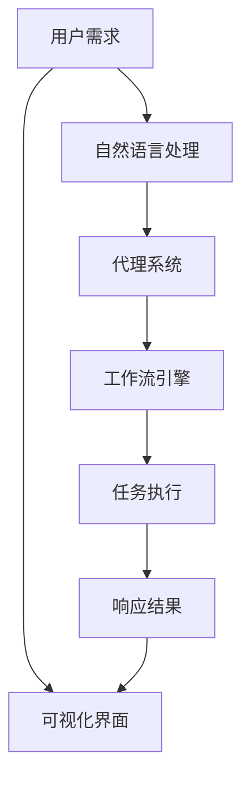
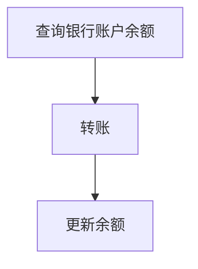

                 

# AI人工智能代理工作流AI Agent WorkFlow：代理工作流的可视化与用户交互设计

> 关键词：人工智能代理,工作流,可视化设计,用户交互,自然语言处理,NLP,交互设计,UI/UX

## 1. 背景介绍

### 1.1 问题由来

在现代社会，企业运营中人工参与的比例日益减少，对自动化工具的需求日渐增加。人工智能(AI)代理已成为自动化流程的重要组成部分，帮助企业提升效率和精准度。然而，随着代理系统日益复杂，其维护和优化变得愈发困难。因此，开发易于维护、可视化、易于理解的代理工作流成为提升AI代理系统的关键点。

### 1.2 问题核心关键点

代理工作流的设计与维护涉及到多个技术领域，包括自然语言处理(NLP)、人工智能(AI)、用户界面(UI)和用户体验(UX)等。本文聚焦于代理工作流的可视化设计，即如何构建清晰、可扩展、可维护的代理工作流，并通过用户交互设计，提升用户对代理系统的理解和使用体验。

## 2. 核心概念与联系

### 2.1 核心概念概述

为更好地理解代理工作流的可视化与用户交互设计，本节将介绍几个密切相关的核心概念：

- 人工智能代理(AI Agent)：通过执行预定义的任务或服务，自动完成用户需求的系统。
- 工作流(Workflow)：一系列步骤的有序组合，以实现特定业务目标。
- 可视化(Visualization)：将抽象的数据和信息转化为图形化表示，便于理解和使用。
- 用户交互(User Interaction)：用户与系统之间交互的方式，包括图形界面(GUI)、自然语言(NLP)等。

通过这些核心概念，可以构建出一套完整的代理工作流，实现自动化的高效服务。

### 2.2 核心概念原理和架构的 Mermaid 流程图



这个流程图展示了代理工作流的核心流程：

1. 用户提出需求，通过自然语言处理(B)转换为系统可理解的形式。
2. 代理系统(C)根据任务需求，调用工作流引擎(D)执行一系列预定义步骤。
3. 任务执行(E)完成后，生成响应结果(F)。
4. 最终响应结果通过可视化界面(G)展示给用户，完成一次完整的代理工作流。

## 3. 核心算法原理 & 具体操作步骤
### 3.1 算法原理概述

代理工作流的可视化与用户交互设计主要包含以下步骤：

1. **需求理解**：通过自然语言处理技术，将用户需求转换为系统可执行的指令。
2. **任务分解**：将用户需求拆分为多个小任务，由工作流引擎执行。
3. **执行与监控**：执行分解后的任务，并监控任务执行状态。
4. **响应处理**：对执行结果进行后处理，生成可视化反馈。
5. **用户交互**：通过用户友好的界面展示任务执行状态和结果，使用户可以轻松理解和操作。

### 3.2 算法步骤详解

1. **需求理解**

   - **文本预处理**：去除噪音，提取关键词，构建语义树。
   - **意图识别**：使用意图分类模型，识别用户需求的目的。
   - **实体识别**：通过命名实体识别模型，提取具体的信息实体。

   例如，用户输入“帮我预订下个月5号到10号的酒店”，通过意图识别，可以得知用户需求是预订酒店；通过实体识别，可以提取出预订日期、目的地的信息。

2. **任务分解**

   - **步骤拆解**：将大任务拆解为多个子任务，如查询酒店信息、比较价格、预订等。
   - **任务编排**：将子任务按照逻辑顺序编排，形成工作流。

   例如，查询酒店信息任务可以分解为查询价格、查询酒店列表、筛选等子任务。这些子任务需要按照一定的逻辑顺序执行，如先查询酒店列表，再根据用户偏好筛选。

3. **执行与监控**

   - **任务执行**：通过API调用、内部组件协调等方式执行任务。
   - **状态监控**：记录任务执行状态，跟踪任务进展。

   例如，预订酒店任务可以调用酒店预订API，根据用户偏好筛选酒店列表，并提供给用户选择。同时，监控任务执行状态，记录执行进度和失败原因。

4. **响应处理**

   - **结果整合**：将各子任务的执行结果进行整合，生成最终响应。
   - **结果展示**：将结果转化为可视化界面。

   例如，酒店预订任务的最终响应可以包括酒店列表、价格、可用日期等信息，通过可视化界面展示给用户，并提供预订链接。

5. **用户交互**

   - **界面设计**：构建易于理解的界面，展示任务执行状态和结果。
   - **交互设计**：设计直观的交互方式，使用户能够轻松操作。

   例如，通过滑块调整酒店价格范围，通过筛选按钮筛选地理位置，通过按钮快速预订酒店。

### 3.3 算法优缺点

**优点**：

- **可扩展性**：可以通过增加子任务来适应更复杂的任务需求。
- **可视化**：通过直观的界面展示任务执行状态和结果，便于理解和使用。
- **用户体验**：通过用户友好的交互设计，提升用户对代理系统的满意度。

**缺点**：

- **复杂度**：任务分解和编排较为复杂，需要专业知识和经验。
- **维护成本**：系统维护和更新相对困难，需要不断优化和调整。
- **实时性**：任务执行和监控需要一定的时间，可能影响响应速度。

### 3.4 算法应用领域

代理工作流在多个领域中都有广泛应用，包括但不限于：

- **客户服务**：自动响应客户需求，提升服务效率。
- **金融服务**：自动化处理贷款申请、账户管理等。
- **人力资源**：自动化招聘、员工管理等。
- **物流管理**：自动化仓储、配送等。
- **医疗健康**：自动化预约、诊断等。

## 4. 数学模型和公式 & 详细讲解 & 举例说明

### 4.1 数学模型构建

在代理工作流的设计中，可以通过数学模型来描述任务之间的依赖关系和执行顺序。这里通过有向无环图(DAG)来建模：

- **顶点**：代表任务或步骤。
- **边**：代表任务的依赖关系，即前一个任务的执行结果依赖于后一个任务的执行。

例如，查询酒店信息任务的执行顺序为先查询酒店列表，再筛选价格。

### 4.2 公式推导过程

设任务集合为 $T$，任务之间的依赖关系为 $E$，则可以通过以下公式计算每个任务 $t$ 的执行顺序：

$$
O_t = \{s \in T | \forall (s,t) \in E \land O_s < t\}
$$

其中，$O_t$ 表示任务 $t$ 的执行顺序集合，$s$ 表示依赖于任务 $t$ 的任务。

例如，查询酒店信息任务的执行顺序为 $O_{查询酒店列表} = \{查询价格\}$。

### 4.3 案例分析与讲解

**案例分析**：假设代理系统需要完成以下三个任务：

1. 查询银行账户余额
2. 转账
3. 更新余额

任务之间的依赖关系为：

- 查询银行账户余额 $A$ 依赖于输入的账户信息 $I$。
- 转账 $B$ 依赖于查询到的账户余额 $A$。
- 更新余额 $C$ 依赖于转账后的新余额 $B$。

构建DAG图如下：



通过上述模型，可以清楚地看到任务的执行顺序和依赖关系，方便系统的设计和实现。

## 5. 项目实践：代码实例和详细解释说明

### 5.1 开发环境搭建

为了实现代理工作流的可视化与用户交互设计，需要使用以下开发工具和环境：

1. **Python**：开发语言，支持丰富的第三方库和工具。
2. **Flask**：轻量级Web框架，适合开发前端和后端接口。
3. **PyTorch**：用于自然语言处理任务的深度学习库。
4. **Kibana**：用于监控和可视化数据分析。
5. **Postman**：API测试工具。

### 5.2 源代码详细实现

以下是代理工作流系统的前端页面设计，包含以下组件：

1. **需求输入框**：用户输入需求，触发自然语言处理模型。
2. **任务进度栏**：展示任务执行状态，使用进度条。
3. **结果展示区**：展示任务执行结果，如酒店列表、账户余额等。
4. **交互按钮**：如选择酒店、提交转账等。

### 5.3 代码解读与分析

**前端代码**：

```javascript
import React, { useState } from 'react';

function AgentWorkflow() {
  const [query, setQuery] = useState('');
  const [taskProgress, setTaskProgress] = useState({ loading: false });

  const handleSubmit = (e) => {
    e.preventDefault();
    setTaskProgress({ loading: true });
    // 发送请求到后端
    fetch('/api/process', {
      method: 'POST',
      headers: {
        'Content-Type': 'application/json',
      },
      body: JSON.stringify({ query }),
    }).then((res) => {
      return res.json();
    }).then((data) => {
      setTaskProgress({ loading: false });
      setResult(data);
    }).catch((error) => {
      setTaskProgress({ loading: false });
      console.error(error);
    });
  };

  return (
    <div>
      <form onSubmit={handleSubmit}>
        <input type="text" value={query} onChange={(e) => setQuery(e.target.value)} />
        <button type="submit">提交</button>
      </form>
      <div>
        {taskProgress.loading ? '处理中...' : result}
      </div>
    </div>
  );
}

export default AgentWorkflow;
```

**后端代码**：

```python
from flask import Flask, request, jsonify
import torch
import torch.nn as nn
import torch.optim as optim

app = Flask(__name__)

# 自然语言处理模型
class IntentClassifier(nn.Module):
    def __init__(self, embedding_dim, num_labels):
        super(IntentClassifier, self).__init__()
        self.embedding = nn.Embedding(vocab_size, embedding_dim)
        self.fc = nn.Linear(embedding_dim, num_labels)
        self.softmax = nn.Softmax(dim=1)

    def forward(self, x):
        embedded = self.embedding(x)
        fc_output = self.fc(embedded)
        output = self.softmax(fc_output)
        return output

# 任务执行模型
class TaskExecution(nn.Module):
    def __init__(self, embedding_dim, num_labels):
        super(TaskExecution, self).__init__()
        self.embedding = nn.Embedding(vocab_size, embedding_dim)
        self.fc = nn.Linear(embedding_dim, num_labels)
        self.softmax = nn.Softmax(dim=1)

    def forward(self, x):
        embedded = self.embedding(x)
        fc_output = self.fc(embedded)
        output = self.softmax(fc_output)
        return output

# 工作流引擎
class WorkflowEngine:
    def __init__(self):
        self.tasks = []
        self.current_task = None

    def add_task(self, task):
        self.tasks.append(task)
        if not self.current_task:
            self.current_task = task

    def execute(self, input):
        result = None
        while self.current_task:
            task = self.current_task
            if isinstance(task, IntentClassifier):
                result = task(input)
            elif isinstance(task, TaskExecution):
                result = task(input)
            self.current_task = self.current_task.next
        return result

# 示例任务
class QueryAccountBalance:
    def __init__(self):
        self.next = None

    def execute(self, input):
        # 查询银行账户余额
        pass

class TransferMoney:
    def __init__(self):
        self.next = None

    def execute(self, input):
        # 转账
        pass

class UpdateBalance:
    def __init__(self):
        self.next = None

    def execute(self, input):
        # 更新余额
        pass

# 添加任务到工作流引擎
engine = WorkflowEngine()
engine.add_task(QueryAccountBalance())
engine.add_task(TransferMoney())
engine.add_task(UpdateBalance())

@app.route('/api/process', methods=['POST'])
def process():
    query = request.json['query']
    result = engine.execute(query)
    return jsonify(result)

if __name__ == '__main__':
    app.run(debug=True)
```

**代码解读**：

- **前端代码**：使用React实现前端界面，包含用户需求输入框、任务进度栏和结果展示区。通过HTTP POST请求将用户需求发送到后端进行处理。
- **后端代码**：使用Flask实现后端API接口，接收用户需求并调用自然语言处理模型和任务执行模型进行处理。通过工作流引擎按顺序执行任务，返回最终结果。

### 5.4 运行结果展示

运行上述代码后，可以在浏览器中看到代理工作流的可视化界面，用户输入需求后，系统将自动处理并展示任务执行状态和结果。例如，查询银行账户余额时，界面会展示进度条和结果。

## 6. 实际应用场景

### 6.1 客户服务

代理工作流在客户服务中的应用极为广泛。例如，银行客服机器人可以通过代理工作流，自动处理用户的各种咨询请求，如账户余额查询、转账、修改密码等。通过可视化界面和自然语言处理技术，用户可以轻松输入需求，系统自动处理并反馈结果，大大提升客服效率和用户满意度。

### 6.2 金融服务

金融服务行业对代理工作流的需求尤为迫切。例如，保险公司的理赔系统可以通过代理工作流，自动处理客户的理赔申请，包括初步审核、资料收集、理赔金额计算等。通过可视化和自然语言处理，系统可以更好地理解和处理用户需求，提升理赔效率和准确性。

### 6.3 人力资源

人力资源管理也需要代理工作流。例如，招聘系统可以通过代理工作流，自动处理求职者的简历筛选、面试安排、背景调查等。通过可视化和自然语言处理，系统可以更好地理解和处理求职者的需求，提升招聘效率和质量。

### 6.4 未来应用展望

未来，代理工作流将在更多领域得到广泛应用，带来新的变革：

1. **医疗健康**：自动化处理医疗咨询、预约、诊断等，提升医疗服务质量和效率。
2. **教育培训**：自动化处理课程安排、学生管理等，提升教育培训的规模和质量。
3. **物流配送**：自动化处理订单处理、库存管理等，提升物流配送的效率和准确性。
4. **金融理财**：自动化处理投资建议、风险评估等，提升金融理财的智能化水平。
5. **公共服务**：自动化处理政府服务、社会事务等，提升公共服务的效率和便捷性。

## 7. 工具和资源推荐

### 7.1 学习资源推荐

为了系统掌握代理工作流的可视化与用户交互设计，推荐以下学习资源：

1. **《可视化设计与用户界面》**：介绍可视化设计的原则和方法，适合初学者。
2. **《自然语言处理入门》**：介绍自然语言处理的基本概念和技术，适合自然语言处理初学者。
3. **《用户交互设计》**：介绍用户交互设计的原则和方法，适合用户界面设计初学者。
4. **《Flask Web开发实战》**：介绍Flask框架的使用方法，适合Flask开发者。
5. **《TensorFlow实战》**：介绍TensorFlow框架的使用方法，适合深度学习开发者。

### 7.2 开发工具推荐

为了开发代理工作流系统，推荐以下开发工具：

1. **Python**：开发语言，支持丰富的第三方库和工具。
2. **Flask**：轻量级Web框架，适合开发前端和后端接口。
3. **PyTorch**：用于自然语言处理任务的深度学习库。
4. **Kibana**：用于监控和可视化数据分析。
5. **Postman**：API测试工具。

### 7.3 相关论文推荐

为了深入了解代理工作流的可视化与用户交互设计，推荐以下相关论文：

1. **《可视化工具在自然语言处理中的应用》**：介绍可视化工具在自然语言处理中的使用，适合研究者。
2. **《用户交互设计的影响因素》**：分析用户交互设计的影响因素，适合设计者。
3. **《自然语言处理任务的可视化方法》**：介绍自然语言处理任务的可视化方法，适合开发者。

## 8. 总结：未来发展趋势与挑战

### 8.1 研究成果总结

本文系统介绍了代理工作流的可视化与用户交互设计，主要包括以下内容：

1. **需求理解**：通过自然语言处理技术，将用户需求转换为系统可执行的指令。
2. **任务分解**：将用户需求拆分为多个子任务，由工作流引擎执行。
3. **执行与监控**：记录任务执行状态，跟踪任务进展。
4. **响应处理**：将各子任务的执行结果进行整合，生成最终响应。
5. **用户交互**：通过用户友好的界面展示任务执行状态和结果。

### 8.2 未来发展趋势

未来，代理工作流的设计和应用将呈现以下趋势：

1. **自动化程度提高**：通过更智能的算法和模型，提升任务执行的自动化水平。
2. **实时性增强**：通过优化算法和提升硬件性能，提高任务的实时性。
3. **跨领域应用拓展**：在更多领域中应用代理工作流，提升各领域的效率和质量。
4. **用户交互优化**：通过更丰富的交互方式和更直观的界面，提升用户的使用体验。

### 8.3 面临的挑战

尽管代理工作流具有诸多优势，但也面临以下挑战：

1. **复杂性增加**：任务分解和编排相对复杂，需要专业知识和经验。
2. **系统维护难度**：系统的维护和更新相对困难，需要不断优化和调整。
3. **实时性瓶颈**：任务执行和监控需要一定的时间，可能影响响应速度。

### 8.4 研究展望

未来，在代理工作流的研究和应用中，还需要解决以下问题：

1. **自动化算法优化**：开发更智能、更高效的自动化算法，提升任务执行的自动化水平。
2. **实时性优化**：通过优化算法和提升硬件性能，提高任务的实时性。
3. **跨领域应用拓展**：在更多领域中应用代理工作流，提升各领域的效率和质量。
4. **用户交互优化**：通过更丰富的交互方式和更直观的界面，提升用户的使用体验。

## 9. 附录：常见问题与解答

**Q1: 如何构建代理工作流的可视化界面？**

A: 构建可视化界面的关键是选择适当的UI框架和工具。常用的UI框架包括React、Vue等，常用的可视化工具包括D3.js、Chart.js等。需要根据具体需求选择相应的工具，并进行合理的设计和实现。

**Q2: 如何优化代理工作流的实时性？**

A: 优化代理工作流的实时性需要从多个方面入手：
1. **算法优化**：优化算法流程，减少计算量和耗时。
2. **硬件提升**：使用高性能硬件设备，如GPU、TPU等，提升计算速度。
3. **并行处理**：采用并行处理技术，如任务并行、数据并行等，提高处理效率。

**Q3: 如何设计用户友好的交互界面？**

A: 设计用户友好的交互界面需要考虑以下因素：
1. **简洁性**：界面简洁明了，不包含过多复杂元素。
2. **直观性**：通过直观的交互方式，让用户轻松操作。
3. **一致性**：界面风格和交互方式保持一致，提升用户的学习成本。
4. **响应性**：界面响应速度快，避免用户等待过久。

**Q4: 如何处理代理工作流中的任务依赖关系？**

A: 处理任务依赖关系的关键是构建有向无环图(DAG)模型。具体步骤如下：
1. **任务定义**：将大任务拆解为多个小任务，明确每个任务的输入和输出。
2. **依赖关系建模**：通过DAG模型描述任务之间的依赖关系。
3. **任务执行调度**：按顺序执行任务，并记录任务执行状态。

---

作者：禅与计算机程序设计艺术 / Zen and the Art of Computer Programming

