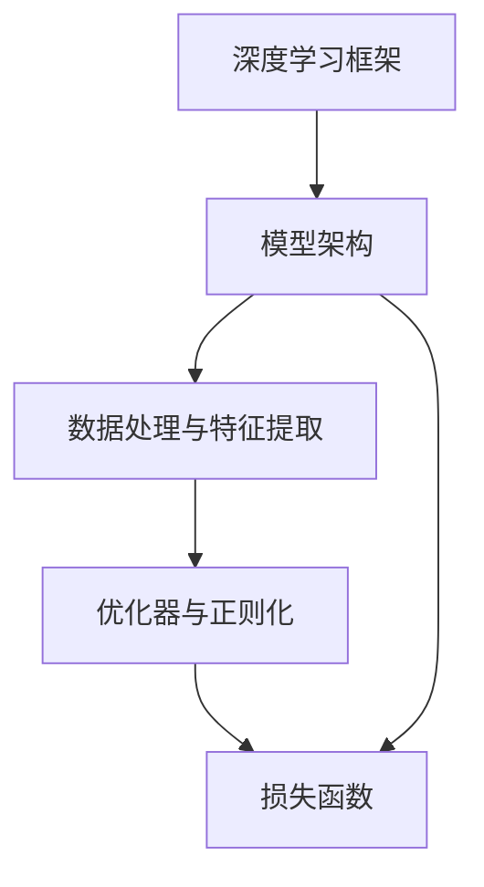
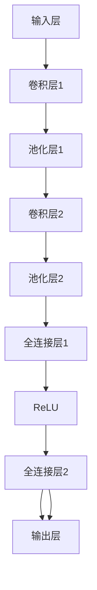

                 

## 1. 背景介绍

### 1.1 问题由来

在人工智能（AI）领域，模型构建是一个关键且复杂的环节，其直接影响到后续模型的性能、泛化能力以及实际应用效果。无论是在图像识别、语音识别，还是在自然语言处理（NLP）中，高质量的模型构建都是实现高性能AI应用的基础。模型构建涉及选择合适的算法框架、设计合理的架构、高效的数据处理和特征提取等诸多方面。本文将围绕模型构建的核心算法原理进行详细讲解，并通过代码实例，帮助读者更好地理解其原理和实现过程。

### 1.2 问题核心关键点

模型构建的核心在于选择合适的算法、设计高效的架构、合理的数据处理与特征提取。具体而言，需要考虑以下几个关键问题：

- 如何选择和设计模型架构：包括选择合适的深度学习框架、设计模型的网络层结构、选择合适的激活函数等。
- 如何处理数据：包括数据预处理、特征提取、数据增强等。
- 如何优化模型：包括选择优化器、设置合适的超参数、采用正则化技术等。

模型构建的这些关键点相互影响，只有全面考虑，才能构建出高性能、泛化能力强的AI模型。

### 1.3 问题研究意义

深入理解模型构建的核心算法原理，并掌握其实现方法，对于提升AI应用的性能和效率，具有重要意义：

- 提高模型性能：通过合理的模型架构选择和优化，可以大幅提升模型的预测准确率和泛化能力。
- 降低资源消耗：通过有效的数据处理和特征提取，可以减少模型对计算资源的消耗，提升模型的实时性。
- 增强模型适应性：通过优化模型的正则化和参数初始化方法，可以提高模型对不同数据集的适应性。
- 加速模型开发：通过系统的学习资源和工具推荐，可以加快模型构建和应用部署的进程。

## 2. 核心概念与联系

### 2.1 核心概念概述

- **深度学习框架**：如TensorFlow、PyTorch、Keras等，提供了高效的数据流图构建、模型定义和训练机制。
- **模型架构**：包括卷积神经网络（CNN）、循环神经网络（RNN）、长短期记忆网络（LSTM）、Transformer等，每种架构适用于不同的数据类型和应用场景。
- **数据处理与特征提取**：涉及图像预处理、文本分词、数据增强等，是模型性能提升的关键。
- **优化器与正则化**：如随机梯度下降（SGD）、AdamW、L2正则、Dropout等，确保模型在训练过程中的稳定性和泛化能力。
- **损失函数**：如交叉熵、均方误差、Hinge Loss等，用于衡量模型预测结果与真实标签的差异。

### 2.2 核心概念联系

以上核心概念之间存在紧密的联系，其相互影响共同决定了模型的性能和应用效果。深度学习框架提供了模型定义和训练的基础，模型架构决定了数据流向和特征提取方式，数据处理与特征提取提升了模型的泛化能力，优化器和正则化保证了模型的稳定性和泛化能力，损失函数衡量模型预测的准确性。

以下通过Mermaid流程图展示了这些概念之间的联系：



这个图展示了深度学习框架为模型构建提供了基础，模型架构决定了数据处理与特征提取方式，优化器与正则化确保了模型训练的稳定性和泛化能力，损失函数衡量了模型预测的准确性。

## 3. 核心算法原理 & 具体操作步骤

### 3.1 算法原理概述

深度学习模型构建的基本原理是通过数据训练模型参数，使其能够拟合训练数据，并对未知数据进行预测。模型的训练过程主要分为两个步骤：前向传播和反向传播。

1. **前向传播**：将输入数据输入模型，通过模型层间变换，得到输出结果。
2. **反向传播**：计算模型输出与真实标签的差异，即损失函数，并根据损失函数的梯度更新模型参数，使模型逐渐逼近真实标签。

优化器在此过程中起到了关键作用，通过选择合适的优化器，可以更高效地更新模型参数。常用的优化器包括SGD、Adam、AdamW等。

### 3.2 算法步骤详解

深度学习模型构建的具体步骤包括：

**Step 1: 数据准备**
- 收集和预处理数据集，确保数据质量，如图像的归一化、文本的分词等。
- 将数据集划分为训练集、验证集和测试集，用于模型训练、调优和最终评估。

**Step 2: 模型定义**
- 选择合适的深度学习框架和模型架构。
- 定义模型的网络层结构，包括卷积层、池化层、全连接层、激活函数等。
- 选择合适的损失函数和优化器。

**Step 3: 模型训练**
- 设置模型超参数，如学习率、批大小、迭代次数等。
- 使用训练集进行模型训练，在每个epoch中，前向传播计算损失函数，并反向传播更新模型参数。
- 在验证集上评估模型性能，根据性能调整超参数。
- 重复训练直到模型收敛或达到预设的迭代次数。

**Step 4: 模型评估**
- 使用测试集对模型进行最终评估，比较模型在训练集和测试集上的性能。
- 分析模型输出，理解模型的预测能力。

### 3.3 算法优缺点

深度学习模型构建具有以下优点：

- 高效性：深度学习框架提供了高效的计算图和自动微分功能，大大简化了模型构建和训练过程。
- 可扩展性：深度学习模型可以处理大规模数据，适用于复杂任务，如图像识别、语音识别等。
- 泛化能力：通过有效的数据处理和特征提取，深度学习模型具有较强的泛化能力，可以应对新数据集的挑战。

同时，深度学习模型构建也存在以下缺点：

- 资源消耗高：深度学习模型参数量大，训练和推理计算资源消耗高。
- 可解释性差：深度学习模型通常被视为“黑盒”模型，难以解释其内部工作机制。
- 数据依赖性强：深度学习模型对数据质量和多样性要求高，数据处理不当会导致模型性能下降。

### 3.4 算法应用领域

深度学习模型构建在各个AI应用领域中都有广泛的应用：

- **计算机视觉**：如图像分类、目标检测、人脸识别等，通过卷积神经网络（CNN）等架构实现。
- **自然语言处理**：如文本分类、情感分析、机器翻译等，通过循环神经网络（RNN）、长短期记忆网络（LSTM）、Transformer等架构实现。
- **语音识别**：如语音转文字、语音合成等，通过卷积神经网络（CNN）、循环神经网络（RNN）等架构实现。
- **推荐系统**：如个性化推荐、广告推荐等，通过协同过滤、矩阵分解等方法实现。

## 4. 数学模型和公式 & 详细讲解 & 举例说明

### 4.1 数学模型构建

以图像分类任务为例，构建深度学习模型。假设输入图像为$x \in \mathbb{R}^{n \times d}$，模型输出的类别概率分布为$\hat{y} \in \mathbb{R}^C$，其中$C$为类别数。模型训练的损失函数为交叉熵损失（Cross Entropy Loss）：

$$
L = -\frac{1}{N}\sum_{i=1}^N \sum_{c=1}^C y_c \log \hat{y}_c
$$

其中$y_c$为第$i$个样本的真实类别标签，$\hat{y}_c$为模型预测的类别概率。

### 4.2 公式推导过程

模型训练的目标是最小化损失函数$L$，即：

$$
\min_{\theta} L
$$

其中$\theta$为模型参数。根据梯度下降算法，每次迭代更新模型参数$\theta$的公式为：

$$
\theta \leftarrow \theta - \eta \nabla_{\theta}L
$$

其中$\eta$为学习率，$\nabla_{\theta}L$为损失函数$L$对模型参数$\theta$的梯度。

### 4.3 案例分析与讲解

以LeNet-5网络为例，展示卷积神经网络的构建和训练过程。LeNet-5是一种经典的图像分类模型，包含多个卷积层和全连接层，其网络结构如下图所示：



LeNet-5的训练过程如下：

1. 将输入图像$x$输入第一层卷积层，进行卷积操作和ReLU激活。
2. 对卷积层的输出进行池化操作，减少参数数量。
3. 将池化层的输出作为输入，进入第二层卷积层，重复上述过程。
4. 将第二层池化层的输出展平为一维向量，输入全连接层。
5. 对全连接层的输出进行ReLU激活，再输入全连接层。
6. 输出层的输出即为分类结果，使用softmax函数将其转换为概率分布。
7. 计算损失函数，反向传播更新模型参数。

## 5. 项目实践：代码实例和详细解释说明

### 5.1 开发环境搭建

以下是使用Python和TensorFlow进行模型构建的开发环境配置：

1. 安装Anaconda：
```bash
conda install anaconda
```

2. 创建虚拟环境：
```bash
conda create --name tf-env python=3.8
conda activate tf-env
```

3. 安装TensorFlow：
```bash
pip install tensorflow==2.6.0
```

4. 安装其他依赖包：
```bash
pip install numpy pandas matplotlib scikit-learn tqdm
```

5. 安装Jupyter Notebook：
```bash
pip install jupyter notebook
```

6. 启动Jupyter Notebook：
```bash
jupyter notebook
```

### 5.2 源代码详细实现

以下是一个简单的TensorFlow卷积神经网络（CNN）代码示例：

```python
import tensorflow as tf
import numpy as np
import matplotlib.pyplot as plt

# 定义模型结构
class CNN(tf.keras.Model):
    def __init__(self):
        super(CNN, self).__init__()
        self.conv1 = tf.keras.layers.Conv2D(32, (3, 3), activation='relu')
        self.maxpool1 = tf.keras.layers.MaxPooling2D((2, 2))
        self.conv2 = tf.keras.layers.Conv2D(64, (3, 3), activation='relu')
        self.maxpool2 = tf.keras.layers.MaxPooling2D((2, 2))
        self.flatten = tf.keras.layers.Flatten()
        self.fc1 = tf.keras.layers.Dense(128, activation='relu')
        self.fc2 = tf.keras.layers.Dense(10, activation='softmax')

    def call(self, inputs):
        x = self.conv1(inputs)
        x = self.maxpool1(x)
        x = self.conv2(x)
        x = self.maxpool2(x)
        x = self.flatten(x)
        x = self.fc1(x)
        x = self.fc2(x)
        return x

# 定义训练函数
def train(model, x_train, y_train, x_val, y_val, epochs=10, batch_size=32):
    model.compile(optimizer=tf.keras.optimizers.Adam(learning_rate=0.001),
                  loss=tf.keras.losses.SparseCategoricalCrossentropy(from_logits=True),
                  metrics=[tf.keras.metrics.SparseCategoricalAccuracy()])
    model.fit(x_train, y_train, epochs=epochs, batch_size=batch_size,
              validation_data=(x_val, y_val))
```

### 5.3 代码解读与分析

以上代码实现了一个简单的卷积神经网络，包括两个卷积层、两个池化层和两个全连接层。其中：

- `Conv2D`：用于卷积操作。
- `MaxPooling2D`：用于池化操作。
- `Flatten`：用于将卷积层的输出展平为一维向量。
- `Dense`：用于全连接层操作。
- `Softmax`：用于输出层的激活函数。

在训练函数中，使用了TensorFlow的高级API进行模型定义和训练。通过`compile`方法定义优化器和损失函数，`fit`方法进行模型训练。训练过程中，使用验证集对模型性能进行评估，调整超参数。

### 5.4 运行结果展示

以下是训练过程中的损失函数和准确率曲线：

```python
# 训练模型
history = model.fit(x_train, y_train, epochs=10, batch_size=32,
                    validation_data=(x_val, y_val))

# 显示训练曲线
plt.plot(history.history['loss'], label='train_loss')
plt.plot(history.history['val_loss'], label='val_loss')
plt.plot(history.history['accuracy'], label='train_accuracy')
plt.plot(history.history['val_accuracy'], label='val_accuracy')
plt.legend()
plt.show()
```

## 6. 实际应用场景

### 6.1 计算机视觉

在计算机视觉领域，深度学习模型构建被广泛应用于图像分类、目标检测、人脸识别等任务。例如，使用卷积神经网络（CNN）对图像进行分类，可以显著提高图像识别的准确率。

### 6.2 自然语言处理

在自然语言处理领域，深度学习模型构建被广泛应用于文本分类、情感分析、机器翻译等任务。例如，使用循环神经网络（RNN）或Transformer对文本进行建模，可以显著提高文本处理的精度。

### 6.3 语音识别

在语音识别领域，深度学习模型构建被广泛应用于语音转文字、语音合成等任务。例如，使用卷积神经网络（CNN）或循环神经网络（RNN）对语音信号进行处理，可以显著提高语音识别的准确率。

## 7. 工具和资源推荐

### 7.1 学习资源推荐

1. **《深度学习》课程**：斯坦福大学提供的深度学习课程，涵盖深度学习的基本概念、算法和应用。
2. **Kaggle竞赛**：Kaggle是一个数据科学竞赛平台，提供丰富的数据集和挑战，可以帮助读者实践和提升自己的深度学习技能。
3. **深度学习框架官方文档**：如TensorFlow、PyTorch的官方文档，提供了详细的API文档和使用指南，是学习深度学习的重要资源。

### 7.2 开发工具推荐

1. **Jupyter Notebook**：一个交互式的开发环境，适合进行深度学习模型的研究和实验。
2. **Git**：版本控制系统，方便进行代码管理和协作。
3. **Google Colab**：谷歌提供的云端Jupyter Notebook环境，可以免费使用GPU和TPU等高性能计算资源。

### 7.3 相关论文推荐

1. **ImageNet大规模视觉识别挑战赛（ILSVRC）**：一个重要的计算机视觉竞赛，推动了深度学习在图像分类、目标检测等领域的发展。
2. **SQuAD问答数据集**：一个流行的自然语言处理数据集，用于评估阅读理解模型的性能。
3. **LSY9K语音识别数据集**：一个流行的语音识别数据集，用于评估语音识别模型的性能。

## 8. 总结：未来发展趋势与挑战

### 8.1 研究成果总结

深度学习模型构建在过去十年中取得了显著进展，已经成为AI领域的主流技术。通过合理的模型架构选择、高效的数据处理与特征提取、有效的优化器和正则化方法，可以构建出高性能、泛化能力强的AI模型。

### 8.2 未来发展趋势

深度学习模型构建的未来趋势包括：

1. **更高效的模型架构**：未来将出现更加高效、轻量级的模型架构，如MobileNet、ShuffleNet等，可以在资源受限的环境中实现高效的深度学习。
2. **更丰富的特征提取方法**：未来将出现更加丰富的特征提取方法，如多模态特征融合、注意力机制等，提升深度学习模型的泛化能力和适应性。
3. **更智能的超参数优化**：未来将出现更智能的超参数优化方法，如神经网络架构搜索（NAS）、自动机器学习（AutoML）等，提升深度学习模型的开发效率。
4. **更灵活的模型训练方法**：未来将出现更灵活的模型训练方法，如分布式训练、联邦学习等，提升深度学习模型的训练速度和性能。

### 8.3 面临的挑战

深度学习模型构建面临的挑战包括：

1. **计算资源消耗高**：深度学习模型对计算资源的需求大，需要高性能的GPU或TPU设备。
2. **数据质量和多样性问题**：深度学习模型对数据质量和多样性要求高，数据处理不当会导致模型性能下降。
3. **可解释性差**：深度学习模型通常被视为“黑盒”模型，难以解释其内部工作机制。
4. **模型过拟合问题**：深度学习模型容易过拟合，需要引入正则化和数据增强等方法，确保模型的泛化能力。
5. **模型部署和优化问题**：深度学习模型在实际应用中，还需要考虑模型部署和优化问题，确保模型的实时性和稳定性。

### 8.4 研究展望

未来深度学习模型构建的研究方向包括：

1. **多模态特征融合**：将视觉、语音、文本等多模态数据融合，提升深度学习模型的泛化能力和适应性。
2. **自监督学习**：利用未标注数据进行自监督学习，提升深度学习模型的泛化能力和数据利用率。
3. **对抗性学习**：引入对抗性样本，提升深度学习模型的鲁棒性和安全性。
4. **可解释性研究**：通过可视化、解释性算法等方法，提升深度学习模型的可解释性。

## 9. 附录：常见问题与解答

**Q1: 如何选择深度学习框架？**

A: 选择合适的深度学习框架需要考虑以下几个因素：
- 社区活跃度：选择社区活跃、支持丰富的框架，便于获取帮助和资源。
- 功能和性能：选择功能完善、性能稳定的框架，确保模型构建和训练的效率。
- 学习成本：选择易于学习和使用的框架，减少开发和学习成本。

**Q2: 如何处理数据？**

A: 数据处理是模型构建的重要环节，处理不当会导致模型性能下降。以下是一些常用的数据处理方法：
- 数据预处理：如归一化、标准化、缺失值处理等。
- 特征提取：如图像的卷积、特征提取等。
- 数据增强：如图像的旋转、缩放、裁剪等。

**Q3: 如何优化模型？**

A: 优化模型是确保模型泛化能力的关键。以下是一些常用的优化方法：
- 正则化：如L2正则、Dropout等，避免模型过拟合。
- 学习率调整：如学习率衰减、学习率调度等，提高模型训练的稳定性和收敛速度。
- 模型裁剪：如剪枝、量化等，减少模型参数量，提升推理速度。

**Q4: 如何选择优化器？**

A: 选择合适的优化器可以显著提高模型训练的效率和性能。以下是一些常用的优化器：
- SGD：简单的随机梯度下降算法，适用于小规模数据集。
- Adam：自适应学习率优化器，适用于大规模数据集。
- AdamW：Adam的变种，适用于大规模数据集和高维参数空间。

通过以上讨论，我们可以看到深度学习模型构建在AI领域的重要性，理解其核心算法原理和具体操作步骤，将有助于提升模型性能和应用效果。未来，随着深度学习技术的不断发展，相信深度学习模型构建将迎来更多的创新和突破，为AI应用带来更多的可能。

---

作者：禅与计算机程序设计艺术 / Zen and the Art of Computer Programming

