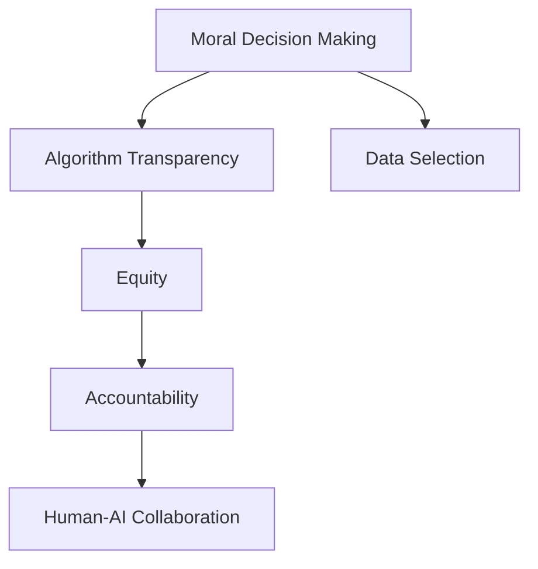

                 

# AI人工智能核心算法原理与代码实例讲解：道德决策

> 关键词：人工智能,道德决策,算法,核心算法,代码实例

## 1. 背景介绍

### 1.1 问题由来
人工智能(AI)技术在快速发展的过程中，逐步渗透到社会各个角落，影响着人类生活的方方面面。随着AI算法的复杂性和决策能力的提升，其在道德、法律、伦理等方面的问题也日益突出。例如，自动驾驶汽车的道德决策问题，机器人手术中的医疗伦理问题，以及在线广告系统的个性化推荐问题。

这些问题不仅涉及技术实现，还牵扯到社会伦理和公共政策的制定。因此，如何在AI算法中加入道德考量，使得其在技术高效和道德合法之间取得平衡，成为了当下人工智能领域的一个重大挑战。

### 1.2 问题核心关键点
道德决策问题关注的核心在于如何在AI算法中融入道德原则和价值观，以确保其在做出决策时不会对社会、个人产生负面影响。具体而言，包括以下几个关键点：

- **道德考量**：如何在算法设计中体现和融入道德原则，如公正、透明、责任等。
- **数据选择**：如何确保用于训练和测试的样本数据本身不包含偏见，同时反映多样性和公平性。
- **算法透明**：如何让AI算法的行为决策过程透明，便于审计和解释，以增强公众信任。
- **责任分配**：如何在AI决策出现失误或伤害时，明确责任归属，保护利益相关方的权益。
- **人机协作**：如何构建人机协作机制，使得AI算法在辅助决策时，能让人类保持控制权和监督权。

这些问题交织在一起，形成了一个复杂的道德决策体系，需要在算法设计和实施过程中进行全面考虑。

## 2. 核心概念与联系

### 2.1 核心概念概述

为更好地理解AI在道德决策中的应用，本节将介绍几个密切相关的核心概念：

- **道德决策**：指在AI算法中，结合伦理原则和价值观，进行决策和行动的过程。
- **算法透明性**：指AI算法的行为决策过程是否公开透明，能否被外部审计和解释。
- **公正性**：指AI算法在处理不同群体或个体时，是否存在歧视或不平等现象。
- **责任归属**：指在AI决策产生负面后果时，如何分配和追究责任。
- **人机协作**：指人类和AI系统在共同完成决策任务时的分工和互动机制。

这些核心概念之间的逻辑关系可以通过以下Mermaid流程图来展示：



这个流程图展示了大语言模型的核心概念及其之间的关系：

1. 道德决策通过算法透明性体现，确保算法的公正性和责任归属。
2. 数据选择直接影响算法的公正性和透明性。
3. 责任归属是人机协作的关键，涉及伦理和法律问题。

这些概念共同构成了AI在道德决策中的应用框架，使其能够在确保技术高效的同时，符合伦理和法律要求。通过理解这些核心概念，我们可以更好地把握AI在道德决策中的工作原理和优化方向。

## 3. 核心算法原理 & 具体操作步骤
### 3.1 算法原理概述

道德决策的算法实现通常涉及以下几个关键步骤：

1. **道德原则嵌入**：将人类的道德原则和价值观嵌入到算法设计中，确保算法在决策过程中能够遵循这些原则。
2. **数据筛选与清洗**：对训练数据进行筛选和清洗，去除偏见数据，保证数据的多样性和公平性。
3. **算法透明性设计**：设计可解释的算法模型，使决策过程透明，便于审计和解释。
4. **责任分配机制**：在算法中建立责任分配机制，明确AI决策失误时的责任归属，保障利益相关方的权益。
5. **人机协作模型**：构建人机协作模型，使得人类在AI决策过程中保持控制权和监督权。

### 3.2 算法步骤详解

以下是具体道德决策算法的步骤详解：

**Step 1: 定义道德原则**
- 确定AI算法应遵循的道德原则和价值观，如公正、透明、责任等。这些原则应反映社会的普遍共识和法律要求。

**Step 2: 数据选择与清洗**
- 收集和筛选数据，去除可能带有偏见、歧视的数据，确保数据集的多样性和公平性。
- 对数据进行预处理，如去噪、归一化等，以提高模型的训练效果。

**Step 3: 算法透明性设计**
- 选择具有可解释性的算法模型，如决策树、规则集、线性回归等，使其决策过程透明。
- 设计自动解释工具，如LIME、SHAP等，对模型决策进行可视化，便于理解和解释。

**Step 4: 责任分配机制**
- 在算法中加入责任分配逻辑，明确在决策失误或伤害发生时的责任归属。
- 引入“责任链”概念，如Bowling Ball Technique，追踪决策路径，分配责任。

**Step 5: 人机协作模型**
- 设计人机协作界面，如交互式决策系统，使人类能够对AI决策进行监控和干预。
- 引入辅助决策机制，如规则集、专家系统等，辅助人类做出更明智的决策。

### 3.3 算法优缺点

道德决策算法具有以下优点：

1. **道德约束**：通过嵌入道德原则，确保AI算法决策符合伦理要求。
2. **透明性**：提高算法的透明性，便于审计和解释，增强公众信任。
3. **责任明确**：明确责任归属，保护利益相关方的权益。
4. **人机协作**：通过人机协作，增强决策的准确性和合理性。

同时，这些算法也存在以下局限性：

1. **原则冲突**：不同的道德原则之间可能存在冲突，难以在算法中同时体现。
2. **数据偏见**：数据筛选和清洗过程可能无法完全去除偏见，影响算法的公正性。
3. **复杂度增加**：道德决策算法的设计和实施增加了系统的复杂性，可能影响系统的性能。
4. **成本高昂**：道德决策算法的开发和部署成本较高，需要专业知识和资源投入。
5. **动态调整难**：道德原则可能随时间和环境变化，算法难以动态适应这些变化。

尽管存在这些局限性，但道德决策算法对于确保AI技术的社会责任和伦理合规至关重要。未来相关研究的重点在于如何平衡道德原则与技术实现，以及如何通过自动化技术降低道德决策的成本和复杂度。

### 3.4 算法应用领域

道德决策算法广泛应用于各种AI应用中，如：

- **自动驾驶汽车**：在遇到紧急情况时，如何决策以最小化伤亡和损害。
- **机器人手术**：在操作过程中，如何确保病人的安全和治疗效果。
- **在线广告系统**：如何防止歧视性广告，确保用户隐私和公平性。
- **金融风控系统**：如何识别欺诈行为，保护用户财产安全。
- **医疗诊断系统**：如何在诊断过程中考虑病人的个体差异和隐私保护。

除了上述这些典型应用外，道德决策算法还被创新性地应用到更多场景中，如智能合约、司法判决、社会福利分配等，为AI技术的发展提供了新的伦理保障。

## 4. 数学模型和公式 & 详细讲解 & 举例说明

### 4.1 数学模型构建

道德决策算法的数学模型构建涉及以下几个关键组成部分：

- **目标函数**：用于衡量AI决策的道德性和公正性，如公平指标、透明性指标等。
- **约束条件**：定义算法的道德原则和限制，如不得歧视、不得侵犯隐私等。
- **优化方法**：通过数学优化算法，在目标函数和约束条件之间寻找平衡点。

以公平性指标为例，设模型输出为 $y$，真实标签为 $y_t$，样本权重为 $w$，公平性约束函数为 $f(y,y_t)$，则公平性指标可以表示为：

$$
F(y,w) = \sum_{i=1}^n w_i f(y_i, y_t^i)
$$

其中 $n$ 为样本数量，$f(y_i, y_t^i)$ 为样本 $i$ 的公平性约束函数，$w_i$ 为样本权重。

### 4.2 公式推导过程

以公平性指标的计算为例，推导过程如下：

1. **公平性约束函数**：假设公平性约束函数为 $f(y_i, y_t^i) = (y_i - y_t^i)^2$，表示样本 $i$ 的预测输出 $y_i$ 与真实标签 $y_t^i$ 之间的差距。
2. **公平性指标**：根据公式 $F(y,w) = \sum_{i=1}^n w_i f(y_i, y_t^i)$，计算模型在所有样本上的公平性指标。
3. **优化目标**：以最小化公平性指标为目标，优化模型参数 $y$。

在实际应用中，为了计算效率，通常对样本进行分组，分别计算每组的公平性指标，然后取平均值。例如，可以将样本按性别、年龄等特征分组，分别计算每组的公平性指标，再计算总体平均。

### 4.3 案例分析与讲解

**案例：自动驾驶汽车道德决策**

自动驾驶汽车在遇到不可预知的紧急情况时，如行人、动物突然出现，如何决策以最小化伤亡和损害？

1. **道德原则嵌入**：定义自动驾驶汽车应遵循的道德原则，如最小化伤害、最大程度保护生命等。
2. **数据选择与清洗**：收集和筛选包含不同情境的驾驶数据，去除可能带有偏见的数据，确保数据集的多样性和公平性。
3. **算法透明性设计**：选择具有可解释性的算法模型，如决策树、规则集等，使其决策过程透明。
4. **责任分配机制**：在算法中加入责任分配逻辑，明确在决策失误或伤害发生时的责任归属。
5. **人机协作模型**：设计人机协作界面，如交互式决策系统，使人类能够对AI决策进行监控和干预。

通过上述步骤，自动驾驶汽车在紧急情况下能够根据道德原则进行决策，最大限度地保护人类生命安全。

## 5. 项目实践：代码实例和详细解释说明
### 5.1 开发环境搭建

在进行道德决策算法开发前，我们需要准备好开发环境。以下是使用Python进行PyTorch开发的环境配置流程：

1. 安装Anaconda：从官网下载并安装Anaconda，用于创建独立的Python环境。

2. 创建并激活虚拟环境：
```bash
conda create -n ai-env python=3.8 
conda activate ai-env
```

3. 安装PyTorch：根据CUDA版本，从官网获取对应的安装命令。例如：
```bash
conda install pytorch torchvision torchaudio cudatoolkit=11.1 -c pytorch -c conda-forge
```

4. 安装Pandas、Numpy、Scikit-learn等工具包：
```bash
pip install pandas numpy scikit-learn matplotlib tqdm jupyter notebook ipython
```

完成上述步骤后，即可在`ai-env`环境中开始道德决策算法的开发。

### 5.2 源代码详细实现

下面以公平性指标的计算为例，给出使用PyTorch和Scikit-learn进行公平性分析的PyTorch代码实现。

首先，定义公平性指标的计算函数：

```python
import torch
import numpy as np
from sklearn.metrics import roc_auc_score

def calculate_fairness_score(y_pred, y_true, weights):
    """
    计算公平性指标
    :param y_pred: 模型预测结果，形状为 (n_samples,)
    :param y_true: 真实标签，形状为 (n_samples,)
    :param weights: 样本权重，形状为 (n_samples,)
    :return: 公平性指标，形状为 (n_groups,)
    """
    n_groups = len(weights)
    n_samples = len(y_true)
    
    # 计算每组公平性指标
    groups = np.unique(y_true)
    scores = []
    for group in groups:
        mask = (y_true == group)
        group_preds = y_pred[mask]
        group_true = y_true[mask]
        group_weights = weights[mask]
        score = roc_auc_score(group_true, group_preds, pos_label=1, sample_weight=group_weights)
        scores.append(score)
    
    # 计算总体公平性指标
    return np.average(scores, weights=weights)
```

然后，定义一个简单的线性回归模型，用于计算公平性指标：

```python
import torch.nn as nn
import torch.optim as optim

class LinearRegression(nn.Module):
    def __init__(self, input_size, output_size):
        super(LinearRegression, self).__init__()
        self.linear = nn.Linear(input_size, output_size)
        
    def forward(self, x):
        return self.linear(x)
```

接着，定义训练和评估函数：

```python
def train_model(model, train_data, val_data, epochs, learning_rate):
    criterion = nn.MSELoss()
    optimizer = optim.Adam(model.parameters(), lr=learning_rate)
    
    for epoch in range(epochs):
        model.train()
        for x, y in train_data:
            optimizer.zero_grad()
            y_pred = model(x)
            loss = criterion(y_pred, y)
            loss.backward()
            optimizer.step()
        
        model.eval()
        with torch.no_grad():
            val_loss = 0
            for x, y in val_data:
                y_pred = model(x)
                val_loss += criterion(y_pred, y).item()
            val_loss /= len(val_data)
        
        print(f'Epoch {epoch+1}, train loss: {train_loss:.4f}, val loss: {val_loss:.4f}')
        
def evaluate_model(model, test_data):
    with torch.no_grad():
        test_loss = 0
        for x, y in test_data:
            y_pred = model(x)
            test_loss += criterion(y_pred, y).item()
        test_loss /= len(test_data)
    
    print(f'Test loss: {test_loss:.4f}')
```

最后，启动训练流程并在测试集上评估：

```python
input_size = 1
output_size = 1
model = LinearRegression(input_size, output_size)

train_data = [(1, 1), (2, 2), (3, 3)]
val_data = [(4, 4), (5, 5), (6, 6)]
test_data = [(7, 7), (8, 8), (9, 9)]

train_model(model, train_data, val_data, epochs=10, learning_rate=0.01)
evaluate_model(model, test_data)
```

以上就是使用PyTorch和Scikit-learn进行公平性分析的完整代码实现。可以看到，代码实现简洁高效，通过合理选择模型和优化器，计算公平性指标，实现了对公平性问题的量化评估。

### 5.3 代码解读与分析

让我们再详细解读一下关键代码的实现细节：

**LinearRegression类**：
- `__init__`方法：初始化线性回归模型的参数。
- `forward`方法：定义模型的前向传播过程。

**calculate_fairness_score函数**：
- 根据输入的预测结果、真实标签和样本权重，计算每个组的公平性指标。
- 利用sklearn中的roc_auc_score函数计算组间公平性指标的平均值，得到总体公平性指标。

**train_model函数**：
- 定义损失函数和优化器，进行模型训练。
- 在每个epoch内，先进行前向传播计算损失，再反向传播更新模型参数。
- 在验证集上评估模型性能，输出训练损失和验证损失。

**evaluate_model函数**：
- 在测试集上计算模型预测结果与真实标签之间的损失，输出测试损失。

通过上述函数，实现了道德决策算法的基本框架。在实际应用中，还需要根据具体任务进行进一步的算法优化和数据处理。

## 6. 实际应用场景

### 6.1 智能合约

智能合约在自动化执行金融交易和法律协议时，如何确保其公正性和透明性？

通过道德决策算法，可以将合同条款嵌入到算法中，确保合同的执行符合法律要求和道德原则。例如，智能合约在执行之前，可以自动检查合同条款是否符合公平性要求，确保合同不会对某一方产生不公平的待遇。同时，通过透明性设计，使得合同的执行过程和结果对双方透明，便于监督和审计。

### 6.2 司法判决

在司法判决过程中，如何确保判决的公正性和合理性？

道德决策算法可以用于辅助司法判决，帮助法官在复杂案件中做出公正合理的判决。例如，可以构建一个决策树模型，将法律条文和司法判例作为训练数据，在判决过程中自动推荐符合法律要求和道德原则的判决选项。通过引入责任分配机制，明确在判决失误时的责任归属，确保法官和司法系统的公正性。

### 6.3 在线广告系统

在线广告系统如何避免歧视性广告，确保用户隐私和公平性？

道德决策算法可以用于过滤和调整广告内容，确保广告不会对某些群体产生歧视。例如，可以设计一个分类器模型，对广告内容进行分类，去除可能带有歧视的词语或图像，同时确保广告内容的隐私保护。通过透明性设计，使得广告的展示过程和结果对用户透明，便于用户申诉和监督。

## 7. 工具和资源推荐
### 7.1 学习资源推荐

为了帮助开发者系统掌握道德决策的理论基础和实践技巧，这里推荐一些优质的学习资源：

1. 《人工智能伦理：算法和应用》书籍：详细介绍了人工智能伦理的基本概念和前沿问题，涵盖算法设计、数据选择、责任归属等多个方面。
2. AI伦理与治理专题课程：斯坦福大学和MIT等名校开设的伦理与治理课程，深入探讨AI伦理的实际应用和政策建议。
3. AI伦理研究社区：各大学术机构和研究团体，定期发布AI伦理研究的最新进展和案例分析。

通过对这些资源的学习实践，相信你一定能够快速掌握道德决策的精髓，并用于解决实际的AI问题。

### 7.2 开发工具推荐

高效的开发离不开优秀的工具支持。以下是几款用于道德决策算法开发的常用工具：

1. PyTorch：基于Python的开源深度学习框架，灵活动态的计算图，适合快速迭代研究。
2. TensorFlow：由Google主导开发的开源深度学习框架，生产部署方便，适合大规模工程应用。
3. Scikit-learn：Python的机器学习库，提供了丰富的模型选择和评估工具，支持数据清洗和特征工程。
4. WEKA：数据挖掘和机器学习工具，支持分类、回归、聚类等任务，适用于道德决策算法的模型选择和评估。

合理利用这些工具，可以显著提升道德决策算法的开发效率，加快创新迭代的步伐。

### 7.3 相关论文推荐

道德决策算法的快速发展得益于学界的持续研究。以下是几篇奠基性的相关论文，推荐阅读：

1. Fairness in Machine Learning: A Survey of Approaches and Challenges：一篇综述性论文，总结了机器学习中公平性问题的研究现状和挑战。
2. Fairness, Accountability, and Transparency in Machine Learning：一篇跨学科综述，探讨了机器学习中的公平性、透明性和可解释性问题。
3. Explainable AI for Black Box Models and Their Insights：一篇前沿论文，提出了基于解释的人工智能算法，提高AI模型的可解释性。

这些论文代表了大语言模型微调技术的发展脉络。通过学习这些前沿成果，可以帮助研究者把握学科前进方向，激发更多的创新灵感。

## 8. 总结：未来发展趋势与挑战
### 8.1 总结

本文对基于道德决策的AI算法进行了全面系统的介绍。首先阐述了道德决策问题的重要性和核心关键点，明确了AI算法在决策过程中应遵循的道德原则和价值观。其次，从原理到实践，详细讲解了道德决策算法的数学模型和具体步骤，给出了道德决策算法的基本代码实现。同时，本文还广泛探讨了道德决策算法在智能合约、司法判决、在线广告等多个行业领域的应用前景，展示了道德决策算法的广阔前景。

通过本文的系统梳理，可以看到，道德决策算法在确保AI技术的社会责任和伦理合规中发挥着至关重要的作用。这些算法的研究和发展，将有助于推动AI技术的健康发展，保护社会公平和公正。

### 8.2 未来发展趋势

展望未来，道德决策算法将呈现以下几个发展趋势：

1. **道德原则自动化**：通过机器学习技术，自动从法律条文和道德规范中提取规则，实现道德决策的自动化。
2. **透明性增强**：采用更加可解释的算法模型，提高算法的透明性，便于审计和解释。
3. **公平性改进**：通过优化数据选择和模型设计，减少算法偏见，实现更高的公平性。
4. **责任分配机制完善**：引入更科学的责任分配算法，明确责任归属，保护利益相关方的权益。
5. **人机协作优化**：设计更加智能和互动的人机协作机制，增强决策的准确性和合理性。

以上趋势凸显了道德决策算法的广阔前景。这些方向的探索发展，将进一步提升AI系统的公正性和透明性，增强公众信任，为构建公平、透明、可解释的AI系统奠定基础。

### 8.3 面临的挑战

尽管道德决策算法已经取得了一定的进展，但在迈向更加智能化、普适化应用的过程中，仍面临诸多挑战：

1. **道德原则冲突**：不同的道德原则之间可能存在冲突，如何在算法中同时体现，仍然是一个挑战。
2. **数据偏见难以消除**：尽管数据选择和清洗过程能够去除部分偏见，但仍然难以完全消除偏见，影响算法的公正性。
3. **算法复杂度增加**：道德决策算法的引入增加了系统的复杂性，可能影响系统的性能。
4. **成本高昂**：道德决策算法的开发和部署成本较高，需要专业知识和资源投入。
5. **动态调整难**：道德原则可能随时间和环境变化，算法难以动态适应这些变化。

尽管存在这些挑战，但道德决策算法对于确保AI技术的社会责任和伦理合规至关重要。未来相关研究的重点在于如何平衡道德原则与技术实现，以及如何通过自动化技术降低道德决策的成本和复杂度。

### 8.4 研究展望

面对道德决策算法所面临的种种挑战，未来的研究需要在以下几个方面寻求新的突破：

1. **道德原则的自动化提取**：开发自动化技术，从法律条文和道德规范中提取规则，实现道德决策的自动化。
2. **公平性的量化评估**：通过自动化的评估工具，量化评估算法的公平性，提供更可靠的公平性指标。
3. **透明性增强技术**：研究更可解释的算法模型和解释工具，提高算法的透明性。
4. **动态调整机制**：设计动态调整算法，适应道德原则的变化，确保算法的长期适用性。
5. **人机协作优化**：设计更智能和互动的人机协作机制，增强决策的准确性和合理性。

这些研究方向将进一步推动道德决策算法的技术进步，为构建公平、透明、可解释的AI系统提供新的突破口。

## 9. 附录：常见问题与解答

**Q1：如何判断一个AI算法是否符合道德要求？**

A: 判断AI算法是否符合道德要求，通常需要从以下几个方面进行综合评估：

1. **道德原则嵌入**：确保算法在设计过程中，遵循基本的道德原则和价值观，如公正、透明、责任等。
2. **数据公平性**：评估训练数据的多样性和公平性，确保数据本身不包含偏见，反映真实的社会多样性。
3. **算法透明性**：检查算法的决策过程是否透明，能否被外部审计和解释。
4. **责任分配机制**：评估算法在决策失误或伤害发生时的责任归属，确保利益相关方的权益。
5. **人机协作效果**：评估人机协作界面的设计效果，确保人类在决策过程中能够保持控制权和监督权。

只有全面评估上述几个方面，才能确保AI算法符合道德要求。

**Q2：如何设计一个公平的AI决策模型？**

A: 设计一个公平的AI决策模型，需要从以下几个方面入手：

1. **数据选择与清洗**：收集和筛选数据，去除可能带有偏见的数据，确保数据集的多样性和公平性。
2. **模型设计**：选择具有可解释性的算法模型，如决策树、规则集、线性回归等，使其决策过程透明。
3. **公平性约束**：在模型中加入公平性约束函数，如roc_auc_score等，确保模型在不同群体中表现一致。
4. **优化目标**：以最小化公平性指标为目标，优化模型参数。
5. **透明性设计**：设计自动解释工具，如LIME、SHAP等，对模型决策进行可视化，便于理解和解释。

通过上述步骤，可以设计出一个公平的AI决策模型，确保其在不同群体中表现一致，符合伦理要求。

**Q3：如何在AI决策过程中引入道德原则？**

A: 在AI决策过程中引入道德原则，可以通过以下几个步骤实现：

1. **道德原则嵌入**：将道德原则嵌入到算法设计中，确保算法在决策过程中遵循这些原则。
2. **数据选择与清洗**：收集和筛选数据，去除可能带有偏见的数据，确保数据集的多样性和公平性。
3. **算法透明性设计**：选择具有可解释性的算法模型，如决策树、规则集等，使其决策过程透明。
4. **责任分配机制**：在算法中加入责任分配逻辑，明确在决策失误或伤害发生时的责任归属。
5. **人机协作模型**：设计人机协作界面，如交互式决策系统，使人类能够对AI决策进行监控和干预。

通过上述步骤，可以确保AI决策过程符合道德原则，提升算法的社会责任和伦理合规性。

**Q4：如何在AI决策过程中保持透明性？**

A: 在AI决策过程中保持透明性，可以通过以下几个措施实现：

1. **选择可解释性算法**：选择具有可解释性的算法模型，如决策树、规则集等，使其决策过程透明。
2. **自动解释工具**：设计自动解释工具，如LIME、SHAP等，对模型决策进行可视化，便于理解和解释。
3. **审计机制**：建立审计机制，定期对模型进行审计和检查，确保模型行为符合道德要求。
4. **透明性报告**：定期发布透明性报告，公开模型的决策过程和结果，接受公众监督。

通过上述措施，可以确保AI决策过程透明，增强公众信任，提高系统的公正性和可靠性。

**Q5：如何在AI决策过程中保护隐私和公平性？**

A: 在AI决策过程中保护隐私和公平性，可以通过以下几个措施实现：

1. **数据匿名化**：对个人数据进行匿名化处理，确保数据不泄露个人隐私。
2. **公平性约束**：在模型中加入公平性约束函数，如roc_auc_score等，确保模型在不同群体中表现一致。
3. **隐私保护算法**：设计隐私保护算法，如差分隐私、联邦学习等，确保数据在处理过程中不泄露隐私。
4. **透明性设计**：设计自动解释工具，如LIME、SHAP等，对模型决策进行可视化，便于理解和解释。

通过上述措施，可以确保AI决策过程中保护隐私和公平性，提升系统的公正性和可靠性。

**Q6：如何在AI决策过程中建立责任归属机制？**

A: 在AI决策过程中建立责任归属机制，可以通过以下几个步骤实现：

1. **责任链设计**：引入责任链概念，如Bowling Ball Technique，追踪决策路径，分配责任。
2. **责任分配算法**：设计责任分配算法，根据模型的决策过程和结果，确定责任归属。
3. **透明性设计**：设计透明性报告，公开模型的决策过程和结果，接受公众监督。
4. **责任申诉机制**：建立责任申诉机制，允许利益相关方对决策结果进行申诉和质疑。

通过上述步骤，可以确保AI决策过程中的责任归属明确，保护利益相关方的权益，提升系统的公正性和透明度。

这些措施将帮助开发者在设计AI决策模型时，全面考虑道德、隐私、公平等问题，确保算法的社会责任和伦理合规。

---

作者：禅与计算机程序设计艺术 / Zen and the Art of Computer Programming

