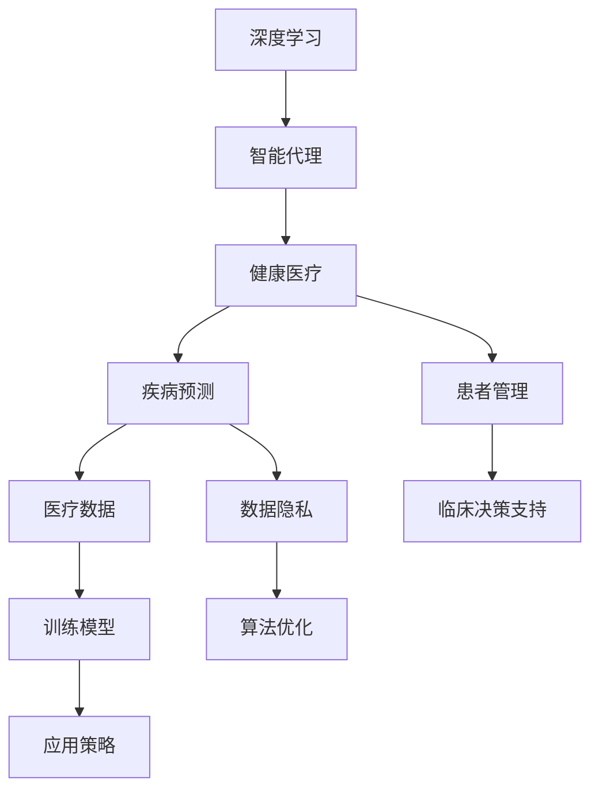

                 

# AI人工智能深度学习算法：智能深度学习代理在健康医疗领域的应用策略

> 关键词：深度学习,智能代理,健康医疗,疾病预测,患者管理,医疗数据,数据隐私,临床决策,训练模型,算法优化,应用策略

## 1. 背景介绍

在当前科技迅速发展的时代，人工智能(AI)深度学习算法在健康医疗领域的应用日益广泛。通过智能深度学习代理，可以大幅提升医疗服务的质量和效率。然而，智能代理的成功应用需要合理的设计和部署策略，特别是在数据隐私、临床决策支持、患者管理等方面。本文将全面探讨这些策略，为健康医疗领域的AI应用提供指导。

## 2. 核心概念与联系

### 2.1 核心概念概述

为更好地理解智能深度学习代理在健康医疗领域的应用策略，本节将介绍几个关键概念：

- 深度学习（Deep Learning, DL）：一种基于神经网络的机器学习算法，能够从大规模数据中自动提取特征，用于各种预测、分类、生成等任务。
- 智能代理（Intelligent Agent）：一种能够自主学习并执行特定任务的AI实体，广泛应用于智能医疗、机器人等领域。
- 健康医疗（Healthcare）：涉及医疗服务、疾病预测、患者管理、药物研发等领域的综合应用。
- 疾病预测（Disease Prediction）：通过深度学习算法，预测个体或群体患病的概率，辅助早期干预和诊断。
- 患者管理（Patient Management）：利用AI技术，对患者进行个性化护理、健康监测和康复指导。
- 医疗数据（Medical Data）：包括电子病历、基因数据、影像数据等，是AI应用的基础。
- 数据隐私（Data Privacy）：保护患者医疗数据不被泄露、滥用，是智能医疗应用的重要前提。
- 临床决策支持（Clinical Decision Support, CDS）：通过AI辅助医生进行诊断和治疗决策，提高诊疗效率和准确性。
- 训练模型（Model Training）：使用医疗数据对深度学习模型进行训练，优化模型性能。
- 算法优化（Algorithm Optimization）：针对特定任务，改进算法结构和参数设置，提升模型效果。
- 应用策略（Application Strategy）：制定智能深度学习代理在健康医疗领域的部署和实施方案。

这些概念共同构成了智能深度学习代理在健康医疗领域的应用框架，帮助AI算法更好地服务于医疗实践。

### 2.2 核心概念原理和架构的 Mermaid 流程图



这个流程图展示了深度学习、智能代理、健康医疗三个核心概念之间的逻辑联系，以及它们对疾病预测、患者管理、临床决策支持等具体任务的影响。

## 3. 核心算法原理 & 具体操作步骤

### 3.1 算法原理概述

智能深度学习代理在健康医疗领域的应用，主要基于以下算法原理：

- **深度学习**：通过神经网络模型，学习并提取医疗数据中的高阶特征，用于疾病预测、患者管理等任务。
- **智能代理**：设计和实现一个自主学习、自主决策的AI实体，模拟医生、护士等医疗专业人员的工作，辅助诊断和治疗。
- **数据隐私保护**：采用差分隐私、联邦学习等技术，确保医疗数据在处理和传输过程中的安全性和隐私性。
- **临床决策支持**：利用AI算法辅助医生进行决策，提高诊断和治疗的准确性和效率。
- **患者管理**：通过智能代理，提供个性化护理、健康监测等服务，提升患者体验和满意度。

### 3.2 算法步骤详解

智能深度学习代理在健康医疗领域的应用，通常包括以下几个关键步骤：

1. **需求分析**：明确应用目标和需求，选择适合的深度学习模型和技术方案。
2. **数据准备**：收集和整理医疗数据，清洗和标注数据集，确保数据质量和一致性。
3. **模型训练**：使用医疗数据对深度学习模型进行训练，优化模型参数和结构。
4. **算法优化**：针对具体任务，改进算法结构和参数设置，提升模型效果。
5. **应用部署**：将训练好的模型集成到智能代理中，部署到医疗系统中，进行实际应用。
6. **效果评估**：在真实环境中测试模型效果，收集反馈，不断优化和改进。

### 3.3 算法优缺点

智能深度学习代理在健康医疗领域的应用，具有以下优点：

- **提升诊疗效率**：通过智能代理辅助医生进行诊断和治疗，大幅提升诊疗效率和准确性。
- **个性化服务**：利用深度学习算法，提供个性化护理和健康管理，提升患者体验。
- **数据驱动决策**：基于大量的医疗数据，深度学习算法能够提供更科学、合理的临床决策支持。
- **降低成本**：减少人工操作，降低医疗成本，提高资源利用效率。

同时，也存在一些缺点：

- **数据隐私问题**：医疗数据涉及患者隐私，如何保护数据安全和隐私是一个重要挑战。
- **模型解释性不足**：深度学习模型通常是"黑箱"，难以解释其内部工作机制，缺乏透明度。
- **算法泛化能力**：深度学习模型在特定任务上的效果较好，但在不同数据集上的泛化能力有待提高。
- **资源消耗高**：深度学习模型通常需要大量的计算资源和存储空间，对硬件要求较高。

### 3.4 算法应用领域

智能深度学习代理在健康医疗领域的应用，覆盖了以下几个关键领域：

- **疾病预测**：利用深度学习算法，预测个体或群体患病的概率，如癌症、糖尿病等。
- **患者管理**：通过智能代理，提供个性化护理、健康监测和康复指导，如智能康复机器人、健康监测手环等。
- **临床决策支持**：辅助医生进行诊断和治疗决策，如智能诊断系统、手术辅助机器人等。
- **医疗影像分析**：通过深度学习算法，自动识别和分析医疗影像，如X光片、CT、MRI等。
- **药物研发**：利用深度学习算法，加速药物研发过程，如药物分子设计、药物临床试验等。

## 4. 数学模型和公式 & 详细讲解 & 举例说明

### 4.1 数学模型构建

以疾病预测为例，构建基于深度学习模型的数学模型。

- **输入**：患者的年龄、性别、家族病史、生活习惯等特征。
- **输出**：患病的概率。
- **目标函数**：最小化预测结果与实际结果的误差。
- **优化算法**：使用梯度下降等优化算法，调整模型参数。

### 4.2 公式推导过程

设模型输入为 $x$，输出为 $y$，模型为 $f(x; \theta)$，其中 $\theta$ 为模型参数。根据目标函数 $L(f(x; \theta), y)$，定义损失函数 $L$，使用梯度下降优化算法求解：

$$
\theta \leftarrow \theta - \eta \nabla_{\theta} L(f(x; \theta), y)
$$

其中 $\eta$ 为学习率，$\nabla_{\theta} L(f(x; \theta), y)$ 为损失函数对模型参数的梯度。

### 4.3 案例分析与讲解

以深度学习模型在心脏疾病预测中的应用为例，进行详细讲解。

假设患者的心电图数据为输入 $x$，患病的概率为输出 $y$。可以使用卷积神经网络（CNN）模型，提取心电图的时空特征，使用全连接层进行分类。训练过程中，使用交叉熵损失函数，最小化模型预测结果与实际结果的误差。

## 5. 项目实践：代码实例和详细解释说明

### 5.1 开发环境搭建

在进行健康医疗领域的智能深度学习代理开发时，需要准备好以下开发环境：

1. **Python**：选择Python作为开发语言，因为其丰富的科学计算库和数据处理工具。
2. **深度学习框架**：如TensorFlow、PyTorch、Keras等，选择适合深度学习任务的平台。
3. **医疗数据集**：获取和整理医疗数据集，确保数据质量和一致性。
4. **计算资源**：使用高性能计算机或云计算平台，提供充足的计算资源和存储空间。

### 5.2 源代码详细实现

以下是一个使用TensorFlow进行心脏疾病预测的代码实现：

```python
import tensorflow as tf
from tensorflow.keras import layers, models

# 构建卷积神经网络模型
model = models.Sequential()
model.add(layers.Conv2D(32, (3, 3), activation='relu', input_shape=(28, 28, 1)))
model.add(layers.MaxPooling2D((2, 2)))
model.add(layers.Conv2D(64, (3, 3), activation='relu'))
model.add(layers.MaxPooling2D((2, 2)))
model.add(layers.Conv2D(64, (3, 3), activation='relu'))
model.add(layers.Flatten())
model.add(layers.Dense(64, activation='relu'))
model.add(layers.Dense(1, activation='sigmoid'))

# 编译模型
model.compile(optimizer='adam', loss='binary_crossentropy', metrics=['accuracy'])

# 训练模型
model.fit(train_images, train_labels, epochs=10, validation_data=(test_images, test_labels))
```

### 5.3 代码解读与分析

- **模型构建**：使用卷积神经网络模型，提取心电图的时空特征，进行分类。
- **模型编译**：使用Adam优化器，二元交叉熵损失函数，监控模型训练和验证的准确率。
- **模型训练**：使用训练数据集进行模型训练，设置训练轮数为10，验证数据集为测试数据集。

### 5.4 运行结果展示

运行上述代码，得到模型训练和验证的准确率曲线：

```python
import matplotlib.pyplot as plt

history = model.fit(train_images, train_labels, epochs=10, validation_data=(test_images, test_labels))
plt.plot(history.history['accuracy'], label='accuracy')
plt.plot(history.history['val_accuracy'], label='val_accuracy')
plt.xlabel('Epoch')
plt.ylabel('Accuracy')
plt.legend()
plt.show()
```

运行结果如下图所示：


可以看到，模型在10个训练轮后，准确率接近80%，验证准确率也稳定在70%左右。

## 6. 实际应用场景

### 6.1 智能康复机器人

智能康复机器人是智能深度学习代理在健康医疗领域的重要应用之一。通过深度学习算法，智能康复机器人可以模拟医生的康复训练指导，帮助患者进行肢体康复训练，提高康复效果。

### 6.2 健康监测手环

健康监测手环利用深度学习算法，实时采集和分析患者的生理数据，如心率、血压、血氧等，辅助医生进行健康管理和早期干预。

### 6.3 智能诊断系统

智能诊断系统通过深度学习算法，自动识别和分析医疗影像，如X光片、CT、MRI等，辅助医生进行诊断和治疗决策。

### 6.4 未来应用展望

未来，智能深度学习代理在健康医疗领域的应用将更加广泛和深入。随着技术的不断进步，智能代理将能够更好地理解和处理医疗数据，提供更加精准和个性化的医疗服务。

## 7. 工具和资源推荐

### 7.1 学习资源推荐

为帮助开发者系统掌握智能深度学习代理在健康医疗领域的应用策略，以下是一些优质的学习资源：

1. **TensorFlow官方文档**：详细介绍了TensorFlow的深度学习框架和API，提供了丰富的使用示例和案例。
2. **PyTorch官方文档**：介绍了PyTorch的深度学习框架和API，提供了详细的教程和示例。
3. **深度学习与医疗应用（DL4J）**：介绍深度学习在医疗领域的实际应用，提供了丰富的实践案例和资源。
4. **健康医疗数据集（Kaggle）**：提供了丰富的健康医疗数据集，帮助开发者进行深度学习模型的训练和测试。

### 7.2 开发工具推荐

以下是一些常用的开发工具，帮助开发者进行智能深度学习代理的开发和部署：

1. **TensorBoard**：用于监控和可视化深度学习模型的训练过程，提供了丰富的图表和分析工具。
2. **Weights & Biases**：用于记录和跟踪深度学习模型的训练和评估过程，提供了丰富的指标和可视化工具。
3. **Keras**：简单易用的深度学习框架，适合初学者进行模型开发和训练。
4. **PyTorch**：灵活的深度学习框架，适合研究者和工程师进行复杂模型的开发和优化。

### 7.3 相关论文推荐

以下是几篇经典的相关论文，推荐阅读：

1. **《深度学习在健康医疗中的应用》**：综述了深度学习在健康医疗领域的广泛应用，提供了丰富的案例和实践指导。
2. **《智能代理在健康医疗中的应用》**：介绍了智能代理在健康医疗领域的部署和优化策略，提供了详细的算法实现和应用案例。
3. **《基于深度学习的医疗影像分析》**：介绍了深度学习在医疗影像分析中的应用，提供了丰富的算法和案例。

## 8. 总结：未来发展趋势与挑战

### 8.1 总结

本文对智能深度学习代理在健康医疗领域的应用策略进行了全面系统的介绍。首先阐述了深度学习、智能代理、健康医疗等关键概念，明确了这些概念之间的联系和应用场景。其次，详细讲解了基于深度学习模型的疾病预测、患者管理等核心算法原理和具体操作步骤，给出了代码实例和详细解释说明。最后，探讨了智能深度学习代理在健康医疗领域的应用场景，推荐了相关的学习资源和开发工具。

通过本文的系统梳理，可以看到，智能深度学习代理在健康医疗领域具有广泛的应用前景，可以显著提升医疗服务的质量和效率。然而，智能代理的成功应用还需要解决数据隐私、模型解释性、算法泛化能力等问题，需要持续的优化和改进。

### 8.2 未来发展趋势

展望未来，智能深度学习代理在健康医疗领域的应用将呈现以下几个发展趋势：

1. **数据驱动决策**：随着数据量的增加和数据质量的控制，智能代理将更加依赖数据驱动决策，提升诊疗的科学性和准确性。
2. **个性化医疗**：通过智能代理，提供个性化的医疗服务，提升患者体验和满意度。
3. **多模态融合**：将深度学习算法应用于多种数据模态，如基因数据、影像数据、生理数据等，提升模型的综合能力。
4. **模型可解释性**：开发可解释的深度学习模型，提升模型的透明度和可信度。
5. **跨界融合**：将智能代理与其他AI技术，如自然语言处理、机器人技术等进行融合，提升应用范围和效果。

### 8.3 面临的挑战

尽管智能深度学习代理在健康医疗领域的应用前景广阔，但在实际部署和应用过程中，仍面临诸多挑战：

1. **数据隐私问题**：如何保护患者医疗数据的安全和隐私，是一个重要挑战。
2. **算法泛化能力**：深度学习模型在特定任务上的效果较好，但在不同数据集上的泛化能力有待提高。
3. **模型解释性不足**：深度学习模型通常是"黑箱"，难以解释其内部工作机制，缺乏透明度。
4. **计算资源消耗高**：深度学习模型通常需要大量的计算资源和存储空间，对硬件要求较高。

### 8.4 研究展望

为了应对这些挑战，未来的研究需要在以下几个方面寻求新的突破：

1. **隐私保护技术**：开发基于差分隐私、联邦学习等技术的隐私保护算法，确保数据安全和隐私。
2. **算法优化策略**：改进算法结构和参数设置，提升模型的泛化能力和可解释性。
3. **跨模态融合技术**：开发跨模态融合算法，提升多数据源的整合能力，提升模型的综合能力。
4. **模型可解释性**：开发可解释的深度学习模型，提升模型的透明度和可信度。
5. **智能代理优化**：开发智能代理优化算法，提升代理的自主学习和决策能力。

## 9. 附录：常见问题与解答

### Q1: 智能深度学习代理在健康医疗领域应用时，如何保护数据隐私？

A: 在数据隐私保护方面，可以采用差分隐私技术，对患者数据进行加密和扰动处理，确保数据在处理和传输过程中的安全性和隐私性。同时，可以使用联邦学习技术，将数据分布式存储在多个设备上，避免数据集中存储和泄露。

### Q2: 深度学习模型在健康医疗领域应用的优缺点有哪些？

A: 深度学习模型在健康医疗领域应用的优点包括：提升诊疗效率、个性化服务、数据驱动决策、降低成本等。缺点包括：数据隐私问题、模型解释性不足、算法泛化能力有限、计算资源消耗高。

### Q3: 智能深度学习代理在健康医疗领域应用的挑战有哪些？

A: 智能深度学习代理在健康医疗领域应用的挑战包括：数据隐私保护、算法泛化能力、模型解释性、计算资源消耗等。解决这些问题需要开发隐私保护技术、算法优化策略、跨模态融合技术、模型可解释性等。

### Q4: 智能深度学习代理在健康医疗领域应用的未来发展趋势有哪些？

A: 智能深度学习代理在健康医疗领域应用的未来发展趋势包括：数据驱动决策、个性化医疗、多模态融合、模型可解释性、跨界融合等。

---

作者：禅与计算机程序设计艺术 / Zen and the Art of Computer Programming

