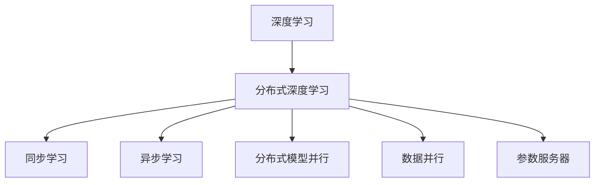

                 

# AI人工智能深度学习算法：智能深度学习代理的分布式与同步

## 1. 背景介绍

随着人工智能(AI)技术的快速发展，深度学习(DL)已成为最热门的研究领域之一。深度学习通过模拟人脑的神经网络结构，解决了许多传统机器学习方法难以解决的复杂问题。在工业界，深度学习已经广泛应用于语音识别、图像识别、自然语言处理等领域，并取得了卓越的成果。

然而，深度学习的训练过程需要大量的计算资源和数据，这使得其在大规模分布式系统中进行训练成为一项挑战。近年来，随着云计算和大数据技术的发展，分布式深度学习（Distributed Deep Learning）成为了解决这一问题的有效途径。分布式深度学习通过将训练任务划分为多个子任务，并在多个计算节点上并行执行，从而大幅度提升了深度学习的训练效率和扩展性。

## 2. 核心概念与联系

### 2.1 核心概念概述

为更好地理解分布式深度学习的核心概念，本节将介绍几个密切相关的核心概念：

- 深度学习（Deep Learning）：一种基于多层神经网络的机器学习方法，通过多层非线性变换，从数据中提取高级特征，实现复杂模式的识别和预测。

- 分布式深度学习（Distributed Deep Learning）：一种在大规模计算集群上，通过并行计算和数据分治方式进行深度学习模型训练的方法。

- 同步学习（Synchronous Learning）：一种在多个计算节点间同步更新模型参数的方法，每个节点在每个迭代周期内都同步更新一次参数。

- 异步学习（Asynchronous Learning）：一种在多个计算节点间异步更新模型参数的方法，每个节点在每个迭代周期内独立更新一次参数，不需要同步等待。

- 分布式模型并行（Model Parallelism）：将一个大模型拆分为多个子模型，每个子模型在不同的计算节点上进行并行训练。

- 数据并行（Data Parallelism）：将同一个训练批次的数据划分为多个子批次，在不同的计算节点上进行并行训练。

- 参数服务器（Parameter Server）：一种集中管理模型参数的分布式训练框架，参数服务器负责存储模型参数和接收计算节点的更新请求，同时同步更新模型参数。

这些核心概念之间的逻辑关系可以通过以下Mermaid流程图来展示：



这个流程图展示了大语言模型的核心概念及其之间的关系：

1. 深度学习通过神经网络结构实现复杂模式的识别和预测。
2. 分布式深度学习在大规模计算集群上并行执行训练任务，提升训练效率和扩展性。
3. 同步学习在多个计算节点间同步更新参数，保证模型收敛的稳定性。
4. 异步学习在多个计算节点间异步更新参数，加速训练过程。
5. 分布式模型并行将大模型拆分为多个子模型，分别在不同节点上进行训练。
6. 数据并行将同一个训练批次的数据划分为多个子批次，分别在不同节点上进行训练。
7. 参数服务器集中管理模型参数，同步更新模型参数。

这些概念共同构成了深度学习在分布式系统中的训练框架，使其能够高效地处理大规模数据和模型，从而在实际应用中发挥更大的潜力。

## 3. 核心算法原理 & 具体操作步骤

### 3.1 算法原理概述

分布式深度学习的核心算法原理基于模型并行和数据并行，通过将训练任务分解为多个子任务，在多个计算节点上并行执行，从而提升训练效率和扩展性。同步学习和异步学习是两种常用的分布式深度学习训练策略，通过不同的同步方式来更新模型参数，以满足不同的训练需求。

### 3.2 算法步骤详解

分布式深度学习的训练步骤可以分为以下几个关键环节：

**Step 1: 准备数据和模型**

- 准备训练数据集，并将其划分为多个子批次。
- 选择合适的深度学习模型，并将其拆分为多个子模型。

**Step 2: 初始化参数**

- 初始化模型参数，通常采用随机初始化或预训练模型。
- 分配模型参数到不同的计算节点，每个节点负责计算一个子模型的参数。

**Step 3: 同步训练**

- 在每个迭代周期内，所有计算节点执行前向传播计算。
- 每个节点在本地计算梯度，并将梯度发送到参数服务器。
- 参数服务器接收所有节点的梯度，并计算全局梯度。
- 参数服务器同步更新模型参数，并将更新后的参数发送回各个节点。
- 所有节点接收更新后的参数，并执行反向传播更新本地参数。
- 重复上述步骤直至收敛。

**Step 4: 异步训练**

- 在每个迭代周期内，所有计算节点独立执行前向传播计算。
- 每个节点在本地计算梯度，并将梯度发送到参数服务器。
- 参数服务器接收所有节点的梯度，并计算全局梯度。
- 参数服务器同步更新模型参数，并将更新后的参数发送回各个节点。
- 所有节点接收更新后的参数，并执行反向传播更新本地参数。
- 重复上述步骤直至收敛。

### 3.3 算法优缺点

分布式深度学习具有以下优点：

1. 加速训练过程：通过并行计算，分布式深度学习能够显著加速训练过程，缩短模型训练时间。
2. 提升扩展性：分布式深度学习能够有效利用计算集群中的多个计算节点，实现大规模模型的训练。
3. 提高资源利用率：通过模型并行和数据并行，分布式深度学习能够充分利用计算集群中的资源，避免资源浪费。

同时，分布式深度学习也存在一些缺点：

1. 同步开销较大：同步学习需要等待所有节点完成更新后，才能进行下一次参数更新，因此同步开销较大。
2. 通信开销高：分布式深度学习需要频繁进行参数更新和数据交换，因此通信开销较高。
3. 同步复杂度高：异步学习需要处理节点间不同步的情况，同步复杂度较高。

尽管存在这些缺点，但就目前而言，分布式深度学习仍是大规模深度学习模型训练的重要手段。未来相关研究的重点在于如何进一步降低同步开销，提高通信效率，减少同步复杂度，同时兼顾模型的可扩展性和可扩展性。

### 3.4 算法应用领域

分布式深度学习在诸多领域中得到了广泛应用，例如：

- 自然语言处理：通过分布式深度学习，模型可以在大规模语料库上进行预训练，并在下游任务上进行微调，实现高效精准的文本生成、情感分析、机器翻译等任务。
- 计算机视觉：分布式深度学习使得大规模图像数据集能够进行高效的训练，从而实现图像分类、物体检测、人脸识别等任务。
- 医疗诊断：分布式深度学习可以通过大规模医疗数据集进行模型训练，从而实现疾病的早期诊断、治疗方案推荐等任务。
- 自动驾驶：分布式深度学习可以通过大规模传感器数据集进行模型训练，从而实现自动驾驶系统的感知、决策等任务。
- 智能制造：分布式深度学习可以通过大规模工业数据集进行模型训练，从而实现智能制造系统的优化和控制。

此外，在金融、能源、交通等众多领域，分布式深度学习也得到了广泛应用，为各行各业带来了新的技术突破。

## 4. 数学模型和公式 & 详细讲解 & 举例说明

### 4.1 数学模型构建

本节将使用数学语言对分布式深度学习的训练过程进行更加严格的刻画。

记深度学习模型为 $M$，其参数为 $\theta$，训练数据集为 $D=\{(x_i, y_i)\}_{i=1}^N$，其中 $x_i$ 为输入数据，$y_i$ 为标签。假设模型 $M$ 在训练批次 $B$ 上的损失函数为 $\mathcal{L}(B; \theta)$。

定义模型 $M$ 在训练批次 $B$ 上的输出为 $\hat{y} = M(x_i; \theta)$，其中 $x_i$ 为训练批次中的样本。定义损失函数 $\mathcal{L}(B; \theta)$ 为模型预测输出与真实标签之间的差异，例如交叉熵损失。

在分布式深度学习中，模型参数 $\theta$ 分布在多个计算节点上进行并行更新。设每个节点的参数更新速度为 $v_i$，其中 $i$ 表示节点编号。在每个迭代周期内，所有节点的参数更新速度 $v_i$ 满足 $v_i = \alpha_i \times v_{i-1}$，其中 $\alpha_i$ 为节点 $i$ 的更新速度系数。

定义节点 $i$ 在每个迭代周期内的更新量为 $\Delta_i$，则模型参数的更新量为：

$$
\Delta = \sum_{i=1}^N \Delta_i
$$

其中 $\Delta_i$ 为节点 $i$ 在每个迭代周期内的更新量。定义节点 $i$ 在每个迭代周期内的更新量为：

$$
\Delta_i = v_i \times \mathcal{L}_i(B; \theta_i)
$$

其中 $\mathcal{L}_i(B; \theta_i)$ 为节点 $i$ 在每个迭代周期内的损失函数。

### 4.2 公式推导过程

以下我们以二分类任务为例，推导分布式深度学习训练过程中模型的更新公式。

假设模型 $M$ 在输入 $x$ 上的输出为 $\hat{y}=M(x; \theta) \in [0,1]$，表示样本属于正类的概率。真实标签 $y \in \{0,1\}$。则二分类交叉熵损失函数定义为：

$$
\mathcal{L}(B; \theta) = -\frac{1}{N}\sum_{i=1}^N [y_i\log \hat{y}_i+(1-y_i)\log (1-\hat{y}_i)]
$$

在分布式深度学习中，模型参数 $\theta$ 分布在多个计算节点上进行并行更新。设每个节点的参数更新速度为 $v_i$，其中 $i$ 表示节点编号。在每个迭代周期内，所有节点的参数更新速度 $v_i$ 满足 $v_i = \alpha_i \times v_{i-1}$，其中 $\alpha_i$ 为节点 $i$ 的更新速度系数。

定义节点 $i$ 在每个迭代周期内的更新量为 $\Delta_i$，则模型参数的更新量为：

$$
\Delta = \sum_{i=1}^N \Delta_i
$$

其中 $\Delta_i$ 为节点 $i$ 在每个迭代周期内的更新量。定义节点 $i$ 在每个迭代周期内的更新量为：

$$
\Delta_i = v_i \times \mathcal{L}_i(B; \theta_i)
$$

其中 $\mathcal{L}_i(B; \theta_i)$ 为节点 $i$ 在每个迭代周期内的损失函数。

根据链式法则，损失函数对参数 $\theta_k$ 的梯度为：

$$
\frac{\partial \mathcal{L}(B; \theta)}{\partial \theta_k} = -\frac{1}{N}\sum_{i=1}^N (\frac{y_i}{\hat{y}_i}-\frac{1-y_i}{1-\hat{y}_i}) \frac{\partial M(x; \theta)}{\partial \theta_k}
$$

其中 $\frac{\partial M(x; \theta)}{\partial \theta_k}$ 可进一步递归展开，利用自动微分技术完成计算。

在得到损失函数的梯度后，即可带入参数更新公式，完成模型的迭代优化。重复上述过程直至收敛，最终得到适应下游任务的最优模型参数 $\theta^*$。

## 5. 项目实践：代码实例和详细解释说明

### 5.1 开发环境搭建

在进行分布式深度学习实践前，我们需要准备好开发环境。以下是使用PyTorch进行Distributed Deep Learning开发的环境配置流程：

1. 安装Anaconda：从官网下载并安装Anaconda，用于创建独立的Python环境。

2. 创建并激活虚拟环境：
```bash
conda create -n dist_deep_learning python=3.8 
conda activate dist_deep_learning
```

3. 安装PyTorch：根据CUDA版本，从官网获取对应的安装命令。例如：
```bash
conda install pytorch torchvision torchaudio cudatoolkit=11.1 -c pytorch -c conda-forge
```

4. 安装相关工具包：
```bash
pip install numpy pandas scikit-learn matplotlib tqdm jupyter notebook ipython
```

5. 安装PyTorch distributed包：
```bash
pip install torch
```

完成上述步骤后，即可在`dist_deep_learning`环境中开始Distributed Deep Learning实践。

### 5.2 源代码详细实现

这里我们以二分类任务为例，给出使用PyTorch进行Distributed Deep Learning训练的代码实现。

首先，定义二分类任务的数据处理函数：

```python
from torch.utils.data import Dataset, DataLoader
import torch
from torch import nn, optim

class Dataset(Dataset):
    def __init__(self, data, labels):
        self.data = data
        self.labels = labels

    def __len__(self):
        return len(self.data)

    def __getitem__(self, idx):
        return self.data[idx], self.labels[idx]
```

然后，定义二分类任务的数据加载器：

```python
def data_loader(data, labels, batch_size):
    dataset = Dataset(data, labels)
    dataloader = DataLoader(dataset, batch_size=batch_size, shuffle=True)
    return dataloader
```

接着，定义模型和优化器：

```python
class Net(nn.Module):
    def __init__(self):
        super(Net, self).__init__()
        self.fc1 = nn.Linear(784, 256)
        self.fc2 = nn.Linear(256, 1)
        self.sigmoid = nn.Sigmoid()

    def forward(self, x):
        x = self.fc1(x)
        x = self.fc2(x)
        x = self.sigmoid(x)
        return x

net = Net()
optimizer = optim.SGD(net.parameters(), lr=0.1)
```

然后，定义分布式训练函数：

```python
from torch.distributed import Tensor, distributed_c10d

def train():
    dist_c10d.init_process_group(backend='gloo', world_size=4, rank=0)
    dist_c10d.init_rank()

    device = torch.device("cuda:{}".format(dist_c10d.get_rank()))

    dist_c10d.broadcast_object_list([optimizer], src=0)
    dist_c10d.broadcast_object_list([net], src=0)

    net.to(device)
    optimizer.to(device)

    criterion = nn.BCELoss()

    for epoch in range(10):
        for i, (inputs, labels) in enumerate(train_loader, 0):
            inputs, labels = inputs.to(device), labels.to(device)

            optimizer.zero_grad()

            outputs = net(inputs)
            loss = criterion(outputs, labels)

            loss.backward()
            optimizer.step()

            if i % 100 == 0:
                print(f"Epoch [{epoch+1}/{10}], Step [{i+1}/{len(train_loader)}], Loss: {loss.item():.4f}")
```

在上述代码中，我们首先通过`torch.distributed`模块初始化分布式训练环境，并使用`dist_c10d`模块进行跨节点通信。然后定义了二分类模型`Net`和优化器`SGD`，并将其广播到所有节点。接着定义了损失函数`BCELoss`，并使用`train_loader`加载训练数据。最后，在每个epoch中，通过`train_loader`循环遍历数据集，进行前向传播、反向传播和参数更新。

在实际部署中，可以使用MPI、Horovod等分布式训练框架，简化分布式训练的实现。

### 5.3 代码解读与分析

让我们再详细解读一下关键代码的实现细节：

**Dataset类**：
- `__init__`方法：初始化数据和标签。
- `__len__`方法：返回数据集的大小。
- `__getitem__`方法：返回数据集中的单个样本。

**train函数**：
- 通过`dist_c10d`模块初始化分布式训练环境，并获取每个节点的编号。
- 使用`dist_c10d`模块广播优化器和模型到所有节点。
- 将模型和优化器移动到对应的设备上。
- 定义损失函数`BCELoss`。
- 在每个epoch中，循环遍历训练数据集，进行前向传播、反向传播和参数更新。
- 在每个epoch结束时，打印出当前的训练损失。

可以看到，PyTorch的`torch.distributed`模块提供了丰富的分布式训练功能，简化了跨节点通信和数据同步的实现。

当然，工业级的系统实现还需考虑更多因素，如模型保存和部署、超参数搜索、更灵活的任务适配层等。但核心的分布式深度学习训练逻辑基本与此类似。

## 6. 实际应用场景

### 6.1 工业级深度学习框架

目前，主流的深度学习框架如TensorFlow、PyTorch、Keras等，都支持分布式深度学习训练，并提供丰富的分布式训练API。例如，TensorFlow的`tf.distribute.Strategy`和PyTorch的`torch.distributed`模块，都提供了简单易用的分布式训练接口，使得开发者能够方便地进行分布式深度学习训练。

### 6.2 大规模分布式训练

在实际应用中，大规模分布式训练已经在诸多领域中得到了广泛应用，如自然语言处理、计算机视觉、医疗诊断等。通过分布式深度学习，模型可以在大规模数据集上进行高效的训练，从而提升模型的性能和泛化能力。

### 6.3 边缘计算

分布式深度学习在边缘计算中也得到了广泛应用，使得深度学习模型能够在资源受限的设备上进行高效训练和推理。通过在边缘设备上进行分布式训练，可以显著降低数据传输成本，提高模型推理速度，从而实现实时应用。

### 6.4 未来应用展望

随着深度学习技术的发展，分布式深度学习也将迎来新的突破和应用场景。未来，分布式深度学习将更多地应用于以下几个领域：

1. 联邦学习（Federated Learning）：通过分布式深度学习，多个设备之间可以进行数据共享和模型协同训练，从而实现联邦学习，保护数据隐私。
2. 自适应优化算法：通过分布式深度学习，自适应优化算法可以在多个设备上协同优化模型参数，提升模型的收敛速度和精度。
3. 跨领域迁移学习：通过分布式深度学习，可以将不同领域的数据集和模型进行联合训练，实现跨领域迁移学习，提升模型的泛化能力。
4. 实时流处理：通过分布式深度学习，可以在实时数据流中进行深度学习模型的训练和推理，实现实时应用。
5. 智能边缘计算：通过分布式深度学习，智能边缘计算设备可以实现高效的本地模型训练和推理，从而提升边缘计算的智能化水平。

总之，分布式深度学习的应用领域将会更加广泛，未来的研究将继续推动其在各个领域中的创新应用。

## 7. 工具和资源推荐
### 7.1 学习资源推荐

为了帮助开发者系统掌握分布式深度学习的理论基础和实践技巧，这里推荐一些优质的学习资源：

1. 《分布式深度学习》系列博文：由大模型技术专家撰写，深入浅出地介绍了分布式深度学习的原理、实践和优化方法。

2. Deep Learning Specialization：由Coursera开设的深度学习课程，涵盖深度学习的基础理论和应用实践，并介绍了TensorFlow等深度学习框架的使用方法。

3. Deep Learning for Self-Driving Cars：由Udacity开设的深度学习课程，专注于深度学习在自动驾驶中的应用，涵盖数据集、模型训练、算法优化等内容。

4. Distributed Deep Learning：HuggingFace开发的深度学习工具库，支持TensorFlow、PyTorch等多种深度学习框架，并提供了丰富的分布式深度学习API。

5. Parameter Server: A Comprehensive Survey and Taxonomy：深度学习领域经典论文，全面介绍了参数服务器在分布式深度学习中的作用和优化方法。

通过对这些资源的学习实践，相信你一定能够快速掌握分布式深度学习的精髓，并用于解决实际的深度学习问题。

### 7.2 开发工具推荐

高效的开发离不开优秀的工具支持。以下是几款用于分布式深度学习开发的常用工具：

1. TensorFlow：由Google主导开发的深度学习框架，支持分布式训练和模型优化，具有丰富的深度学习库和工具。

2. PyTorch：由Facebook主导开发的深度学习框架，支持动态计算图，易于调试和优化，适合研究和原型开发。

3. Horovod：由Uber主导开发的分布式深度学习框架，支持多种深度学习框架，并提供简单易用的分布式训练API。

4. MPI：跨节点通信协议，支持消息传递、数据交换等分布式通信操作，广泛应用于高性能计算领域。

5. Spark：开源的大数据处理框架，支持分布式数据存储和处理，并提供了深度学习库和工具。

合理利用这些工具，可以显著提升分布式深度学习的开发效率，加快创新迭代的步伐。

### 7.3 相关论文推荐

分布式深度学习在诸多领域中得到了广泛研究，以下是几篇奠基性的相关论文，推荐阅读：

1. Large Scale Distributed Deep Learning：提出了分布式深度学习的基本算法框架，并展示了在大规模数据集上进行分布式深度学习训练的方法。

2. PSGD: Towards Optimal Distributed Deep Learning：提出了一种基于异步随机梯度下降的分布式深度学习算法，并通过实验验证了其性能。

3. GPUDirect: Fast and Scalable Distributed Deep Learning with TensorFlow：介绍了在GPU上进行分布式深度学习训练的方法，并通过实验展示了其性能。

4. DeepSpeed：由微软主导开发的分布式深度学习框架，支持多GPU、多节点分布式训练，并提供了丰富的优化算法和工具。

5. MindSpore：由华为开发的深度学习框架，支持分布式训练和模型优化，并提供简单易用的分布式深度学习API。

这些论文代表了大规模深度学习领域的研究进展，通过学习这些前沿成果，可以帮助研究者把握学科前进方向，激发更多的创新灵感。

## 8. 总结：未来发展趋势与挑战

### 8.1 总结

本文对分布式深度学习的方法进行了全面系统的介绍。首先阐述了深度学习和分布式深度学习的背景和意义，明确了分布式深度学习在提升训练效率和扩展性方面的独特价值。其次，从原理到实践，详细讲解了分布式深度学习的数学原理和关键步骤，给出了分布式深度学习的代码实例。同时，本文还广泛探讨了分布式深度学习在工业界的应用前景，展示了其广阔的应用前景。

通过本文的系统梳理，可以看到，分布式深度学习为大规模深度学习模型的训练提供了新的方法和工具，使其能够高效地处理大规模数据和模型，从而在实际应用中发挥更大的潜力。未来，伴随深度学习技术的发展和分布式计算技术的进步，分布式深度学习必将在更广阔的领域得到应用，为人工智能技术的落地带来新的突破。

### 8.2 未来发展趋势

展望未来，分布式深度学习的发展趋势将呈现以下几个方向：

1. 分布式深度学习模型将进一步优化，使得训练效率更高，模型性能更好。
2. 分布式深度学习将与联邦学习、自适应优化算法等技术相结合，实现更加高效和灵活的分布式深度学习训练。
3. 分布式深度学习将更多地应用于实时流处理、智能边缘计算等领域，实现实时应用和智能化控制。
4. 分布式深度学习将与其他人工智能技术进行更深入的融合，如知识表示、因果推理、强化学习等，推动深度学习技术的不断进步。
5. 分布式深度学习将更多地应用于边缘设备、移动设备等资源受限的环境中，实现高效、实时、轻量化的深度学习应用。

以上趋势凸显了分布式深度学习的广阔前景。这些方向的探索发展，必将进一步提升深度学习系统的性能和应用范围，为人工智能技术的落地应用带来新的机遇。

### 8.3 面临的挑战

尽管分布式深度学习已经取得了瞩目成就，但在迈向更加智能化、普适化应用的过程中，它仍面临着诸多挑战：

1. 分布式深度学习的通信开销较大，尤其是在网络带宽受限的环境下，容易产生性能瓶颈。
2. 分布式深度学习的同步开销较大，同步速度较慢，容易导致系统整体效率降低。
3. 分布式深度学习需要复杂的集群管理和调度，容易产生系统维护和操作的复杂度。
4. 分布式深度学习的训练过程需要大量的计算资源和存储资源，可能面临硬件瓶颈和成本问题。

尽管存在这些挑战，但就目前而言，分布式深度学习仍是大规模深度学习模型训练的重要手段。未来相关研究的重点在于如何进一步降低通信开销，提高同步效率，减少系统复杂度，同时兼顾模型的可扩展性和可扩展性。

### 8.4 研究展望

面对分布式深度学习所面临的种种挑战，未来的研究需要在以下几个方面寻求新的突破：

1. 探索异步分布式深度学习算法。通过引入异步随机梯度下降等算法，减少同步开销，提升系统效率。
2. 研究模型并行和数据并行的结合方式。通过结合模型并行和数据并行，优化模型训练过程，提高系统效率和精度。
3. 引入分布式优化算法。通过引入分布式优化算法，如自适应优化算法、联邦学习等，提升模型训练的灵活性和效率。
4. 设计更高效的分布式训练框架。通过设计更高效的分布式训练框架，优化系统架构和调度，提升系统效率。
5. 引入模型压缩和稀疏化技术。通过引入模型压缩和稀疏化技术，减小模型规模，提高系统效率。

这些研究方向的探索，必将引领分布式深度学习技术迈向更高的台阶，为深度学习模型的训练和应用带来新的突破。

## 9. 附录：常见问题与解答

**Q1：分布式深度学习是否适用于所有深度学习模型？**

A: 分布式深度学习适用于各类深度学习模型，特别是大规模模型和复杂模型。但是，对于小型模型和简单模型，分布式训练的优势并不明显。对于特定领域的数据集和任务，可能需要根据具体情况进行优化和调整。

**Q2：如何选择合适的分布式深度学习框架？**

A: 选择合适的分布式深度学习框架主要取决于项目的具体需求和现有环境。TensorFlow、PyTorch、Horovod等框架都提供了丰富的分布式深度学习API，可以根据项目规模、数据类型、硬件环境等因素进行选择。

**Q3：分布式深度学习是否容易产生数据偏差？**

A: 分布式深度学习中，每个节点上的数据都是独立的，因此数据偏差问题可能更加突出。可以通过数据增强、数据重采样等技术，缓解数据偏差问题，提升模型的泛化能力。

**Q4：分布式深度学习是否容易产生过拟合？**

A: 分布式深度学习中，每个节点上的数据都是独立的，因此过拟合问题可能更加突出。可以通过正则化、数据增强、早停等技术，缓解过拟合问题，提升模型的泛化能力。

**Q5：分布式深度学习是否容易产生同步开销？**

A: 同步学习是分布式深度学习中常用的训练策略，其同步开销较大。可以考虑使用异步随机梯度下降等算法，减少同步开销，提升系统效率。

通过本文的系统梳理，可以看到，分布式深度学习为大规模深度学习模型的训练提供了新的方法和工具，使其能够高效地处理大规模数据和模型，从而在实际应用中发挥更大的潜力。未来，伴随深度学习技术的发展和分布式计算技术的进步，分布式深度学习必将在更广阔的领域得到应用，为人工智能技术的落地带来新的突破。

总之，分布式深度学习需要在模型优化、算法优化、系统架构优化等方面进行持续的研究和改进，才能充分发挥其潜力，推动深度学习技术在各行各业中的广泛应用。

---

作者：禅与计算机程序设计艺术 / Zen and the Art of Computer Programming

