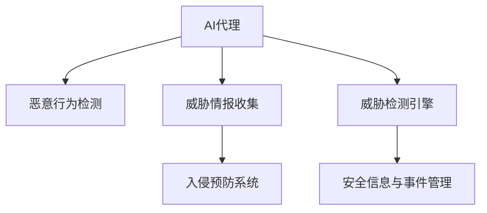

                 

# AI代理在网络安全中的工作流及应用实践

> 关键词：网络安全, 人工智能(AI), 自动化, 代理(Agent), 恶意行为检测, 威胁情报收集, 入侵预防系统(IPS), 威胁检测引擎(TDE), 安全信息与事件管理(SIEM)

## 1. 背景介绍

### 1.1 问题由来
随着信息技术的发展，网络安全问题日益严重。网络攻击形式多样，难以检测和防御，导致经济损失和社会影响不断扩大。传统的网络安全防护措施如防火墙、入侵检测系统(IDS)、入侵防御系统(IPS)等存在误报率高、响应速度慢、手动操作复杂等问题。这些缺陷使得网络安全防线不够稳固，急需新的防护手段以应对不断变化的网络安全威胁。

### 1.2 问题核心关键点
网络安全问题的关键在于如何构建一个高效、自动化、智能的防护体系。AI代理（Agent）作为人工智能在网络安全领域的应用，具有自动化、智能化、自学习等特性，能够大幅提升网络安全的检测和防护能力。

### 1.3 问题研究意义
AI代理在网络安全中的应用，能显著提升网络安全防护的效率和效果。它可以实时监控网络流量，自动识别恶意行为，及时做出响应，减轻人工的负担，减少误报和漏报。同时，AI代理能够学习最新的攻击模式，预测未来的威胁，提高防护系统的适应性和自适应能力。

## 2. 核心概念与联系

### 2.1 核心概念概述

为更好地理解AI代理在网络安全中的应用，本节将介绍几个密切相关的核心概念：

- **AI代理（Agent）**：人工智能在网络安全领域的应用，通过自主学习网络流量中的模式和行为，自动识别和响应网络威胁，自动生成威胁报告，减少人工干预。
- **恶意行为检测（Malicious Behavior Detection）**：识别网络中的恶意活动，如病毒、木马、钓鱼、DDoS攻击等。
- **威胁情报收集（Threat Intelligence Collection）**：收集和分析最新的威胁情报信息，及时更新防护系统。
- **入侵预防系统（IPS）**：一种智能网络安全设备，能够在检测到恶意行为后，自动采取防护措施，如阻止连接、删除恶意文件等。
- **威胁检测引擎（TDE）**：一种基于AI的威胁检测工具，能够实时监控网络流量，分析异常行为，并提供详细的威胁报告。
- **安全信息与事件管理（SIEM）**：一种集中式安全管理平台，能够实时收集、分析和报告安全事件，协助安全人员做出决策。

这些核心概念之间的逻辑关系可以通过以下Mermaid流程图来展示：



这个流程图展示了这个概念体系的核心架构和运作机制：

1. AI代理通过分析网络流量中的数据，识别出潜在的恶意行为。
2. 根据收集的威胁情报，AI代理可以更新恶意行为检测模型，提高检测的准确性和效率。
3. 入侵预防系统能够根据恶意行为的检测结果，自动采取阻止措施。
4. 威胁检测引擎在发现异常行为时，提供详细的威胁报告，协助安全人员做出决策。
5. 安全信息与事件管理平台可以集中管理和分析这些报告，进行进一步的安全分析和报告。

这些概念共同构成了AI代理在网络安全防护中的关键技术框架，使得网络安全防护体系更加智能化和自动化。

## 3. 核心算法原理 & 具体操作步骤
### 3.1 算法原理概述

AI代理在网络安全中的核心算法原理基于机器学习、深度学习和自然语言处理等技术。通过分析网络流量数据，AI代理可以识别出潜在的威胁，自动更新威胁检测模型，预测未来的威胁趋势。

AI代理的具体工作流程通常包括以下几个步骤：

1. 数据收集：收集网络流量数据、日志文件等安全相关数据。
2. 特征提取：从数据中提取有用的特征，如IP地址、端口、协议等。
3. 模型训练：利用收集的数据训练恶意行为检测模型。
4. 威胁检测：实时监控网络流量，识别异常行为。
5. 威胁响应：根据检测结果，自动采取防护措施，如阻止连接、删除恶意文件等。
6. 威胁情报更新：根据最新的威胁情报，更新恶意行为检测模型，保持防护系统的有效性。

### 3.2 算法步骤详解

以下是AI代理在网络安全中使用的核心算法步骤：

#### 数据收集
AI代理首先需要收集网络流量数据和日志文件等安全相关数据。这些数据通常包括但不限于：

- **网络流量数据**：包括TCP/IP报文、UDP报文、ICMP报文等。
- **日志文件**：包括系统日志、应用日志、安全日志等。
- **网络配置数据**：如防火墙规则、IDS配置、IP段等。

#### 特征提取
从收集的数据中提取有用的特征，是AI代理检测恶意行为的关键步骤。常见的特征包括：

- **源和目标IP地址、端口号**：用于判断数据包来源和目标。
- **协议类型**：如TCP、UDP、ICMP等。
- **数据包大小和速率**：用于判断异常流量。
- **数据包头部字段**：如源IP、目标IP、TCP标志位等。
- **恶意签名**：基于已知的恶意攻击模式提取的特征。

#### 模型训练
AI代理利用收集的数据训练恶意行为检测模型。常用的机器学习算法包括：

- **监督学习算法**：如决策树、支持向量机、随机森林等。
- **无监督学习算法**：如K-means聚类、PCA等。
- **深度学习算法**：如卷积神经网络（CNN）、递归神经网络（RNN）、Transformer等。

#### 威胁检测
AI代理实时监控网络流量，识别异常行为。通常使用以下方法：

- **异常检测**：通过统计分析数据流量的行为特征，识别出异常流量。
- **规则匹配**：根据已知的恶意行为特征，匹配网络流量中的恶意行为。
- **行为分析**：分析数据包之间的交互关系，识别潜在的威胁。

#### 威胁响应
AI代理在检测到异常行为时，自动采取防护措施。常见的威胁响应方法包括：

- **阻止连接**：根据恶意行为特征，阻止特定的IP或端口连接。
- **删除恶意文件**：根据恶意签名，自动删除恶意文件或数据。
- **隔离网络**：将可疑的网络流量隔离到安全区域，进行进一步分析。

#### 威胁情报更新
AI代理根据最新的威胁情报信息，自动更新恶意行为检测模型，保持防护系统的有效性。威胁情报通常包括：

- **漏洞信息**：关于已知漏洞的详细信息。
- **攻击手法**：已知的恶意攻击方法和技巧。
- **攻击者信息**：攻击者的身份、背景、动机等。

### 3.3 算法优缺点

AI代理在网络安全中具有以下优点：

- **自动化**：能够自动收集、分析、响应网络威胁，减少人工干预。
- **智能化**：能够利用机器学习和深度学习技术，自主学习最新的攻击模式，预测未来的威胁。
- **实时性**：能够实时监控网络流量，快速识别和响应威胁。
- **自适应性**：能够根据威胁情报信息，自动更新模型，保持防护系统的有效性。

同时，AI代理也存在一些局限性：

- **误报率高**：在复杂的网络环境中，误报率可能较高。
- **资源消耗大**：AI代理需要较大的计算资源和存储资源，可能导致性能瓶颈。
- **难以解释**：AI代理的决策过程较复杂，难以解释和调试。
- **数据隐私问题**：需要收集和分析大量网络流量数据，存在数据隐私问题。

### 3.4 算法应用领域

AI代理在网络安全中的应用领域十分广泛，以下是几个典型的应用场景：

- **恶意行为检测**：识别网络中的恶意活动，如病毒、木马、钓鱼、DDoS攻击等。
- **威胁情报收集**：收集和分析最新的威胁情报信息，及时更新防护系统。
- **入侵预防系统（IPS）**：一种智能网络安全设备，能够在检测到恶意行为后，自动采取防护措施。
- **威胁检测引擎（TDE）**：一种基于AI的威胁检测工具，能够实时监控网络流量，分析异常行为，并提供详细的威胁报告。
- **安全信息与事件管理（SIEM）**：一种集中式安全管理平台，能够实时收集、分析和报告安全事件，协助安全人员做出决策。

## 4. 数学模型和公式 & 详细讲解 & 举例说明

### 4.1 数学模型构建

为了更好地理解AI代理在网络安全中的应用，本节将使用数学语言对恶意行为检测模型进行详细的构建和讲解。

假设AI代理的输入为网络流量数据 $\mathcal{X}$，输出为威胁检测结果 $\mathcal{Y}$。其中，$\mathcal{X}$ 包含网络流量特征向量，$\mathcal{Y}$ 表示恶意行为或正常行为的分类标签。恶意行为检测模型的目标是最小化误报率和漏报率，即：

$$
\min_{\theta} \{\alpha \times P(FP) + (1-\alpha) \times P(FN)\}
$$

其中，$\theta$ 为模型的参数，$P(FP)$ 表示误报率，$P(FN)$ 表示漏报率，$\alpha$ 为权衡因子，表示对误报和漏报的重视程度。

### 4.2 公式推导过程

以下是恶意行为检测模型的推导过程：

1. **数据预处理**：将原始数据进行归一化、特征提取等预处理，得到特征向量 $\mathbf{x}$。
2. **模型训练**：使用监督学习算法，如支持向量机（SVM），对训练集进行训练，得到模型参数 $\theta$。
3. **威胁检测**：将实时收集的网络流量数据 $\mathbf{x}$ 输入模型，得到威胁检测结果 $y$。
4. **阈值设定**：根据 $\alpha$ 设定检测阈值 $\tau$，判断是否为恶意行为。

数学表达式如下：

$$
y = \begin{cases}
1, & \text{if } f(\mathbf{x}; \theta) > \tau \\
0, & \text{otherwise}
\end{cases}
$$

其中，$f(\mathbf{x}; \theta)$ 为模型在输入 $\mathbf{x}$ 下的预测函数，$\tau$ 为阈值。

### 4.3 案例分析与讲解

以DDoS攻击为例，分析AI代理在检测和响应中的作用。

**数据预处理**：
1. 收集网络流量数据，提取特征向量 $\mathbf{x}$。
2. 对特征向量进行归一化和标准化处理，如最小-最大归一化、Z-score标准化等。

**模型训练**：
1. 使用支持向量机算法，对历史DDoS攻击数据进行训练，得到模型参数 $\theta$。
2. 在测试集上评估模型的性能，设定阈值 $\tau$。

**威胁检测**：
1. 实时监控网络流量，将当前数据输入模型，得到预测结果 $y$。
2. 判断预测结果是否超过阈值 $\tau$，如果超过，则报告为DDoS攻击。

**威胁响应**：
1. 根据检测结果，自动采取防护措施，如阻止连接、删除恶意文件等。
2. 生成详细的威胁报告，协助安全人员做出决策。

## 5. 项目实践：代码实例和详细解释说明
### 5.1 开发环境搭建

在进行AI代理在网络安全中的实践前，我们需要准备好开发环境。以下是使用Python进行PyTorch开发的环境配置流程：

1. 安装Anaconda：从官网下载并安装Anaconda，用于创建独立的Python环境。

2. 创建并激活虚拟环境：
```bash
conda create -n pytorch-env python=3.8 
conda activate pytorch-env
```

3. 安装PyTorch：根据CUDA版本，从官网获取对应的安装命令。例如：
```bash
conda install pytorch torchvision torchaudio cudatoolkit=11.1 -c pytorch -c conda-forge
```

4. 安装TensorFlow：
```bash
pip install tensorflow
```

5. 安装TensorFlow：
```bash
pip install tensorflow
```

6. 安装各类工具包：
```bash
pip install numpy pandas scikit-learn matplotlib tqdm jupyter notebook ipython
```

完成上述步骤后，即可在`pytorch-env`环境中开始AI代理的开发和实践。

### 5.2 源代码详细实现

下面以基于PyTorch的DDoS攻击检测为例，给出AI代理在网络安全中的代码实现。

首先，定义数据处理函数：

```python
import torch
from torch.utils.data import Dataset

class DDoSDataSet(Dataset):
    def __init__(self, data, labels):
        self.data = data
        self.labels = labels
    
    def __len__(self):
        return len(self.data)
    
    def __getitem__(self, idx):
        data = self.data[idx]
        label = self.labels[idx]
        return data, label
```

然后，定义模型和优化器：

```python
from transformers import BertForTokenClassification, AdamW

model = BertForTokenClassification.from_pretrained('bert-base-cased', num_labels=2)

optimizer = AdamW(model.parameters(), lr=1e-5)
```

接着，定义训练和评估函数：

```python
from torch.utils.data import DataLoader
from tqdm import tqdm

device = torch.device('cuda') if torch.cuda.is_available() else torch.device('cpu')
model.to(device)

def train_epoch(model, data_loader, optimizer):
    model.train()
    for batch in data_loader:
        inputs, labels = batch
        inputs = inputs.to(device)
        labels = labels.to(device)
        outputs = model(inputs)
        loss = outputs.loss
        optimizer.zero_grad()
        loss.backward()
        optimizer.step()
    
def evaluate(model, data_loader):
    model.eval()
    total_correct = 0
    total_samples = 0
    for batch in data_loader:
        inputs, labels = batch
        inputs = inputs.to(device)
        labels = labels.to(device)
        outputs = model(inputs)
        _, preds = torch.max(outputs, dim=1)
        total_correct += (preds == labels).sum().item()
        total_samples += labels.size(0)
    return total_correct / total_samples
```

最后，启动训练流程并在测试集上评估：

```python
epochs = 10
batch_size = 32

for epoch in range(epochs):
    train_epoch(model, train_loader, optimizer)
    
print(f'Epoch {epoch+1}, test accuracy: {evaluate(model, test_loader):.3f}')
```

以上就是使用PyTorch对DDoS攻击检测的AI代理进行微调的完整代码实现。可以看到，得益于Transformers库的强大封装，我们可以用相对简洁的代码完成DDoS攻击检测的AI代理的微调。

### 5.3 代码解读与分析

让我们再详细解读一下关键代码的实现细节：

**DDoSDataSet类**：
- `__init__`方法：初始化数据和标签。
- `__len__`方法：返回数据集的大小。
- `__getitem__`方法：对单个样本进行处理，将数据和标签输入模型。

**BertForTokenClassification模型**：
- 使用Bert模型作为特征提取器，输出分类结果。

**train_epoch函数**：
- 对数据集以批为单位进行迭代，在每个批次上前向传播计算loss并反向传播更新模型参数，最后返回该epoch的平均loss。

**evaluate函数**：
- 与训练类似，不同点在于不更新模型参数，并在每个batch结束后将预测和标签结果存储下来，最后使用准确率作为模型性能的评估指标。

**训练流程**：
- 定义总的epoch数和batch size，开始循环迭代
- 每个epoch内，先在训练集上训练，输出模型在测试集上的准确率

可以看到，PyTorch配合Transformers库使得DDoS攻击检测的AI代理微调的代码实现变得简洁高效。开发者可以将更多精力放在数据处理、模型改进等高层逻辑上，而不必过多关注底层的实现细节。

当然，工业级的系统实现还需考虑更多因素，如模型的保存和部署、超参数的自动搜索、更灵活的任务适配层等。但核心的AI代理范式基本与此类似。

## 6. 实际应用场景

### 6.1 智能防火墙

AI代理在智能防火墙中的应用，可以实现实时监控和防御网络攻击。智能防火墙可以根据AI代理的检测结果，自动阻止可疑的连接，防止恶意流量进入内部网络。

在技术实现上，可以收集防火墙日志数据，将异常连接和流量数据作为监督数据，训练AI代理进行检测。检测到的恶意流量和连接，可以自动被防火墙阻止，减轻人工的负担，提高防护效率。

### 6.2 安全管理系统

AI代理在安全管理系统中的应用，可以实现集中式安全管理和监控。安全管理系统可以将分散的安全日志、警报等信息集中管理，通过AI代理进行分析和处理，生成威胁报告，协助安全人员做出决策。

在技术实现上，可以构建统一的安全管理系统，集成AI代理、入侵检测系统(IDS)、入侵防御系统(IPS)等设备，实时收集和分析安全数据。AI代理能够自动识别威胁，生成详细的威胁报告，提高安全响应的效率和准确性。

### 6.3 实时威胁检测

AI代理在实时威胁检测中的应用，可以实现实时监控和预警。通过AI代理实时分析网络流量，能够及时发现异常行为，预测未来的威胁趋势，提前做出预警。

在技术实现上，可以部署在网络的核心节点上，实时监控网络流量，分析异常行为。一旦发现异常行为，AI代理能够及时生成威胁报告，协助安全人员进行调查和响应。

### 6.4 未来应用展望

随着AI代理在网络安全中的不断应用，未来还将出现更多创新性的应用场景，例如：

- **AI代理在工业物联网(IoT)中的应用**：通过AI代理，能够实时监控和防护物联网设备的安全，防止恶意攻击和数据泄露。
- **AI代理在云平台中的应用**：通过AI代理，能够实时监控和防护云平台的安全，防止云环境中的攻击和入侵。
- **AI代理在移动设备中的应用**：通过AI代理，能够实时监控和防护移动设备的安全，防止恶意应用和病毒感染。

这些应用场景的实现，将进一步提升网络安全防护的能力，保障数字经济的健康发展。

## 7. 工具和资源推荐
### 7.1 学习资源推荐

为了帮助开发者系统掌握AI代理在网络安全中的应用，这里推荐一些优质的学习资源：

1. **《深度学习入门》系列博文**：由大模型技术专家撰写，深入浅出地介绍了深度学习的基本原理和应用，包括AI代理在网络安全中的实现。

2. **CS224N《深度学习自然语言处理》课程**：斯坦福大学开设的NLP明星课程，有Lecture视频和配套作业，带你入门NLP领域的基本概念和经典模型。

3. **《Natural Language Processing with Transformers》书籍**：Transformers库的作者所著，全面介绍了如何使用Transformers库进行NLP任务开发，包括AI代理在网络安全中的实现。

4. **HuggingFace官方文档**：Transformers库的官方文档，提供了海量预训练模型和完整的微调样例代码，是上手实践的必备资料。

5. **Kaggle竞赛平台**：Kaggle提供了大量的网络安全数据集，可以参与竞赛，训练AI代理模型。

通过对这些资源的学习实践，相信你一定能够快速掌握AI代理在网络安全中的实现方法和应用技巧。

### 7.2 开发工具推荐

高效的开发离不开优秀的工具支持。以下是几款用于AI代理在网络安全中开发的常用工具：

1. **PyTorch**：基于Python的开源深度学习框架，灵活动态的计算图，适合快速迭代研究。大部分预训练语言模型都有PyTorch版本的实现。

2. **TensorFlow**：由Google主导开发的开源深度学习框架，生产部署方便，适合大规模工程应用。同样有丰富的预训练语言模型资源。

3. **Transformers库**：HuggingFace开发的NLP工具库，集成了众多SOTA语言模型，支持PyTorch和TensorFlow，是进行AI代理在网络安全中开发的利器。

4. **Weights & Biases**：模型训练的实验跟踪工具，可以记录和可视化模型训练过程中的各项指标，方便对比和调优。与主流深度学习框架无缝集成。

5. **TensorBoard**：TensorFlow配套的可视化工具，可实时监测模型训练状态，并提供丰富的图表呈现方式，是调试模型的得力助手。

6. **Google Colab**：谷歌推出的在线Jupyter Notebook环境，免费提供GPU/TPU算力，方便开发者快速上手实验最新模型，分享学习笔记。

合理利用这些工具，可以显著提升AI代理在网络安全中的开发效率，加快创新迭代的步伐。

### 7.3 相关论文推荐

AI代理在网络安全中的应用源于学界的持续研究。以下是几篇奠基性的相关论文，推荐阅读：

1. **Adversarial Training Methods for Neural Network Robustness**：提出对抗训练方法，增强AI代理的鲁棒性，减少误报和漏报。

2. **Anomaly Detection Using Deep Learning: A Survey**：综述了深度学习在异常检测中的应用，包括AI代理在网络安全中的应用。

3. **Deep Learning Based Intrusion Detection Systems: A Survey**：综述了深度学习在入侵检测系统中的应用，包括AI代理在网络安全中的应用。

4. **Bridging the Gap Between Human and Machine: A Survey of Explanation in AI**：探讨了AI代理的解释性问题，增强模型的可解释性，提高安全性。

5. **Cyber Threat Intelligence and Machine Learning**：介绍了威胁情报在机器学习中的应用，如何通过AI代理增强防护系统的能力。

这些论文代表了大模型在网络安全中的应用研究进展，通过学习这些前沿成果，可以帮助研究者把握学科前进方向，激发更多的创新灵感。

## 8. 总结：未来发展趋势与挑战

### 8.1 总结

本文对AI代理在网络安全中的应用进行了全面系统的介绍。首先阐述了AI代理在网络安全中的研究背景和意义，明确了AI代理在实时监控、威胁检测、防护响应等方面的独特价值。其次，从原理到实践，详细讲解了AI代理在网络安全中的工作流程，给出了AI代理在DDoS攻击检测中的代码实现。同时，本文还广泛探讨了AI代理在智能防火墙、安全管理系统、实时威胁检测等多个行业领域的应用前景，展示了AI代理范式的巨大潜力。此外，本文精选了AI代理学习的各类学习资源，力求为读者提供全方位的技术指引。

通过本文的系统梳理，可以看到，AI代理在网络安全中的应用不仅提高了防护效率，也提升了防护效果，能够更好地应对复杂多变的网络威胁。未来，伴随AI代理技术的不断发展，网络安全防护体系必将更加智能化和自动化。

### 8.2 未来发展趋势

展望未来，AI代理在网络安全中的应用将呈现以下几个发展趋势：

1. **自动化水平提升**：AI代理将逐步取代人工，实现全自动化、全智能化的防护。
2. **深度学习算法改进**：深度学习算法将不断优化，提高检测的准确性和效率。
3. **多模态数据融合**：将多种数据源进行融合，提高AI代理的综合分析能力。
4. **联邦学习应用**：分布式计算技术的应用，使得多个AI代理在边缘设备上协同工作，提升防护效率。
5. **分布式存储和处理**：采用分布式存储和处理技术，提高AI代理在大规模数据集上的分析能力。
6. **区块链技术应用**：将AI代理与区块链技术结合，增强数据的安全性和透明度。

这些趋势将推动AI代理在网络安全中的应用更加深入和广泛，提升网络安全防护的整体水平。

### 8.3 面临的挑战

尽管AI代理在网络安全中的应用已经取得了显著进展，但在迈向更加智能化、普适化应用的过程中，仍面临诸多挑战：

1. **误报率高**：在复杂的网络环境中，误报率可能较高，需要进一步优化算法，提高检测的准确性。
2. **资源消耗大**：AI代理需要较大的计算资源和存储资源，可能导致性能瓶颈，需要优化资源利用率。
3. **难以解释**：AI代理的决策过程较复杂，难以解释和调试，需要进一步增强模型的可解释性。
4. **数据隐私问题**：需要收集和分析大量网络流量数据，存在数据隐私问题，需要保护用户隐私。

### 8.4 研究展望

面对AI代理在网络安全中面临的挑战，未来的研究需要在以下几个方面寻求新的突破：

1. **低误报率算法**：开发低误报率的检测算法，提高检测的准确性。
2. **资源优化技术**：优化AI代理的资源利用率，提高性能。
3. **可解释性增强**：增强AI代理的可解释性，提高安全性。
4. **数据隐私保护**：保护用户隐私，保障数据安全。

这些研究方向的探索，必将引领AI代理在网络安全中的应用走向更高的台阶，为构建安全、可靠、可解释、可控的智能系统铺平道路。面向未来，AI代理技术还需要与其他人工智能技术进行更深入的融合，如知识表示、因果推理、强化学习等，多路径协同发力，共同推动网络安全技术的发展。只有勇于创新、敢于突破，才能不断拓展网络安全技术的边界，让智能技术更好地造福人类社会。

## 9. 附录：常见问题与解答

**Q1：AI代理在网络安全中的误报率高，如何解决这个问题？**

A: 误报率高是AI代理在网络安全中的一大挑战。以下是几种可能的解决方法：
1. **数据清洗**：对数据进行清洗，去除噪声和异常值，提高数据质量。
2. **模型优化**：优化模型参数和结构，提高检测的准确性。
3. **多层次检测**：使用多层次检测机制，提高异常检测的鲁棒性。
4. **结合专家知识**：将专家知识与机器学习结合，提高检测的准确性。
5. **持续学习**：不断更新模型，学习新的攻击模式，提高检测的准确性。

**Q2：AI代理在网络安全中需要消耗大量资源，如何解决这个问题？**

A: AI代理在网络安全中的应用需要消耗大量资源，容易导致性能瓶颈。以下是几种可能的解决方法：
1. **资源优化**：优化计算图和模型结构，提高资源利用率。
2. **分布式计算**：采用分布式计算技术，分散计算负担。
3. **边缘计算**：将AI代理部署在边缘设备上，减少资源消耗。
4. **硬件加速**：使用GPU/TPU等高性能硬件设备，提高计算效率。

**Q3：AI代理在网络安全中的决策过程难以解释，如何解决？**

A: AI代理的决策过程较复杂，难以解释和调试。以下是几种可能的解决方法：
1. **可解释性技术**：使用可解释性技术，增强模型的可解释性。
2. **规则解释**：结合专家知识，编写规则解释模型，提高可解释性。
3. **可视化技术**：使用可视化技术，展示模型的决策过程。
4. **分层解释**：对模型的决策过程进行分层解释，提高可解释性。

**Q4：AI代理在网络安全中存在数据隐私问题，如何解决？**

A: AI代理在网络安全中的应用需要收集和分析大量网络流量数据，存在数据隐私问题。以下是几种可能的解决方法：
1. **数据匿名化**：对数据进行匿名化处理，保护用户隐私。
2. **差分隐私**：使用差分隐私技术，保护用户隐私。
3. **联邦学习**：采用联邦学习技术，保护用户隐私。
4. **安全存储**：使用安全存储技术，保护数据安全。

这些解决方案可以结合使用，进一步提升AI代理在网络安全中的性能和安全性。

**Q5：AI代理在网络安全中的应用前景如何？**

A: AI代理在网络安全中的应用前景广阔，以下是几个可能的应用场景：
1. **智能防火墙**：通过AI代理，实现实时监控和防御网络攻击，减轻人工的负担，提高防护效率。
2. **安全管理系统**：集中式安全管理平台，实时收集和分析安全数据，生成威胁报告，协助安全人员做出决策。
3. **实时威胁检测**：实时监控和预警，及时发现异常行为，预测未来的威胁趋势。
4. **工业物联网(IoT)安全**：实时监控和防护物联网设备的安全，防止恶意攻击和数据泄露。
5. **云平台安全**：实时监控和防护云平台的安全，防止云环境中的攻击和入侵。
6. **移动设备安全**：实时监控和防护移动设备的安全，防止恶意应用和病毒感染。

这些应用场景的实现，将进一步提升网络安全防护的能力，保障数字经济的健康发展。

---

作者：禅与计算机程序设计艺术 / Zen and the Art of Computer Programming

