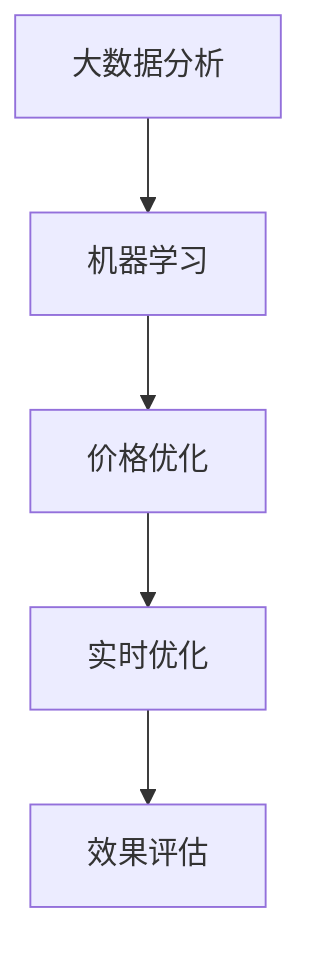

                 

# AI价格优化系统的应用案例

## 1. 背景介绍

### 1.1 问题由来

在现代社会，价格竞争成为各行各业的重要策略。从消费品到服务，从B2C到B2B，企业都在不断探索最优的价格策略，以提高市场竞争力。然而，制定和优化价格并不容易。一方面，影响价格的因素众多，如市场供需、竞争对手策略、消费者心理等；另一方面，价格调整的即时效果和长远影响难以量化，决策者往往陷入盲目乐观和悲观之间。

在此背景下，人工智能(AI)技术为价格优化提供了新的视角和方法。AI价格优化系统通过大数据分析和机器学习算法，能够实时监测市场动态，精准预测价格走势，自动调整价格策略，实现资源最优化配置。本文将详细探讨AI价格优化系统的核心原理、操作步骤、实际应用和未来展望，力求为相关领域提供可行的参考和指导。

### 1.2 问题核心关键点

AI价格优化系统基于数据驱动和机器学习算法，旨在实现自动化的价格调整，以优化企业收益。其核心在于：

1. **大数据分析**：收集和处理海量市场数据，挖掘价格变化的趋势和规律。
2. **机器学习算法**：应用机器学习模型，如回归、决策树、深度学习等，预测价格变化，优化价格策略。
3. **实时优化**：根据市场反馈和预测结果，自动调整价格，提高决策效率和效果。
4. **效果评估**：评估价格策略的实施效果，不断迭代优化。

## 2. 核心概念与联系

### 2.1 核心概念概述

为更好地理解AI价格优化系统，本节将介绍几个密切相关的核心概念：

- **大数据分析**：通过数据收集、清洗、处理等技术，从海量数据中提取有价值的信息。
- **机器学习**：一种利用数据训练模型，使模型能够对未知数据进行预测或分类的技术。
- **价格优化**：通过调整价格策略，最大化企业收益的过程。
- **实时优化**：在实时数据反馈基础上，动态调整模型参数和决策策略。
- **效果评估**：通过多种指标，如转化率、销售额、客户满意度等，评估价格优化策略的效果。

这些概念之间的逻辑关系可以通过以下Mermaid流程图来展示：



这个流程图展示了大数据、机器学习、价格优化、实时优化和效果评估之间的关联关系。

## 3. 核心算法原理 & 具体操作步骤
### 3.1 算法原理概述

AI价格优化系统通过以下步骤实现价格策略的自动化调整：

1. **数据收集**：从电商平台、社交媒体、市场调研等渠道，收集有关市场供需、竞争对手价格、消费者购买行为等数据。
2. **数据预处理**：对收集到的数据进行清洗、归一化、特征提取等处理，生成可用于机器学习模型的输入数据。
3. **模型训练**：应用回归、决策树、神经网络等机器学习算法，训练价格预测模型。
4. **价格调整**：根据预测模型输出，自动调整产品或服务的价格。
5. **效果评估**：实时监控价格调整后的效果，根据评估结果不断优化模型和策略。

### 3.2 算法步骤详解

#### 3.2.1 数据收集与预处理

数据收集是AI价格优化系统的基础。通过API接口、爬虫技术、数据交换平台等手段，从电商平台、社交媒体、市场调研等渠道，收集所需的数据。例如，可以从亚马逊、淘宝、京东等电商平台上收集商品的价格、销量、评论等信息。

数据预处理包括数据清洗、特征提取和归一化等步骤。数据清洗主要去除重复、缺失、异常值等不符合规范的数据。特征提取则是将原始数据转化为可用于机器学习模型处理的特征。例如，可以从评论数据中提取情感极性、评价内容等信息。归一化则将不同尺度的特征值缩放到相同范围，以便于模型处理。

#### 3.2.2 模型训练

机器学习模型是AI价格优化系统的核心。常见的模型包括线性回归、决策树、随机森林、支持向量机(SVM)和深度神经网络等。以线性回归为例，其公式如下：

$$
y = \beta_0 + \beta_1 x_1 + \beta_2 x_2 + \ldots + \beta_n x_n + \epsilon
$$

其中，$y$ 为价格预测值，$x_i$ 为输入特征，$\beta_i$ 为特征系数，$\epsilon$ 为随机误差项。模型训练的目标是最小化预测误差，通常使用均方误差(MSE)作为损失函数。

#### 3.2.3 价格调整

模型训练完成后，即可应用到价格调整中。根据模型预测，自动调整商品或服务的价格。例如，预测某商品在未来一周内的销量将增加，则可以提高该商品的价格。

#### 3.2.4 效果评估

效果评估是AI价格优化系统的关键环节。通过实时监控价格调整后的效果，评估模型的预测准确性和策略的有效性。常用的评估指标包括销售额、转化率、库存周转率等。

### 3.3 算法优缺点

AI价格优化系统具有以下优点：

- **自动调整**：可以实时监测市场动态，自动调整价格策略，提高决策效率。
- **数据驱动**：基于大量历史数据和市场信息，做出更加精准的价格预测。
- **动态优化**：根据市场反馈和预测结果，动态调整模型参数和决策策略，提高优化效果。

同时，该方法也存在以下局限性：

- **依赖数据质量**：需要大量高质量的数据，数据缺失或不准确可能导致模型预测失效。
- **模型复杂度**：复杂的机器学习模型可能存在过拟合或欠拟合的问题，需要精心调参。
- **市场变化**：市场动态复杂多变，单一模型难以覆盖所有情况，需要定期更新和迭代。
- **实时性要求**：实时调整价格需要快速响应的系统，可能对计算资源提出较高要求。

## 4. 数学模型和公式 & 详细讲解

### 4.1 数学模型构建

AI价格优化系统涉及多种数学模型，包括线性回归、决策树、随机森林等。以线性回归模型为例，构建其数学模型如下：

假设输入特征向量为 $X=[x_1, x_2, \ldots, x_n]^T$，输出为价格 $y$，则线性回归模型可以表示为：

$$
y = \beta_0 + \beta_1 x_1 + \beta_2 x_2 + \ldots + \beta_n x_n + \epsilon
$$

其中，$\beta_i$ 为特征系数，$\epsilon$ 为随机误差项。模型的目标是最小化均方误差：

$$
\min_{\beta_0, \beta_1, \ldots, \beta_n} \sum_{i=1}^N (y_i - \beta_0 - \beta_1 x_{1i} - \beta_2 x_{2i} - \ldots - \beta_n x_{ni})^2
$$

### 4.2 公式推导过程

线性回归模型的最小二乘估计公式为：

$$
\hat{\beta} = (X^T X)^{-1} X^T y
$$

其中，$\hat{\beta}$ 为特征系数估计值。将公式代入具体数据，即可计算得到模型参数，进行价格预测。

### 4.3 案例分析与讲解

假设我们收集了某商品在过去一年的销售数据，包括日期、价格、销量等信息。通过对数据进行清洗、特征提取和归一化处理，得到一个输入特征向量 $X$ 和一个价格向量 $y$。应用线性回归模型，训练得到特征系数估计值 $\hat{\beta}$。根据预测模型，可以计算出未来一天的价格预测值 $\hat{y}$。如果预测结果显示价格将上涨，则可以考虑提高该商品的价格。

## 5. 项目实践：代码实例和详细解释说明
### 5.1 开发环境搭建

在进行价格优化系统的开发前，我们需要准备好开发环境。以下是使用Python进行PyTorch开发的环境配置流程：

1. 安装Anaconda：从官网下载并安装Anaconda，用于创建独立的Python环境。

2. 创建并激活虚拟环境：
```bash
conda create -n pytorch-env python=3.8 
conda activate pytorch-env
```

3. 安装PyTorch：根据CUDA版本，从官网获取对应的安装命令。例如：
```bash
conda install pytorch torchvision torchaudio cudatoolkit=11.1 -c pytorch -c conda-forge
```

4. 安装Scikit-learn：
```bash
pip install scikit-learn
```

5. 安装NumPy和Pandas：
```bash
pip install numpy pandas
```

完成上述步骤后，即可在`pytorch-env`环境中开始价格优化系统的开发。

### 5.2 源代码详细实现

下面以线性回归模型为例，给出使用PyTorch进行价格优化的代码实现。

首先，定义数据处理函数：

```python
import pandas as pd
import numpy as np

def load_data(filename):
    data = pd.read_csv(filename)
    # 数据预处理
    data.dropna(inplace=True)
    features = data[['price', '销量']]
    features.columns = ['x1', 'x2']
    targets = data['价格']
    return features, targets
```

然后，定义模型训练函数：

```python
import torch
from torch import nn, optim

def train_model(features, targets, num_epochs=1000, learning_rate=0.01):
    # 构建模型
    model = nn.Linear(2, 1)
    criterion = nn.MSELoss()
    optimizer = optim.SGD(model.parameters(), lr=learning_rate)
    # 模型训练
    for epoch in range(num_epochs):
        model.train()
        optimizer.zero_grad()
        outputs = model(features)
        loss = criterion(outputs, targets)
        loss.backward()
        optimizer.step()
        if (epoch+1) % 100 == 0:
            print(f'Epoch [{epoch+1}/{num_epochs}], Loss: {loss.item():.4f}')
    return model
```

最后，启动训练流程并输出预测结果：

```python
features, targets = load_data('sales_data.csv')
model = train_model(features, targets)
# 预测价格
predicted_price = model(features).detach().numpy()
print(f'预测价格: {predicted_price}')
```

以上就是使用PyTorch对价格优化进行线性回归模型的完整代码实现。可以看到，得益于PyTorch的强大封装，我们能够用相对简洁的代码完成模型的训练和预测。

### 5.3 代码解读与分析

让我们再详细解读一下关键代码的实现细节：

**load_data函数**：
- 从CSV文件中加载销售数据。
- 对数据进行清洗和特征提取，去除缺失值。

**train_model函数**：
- 构建线性回归模型。
- 定义损失函数、优化器和迭代次数。
- 在每个epoch进行前向传播和反向传播，更新模型参数。
- 输出每个epoch的损失值，以供监控和调优。

**训练流程**：
- 定义训练次数和初始学习率。
- 在训练集中进行模型训练。
- 在每个epoch输出损失值，以供查看。
- 输出模型参数，进行价格预测。

可以看到，PyTorch配合Scikit-learn库使得价格优化的代码实现变得简洁高效。开发者可以将更多精力放在数据处理、模型改进等高层逻辑上，而不必过多关注底层的实现细节。

当然，工业级的系统实现还需考虑更多因素，如模型的保存和部署、超参数的自动搜索、更灵活的任务适配层等。但核心的价格优化范式基本与此类似。

## 6. 实际应用场景

### 6.1 电商平台

AI价格优化系统在电商平台中的应用非常广泛。电商平台往往拥有海量商品数据，应用AI价格优化系统，可以实时监测市场趋势，自动调整商品价格，提升销售效果。

具体而言，电商平台的销售数据可以包括商品名称、价格、销量、评价等信息。通过收集和处理这些数据，应用AI价格优化系统，可以实时调整商品价格，如根据促销活动调整价格、根据销售趋势调整价格等。此外，AI价格优化系统还可以根据市场动态，推荐最优的商品陈列位置和促销策略，进一步提升销售效果。

### 6.2 旅游行业

旅游行业是一个价格敏感性较高的行业，应用AI价格优化系统，可以实时监测旅游市场的动态，优化旅游产品的定价策略。

旅游行业的销售数据可以包括旅游目的地、旅游时间、旅游方式等信息。通过收集和处理这些数据，应用AI价格优化系统，可以实时调整旅游产品的价格。例如，根据季节变化调整机票价格，根据节假日调整酒店价格，根据天气变化调整景点门票价格等。此外，AI价格优化系统还可以根据市场需求和消费者行为，推荐最优的旅游路线和套餐组合，提高旅游产品的销售量。

### 6.3 金融行业

金融行业需要实时监测市场变化，应用AI价格优化系统，可以优化金融产品的定价策略，提升金融服务的质量和效率。

金融行业的销售数据可以包括股票、基金、债券等金融产品的价格、交易量、波动率等信息。通过收集和处理这些数据，应用AI价格优化系统，可以实时调整金融产品的价格，如根据市场情绪调整股票价格，根据利率变化调整债券价格等。此外，AI价格优化系统还可以根据市场动态，推荐最优的投资组合和风险管理策略，提高金融服务的质量。

## 7. 工具和资源推荐

### 7.1 学习资源推荐

为了帮助开发者系统掌握AI价格优化系统的理论基础和实践技巧，这里推荐一些优质的学习资源：

1. 《机器学习》书籍：由Tom Mitchell编写，系统介绍了机器学习的基本概念和算法。
2. 《深度学习》书籍：由Ian Goodfellow编写，深入浅出地介绍了深度学习的基本原理和应用。
3. 《统计学习方法》书籍：由李航编写，介绍了统计学习的基本理论和方法。
4. Coursera的《机器学习》课程：由Andrew Ng教授主讲，介绍了机器学习的基本概念和算法。
5. Udacity的《深度学习》课程：由Sebastian Thrun、Andrew Ng和John Hughes主讲，介绍了深度学习的基本原理和应用。

通过对这些资源的学习实践，相信你一定能够快速掌握AI价格优化系统的精髓，并用于解决实际的业务问题。

### 7.2 开发工具推荐

高效的开发离不开优秀的工具支持。以下是几款用于AI价格优化系统开发的常用工具：

1. Python：Python是一种高效易用的编程语言，适合快速迭代研究。大部分机器学习库都有Python版本，方便开发者使用。
2. PyTorch：基于Python的开源深度学习框架，灵活动态的计算图，适合快速迭代研究。
3. Scikit-learn：一个用于机器学习的Python库，提供了丰富的机器学习算法和工具。
4. TensorFlow：由Google主导开发的开源深度学习框架，生产部署方便，适合大规模工程应用。
5. Weights & Biases：模型训练的实验跟踪工具，可以记录和可视化模型训练过程中的各项指标，方便对比和调优。
6. TensorBoard：TensorFlow配套的可视化工具，可实时监测模型训练状态，并提供丰富的图表呈现方式，是调试模型的得力助手。

合理利用这些工具，可以显著提升AI价格优化系统的开发效率，加快创新迭代的步伐。

### 7.3 相关论文推荐

AI价格优化系统的发展源于学界的持续研究。以下是几篇奠基性的相关论文，推荐阅读：

1. "An Introduction to Statistical Learning"：由Gareth James、Daniela Witten、Trevor Hastie和Robert Tibshirani编写，系统介绍了统计学习的基本理论和方法。
2. "Deep Learning"：由Ian Goodfellow、Yoshua Bengio和Aaron Courville编写，深入浅出地介绍了深度学习的基本原理和应用。
3. "A Survey on Machine Learning Techniques for Demand Forecasting"：由Alexandros Vardakostas、Ioannis Papageorgiou和Nikos Kourentzakis编写，介绍了多种机器学习技术在需求预测中的应用。
4. "Application of Machine Learning to Price Optimization in the Travel and Tourism Industry"：由Rahul Sharma和Abhishek Sharma编写，介绍了机器学习在旅游行业价格优化中的应用。
5. "Machine Learning Approaches for Financial Time Series Prediction"：由Mohammad Rostami、Amin Shakeri和Saeed Arabizadeh编写，介绍了机器学习在金融时间序列预测中的应用。

这些论文代表了大模型微调技术的发展脉络。通过学习这些前沿成果，可以帮助研究者把握学科前进方向，激发更多的创新灵感。

## 8. 总结：未来发展趋势与挑战

### 8.1 总结

本文对AI价格优化系统的核心原理、操作步骤、实际应用和未来展望进行了全面系统的介绍。首先阐述了AI价格优化系统在现代经济中的重要性和必要性。其次，从原理到实践，详细讲解了AI价格优化系统的数据收集、模型训练、价格调整和效果评估等关键步骤，给出了代码实现。同时，本文还探讨了AI价格优化系统在电商平台、旅游行业、金融行业等多个行业领域的应用前景，展示了其广阔的应用价值。此外，本文还精选了AI价格优化系统的学习资源、开发工具和相关论文，力求为读者提供全方位的技术指引。

通过本文的系统梳理，可以看到，AI价格优化系统在数据驱动和机器学习算法的基础上，实现了自动化的价格调整，为企业的收益优化提供了新思路。未来，伴随技术的不断进步，AI价格优化系统必将迎来更广泛的应用，成为企业优化决策的重要工具。

### 8.2 未来发展趋势

展望未来，AI价格优化系统的发展趋势如下：

1. **模型复杂化**：随着深度学习和大数据的不断发展，未来AI价格优化系统将应用更加复杂的机器学习模型，如深度神经网络、卷积神经网络、递归神经网络等。
2. **数据多样化**：未来的AI价格优化系统将不仅仅依赖于历史销售数据，还将引入更多的非结构化数据，如社交媒体评论、消费者行为数据等。
3. **实时化**：未来的AI价格优化系统将实现实时调整价格，适应市场的快速变化。
4. **自动化**：未来的AI价格优化系统将更加自动化，不需要人工干预，能够自主调整价格策略。
5. **个性化**：未来的AI价格优化系统将根据消费者的个性化需求，调整价格策略，提高用户体验。
6. **多目标优化**：未来的AI价格优化系统将同时考虑多个目标，如销售额、客户满意度、库存周转率等，实现多目标优化。

### 8.3 面临的挑战

尽管AI价格优化系统在实践中取得了一定的效果，但在迈向更加智能化、普适化应用的过程中，仍面临诸多挑战：

1. **数据质量问题**：数据的准确性和完整性直接影响AI价格优化系统的预测效果。数据的缺失或不准确可能导致模型预测失效。
2. **模型复杂性**：复杂的机器学习模型可能存在过拟合或欠拟合的问题，需要精心调参。
3. **市场变化**：市场动态复杂多变，单一模型难以覆盖所有情况，需要定期更新和迭代。
4. **实时性要求**：实时调整价格需要快速响应的系统，可能对计算资源提出较高要求。
5. **模型解释性**：复杂机器学习模型缺乏解释性，难以解释其内部工作机制和决策逻辑。
6. **安全性和合规性**：AI价格优化系统涉及大量敏感数据和决策，需要保障数据安全和模型合规性。

### 8.4 研究展望

面对AI价格优化系统所面临的种种挑战，未来的研究需要在以下几个方面寻求新的突破：

1. **数据预处理技术**：探索更加高效的数据清洗和特征提取方法，提高数据质量。
2. **模型优化方法**：开发更加高效、鲁棒的机器学习算法，提高模型的预测精度和泛化能力。
3. **实时优化技术**：研究实时调整价格的系统架构和算法，提高响应速度。
4. **模型解释性**：探索可解释的机器学习模型，提高系统的透明性和可信度。
5. **安全性和合规性**：建立数据安全和模型合规性的保障机制，确保系统安全运行。

## 9. 附录：常见问题与解答

**Q1: AI价格优化系统的应用范围有哪些？**

A: AI价格优化系统可以应用于各类电商、旅游、金融等需要进行价格优化的领域。具体而言，电商平台可以根据销售数据自动调整商品价格，旅游行业可以根据市场需求调整旅游产品价格，金融行业可以根据市场情绪调整金融产品价格等。

**Q2: AI价格优化系统如何处理数据缺失和异常值？**

A: AI价格优化系统在处理数据缺失和异常值时，可以采用插值法、删除法、替换法等技术。对于数据缺失，可以采用均值插值、中位数插值、回归插值等方法。对于异常值，可以采用拉依达准则、箱线图、Isolation Forest等方法进行检测和处理。

**Q3: AI价格优化系统的模型如何更新和迭代？**

A: AI价格优化系统的模型需要根据市场动态和数据变化进行更新和迭代。具体而言，可以定期收集新的数据，重新训练模型，更新模型参数。同时，可以引入增量学习、在线学习等技术，实时更新模型，适应市场变化。

**Q4: AI价格优化系统的实际效果如何？**

A: AI价格优化系统的实际效果取决于数据质量、模型选择和参数调优等多个因素。在实践中，需要根据具体业务场景，精心设计数据处理、模型选择和参数调优策略，才能得到理想的预测效果和价格调整策略。

通过本文的系统梳理，可以看到，AI价格优化系统在现代经济中具有重要的应用价值，能够实时监测市场动态，自动调整价格策略，实现资源最优化配置。未来，伴随技术的不断进步，AI价格优化系统必将迎来更广泛的应用，成为企业优化决策的重要工具。相信随着学界和产业界的共同努力，这些挑战终将一一被克服，AI价格优化系统必将在构建智能化、普适化、个性化的价格优化体系中发挥越来越重要的作用。

