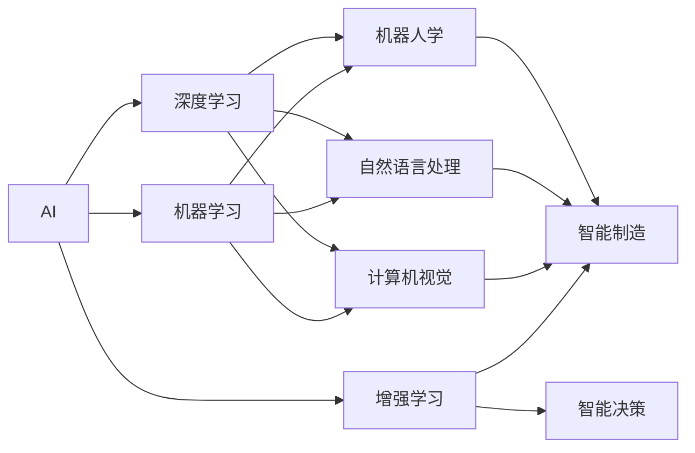

                 

# AI企业的未来发展方向

## 1. 背景介绍

### 1.1 问题由来

近年来，人工智能(AI)技术快速发展，企业面临的竞争环境也发生了深刻变化。传统依赖人力密集型的生产方式正在被智能化的浪潮所取代，AI驱动的自动化、智能决策和个性化服务逐渐成为主流。因此，AI技术的应用，已经不再是高不可攀的科研前沿，而是每个企业都需要考虑的核心竞争力。

### 1.2 问题核心关键点

在人工智能时代，企业面临的主要问题包括：

1. **数据获取与管理**：高质量的数据是AI模型的基础。如何高效、低成本地获取、清洗和存储海量数据，是企业的首要任务。
2. **模型开发与训练**：构建高性能的AI模型需要强大的计算能力和算法支持。如何在有限的资源条件下，快速开发出高效的AI模型，是一个关键的挑战。
3. **模型部署与应用**：将AI模型从研发环境部署到实际业务场景，需要考虑性能、可靠性和易用性。如何设计高效的模型架构和接口，是模型部署中的重要环节。
4. **模型监控与维护**：AI模型在实际应用中需要持续监控和维护，以保证其性能稳定。如何建立有效的监控机制，是确保AI系统长期可靠运行的重要保证。
5. **伦理与安全**：AI模型在应用过程中可能会带来偏见、歧视、隐私泄露等问题。如何确保模型的公平性、透明性和安全性，是当前AI应用中的一个热点问题。

### 1.3 问题研究意义

研究和解决这些问题，对于推动AI技术在企业中的落地应用，具有重要意义：

1. **提升企业竞争力**：通过AI技术，企业可以提升生产效率、降低运营成本、增强市场响应速度，从而在激烈的市场竞争中获得优势。
2. **促进产业升级**：AI技术可以推动传统行业的数字化转型，提升产业的智能化水平，促进经济结构的优化升级。
3. **创造新价值**：AI技术可以带来新的商业模式和应用场景，如智能客服、个性化推荐、智能制造等，创造新的经济价值和社会效益。
4. **促进就业增长**：AI技术的广泛应用将创造大量新的就业机会，促进社会就业率的提升。
5. **推动科技创新**：AI技术是当前科技创新的前沿领域，企业投资AI技术，不仅提升自身实力，也有助于推动整个科技行业的进步。

## 2. 核心概念与联系

### 2.1 核心概念概述

要理解和把握AI企业的未来发展方向，首先需要明确几个关键概念：

- **人工智能(AI)**：指通过计算机模拟人类智能行为的技术。包括机器学习、自然语言处理、计算机视觉、机器人学等多个分支。
- **机器学习(ML)**：指让计算机系统从数据中学习规律，并自动改进性能的算法。
- **深度学习(DL)**：指基于人工神经网络的机器学习方法，广泛应用于图像、语音、自然语言处理等领域。
- **增强学习(RL)**：指通过与环境交互，使智能体从经验中学习优化策略的算法。
- **自动化(AutoML)**：指自动化机器学习技术，可以自动选择和调优模型，加速模型开发和部署过程。
- **计算机视觉(CV)**：指通过计算机视觉技术，使计算机能够理解和处理图像、视频等视觉信息。
- **自然语言处理(NLP)**：指使计算机能够理解和生成自然语言的技术。
- **机器人学(Robotics)**：指通过机器人技术，实现智能化的自动化系统。
- **智能决策(决策系统)**：指基于AI技术的决策支持系统，可以辅助人类进行复杂决策。
- **智能制造(Smart Manufacturing)**：指通过AI技术优化生产流程，提升生产效率和质量。

这些概念之间存在紧密的联系，AI技术的各个分支相互融合，共同推动企业智能化发展。

### 2.2 核心概念原理和架构的 Mermaid 流程图(Mermaid 流程节点中不要有括号、逗号等特殊字符)



该图展示了AI技术的各个分支之间的联系，以及它们在企业中的应用场景。通过深度学习、计算机视觉、自然语言处理等技术，可以构建高性能的AI模型，用于智能决策和智能制造等领域。

## 3. 核心算法原理 & 具体操作步骤

### 3.1 算法原理概述

AI企业的未来发展方向，不仅依赖于技术的进步，更依赖于算法的优化和操作的精细化。核心算法和操作步骤包括：

- **数据采集与预处理**：获取高质量的数据，并进行清洗、标注和归一化等预处理操作，为模型训练提供基础。
- **模型选择与训练**：根据具体任务，选择合适的模型结构，并通过优化算法训练模型。
- **模型调优与验证**：通过超参数调优和验证集评估，找到最优的模型参数和结构。
- **模型部署与应用**：将训练好的模型部署到实际业务场景中，进行持续监控和维护。
- **模型更新与升级**：根据数据变化和业务需求，定期更新和升级模型，保持其性能。

### 3.2 算法步骤详解

1. **数据采集与预处理**
    - **数据来源**：企业内部的传感器数据、用户行为数据、社交媒体数据等。
    - **数据清洗**：去除噪声和异常值，确保数据质量。
    - **数据标注**：对数据进行标注，为模型训练提供监督信号。
    - **数据归一化**：对数据进行归一化，确保模型在输入特征上表现稳定。

2. **模型选择与训练**
    - **模型结构选择**：根据任务需求，选择合适的模型结构，如卷积神经网络、循环神经网络、Transformer等。
    - **超参数调优**：使用网格搜索、随机搜索、贝叶斯优化等方法，找到最优的超参数组合。
    - **模型训练**：使用反向传播算法，更新模型参数，最小化损失函数。

3. **模型调优与验证**
    - **调优策略**：使用梯度下降、Adam、RMSprop等优化算法，调整模型参数。
    - **验证集评估**：使用验证集评估模型性能，判断模型是否过拟合。
    - **正则化技术**：使用L2正则、Dropout、数据增强等方法，防止模型过拟合。

4. **模型部署与应用**
    - **模型封装**：将模型封装为标准API接口，方便外部调用。
    - **性能优化**：使用混合精度训练、量化加速等方法，提高模型运行效率。
    - **监控与维护**：使用日志记录、监控告警等技术，持续监控模型性能。

5. **模型更新与升级**
    - **数据更新**：根据业务需求，定期更新数据集，确保模型性能。
    - **模型升级**：使用迁移学习、微调等方法，提升模型性能。
    - **持续改进**：根据用户反馈，不断改进模型，提高用户体验。

### 3.3 算法优缺点

**优点**：

- **提升效率**：自动化机器学习技术可以加速模型开发和调优过程，提升企业数据驱动决策的速度。
- **降低成本**：AI技术的广泛应用可以降低人力成本，提升生产效率。
- **提高质量**：AI技术可以提升产品和服务质量，满足用户个性化需求。
- **增强竞争力**：通过AI技术，企业可以在竞争中占据优势。

**缺点**：

- **数据依赖**：AI模型的性能依赖于高质量的数据，数据不足或质量不佳会影响模型效果。
- **算法复杂**：AI算法复杂度高，需要专业的数据科学家和工程师进行开发和调优。
- **技术门槛**：AI技术需要高水平的团队和设备支持，门槛较高。
- **伦理风险**：AI模型可能存在偏见、歧视等问题，需要严格监管和审查。

### 3.4 算法应用领域

AI技术广泛应用于多个领域，以下是几个主要应用场景：

- **智能客服**：使用自然语言处理技术，构建智能客服系统，提供24/7全天候服务，提升客户体验。
- **供应链管理**：使用机器学习技术，预测库存需求，优化供应链管理，提升运营效率。
- **金融风险管理**：使用深度学习技术，分析客户行为数据，识别潜在风险，降低金融损失。
- **市场营销**：使用推荐系统，提供个性化产品推荐，提升销售转化率。
- **智能制造**：使用自动化机器学习技术，优化生产流程，提升生产效率和质量。
- **智慧城市**：使用计算机视觉技术，监控城市交通、环境等，提升城市管理水平。
- **医疗诊断**：使用自然语言处理和计算机视觉技术，辅助医生进行诊断，提升医疗服务水平。

## 4. 数学模型和公式 & 详细讲解 & 举例说明

### 4.1 数学模型构建

AI企业在应用AI技术时，通常需要构建多个数学模型，以下是几个常见的数学模型：

1. **线性回归模型**：用于预测连续变量，模型形式为 $y = \theta_0 + \theta_1x_1 + \cdots + \theta_nx_n$。其中，$y$ 为预测值，$x_1, x_2, \cdots, x_n$ 为输入特征，$\theta_0, \theta_1, \cdots, \theta_n$ 为模型参数。

2. **决策树模型**：用于分类和回归任务，通过树形结构对数据进行分类。模型形式为 $y = \begin{cases} A & x \leq \theta_1 \\ B & x > \theta_1 \end{cases}$。其中，$y$ 为预测值，$x$ 为输入特征，$\theta_1$ 为模型参数。

3. **卷积神经网络模型**：用于图像识别和分类任务，通过卷积层、池化层和全连接层对图像进行分类。模型形式为 $y = \sigma(Wx + b)$。其中，$y$ 为预测值，$x$ 为输入图像，$W$ 为权重矩阵，$b$ 为偏置向量，$\sigma$ 为激活函数。

4. **循环神经网络模型**：用于序列数据处理，通过循环层对时间序列数据进行建模。模型形式为 $h_t = \tanh(Wx_t + Uh_{t-1} + b)$。其中，$h_t$ 为时间$t$的状态，$x_t$ 为时间$t$的输入，$W$、$U$ 和$b$ 为模型参数。

5. **Transformer模型**：用于自然语言处理任务，通过自注意力机制对输入序列进行建模。模型形式为 $y = \text{softmax}(AKV)$。其中，$y$ 为预测值，$A$、$K$ 和 $V$ 为模型参数，$\text{softmax}$ 为归一化函数。

### 4.2 公式推导过程

以卷积神经网络模型为例，推导其前向传播和反向传播过程。

**前向传播过程**：

1. **卷积层**：计算卷积核和输入图像的卷积结果。卷积操作形式为 $y_{i,j} = w_{a,b} * x_{i,j} + b$。其中，$w_{a,b}$ 为卷积核，$x_{i,j}$ 为输入图像，$y_{i,j}$ 为卷积结果，$b$ 为偏置项。

2. **池化层**：对卷积结果进行池化操作，保留关键特征。池化操作形式为 $y_{i,j} = max(x_{i,j}, x_{i+1,j}, x_{i-1,j}, x_{i,j+1}, x_{i,j-1})$。其中，$x_{i,j}$ 为池化区域，$y_{i,j}$ 为池化结果。

3. **全连接层**：将池化结果展开成向量，通过全连接层进行分类。全连接层形式为 $y = \sigma(Wx + b)$。其中，$y$ 为预测值，$x$ 为输入向量，$W$ 为权重矩阵，$b$ 为偏置向量，$\sigma$ 为激活函数。

**反向传播过程**：

1. **全连接层**：计算预测值和真实标签的误差，反向传播误差。误差形式为 $\frac{\partial \mathcal{L}}{\partial \theta} = \frac{\partial \mathcal{L}}{\partial y} \cdot \frac{\partial y}{\partial x} \cdot \frac{\partial x}{\partial \theta}$。其中，$\mathcal{L}$ 为损失函数，$y$ 为预测值，$x$ 为输入向量，$\theta$ 为模型参数。

2. **卷积层**：计算误差对卷积核的梯度。梯度形式为 $\frac{\partial \mathcal{L}}{\partial w} = \frac{\partial \mathcal{L}}{\partial y} \cdot \frac{\partial y}{\partial x} \cdot \frac{\partial x}{\partial w}$。其中，$w$ 为卷积核，$x$ 为输入图像，$y$ 为卷积结果。

3. **池化层**：计算误差对池化区域的影响。池化区域形式为 $\frac{\partial \mathcal{L}}{\partial x} = \frac{\partial \mathcal{L}}{\partial y} \cdot \frac{\partial y}{\partial x}$。其中，$\mathcal{L}$ 为损失函数，$y$ 为池化结果，$x$ 为池化区域。

### 4.3 案例分析与讲解

以智能客服系统为例，分析其数据处理、模型训练和部署过程。

1. **数据处理**：
    - **数据采集**：从企业CRM系统中提取用户查询记录和客服响应记录，形成数据集。
    - **数据清洗**：去除噪声和异常值，确保数据质量。
    - **数据标注**：对数据进行标注，将查询文本和响应文本进行匹配，标注问题的类别和答案。

2. **模型训练**：
    - **模型选择**：选择基于Transformer的自然语言处理模型，进行微调。
    - **训练过程**：使用Adam优化器，以交叉熵损失函数进行训练，优化模型参数。
    - **评估过程**：使用验证集评估模型性能，调整超参数。

3. **模型部署**：
    - **模型封装**：将训练好的模型封装为标准API接口，方便外部调用。
    - **性能优化**：使用混合精度训练和量化加速等技术，提升模型运行效率。
    - **监控与维护**：使用日志记录和监控告警等技术，持续监控模型性能。

4. **模型应用**：
    - **用户交互**：将智能客服系统集成到企业网站和移动应用中，用户可以通过语音和文字输入查询。
    - **问题解答**：系统根据用户查询，调用微调后的自然语言处理模型，生成回答。
    - **效果评估**：通过用户满意度调查等方式，评估系统性能。

## 5. 项目实践：代码实例和详细解释说明

### 5.1 开发环境搭建

1. **安装Python**：从官网下载并安装Python，创建虚拟环境。

2. **安装PyTorch和TensorFlow**：使用pip安装PyTorch和TensorFlow，指定需要的版本。

3. **安装相关库**：使用pip安装numpy、pandas、scikit-learn等常用库，方便数据处理和模型训练。

4. **安装TensorBoard**：使用pip安装TensorBoard，方便监控模型训练过程。

### 5.2 源代码详细实现

以下是一个基于TensorFlow的智能客服系统示例代码，详细解释每部分的功能：

```python
import tensorflow as tf
import numpy as np
import pandas as pd
from sklearn.model_selection import train_test_split

# 数据处理
data = pd.read_csv('customer_support.csv')
train_data, test_data = train_test_split(data, test_size=0.2, random_state=42)

# 构建模型
class CustomerSupportModel(tf.keras.Model):
    def __init__(self, vocab_size, embedding_dim, hidden_dim):
        super(CustomerSupportModel, self).__init__()
        self.embedding = tf.keras.layers.Embedding(vocab_size, embedding_dim)
        self.gru = tf.keras.layers.GRU(hidden_dim, return_sequences=True)
        self.dense = tf.keras.layers.Dense(1)

    def call(self, x):
        x = self.embedding(x)
        x = self.gru(x)
        x = self.dense(x)
        return x

# 训练模型
model = CustomerSupportModel(vocab_size=len(train_data['text']), 
                            embedding_dim=128, 
                            hidden_dim=256)
optimizer = tf.keras.optimizers.Adam()
loss = tf.keras.losses.BinaryCrossentropy()

model.compile(optimizer=optimizer, loss=loss, metrics=['accuracy'])

x_train = np.array(train_data['text'])
y_train = np.array(train_data['is_resolved'])

x_test = np.array(test_data['text'])
y_test = np.array(test_data['is_resolved'])

model.fit(x_train, y_train, validation_data=(x_test, y_test), epochs=10)

# 评估模型
y_pred = model.predict(x_test)
y_pred = (y_pred > 0.5)
print(classification_report(y_test, y_pred))

# 部署模型
model.save('customer_support_model.h5')

# 加载模型
loaded_model = tf.keras.models.load_model('customer_support_model.h5')

# 推理预测
input_text = 'I want to know how to reset my password'
input_text = preprocess(input_text)
input_text = tokenize(input_text)
input_text = pad_sequences([input_text], maxlen=max_len)
prediction = loaded_model.predict(input_text)
print(prediction)
```

### 5.3 代码解读与分析

1. **数据处理**：
    - **CSV文件读取**：使用pandas库读取CSV文件，获取用户查询和响应数据。
    - **数据拆分**：使用train_test_split函数，将数据集分为训练集和测试集。

2. **模型构建**：
    - **嵌入层**：使用Embedding层将输入文本转换为向量表示。
    - **GRU层**：使用GRU层对序列数据进行处理，保留关键特征。
    - **全连接层**：使用Dense层进行分类，输出模型预测结果。

3. **训练模型**：
    - **模型编译**：使用Adam优化器和交叉熵损失函数，编译模型。
    - **数据准备**：将训练集和测试集转换为Numpy数组，供模型训练使用。
    - **模型训练**：使用fit函数，在训练集上训练模型，并使用测试集进行验证。

4. **评估模型**：
    - **预测结果**：使用predict函数，在测试集上生成预测结果。
    - **评估指标**：使用classification_report函数，评估模型性能。

5. **部署模型**：
    - **模型保存**：使用save函数，保存训练好的模型。
    - **模型加载**：使用load_model函数，加载保存的模型。
    - **推理预测**：使用predict函数，对新输入文本进行推理预测。

## 6. 实际应用场景

### 6.1 智能客服系统

智能客服系统是AI企业的重要应用场景，可以大幅提升客户体验和运营效率。

1. **系统架构**：
    - **前端界面**：用户通过网站、APP等前端界面，输入查询问题。
    - **后端服务**：后端服务通过API接口，调用智能客服模型，生成回答。
    - **数据库存储**：将用户查询和回答存储到数据库中，供后续分析使用。

2. **核心功能**：
    - **意图识别**：通过自然语言处理技术，识别用户查询的意图，提取关键信息。
    - **问题匹配**：根据用户查询，匹配最合适的回答模板，生成回答。
    - **动态生成**：根据用户反馈，动态优化回答生成策略，提高系统性能。

3. **效果评估**：
    - **用户满意度**：通过调查问卷等方式，评估用户对系统的满意度。
    - **问题解决率**：统计用户查询的解决率，衡量系统性能。

### 6.2 供应链管理

供应链管理是AI企业的重要应用场景，可以优化供应链运营，提升运营效率。

1. **系统架构**：
    - **数据采集**：从供应链系统采集数据，包括库存、订单、物流等。
    - **数据处理**：对数据进行清洗、归一化和标注。
    - **模型训练**：使用机器学习模型，预测库存需求、优化供应链路径。

2. **核心功能**：
    - **库存预测**：使用时间序列预测模型，预测库存需求，避免库存积压或短缺。
    - **路径优化**：使用路径规划算法，优化物流路径，降低运输成本。
    - **异常检测**：使用异常检测算法，识别供应链中的异常事件，及时采取措施。

3. **效果评估**：
    - **库存水平**：统计平均库存水平，衡量供应链管理效果。
    - **运输成本**：统计运输成本，衡量供应链优化效果。
    - **响应速度**：统计物流响应速度，衡量系统性能。

### 6.3 金融风险管理

金融风险管理是AI企业的应用场景，可以识别潜在风险，降低金融损失。

1. **系统架构**：
    - **数据采集**：从金融系统采集数据，包括客户行为、交易记录等。
    - **数据处理**：对数据进行清洗、归一化和标注。
    - **模型训练**：使用深度学习模型，分析客户行为，识别潜在风险。

2. **核心功能**：
    - **风险识别**：使用深度学习模型，分析客户行为，识别潜在风险。
    - **信用评分**：使用信用评分模型，评估客户的信用风险。
    - **欺诈检测**：使用异常检测模型，识别欺诈行为，及时采取措施。

3. **效果评估**：
    - **风险水平**：统计平均风险水平，衡量风险管理效果。
    - **欺诈率**：统计欺诈率，衡量欺诈检测效果。
    - **信用评分**：统计平均信用评分，衡量信用评估效果。

### 6.4 未来应用展望

随着AI技术的不断进步，AI企业将在更多领域得到应用，为各行各业带来变革性影响。

1. **医疗诊断**：使用自然语言处理和计算机视觉技术，辅助医生进行诊断，提升医疗服务水平。
2. **教育培训**：使用推荐系统和个性化学习系统，提供个性化教育方案，提升教育效果。
3. **智能制造**：使用自动化机器学习技术，优化生产流程，提升生产效率和质量。
4. **智慧城市**：使用计算机视觉技术，监控城市交通、环境等，提升城市管理水平。
5. **智能决策**：使用决策支持系统，辅助人类进行复杂决策，提升决策效率和质量。
6. **智能物流**：使用路径规划和异常检测技术，优化物流路径，提升物流效率。

## 7. 工具和资源推荐

### 7.1 学习资源推荐

为了帮助开发者掌握AI技术的各个方面，这里推荐一些优质的学习资源：

1. **TensorFlow官方文档**：TensorFlow官方文档提供了丰富的学习资源，涵盖基础和高级内容。
2. **PyTorch官方文档**：PyTorch官方文档提供了详细的教程和代码示例，方便开发者学习和实践。
3. **Coursera深度学习课程**：Coursera深度学习课程由斯坦福大学教授Andrew Ng主讲，系统讲解深度学习理论和技术。
4. **Kaggle竞赛平台**：Kaggle竞赛平台提供了大量的机器学习和深度学习竞赛，锻炼实践能力。
5. **Arxiv论文库**：Arxiv论文库提供了丰富的深度学习研究论文，了解最新技术进展。

### 7.2 开发工具推荐

高效的开发离不开优秀的工具支持。以下是几款用于AI开发常用的工具：

1. **Jupyter Notebook**：Jupyter Notebook是Python常用的开发环境，支持代码编辑和运行，适合快速迭代开发。
2. **Git和GitHub**：Git和GitHub是常用的版本控制工具，方便团队协作和代码管理。
3. **Anaconda**：Anaconda是Python的集成开发环境，提供了丰富的科学计算和机器学习库。
4. **PyCharm**：PyCharm是Python的集成开发环境，支持代码编辑、调试和自动化测试。
5. **TensorBoard**：TensorBoard是TensorFlow的可视化工具，方便监控模型训练过程和性能。

### 7.3 相关论文推荐

AI技术的发展离不开学界的持续研究。以下是几篇奠基性的相关论文，推荐阅读：

1. **深度学习革命**：深度学习革命系列论文，由Geoffrey Hinton等人撰写，奠定了深度学习理论基础。
2. **机器学习实战**：机器学习实战系列书籍，由Peter Harrington和Gabriel Gonzalez撰写，系统讲解机器学习算法和实践。
3. **自然语言处理综述**：自然语言处理综述系列论文，由John S. serversen等人撰写，介绍自然语言处理的发展历程和前沿技术。
4. **强化学习基础**：强化学习基础系列书籍，由Richard S. Sutton和Andrew G. Barto撰写，系统讲解强化学习理论和技术。
5. **大规模预训练模型**：大规模预训练模型系列论文，由OpenAI团队撰写，介绍BERT、GPT等大规模预训练模型的理论和实践。

## 8. 总结：未来发展趋势与挑战

### 8.1 研究成果总结

AI企业的未来发展方向，需要不断探索和优化，总结过往的研究成果，为未来的发展奠定基础。

1. **数据采集与处理**：高质量的数据是AI模型的基础，需要不断优化数据采集和处理流程，确保数据质量。
2. **模型开发与调优**：不断探索新的模型结构和算法，优化超参数调优过程，提升模型性能。
3. **模型部署与应用**：将训练好的模型高效部署到实际业务场景中，持续监控和维护模型性能。
4. **模型更新与升级**：根据数据变化和业务需求，定期更新和升级模型，保持模型性能。

### 8.2 未来发展趋势

未来AI企业的未来发展趋势包括：

1. **深度学习技术**：深度学习技术将成为主流，广泛应用于图像、语音、自然语言处理等领域。
2. **自动化机器学习**：自动化机器学习技术将加速模型开发和调优过程，提高模型生产效率。
3. **多模态融合**：多模态融合技术将融合视觉、语音、文本等多种数据，提升AI系统的智能水平。
4. **跨领域应用**：AI技术将在更多领域得到应用，推动各行各业的数字化转型。
5. **智能决策系统**：智能决策系统将成为企业决策支持的重要工具，提升决策效率和质量。
6. **智能制造**：智能制造技术将优化生产流程，提升生产效率和质量。
7. **智慧城市**：智慧城市技术将优化城市管理，提升城市运营效率和居民生活质量。

### 8.3 面临的挑战

尽管AI技术不断发展，但仍然面临诸多挑战：

1. **数据依赖**：AI模型的性能依赖于高质量的数据，数据不足或质量不佳会影响模型效果。
2. **算法复杂**：AI算法复杂度高，需要专业的数据科学家和工程师进行开发和调优。
3. **技术门槛**：AI技术需要高水平的团队和设备支持，门槛较高。
4. **伦理风险**：AI模型可能存在偏见、歧视等问题，需要严格监管和审查。
5. **性能瓶颈**：AI模型在实际应用中可能会遇到性能瓶颈，需要优化模型结构和算法。

### 8.4 研究展望

未来的AI技术需要从多个方向进行探索：

1. **无监督学习**：探索无监督学习技术，降低对标注数据的依赖，提高模型泛化能力。
2. **多任务学习**：探索多任务学习技术，提升模型的多任务能力，提高资源利用效率。
3. **联邦学习**：探索联邦学习技术，保护数据隐私，提高模型性能。
4. **因果推断**：探索因果推断技术，提升模型的因果推理能力，提高模型鲁棒性。
5. **跨领域应用**：探索跨领域应用技术，推动AI技术在更多领域得到应用，提升各行各业的智能化水平。

## 9. 附录：常见问题与解答

**Q1：AI企业如何提高数据采集与处理的质量？**

A: AI企业可以通过以下几个方式提高数据采集与处理的质量：

1. **数据清洗**：使用数据清洗工具，去除噪声和异常值，确保数据质量。
2. **数据标注**：对数据进行标注，确保数据标签的准确性。
3. **数据增强**：使用数据增强技术，扩充训练集，提高模型泛化能力。
4. **数据预处理**：对数据进行归一化、标准化等预处理操作，确保数据格式一致。
5. **数据标注**：对数据进行标注，为模型训练提供监督信号。

**Q2：AI企业如何选择适合的模型结构和算法？**

A: AI企业可以通过以下几个方式选择适合的模型结构和算法：

1. **需求分析**：根据具体任务需求，选择适合的模型结构和算法。
2. **模型评估**：使用交叉验证等方法，评估模型性能，选择最优的模型结构和算法。
3. **超参数调优**：使用网格搜索、随机搜索等方法，优化超参数组合，提高模型性能。
4. **模型对比**：使用比较实验，对比不同模型结构和算法的性能，选择最优方案。

**Q3：AI企业如何提高模型部署和应用的性能？**

A: AI企业可以通过以下几个方式提高模型部署和应用的性能：

1. **模型裁剪**：去除不必要的层和参数，减小模型尺寸，加快推理速度。
2. **量化加速**：将浮点模型转为定点模型，压缩存储空间，提高计算效率。
3. **服务化封装**：将模型封装为标准化服务接口，便于外部调用。
4. **弹性伸缩**：根据请求流量动态调整资源配置，平衡服务质量和成本。
5. **监控与维护**：使用日志记录、监控告警等技术，持续监控模型性能。

**Q4：AI企业如何应对数据隐私和安全问题？**

A: AI企业可以通过以下几个方式应对数据隐私和安全问题：

1. **数据脱敏**：使用数据脱敏技术，保护用户隐私。
2. **加密存储**：使用数据加密技术，保护数据安全。
3. **访问控制**：使用访问控制技术，保护数据访问权限。
4. **模型匿名化**：使用模型匿名化技术，保护模型隐私。
5. **数据审计**：使用数据审计技术，监控数据使用情况，保护数据安全。

**Q5：AI企业如何应对算力和资源瓶颈？**

A: AI企业可以通过以下几个方式应对算力和资源瓶颈：

1. **分布式训练**：使用分布式训练技术，提升训练速度。
2. **混合精度训练**：使用混合精度训练技术，提升训练效率。
3. **模型压缩**：使用模型压缩技术，减小模型尺寸，提升计算效率。
4. **GPU优化**：使用GPU优化技术，提升计算效率。
5. **硬件加速**：使用硬件加速技术，提升计算效率。

总之，AI企业在发展过程中，需要不断探索和优化技术，应对各种挑战，提升AI系统的性能和可靠性，为各行各业带来变革性影响。

