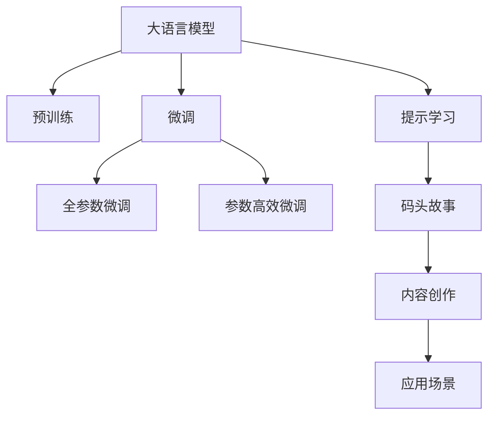

                 

## 1. 背景介绍

### 1.1 问题由来

随着人工智能技术的迅猛发展，内容创作领域迎来了前所未有的机遇和挑战。传统的文本创作依赖于人类作者的智慧和经验，过程耗时耗力，且质量参差不齐。而人工智能的大模型，尤其是基于Transformer架构的语言模型，通过大规模无标签文本数据的预训练，已经具备了强大的语言生成和理解能力。

具体而言，GPT系列、BERT、T5等预训练模型通过自回归或自编码方式，学习了海量的语言知识，可以生成流畅、连贯的文本，并且在某些任务上表现不俗。但这些模型往往需要大量的标注数据才能进行微调，以适应特定的创作需求，这不仅增加了成本，还限制了应用的普及。

### 1.2 问题核心关键点

本文将探讨如何利用大语言模型进行内容创作，特别是通过码头故事（Codex Stories）等生成模型，发掘其无限可能的创作潜力。重点包括：

- 大语言模型的原理和架构。
- 内容创作的机遇和挑战。
- 码头故事的生成机制与创新点。
- 微调与提示学习技术的应用。
- 未来的发展趋势与研究方向。

这些关键点将帮助读者理解如何在大规模预训练模型的基础上，进行高效、低成本的内容创作。

## 2. 核心概念与联系

### 2.1 核心概念概述

- **大语言模型**：如GPT、BERT、T5等，通过大规模无标签文本数据预训练，具有强大的语言生成和理解能力。
- **预训练**：在无标签数据上进行自监督学习，学习通用的语言表示，提升模型的泛化能力。
- **微调**：在特定任务上使用少量标注数据进行有监督训练，调整模型参数以适应任务需求。
- **提示学习**：通过精心设计的提示文本，引导模型生成符合期望的输出，减少微调过程的参数更新量。
- **码头故事（Codex Stories）**：Google开发的生成式预训练模型，具备强大的文本生成能力，可以用于内容创作。

### 2.2 核心概念原理和架构的 Mermaid 流程图



这个流程图展示了从大语言模型到内容创作的整体流程：

1. 大语言模型通过预训练学习到通用的语言知识。
2. 利用微调技术，在特定任务上进一步优化模型的性能。
3. 提示学习可以进一步引导模型生成符合特定需求的文本。
4. 码头故事等生成模型可以直接用于内容创作，特别是生成具有创新性的文本。
5. 创作出的内容可以应用于多个场景，如文学、新闻、教育等。

## 3. 核心算法原理 & 具体操作步骤

### 3.1 算法原理概述

基于大语言模型的内容创作，本质上是一种有监督学习的过程。其核心思想是：利用大语言模型的预训练表示，通过在有标签数据集上进行微调，使其能够生成符合特定要求的内容。

形式化地，假设预训练模型为 $M_{\theta}$，其中 $\theta$ 为预训练得到的模型参数。给定内容创作任务 $T$ 的标注数据集 $D=\{(x_i, y_i)\}_{i=1}^N$，其中 $x_i$ 为输入文本，$y_i$ 为目标输出，$y_i$ 通常为需要生成的文本。微调的目标是找到新的模型参数 $\hat{\theta}$，使得模型能够生成尽可能接近 $y_i$ 的文本输出。

### 3.2 算法步骤详解

基于大语言模型的内容创作，主要包括以下几个关键步骤：

**Step 1: 准备预训练模型和数据集**

- 选择合适的预训练语言模型 $M_{\theta}$，如GPT、BERT、T5等。
- 准备内容创作任务 $T$ 的标注数据集 $D$，通常包括训练集、验证集和测试集。

**Step 2: 添加任务适配层**

- 根据内容创作任务 $T$ 设计合适的输出层和损失函数。例如，生成式任务可以采用负对数似然损失函数。

**Step 3: 设置微调超参数**

- 选择合适的优化算法及其参数，如Adam、SGD等，设置学习率、批大小、迭代轮数等。
- 设置正则化技术及强度，包括权重衰减、Dropout、Early Stopping等。

**Step 4: 执行梯度训练**

- 将训练集数据分批次输入模型，前向传播计算损失函数。
- 反向传播计算参数梯度，根据设定的优化算法和学习率更新模型参数。
- 周期性在验证集上评估模型性能，根据性能指标决定是否触发Early Stopping。
- 重复上述步骤直到满足预设的迭代轮数或Early Stopping条件。

**Step 5: 测试和部署**

- 在测试集上评估微调后模型 $M_{\hat{\theta}}$ 的性能。
- 使用微调后的模型对新样本进行推理预测，集成到实际的应用系统中。

### 3.3 算法优缺点

基于大语言模型的内容创作具有以下优点：

- **高效性**：在少量标注数据的情况下，即可快速生成高质量的内容。
- **广泛适用**：适用于各种内容创作任务，如文学创作、新闻报道、教育教材等。
- **灵活性**：可以通过微调和提示学习进一步提升模型性能。

但同时，也存在一些局限性：

- **依赖标注数据**：微调效果依赖于高质量的标注数据，获取标注数据的成本较高。
- **泛化能力有限**：当创作任务与预训练数据的分布差异较大时，微调的效果可能不理想。
- **可解释性不足**：模型决策过程缺乏可解释性，难以理解其推理逻辑。

尽管存在这些局限性，但基于大语言模型的内容创作方法已经展示出了强大的潜力，成为内容创作领域的重要手段。

### 3.4 算法应用领域

基于大语言模型的内容创作方法，已经在多个领域得到应用，例如：

- **文学创作**：利用大语言模型生成诗歌、小说、散文等文本。
- **新闻报道**：生成新闻摘要、评论等。
- **教育教材**：生成教育内容、习题解答等。
- **广告文案**：生成广告标语、促销文案等。
- **技术文档**：生成技术文档、用户手册等。

除了上述这些领域，大语言模型还在法律、医学、金融等多个领域展示出了应用的潜力，为这些领域的内容创作提供了新的思路和方法。

## 4. 数学模型和公式 & 详细讲解 & 举例说明

### 4.1 数学模型构建

假设内容创作任务为生成式文本生成，输入文本为 $x$，目标输出为 $y$，则生成式模型的损失函数可以定义为：

$$
\mathcal{L}(M_{\theta},D) = \frac{1}{N}\sum_{i=1}^N \ell(M_{\theta}(x_i),y_i)
$$

其中，$\ell$ 为损失函数，$\theta$ 为模型参数。在内容创作任务中，通常使用负对数似然损失函数：

$$
\ell(M_{\theta}(x),y) = -\log P_{M_{\theta}}(y|x)
$$

在训练过程中，优化目标为：

$$
\hat{\theta} = \mathop{\arg\min}_{\theta} \mathcal{L}(M_{\theta},D)
$$

### 4.2 公式推导过程

以BPTT（Backpropagation Through Time）算法为例，推导生成式模型在训练过程中的参数更新公式。

在训练时，输入序列 $x = (x_1, x_2, \dots, x_n)$ 被转化为一个长序列 $X$，其中每个元素 $x_t$ 被嵌入到向量空间中，并输入到生成模型中。模型的输出序列 $y = (y_1, y_2, \dots, y_n)$ 同样被嵌入到向量空间中，用于计算损失函数。

在反向传播过程中，损失函数对模型参数 $\theta$ 的梯度可以表示为：

$$
\frac{\partial \mathcal{L}}{\partial \theta} = \frac{\partial}{\partial \theta}\sum_{t=1}^n \ell(M_{\theta}(x_t),y_t)
$$

利用链式法则，可以将其进一步展开为：

$$
\frac{\partial \mathcal{L}}{\partial \theta} = \sum_{t=1}^n \frac{\partial \ell}{\partial M_{\theta}(x_t)} \frac{\partial M_{\theta}(x_t)}{\partial \theta}
$$

由于 $M_{\theta}(x_t)$ 为向量序列，因此可以使用BPTT算法计算梯度：

$$
\frac{\partial \ell}{\partial M_{\theta}(x_t)} = \frac{\partial \ell}{\partial M_{\theta}(x_{t+1})} \frac{\partial M_{\theta}(x_{t+1})}{\partial M_{\theta}(x_t)} \frac{\partial M_{\theta}(x_t)}{\partial \theta}
$$

通过上述公式，可以计算出每个时间步的梯度，并反向传播更新模型参数 $\theta$。

### 4.3 案例分析与讲解

以文学创作任务为例，假设输入文本为 "我站在海边"，目标是生成一个描述海边的文学作品。模型的输出 $y$ 为：

$$
y = M_{\theta}(x) = (\dots, P_{M_{\theta}}(\text{波浪}), P_{M_{\theta}}(\text{沙滩}), P_{M_{\theta}}(\text{夕阳}), \dots)
$$

模型的损失函数为：

$$
\mathcal{L}(M_{\theta},(x,y)) = -\sum_{t=1}^n \log P_{M_{\theta}}(y_t|x)
$$

在训练过程中，输入 $x$ 被嵌入到向量空间中，输入到模型中。模型输出 $y$ 也嵌入到向量空间中，用于计算损失。通过反向传播算法计算梯度，并根据梯度更新模型参数，使得模型输出逼近目标 $y$。

## 5. 项目实践：代码实例和详细解释说明

### 5.1 开发环境搭建

为了进行内容创作，我们需要准备好开发环境。以下是使用Python进行PyTorch开发的环境配置流程：

1. 安装Anaconda：从官网下载并安装Anaconda，用于创建独立的Python环境。

2. 创建并激活虚拟环境：
```bash
conda create -n pytorch-env python=3.8 
conda activate pytorch-env
```

3. 安装PyTorch：根据CUDA版本，从官网获取对应的安装命令。例如：
```bash
conda install pytorch torchvision torchaudio cudatoolkit=11.1 -c pytorch -c conda-forge
```

4. 安装Transformers库：
```bash
pip install transformers
```

5. 安装各类工具包：
```bash
pip install numpy pandas scikit-learn matplotlib tqdm jupyter notebook ipython
```

完成上述步骤后，即可在`pytorch-env`环境中开始内容创作实践。

### 5.2 源代码详细实现

下面我们以文学创作任务为例，给出使用Transformers库对GPT模型进行内容创作的PyTorch代码实现。

首先，定义文学创作任务的数据处理函数：

```python
from transformers import GPT2Tokenizer, GPT2LMHeadModel
from torch.utils.data import Dataset
import torch

class LiteratureDataset(Dataset):
    def __init__(self, texts, labels, tokenizer, max_len=512):
        self.texts = texts
        self.labels = labels
        self.tokenizer = tokenizer
        self.max_len = max_len
        
    def __len__(self):
        return len(self.texts)
    
    def __getitem__(self, item):
        text = self.texts[item]
        label = self.labels[item]
        
        encoding = self.tokenizer(text, return_tensors='pt', max_length=self.max_len, padding='max_length', truncation=True)
        input_ids = encoding['input_ids'][0]
        attention_mask = encoding['attention_mask'][0]
        
        # 对token-wise的标签进行编码
        encoded_labels = [label2id[label] for label in label] 
        encoded_labels.extend([label2id['pad']] * (self.max_len - len(encoded_labels)))
        labels = torch.tensor(encoded_labels, dtype=torch.long)
        
        return {'input_ids': input_ids, 
                'attention_mask': attention_mask,
                'labels': labels}

# 标签与id的映射
label2id = {'start': 0, 'end': 1, 'padding': 2}
id2label = {v: k for k, v in label2id.items()}

# 创建dataset
tokenizer = GPT2Tokenizer.from_pretrained('gpt2')

train_dataset = LiteratureDataset(train_texts, train_labels, tokenizer)
dev_dataset = LiteratureDataset(dev_texts, dev_labels, tokenizer)
test_dataset = LiteratureDataset(test_texts, test_labels, tokenizer)
```

然后，定义模型和优化器：

```python
from transformers import AdamW

model = GPT2LMHeadModel.from_pretrained('gpt2', num_labels=len(label2id))

optimizer = AdamW(model.parameters(), lr=2e-5)
```

接着，定义训练和评估函数：

```python
from torch.utils.data import DataLoader
from tqdm import tqdm
from sklearn.metrics import precision_recall_fscore_support

device = torch.device('cuda') if torch.cuda.is_available() else torch.device('cpu')
model.to(device)

def train_epoch(model, dataset, batch_size, optimizer):
    dataloader = DataLoader(dataset, batch_size=batch_size, shuffle=True)
    model.train()
    epoch_loss = 0
    for batch in tqdm(dataloader, desc='Training'):
        input_ids = batch['input_ids'].to(device)
        attention_mask = batch['attention_mask'].to(device)
        labels = batch['labels'].to(device)
        model.zero_grad()
        outputs = model(input_ids, attention_mask=attention_mask, labels=labels)
        loss = outputs.loss
        epoch_loss += loss.item()
        loss.backward()
        optimizer.step()
    return epoch_loss / len(dataloader)

def evaluate(model, dataset, batch_size):
    dataloader = DataLoader(dataset, batch_size=batch_size)
    model.eval()
    preds, labels = [], []
    with torch.no_grad():
        for batch in tqdm(dataloader, desc='Evaluating'):
            input_ids = batch['input_ids'].to(device)
            attention_mask = batch['attention_mask'].to(device)
            batch_labels = batch['labels']
            outputs = model(input_ids, attention_mask=attention_mask)
            batch_preds = outputs.logits.argmax(dim=2).to('cpu').tolist()
            batch_labels = batch_labels.to('cpu').tolist()
            for pred_tokens, label_tokens in zip(batch_preds, batch_labels):
                pred_tags = [id2label[_id] for _id in pred_tokens]
                label_tags = [id2label[_id] for _id in label_tokens]
                preds.append(pred_tags[:len(label_tags)])
                labels.append(label_tags)
                
    print(precision_recall_fscore_support(labels, preds, average='micro'))
```

最后，启动训练流程并在测试集上评估：

```python
epochs = 5
batch_size = 16

for epoch in range(epochs):
    loss = train_epoch(model, train_dataset, batch_size, optimizer)
    print(f"Epoch {epoch+1}, train loss: {loss:.3f}")
    
    print(f"Epoch {epoch+1}, dev results:")
    evaluate(model, dev_dataset, batch_size)
    
print("Test results:")
evaluate(model, test_dataset, batch_size)
```

以上就是使用PyTorch对GPT模型进行文学创作任务微调的完整代码实现。可以看到，得益于Transformers库的强大封装，我们可以用相对简洁的代码完成GPT模型的加载和微调。

### 5.3 代码解读与分析

让我们再详细解读一下关键代码的实现细节：

**LiteratureDataset类**：
- `__init__`方法：初始化文本、标签、分词器等关键组件。
- `__len__`方法：返回数据集的样本数量。
- `__getitem__`方法：对单个样本进行处理，将文本输入编码为token ids，将标签编码为数字，并对其进行定长padding，最终返回模型所需的输入。

**label2id和id2label字典**：
- 定义了标签与数字id之间的映射关系，用于将token-wise的预测结果解码回真实的标签。

**训练和评估函数**：
- 使用PyTorch的DataLoader对数据集进行批次化加载，供模型训练和推理使用。
- 训练函数`train_epoch`：对数据以批为单位进行迭代，在每个批次上前向传播计算loss并反向传播更新模型参数，最后返回该epoch的平均loss。
- 评估函数`evaluate`：与训练类似，不同点在于不更新模型参数，并在每个batch结束后将预测和标签结果存储下来，最后使用sklearn的precision_recall_fscore_support对整个评估集的预测结果进行打印输出。

**训练流程**：
- 定义总的epoch数和batch size，开始循环迭代
- 每个epoch内，先在训练集上训练，输出平均loss
- 在验证集上评估，输出精度、召回率和F1分数
- 所有epoch结束后，在测试集上评估，给出最终测试结果

可以看到，PyTorch配合Transformers库使得GPT微调的代码实现变得简洁高效。开发者可以将更多精力放在数据处理、模型改进等高层逻辑上，而不必过多关注底层的实现细节。

当然，工业级的系统实现还需考虑更多因素，如模型的保存和部署、超参数的自动搜索、更灵活的任务适配层等。但核心的微调范式基本与此类似。

## 6. 实际应用场景

### 6.1 智能内容平台

智能内容平台是内容创作技术的重要应用场景之一。传统的编辑人员往往需要投入大量时间和精力，审核和生成内容，难以应对海量用户生成的信息。基于大语言模型的内容创作技术，可以在平台上实时生成高质量内容，丰富平台的内容生态。

例如，知乎、微博等社区平台可以利用微调后的内容创作模型，自动生成回答、评论等，提高用户的互动体验。新闻聚合平台可以通过自动生成新闻摘要，节省人工编写摘要的时间和成本。

### 6.2 内容营销

内容营销是企业重要的营销手段之一，通过高质量的内容吸引和转化用户。大语言模型可以在内容营销中发挥重要作用，自动生成广告文案、博客文章、社交媒体内容等。

例如，电商平台可以通过微调后的模型生成产品描述、评论等，提高用户的购买转化率。旅游平台可以利用微调后的模型生成旅游攻略、景点介绍等，吸引更多用户关注和预订。

### 6.3 教育应用

教育领域也需要大量的内容生成，特别是开放教育资源（OER）的建设。基于大语言模型的内容创作技术，可以自动生成教材、习题、学习笔记等，提升教育资源的丰富性和可访问性。

例如，Khan Academy等在线教育平台可以利用微调后的模型生成教材和习题，帮助学生更好地理解知识。学校可以利用微调后的模型生成教学材料，提升教师的教学效率。

### 6.4 未来应用展望

随着大语言模型和内容创作技术的不断发展，未来将有更多创新应用出现。以下是几个可能的方向：

1. **多模态内容创作**：结合图像、视频、音频等多模态数据，生成更具吸引力的内容。例如，自动生成带有图片和视频的解说视频，或者生成带有背景音乐和效果的音频故事。

2. **交互式内容创作**：利用自然语言处理技术，与用户进行交互，生成个性化的内容。例如，自动生成故事、诗歌等，根据用户的反馈调整创作风格和内容。

3. **动态内容生成**：结合实时数据和事件，动态生成内容。例如，根据股市行情生成股票分析报告，或者根据新闻事件生成事件摘要。

4. **创意内容生成**：利用大语言模型的创意能力，生成具有创新性的内容。例如，自动生成科幻小说、诗歌、绘画等创意作品。

5. **跨语言内容创作**：结合多语言预训练模型，生成跨语言的文本内容。例如，自动生成多语言的翻译、字幕等。

这些应用方向将进一步拓展内容创作的边界，推动内容创作技术的创新和应用。

## 7. 工具和资源推荐

### 7.1 学习资源推荐

为了帮助开发者系统掌握大语言模型内容创作的技术，这里推荐一些优质的学习资源：

1. 《自然语言处理入门》：该书系统介绍了NLP的基本概念和技术，包括文本生成、情感分析等，适合初学者入门。

2. 《Transformer and Attention Models》：该书深入介绍了Transformer架构和注意力机制，适合有一定NLP基础的读者。

3. Coursera《NLP with Attention and Transformers》课程：斯坦福大学开设的NLP课程，涵盖了NLP的最新进展，包括大语言模型和内容创作技术。

4. Udacity《AI for Everyone》课程：由Andrew Ng主讲的AI入门课程，适合对AI技术感兴趣的初学者。

5. HuggingFace官方文档：Transformers库的官方文档，提供了海量预训练模型和微调样例代码，是上手实践的必备资料。

通过这些资源的学习，相信你一定能够掌握大语言模型内容创作的核心技术，并将其应用于实际项目中。

### 7.2 开发工具推荐

高效的开发离不开优秀的工具支持。以下是几款用于大语言模型内容创作的常用工具：

1. PyTorch：基于Python的开源深度学习框架，灵活动态的计算图，适合快速迭代研究。大部分预训练语言模型都有PyTorch版本的实现。

2. TensorFlow：由Google主导开发的开源深度学习框架，生产部署方便，适合大规模工程应用。同样有丰富的预训练语言模型资源。

3. Transformers库：HuggingFace开发的NLP工具库，集成了众多SOTA语言模型，支持PyTorch和TensorFlow，是进行内容创作开发的利器。

4. Weights & Biases：模型训练的实验跟踪工具，可以记录和可视化模型训练过程中的各项指标，方便对比和调优。与主流深度学习框架无缝集成。

5. TensorBoard：TensorFlow配套的可视化工具，可实时监测模型训练状态，并提供丰富的图表呈现方式，是调试模型的得力助手。

合理利用这些工具，可以显著提升大语言模型内容创作的开发效率，加快创新迭代的步伐。

### 7.3 相关论文推荐

大语言模型内容创作技术的发展源于学界的持续研究。以下是几篇奠基性的相关论文，推荐阅读：

1. "Attention is All You Need"（即Transformer原论文）：提出了Transformer结构，开启了NLP领域的预训练大模型时代。

2. "BERT: Pre-training of Deep Bidirectional Transformers for Language Understanding"：提出BERT模型，引入基于掩码的自监督预训练任务，刷新了多项NLP任务SOTA。

3. "Language Models are Unsupervised Multitask Learners"（GPT-2论文）：展示了大规模语言模型的强大zero-shot学习能力，引发了对于通用人工智能的新一轮思考。

4. "Prompt-based Learning"：引入基于连续型Prompt的微调范式，为如何充分利用预训练知识提供了新的思路。

5. "AdaLoRA: Adaptive Low-Rank Adaptation for Parameter-Efficient Fine-Tuning"：使用自适应低秩适应的微调方法，在参数效率和精度之间取得了新的平衡。

6. "Provably Robust Generative Text Editing"：通过对抗训练提高生成模型的鲁棒性，避免有害信息的生成。

这些论文代表了大语言模型内容创作技术的发展脉络。通过学习这些前沿成果，可以帮助研究者把握学科前进方向，激发更多的创新灵感。

## 8. 总结：未来发展趋势与挑战

### 8.1 总结

本文对基于大语言模型的内容创作技术进行了全面系统的介绍。首先阐述了内容创作领域的应用现状和机遇，明确了内容创作技术的发展方向和应用前景。其次，从原理到实践，详细讲解了大语言模型在内容创作中的应用，给出了代码实例和详细解释。同时，本文还探讨了内容创作技术在多个行业领域的应用，展示了其巨大的应用潜力。

通过本文的系统梳理，可以看到，基于大语言模型的内容创作技术正在成为内容创作领域的重要手段，极大地拓展了内容创作的边界，催生了更多创新的应用场景。未来，随着大语言模型和内容创作技术的不断进步，内容创作将变得更加智能化、自动化，成为推动人类文化和社会进步的重要工具。

### 8.2 未来发展趋势

展望未来，内容创作技术将呈现以下几个发展趋势：

1. **大模型的泛化能力增强**：随着预训练语言模型的不断增大，其泛化能力将进一步提升，可以更好地适应各种创作任务。

2. **微调方法的改进**：未来的微调方法将更加注重参数效率和计算效率，减少模型训练和推理的资源消耗。

3. **多模态融合**：内容创作技术将更多地结合图像、视频、音频等多模态数据，生成更丰富、更吸引人的内容。

4. **生成模型的创新**：未来的生成模型将结合对抗训练、知识图谱等技术，生成更具创新性和智能性的内容。

5. **交互式创作**：利用自然语言处理技术，与用户进行交互，生成个性化、动态的内容。

6. **跨语言创作**：结合多语言预训练模型，生成跨语言的文本内容，拓展内容的国际影响力。

这些趋势将推动内容创作技术的不断进步，为内容创作领域带来更多的创新和机遇。

### 8.3 面临的挑战

尽管内容创作技术已经取得显著进展，但在迈向更高效、更智能的应用过程中，仍面临诸多挑战：

1. **标注成本高**：高质量的标注数据获取成本较高，特别是对于一些长尾应用场景，标注数据难以获取。

2. **生成质量不稳定**：生成的文本质量受模型参数和训练数据的影响，难以保证在所有场景下生成高质量内容。

3. **泛化能力不足**：对于某些特定领域的创作任务，模型可能难以生成符合领域要求的内容。

4. **可解释性不足**：内容创作模型缺乏可解释性，难以理解其生成内容的来源和推理过程。

5. **安全性问题**：生成的内容可能包含有害信息，难以保障内容的安全性和合规性。

6. **创意限制**：模型生成的内容可能缺乏创意，难以生成具有新颖性和独特性的内容。

解决这些挑战需要从数据、模型、算法等多个维度进行优化和改进，不断推动内容创作技术的进步。

### 8.4 研究展望

未来的内容创作技术需要在以下几个方面进行更多的探索：

1. **无监督和半监督学习**：探索无需标注数据的内容创作方法，利用自监督学习、主动学习等技术，最大限度利用非结构化数据。

2. **参数高效微调**：开发更高效的微调方法，在固定大部分预训练参数的情况下，只更新极少量的任务相关参数。

3. **多任务联合训练**：结合生成式模型和判别式模型，进行联合训练，提升模型的创造力和鲁棒性。

4. **跨领域迁移学习**：通过跨领域迁移学习，提升模型在不同领域的泛化能力。

5. **模型压缩与优化**：优化模型的结构和计算图，提升推理速度和资源效率。

6. **内容监控与审核**：建立内容监控与审核机制，确保生成的内容符合伦理和法规要求。

这些研究方向的探索，必将引领内容创作技术的进一步进步，为构建更智能化、更安全、更高效的内容创作系统提供新的动力。

## 9. 附录：常见问题与解答

**Q1：大语言模型内容创作是否适用于所有内容创作任务？**

A: 大语言模型内容创作技术在大多数内容创作任务上都能取得不错的效果，特别是对于数据量较小的任务。但对于一些特定领域的任务，如医学、法律等，仅依赖通用语料预训练的模型可能难以很好地适应。此时需要在特定领域语料上进一步预训练，再进行微调，才能获得理想效果。此外，对于一些需要时效性、个性化很强的任务，如对话、推荐等，内容创作方法也需要针对性的改进优化。

**Q2：如何缓解内容创作过程中的过拟合问题？**

A: 过拟合是内容创作面临的主要挑战，尤其是在标注数据不足的情况下。常见的缓解策略包括：
1. 数据增强：通过回译、近义替换等方式扩充训练集
2. 正则化：使用L2正则、Dropout、Early Stopping等避免过拟合
3. 对抗训练：引入对抗样本，提高模型鲁棒性
4. 参数高效微调：只调整少量参数(如Adapter、Prefix等)，减小过拟合风险
5. 多模型集成：训练多个创作模型，取平均输出，抑制过拟合

这些策略往往需要根据具体任务和数据特点进行灵活组合。只有在数据、模型、训练、推理等各环节进行全面优化，才能最大限度地发挥大语言模型内容创作的潜力。

**Q3：内容创作模型在落地部署时需要注意哪些问题？**

A: 将内容创作模型转化为实际应用，还需要考虑以下因素：
1. 模型裁剪：去除不必要的层和参数，减小模型尺寸，加快推理速度
2. 量化加速：将浮点模型转为定点模型，压缩存储空间，提高计算效率
3. 服务化封装：将模型封装为标准化服务接口，便于集成调用
4. 弹性伸缩：根据请求流量动态调整资源配置，平衡服务质量和成本
5. 监控告警：实时采集系统指标，设置异常告警阈值，确保服务稳定性
6. 安全防护：采用访问鉴权、数据脱敏等措施，保障数据和模型安全

大语言模型内容创作为内容创作领域带来了广阔的想象空间，但如何将强大的性能转化为稳定、高效、安全的业务价值，还需要工程实践的不断打磨。唯有从数据、算法、工程、业务等多个维度协同发力，才能真正实现人工智能技术在垂直行业的规模化落地。总之，内容创作需要开发者根据具体任务，不断迭代和优化模型、数据和算法，方能得到理想的效果。

---

作者：禅与计算机程序设计艺术 / Zen and the Art of Computer Programming

