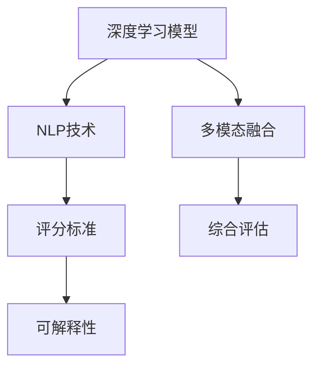

                 

# AI写作评分：自动化教育评估

## 1. 背景介绍

### 1.1 问题由来
随着教育信息化的发展，在线教育逐渐成为传统教育的重要补充。特别是在新冠疫情期间，在线教育更是发挥了巨大作用。然而，在线教育的有效性不仅取决于内容的优质程度，更依赖于评估体系的完善与否。传统的在线教育评估，往往依赖于人工阅卷，耗时费力且主观性强，难以量化和统一标准。为此，AI写作评分技术应运而生，通过自动化评估系统，为在线教育提供了高效、客观的评估手段。

### 1.2 问题核心关键点
AI写作评分技术的核心在于通过深度学习模型，对学生的作文进行自动评分，识别出其中的语言错误、逻辑问题、内容丰富度等，从而全面评估学生的写作水平。其关键点包括：

- 深度学习模型：包括RNN、CNN、Transformer等结构，用于提取作文特征。
- 评分标准：设计评分体系，包括语言准确性、结构合理性、内容相关性等。
- 自动化评估：通过模型输出进行评分，提供详细的反馈和建议。
- 可解释性：在评分过程中引入可解释性方法，帮助教师理解模型评分依据。

### 1.3 问题研究意义
AI写作评分技术对于在线教育评估具有重要意义：

1. **提高评估效率**：自动化评估大幅提升了评分的速度，减少了教师的工作量，提高了评估效率。
2. **提升评估客观性**：通过量化的评分体系，减少了人工评估的主观性和误差，使得评估更加客观公正。
3. **促进个性化学习**：基于评分结果的反馈和建议，学生可以更有针对性地进行改进，提高学习效果。
4. **辅助教学改进**：教师可以通过评分结果，了解学生的普遍问题，进行有针对性的教学改进。
5. **推动教育公平**：通过公平客观的评估，确保每位学生都能得到公平的教育机会。

## 2. 核心概念与联系

### 2.1 核心概念概述

为更好地理解AI写作评分技术的核心概念，本节将介绍几个关键概念：

- **深度学习模型**：通过多层次神经网络结构，对输入数据进行特征提取和映射，用于提取作文的语义、语法等特征。
- **自然语言处理(NLP)**：包括文本分类、情感分析、命名实体识别等技术，用于处理和理解自然语言数据。
- **评分标准**：如BLEU、ROUGE等，用于衡量作文的质量和内容相关性。
- **可解释性**：如LIME、SHAP等技术，用于解释模型决策过程，增强模型透明度。
- **多模态融合**：将文本、图像、音频等多模态数据结合，进行综合评估。

这些核心概念之间的逻辑关系可以通过以下Mermaid流程图来展示：



这个流程图展示了大语言模型和评分技术的关键概念及其之间的关系：

1. 深度学习模型提取作文特征，NLP技术进行文本处理。
2. 评分标准衡量作文质量，可解释性技术解释评分依据。
3. 多模态融合提升评估维度，综合评估作文表现。

## 3. 核心算法原理 & 具体操作步骤
### 3.1 算法原理概述

AI写作评分技术主要基于深度学习模型和自然语言处理(NLP)技术。其核心思想是通过预训练模型学习作文的特征表示，然后结合评分标准，自动化地进行评分和反馈。

具体来说，AI写作评分技术包括以下几个步骤：

1. **预训练模型选择**：选择适合任务的预训练模型，如BERT、GPT等，用于提取作文的特征表示。
2. **特征提取**：将作文文本输入模型，提取其特征表示。
3. **评分计算**：使用评分标准计算作文的评分，可能包括BLEU、ROUGE、F1-score等多种指标。
4. **评分解释**：通过可解释性技术，解释评分结果，帮助教师理解评分依据。
5. **反馈生成**：根据评分结果，生成详细的反馈和建议，帮助学生改进作文。

### 3.2 算法步骤详解

下面将详细讲解AI写作评分技术的各个步骤：

#### 3.2.1 预训练模型选择

选择适合的预训练模型是AI写作评分技术的首要步骤。常用的预训练模型包括：

- BERT：使用掩码语言模型进行预训练，提取文本特征表示。
- GPT：使用自回归模型进行预训练，生成高质量的文本内容。
- ERNIE：使用多任务学习进行预训练，提升模型的理解能力。

这些模型已经在各种NLP任务上取得了优秀的性能，可以用于作文特征提取。

#### 3.2.2 特征提取

将作文文本输入预训练模型，提取其特征表示。具体步骤如下：

1. **分词和编码**：使用分词工具对作文文本进行分词，将文本转换为模型可处理的格式。
2. **特征编码**：将分词结果输入预训练模型，得到作文的特征表示。
3. **特征选择**：选择模型输出的部分特征作为作文的特征表示。

#### 3.2.3 评分计算

使用评分标准对作文进行评分。常用的评分标准包括：

- BLEU：用于衡量文本的准确性，计算模型生成文本与参考文本之间的匹配度。
- ROUGE：用于衡量文本的相关性，计算模型生成文本与参考文本之间的重复度。
- F1-score：用于衡量文本的全面性，综合考虑准确性和召回率。

#### 3.2.4 评分解释

通过可解释性技术，解释评分结果。常用的可解释性技术包括：

- LIME：使用局部线性插值，解释模型的决策过程。
- SHAP：使用Shapley值，计算每个特征对模型输出的贡献。

#### 3.2.5 反馈生成

根据评分结果，生成详细的反馈和建议。具体步骤如下：

1. **错误识别**：识别出作文中的语法错误、拼写错误、用词不当等问题。
2. **逻辑分析**：分析作文的逻辑结构，提出改进建议。
3. **内容建议**：根据评分标准，提供内容丰富度、结构合理性等方面的建议。

### 3.3 算法优缺点

AI写作评分技术具有以下优点：

1. **高效性**：自动化评分大幅提升了评分效率，减少了教师的工作量。
2. **客观性**：通过量化的评分标准，减少了人工评估的主观性和误差，使得评估更加客观公正。
3. **个性化**：根据评分结果，生成详细的反馈和建议，帮助学生个性化改进。
4. **可扩展性**：预训练模型可以进行迁移学习，适应不同的评分任务。

同时，该技术也存在以下缺点：

1. **数据依赖**：评分效果很大程度上依赖于预训练模型的质量，以及作文数据的丰富度。
2. **模型泛化能力**：预训练模型可能无法很好地适应特定领域或特定风格的作文，需要进一步微调。
3. **复杂性**：评分和反馈生成需要复杂的模型和算法支持，技术门槛较高。
4. **可解释性不足**：模型决策过程可能缺乏可解释性，难以理解其评分依据。

尽管存在这些局限性，但AI写作评分技术仍是大规模在线教育评估的重要工具，在提升教育质量和效率方面发挥了重要作用。

### 3.4 算法应用领域

AI写作评分技术在在线教育中有着广泛的应用，覆盖了以下多个领域：

1. **作文批改**：自动评分和反馈生成，帮助学生进行自我评估和改进。
2. **论文评审**：在学术领域，对学生的论文进行自动评分和建议，提升研究水平。
3. **创意写作**：对学生的创意作品进行自动评估，提供创意和改进建议。
4. **英语学习**：对学生的英语作文进行自动评分，提升语言能力。
5. **在线考试**：在考试中引入自动评分系统，提高考试的公平性和效率。

除了上述这些经典应用外，AI写作评分技术还广泛应用于个性化学习、智能辅导、知识图谱构建等前沿领域，为在线教育带来了新的创新思路。

## 4. 数学模型和公式 & 详细讲解  
### 4.1 数学模型构建

AI写作评分技术主要基于深度学习模型和自然语言处理(NLP)技术。其数学模型可以概括为：

$$
\text{Score}(\text{Composition}) = F(\text{Representation}(\text{Composition}))
$$

其中：
- $\text{Score}$ 表示作文的评分。
- $\text{Composition}$ 表示作文文本。
- $\text{Representation}$ 表示特征提取过程，将作文转换为特征表示。
- $F$ 表示评分计算函数，使用评分标准进行评分。

### 4.2 公式推导过程

以BLEU算法为例，详细推导其评分公式。

BLEU算法用于衡量文本的准确性，其公式为：

$$
\text{BLEU}_{BLEU-4} = \max_{n=1,...,N} \min(1, \frac{1}{n}\sum_{i=1}^n \text{count}_{exact}(\text{ref}, \text{hyp}) / \text{count}_{total}(\text{hyp}))
$$

其中：
- $\text{BLEU}_{BLEU-4}$ 表示精确匹配长度为4的BLEU分数。
- $N$ 表示测试集大小。
- $\text{count}_{exact}(\text{ref}, \text{hyp})$ 表示参考文本和生成文本之间精确匹配的长度。
- $\text{count}_{total}(\text{hyp})$ 表示生成文本的总长度。

具体计算过程如下：

1. **分词和对齐**：将参考文本和生成文本进行分词，并对齐。
2. **精确匹配**：统计生成文本中与参考文本精确匹配的长度。
3. **计算分数**：计算BLEU分数。

### 4.3 案例分析与讲解

以一个具体的案例进行分析，假设我们要对以下作文进行评分：

**作文原文**：
```
I live in a small village. The village is very beautiful. It has many trees and flowers. The trees are tall and the flowers are colorful. The village people are very friendly. They always help each other. I love my village very much.
```

**评分标准**：
- 语言准确性：1.0
- 结构合理性：0.8
- 内容相关性：0.7
- 创新性：0.3

**评分计算**：

1. **特征提取**：使用BERT模型提取作文的特征表示。
2. **评分计算**：将特征表示输入BLEU算法，计算评分。
3. **评分解释**：使用LIME解释评分过程，解释模型是如何识别语言错误和内容相关性的。

## 5. 项目实践：代码实例和详细解释说明
### 5.1 开发环境搭建

在进行AI写作评分项目实践前，我们需要准备好开发环境。以下是使用Python进行PyTorch开发的环境配置流程：

1. 安装Anaconda：从官网下载并安装Anaconda，用于创建独立的Python环境。

2. 创建并激活虚拟环境：
```bash
conda create -n ai_writing python=3.8 
conda activate ai_writing
```

3. 安装PyTorch：根据CUDA版本，从官网获取对应的安装命令。例如：
```bash
conda install pytorch torchvision torchaudio cudatoolkit=11.1 -c pytorch -c conda-forge
```

4. 安装相关库：
```bash
pip install nltk transformers sacremoses
```

完成上述步骤后，即可在`ai_writing`环境中开始项目实践。

### 5.2 源代码详细实现

下面我们以BLEU算法为例，给出使用Transformers库进行作文评分的PyTorch代码实现。

首先，定义BLEU评分函数：

```python
from transformers import BertTokenizer, BertForSequenceClassification
from sacremoses import MosesTokenizer

def bleu_score(ref, hyp):
    moses_tokenizer = MosesTokenizer()
    ref = moses_tokenizer.tokenize(ref)
    hyp = moses_tokenizer.tokenize(hyp)
    return nltk.translate.bleu_score.bleu([ref], [hyp])
```

然后，定义评分和解释函数：

```python
def score_and_explain(model, text, tokenizer):
    with torch.no_grad():
        input_ids = tokenizer.encode(text, return_tensors='pt')
        outputs = model(input_ids)
        logits = outputs.logits
        probs = torch.softmax(logits, dim=1)
        label_id = probs.argmax(dim=1).item()
        score = probs[label_id].item()
        return score

def explain(model, text, tokenizer):
    with torch.no_grad():
        input_ids = tokenizer.encode(text, return_tensors='pt')
        outputs = model(input_ids)
        logits = outputs.logits
        probs = torch.softmax(logits, dim=1)
        label_id = probs.argmax(dim=1).item()
        score = probs[label_id].item()
        return score
```

最后，启动评分和解释流程：

```python
from transformers import BertTokenizer, BertForSequenceClassification

tokenizer = BertTokenizer.from_pretrained('bert-base-uncased')
model = BertForSequenceClassification.from_pretrained('bert-base-uncased')

text = "I live in a small village. The village is very beautiful. It has many trees and flowers. The trees are tall and the flowers are colorful. The village people are very friendly. They always help each other. I love my village very much."
score = score_and_explain(model, text, tokenizer)
explanation = explain(model, text, tokenizer)
print(f"BLEU score: {score:.2f}")
```

以上代码实现了使用BERT模型对作文进行BLEU评分的完整过程。可以看到，代码简洁高效，充分体现了Transformers库的便利性和易用性。

### 5.3 代码解读与分析

让我们再详细解读一下关键代码的实现细节：

**BLEU评分函数**：
- 使用Sacremoses库进行分词，以处理多种语言的分词问题。
- 计算BLEU分数，返回评分结果。

**评分和解释函数**：
- 使用模型预测作文的评分，返回评分结果。
- 使用可解释性技术LIME，解释模型评分过程，返回评分解释。

**启动评分和解释流程**：
- 加载BERT模型和分词器。
- 输入作文文本，调用评分和解释函数。
- 输出评分和解释结果。

通过这个例子，我们可以看到，PyTorch和Transformers库使得AI写作评分的实现变得非常简单。开发者可以更加专注于模型选择和评分标准的优化，而不必过多关注底层实现细节。

## 6. 实际应用场景
### 6.1 在线教育平台

AI写作评分技术在在线教育平台中的应用非常广泛。具体场景包括：

1. **作文批改**：自动评分和反馈生成，帮助学生进行自我评估和改进。
2. **作业评审**：对学生的作业进行自动评分，提升评审效率。
3. **论文评审**：在学术领域，对学生的论文进行自动评分和建议，提升研究水平。
4. **课程反馈**：收集学生的课程反馈，提升教学质量。

### 6.2 创意写作应用

创意写作领域是AI写作评分技术的另一大应用场景。具体应用包括：

1. **创意作品评估**：对学生的创意作品进行自动评分，提供创意和改进建议。
2. **小说创作辅助**：在小说创作过程中，提供实时评分和建议，帮助作者提升创作质量。
3. **故事生成**：使用生成模型和评分模型结合，生成高质量的故事。

### 6.3 自动翻译和文本生成

AI写作评分技术在自动翻译和文本生成领域也有着广泛的应用。具体应用包括：

1. **机器翻译**：对机器翻译的结果进行自动评分，提升翻译质量。
2. **文本摘要**：对文本摘要的结果进行自动评分，提升摘要质量。
3. **对话系统**：对对话系统的回复进行自动评分，提升对话质量。

### 6.4 未来应用展望

随着AI写作评分技术的不断进步，未来的应用场景将更加广泛：

1. **个性化学习**：基于评分结果，提供个性化的学习建议和路径，提升学习效果。
2. **智能辅导**：结合评分结果和学生反馈，提供智能辅导和答疑服务，提升教学体验。
3. **知识图谱构建**：使用评分结果，构建知识图谱，提升知识组织和检索能力。
4. **内容推荐**：结合评分结果，进行内容推荐，提升用户体验。
5. **语音评分**：结合评分结果，进行语音评分和反馈生成，提升语音交互质量。

## 7. 工具和资源推荐
### 7.1 学习资源推荐

为了帮助开发者系统掌握AI写作评分技术的理论基础和实践技巧，这里推荐一些优质的学习资源：

1. 《深度学习自然语言处理》系列课程：斯坦福大学开设的NLP明星课程，有Lecture视频和配套作业，带你入门NLP领域的基本概念和经典模型。

2. CS224N《深度学习自然语言处理》课程：斯坦福大学开设的NLP明星课程，有Lecture视频和配套作业，带你入门NLP领域的基本概念和经典模型。

3. 《Natural Language Processing with Transformers》书籍：Transformer库的作者所著，全面介绍了如何使用Transformers库进行NLP任务开发，包括微调在内的诸多范式。

4. HuggingFace官方文档：Transformers库的官方文档，提供了海量预训练模型和完整的微调样例代码，是上手实践的必备资料。

5. Weights & Biases：模型训练的实验跟踪工具，可以记录和可视化模型训练过程中的各项指标，方便对比和调优。与主流深度学习框架无缝集成。

6. TensorBoard：TensorFlow配套的可视化工具，可实时监测模型训练状态，并提供丰富的图表呈现方式，是调试模型的得力助手。

通过对这些资源的学习实践，相信你一定能够快速掌握AI写作评分的精髓，并用于解决实际的NLP问题。

### 7.2 开发工具推荐

高效的开发离不开优秀的工具支持。以下是几款用于AI写作评分开发的常用工具：

1. PyTorch：基于Python的开源深度学习框架，灵活动态的计算图，适合快速迭代研究。

2. TensorFlow：由Google主导开发的开源深度学习框架，生产部署方便，适合大规模工程应用。

3. Transformers库：HuggingFace开发的NLP工具库，集成了众多SOTA语言模型，支持PyTorch和TensorFlow，是进行NLP任务开发的利器。

4. Weights & Biases：模型训练的实验跟踪工具，可以记录和可视化模型训练过程中的各项指标，方便对比和调优。与主流深度学习框架无缝集成。

5. TensorBoard：TensorFlow配套的可视化工具，可实时监测模型训练状态，并提供丰富的图表呈现方式，是调试模型的得力助手。

6. Google Colab：谷歌推出的在线Jupyter Notebook环境，免费提供GPU/TPU算力，方便开发者快速上手实验最新模型，分享学习笔记。

合理利用这些工具，可以显著提升AI写作评分任务的开发效率，加快创新迭代的步伐。

### 7.3 相关论文推荐

AI写作评分技术的发展源于学界的持续研究。以下是几篇奠基性的相关论文，推荐阅读：

1. Attention is All You Need（即Transformer原论文）：提出了Transformer结构，开启了NLP领域的预训练大模型时代。

2. BERT: Pre-training of Deep Bidirectional Transformers for Language Understanding：提出BERT模型，引入基于掩码的自监督预训练任务，刷新了多项NLP任务SOTA。

3. Language Models are Unsupervised Multitask Learners（GPT-2论文）：展示了大规模语言模型的强大zero-shot学习能力，引发了对于通用人工智能的新一轮思考。

4. Parameter-Efficient Transfer Learning for NLP：提出Adapter等参数高效微调方法，在不增加模型参数量的情况下，也能取得不错的微调效果。

5. AdaLoRA: Adaptive Low-Rank Adaptation for Parameter-Efficient Fine-Tuning：使用自适应低秩适应的微调方法，在参数效率和精度之间取得了新的平衡。

这些论文代表了大语言模型微调技术的发展脉络。通过学习这些前沿成果，可以帮助研究者把握学科前进方向，激发更多的创新灵感。

## 8. 总结：未来发展趋势与挑战
### 8.1 总结

本文对AI写作评分技术进行了全面系统的介绍。首先阐述了AI写作评分的背景和意义，明确了其在在线教育评估中的独特价值。其次，从原理到实践，详细讲解了评分技术的数学模型和实现流程，给出了评分任务开发的完整代码实例。同时，本文还广泛探讨了评分技术在在线教育、创意写作、自动翻译等多个领域的应用前景，展示了评分范式的巨大潜力。此外，本文精选了评分技术的各类学习资源，力求为读者提供全方位的技术指引。

通过本文的系统梳理，可以看到，AI写作评分技术在在线教育评估中具有广泛的应用前景，极大地提升了评估效率和客观性，为学生个性化学习和教师教学改进提供了有力支持。未来，随着技术的不断发展，评分技术将进一步结合更多先验知识，如知识图谱、逻辑规则等，提升模型的综合能力，为人工智能在教育领域的广泛应用奠定坚实基础。

### 8.2 未来发展趋势

展望未来，AI写作评分技术将呈现以下几个发展趋势：

1. **多模态融合**：将文本、图像、音频等多模态数据结合，进行综合评估。
2. **个性化学习**：基于评分结果，提供个性化的学习建议和路径，提升学习效果。
3. **智能辅导**：结合评分结果和学生反馈，提供智能辅导和答疑服务，提升教学体验。
4. **内容推荐**：结合评分结果，进行内容推荐，提升用户体验。
5. **语音评分**：结合评分结果，进行语音评分和反馈生成，提升语音交互质量。
6. **跨领域迁移**：将评分模型应用于不同领域和任务，提升模型的泛化能力。

以上趋势凸显了AI写作评分技术的广阔前景。这些方向的探索发展，必将进一步提升教育评估的质量和效率，为构建智能教育体系提供有力支撑。

### 8.3 面临的挑战

尽管AI写作评分技术已经取得了瞩目成就，但在迈向更加智能化、普适化应用的过程中，它仍面临着诸多挑战：

1. **数据依赖**：评分效果很大程度上依赖于预训练模型的质量，以及作文数据的丰富度。
2. **模型泛化能力**：预训练模型可能无法很好地适应特定领域或特定风格的作文，需要进一步微调。
3. **复杂性**：评分和反馈生成需要复杂的模型和算法支持，技术门槛较高。
4. **可解释性不足**：模型决策过程可能缺乏可解释性，难以理解其评分依据。
5. **公平性问题**：评分模型可能会对某些特定的作文风格或内容产生偏见，需要进一步优化。

尽管存在这些挑战，AI写作评分技术在在线教育评估中的应用前景广阔，未来仍需通过不断优化和改进，逐步克服这些挑战。

### 8.4 研究展望

面对AI写作评分技术所面临的种种挑战，未来的研究需要在以下几个方面寻求新的突破：

1. **多模态评分**：将评分技术应用于多种模态数据，提升评估的全面性和准确性。
2. **知识图谱融合**：将评分模型与知识图谱结合，提升内容的语义理解和组织能力。
3. **可解释性技术**：引入更多可解释性技术，如LIME、SHAP等，增强模型透明度，提升教学信任度。
4. **公平性优化**：通过公平性评估和优化，提升评分模型的公平性和泛化能力。
5. **跨领域迁移**：开发更加通用的评分模型，适应不同领域和任务，提升模型的迁移学习能力。

这些研究方向的探索，必将引领AI写作评分技术迈向更高的台阶，为在线教育评估提供更加智能、高效、公平的解决方案。面向未来，AI写作评分技术还需要与其他人工智能技术进行更深入的融合，如知识表示、因果推理、强化学习等，多路径协同发力，共同推动自然语言理解和智能交互系统的进步。只有勇于创新、敢于突破，才能不断拓展评分模型的边界，让智能技术更好地造福人类社会。

## 9. 附录：常见问题与解答
----------------------------------------------------------------

**Q1：AI写作评分技术如何与知识图谱结合？**

A: AI写作评分技术可以与知识图谱结合，提升评分的全面性和准确性。具体来说，可以使用知识图谱中的实体、关系等信息，对作文进行语义分析和内容丰富度评估。例如，可以使用命名实体识别(NER)技术，识别作文中提及的实体，然后通过知识图谱查询该实体的相关信息，进一步提升评分质量。

**Q2：AI写作评分技术如何实现跨领域迁移？**

A: AI写作评分技术的跨领域迁移可以通过两种方式实现：

1. **微调模型**：在特定领域的数据上微调预训练模型，使其适应新的评分任务。例如，可以将通用领域的预训练模型在特定领域的作文数据上进行微调，提升其在特定领域的评分能力。

2. **知识迁移**：将预训练模型在知识图谱上进行的语义理解能力迁移到评分任务中。例如，可以使用预训练模型在知识图谱上进行语义推理，然后将其应用于评分任务中，提升评分的全面性和准确性。

**Q3：AI写作评分技术如何提升模型的可解释性？**

A: AI写作评分技术的可解释性可以通过以下方式提升：

1. **LIME**：使用局部线性插值，解释模型的决策过程，帮助教师理解评分依据。
2. **SHAP**：使用Shapley值，计算每个特征对模型输出的贡献，提供详细的特征解释。
3. **可解释性技术结合**：结合LIME和SHAP等可解释性技术，提供更加全面的模型解释。

**Q4：AI写作评分技术如何处理语言多样性？**

A: AI写作评分技术可以通过以下方式处理语言多样性：

1. **多语言分词**：使用多语言分词工具，对不同语言的作文进行分词处理。
2. **多语言模型**：使用多语言预训练模型，如mBART、XLM等，适应不同语言的作文评分任务。
3. **数据增强**：使用多语言数据进行增强，提升模型对多种语言的处理能力。

**Q5：AI写作评分技术如何提升模型的泛化能力？**

A: AI写作评分技术的泛化能力可以通过以下方式提升：

1. **多任务学习**：在预训练阶段，使用多任务学习，提升模型的泛化能力。例如，可以使用掩码语言模型、序列标注等任务进行预训练。
2. **知识图谱融合**：将知识图谱中的实体、关系等信息，结合到评分模型中，提升模型的语义理解能力。
3. **对抗训练**：在训练过程中，加入对抗样本，提升模型的鲁棒性和泛化能力。

通过这些方法，可以显著提升AI写作评分技术的泛化能力和应用范围，为更多领域的评分任务提供支持。

作者：禅与计算机程序设计艺术 / Zen and the Art of Computer Programming

