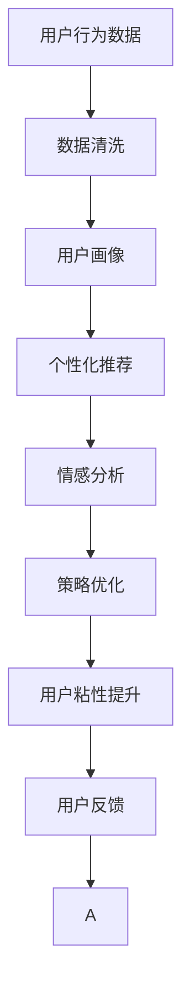

                 

# AI创业公司如何打造用户粘性?

> 关键词：用户粘性, 用户行为分析, 个性化推荐, 情感分析, AI应用

## 1. 背景介绍

在AI驱动的互联网创业时代，如何吸引并留住用户，成为了决定公司成功的关键因素。用户粘性不仅影响产品的用户基础，还直接关联到公司的盈利模式和长期发展。本文旨在探讨AI创业公司如何通过数据驱动、智能化手段，打造和提升用户粘性，实现可持续的用户增长和价值最大化。

## 2. 核心概念与联系

### 2.1 核心概念概述

在解释AI公司如何提升用户粘性之前，我们先澄清几个核心概念：

- **用户粘性(User Retention)**：指用户在一段时间内反复访问产品或服务的频率和持续时间。高粘性表示用户与产品的互动频繁，对产品有较高的忠诚度。
- **用户行为分析(User Behavior Analysis)**：通过分析用户在产品中的互动数据，如点击、停留时间、购买行为等，来洞察用户需求和偏好，指导产品优化和营销策略。
- **个性化推荐(Personalized Recommendation)**：根据用户的历史行为和偏好，推荐符合其需求的产品或内容，提升用户体验和满意度。
- **情感分析(Sentiment Analysis)**：通过分析用户反馈、评论等文本数据，了解用户对产品的情感倾向和意见，及时调整产品策略。

### 2.2 核心概念原理和架构的 Mermaid 流程图



这个流程图展示了从用户行为数据到提升用户粘性的全过程：

1. **数据清洗**：对原始数据进行预处理，去除噪声和异常值，确保数据的质量。
2. **用户画像**：通过分析用户行为数据，构建用户档案，识别出不同用户的需求和偏好。
3. **个性化推荐**：根据用户画像，动态推荐相关产品或内容，满足用户个性化需求。
4. **情感分析**：分析用户反馈和评论，了解用户情感倾向，优化产品和服务。
5. **策略优化**：根据情感分析结果，调整产品策略和优化体验，提升用户满意度。
6. **用户粘性提升**：通过持续的用户体验优化和情感维护，增强用户对产品的忠诚度。
7. **用户反馈**：收集用户反馈，进行迭代改进，形成良性循环。

## 3. 核心算法原理 & 具体操作步骤

### 3.1 算法原理概述

提升用户粘性涉及多个环节的优化，包括用户画像构建、个性化推荐、情感分析、策略调整等。以下将详细介绍这些环节的算法原理和具体操作步骤。

### 3.2 算法步骤详解

#### 3.2.1 用户画像构建

**步骤1：数据收集**
- 从网站、应用、社交平台等收集用户行为数据，如点击、浏览、购买、搜索等。
- 收集用户基本信息，如年龄、性别、地域等，以及用户在产品中的互动记录。

**步骤2：数据预处理**
- 对收集到的数据进行清洗，去除重复、缺失、异常值。
- 对文本数据进行分词、去停用词、特征提取等处理。

**步骤3：特征工程**
- 设计特征表示，提取用户特征向量，如兴趣偏好、历史行为、用户画像等。
- 使用PCA、LDA等降维技术，降低特征维度，提升模型泛化能力。

**步骤4：聚类分析**
- 应用K-means、层次聚类等算法，对用户进行分组，形成用户画像。
- 可视化用户画像分布，识别出不同群体的用户特征。

#### 3.2.2 个性化推荐

**步骤1：模型选择**
- 根据推荐系统的特点选择合适的推荐算法，如协同过滤、基于内容的推荐、深度学习等。
- 协同过滤：基于用户行为相似度，推荐相似用户喜欢的物品。
- 基于内容的推荐：根据物品属性，推荐用户可能喜欢的物品。
- 深度学习：使用神经网络模型，通过学习用户行为和物品属性，进行推荐。

**步骤2：模型训练**
- 对选择的模型进行训练，使用历史用户行为数据和物品属性作为输入，训练得到推荐模型。
- 使用交叉验证等技术，评估模型性能，调整模型参数。

**步骤3：推荐实现**
- 将训练好的模型应用到实时推荐场景中，使用户获得个性化的推荐结果。
- 使用A/B测试等方法，评估推荐效果，不断优化推荐算法。

#### 3.2.3 情感分析

**步骤1：数据收集**
- 收集用户反馈、评论、评分等文本数据。
- 利用爬虫技术，从社交媒体、论坛等平台获取用户情感数据。

**步骤2：情感计算**
- 使用TF-IDF、Word2Vec等技术，提取文本特征向量。
- 应用情感分类算法，如朴素贝叶斯、支持向量机等，计算文本情感极性。

**步骤3：情感响应**
- 根据情感分析结果，调整产品策略和服务，优化用户体验。
- 对用户情感进行分类，及时处理负面情绪，提升用户满意度。

#### 3.2.4 策略优化

**步骤1：用户行为分析**
- 分析用户行为数据，识别出用户在不同场景下的需求和行为模式。
- 通过时间序列分析、热图分析等方法，识别出用户行为规律。

**步骤2：产品优化**
- 根据用户行为分析结果，优化产品功能和用户体验。
- 引入A/B测试等方法，验证优化效果，不断迭代产品设计。

**步骤3：市场推广**
- 利用情感分析结果，定制营销策略，优化广告投放。
- 根据用户画像和行为特征，制定精准的推广方案。

### 3.3 算法优缺点

**个性化推荐算法的优点**
- 提升用户体验：通过个性化推荐，满足用户个性化需求，提高用户满意度。
- 增加用户互动：推荐系统引导用户探索更多内容，增加用户互动频率。
- 优化转化率：个性化推荐能够精准匹配用户需求，提升购买转化率。

**个性化推荐算法的缺点**
- 冷启动问题：新用户或物品缺乏足够的历史数据，推荐效果不佳。
- 数据隐私：推荐系统需要收集和处理大量用户数据，涉及隐私保护问题。
- 模型复杂：推荐算法复杂度高，需要大量的计算资源。

**情感分析的优点**
- 实时反馈：情感分析可以实时获取用户反馈，快速响应用户需求。
- 优化体验：通过情感分析，优化产品和服务，提升用户满意度。
- 提升粘性：了解用户情感倾向，及时调整策略，增强用户粘性。

**情感分析的缺点**
- 数据噪声：情感分析依赖于文本数据，可能存在噪声和误解。
- 主观性：用户情感表达具有主观性，难以全面准确地反映用户真实感受。
- 动态变化：用户情感随时间变化，情感分析结果需要及时更新。

**策略优化的优点**
- 精准定位：通过用户行为分析，精准定位用户需求和行为模式。
- 数据驱动：利用数据驱动决策，优化产品和服务。
- 快速迭代：策略优化可以快速响应用户反馈，提升产品竞争力。

**策略优化的缺点**
- 成本高：策略优化涉及数据分析、模型训练等成本，增加了开发和运维负担。
- 技术复杂：策略优化需要跨多个领域的技术支持，如机器学习、数据分析等。
- 效果评估：策略优化效果评估复杂，难以全面衡量。

### 3.4 算法应用领域

个性化推荐、情感分析和用户画像构建等技术，在以下几个领域得到了广泛应用：

- **电商行业**：通过个性化推荐提升用户购买转化率，增强用户粘性。
- **社交媒体**：利用情感分析优化内容推荐，增加用户互动和粘性。
- **在线教育**：根据用户学习行为，个性化推荐学习资源，提升用户学习效果和满意度。
- **医疗健康**：通过情感分析优化用户健康管理，提升用户体验和粘性。
- **旅游出行**：根据用户兴趣偏好，个性化推荐旅游目的地，提升用户满意度。

## 4. 数学模型和公式 & 详细讲解 & 举例说明

### 4.1 数学模型构建

以下以协同过滤推荐算法为例，构建推荐模型的数学模型。

**协同过滤模型**
- **用户-物品评分矩阵**：记用户集为 $U=\{u_1,u_2,\dots,u_n\}$，物品集为 $I=\{i_1,i_2,\dots,i_m\}$，用户对物品的评分矩阵为 $R\in \mathbb{R}^{n\times m}$。
- **用户相似度计算**：采用余弦相似度计算用户间的相似度，记为 $sim(u_i,u_j)$。
- **物品相似度计算**：采用余弦相似度计算物品间的相似度，记为 $sim(i_k,i_l)$。

**预测评分**
- 根据用户和物品的相似度，预测用户对物品的评分 $r_{u_i,i_j}$，使用公式：
  $$
  r_{u_i,i_j} = \sum_{k\in U} \alpha_k sim(u_i,u_k) r_{u_k,i_j}
  $$
  其中 $\alpha_k$ 为相似度加权系数。

**损失函数**
- 定义损失函数 $L(R,\hat{R})$，用于衡量预测评分与实际评分之间的差异。
- 常用损失函数有均方误差损失、绝对误差损失等。

**模型优化**
- 使用梯度下降等优化算法，最小化损失函数，更新模型参数。
- 常见优化算法包括随机梯度下降、Adam、Adagrad等。

### 4.2 公式推导过程

#### 4.2.1 协同过滤算法
协同过滤算法是推荐系统中最经典的算法之一，通过用户行为数据学习用户和物品的相似度，进行推荐。

1. **用户-物品评分矩阵**
   - $R_{ij}$ 表示用户 $u_i$ 对物品 $i_j$ 的评分。
   - 用户集为 $U$，物品集为 $I$，评分矩阵 $R$ 的大小为 $n\times m$。

2. **用户相似度计算**
   - 采用余弦相似度计算用户间的相似度，公式为：
     $$
     sim(u_i,u_j) = \frac{\sum_{k=1}^n r_{u_i,k}r_{u_j,k}}{\sqrt{\sum_{k=1}^n r_{u_i,k}^2} \sqrt{\sum_{k=1}^n r_{u_j,k}^2}}
     $$
     其中 $r_{u_i,k}$ 表示用户 $u_i$ 对物品 $k$ 的评分。

3. **物品相似度计算**
   - 采用余弦相似度计算物品间的相似度，公式为：
     $$
     sim(i_k,i_l) = \frac{\sum_{j=1}^m r_{j,k}r_{j,l}}{\sqrt{\sum_{j=1}^m r_{j,k}^2} \sqrt{\sum_{j=1}^m r_{j,l}^2}}
     $$
     其中 $r_{j,k}$ 表示物品 $j$ 对物品 $k$ 的评分。

4. **预测评分**
   - 根据用户和物品的相似度，预测用户对物品的评分，公式为：
     $$
     \hat{r}_{u_i,i_j} = \sum_{k\in U} \alpha_k sim(u_i,u_k) r_{u_k,i_j}
     $$
     其中 $\alpha_k$ 为相似度加权系数。

5. **损失函数**
   - 定义均方误差损失函数，公式为：
     $$
     L(R,\hat{R}) = \frac{1}{2N} \sum_{i=1}^N \sum_{j=1}^m (r_{u_i,i_j}-\hat{r}_{u_i,i_j})^2
     $$
     其中 $N$ 为样本总数。

6. **模型优化**
   - 使用梯度下降等优化算法，最小化损失函数，更新模型参数。
   - 随机梯度下降公式为：
     $$
     \theta \leftarrow \theta - \eta \nabla_{\theta}L(R,\hat{R})
     $$
     其中 $\eta$ 为学习率，$\nabla_{\theta}L(R,\hat{R})$ 为损失函数对参数 $\theta$ 的梯度。

### 4.3 案例分析与讲解

**案例分析：电商平台个性化推荐系统**

1. **数据收集**
   - 从电商平台收集用户浏览、点击、购买等行为数据。
   - 从产品库中提取物品信息，包括类别、价格、描述等。

2. **数据预处理**
   - 对用户行为数据进行清洗，去除重复、异常值。
   - 对物品信息进行标准化处理，去除停用词，提取关键词。

3. **特征工程**
   - 设计特征表示，提取用户行为特征，如浏览时间、点击次数、购买金额等。
   - 设计特征表示，提取物品特征，如类别、价格、评分等。

4. **协同过滤算法**
   - 使用余弦相似度计算用户间的相似度，计算用户对物品的评分。
   - 使用余弦相似度计算物品间的相似度，预测用户对物品的评分。

5. **推荐实现**
   - 根据预测评分，对用户推荐物品。
   - 使用A/B测试等方法，评估推荐效果，不断优化推荐算法。

6. **策略优化**
   - 分析用户行为数据，识别出用户在不同场景下的需求和行为模式。
   - 根据用户行为分析结果，优化产品功能和用户体验。

## 5. 项目实践：代码实例和详细解释说明

### 5.1 开发环境搭建

**5.1.1 环境准备**
- 安装Python 3.7及以上版本，建议安装Anaconda。
- 安装NumPy、Pandas、Scikit-learn、TensorFlow等常用库。

**5.1.2 数据准备**
- 收集用户行为数据，包括点击、浏览、购买等。
- 收集物品信息，包括类别、价格、描述等。
- 对数据进行清洗和预处理，去除噪声和异常值。

### 5.2 源代码详细实现

以下以协同过滤推荐系统为例，给出基于TensorFlow的Python代码实现。

**协同过滤推荐系统**

```python
import numpy as np
import tensorflow as tf

# 用户-物品评分矩阵
R = np.array([[4, 2, 3, 0],
              [0, 4, 0, 2],
              [2, 0, 5, 3],
              [0, 0, 0, 5]])

# 用户相似度计算
def cosine_similarity(R):
    num_users, num_items = R.shape
    similarity_matrix = np.zeros((num_users, num_users))
    for i in range(num_users):
        for j in range(num_users):
            similarity_matrix[i, j] = np.dot(R[i], R[j]) / (np.linalg.norm(R[i]) * np.linalg.norm(R[j]))
    return similarity_matrix

# 物品相似度计算
def item_similarity(R):
    num_items, num_users = R.shape
    similarity_matrix = np.zeros((num_items, num_items))
    for i in range(num_items):
        for j in range(num_items):
            similarity_matrix[i, j] = np.dot(R[:, i], R[:, j]) / (np.linalg.norm(R[:, i]) * np.linalg.norm(R[:, j]))
    return similarity_matrix

# 预测评分
def predict_score(similarity_matrix, user, item, alpha):
    num_users = similarity_matrix.shape[0]
    user_similarity = similarity_matrix[user, :]
    item_similarity = item_similarity(R)
    return np.dot(user_similarity, item_similarity[item, :]).sum() * alpha

# 损失函数
def loss_function(R, predicted_R):
    mse_loss = tf.reduce_mean(tf.square(R - predicted_R))
    return mse_loss

# 模型优化
def train_model(R, num_epochs):
    num_users, num_items = R.shape
    alpha = 1
    optimizer = tf.optimizers.Adam()
    for epoch in range(num_epochs):
        with tf.GradientTape() as tape:
            predicted_R = np.zeros((num_users, num_items))
            for user in range(num_users):
                for item in range(num_items):
                    predicted_R[user, item] = predict_score(similarity_matrix, user, item, alpha)
        loss = loss_function(R, predicted_R)
        gradients = tape.gradient(loss, alpha)
        optimizer.apply_gradients(zip(gradients, [alpha]))
```

### 5.3 代码解读与分析

**协同过滤推荐系统**

1. **数据准备**
   - 用户-物品评分矩阵 `R` 表示用户对物品的评分。
   - 使用 `np.array` 创建评分矩阵，模拟用户对物品的评分数据。

2. **用户相似度计算**
   - 使用余弦相似度计算用户间的相似度，存储在 `similarity_matrix` 中。
   - 对每个用户对每个用户的相似度进行计算，得到用户相似度矩阵。

3. **物品相似度计算**
   - 使用余弦相似度计算物品间的相似度，存储在 `item_similarity` 中。
   - 对每个物品对每个物品的相似度进行计算，得到物品相似度矩阵。

4. **预测评分**
   - 使用预测评分函数 `predict_score`，根据用户和物品的相似度，计算预测评分。
   - 参数 `alpha` 为相似度加权系数。

5. **损失函数**
   - 定义均方误差损失函数 `loss_function`，计算预测评分与实际评分之间的差异。
   - 使用 `tf.reduce_mean` 计算损失值。

6. **模型优化**
   - 定义模型优化函数 `train_model`，使用 `tf.GradientTape` 计算梯度，使用 `optimizer` 更新参数。
   - 在每个epoch内，使用 `predict_score` 和 `loss_function` 计算预测评分和损失值，更新相似度加权系数 `alpha`。

## 6. 实际应用场景

### 6.1 电商行业

**案例分析：京东个性化推荐系统**

1. **数据收集**
   - 从京东电商平台收集用户浏览、点击、购买等行为数据。
   - 从商品库中提取商品信息，包括类别、价格、描述等。

2. **数据预处理**
   - 对用户行为数据进行清洗，去除重复、异常值。
   - 对商品信息进行标准化处理，去除停用词，提取关键词。

3. **特征工程**
   - 设计特征表示，提取用户行为特征，如浏览时间、点击次数、购买金额等。
   - 设计特征表示，提取商品特征，如类别、价格、评分等。

4. **协同过滤算法**
   - 使用余弦相似度计算用户间的相似度，计算用户对商品评分。
   - 使用余弦相似度计算商品间的相似度，预测用户对商品评分。

5. **推荐实现**
   - 根据预测评分，对用户推荐商品。
   - 使用A/B测试等方法，评估推荐效果，不断优化推荐算法。

6. **策略优化**
   - 分析用户行为数据，识别出用户在不同场景下的需求和行为模式。
   - 根据用户行为分析结果，优化商品展示和用户体验。

### 6.2 社交媒体

**案例分析：微博情感分析系统**

1. **数据收集**
   - 从微博平台收集用户评论、点赞、转发等互动数据。
   - 从新闻、热点事件中提取事件信息。

2. **数据预处理**
   - 对评论数据进行清洗，去除噪声和异常值。
   - 对事件信息进行标准化处理，去除停用词，提取关键词。

3. **情感计算**
   - 使用TF-IDF、Word2Vec等技术，提取文本特征向量。
   - 应用情感分类算法，如朴素贝叶斯、支持向量机等，计算文本情感极性。

4. **情感响应**
   - 根据情感分析结果，调整内容推荐策略，优化用户互动。
   - 对用户情感进行分类，及时处理负面情绪，提升用户满意度。

5. **策略优化**
   - 分析用户互动数据，识别出用户在不同场景下的需求和行为模式。
   - 根据用户互动分析结果，优化内容展示和用户体验。

## 7. 工具和资源推荐

### 7.1 学习资源推荐

1. **《推荐系统实战》**
   - 介绍推荐系统的基本概念和算法，涵盖协同过滤、基于内容的推荐、深度学习等。
   - 提供丰富的案例和代码实现，适合入门和进阶读者。

2. **《深度学习入门：基于Python的理论与实现》**
   - 详细讲解深度学习的基础理论和实现方法，涵盖神经网络、卷积神经网络、循环神经网络等。
   - 提供TensorFlow、Keras等框架的使用示例，适合初学者和进阶读者。

3. **《自然语言处理综论》**
   - 全面介绍自然语言处理的基本概念和前沿技术，涵盖文本分类、情感分析、序列建模等。
   - 提供丰富的案例和代码实现，适合对NLP感兴趣的读者。

4. **Coursera推荐系统课程**
   - 斯坦福大学开设的推荐系统课程，涵盖推荐系统的基本概念和算法，提供实际案例和项目实战。

5. **Kaggle推荐系统竞赛**
   - 在Kaggle平台参与推荐系统竞赛，通过实战学习推荐系统的构建和优化。

### 7.2 开发工具推荐

1. **TensorFlow**
   - 开源深度学习框架，支持构建和训练推荐系统。
   - 提供丰富的API和工具，支持分布式训练和模型优化。

2. **PyTorch**
   - 开源深度学习框架，支持构建和训练推荐系统。
   - 提供动态计算图和高效自动微分，适合研究和实验。

3. **TensorBoard**
   - 可视化工具，用于监控模型训练和性能评估。
   - 提供详细的训练过程和模型结构可视化，便于调试和优化。

4. **WeChat Work**
   - 企业级协作工具，提供团队沟通、任务管理等功能。
   - 适用于推荐系统团队管理和跨部门协作。

### 7.3 相关论文推荐

1. **《基于协同过滤的推荐系统》**
   - 介绍协同过滤算法的原理和实现方法，涵盖矩阵分解、基于图的推荐等。

2. **《深度学习在推荐系统中的应用》**
   - 详细讲解深度学习在推荐系统中的应用，涵盖神经网络、注意力机制等。

3. **《用户行为分析与推荐系统》**
   - 全面介绍用户行为分析和推荐系统的关系，涵盖用户画像、个性化推荐等。

4. **《基于情感分析的推荐系统》**
   - 介绍情感分析在推荐系统中的应用，涵盖文本分类、情感极性计算等。

5. **《推荐系统中的异常检测与处理》**
   - 介绍推荐系统中的异常检测和处理技术，涵盖缺失值处理、异常检测等。

## 8. 总结：未来发展趋势与挑战

### 8.1 研究成果总结

本文探讨了AI创业公司如何通过数据驱动、智能化手段，打造和提升用户粘性。主要从用户画像构建、个性化推荐、情感分析、策略优化等环节进行了详细阐述，并提供了相关的算法实现和案例分析。

### 8.2 未来发展趋势

未来，用户粘性提升将更加依赖于数据驱动和智能化手段，以下是几个主要趋势：

1. **深度学习与AI融合**
   - 深度学习技术将与AI技术深度融合，提升推荐系统的智能性和个性化能力。
   - 多模态数据融合，如文本、图像、语音等，将提升推荐系统的感知能力。

2. **强化学习在推荐中的应用**
   - 强化学习技术将应用于推荐系统，通过模拟用户互动，优化推荐策略。
   - 通过奖惩机制，引导推荐系统学习用户行为模式，提升推荐效果。

3. **联邦学习与隐私保护**
   - 联邦学习技术将应用于推荐系统，保护用户隐私的同时，提升推荐模型的泛化能力。
   - 通过分布式训练，将用户数据分散在不同设备上，保护用户隐私。

4. **情感计算与用户体验优化**
   - 情感计算技术将应用于推荐系统，通过分析用户情感，优化用户体验。
   - 通过情感分析，及时调整推荐策略，提升用户满意度。

5. **自动化推荐系统**
   - 自动化推荐系统将逐步替代人工干预，通过算法自动优化推荐策略。
   - 通过A/B测试和数据驱动，实现推荐系统的持续优化。

### 8.3 面临的挑战

尽管用户粘性提升面临诸多机会，但仍面临一些挑战：

1. **数据隐私与安全性**
   - 推荐系统需要处理大量用户数据，数据隐私和安全问题日益突出。
   - 数据泄露和隐私侵犯将成为重要的技术和管理难题。

2. **计算资源与模型效率**
   - 推荐系统需要处理大规模数据和计算任务，对计算资源和模型效率提出了高要求。
   - 数据预处理、模型训练和推理等环节，需要高效的算法和工具支持。

3. **模型公平性与偏见**
   - 推荐系统中的算法偏见问题日益严重，影响公平性。
   - 如何消除算法偏见，提升推荐系统的公平性，仍是一个重大挑战。

4. **用户体验与信任度**
   - 推荐系统需要平衡个性化推荐和用户体验，避免过度推荐导致的信任度下降。
   - 如何提高用户对推荐系统的信任度，提升用户体验，仍需进一步探索。

5. **跨领域应用与泛化能力**
   - 推荐系统需要具备跨领域应用的能力，能在不同领域中提供一致的推荐服务。
   - 如何提升推荐系统的泛化能力，在更多领域中应用，仍需进一步研究。

### 8.4 研究展望

未来，推荐系统在用户粘性提升方面仍有很多研究空间：

1. **个性化推荐模型的优化**
   - 深入研究个性化推荐模型，提升推荐效果和用户体验。
   - 结合用户画像和行为数据，优化推荐算法，提升推荐精度。

2. **情感计算与推荐系统的结合**
   - 深入研究情感计算技术，通过情感分析优化推荐策略。
   - 结合情感计算和推荐系统，提升用户粘性和满意度。

3. **联邦学习与分布式训练**
   - 研究联邦学习技术，保护用户隐私的同时，提升推荐系统的泛化能力。
   - 通过分布式训练，加速推荐系统模型训练，提升效率。

4. **自动化推荐与人工干预**
   - 研究自动化推荐技术，通过算法优化实现自动推荐。
   - 结合人工干预和用户反馈，实现推荐系统的持续优化。

5. **推荐系统的可解释性与透明性**
   - 研究推荐系统的可解释性，提高算法透明度和可解释性。
   - 通过可视化工具，展示推荐系统的决策过程，提升用户信任度。

## 9. 附录：常见问题与解答

**Q1：什么是用户粘性？**

A: 用户粘性指用户在一段时间内反复访问产品或服务的频率和持续时间。高粘性表示用户与产品的互动频繁，对产品有较高的忠诚度。

**Q2：如何构建用户画像？**

A: 构建用户画像的步骤包括数据收集、数据预处理、特征工程和聚类分析。通过对用户行为数据和基本信息的分析，形成用户画像，识别不同用户的需求和偏好。

**Q3：个性化推荐算法有哪些？**

A: 个性化推荐算法包括协同过滤、基于内容的推荐和深度学习等。协同过滤算法通过用户行为相似度，推荐相似用户喜欢的物品。基于内容的推荐通过物品属性，推荐用户可能喜欢的物品。深度学习算法通过神经网络模型，学习用户行为和物品属性，进行推荐。

**Q4：情感分析在推荐系统中如何应用？**

A: 情感分析在推荐系统中通过分析用户反馈、评论等文本数据，了解用户情感倾向和意见，及时调整产品策略和服务。情感分析有助于优化推荐策略，提升用户满意度。

**Q5：如何优化推荐系统？**

A: 推荐系统优化涉及多个环节，包括用户画像构建、个性化推荐、情感分析、策略调整等。需要通过数据驱动、智能化手段，提升推荐效果和用户体验，增强用户粘性。

**Q6：推荐系统面临哪些挑战？**

A: 推荐系统面临数据隐私与安全性、计算资源与模型效率、模型公平性与偏见、用户体验与信任度、跨领域应用与泛化能力等挑战。需要多路径协同发力，才能解决这些问题，提升推荐系统的效果和用户粘性。

作者：禅与计算机程序设计艺术 / Zen and the Art of Computer Programming

