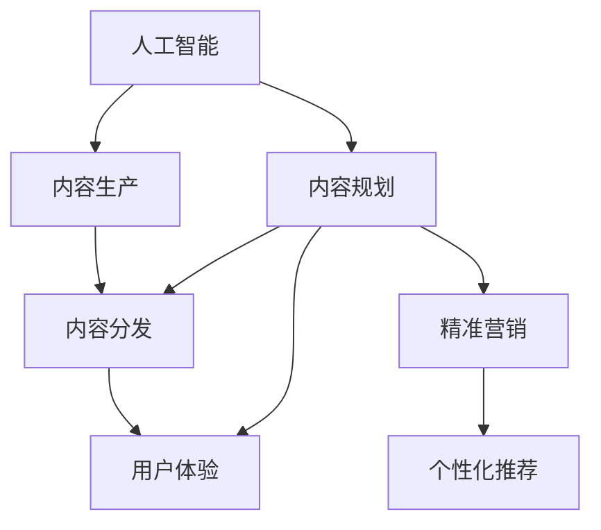

                 

# AI创业公司的产品内容策略：内容规划、内容生产与内容分发

> 关键词：人工智能, 创业公司, 产品策略, 内容规划, 内容生产, 内容分发, 数据驱动, 用户体验, 精准营销, 个性化推荐, 策略优化

## 1. 背景介绍

### 1.1 问题由来
在快速发展的数字化时代，AI技术在各行各业中发挥着越来越重要的作用。特别是在内容产业，AI的广泛应用不仅极大提升了内容创作和分发效率，还为个性化推荐和精准营销带来了前所未有的可能性。AI创业公司如何制定高效的内容策略，利用先进技术优势，从内容规划、生产到分发形成闭环，成为了当前热点话题。

### 1.2 问题核心关键点
AI创业公司面临的核心问题包括：

- **内容规划**：如何快速识别市场趋势和用户需求，制定有竞争力的内容策略。
- **内容生产**：如何借助AI技术自动生成高质量内容，提高内容创作的效率。
- **内容分发**：如何通过个性化推荐和精准营销，提升内容的分发效果，扩大用户覆盖面。

### 1.3 问题研究意义
在内容产业竞争日益激烈的环境下，AI创业公司的内容策略不仅仅是提升用户体验，更是获取市场份额的关键。通过系统化地规划、高效生产与精准分发内容，AI公司不仅能吸引用户关注，还能提升用户粘性和忠诚度，实现商业价值最大化。

## 2. 核心概念与联系

### 2.1 核心概念概述

为更好地理解AI创业公司的内容策略，本节将介绍几个密切相关的核心概念：

- **人工智能**：使用数据、算法和计算技术，模拟、延伸和扩展人类的智能能力，实现各种智能任务。
- **内容规划**：分析市场和用户需求，制定内容创作和分发的方向和计划，确保内容的战略性和前瞻性。
- **内容生产**：利用AI技术自动生成、编辑、优化内容，提高内容创作效率和质量。
- **内容分发**：通过精准推荐、社交媒体、广告投放等渠道，将内容分发给目标用户群体，最大化内容影响力。
- **用户体验**：内容创作和分发过程中，提升用户的参与度、满意度和忠诚度，实现用户价值的最大化。
- **精准营销**：通过数据分析和机器学习，精准定位目标用户群体，实现个性化推荐和营销，提升营销效果。
- **个性化推荐**：利用AI技术分析用户行为和偏好，推送符合用户需求的内容，提升用户粘性。

这些核心概念之间的逻辑关系可以通过以下Mermaid流程图来展示：



这个流程图展示了大语言模型的核心概念及其之间的关系：

1. 人工智能通过数据分析和机器学习技术，为内容规划提供数据支持和决策依据。
2. 内容规划指导内容生产，确保内容与市场和用户需求保持一致。
3. 内容生产利用AI技术自动化内容创作，提高效率和质量。
4. 内容分发通过个性化推荐和精准营销，将内容精准推送给目标用户。
5. 用户体验贯穿内容创作和分发全过程，提升用户满意度和忠诚度。

这些概念共同构成了AI创业公司内容策略的全过程，旨在通过技术手段，实现内容的高效、精准和个性化分发。

## 3. 核心算法原理 & 具体操作步骤
### 3.1 算法原理概述

AI创业公司内容策略的核心算法原理主要包括以下几个方面：

- **内容规划算法**：通过分析海量数据，预测用户需求和市场趋势，制定内容策略。
- **内容生产算法**：利用自然语言处理(NLP)、生成对抗网络(GAN)等技术，自动生成高质量内容。
- **内容分发算法**：基于推荐系统算法，如协同过滤、深度学习等，实现个性化推荐。

### 3.2 算法步骤详解

基于AI的内容策略一般包括以下几个关键步骤：

**Step 1: 数据收集与分析**
- 收集用户行为数据、市场趋势数据、竞争对手信息等，作为内容规划的基础。
- 使用数据分析技术，如文本挖掘、情感分析等，理解用户需求和情感。

**Step 2: 内容规划**
- 根据数据分析结果，确定内容主题、创作方向和发布计划。
- 设定内容指标，如用户参与度、阅读时长、分享次数等，作为内容策略的衡量标准。

**Step 3: 内容生产**
- 利用NLP技术，如BERT、GPT等，自动生成和优化内容。
- 引入GAN技术，通过对抗训练，生成更具创意和吸引力的内容。
- 进行内容质量评估，确保自动生成的内容符合品牌形象和用户偏好。

**Step 4: 内容分发**
- 构建推荐系统，通过协同过滤、基于内容的推荐等技术，实现个性化推荐。
- 利用社交媒体、搜索引擎优化(SEO)等渠道，提升内容曝光率和覆盖面。
- 设置广告投放策略，通过精准营销，提升用户转化率和品牌认知度。

### 3.3 算法优缺点

基于AI的内容策略具有以下优点：

1. **高效性**：自动化的内容生产和个性化推荐，显著提高内容创作和分发效率。
2. **精准性**：通过数据分析和机器学习，实现精准的用户定位和内容推荐。
3. **多样性**：利用AI技术生成多样化的内容形式，满足不同用户群体的需求。
4. **成本低**：相比于人工内容创作和分发，AI方法可以大幅降低人力成本和运营成本。

同时，该方法也存在一定的局限性：

1. **数据依赖**：内容策略依赖高质量的数据输入，数据偏差可能导致策略偏差。
2. **技术复杂**：自动化内容生成和推荐系统需要复杂的算法和模型支持，技术门槛较高。
3. **伦理问题**：自动化内容生成可能引入偏见和错误信息，需要严格的数据审查和伦理监管。
4. **用户接受度**：部分用户可能对自动生成内容感到不信任，需要平衡AI与人工创作。

尽管存在这些局限性，但就目前而言，基于AI的内容策略仍是内容产业的主要发展方向。未来相关研究的重点在于如何进一步提升数据质量、降低技术门槛，同时兼顾内容的多样性和伦理性等因素。

### 3.4 算法应用领域

基于AI的内容策略已经在多个领域得到了广泛应用，例如：

- **电商**：自动生成商品描述、用户评价，并通过推荐系统提升用户购买率。
- **媒体**：自动生成新闻报道、专题文章，通过推荐系统提高内容阅读量和用户粘性。
- **社交**：自动生成社交内容、评论，通过个性化推荐提升用户互动和参与度。
- **教育**：自动生成教学内容、习题，通过个性化推荐提高学习效果。

除了上述这些经典应用外，AI内容策略还被创新性地应用到更多场景中，如虚拟助手、智能客服、智能广告等，为内容产业带来了全新的突破。随着AI技术的不断进步，相信内容产业将迎来更广阔的发展空间。

## 4. 数学模型和公式 & 详细讲解  
### 4.1 数学模型构建

本节将使用数学语言对基于AI的内容策略进行更加严格的刻画。

记用户行为数据为 $X = \{x_1, x_2, \ldots, x_N\}$，其中每个 $x_i$ 表示用户行为记录，如浏览网页、购买商品等。设内容数据为 $Y = \{y_1, y_2, \ldots, y_M\}$，其中每个 $y_j$ 表示内容数据，如文章、视频等。设推荐系统为用户推荐的 $K$ 个内容，记推荐结果为 $Z = \{z_{ij}\}_{i=1}^K$，其中 $z_{ij} = 1$ 表示用户 $i$ 推荐到内容 $j$。

定义内容与用户间的相似度矩阵 $S \in \mathbb{R}^{M \times N}$，其中 $S_{ij} = \cos(\theta(y_i, x_j))$，$\theta$ 为相似度函数，通常为余弦相似度或欧式距离。

定义推荐系统中的用户兴趣向量 $u_i \in \mathbb{R}^{M}$，其中 $u_i$ 的第 $j$ 个元素表示用户 $i$ 对内容 $j$ 的兴趣程度。通过矩阵分解技术，可以将 $u_i$ 表示为 $U \times V$ 的矩阵乘积形式，即 $u_i = U_i \times V_i$，其中 $U \in \mathbb{R}^{N \times R}$ 为用户兴趣矩阵，$V \in \mathbb{R}^{M \times R}$ 为内容向量矩阵。

定义推荐结果向量 $z \in \mathbb{R}^{N \times K}$，其中 $z_{ik} = 1$ 表示用户 $i$ 对内容 $k$ 进行了推荐。通过矩阵乘法，可以将 $z$ 表示为 $U \times V$ 的矩阵乘积形式，即 $z = U \times V$。

### 4.2 公式推导过程

以下我们以协同过滤算法为例，推导推荐系统的核心公式。

假设用户对内容的评分矩阵为 $R \in \mathbb{R}^{M \times N}$，其中 $R_{ij} = r(y_i, x_j)$ 表示用户 $i$ 对内容 $j$ 的评分。设 $u_i$ 为用户 $i$ 的兴趣向量，$v_j$ 为内容 $j$ 的特征向量。推荐算法通过计算 $u_i$ 和 $v_j$ 的点积，得到用户对内容的预测评分 $\hat{r}(y_i, x_j)$：

$$
\hat{r}(y_i, x_j) = \frac{\sum_{k=1}^M u_{ik} v_{kj}}{\sqrt{\sum_{k=1}^M u_{ik}^2} \sqrt{\sum_{k=1}^M v_{kj}^2}}
$$

其中 $u_{ik}$ 为 $u_i$ 的第 $k$ 个元素，$v_{kj}$ 为 $v_j$ 的第 $k$ 个元素。

对于新内容 $y$，预测用户 $i$ 的评分 $\hat{r}(y, x_i)$ 可以通过与已评分内容 $y'$ 的向量相似度表示：

$$
\hat{r}(y, x_i) = \sum_{k=1}^K \hat{r}(y', x_i) v_{kj}
$$

其中 $y'$ 表示已评分的 $K$ 个内容，$v_{kj}$ 为 $y'$ 的向量表示。

最终，推荐系统通过选择与 $u_i$ 相似度最高的 $K$ 个内容，作为用户 $i$ 的推荐结果。

### 4.3 案例分析与讲解

以下以电商商品推荐系统为例，展示基于协同过滤算法的内容推荐过程：

1. **数据收集**：
   - 收集用户的浏览记录、购买记录等行为数据，作为用户行为矩阵 $X$。
   - 收集商品标题、描述、类别等特征信息，作为内容特征矩阵 $Y$。

2. **相似度计算**：
   - 使用余弦相似度计算用户行为向量 $u_i$ 和内容特征向量 $v_j$ 的相似度 $S_{ij}$。
   - 通过矩阵分解技术，得到用户兴趣向量 $u_i$ 和内容向量矩阵 $V$。

3. **评分预测**：
   - 根据用户兴趣向量 $u_i$ 和内容向量矩阵 $V$，计算每个内容对用户的预测评分 $\hat{r}(y, x_i)$。
   - 选择评分最高的 $K$ 个内容，作为用户推荐的商品。

4. **效果评估**：
   - 通过AUC、PR曲线、MSE等指标评估推荐系统的效果。
   - 利用用户反馈数据，不断优化模型参数和推荐策略。

通过以上步骤，电商商品推荐系统能够高效地为用户推荐感兴趣的商品，提升用户购买率和满意度。

## 5. 项目实践：代码实例和详细解释说明
### 5.1 开发环境搭建

在进行内容策略的实践前，我们需要准备好开发环境。以下是使用Python进行TensorFlow开发的环境配置流程：

1. 安装Anaconda：从官网下载并安装Anaconda，用于创建独立的Python环境。

2. 创建并激活虚拟环境：
```bash
conda create -n tf-env python=3.8 
conda activate tf-env
```

3. 安装TensorFlow：根据CUDA版本，从官网获取对应的安装命令。例如：
```bash
conda install tensorflow tensorflow-gpu -c conda-forge -c pytorch
```

4. 安装各类工具包：
```bash
pip install numpy pandas scikit-learn matplotlib tqdm jupyter notebook ipython
```

完成上述步骤后，即可在`tf-env`环境中开始内容策略的实践。

### 5.2 源代码详细实现

这里我们以电商商品推荐系统为例，给出使用TensorFlow进行协同过滤推荐算法的PyTorch代码实现。

首先，定义用户行为数据和商品特征数据：

```python
import tensorflow as tf
from tensorflow.keras.layers import Dense, Embedding, Dot, Input
from tensorflow.keras.models import Model

# 用户行为数据
X = tf.random.normal(shape=(10000, 10))

# 商品特征数据
Y = tf.random.normal(shape=(20000, 5))

# 用户行为向量
u = Embedding(input_dim=20000, output_dim=50, input_length=10, name='u')(X)

# 商品特征向量
v = Embedding(input_dim=20000, output_dim=50, input_length=5, name='v')(Y)

# 相似度矩阵
S = Dot(axes=(2, 1), name='S')([u, v])
```

然后，定义推荐系统模型：

```python
# 用户兴趣向量
u = Dense(50, activation='relu', name='u')(u)

# 内容向量矩阵
v = Dense(50, activation='relu', name='v')(v)

# 评分预测
z = Dot(axes=(1, 1), name='z')([u, v])

# 用户评分预测
y_hat = Dense(1, activation='sigmoid', name='y_hat')(z)

# 构建推荐模型
model = Model(inputs=[u, v], outputs=y_hat)
model.compile(optimizer='adam', loss='binary_crossentropy', metrics=['accuracy'])
```

接着，定义训练和评估函数：

```python
# 训练函数
def train_model(model, X, Y, batch_size=64, epochs=10):
    model.fit(X, Y, batch_size=batch_size, epochs=epochs, validation_split=0.2)

# 评估函数
def evaluate_model(model, X, Y, batch_size=64, epochs=10):
    model.evaluate(X, Y, batch_size=batch_size, epochs=epochs)
```

最后，启动训练流程并在测试集上评估：

```python
# 训练模型
train_model(model, X, Y)

# 评估模型
evaluate_model(model, X, Y)
```

以上就是使用TensorFlow对电商商品推荐系统进行协同过滤算法实践的完整代码实现。可以看到，TensorFlow提供了简单易用的高级API，使得模型构建和训练过程非常简单高效。

### 5.3 代码解读与分析

让我们再详细解读一下关键代码的实现细节：

**用户行为数据和商品特征数据**：
- 使用`tf.random.normal`生成用户行为数据和商品特征数据，作为推荐模型的输入。

**用户行为向量和商品特征向量**：
- 使用`Embedding`层将用户行为数据和商品特征数据转换为向量表示，方便模型处理。
- 设置`input_dim`为商品数量，`output_dim`为向量维度，`input_length`为行为序列长度。

**相似度矩阵**：
- 使用`Dot`层计算用户行为向量和商品特征向量的相似度矩阵`S`。

**评分预测**：
- 使用`Dense`层对用户行为向量和商品特征向量进行非线性变换，得到用户兴趣向量`u`和内容向量矩阵`v`。
- 通过计算向量乘积，得到用户对每个商品的预测评分。

**模型构建与训练**：
- 使用`Dense`层对用户行为向量和商品特征向量进行非线性变换。
- 通过`Dot`层计算预测评分，使用`sigmoid`激活函数将评分映射到[0,1]之间。
- 构建推荐模型，使用`Adam`优化器和`binary_crossentropy`损失函数进行训练。

通过以上步骤，我们可以利用TensorFlow轻松实现一个基于协同过滤算法的电商推荐系统，高效地为用户推荐商品。

## 6. 实际应用场景
### 6.1 智能媒体平台

基于AI的内容策略在智能媒体平台中有着广泛的应用。传统的媒体内容推荐主要依赖人工编辑，效率低下且容易产生主观偏见。智能媒体平台通过大数据分析和机器学习算法，可以实现自动化的内容推荐，提升内容质量和用户满意度。

在具体实践中，平台可以利用用户的浏览、点赞、分享等行为数据，构建用户兴趣模型。同时，通过分析内容的热门度和质量，构建内容推荐模型。最终，平台通过智能推荐引擎，将符合用户兴趣和内容质量要求的内容呈现给用户。

### 6.2 智能广告投放

智能广告投放是AI内容策略的重要应用场景之一。传统广告投放通常依赖人工经验，存在精度低、成本高的问题。智能广告系统通过AI技术，可以精准识别目标用户群体，实现个性化的广告投放。

具体而言，智能广告系统可以收集用户的历史行为数据，使用机器学习算法进行用户画像和兴趣分析。通过协同过滤、深度学习等技术，系统可以识别出符合用户兴趣的广告内容，并智能推荐给用户。同时，系统还可以通过实时竞价、预算控制等手段，优化广告投放效果，提升广告转化率和ROI。

### 6.3 智能客服系统

智能客服系统利用AI技术，实现自动化的客户服务。传统客服模式往往依赖人工客服，成本高且效率低。智能客服系统通过自然语言处理和机器学习技术，可以实现自动化的文本理解、意图识别和回答生成。

在具体实践中，智能客服系统可以收集历史客户对话数据，构建用户画像和问题回答模型。通过上下文理解、知识图谱推理等技术，系统可以智能回答用户问题，提升客户服务体验。同时，系统还可以根据客户反馈，不断优化回答模型，提升服务质量和用户满意度。

### 6.4 未来应用展望

随着AI技术的不断进步，基于AI的内容策略将在更多领域得到应用，为传统行业带来变革性影响。

在智慧城市领域，智能媒体、智能广告、智能客服等技术将广泛应用于城市管理、交通调度、公共服务等领域，提升城市治理效率和服务水平。

在工业制造领域，智能内容策略将应用于产品设计、生产监控、客户服务等环节，推动制造业数字化转型升级。

在医疗健康领域，智能内容策略将应用于健康管理、在线咨询、药物推荐等环节，提升医疗服务的可及性和精准性。

此外，在教育培训、金融服务、电子商务等多个领域，AI内容策略将带来新的应用场景和商业模式，为各行各业带来新的创新和机遇。

## 7. 工具和资源推荐
### 7.1 学习资源推荐

为了帮助开发者系统掌握AI内容策略的理论基础和实践技巧，这里推荐一些优质的学习资源：

1. 《深度学习入门与实践》：李沐、李斌合著，全面介绍了深度学习的基本原理和实战技巧。

2. CS229《机器学习》课程：斯坦福大学开设的机器学习经典课程，深入讲解了机器学习算法和应用。

3. 《机器学习实战》：Peter Harrington著，详细介绍了各种机器学习算法的实现和应用案例。

4. Google AI Blog：Google AI团队发布的博客，涵盖了最新的AI技术和应用案例，适合追踪前沿研究动态。

5. arXiv：AI领域的预印本服务器，可以下载最新的学术论文，了解最新的研究进展。

通过对这些资源的学习实践，相信你一定能够快速掌握AI内容策略的精髓，并用于解决实际的业务问题。

### 7.2 开发工具推荐

高效的开发离不开优秀的工具支持。以下是几款用于AI内容策略开发的常用工具：

1. TensorFlow：由Google主导开发的开源深度学习框架，生产部署方便，适合大规模工程应用。

2. PyTorch：Facebook开发的开源深度学习框架，灵活性和可扩展性强，适合快速迭代研究。

3. Jupyter Notebook：交互式笔记本环境，支持Python代码块、Markdown格式和图形展示，非常适合开发和测试算法。

4. Scikit-learn：基于NumPy的Python机器学习库，提供了丰富的机器学习算法和工具，适合快速实现和测试模型。

5. Elasticsearch：分布式搜索引擎，支持高效的文本搜索和分析，适合构建内容推荐系统。

6. Apache Kafka：分布式消息系统，支持高吞吐量和高可靠性的数据流处理，适合实时内容推荐。

合理利用这些工具，可以显著提升AI内容策略的开发效率，加快创新迭代的步伐。

### 7.3 相关论文推荐

AI内容策略的发展源于学界的持续研究。以下是几篇奠基性的相关论文，推荐阅读：

1. "Collaborative Filtering for Implicit Feedback Datasets"（共融过滤）：提出协同过滤算法，用于推荐系统中的用户行为数据处理。

2. "Neural Collaborative Filtering"（神经协同过滤）：提出基于神经网络的内容推荐模型，提升推荐系统的精度和鲁棒性。

3. "Neural Topic Modeling"（神经主题建模）：提出主题模型算法，用于分析文本数据的潜在主题结构。

4. "Attention is All You Need"（注意力机制）：提出Transformer结构，用于提高自然语言处理模型的性能。

5. "Distributed Representations of Words and Phrases and their Compositionality"（分布式表示与组合性）：提出Word2Vec算法，用于将单词转换为向量表示。

6. "The Surprising Usefulness of Transfer Learning"（转移学习的惊人用途）：介绍转移学习技术，用于提高模型的泛化能力。

这些论文代表了大语言模型内容策略的发展脉络。通过学习这些前沿成果，可以帮助研究者把握学科前进方向，激发更多的创新灵感。

## 8. 总结：未来发展趋势与挑战
### 8.1 总结

本文对基于AI的内容策略进行了全面系统的介绍。首先阐述了AI内容策略的研究背景和意义，明确了内容规划、内容生产和内容分发在内容策略中的关键作用。其次，从原理到实践，详细讲解了协同过滤推荐算法的基本原理和实现步骤，给出了基于TensorFlow的电商商品推荐系统的完整代码实现。同时，本文还广泛探讨了AI内容策略在智能媒体、智能广告、智能客服等实际应用场景中的落地实践。

通过本文的系统梳理，可以看到，基于AI的内容策略正在成为内容产业的主要发展方向，极大地提升了内容创作的效率和质量，拓宽了内容分发的渠道和方式。AI技术的应用，使得内容策略更加数据驱动、智能高效，为内容产业带来了新的发展机遇。

### 8.2 未来发展趋势

展望未来，AI内容策略将呈现以下几个发展趋势：

1. **数据驱动的内容创作**：通过自然语言处理、生成对抗网络等技术，实现自动化的内容创作和优化，提高内容创作效率和质量。

2. **多模态内容融合**：将文本、图像、视频等多种模态的数据进行融合，提升内容的丰富性和表现力。

3. **个性化推荐引擎**：通过深度学习、协同过滤等技术，实现更加精准的内容推荐，提升用户满意度和粘性。

4. **实时内容推荐**：利用流计算和大数据技术，实现实时的内容推荐，提升内容的时效性和互动性。

5. **跨平台内容分发**：通过统一的API接口和数据格式，实现跨平台、跨渠道的内容分发，提升内容覆盖率和影响力。

6. **自适应内容策略**：根据用户行为和市场变化，动态调整内容策略，提升策略的灵活性和适应性。

以上趋势凸显了AI内容策略的广阔前景。这些方向的探索发展，必将进一步提升内容产业的智能化水平，为内容创作、分发和消费带来新的变革。

### 8.3 面临的挑战

尽管AI内容策略已经取得了显著进展，但在迈向更加智能化、个性化内容策略的过程中，仍面临诸多挑战：

1. **数据隐私和安全**：内容策略依赖大量的用户行为数据，如何保障数据隐私和安全，是一个重要问题。

2. **内容质量和多样性**：自动化内容生成可能引入偏见和错误信息，如何提升内容质量和多样性，是一个重要课题。

3. **技术复杂度**：内容策略的实现需要复杂的算法和模型支持，技术门槛较高，如何降低技术复杂度，是一个重要方向。

4. **用户体验和信任**：部分用户可能对自动生成的内容感到不信任，如何提升用户体验和信任度，是一个重要问题。

5. **伦理和法规**：内容策略可能涉及用户隐私和版权等伦理问题，如何遵守相关法规和伦理标准，是一个重要课题。

6. **计算资源**：内容策略的实现需要大量的计算资源，如何优化资源使用，降低计算成本，是一个重要方向。

正视内容策略面临的这些挑战，积极应对并寻求突破，将是大语言模型内容策略走向成熟的必由之路。相信随着学界和产业界的共同努力，这些挑战终将一一被克服，AI内容策略必将在构建人机协同的智能内容生态中扮演越来越重要的角色。

### 8.4 研究展望

面对内容策略面临的诸多挑战，未来的研究需要在以下几个方面寻求新的突破：

1. **提升数据质量**：通过数据清洗、标注和增强等技术，提升数据的质量和多样性，保障内容策略的准确性和鲁棒性。

2. **优化算法模型**：引入更多的先进算法和技术，如深度学习、生成对抗网络、知识图谱等，提升内容策略的性能和效果。

3. **强化用户信任**：通过透明化的算法和内容审核机制，提升用户对自动生成内容的信任度，增强用户粘性和满意度。

4. **保障隐私安全**：引入数据脱敏、差分隐私等技术，保障用户隐私和数据安全，提升内容策略的可信度和安全性。

5. **优化资源使用**：通过模型裁剪、量化加速等技术，优化计算资源使用，降低内容策略的计算成本和部署难度。

6. **增强用户体验**：通过用户画像和行为分析，个性化推荐和动态调整内容策略，提升用户参与度和满意度。

这些研究方向的探索，必将引领AI内容策略技术迈向更高的台阶，为内容产业带来更智能、更高效、更个性化的解决方案。面向未来，AI内容策略还需要与其他AI技术进行更深入的融合，如知识表示、自然语言推理、强化学习等，多路径协同发力，共同推动内容策略技术的进步。只有勇于创新、敢于突破，才能不断拓展内容策略的边界，让AI技术更好地服务于内容创作、分发和消费。

## 9. 附录：常见问题与解答

**Q1：内容策略如何平衡个性化和多样性？**

A: 内容策略的平衡在于根据用户需求和市场趋势，选择适当的内容创作和分发方式。可以通过以下方法实现个性化和多样性的平衡：

- **个性化推荐**：根据用户行为和兴趣，推荐符合用户偏好的内容，提升用户满意度和粘性。
- **内容多样化**：在个性化推荐的基础上，引入多样化的内容类型和形式，满足不同用户的需求。
- **动态调整**：根据市场趋势和用户反馈，动态调整内容策略，确保内容的多样性和时效性。

**Q2：内容策略如何提升用户信任度？**

A: 提升用户信任度是内容策略的重要目标之一。以下是一些提升用户信任度的关键方法：

- **透明化算法**：向用户公开推荐算法的原理和过程，让用户理解并信任内容推荐。
- **用户反馈机制**：建立用户反馈渠道，及时收集用户意见和建议，优化内容策略。
- **内容审核机制**：引入人工审核机制，保障内容的真实性和准确性。
- **数据隐私保护**：保障用户数据隐私，防止数据滥用和泄露。

**Q3：内容策略如何降低技术复杂度？**

A: 降低技术复杂度是内容策略实现过程中的重要目标。以下是一些降低技术复杂度的关键方法：

- **模型压缩和优化**：通过模型裁剪、量化加速等技术，降低模型大小和计算资源消耗。
- **工具和框架**：利用高效的工具和框架，如TensorFlow、PyTorch等，提升开发效率和模型性能。
- **自动化和智能化**：引入自动化和智能化工具，如自动化特征工程、智能化调参工具等，提升内容策略的开发效率和效果。

通过以上方法，可以显著降低内容策略的技术复杂度，提升内容策略的开发效率和效果。

**Q4：内容策略如何提升内容质量和多样性？**

A: 提升内容质量和多样性是内容策略的重要目标之一。以下是一些提升内容质量和多样性的关键方法：

- **数据清洗和标注**：通过数据清洗和标注技术，提升数据的质量和多样性，保障内容策略的准确性和鲁棒性。
- **内容审核机制**：引入人工审核机制，确保内容质量和真实性。
- **多样化的内容形式**：引入多种内容形式，如文本、图像、视频等，提升内容的丰富性和表现力。

**Q5：内容策略如何优化资源使用？**

A: 优化资源使用是内容策略实现过程中的重要目标。以下是一些优化资源使用的关键方法：

- **模型裁剪和量化**：通过模型裁剪、量化加速等技术，降低模型大小和计算资源消耗。
- **分布式计算**：利用分布式计算技术，提升内容策略的计算效率和可扩展性。
- **实时计算**：利用流计算和大数据技术，实现实时的内容推荐，提升内容的时效性和互动性。

通过以上方法，可以显著优化内容策略的资源使用，提升内容策略的计算效率和可扩展性。

---

作者：禅与计算机程序设计艺术 / Zen and the Art of Computer Programming

