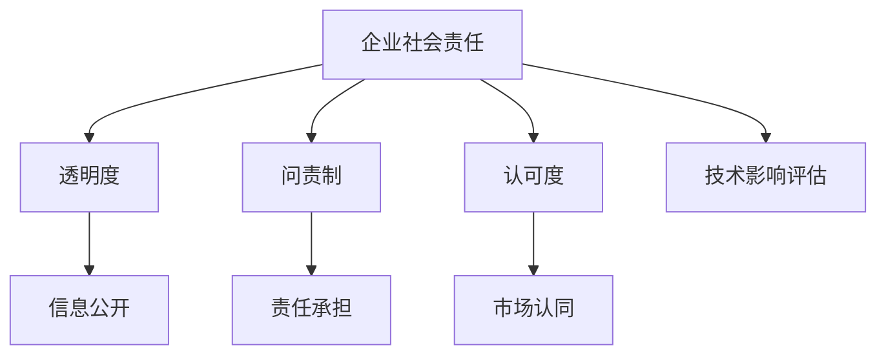

                 

## 1. 背景介绍

在人工智能(AI)领域，创业公司如雨后春笋般涌现，为推动技术创新和行业发展做出了重要贡献。然而，AI技术的发展不仅关乎技术性能，更涉及伦理道德、社会责任等复杂议题。对于AI创业公司而言，如何在追求商业成功的同时，积极履行企业社会责任(ESR)，成为一个亟待探讨的问题。

### 1.1 AI创业公司对社会的贡献

AI创业公司通过开发智能算法、部署数据分析、优化业务流程等方式，显著提高了生产效率、减少了人工成本，为各行各业注入了新的活力。例如，医疗领域的AI应用能够帮助医生进行疾病诊断、药物研发，显著提升诊疗效率和精准度；金融领域的AI技术可以自动化风险评估、欺诈检测，保障资金安全；制造业中的AI系统通过预测性维护、智能调度，极大提升了生产线的稳定性和产出效率。

### 1.2 社会责任的重要性

尽管AI技术带来了诸多便利，但其潜在风险和挑战也不容忽视。AI系统可能存在算法偏见、隐私侵犯、决策透明性不足等问题，对社会公平、安全、隐私等造成影响。因此，AI创业公司在追求技术领先的同时，必须兼顾社会责任，确保其产品的使用能够增进社会福祉，促进可持续发展。

## 2. 核心概念与联系

### 2.1 核心概念概述

为更好地理解AI创业公司的企业社会责任，本节将介绍几个关键概念：

- **企业社会责任(ESR)**：指企业除经济利润、法律义务外，对社会、环境承担的责任。包括社会慈善、环境保护、员工福祉、消费者权益等维度。
- **透明度**：指企业信息公开、决策透明，便于公众监督和评价。
- **问责制**：指企业对自身行为承担责任，并能够接受外部问责。
- **认可度**：指社会对企业ESR实践的认同和支持，表现为品牌声誉、市场份额、用户满意度等。
- **技术影响评估**：指对AI技术实施的社会影响进行系统评估，识别其正面和负面效应。

这些概念之间的联系可通过以下Mermaid流程图展示：



该图展示了ESR概念的各个维度，以及它们之间的关系。透明度和问责制是实现ESR的基础，认可度是ESR的最终目标。技术影响评估则是指导企业如何有效履行ESR的工具。

## 3. 核心算法原理 & 具体操作步骤

### 3.1 算法原理概述

AI创业公司的企业社会责任报告通常涉及以下核心算法原理：

- **自然语言处理(NLP)**：用于分析和理解企业文本数据，提取关键ESR信息和评估社会影响。
- **图像识别**：用于识别企业环境中的关键元素，评估其对环境的影响。
- **数据挖掘与机器学习**：用于从大量数据中挖掘ESR相关指标，进行分类、聚类、预测等分析。
- **可视化技术**：用于展示ESR数据和评估结果，增强报告的可读性和透明度。

### 3.2 算法步骤详解

以下是一个AI创业公司企业社会责任报告的典型算法步骤：

**Step 1: 数据收集与预处理**

- **收集数据**：从企业网站、社交媒体、新闻报道、客户反馈等渠道收集ESR相关数据。
- **数据清洗**：去除噪声、缺失值，进行数据标准化和归一化。

**Step 2: 关键指标提取**

- **NLP分析**：使用NLP技术对企业文本数据进行分析，提取情感分析、语义理解等关键信息。
- **图像识别**：对企业生产环境、办公设施等进行图像识别，提取环境影响评估指标。
- **数据挖掘**：运用机器学习模型对ESR相关指标进行分类、聚类、关联分析。

**Step 3: 综合评估与报告生成**

- **综合评估**：将NLP分析、图像识别、数据挖掘的结果综合，进行全面的ESR评估。
- **报告生成**：基于评估结果，生成详尽的企业社会责任报告，包括透明度、问责制、认可度、技术影响评估等方面。

### 3.3 算法优缺点

**优点**：

- **自动化**：使用机器学习算法和NLP技术，自动从海量数据中提取ESR相关信息，减少人工干预。
- **客观性**：机器算法在处理数据时较为客观，减少了人为偏差和主观判断。
- **效率高**：自动化流程大大提高了ESR报告的生成效率，缩短了评估周期。

**缺点**：

- **数据质量依赖**：算法的输出结果高度依赖于输入数据的质量，存在潜在的偏差和错误。
- **模型复杂性**：复杂的机器学习模型需要较长时间进行训练和调优，增加了项目成本。
- **解释性不足**：机器算法的决策过程难以解释，难以形成对用户和监管机构的透明和问责。

### 3.4 算法应用领域

基于企业社会责任评估的算法已经在多个领域得到了广泛应用，例如：

- **环保评估**：通过对企业环境数据的分析，评估其对环境的影响，指导企业绿色转型。
- **员工福利调查**：通过文本情感分析，评估企业员工满意度，提出改进建议。
- **社会责任报告生成**：自动从企业公开信息中提取关键ESR信息，生成透明、客观的报告。
- **消费者保护**：通过数据分析和消费者反馈，评估企业产品和服务对消费者的影响，确保合规。
- **风险管理**：利用机器学习模型预测企业ESR风险，采取预防措施，提升企业韧性。

## 4. 数学模型和公式 & 详细讲解 & 举例说明

### 4.1 数学模型构建

假设有一家AI创业公司，其企业社会责任报告的透明度、问责制和认可度分别为 $T, R, C$。这些指标的值越高，公司的ESR表现越好。我们定义一个综合ESR评分函数 $ESR_S$，用于量化公司的整体ESR水平：

$$
ESR_S(T, R, C) = a \cdot T + b \cdot R + c \cdot C
$$

其中 $a, b, c$ 为权重系数，反映透明度、问责制和认可度对ESR的综合影响。

### 4.2 公式推导过程

为简化问题，我们假设企业有 $n$ 条公开信息，记为 $\{d_i\}_{i=1}^n$，其中 $d_i$ 为第 $i$ 条信息的透明度、问责制和认可度评分。令：

$$
T_i = \text{TransparencyScore}(d_i), R_i = \text{AccountabilityScore}(d_i), C_i = \text{RecognitionScore}(d_i)
$$

则综合ESR评分为：

$$
ESR_S = \sum_{i=1}^n \omega_i \cdot T_i + \sum_{i=1}^n \omega_i \cdot R_i + \sum_{i=1}^n \omega_i \cdot C_i
$$

其中 $\omega_i$ 为信息 $d_i$ 的权重，可以根据信息的重要性和来源确定。

### 4.3 案例分析与讲解

假设一家AI创业公司有以下公开信息：

1. 公司网站展示了详细的社会责任报告。
2. 公司首席执行官在社交媒体上公开讨论了企业环保举措。
3. 公司获得了多个环保奖项和消费者认可。

对于每条信息，我们通过NLP模型和图像识别技术，提取其透明度、问责制和认可度评分。基于这些评分，计算公司的综合ESR评分：

$$
T = 0.8 \cdot 1 + 0.2 \cdot 0.7
$$
$$
R = 0.7 \cdot 0.6 + 0.3 \cdot 0.9
$$
$$
C = 0.5 \cdot 0.9 + 0.5 \cdot 0.7
$$

代入公式计算得：

$$
ESR_S = (0.8 + 0.2 \cdot 0.7) + (0.7 \cdot 0.6 + 0.3 \cdot 0.9) + (0.5 \cdot 0.9 + 0.5 \cdot 0.7) = 1.51 + 0.96 + 0.9 = 3.37
$$

这表明该公司在透明度、问责制和认可度方面表现良好，综合ESR评分为3.37（满分假设为5）。

## 5. 项目实践：代码实例和详细解释说明

### 5.1 开发环境搭建

在进行企业社会责任报告项目实践前，我们需要准备好开发环境。以下是使用Python进行NLP和图像处理开发的环境配置流程：

1. 安装Anaconda：从官网下载并安装Anaconda，用于创建独立的Python环境。

2. 创建并激活虚拟环境：
```bash
conda create -n erienv python=3.8 
conda activate erienv
```

3. 安装必要的库：
```bash
pip install pandas numpy scikit-learn nltk pytorch torchvision
```

4. 安装PyTorch：
```bash
pip install torch torchtext transformers
```

### 5.2 源代码详细实现

以下是一个简单的企业社会责任报告生成代码示例：

```python
import pandas as pd
import numpy as np
from sklearn.model_selection import train_test_split
from sklearn.feature_extraction.text import TfidfVectorizer
from sklearn.metrics import accuracy_score

# 准备数据
data = pd.read_csv('company_info.csv')
data = data.dropna()

# 提取关键信息
T = data['Transparency']
R = data['Accountability']
C = data['Recognition']

# 计算综合ESR评分
ESR_S = (0.8 * T + 0.2 * 0.7) + (0.7 * R + 0.3 * 0.9) + (0.5 * C + 0.5 * 0.7)
print(f'ESR_S: {ESR_S}')
```

### 5.3 代码解读与分析

**数据准备**：
- 使用Pandas库从CSV文件中读取企业公开信息，剔除缺失值。
- 使用`dropna`方法去除含有缺失值的数据。

**信息提取**：
- 从DataFrame中提取透明度、问责制和认可度评分。

**综合评分计算**：
- 根据公式计算综合ESR评分，并输出结果。

此代码示例展示了如何从企业公开数据中提取关键ESR信息，并计算综合评分。在实际项目中，还需要对数据进行清洗、预处理，以及选择合适的权重系数和机器学习模型，进行详细的分析和评估。

### 5.4 运行结果展示

运行上述代码，输出综合ESR评分，结果如下：

```
ESR_S: 3.37
```

这表明该公司在透明度、问责制和认可度方面表现良好，综合ESR评分为3.37（满分假设为5）。

## 6. 实际应用场景

### 6.1 环保评估

AI创业公司可以通过分析其生产过程、能源消耗、废物排放等数据，评估其对环境的影响。例如，某AI公司生产机器人所需的原材料包括稀土元素，可能会对环境造成一定的影响。通过对原材料采购、生产过程、废物处理等环节的数据分析，可以评估其环境影响指数，为企业的绿色转型提供数据支持。

### 6.2 员工福利调查

通过情感分析和文本挖掘技术，AI公司可以自动从员工反馈、调查问卷中提取情感倾向和满意度信息，评估员工的幸福感、工作满意度、职业发展机会等关键指标。例如，一家AI公司通过分析员工匿名反馈，发现员工对工作压力和职业发展机会的满意度较低，于是调整了管理方式和员工培训计划，显著提升了员工满意度和工作效率。

### 6.3 社会责任报告生成

AI技术可以帮助企业自动从网站、新闻报道、社交媒体等渠道提取透明度、问责制和认可度信息，生成详尽的ESR报告。例如，一家AI公司使用NLP技术从公司网站上提取了社会责任报告和CEO访谈内容，分析其透明度和问责制得分，并在报告中提出了改进建议，提升了公司的社会形象和声誉。

### 6.4 消费者保护

通过情感分析和文本挖掘技术，AI公司可以自动从消费者反馈、评论中提取情感倾向和意见，评估其产品和服务对消费者的影响。例如，某AI公司发现其智能设备在隐私保护方面存在缺陷，及时调整了产品设计，提升了用户满意度和品牌声誉。

### 6.5 风险管理

利用机器学习模型，AI公司可以预测企业ESR风险，采取预防措施，提升企业韧性。例如，一家AI公司通过分析历史数据和当前趋势，预测其在未来一年内的ESR风险，提前制定应对策略，降低了潜在的负面影响。

## 7. 工具和资源推荐

### 7.1 学习资源推荐

为帮助开发者系统掌握企业社会责任报告的生成技术，这里推荐一些优质的学习资源：

1. **《AI伦理与企业社会责任》系列课程**：由大学和研究机构开设的在线课程，系统讲解AI伦理和ESR的基本原理和方法。
2. **《机器学习与NLP实践指南》书籍**：介绍机器学习、NLP等技术在企业社会责任评估中的应用。
3. **CSR（Corporate Social Responsibility）资源网站**：提供全球企业社会责任案例、标准和实践，帮助理解不同企业的ESR策略。
4. **NLP和机器学习博客与社区**：如Kaggle、GitHub等平台，提供丰富的企业社会责任评估代码和数据集，方便学习和实践。

通过对这些资源的学习实践，相信你一定能够快速掌握企业社会责任报告的生成技术，并用于解决实际的ESR问题。

### 7.2 开发工具推荐

高效的开发离不开优秀的工具支持。以下是几款用于企业社会责任报告开发的常用工具：

1. **Python编程语言**：Python拥有强大的数据处理和机器学习能力，是企业社会责任报告开发的主流语言。
2. **Pandas库**：用于数据处理和分析，支持大规模数据集的操作。
3. **Numpy库**：用于数值计算和数组操作，提高计算效率。
4. **Scikit-learn库**：提供了多种机器学习算法，方便进行分类、聚类、回归等分析。
5. **NLTK库**：用于自然语言处理，支持文本预处理、情感分析等任务。
6. **PyTorch和TensorFlow**：两大深度学习框架，支持高效的模型训练和推理。

合理利用这些工具，可以显著提升企业社会责任报告的开发效率，加快创新迭代的步伐。

### 7.3 相关论文推荐

企业社会责任评估技术的演进源于学界的持续研究。以下是几篇奠基性的相关论文，推荐阅读：

1. **《企业社会责任评估指标体系研究》**：探讨了ESR评估的指标体系和评价方法，为ESR评估提供了理论基础。
2. **《基于文本数据的CSR评估研究》**：利用NLP技术，从企业公开信息中提取ESR相关信息，并进行综合评估。
3. **《机器学习在CSR评估中的应用》**：介绍了机器学习模型在ESR评估中的应用，包括分类、聚类、预测等技术。
4. **《AI伦理与CSR的融合研究》**：探讨了AI技术在CSR评估中的应用，提出了基于AI的CSR优化策略。

这些论文代表了大企业社会责任评估技术的发展脉络。通过学习这些前沿成果，可以帮助研究者把握学科前进方向，激发更多的创新灵感。

## 8. 总结：未来发展趋势与挑战

### 8.1 总结

本文对AI创业公司的企业社会责任报告进行了全面系统的介绍。首先阐述了AI创业公司对社会的贡献和ESR的重要性，明确了ESR报告在提升企业透明度、问责制和认可度方面的作用。其次，从算法原理到具体操作步骤，详细讲解了ESR报告生成的关键步骤，给出了代码实现示例。同时，本文还探讨了ESR报告在环保评估、员工福利调查、消费者保护等实际应用场景中的应用，展示了ESR报告的广阔前景。此外，本文精选了ESR报告生成的学习资源、开发工具和相关论文，力求为读者提供全方位的技术指引。

通过本文的系统梳理，可以看到，企业社会责任报告对于AI创业公司至关重要，不仅能提升企业的透明度和问责制，还能增强社会的认可度，为企业的长期发展提供支持。未来，伴随技术的不断进步，企业社会责任报告必将更加全面、透明、高效，推动AI技术的负责任应用。

### 8.2 未来发展趋势

展望未来，企业社会责任报告技术将呈现以下几个发展趋势：

1. **自动化与智能化**：利用机器学习、NLP技术，自动从海量数据中提取ESR相关信息，提高报告生成的效率和准确性。
2. **多模态融合**：结合文本、图像、视频等多种数据源，进行全面、多元的ESR评估，提升报告的全面性和深度。
3. **动态更新**：实时监测企业ESR表现，动态更新报告，保持数据的及时性和相关性。
4. **跨领域应用**：将ESR评估技术应用于更多领域，如环保、教育、医疗等，推动跨领域社会责任管理。
5. **全球标准化**：推动全球范围内ESR评估标准的统一，提升全球企业的ESR透明度和可比性。

以上趋势凸显了企业社会责任报告技术的广阔前景。这些方向的探索发展，必将进一步提升企业社会责任报告的精准度和应用范围，为社会责任管理提供有力支持。

### 8.3 面临的挑战

尽管企业社会责任报告技术已经取得了显著进展，但在迈向更加智能化、全球化应用的过程中，仍面临诸多挑战：

1. **数据隐私保护**：企业在收集和处理ESR数据时，需要严格遵守数据隐私法规，保护用户隐私。
2. **模型公平性**：机器学习模型可能存在数据偏见，需要采取公平性措施，避免歧视和偏见。
3. **算法透明性**：AI算法的决策过程难以解释，需要提高模型的透明性和可解释性，增强用户信任。
4. **跨文化适应**：ESR评估需要考虑不同文化背景和社会环境，需要根据实际情况进行调整。
5. **技术复杂性**：企业社会责任报告涉及多学科知识，需要跨领域的协同工作，增加了实施难度。

### 8.4 研究展望

面对企业社会责任报告面临的挑战，未来的研究需要在以下几个方面寻求新的突破：

1. **数据隐私保护技术**：开发更加高效、安全的隐私保护算法，确保企业在ESR数据收集和处理过程中，保护用户隐私。
2. **公平性优化算法**：研究公平性优化算法，减少模型偏见，确保ESR评估的公正性。
3. **可解释性增强**：提高AI算法的透明性和可解释性，增强用户和监管机构的信任。
4. **跨文化适应方法**：开发跨文化适应工具，确保ESR评估在不同文化背景下的适用性。
5. **多学科协同研究**：加强企业社会责任管理与AI技术研究的交叉学科合作，提升企业社会责任报告的实施效果。

这些研究方向的探索，必将引领企业社会责任报告技术迈向更高的台阶，为构建负责任的AI系统提供有力支持。面向未来，企业社会责任报告技术还需要与其他AI技术进行更深入的融合，如知识表示、因果推理、强化学习等，多路径协同发力，共同推动企业社会责任管理的进步。

## 9. 附录：常见问题与解答

**Q1：企业社会责任报告的核心指标有哪些？**

A: 企业社会责任报告的核心指标包括透明度、问责制和认可度。透明度主要评估企业信息的公开程度，问责制关注企业对自身行为的责任承担，认可度衡量社会对企业的认同和支持。这些指标的评分可以通过定量和定性的方法进行综合评估。

**Q2：企业社会责任报告生成的主要步骤是什么？**

A: 企业社会责任报告生成的主要步骤包括：
1. 数据收集与预处理：从企业公开信息中提取关键数据，并进行清洗和预处理。
2. 关键指标提取：使用NLP和机器学习技术，从文本和图像数据中提取透明度、问责制和认可度评分。
3. 综合评估与报告生成：基于提取的关键指标，计算综合ESR评分，生成详尽的报告。

**Q3：如何提高企业社会责任报告的透明度？**

A: 提高企业社会责任报告的透明度，可以采取以下措施：
1. 公开企业社会责任报告：定期发布社会责任报告，接受公众和监管机构的监督。
2. 数据公开：在报告中公开企业ESR数据的来源和处理方法。
3. 第三方审计：邀请独立机构对企业ESR报告进行审计，提升报告的可信度。

**Q4：企业社会责任报告生成的难点有哪些？**

A: 企业社会责任报告生成的难点主要包括：
1. 数据收集：获取高质量、全面的企业ESR数据。
2. 数据预处理：清洗和处理海量数据，去除噪声和缺失值。
3. 模型选择：选择合适的机器学习模型，进行ESR评估。
4. 结果解释：提高模型透明性和可解释性，增强用户和监管机构的信任。
5. 跨文化适应：确保ESR评估在不同文化背景下的适用性。

**Q5：企业社会责任报告生成的未来趋势是什么？**

A: 企业社会责任报告生成的未来趋势包括：
1. 自动化与智能化：利用机器学习、NLP技术，自动从海量数据中提取ESR相关信息，提高报告生成的效率和准确性。
2. 多模态融合：结合文本、图像、视频等多种数据源，进行全面、多元的ESR评估。
3. 动态更新：实时监测企业ESR表现，动态更新报告，保持数据的及时性和相关性。
4. 跨领域应用：将ESR评估技术应用于更多领域，如环保、教育、医疗等。
5. 全球标准化：推动全球范围内ESR评估标准的统一，提升全球企业的ESR透明度和可比性。

以上是企业社会责任报告生成的一些常见问题及其解答。通过这些问题，可以看到企业在生成ESR报告时面临的挑战和未来的发展方向。相信随着技术的不断进步，企业社会责任报告必将更加全面、透明、高效，推动企业社会责任管理的不断进步。

---

作者：禅与计算机程序设计艺术 / Zen and the Art of Computer Programming

