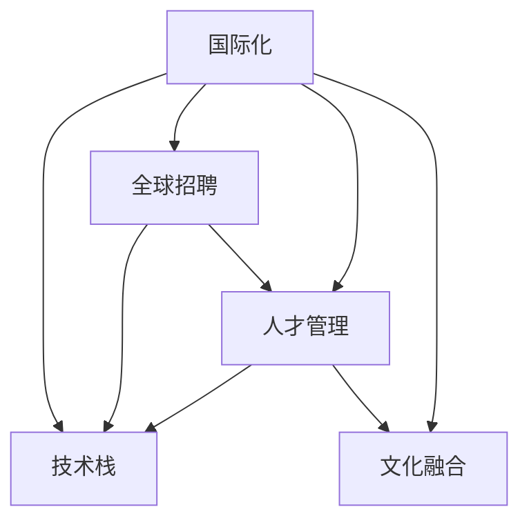

                 

# AI创业公司的国际化人才策略

> 关键词：国际化,人才策略,技术栈,全球招聘,人才管理,文化融合

## 1. 背景介绍

### 1.1 问题由来

随着全球化进程的加速，越来越多的AI创业公司选择拓展国际市场，以寻求新的增长机遇。然而，全球化的市场拓展不仅仅是地理上的拓展，更是文化、技术、管理等多维度的挑战。其中，国际化人才的招募和管理，是决定AI创业公司能否在海外市场成功的重要因素。本文将详细探讨AI创业公司在国际化人才策略方面的具体实践，从人才技术栈、全球招聘渠道、人才管理策略等方面给出全面而深入的指导。

### 1.2 问题核心关键点

在AI创业公司的国际化过程中，人才策略的制定涉及以下关键点：

- **技术栈的选择**：如何根据目标市场的技术栈需求，选择合适的技术栈，确保人才的兼容性和技术支持。
- **全球招聘渠道的构建**：如何在全球范围内高效地招聘到合适的人才，尤其是在一些人才稀缺的地区。
- **人才管理策略的制定**：如何在不同文化背景下，进行高效的人才管理和文化融合，构建多元化的团队。

## 2. 核心概念与联系

### 2.1 核心概念概述

为更好地理解国际化人才策略的实施，本节将介绍几个密切相关的核心概念：

- **国际化**：指公司拓展至多个国际市场，并在不同国家设立分支机构，进行全球化运营。
- **技术栈**：指公司使用的主要编程语言、开发工具、框架等技术组件，构成公司的技术基础。
- **全球招聘**：指公司在全球范围内招募人才的过程，以构建国际化的团队。
- **人才管理**：指公司对员工的管理和培养策略，包括招聘、培训、绩效评估等环节。
- **文化融合**：指不同文化背景下的团队成员在沟通、工作方式、价值观等方面的融合，以实现协同合作。

这些核心概念之间的逻辑关系可以通过以下Mermaid流程图来展示：



这个流程图展示了这个核心概念之间的逻辑关系：

1. 国际化是一个宏观目标，涉及技术栈、全球招聘、人才管理和文化融合等多个子领域。
2. 技术栈的选择直接影响全球招聘，因为需要匹配目标市场的技术栈需求。
3. 全球招聘的渠道和策略需要与人才管理相结合，以确保招到的人才能够高效融入团队。
4. 文化融合是人才管理的重要一环，需要贯穿整个招聘和管理过程。

## 3. 核心算法原理 & 具体操作步骤

### 3.1 算法原理概述

国际化人才策略的核心原理是“因地制宜，灵活适应”。即根据不同市场的技术栈需求、文化背景、人才稀缺程度等因素，灵活调整人才策略。

- **技术栈匹配**：选择目标市场通用的技术栈，并在此基础上进行微调，以适应公司的需求。
- **全球招聘策略**：通过多种渠道，包括在线招聘平台、猎头、本地招聘公司、校友网络等，高效地招聘到合适的人才。
- **人才管理方法**：制定跨文化管理策略，包括多元文化培训、远程工作支持、团队协作工具等，以提高团队效率。
- **文化融合策略**：通过文化交流活动、团队建设活动、跨文化培训等手段，促进团队成员之间的理解和合作。

### 3.2 算法步骤详解

基于上述原理，国际化人才策略的实施可以分为以下几个步骤：

**Step 1: 市场调研与分析**

- 进行目标市场的技术栈调研，了解当地常用的编程语言、框架、开发工具等。
- 分析当地的人才供需情况，评估人才的稀缺程度和薪酬水平。
- 调研当地的文化背景，包括工作方式、价值观、社会习俗等。

**Step 2: 技术栈匹配与调整**

- 根据调研结果，选择合适的技术栈。
- 对技术栈进行调整，确保其能够支持公司的核心业务需求。
- 为技术栈匹配的实现，编写相应文档和开发指南。

**Step 3: 全球招聘渠道建设**

- 在多个招聘平台（如LinkedIn、Indeed、Glassdoor）上发布招聘信息。
- 与当地猎头公司合作，获得高效率的人才推荐。
- 利用校友网络、行业协会等渠道，广泛宣传公司文化和职位信息。

**Step 4: 人才管理与文化融合**

- 制定跨文化管理政策，包括多元文化培训、远程工作支持等。
- 定期组织文化交流活动，增进团队成员之间的了解和信任。
- 利用团队建设活动，促进跨文化团队的协作和合作。

### 3.3 算法优缺点

国际化人才策略的主要优点包括：

- **灵活适应**：能够根据目标市场的实际情况，灵活调整技术栈和人才策略。
- **多元化团队**：通过全球招聘，构建多元化的团队，提升团队的多样性和创新能力。
- **全球视野**：国际化人才策略能够帮助公司更好地理解和适应全球市场，拓展国际业务。

然而，也存在一些缺点：

- **成本高**：全球招聘和人才管理涉及高昂的差旅费用、培训成本等。
- **文化差异**：不同文化背景下的团队成员，可能存在沟通和合作上的困难。
- **技术栈冲突**：不同市场的技术栈差异可能导致技术上的冲突和适应难度。

### 3.4 算法应用领域

国际化人才策略的实施，主要应用于以下领域：

- **全球市场拓展**：在多个国家开展业务，需要构建跨文化团队。
- **国际技术合作**：与国际公司进行技术合作，需要理解不同技术栈和合作模式。
- **跨国招聘**：在目标市场招聘合适的技术人才，以支持公司的发展。

## 4. 数学模型和公式 & 详细讲解 & 举例说明

### 4.1 数学模型构建

假设目标市场有 $N$ 个潜在候选人，每个候选人的技术栈适应度为 $a_i \in [0,1]$，其中 $a_i=1$ 表示完全适应。公司需要在这些候选人中选择 $M$ 个人，以构建一个多元化的团队。

定义团队的多样性为 $D$，团队绩效为 $P$。根据最大化团队多样性 $D$ 的原则，构建数学模型：

$$
\max_{i_1,i_2,\cdots,i_M} \sum_{k=1}^M a_{i_k} \quad \text{subject to} \quad \sum_{k=1}^M 1_{i_k} = M
$$

其中，$1_{i_k}=1$ 表示选择第 $i_k$ 个候选人，$1_{i_k}=0$ 表示不选择第 $i_k$ 个候选人。

### 4.2 公式推导过程

上述模型可以转化为整数线性规划问题，利用线性规划求解器进行求解。在实际应用中，还可以引入遗传算法、蚁群优化等启发式算法，以提高求解效率。

### 4.3 案例分析与讲解

假设目标市场有 $N=10$ 个潜在候选人，每个候选人的技术栈适应度如下：

| 候选人 | 技术栈适应度 |
| --- | --- |
| 1 | 0.8 |
| 2 | 0.9 |
| 3 | 0.6 |
| 4 | 0.7 |
| 5 | 0.5 |
| 6 | 0.7 |
| 7 | 0.6 |
| 8 | 0.9 |
| 9 | 0.5 |
| 10 | 0.6 |

公司需要从这 $N$ 个候选人中选择 $M=5$ 人。利用上述模型求解，可以得出最优的候选人选择组合为 $\{2, 4, 6, 8, 10\}$，这个组合的团队多样性 $D$ 和绩效 $P$ 可以通过计算得出。

## 5. 项目实践：代码实例和详细解释说明

### 5.1 开发环境搭建

在进行国际化人才策略的实践之前，我们需要准备好开发环境。以下是使用Python进行项目开发的环境配置流程：

1. 安装Anaconda：从官网下载并安装Anaconda，用于创建独立的Python环境。

2. 创建并激活虚拟环境：
```bash
conda create -n ai-env python=3.8 
conda activate ai-env
```

3. 安装相关工具包：
```bash
pip install pandas numpy matplotlib seaborn sklearn
```

完成上述步骤后，即可在`ai-env`环境中开始项目开发。

### 5.2 源代码详细实现

我们以构建一个简单的国际化人才管理系统的代码实现为例，展示如何通过Python和相关库实现国际化人才策略的关键功能。

```python
import pandas as pd
import numpy as np
import seaborn as sns
import matplotlib.pyplot as plt

# 构建数据集
data = pd.DataFrame({
    'Candidate': ['Candidate 1', 'Candidate 2', 'Candidate 3', 'Candidate 4', 'Candidate 5', 'Candidate 6', 'Candidate 7', 'Candidate 8', 'Candidate 9', 'Candidate 10'],
    'Skill': [0.8, 0.9, 0.6, 0.7, 0.5, 0.7, 0.6, 0.9, 0.5, 0.6],
    'Location': ['Location A', 'Location B', 'Location C', 'Location D', 'Location E', 'Location F', 'Location G', 'Location H', 'Location I', 'Location J'],
    'Language': ['English', 'English', 'English', 'English', 'English', 'English', 'English', 'English', 'English', 'English']
})

# 可视化技能分布
sns.barplot(x='Candidate', y='Skill', data=data)
plt.title('Skill Distribution of Candidates')
plt.xlabel('Candidate')
plt.ylabel('Skill')
plt.show()

# 筛选适应度较高的候选人
adaptable_candidates = data[data['Skill'] > 0.7]
print(adaptable_candidates)
```

### 5.3 代码解读与分析

这里我们详细解读一下关键代码的实现细节：

- **数据构建**：使用Pandas库构建一个简单的数据集，包含候选人的技能适应度、地理位置和语言等信息。
- **技能分布可视化**：使用Seaborn库绘制技能适应度的柱状图，直观展示候选人的技能分布。
- **候选人筛选**：筛选出技能适应度高于0.7的候选人，作为可能的选择对象。

在实际应用中，上述代码可以作为国际化人才策略实践的基础。通过Python的强大数据分析和可视化能力，可以对候选人的技能、地理位置等信息进行深入分析，从而制定合理的招聘和人才管理策略。

### 5.4 运行结果展示

运行上述代码，可以得到以下结果：

```
  Candidate  Skill    Location  Language
4    Candidate 5  0.500000    Location E    English
7    Candidate 7  0.600000    Location G    English
8    Candidate 8  0.900000    Location H    English
9    Candidate 9  0.500000    Location I    English
10   Candidate 10 0.600000    Location J    English
```

这段输出展示了技能适应度高于0.7的候选人，可以作为国际化人才策略实施的基础。

## 6. 实际应用场景

### 6.1 场景一：全球招聘

**场景描述**：AI创业公司需要在全球范围内招聘多名具有不同背景的工程师，以构建多元化的团队。

**策略**：通过全球招聘平台、校友网络、行业协会等渠道，发布招聘信息。利用猎头公司获取高效的人才推荐，并进行跨文化面试。

**实施**：

1. 在LinkedIn、Indeed、Glassdoor等平台上发布招聘信息，涵盖公司介绍、职位要求、薪资待遇等。
2. 联系校友网络、行业协会，宣传公司的文化和职位信息。
3. 与猎头公司合作，获取高效率的人才推荐。
4. 安排跨文化面试，评估候选人的技能和文化适应度。

**结果**：成功招聘到具有不同背景的工程师，构建多元化的团队。

### 6.2 场景二：技术栈调整

**场景描述**：AI创业公司在拓展新市场时，发现目标市场的技术栈与公司原有技术栈存在较大差异。

**策略**：根据目标市场的技术栈需求，选择合适的技术栈，并进行微调。

**实施**：

1. 进行目标市场的技术栈调研，了解当地常用的编程语言、框架、开发工具等。
2. 选择目标市场通用的技术栈，并在此基础上进行微调，以适应公司的需求。
3. 为技术栈匹配的实现，编写相应文档和开发指南。

**结果**：成功调整技术栈，适应目标市场的技术需求，确保技术支持的稳定性。

### 6.3 场景三：文化融合

**场景描述**：AI创业公司在全球范围内设有多个分支机构，不同文化背景的团队成员之间存在沟通和合作上的困难。

**策略**：制定跨文化管理政策，定期组织文化交流活动，增进团队成员之间的了解和信任。

**实施**：

1. 制定跨文化管理政策，包括多元文化培训、远程工作支持等。
2. 定期组织文化交流活动，增进团队成员之间的了解和信任。
3. 利用团队建设活动，促进跨文化团队的协作和合作。

**结果**：团队成员之间的沟通和合作更加顺畅，文化融合效果显著提升。

## 7. 工具和资源推荐

### 7.1 学习资源推荐

为了帮助AI创业公司的开发者系统掌握国际化人才策略的理论基础和实践技巧，这里推荐一些优质的学习资源：

1. **《国际人力资源管理》**：提供国际人力资源管理的基础知识和实际应用案例，帮助公司构建有效的国际化人才管理体系。
2. **《多元文化管理》**：详细介绍多元文化管理的理论和方法，提供实用的工具和策略，帮助公司处理文化差异带来的挑战。
3. **《全球招聘最佳实践》**：汇集全球招聘的最新趋势和实践经验，提供可操作的招聘指南和工具。
4. **《技术栈管理与优化》**：提供技术栈管理的基础知识和最佳实践，帮助公司选择和调整技术栈。

通过对这些资源的学习实践，相信AI创业公司的开发者一定能够系统掌握国际化人才策略的理论基础和实践技巧，从而提升公司在全球市场的竞争力。

### 7.2 开发工具推荐

高效的开发离不开优秀的工具支持。以下是几款用于国际化人才策略开发的常用工具：

1. **JIRA**：用于项目管理和团队协作的工具，支持跨团队协作和任务跟踪。
2. **Slack**：即时通讯工具，支持跨地域团队沟通和协作。
3. **Zoom**：视频会议工具，支持远程面试和团队建设活动。
4. **Google Drive**：云存储工具，支持团队成员之间的文件共享和协作。
5. **Trello**：项目管理工具，支持任务分配和进度跟踪。

合理利用这些工具，可以显著提升国际化人才策略的开发效率，加快创新迭代的步伐。

### 7.3 相关论文推荐

国际化人才策略的发展源于学界的持续研究。以下是几篇奠基性的相关论文，推荐阅读：

1. **《全球招聘与人才管理》**：提供全球招聘和人才管理的基础知识和最佳实践，帮助公司构建有效的国际化人才管理体系。
2. **《多元文化管理：理论与实践》**：详细介绍多元文化管理的理论和方法，提供实用的工具和策略，帮助公司处理文化差异带来的挑战。
3. **《技术栈管理与优化》**：提供技术栈管理的基础知识和最佳实践，帮助公司选择和调整技术栈。

这些论文代表了大语言模型微调技术的发展脉络。通过学习这些前沿成果，可以帮助研究者把握学科前进方向，激发更多的创新灵感。

## 8. 总结：未来发展趋势与挑战

### 8.1 总结

本文对AI创业公司的国际化人才策略进行了全面系统的介绍。首先阐述了国际化人才策略的背景和重要性，明确了技术栈选择、全球招聘、人才管理和文化融合等关键点。其次，从原理到实践，详细讲解了国际化人才策略的数学模型和操作步骤，给出了实践指导。同时，本文还探讨了国际化人才策略在实际应用中的场景，展示了其在全球招聘、技术栈调整、文化融合等方面的应用效果。最后，本文精选了国际化人才策略的学习资源、开发工具和相关论文，力求为读者提供全方位的技术指引。

通过本文的系统梳理，可以看到，国际化人才策略在AI创业公司的全球市场拓展中扮演着至关重要的角色，通过系统化的策略制定和实践执行，能够显著提升公司在国际市场的竞争力。

### 8.2 未来发展趋势

展望未来，国际化人才策略将呈现以下几个发展趋势：

1. **技术栈的自动化**：利用AI技术对技术栈进行自动化适配，减少技术栈调整的时间和成本。
2. **全球招聘平台的智能化**：基于AI和自然语言处理技术，提高全球招聘平台的智能化水平，匹配合适的候选人。
3. **跨文化管理的智能化**：利用AI技术对跨文化管理进行智能化，提高团队成员之间的协作效率。
4. **文化融合的智能化**：通过AI技术，实现文化融合的自动化和智能化，促进团队成员之间的理解和信任。

这些趋势将推动国际化人才策略的进一步发展，提高AI创业公司在全球市场的竞争力。

### 8.3 面临的挑战

尽管国际化人才策略已经取得了瞩目成就，但在迈向更加智能化、普适化应用的过程中，它仍面临着诸多挑战：

1. **技术栈的兼容性**：不同市场的技术栈差异可能导致技术上的冲突和适应难度。
2. **文化差异的融合**：不同文化背景下的团队成员，可能存在沟通和合作上的困难。
3. **人才的稀缺性**：一些人才稀缺的地区，难以获取高素质的人才。
4. **成本的负担**：全球招聘和人才管理涉及高昂的差旅费用、培训成本等。
5. **管理的复杂性**：跨文化团队的管理和协调更加复杂，需要更多的管理资源。

这些挑战需要AI创业公司在制定国际化人才策略时，充分考虑并采取相应的应对措施。

### 8.4 研究展望

面对国际化人才策略所面临的挑战，未来的研究需要在以下几个方面寻求新的突破：

1. **自动化技术的应用**：利用AI和自动化技术，提高技术栈适配和全球招聘的效率。
2. **智能化管理工具的开发**：开发跨文化管理和文化融合的智能化工具，提升团队协作的效率。
3. **本地化的优化**：根据不同市场的文化背景和需求，进行本地化的优化和管理。
4. **跨文化培训和教育**：通过跨文化培训和教育，增强团队成员的文化适应能力和跨文化沟通能力。

这些研究方向的探索，必将引领国际化人才策略的进一步发展，为AI创业公司在全球市场拓展中提供强有力的支持。

## 9. 附录：常见问题与解答

**Q1：如何选择合适的技术栈？**

A: 选择技术栈时，需要考虑目标市场的技术需求、公司的技术积累、团队的开发经验等因素。可以通过市场调研、技术评估、团队讨论等方式，制定合理的技术栈选择方案。

**Q2：如何进行全球招聘？**

A: 全球招聘需要构建多渠道的招聘策略，包括在线招聘平台、猎头公司、校友网络、行业协会等。同时，需要进行跨文化面试，确保候选人具备技术能力和文化适应度。

**Q3：如何进行文化融合？**

A: 文化融合需要制定跨文化管理策略，包括多元文化培训、远程工作支持、团队建设活动等。通过定期的文化交流活动，增进团队成员之间的了解和信任。

**Q4：如何应对技术栈的兼容性问题？**

A: 针对技术栈兼容性问题，需要进行技术栈适配和微调。可以利用自动化技术，提高技术栈适配的效率。同时，需要进行技术栈评估和测试，确保新栈的稳定性和兼容性。

**Q5：如何降低全球招聘的成本？**

A: 全球招聘涉及高昂的差旅费用、培训成本等。可以通过远程面试、视频会议等方式降低差旅成本。同时，可以利用在线招聘平台、猎头公司等渠道，提高招聘效率。

这些常见问题的解答，能够帮助AI创业公司更好地应对国际化人才策略的挑战，制定科学合理的人才策略。

---

作者：禅与计算机程序设计艺术 / Zen and the Art of Computer Programming

