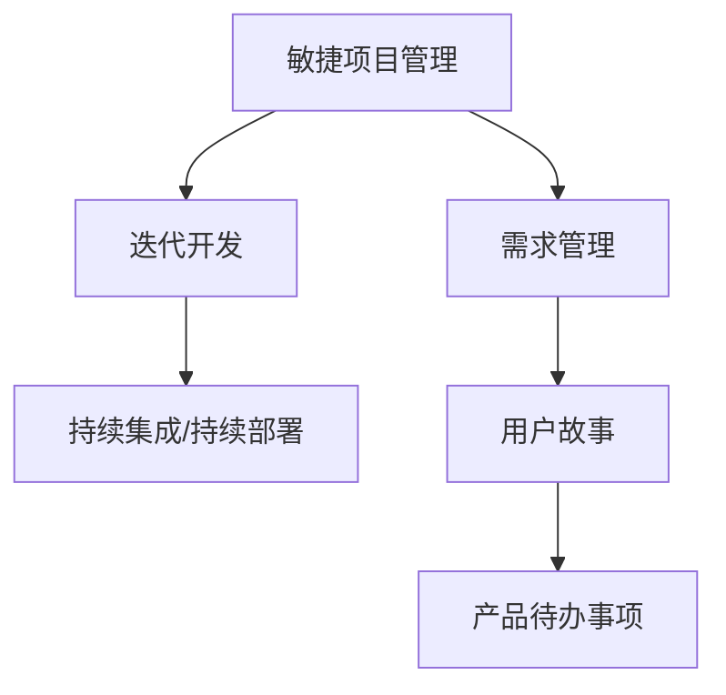

                 

# AI创业公司的敏捷项目管理：需求管理、迭代开发与交付

> 关键词：敏捷项目管理, 需求管理, 迭代开发, 交付, 持续集成/持续部署(CI/CD), 用户故事, 产品待办事项, Scrum框架

## 1. 背景介绍

### 1.1 问题由来
在人工智能(AI)技术迅猛发展的今天，越来越多的创业公司将AI技术应用于各种场景，提高产品性能和服务水平，满足用户需求。然而，AI项目与传统软件项目有所不同，其开发周期长、不确定因素多，项目管理的复杂度大大增加。因此，如何将敏捷项目管理方法应用于AI项目，提高项目效率和产品交付质量，成为当下AI创业公司面临的重要问题。

### 1.2 问题核心关键点
敏捷项目管理(Agile Project Management)是当今项目管理领域的主流方法之一，其核心理念是快速响应变化、迭代开发、团队协作，以适应市场变化和技术迭代。与传统项目管理相比，敏捷项目管理强调以用户需求为核心，快速交付高价值产品，增强产品竞争力。

AI项目通常涉及大量的数据处理和模型训练，开发周期长，涉及的技术复杂度高，对团队的跨学科合作要求高。如何在敏捷项目管理框架下，将AI项目高效地推进，满足用户需求，是AI创业公司亟需解决的问题。

## 2. 核心概念与联系

### 2.1 核心概念概述

为更好地理解敏捷项目管理在AI项目中的应用，本节将介绍几个密切相关的核心概念：

- **敏捷项目管理**：基于敏捷开发(Agile Development)的理念，采用迭代开发(Iterative Development)、增量交付(Incremental Delivery)、持续集成/持续部署(CI/CD)、用户故事(User Story)等方法，提高项目响应速度和产品交付质量。
- **需求管理**：在项目初期，通过用户故事、产品待办事项(Product Backlog)等方式，明确用户需求和产品愿景，跟踪和调整需求变更。
- **迭代开发**：将大型项目拆分为多个小迭代(Sprint)，每个迭代周期内完成一定量的工作，快速交付产品增量，并根据反馈不断调整需求。
- **持续集成/持续部署**：自动化集成、构建和部署工具，实现代码变更的快速验证和产品发布，缩短产品交付周期。
- **用户故事**：从用户角度描述需求的简短、清晰、易懂的文本，包含需求、场景、业务价值等信息，帮助团队快速理解需求。
- **产品待办事项**：将用户故事按照优先级、工作量、业务价值等因素进行排序，形成待办事项列表，供团队进行迭代开发。

这些核心概念之间的逻辑关系可以通过以下Mermaid流程图来展示：



这个流程图展示了的敏捷项目管理的关键概念及其之间的关系：

1. 敏捷项目管理以用户故事为核心，通过需求管理明确用户需求和产品愿景。
2. 迭代开发将项目拆分为多个迭代，每个迭代内快速交付产品增量，并根据反馈调整需求。
3. 持续集成/持续部署自动化集成和部署工具，快速验证代码变更，缩短产品交付周期。

这些概念共同构成了敏捷项目管理的方法体系，使得团队能够高效响应市场变化，快速交付高质量产品。

## 3. 核心算法原理 & 具体操作步骤
### 3.1 算法原理概述

敏捷项目管理的核心是敏捷开发方法论，其核心思想是通过迭代开发、持续集成/持续部署等手段，快速响应市场需求，提高产品交付质量和用户满意度。在AI项目中，敏捷项目管理方法同样适用，但需要针对AI项目的技术特点，进行相应的优化和调整。

AI项目的敏捷项目管理流程包括：
1. 用户故事收集和分析
2. 产品待办事项的制定和优先级排序
3. 迭代计划制定和任务分配
4. 迭代开发和持续集成/持续部署
5. 迭代结束后的回顾和总结
6. 产品交付和用户反馈收集

这些步骤构成了AI项目敏捷项目管理的基本框架，帮助团队高效推进项目，快速响应市场需求。

### 3.2 算法步骤详解

敏捷项目管理的具体操作步骤如下：

**Step 1: 用户故事收集和分析**
- 与用户进行沟通，收集用户需求，并将需求转化为简短、清晰的用户故事。
- 分析用户故事，明确业务价值、用户场景和功能需求，形成初步的产品愿景。

**Step 2: 产品待办事项的制定和优先级排序**
- 将用户故事转化为产品待办事项，并根据业务价值、工作量等因素进行优先级排序。
- 使用敏捷项目管理工具(如JIRA)进行跟踪和管理，确保每个迭代都有明确的待办事项。

**Step 3: 迭代计划制定和任务分配**
- 制定迭代计划，包括迭代目标、任务列表、资源分配等信息。
- 根据迭代计划，分配任务给团队成员，并明确任务截止日期和验收标准。

**Step 4: 迭代开发和持续集成/持续部署**
- 在迭代周期内进行开发，并使用CI/CD工具自动化集成和部署，快速验证代码变更。
- 每日站立会议(Scrum Stand-up)，跟踪任务进度，及时解决问题。

**Step 5: 迭代结束后的回顾和总结**
- 在迭代结束时，进行回顾会议(Scrum Retrospective)，评估迭代成果和团队表现。
- 总结经验教训，调整迭代计划和任务分配策略。

**Step 6: 产品交付和用户反馈收集**
- 将迭代成果交付给用户，收集用户反馈，并根据反馈进行迭代优化。
- 持续收集用户需求和市场信息，调整产品方向和迭代计划。

### 3.3 算法优缺点

敏捷项目管理在AI项目中具有以下优点：
1. 快速响应市场变化。通过迭代开发和持续集成/持续部署，能够快速验证需求和变更，及时调整方向。
2. 团队协作高效。每日站立会议和回顾会议能够促进团队沟通和协作，提高团队生产力。
3. 灵活性高。敏捷项目管理方法强调用户需求和产品愿景，能够灵活调整项目目标和方向。
4. 用户参与度高。用户故事和产品待办事项能够明确用户需求，增强用户对项目的理解和参与。

同时，该方法也存在一定的局限性：
1. 难以预测需求变化。AI项目涉及大量数据和模型训练，需求变化难以预测，可能导致迭代计划频繁调整。
2. 资源紧张。AI项目通常涉及多种技术，需要跨学科合作，资源分配难度大。
3. 风险管理不足。敏捷项目管理强调快速交付，对风险管理关注不足，可能导致技术债务累积。
4. 知识传递困难。敏捷项目管理中任务分配和团队协作频繁，可能导致知识传递不畅，影响团队整体性能。

尽管存在这些局限性，但就目前而言，敏捷项目管理仍是大规模AI项目的主要选择。未来相关研究的重点在于如何进一步优化敏捷管理框架，提高AI项目的响应速度和交付质量。

### 3.4 算法应用领域

敏捷项目管理方法在AI项目中的应用，主要涉及以下几个领域：

- **自然语言处理(NLP)**：通过用户故事和产品待办事项，明确NLP项目的开发方向和需求，使用迭代开发和持续集成/持续部署快速交付模型和应用。
- **计算机视觉(CV)**：在AI创业公司中，计算机视觉项目通常涉及数据标注、模型训练和模型部署等环节。通过敏捷项目管理方法，可以快速响应市场需求，提高项目效率和交付质量。
- **机器人技术**：AI创业公司还涉及机器人技术，需要多学科合作，敏捷项目管理能够协调不同领域的专家，提升项目进展和产出质量。
- **医疗健康**：医疗AI项目涉及大量数据处理和模型训练，通过敏捷项目管理，可以快速迭代开发，满足医疗行业对AI技术的需求。

除了上述这些领域外，敏捷项目管理还广泛应用于金融、教育、娱乐等多个行业，为AI技术落地应用提供了有效的项目管理支持。

## 4. 数学模型和公式 & 详细讲解 & 举例说明

### 4.1 数学模型构建

敏捷项目管理方法主要关注需求管理和迭代开发，因此不涉及复杂的数学模型构建。但为方便理解，我们仍可从用户故事和产品待办事项的角度，进行一些简单的数学建模。

假设用户故事的数量为 $N$，每个用户故事的业务价值为 $V_i$，工作量为 $W_i$，优先级为 $P_i$。则产品待办事项 $B$ 的优先级排序可以表示为：

$$
P = (V_i, W_i, P_i) 
$$

其中 $P_i = \alpha V_i + \beta W_i + \gamma P_i$，$\alpha, \beta, \gamma$ 为权重系数，根据具体项目需求进行设置。

### 4.2 公式推导过程

用户故事和产品待办事项的优先级排序公式可进一步推导为：

$$
P = \frac{V_i + \beta W_i + \gamma P_i}{\sum_{j=1}^{N} (V_j + \beta W_j + \gamma P_j)}
$$

这个公式表示每个产品待办事项的优先级，是基于其业务价值、工作量、优先级等因素综合计算得出的。

### 4.3 案例分析与讲解

下面以一个实际的AI创业项目为例，展示敏捷项目管理方法的应用。

假设某AI创业公司开发一个NLP应用，用于自然语言情感分析。用户需求包括：
- 支持中文和英文情感分析
- 支持多平台部署
- 提供实时分析功能

通过用户访谈，公司收集到以下用户故事：
- 用户故事1：支持中文情感分析，业务价值5分，工作量10小时，优先级高。
- 用户故事2：支持英文情感分析，业务价值4分，工作量8小时，优先级中。
- 用户故事3：支持多平台部署，业务价值3分，工作量5小时，优先级低。

将用户故事转化为产品待办事项，并按照业务价值和工作量进行优先级排序，得到以下产品待办事项列表：

| 待办事项          | 业务价值 | 工作量 | 优先级 |
|-----------------|--------|-------|--------|
| 中文情感分析    | 5      | 10    | 高      |
| 英文情感分析    | 4      | 8     | 中      |
| 多平台部署      | 3      | 5     | 低      |

根据产品待办事项列表，制定迭代计划，并分配任务给开发团队。假设每个迭代周期为2周，每个开发人员每周工作时间为40小时。则以下迭代计划和任务分配示例：

| 迭代周期 | 迭代目标   | 任务列表 |
|--------|--------|--------|
| 1      | 中文情感分析  | 开发中文情感分析模型 |
| 1      | 英文情感分析  | 开发英文情感分析模型 |
| 2      | 多平台部署  | 实现多平台部署 |

根据迭代计划和任务分配，开发团队在每个迭代周期内进行迭代开发，并使用持续集成/持续部署工具，快速验证代码变更和部署模型。在每个迭代结束时，进行回顾会议，评估迭代成果和团队表现，总结经验教训，调整迭代计划和任务分配策略。

通过敏捷项目管理方法，该公司能够快速响应市场需求，快速交付高质量的产品，满足用户需求，提升产品竞争力。

## 5. 项目实践：代码实例和详细解释说明
### 5.1 开发环境搭建

在进行敏捷项目管理实践前，我们需要准备好开发环境。以下是使用JIRA和Github进行敏捷项目管理和持续集成/持续部署的环境配置流程：

1. 安装JIRA：从官网下载并安装JIRA，创建一个敏捷项目管理板。
2. 安装GitHub：从官网下载并安装GitHub，创建代码仓库，用于代码版本控制。
3. 配置CI/CD工具：选择合适的CI/CD工具(如Jenkins、GitLab CI等)，并集成到Github仓库中。
4. 配置自动化测试工具：使用Selenium等自动化测试工具，对代码变更进行快速测试和验证。

完成上述步骤后，即可在JIRA和Github环境中开始敏捷项目管理实践。

### 5.2 源代码详细实现

这里我们以一个简单的AI项目为例，展示敏捷项目管理方法在代码管理中的应用。

**项目需求：**
- 实现一个简单的中文情感分析模型。

**代码实现：**

1. 创建GitHub仓库，并克隆到本地：
```bash
git clone https://github.com/yourusername/your-repo.git
cd your-repo
```

2. 创建JIRA项目，并分配任务：
- 在JIRA中创建一个项目，添加用户故事和产品待办事项。
- 将任务分配给开发团队成员，并设置截止日期和优先级。

3. 使用CI/CD工具进行持续集成/持续部署：
- 在Github仓库中配置CI/CD流水线，使用Jenkins或GitLab CI。
- 在CI/CD流水线中添加自动化测试、代码检查、部署等环节，确保代码变更的快速验证和交付。

**代码示例：**

```python
# 中文情感分析模型
import jieba

def sentiment_analysis(text):
    # 分词
    words = jieba.cut(text)
    # 计算情感得分
    score = 0
    for word in words:
        # 情感词典，可根据实际需求替换
        emotion_dict = {'正面': 1, '负面': -1}
        if word in emotion_dict:
            score += emotion_dict[word]
    return score

# 测试代码
text = '今天天气不错，心情也好'
score = sentiment_analysis(text)
print(f'情感得分：{score}')
```

**代码解读与分析：**
- 通过JIRA和Github，将项目需求转化为具体的代码任务，分配给开发团队。
- 在GitHub仓库中创建CI/CD流水线，自动化测试和部署代码变更，确保代码的快速验证和交付。

## 6. 实际应用场景
### 6.1 智能客服系统

智能客服系统是AI创业公司常见的应用场景之一。通过敏捷项目管理方法，智能客服系统的开发和维护能够高效推进，快速响应市场需求，提升客户满意度。

具体而言，智能客服系统的敏捷项目管理包括以下几个关键步骤：

1. 用户故事收集和分析：收集用户需求，如常见问题解答、语音识别、情感分析等。
2. 产品待办事项制定和优先级排序：根据用户故事制定产品待办事项，并按照业务价值和紧急程度进行排序。
3. 迭代开发和持续集成/持续部署：根据迭代计划进行快速开发，使用CI/CD工具自动化集成和部署。
4. 迭代结束后的回顾和总结：评估迭代成果和团队表现，总结经验教训，调整迭代计划。
5. 产品交付和用户反馈收集：将迭代成果交付给用户，收集用户反馈，并根据反馈进行迭代优化。

通过敏捷项目管理方法，智能客服系统能够快速响应市场需求，提升客户服务质量，实现智能化升级。

### 6.2 医疗健康

医疗健康领域对AI技术的需求日益增加，通过敏捷项目管理方法，AI医疗项目的开发和应用能够高效推进。

具体而言，AI医疗项目的敏捷项目管理包括以下几个关键步骤：

1. 用户故事收集和分析：收集医生和患者需求，如影像诊断、病历分析、药物推荐等。
2. 产品待办事项制定和优先级排序：根据用户故事制定产品待办事项，并按照业务价值和工作量进行排序。
3. 迭代开发和持续集成/持续部署：根据迭代计划进行快速开发，使用CI/CD工具自动化集成和部署。
4. 迭代结束后的回顾和总结：评估迭代成果和团队表现，总结经验教训，调整迭代计划。
5. 产品交付和用户反馈收集：将迭代成果交付给医院和医生，收集用户反馈，并根据反馈进行迭代优化。

通过敏捷项目管理方法，AI医疗项目能够快速响应市场需求，提升医疗诊断和决策效率，改善医疗服务质量。

### 6.3 金融投资

金融投资领域对AI技术的需求主要集中在数据分析、风险控制、投资策略等方面。通过敏捷项目管理方法，AI金融投资项目的开发和应用能够高效推进。

具体而言，AI金融投资项目的敏捷项目管理包括以下几个关键步骤：

1. 用户故事收集和分析：收集投资公司需求，如股票分析、风险评估、投资策略等。
2. 产品待办事项制定和优先级排序：根据用户故事制定产品待办事项，并按照业务价值和工作量进行排序。
3. 迭代开发和持续集成/持续部署：根据迭代计划进行快速开发，使用CI/CD工具自动化集成和部署。
4. 迭代结束后的回顾和总结：评估迭代成果和团队表现，总结经验教训，调整迭代计划。
5. 产品交付和用户反馈收集：将迭代成果交付给投资公司，收集用户反馈，并根据反馈进行迭代优化。

通过敏捷项目管理方法，AI金融投资项目能够快速响应市场需求，提升投资决策效率，降低投资风险，增加投资收益。

### 6.4 未来应用展望

随着敏捷项目管理方法在AI项目中的广泛应用，未来AI创业公司将能够更加高效地响应市场需求，快速交付高质量产品。敏捷项目管理方法的应用前景包括：

1. 提升项目响应速度。通过敏捷项目管理方法，AI创业公司能够快速迭代开发，快速响应市场需求。
2. 提高团队协作效率。每日站立会议和回顾会议能够促进团队沟通和协作，提高团队生产力。
3. 增强用户满意度。用户故事和产品待办事项能够明确用户需求，增强用户对项目的理解和参与。
4. 降低项目风险。敏捷项目管理方法强调快速交付，对风险管理关注不足，可能导致技术债务累积。

伴随AI技术的不断发展和成熟，敏捷项目管理方法将更加广泛地应用于AI项目，推动AI技术在各行业的深度应用。

## 7. 工具和资源推荐
### 7.1 学习资源推荐

为帮助开发者系统掌握敏捷项目管理在AI项目中的应用，这里推荐一些优质的学习资源：

1. 《敏捷项目管理实践指南》书籍：全面介绍敏捷项目管理方法论，提供丰富的案例和实践指导。
2. Scrum官方培训课程：Scrum官方提供的认证培训课程，系统学习Scrum框架和敏捷项目管理方法。
3. JIRA官方文档：JIRA的官方文档和用户手册，提供详细的配置和管理指南。
4. Jenkins官方文档：Jenkins的官方文档和用户手册，提供详细的CI/CD工具配置和管理指南。
5. GitHub官方文档：GitHub的官方文档和用户手册，提供详细的代码版本控制和管理指南。

通过对这些资源的学习实践，相信你一定能够快速掌握敏捷项目管理在AI项目中的应用，并用于解决实际的AI项目问题。

### 7.2 开发工具推荐

高效的开发离不开优秀的工具支持。以下是几款用于敏捷项目管理开发的常用工具：

1. JIRA：敏捷项目管理工具，支持用户故事、产品待办事项、迭代计划等功能，适合团队协作和项目管理。
2. Jenkins：持续集成/持续部署工具，支持自动化测试、代码检查、部署等环节，确保代码变更的快速验证和交付。
3. GitHub：代码版本控制工具，支持协作开发、代码审查、合并等环节，方便团队进行代码管理和协作。
4. GitLab：代码版本控制和持续集成/持续部署工具，支持CI/CD流水线、自动化测试、部署等环节，适合复杂项目的自动化管理。

合理利用这些工具，可以显著提升敏捷项目管理任务的开发效率，加快创新迭代的步伐。

### 7.3 相关论文推荐

敏捷项目管理方法在AI项目中的应用是当前研究的热点。以下是几篇奠基性的相关论文，推荐阅读：

1. "Agile Project Management for Software Development"：Agile Manifesto的官方文档，介绍敏捷管理方法的基本理念和方法论。
2. "Scrum: The Art of Doing Twice the Work in Half the Time"：Scrum的创始人Ken Schwaber撰写的经典著作，系统介绍Scrum框架和方法。
3. "The Lean Startup"：Eric Ries撰写的畅销书，介绍了精益创业和敏捷项目管理的基本原则和方法。
4. "Continuous Delivery: Reliable Software Releases through Build, Test, and Deployment Automation"：Martin Fowler撰写的经典论文，介绍持续集成/持续部署的基本概念和方法。
5. "Lean Product Planning"：Bob Atkinson撰写的文章，介绍精益产品规划的基本理念和方法。

这些论文代表了大规模AI项目的管理实践，通过学习这些前沿成果，可以帮助研究者把握学科前进方向，激发更多的创新灵感。

## 8. 总结：未来发展趋势与挑战
### 8.1 总结

本文对敏捷项目管理在AI项目中的应用进行了全面系统的介绍。首先阐述了敏捷项目管理在AI项目中的研究背景和意义，明确了敏捷项目管理在提升项目响应速度和交付质量方面的独特价值。其次，从原理到实践，详细讲解了敏捷项目管理方法的数学模型和操作步骤，给出了敏捷项目管理任务开发的完整代码实例。同时，本文还广泛探讨了敏捷项目管理方法在智能客服、医疗健康、金融投资等多个行业领域的应用前景，展示了敏捷项目管理方法的巨大潜力。此外，本文精选了敏捷项目管理相关的学习资源，力求为读者提供全方位的技术指引。

通过本文的系统梳理，可以看到，敏捷项目管理方法在AI项目中的应用前景广阔，极大地提升了AI项目的开发效率和交付质量，推动了AI技术的产业化进程。未来，伴随敏捷项目管理方法与AI技术的进一步融合，AI项目的管理将更加高效，响应速度将更快，交付质量将更高。

### 8.2 未来发展趋势

展望未来，敏捷项目管理在AI项目中的应用将呈现以下几个发展趋势：

1. 敏捷项目管理与AI技术的深度融合。随着AI技术的不断成熟，敏捷项目管理方法将更加注重数据驱动和模型驱动，通过数据和模型优化项目管理流程。
2. 自动化和智能化水平提升。未来敏捷项目管理将更加依赖自动化工具和智能算法，提高项目管理的效率和质量。
3. 多学科团队协作增强。敏捷项目管理将更加注重跨学科团队的协作，利用AI技术优化团队协作效率。
4. 客户参与度提高。敏捷项目管理将更加注重客户需求和参与度，通过用户故事和产品待办事项，提高客户满意度。
5. 风险管理能力提升。敏捷项目管理将更加注重风险管理，通过持续集成/持续部署和自动化测试，降低项目风险。

以上趋势凸显了敏捷项目管理在AI项目中的重要性和未来发展方向。这些方向的探索发展，必将进一步提升AI项目的开发效率和交付质量，推动AI技术在各行业的深度应用。

### 8.3 面临的挑战

尽管敏捷项目管理在AI项目中已经取得了显著成效，但在迈向更加智能化、普适化应用的过程中，仍面临诸多挑战：

1. 项目复杂度增加。AI项目涉及大量数据和模型训练，项目复杂度大增，敏捷项目管理面临更大的挑战。
2. 需求变更频繁。AI项目技术迭代快，需求变化频繁，敏捷项目管理需要灵活调整需求和迭代计划。
3. 跨学科协作困难。AI项目需要多学科协作，跨学科协作难度大，敏捷项目管理需要协调不同领域专家。
4. 资源管理困难。AI项目涉及大量计算资源，资源管理难度大，敏捷项目管理需要优化资源配置。
5. 知识传递不畅。敏捷项目管理中任务分配和团队协作频繁，可能导致知识传递不畅，影响团队整体性能。

尽管存在这些挑战，但通过持续探索和优化，敏捷项目管理方法将能够更好地应对AI项目的复杂性和不确定性，推动AI技术的产业化进程。

### 8.4 研究展望

面对敏捷项目管理面临的挑战，未来的研究需要在以下几个方面寻求新的突破：

1. 开发更多适合AI项目的敏捷项目管理工具。通过AI技术优化敏捷项目管理流程，提高项目响应速度和交付质量。
2. 探索新的敏捷项目管理框架。结合AI技术特点，探索新的敏捷项目管理框架，提高项目管理的灵活性和适应性。
3. 优化团队协作机制。通过AI技术优化团队协作，提高跨学科协作效率和知识传递效果。
4. 引入数据分析和模型驱动。通过数据分析和模型驱动，优化需求管理和迭代计划，提高项目管理的科学性和有效性。
5. 增强客户参与度。通过用户故事和产品待办事项，增强客户参与度，提高客户满意度。

这些研究方向将进一步推动敏捷项目管理方法在AI项目中的应用，提高AI项目的开发效率和交付质量，推动AI技术的产业化进程。总之，敏捷项目管理与AI技术的深度融合，将为AI项目的开发和管理带来新的思路和方法，推动AI技术在各行业的深度应用。

## 9. 附录：常见问题与解答

**Q1：敏捷项目管理在AI项目中如何处理需求变更？**

A: 敏捷项目管理在AI项目中处理需求变更的常用方法包括：
1. 每日站立会议：团队每日进行站立会议，及时汇报变更情况，确保所有成员了解变更情况。
2. 回顾会议：在每个迭代结束时，进行回顾会议，评估变更效果，总结经验教训，调整迭代计划。
3. 用户故事管理：使用敏捷项目管理工具管理用户故事，跟踪变更情况，确保每个变更都有明确的优先级和截止日期。

**Q2：如何优化敏捷项目管理中的跨学科协作？**

A: 优化跨学科协作的常用方法包括：
1. 定期团队建设：通过团队建设活动，增强团队凝聚力，促进跨学科协作。
2. 知识共享平台：建立知识共享平台，方便团队成员分享和获取知识，促进知识传递和共享。
3. 专家团队参与：邀请跨学科专家参与项目管理，提供专业意见和技术支持。
4. 跨学科培训：为团队成员提供跨学科培训，增强跨学科协作能力。

**Q3：如何在敏捷项目管理中优化资源配置？**

A: 优化资源配置的常用方法包括：
1. 资源预测工具：使用资源预测工具，预测资源需求和配置，优化资源分配。
2. 资源调度算法：使用资源调度算法，优化资源调度，减少资源浪费。
3. 弹性资源配置：根据项目需求动态调整资源配置，提高资源利用率。

**Q4：敏捷项目管理在AI项目中的风险管理有哪些注意事项？**

A: 敏捷项目管理在AI项目中的风险管理注意事项包括：
1. 风险识别和评估：在项目初期，识别和评估项目风险，制定风险应对策略。
2. 风险监控和控制：在项目过程中，实时监控项目风险，采取控制措施，降低风险影响。
3. 持续集成/持续部署：通过持续集成/持续部署，快速验证代码变更，降低技术债务和项目风险。
4. 应急预案准备：制定应急预案，准备应对突发事件，确保项目顺利进行。

通过合理优化和应对，敏捷项目管理方法将能够更好地应对AI项目的复杂性和不确定性，推动AI技术的产业化进程。

