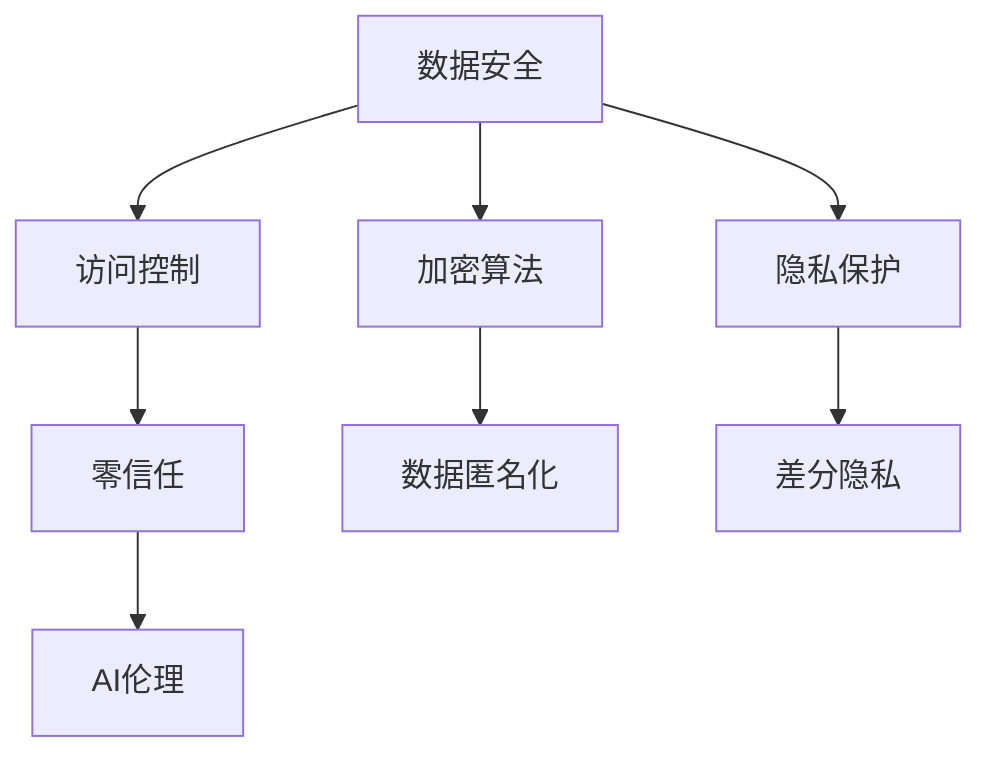

                 

# AI创业公司的数据安全与隐私保护

> 关键词：数据安全,隐私保护,加密算法,访问控制,零信任,人工智能伦理

## 1. 背景介绍

### 1.1 问题由来

在当今数字化时代，数据是企业最重要的资产之一，同时也是人工智能（AI）创业公司成长的核心驱动力。AI系统通常依赖大量的数据进行训练和学习，数据安全与隐私保护已成为制约企业发展的关键因素。然而，AI技术的复杂性和多样性使得数据安全与隐私保护面临前所未有的挑战。

## 2. 核心概念与联系

### 2.1 核心概念概述

为了更全面地理解和应对AI创业公司面临的数据安全与隐私保护问题，我们需要先定义几个核心概念：

- **数据安全**：指保护数据不被未授权访问、泄露、篡改或破坏。包括但不限于加密、访问控制等技术手段。
- **隐私保护**：确保个人信息的保密性，防止隐私数据被滥用。例如数据匿名化、差分隐私等。
- **加密算法**：一种将数据转换为无法直接解读的格式，从而保护数据安全的技术。例如对称加密、非对称加密等。
- **访问控制**：管理用户对数据的访问权限，确保只有授权人员可以访问敏感数据。例如基于角色的访问控制（RBAC）、基于属性的访问控制（ABAC）等。
- **零信任**：不假设内部网络或外部网络是可信的，每一个访问请求都需要经过严格验证。
- **人工智能伦理**：在AI技术应用中，确保道德、公平、透明和责任，避免伦理风险。

这些概念之间存在着紧密的联系，共同构成了AI创业公司数据安全与隐私保护的基础框架。

### 2.2 核心概念原理和架构的 Mermaid 流程图



该流程图展示了数据安全与隐私保护的基本架构，各个组件之间相互协作，共同维护AI创业公司数据的安全和隐私。

## 3. 核心算法原理 & 具体操作步骤

### 3.1 算法原理概述

在AI创业公司中，数据安全与隐私保护通常依赖于多种技术手段，包括但不限于加密、访问控制、隐私保护等。这些技术手段在算法层面上有其共通性，例如均基于对数据的某种处理或转换来实现安全或隐私保护。

### 3.2 算法步骤详解

#### 3.2.1 加密算法

- **对称加密**：使用同一个密钥对数据进行加密和解密。例如AES算法。其步骤包括：
  1. 生成或选择密钥。
  2. 使用密钥对数据进行加密。
  3. 将加密后的数据传输或存储。
  4. 使用密钥对加密数据进行解密。

- **非对称加密**：使用公钥加密、私钥解密。例如RSA算法。其步骤包括：
  1. 生成一对公钥和私钥。
  2. 使用公钥对数据进行加密。
  3. 将加密后的数据传输或存储。
  4. 使用私钥对加密数据进行解密。

- **哈希算法**：将数据转换为固定长度的哈希值。例如SHA-256算法。其步骤包括：
  1. 选择哈希算法。
  2. 将数据转换为哈希值。
  3. 存储哈希值。
  4. 验证数据完整性时，将数据转换为哈希值并与存储的哈希值比较。

#### 3.2.2 访问控制

- **基于角色的访问控制（RBAC）**：根据用户角色分配访问权限。例如，管理员可以访问所有数据，而普通用户只能访问部分数据。其步骤包括：
  1. 定义角色。
  2. 为每个角色分配权限。
  3. 用户登录时，系统根据其角色分配访问权限。

- **基于属性的访问控制（ABAC）**：根据用户属性和资源属性分配访问权限。例如，根据用户所在部门或访问资源类型分配权限。其步骤包括：
  1. 定义属性。
  2. 为每个属性分配权限。
  3. 用户登录时，系统根据其属性和资源属性分配访问权限。

#### 3.2.3 隐私保护

- **数据匿名化**：通过修改数据，使其无法直接识别出个人身份。例如，使用K-匿名性、L-多样性等方法。其步骤包括：
  1. 定义匿名化方法。
  2. 对数据进行匿名化处理。
  3. 存储匿名化后的数据。

- **差分隐私**：在数据分析或处理过程中，加入噪声以保护数据隐私。例如，使用Laplace机制、高斯机制等方法。其步骤包括：
  1. 定义差分隐私参数。
  2. 对数据加入噪声。
  3. 存储差分隐私后的数据。

### 3.3 算法优缺点

#### 3.3.1 加密算法

**优点**：
- 保护数据安全，防止未授权访问。
- 技术成熟，应用广泛。

**缺点**：
- 密钥管理和分发复杂，容易泄露。
- 加密和解密过程消耗计算资源，影响性能。

#### 3.3.2 访问控制

**优点**：
- 明确用户权限，防止越权访问。
- 易于实现和管理。

**缺点**：
- 权限分配复杂，需要定期维护。
- 用户和权限管理容易出错，存在安全漏洞。

#### 3.3.3 隐私保护

**优点**：
- 保护数据隐私，防止滥用。
- 技术成熟，应用广泛。

**缺点**：
- 影响数据质量，可能引入噪声。
- 处理复杂，需要专业知识。

### 3.4 算法应用领域

数据安全与隐私保护技术在AI创业公司中具有广泛的应用场景，包括但不限于以下领域：

- **云计算**：确保云计算平台上的数据安全，防止数据泄露和篡改。
- **物联网（IoT）**：保护物联网设备收集的数据，防止设备被攻击或数据被窃取。
- **移动应用**：保护移动应用中用户数据的安全，防止数据泄露和滥用。
- **金融科技**：保护金融交易数据，防止欺诈和数据泄露。
- **医疗健康**：保护患者数据隐私，防止数据滥用和泄露。

## 4. 数学模型和公式 & 详细讲解 & 举例说明

### 4.1 数学模型构建

本节将使用数学语言对AI创业公司数据安全与隐私保护的技术手段进行严格描述。

#### 4.1.1 加密算法

以AES算法为例，其数学模型可以描述为：
$$
C = E_k(P) = \text{SubBytes}(\text{ShiftRows}(\text{MixColumns}(\text{AddRoundKey}(P, k))))
$$
其中，$C$为加密后的数据，$P$为明文数据，$k$为密钥。

#### 4.1.2 访问控制

以RBAC为例，其数学模型可以描述为：
$$
\text{Access} = \text{F}(\underline{R}, \underline{P}, \underline{C}, \underline{A})
$$
其中，$\underline{R}$为用户角色，$\underline{P}$为用户属性，$\underline{C}$为资源属性，$\underline{A}$为访问权限。

#### 4.1.3 隐私保护

以差分隐私为例，其数学模型可以描述为：
$$
D' = D + \epsilon
$$
其中，$D$为原始数据，$D'$为差分隐私处理后的数据，$\epsilon$为加入的噪声。

### 4.2 公式推导过程

#### 4.2.1 加密算法

AES算法的具体推导过程如下：
1. 初始化轮密钥。
2. 对明文数据进行字节代换。
3. 对明文数据进行行移位。
4. 对明文数据进行列混淆。
5. 对明文数据和轮密钥进行异或操作。

#### 4.2.2 访问控制

RBAC的具体推导过程如下：
1. 定义角色和权限。
2. 根据用户角色分配访问权限。
3. 根据用户角色和权限判断访问请求是否允许。

#### 4.2.3 隐私保护

差分隐私的具体推导过程如下：
1. 定义差分隐私参数。
2. 对原始数据加入噪声。
3. 存储差分隐私后的数据。

### 4.3 案例分析与讲解

#### 4.3.1 案例一：数据加密

假设公司需要将用户数据加密传输，可以使用AES算法。具体步骤如下：
1. 生成AES密钥。
2. 对用户数据进行AES加密。
3. 将加密后的数据传输。
4. 接收方使用相同密钥对数据解密。

#### 4.3.2 案例二：访问控制

假设公司需要保护用户登录数据，可以使用RBAC。具体步骤如下：
1. 定义管理员和普通用户角色。
2. 为管理员和普通用户分配相应的访问权限。
3. 用户登录时，系统根据用户角色分配访问权限。

#### 4.3.3 案例三：隐私保护

假设公司需要保护用户行为数据，可以使用差分隐私。具体步骤如下：
1. 定义差分隐私参数。
2. 对用户行为数据加入噪声。
3. 存储差分隐私后的数据。

## 5. 项目实践：代码实例和详细解释说明

### 5.1 开发环境搭建

在开发AI创业公司数据安全与隐私保护项目时，通常需要使用Python语言，并借助一些开源工具和库，如PyTorch、TensorFlow等。

### 5.2 源代码详细实现

以下是一个使用Python实现对称加密的示例代码：

```python
from Crypto.Cipher import AES

def encrypt(data, key):
    cipher = AES.new(key, AES.MODE_ECB)
    return cipher.encrypt(pad(data.encode(), AES.block_size))

def decrypt(ciphertext, key):
    cipher = AES.new(key, AES.MODE_ECB)
    return unpad(cipher.decrypt(ciphertext), AES.block_size).decode()

def pad(data, blocksize):
    padding = blocksize - len(data) % blocksize
    return data + chr(padding) * padding

def unpad(data, blocksize):
    padding = ord(data[-1])
    return data[:-padding]
```

### 5.3 代码解读与分析

上述代码实现了一个基本的对称加密算法，包括加密和解密两个函数。使用Crypto库中的AES算法，对输入数据进行加密和解密操作。在加密时，使用ECB模式，并对数据进行字节补齐。解密时，同样使用ECB模式，并去除字节补齐部分。

## 6. 实际应用场景

### 6.1 云计算

在云计算环境中，数据安全与隐私保护至关重要。通过使用加密算法、访问控制和隐私保护技术，可以有效保护云平台上的数据。例如，使用AES算法加密存储数据，使用RBAC控制数据访问权限，使用差分隐私保护用户数据。

### 6.2 物联网（IoT）

物联网设备通常面临多种安全威胁，包括设备被攻击、数据泄露等。通过使用加密算法、访问控制和隐私保护技术，可以有效保护物联网设备上的数据。例如，使用AES算法加密设备传输的数据，使用ABAC控制设备访问权限，使用差分隐私保护用户行为数据。

### 6.3 移动应用

移动应用中的数据安全与隐私保护需要特别注意。通过使用加密算法、访问控制和隐私保护技术，可以有效保护移动应用中的用户数据。例如，使用AES算法加密用户数据，使用RBAC控制用户访问权限，使用差分隐私保护用户行为数据。

### 6.4 未来应用展望

随着技术的发展，数据安全与隐私保护将变得更加重要和复杂。未来，可能出现更加先进的加密算法、访问控制和隐私保护技术，帮助AI创业公司更好地保护数据安全与隐私。

## 7. 工具和资源推荐

### 7.1 学习资源推荐

为了帮助开发者掌握数据安全与隐私保护技术，以下是一些推荐的学习资源：

- 《网络安全基础》：介绍网络安全的基本概念和常见技术。
- 《数据隐私保护技术》：介绍数据隐私保护的各种技术和方法。
- 《加密算法原理与实现》：介绍各种加密算法的原理和实现方法。
- 《访问控制技术》：介绍访问控制的各种技术和方法。

### 7.2 开发工具推荐

在开发数据安全与隐私保护项目时，通常需要使用一些开源工具和库，如：

- PyTorch：深度学习框架，适用于加密算法、访问控制和隐私保护技术的应用。
- TensorFlow：深度学习框架，适用于加密算法、访问控制和隐私保护技术的应用。
- Hadoop：大数据处理平台，适用于处理大规模数据集。
- Kafka：消息队列系统，适用于数据传输和存储。

### 7.3 相关论文推荐

为了深入理解数据安全与隐私保护技术，以下是一些推荐的相关论文：

- "A Survey of Privacy-Preserving Techniques in Cloud Computing"：介绍云平台上的数据隐私保护技术。
- "Practical and Efficient Encryption for Big Data"：介绍大数据环境下的加密技术。
- "Access Control Models and Mechanisms"：介绍访问控制的各种技术和方法。
- "Differential Privacy"：介绍差分隐私的基本概念和实现方法。

## 8. 总结：未来发展趋势与挑战

### 8.1 研究成果总结

数据安全与隐私保护技术在AI创业公司中具有重要应用价值。本文详细介绍了加密算法、访问控制和隐私保护等核心概念和实现方法，通过理论分析和实践示例，帮助读者深入理解数据安全与隐私保护技术。

### 8.2 未来发展趋势

随着技术的发展，数据安全与隐私保护技术将更加先进和复杂。未来，可能出现更加先进的加密算法、访问控制和隐私保护技术，帮助AI创业公司更好地保护数据安全与隐私。

### 8.3 面临的挑战

尽管数据安全与隐私保护技术在AI创业公司中具有重要应用价值，但仍面临诸多挑战。以下是一些主要的挑战：

- 技术复杂性高：数据安全与隐私保护技术涉及多种技术手段，需要较高的专业知识和技能。
- 实施成本高：数据安全与隐私保护技术的实施需要较高的资源投入，包括硬件、软件、人力等。
- 技术更新快：数据安全与隐私保护技术不断更新，需要持续跟踪和更新。

### 8.4 研究展望

未来，数据安全与隐私保护技术需要在以下几个方面进行深入研究：

- 自动化和智能化：开发更加自动化和智能化的数据安全与隐私保护系统，减少人工干预。
- 多层次防护：构建多层次的数据安全与隐私保护体系，提升防护能力。
- 跨领域融合：将数据安全与隐私保护技术与AI、区块链等技术进行融合，提升整体防护水平。

## 9. 附录：常见问题与解答

**Q1：数据安全与隐私保护技术对AI创业公司有哪些具体应用？**

A：数据安全与隐私保护技术在AI创业公司中有多种具体应用，包括但不限于以下领域：

- 保护用户数据：防止数据泄露和滥用。
- 防止设备攻击：保护物联网设备上的数据。
- 防止数据篡改：防止数据在传输和存储过程中被篡改。

**Q2：如何选择合适的加密算法？**

A：选择合适的加密算法需要考虑多个因素，包括但不限于：

- 数据类型：不同类型的数据需要不同的加密算法。
- 加密强度：不同的加密算法提供不同级别的加密强度。
- 性能需求：不同的加密算法对计算资源的需求不同。

**Q3：如何实现访问控制？**

A：实现访问控制需要定义角色和权限，并根据角色和权限控制数据的访问。具体实现可以使用RBAC或ABAC等方法。

**Q4：如何保护用户隐私？**

A：保护用户隐私需要采取多种技术手段，包括但不限于数据匿名化、差分隐私等。具体实现需要根据具体场景选择合适的方法。

**Q5：如何检测数据泄露？**

A：检测数据泄露需要使用数据监控和审计工具，对数据访问和操作进行记录和分析，及时发现异常行为。

作者：禅与计算机程序设计艺术 / Zen and the Art of Computer Programming

