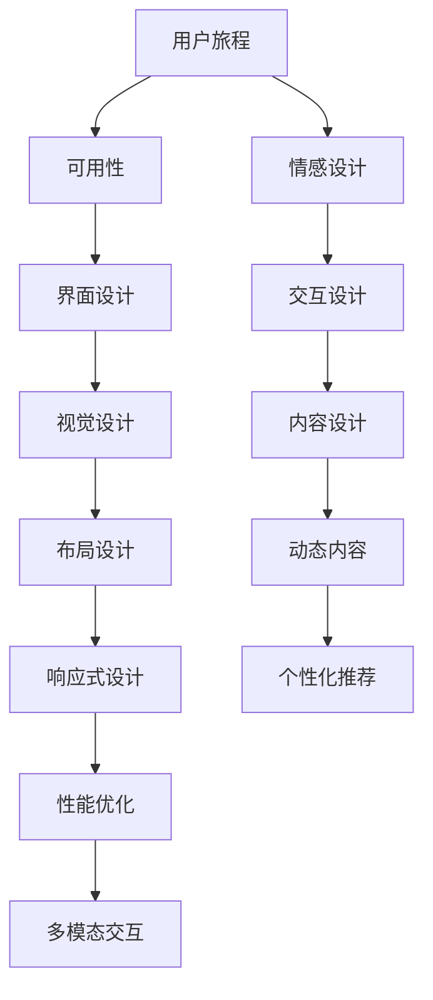

                 

# AI创业公司的用户体验优化策略

在快速发展的科技时代，用户体验(UX)已成为了企业竞争的重要考量因素。对于AI创业公司而言，用户体验优化的重要性尤为显著。本文将详细探讨AI创业公司如何在用户体验方面进行优化，涵盖理论基础、实践策略和未来展望，旨在为业界提供有价值的见解和参考。

## 1. 背景介绍

### 1.1 问题由来
随着人工智能技术的成熟，AI创业公司如雨后春笋般涌现。这些公司不仅需要先进的算法和技术，还需要卓越的用户体验来吸引用户并提升用户满意度。然而，技术迭代快速，用户体验的优化往往滞后于产品开发，导致用户流失、市场竞争不足等问题。因此，如何优化用户体验，成为AI创业公司必须面对的挑战。

### 1.2 问题核心关键点
在AI创业公司中，用户体验优化涉及以下几个关键点：
- **用户需求洞察**：深入理解用户需求，通过数据分析、用户反馈等手段获取有价值的洞察。
- **产品设计**：设计简洁易用、高互动性的界面，以提高用户满意度。
- **个性化推荐**：根据用户行为和偏好，提供定制化的内容和推荐，提升用户体验。
- **性能优化**：确保产品流畅稳定，减少加载时间、延迟等问题。
- **多模态交互**：结合语音、图像、触觉等多种交互方式，提升用户体验的多样性。

### 1.3 问题研究意义
优化用户体验不仅能提升用户满意度，还能增强用户粘性，提高用户留存率，最终促进企业收入增长。良好的用户体验还能增强品牌形象，提升市场竞争力。因此，用户体验优化对于AI创业公司至关重要。

## 2. 核心概念与联系

### 2.1 核心概念概述

在用户体验优化的过程中，涉及多个核心概念，包括用户旅程、可用性、情感设计等。这些概念之间的关系可以通过以下Mermaid流程图进行展示：



这个流程图展示了用户体验优化的主要环节及其相互关系：

1. **用户旅程**：从用户接触产品到最终离开的整个过程，涉及多个触点和环节，通过用户旅程分析优化每个环节的用户体验。
2. **可用性**：界面设计是否直观易用，直接影响用户的使用效率和满意度。
3. **情感设计**：通过视觉、交互、内容等多方面设计，触动用户的情感，提升用户黏性。
4. **界面设计**：界面布局、颜色、字体等设计要素，直接影响用户的视觉体验。
5. **交互设计**：包括按钮、链接、表单等交互元素的设计，提高用户操作效率。
6. **视觉设计**：通过色彩、图标等视觉元素，提升用户的审美体验。
7. **内容设计**：高质量的文本、图片、视频等内容的呈现，丰富用户体验。
8. **布局设计**：合理的页面布局，提升信息传达的效率。
9. **动态内容**：通过动态效果，如滚动动画、加载动画，提升用户等待体验。
10. **响应式设计**：不同设备上的适配性设计，确保跨平台的用户体验一致性。
11. **个性化推荐**：根据用户行为和偏好，提供定制化的内容，提升用户满意度。
12. **性能优化**：提升产品的加载速度、响应时间等性能指标，减少用户等待时间。
13. **多模态交互**：结合语音、图像、触觉等多种交互方式，提升用户体验的多样性。

### 2.2 核心概念原理和架构

用户体验优化的核心原理是心理学中的用户需求和行为规律。通过理解用户的行为模式、心理预期，设计符合用户习惯的产品功能，提升用户满意度和忠诚度。

具体来说，用户体验优化涉及以下几个关键架构：

1. **用户界面(UI)设计**：用户界面是用户与产品交互的主要媒介，其设计直接影响用户的体验。UI设计包括布局、颜色、字体、按钮等元素的设计。

2. **用户体验(UI)设计**：用户体验设计强调以用户为中心的设计理念，通过交互流程、反馈机制等提升用户的整体体验。

3. **可用性测试**：通过用户测试，收集用户对产品的反馈，发现并优化设计中的问题。

4. **A/B测试**：通过对比不同设计方案，选择最优方案，提升产品效果。

5. **数据驱动**：通过收集用户数据，进行数据分析，发现用户行为规律，指导产品优化。

## 3. 核心算法原理 & 具体操作步骤

### 3.1 算法原理概述

在用户体验优化中，数据驱动的设计方法是最为常见且有效的策略。通过收集和分析用户行为数据，了解用户需求和行为规律，指导产品设计优化。

用户体验优化的核心算法包括：
- **用户行为分析**：分析用户的操作轨迹、停留时间等行为数据，发现用户痛点和需求。
- **A/B测试算法**：通过对比不同设计方案，评估其效果，选择最优方案。
- **机器学习算法**：通过机器学习算法，预测用户行为，个性化推荐内容。

### 3.2 算法步骤详解

用户体验优化的具体步骤如下：

1. **数据收集**：通过用户在产品中的行为数据、日志数据等，收集用户信息。

2. **数据处理**：对收集的数据进行清洗、处理，提取有用的信息。

3. **数据分析**：使用统计学、机器学习等方法，对用户数据进行分析，识别用户行为模式。

4. **设计优化**：根据数据分析结果，优化产品设计，包括界面、交互、内容等。

5. **A/B测试**：设计不同的产品方案，进行A/B测试，评估用户反应。

6. **迭代优化**：根据A/B测试结果，进一步优化产品设计，重复进行数据收集和分析。

7. **用户体验评估**：通过用户反馈、满意度调查等方式，评估产品用户体验。

### 3.3 算法优缺点

数据驱动的用户体验优化具有以下优点：
- **科学依据**：通过数据分析，优化设计更加科学、客观。
- **快速迭代**：可以频繁进行A/B测试，快速迭代产品设计。
- **可量化**：通过数据可以量化评估用户满意度，便于优化。

但其缺点同样明显：
- **数据获取成本高**：需要大量的用户数据，获取成本高。
- **用户隐私问题**：用户数据涉及隐私，数据收集和使用需要谨慎处理。
- **模型复杂性**：数据分析和优化模型需要较高的技术门槛。

### 3.4 算法应用领域

用户体验优化的算法和策略在多个领域得到应用，包括：

1. **电商购物**：通过数据分析个性化推荐商品，提高用户购物体验。
2. **内容推荐**：根据用户兴趣和行为，推荐相关内容，提升用户满意度。
3. **移动应用**：通过用户行为分析，优化界面和交互设计，提升用户粘性。
4. **游戏体验**：通过数据分析和A/B测试，优化游戏界面和玩法，提升用户留存率。
5. **社交平台**：通过个性化推荐和情感设计，提升用户社交体验。

## 4. 数学模型和公式 & 详细讲解

### 4.1 数学模型构建

用户体验优化的数学模型主要涉及以下几个方面：

1. **用户行为模型**：通过数学模型描述用户的行为规律，预测用户未来行为。
2. **推荐系统模型**：通过数学模型推荐用户感兴趣的内容，提升用户满意度。
3. **A/B测试模型**：通过数学模型评估不同设计方案的效果，选择最优方案。

### 4.2 公式推导过程

以推荐系统模型为例，常用的推荐算法包括协同过滤、基于内容的推荐、矩阵分解等。以下是基于协同过滤的推荐算法公式：

$$
\hat{r}_{ui} = \frac{1}{1+\exp(-\left(\theta_{ui} - \theta_{iu}\right)} = \frac{1}{1+\exp(-\left(\theta_{ui} - \theta_{iu}\right)}
$$

其中，$r_{ui}$ 为预测用户 $u$ 对项目 $i$ 的评分，$\theta_{ui}$ 为用户 $u$ 对项目 $i$ 的评分预测值，$\theta_{iu}$ 为项目 $i$ 的评分预测值。该公式通过计算预测评分与实际评分之间的差异，预测用户对项目的评分。

### 4.3 案例分析与讲解

以电商平台为例，其推荐系统可以通过协同过滤算法实现。首先收集用户历史浏览、购买数据，构建用户-物品评分矩阵。然后利用协同过滤算法，预测用户对未购买物品的评分，推荐用户感兴趣的商品。

具体步骤如下：

1. **数据收集**：收集用户浏览、购买数据，构建用户-物品评分矩阵。
2. **协同过滤**：使用协同过滤算法，预测用户对未购买物品的评分。
3. **推荐生成**：根据预测评分，生成推荐商品列表。
4. **用户反馈**：收集用户对推荐商品的反应，进行后续优化。

## 5. 项目实践：代码实例和详细解释说明

### 5.1 开发环境搭建

1. **安装Python和相关库**：
   ```bash
   sudo apt-get update
   sudo apt-get install python3-pip
   pip3 install numpy pandas scikit-learn scipy matplotlib seaborn
   ```

2. **搭建开发环境**：
   ```bash
   virtualenv env
   source env/bin/activate
   ```

3. **安装推荐系统库**：
   ```bash
   pip install lightfm
   ```

### 5.2 源代码详细实现

以下是推荐系统的代码实现：

```python
import numpy as np
from lightfm.datasets import fetch_movielens
from lightfm import LightFM

# 数据加载
data = fetch_movielens()
train, test = data['train'], data['test']
users, items = train['users'], train['items']

# 模型训练
model = LightFM(no_factors=10, learning_rate=0.05, loss='bpr')
model.fit(train, epochs=10)

# 预测推荐
predictions = model.predict(test)

# 输出推荐结果
for user, item, score in zip(test['users'], test['items'], predictions):
    print(f"User {user} prefers item {item} with score {score}")
```

### 5.3 代码解读与分析

以上代码展示了如何使用LightFM库进行协同过滤推荐系统的构建。具体步骤如下：

1. **数据加载**：使用LightFM库内置的movielens数据集。
2. **模型训练**：构建LightFM模型，设置因子数、学习率、损失函数等参数，训练模型。
3. **预测推荐**：使用训练好的模型对测试集进行预测。
4. **输出结果**：根据预测结果输出推荐商品。

## 6. 实际应用场景

### 6.1 电商购物

电商平台的推荐系统通过用户行为数据，个性化推荐商品，提升用户体验。用户通过浏览、购买商品生成数据，平台通过这些数据训练推荐模型，预测用户对未购买商品的评分，生成推荐列表。用户可以查看推荐商品，并进行购买，形成良性循环。

### 6.2 内容推荐

内容平台如Netflix、YouTube等，通过用户历史观看数据，个性化推荐影片和视频。推荐系统通过协同过滤、基于内容的推荐等方法，预测用户对未观看内容的评分，生成推荐列表。用户可以通过点击推荐内容，发现新内容，增加平台粘性。

### 6.3 移动应用

移动应用如滴滴出行、美团外卖等，通过用户行为数据，优化界面和交互设计，提升用户体验。例如，滴滴出行通过用户历史打车行为数据，优化打车界面，提升用户打车效率。美团外卖通过用户历史点餐数据，优化点餐界面，提升用户点餐体验。

### 6.4 游戏体验

游戏平台如王者荣耀、英雄联盟等，通过用户行为数据，优化游戏界面和玩法，提升用户留存率。例如，王者荣耀通过用户历史游戏数据，优化游戏界面，提升游戏体验。英雄联盟通过用户历史游戏数据，优化游戏玩法，提升用户留存率。

### 6.5 社交平台

社交平台如微信、微博等，通过个性化推荐和情感设计，提升用户社交体验。例如，微信通过个性化推荐好友，提升用户社交体验。微博通过情感分析，推荐相关话题，提升用户互动率。

## 7. 工具和资源推荐

### 7.1 学习资源推荐

1. **《用户体验设计》课程**：由斯坦福大学开设，涵盖用户体验设计的各个方面，适合入门学习。
2. **《数据驱动设计》课程**：由Google UX团队开设，强调数据在用户体验设计中的应用。
3. **《用户体验设计指南》书籍**：详细介绍了用户体验设计的原则和方法，适合系统学习。
4. **《推荐系统》书籍**：介绍了推荐系统的基本原理和算法，适合技术研究。
5. **《用户体验优化案例》书籍**：通过案例分析，讲解用户体验优化的实际应用。

### 7.2 开发工具推荐

1. **JIRA**：项目管理工具，支持敏捷开发和用户体验优化。
2. **UXPin**：原型设计工具，支持用户研究和用户体验优化。
3. **Sketch**：UI设计工具，支持快速设计原型和界面。
4. **InVision**：原型设计和用户体验优化工具，支持用户研究和测试。
5. **A/B测试工具**：如Optimizely、Google Optimize，支持快速进行A/B测试。

### 7.3 相关论文推荐

1. **《数据驱动的设计》论文**：详细介绍了数据在用户体验设计中的应用。
2. **《推荐系统基础》论文**：介绍了推荐系统的基本原理和算法。
3. **《用户体验优化方法》论文**：介绍了用户体验优化的各种方法。
4. **《情感设计与用户体验》论文**：介绍了情感设计在用户体验优化中的应用。
5. **《多模态交互设计》论文**：介绍了多模态交互在用户体验优化中的应用。

## 8. 总结：未来发展趋势与挑战

### 8.1 总结

本文系统介绍了AI创业公司如何通过数据驱动的设计方法优化用户体验，涵盖了用户体验优化的核心概念、关键步骤、具体算法和实际应用。通过系统梳理，帮助读者深入理解用户体验优化的原理和实践，为实际应用提供参考。

### 8.2 未来发展趋势

未来，用户体验优化将呈现以下发展趋势：

1. **数据驱动的持续优化**：通过持续收集和分析用户数据，实现产品的不断优化。
2. **智能推荐系统**：通过人工智能技术，实现更加精准和个性化的推荐，提升用户满意度。
3. **多模态交互**：结合语音、图像、触觉等多种交互方式，提升用户体验的多样性。
4. **情感计算**：通过情感计算技术，提升用户的情感体验，增加用户黏性。
5. **隐私保护**：加强用户数据隐私保护，确保用户数据的安全性和合法性。

### 8.3 面临的挑战

尽管用户体验优化带来了诸多益处，但在实际应用中仍面临以下挑战：

1. **数据获取难度**：获取高质量的用户数据难度较大，影响用户体验优化的效果。
2. **数据隐私问题**：用户数据涉及隐私，数据收集和使用需要谨慎处理。
3. **算法复杂性**：用户体验优化的算法和技术门槛较高，需要较强的技术背景。
4. **用户体验主观性**：用户体验的主观性和多变性，增加了优化的难度。
5. **跨平台一致性**：不同平台上的用户体验一致性问题，需要系统性的解决。

### 8.4 研究展望

未来，用户体验优化的研究将集中在以下几个方面：

1. **多模态交互优化**：结合语音、图像、触觉等多种交互方式，提升用户体验的多样性。
2. **情感计算的融合**：通过情感计算技术，提升用户的情感体验，增加用户黏性。
3. **跨平台一致性**：通过统一的UI设计规范，确保不同平台上的用户体验一致性。
4. **隐私保护的创新**：加强用户数据隐私保护，确保用户数据的安全性和合法性。
5. **算法效率的提升**：通过算法优化，提升用户体验优化的效率和效果。

## 9. 附录：常见问题与解答

**Q1：用户体验优化的核心是什么？**

A: 用户体验优化的核心是通过数据驱动的设计方法，深入理解用户需求和行为规律，优化产品设计，提升用户满意度和忠诚度。

**Q2：用户体验优化的常用算法有哪些？**

A: 用户体验优化的常用算法包括用户行为分析、A/B测试、协同过滤、基于内容的推荐、矩阵分解等。

**Q3：用户体验优化中如何保证数据隐私？**

A: 在用户体验优化中，需要严格遵守数据隐私保护法规，如GDPR、CCPA等，确保用户数据的合法性和安全性。同时，通过匿名化、去标识化等技术手段，保护用户隐私。

**Q4：用户体验优化与产品开发的关系是什么？**

A: 用户体验优化是产品开发的重要环节，通过优化用户体验，提升用户满意度，从而增加用户留存率，促进产品成功。

**Q5：用户体验优化中的多模态交互如何实现？**

A: 多模态交互的实现需要结合语音识别、图像处理、触觉反馈等技术，通过多个交互渠道，提升用户体验的多样性。

---

作者：禅与计算机程序设计艺术 / Zen and the Art of Computer Programming

