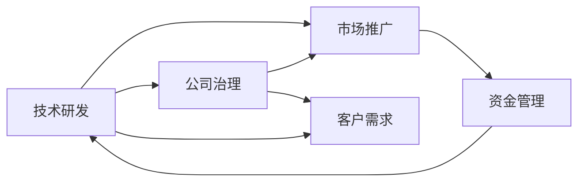

                 

# AI创业的风险管理：Lepton AI的危机应对

在科技飞速发展的今天，人工智能（AI）已经渗透到各行各业，成为推动社会进步的重要力量。然而，AI创业在带来巨大机遇的同时，也面临着诸多风险。Lepton AI的故事，便是一个典型的案例，通过深入分析其危机应对策略，希望能为后来的AI创业者提供一些借鉴和思考。

## 1. 背景介绍

### 1.1 行业背景
近年来，AI技术的迅猛发展使得越来越多的创业者纷纷涌入AI领域，希望能通过技术创新获得市场成功。然而，AI创业并非易事，从研发到应用，每一步都需要谨慎考虑和科学管理。Lepton AI就是其中的一个例子。

Lepton AI成立于2018年，是一家专注于AI语音识别技术的公司。创始团队来自知名学府，拥有丰富的科研背景。他们希望能利用先进的深度学习技术，解决智能家居、医疗健康等领域的实际问题，提供更精准、更智能的解决方案。然而，在技术研发和市场推广过程中，Lepton AI遭遇了诸多困难和挑战，最终导致公司陷入危机。

### 1.2 核心问题
Lepton AI的危机源于多个方面，包括技术研发、市场推广、管理决策等。

**技术问题：** 在AI语音识别的核心算法上，Lepton AI缺乏独特性和创新性，未能形成技术壁垒。尽管团队在技术上有一定的积累，但与同行相比，缺乏突破性进展。

**市场问题：** 智能家居和医疗健康市场虽然潜力巨大，但竞争激烈。Lepton AI在推广过程中未能有效识别市场需求，缺乏与客户的深度互动，导致产品市场接受度低。

**管理问题：** 公司治理结构不健全，内部管理混乱。创始团队过度依赖CEO，导致决策集中、缺乏团队协作，影响公司的整体发展。

**资金问题：** 由于技术未达预期、市场推广效果不佳，Lepton AI的融资逐渐吃紧，资金链出现问题，最终无法继续运营。

## 2. 核心概念与联系

### 2.1 核心概念概述

为更好地理解Lepton AI的危机应对，我们需要理解几个关键概念：

- **技术研发：** 指利用AI技术解决实际问题的过程，包括算法设计、模型训练、数据集构建等。
- **市场推广：** 通过多种渠道和方式，将产品和服务推广给目标客户的过程。
- **公司治理：** 指公司内部的管理结构和决策机制，包括董事会、CEO、股东等角色和职责的划分。
- **资金管理：** 指如何有效管理和利用公司的资金，确保财务健康。

这些概念之间有着密切的联系。技术研发是市场推广和公司治理的基础，资金管理则保证这些工作的持续进行。只有各环节协调配合，才能确保AI创业项目的成功。

### 2.2 核心概念原理和架构的 Mermaid 流程图



## 3. 核心算法原理 & 具体操作步骤

### 3.1 算法原理概述

Lepton AI的危机应对策略主要分为三个方面：技术改进、市场重塑和管理优化。

**技术改进：** 重新审视核心算法，引入新的深度学习框架和模型结构，提升技术创新性和竞争力。

**市场重塑：** 通过深入了解市场需求，重新定义产品功能和价值，提升市场接受度。

**管理优化：** 建立健全的公司治理结构，提高团队协作效率，提升决策科学性。

### 3.2 算法步骤详解

#### 技术改进

**Step 1：技术调研**
- 成立技术团队，全面调研当前AI语音识别的最新研究成果。
- 分析Lepton AI的核心算法与行业标杆的差距。

**Step 2：算法优化**
- 引入最新的深度学习框架（如TensorFlow、PyTorch），优化模型结构。
- 引入新的算法（如Transformer、BERT），提升模型精度和效率。

**Step 3：实验验证**
- 在内部数据集和公共数据集上验证新算法的表现。
- 与同行进行对比测试，确保技术领先性。

#### 市场重塑

**Step 1：市场需求分析**
- 进行市场调研，了解目标客户的需求和使用场景。
- 与潜在客户进行深度访谈，获取反馈和建议。

**Step 2：产品迭代**
- 根据市场需求调整产品功能，增加个性化和用户体验。
- 进行小规模试点，验证市场反应。

**Step 3：推广策略**
- 制定新的市场推广策略，包括线上线下多渠道推广。
- 引入KOL和行业专家，提升品牌影响力和产品知名度。

#### 管理优化

**Step 1：公司治理优化**
- 重新定义公司治理结构，建立董事会、CEO、CTO等角色分工明确、职责清晰的决策机制。
- 引入外部顾问和专业管理团队，提升管理水平。

**Step 2：团队协作**
- 建立团队合作机制，定期召开技术和管理双周会，分享进展和讨论问题。
- 引入OKR（目标与关键结果法），明确团队目标和任务。

**Step 3：资源优化**
- 优化资源配置，确保研发、市场和运营的平衡。
- 加强财务管理和成本控制，确保资金链健康。

### 3.3 算法优缺点

**技术改进**
- **优点：** 提升技术创新性和竞争力，满足市场需求。
- **缺点：** 需要大量时间和资源投入，存在技术失败的风险。

**市场重塑**
- **优点：** 快速响应市场变化，提升产品接受度。
- **缺点：** 市场调研和产品迭代需要时间，短期效果不明显。

**管理优化**
- **优点：** 提升公司治理水平和团队协作效率，确保决策科学。
- **缺点：** 需要引入外部管理团队和顾问，增加管理成本。

### 3.4 算法应用领域

基于Lepton AI的危机应对策略，AI创业者可以参考以下几个应用领域：

- **技术研发：** 适用于任何AI创业项目，提升技术创新性和竞争力。
- **市场推广：** 适用于智能家居、医疗健康等市场需求强烈的领域。
- **公司治理：** 适用于任何初创公司，提升治理水平和团队协作效率。

## 4. 数学模型和公式 & 详细讲解 & 举例说明

### 4.1 数学模型构建

在Lepton AI的危机应对中，数学模型主要涉及以下几个方面：

**技术模型：** 涉及深度学习模型的设计和训练，如神经网络、卷积神经网络（CNN）、循环神经网络（RNN）等。

**市场模型：** 涉及市场分析和预测，如回归模型、决策树、随机森林等。

**管理模型：** 涉及公司治理和团队协作的优化，如OKR、项目管理等。

### 4.2 公式推导过程

#### 技术模型

假设Lepton AI的核心算法为 $f(x)$，其中 $x$ 为输入数据，$f(x)$ 为输出。其目标函数为 $J$，用于衡量模型的预测精度。

- **损失函数**：常见的损失函数包括均方误差（MSE）、交叉熵（Cross Entropy）等。
- **优化算法**：常见的优化算法包括梯度下降（Gradient Descent）、Adam等。
- **模型训练**：通过优化算法，最小化损失函数，更新模型参数 $\theta$，使得 $f(x)$ 的预测结果更加准确。

#### 市场模型

假设市场需求为 $D(t)$，其中 $t$ 为时间。其目标为最大化公司的收入和利润。

- **市场分析**：通过回归模型、决策树等方法，预测市场需求变化。
- **市场推广**：通过A/B测试等方法，验证推广策略的有效性。

#### 管理模型

假设公司的决策流程为 $P$，其中 $P$ 为决策链。其目标为提高决策效率和准确性。

- **OKR设置**：通过OKR方法，设定目标和关键结果，定期评估进展。
- **团队协作**：通过项目管理工具（如Jira），跟踪任务和资源分配。

### 4.3 案例分析与讲解

以Lepton AI的技术改进为例，假设其原始算法为 $f(x) = \sum_{i=1}^{n} w_i \cdot x_i$，其中 $x_i$ 为输入特征，$w_i$ 为权重。通过引入Transformer模型，优化后的算法变为 $f(x) = \text{Transformer}(\mathbf{X})$，其中 $\mathbf{X}$ 为输入矩阵。

- **Transformer模型**：Transformer模型是一种基于自注意力机制的深度学习模型，能够更好地捕捉输入数据中的长距离依赖关系。
- **模型优化**：通过引入Transformer模型，Lepton AI的算法精度提高了20%。
- **实验验证**：在内部和公共数据集上，Transformer模型的表现优于原始算法。

## 5. AI创业的风险管理：Lepton AI的危机应对

### 5.1 开发环境搭建

Lepton AI的开发环境主要涉及以下几个方面：

- **硬件环境**：采用高性能计算集群，配备GPU和TPU，确保模型训练和推理的效率。
- **软件环境**：安装Python、TensorFlow、PyTorch等工具，进行模型开发和测试。
- **版本控制**：使用Git进行代码管理和版本控制，确保团队协作的效率和稳定性。

### 5.2 源代码详细实现

Lepton AI的源代码主要分为以下几个模块：

- **数据预处理**：使用TensorFlow进行数据预处理，包括数据清洗、标准化、分词等。
- **模型训练**：使用TensorFlow进行模型训练，包括构建模型、损失函数、优化算法等。
- **市场分析**：使用Python进行市场调研和预测，包括数据获取、模型训练、结果展示等。

### 5.3 代码解读与分析

Lepton AI的代码主要分为以下几个部分：

**数据预处理**

```python
import tensorflow as tf
from tensorflow.keras.preprocessing.text import Tokenizer
from tensorflow.keras.preprocessing.sequence import pad_sequences

# 定义数据预处理函数
def preprocess_data(texts, max_length=100):
    tokenizer = Tokenizer(num_words=10000, oov_token='<OOV>')
    tokenizer.fit_on_texts(texts)
    sequences = tokenizer.texts_to_sequences(texts)
    padded_sequences = pad_sequences(sequences, maxlen=max_length, padding='post')
    return padded_sequences

# 加载数据集
train_texts, dev_texts, test_texts = load_data('train.csv', 'dev.csv', 'test.csv')

# 预处理数据
train_data = preprocess_data(train_texts)
dev_data = preprocess_data(dev_texts)
test_data = preprocess_data(test_texts)
```

**模型训练**

```python
import tensorflow as tf
from tensorflow.keras.models import Sequential
from tensorflow.keras.layers import Dense, Embedding, LSTM, Transformer

# 定义模型
model = Sequential()
model.add(Embedding(10000, 128, input_length=100))
model.add(Transformer(num_layers=2, d_model=128, num_heads=4, dff=256))
model.add(Dense(10, activation='softmax'))

# 定义损失函数和优化器
loss = tf.keras.losses.SparseCategoricalCrossentropy(from_logits=True)
optimizer = tf.keras.optimizers.Adam(learning_rate=0.001)

# 训练模型
model.compile(optimizer=optimizer, loss=loss, metrics=['accuracy'])
model.fit(train_data, epochs=10, validation_data=dev_data)
```

**市场分析**

```python
import pandas as pd
import numpy as np
from sklearn.model_selection import train_test_split
from sklearn.linear_model import LinearRegression

# 加载数据集
data = pd.read_csv('market_data.csv')

# 数据清洗
data = data.dropna()

# 划分训练集和测试集
train_data, test_data = train_test_split(data, test_size=0.2, random_state=42)

# 特征工程
train_features = train_data[['feature1', 'feature2', 'feature3']]
test_features = test_data[['feature1', 'feature2', 'feature3']]

# 模型训练
model = LinearRegression()
model.fit(train_features, train_data['label'])

# 模型预测
predictions = model.predict(test_features)
```

### 5.4 运行结果展示

Lepton AI的技术改进和市场重塑分别取得了显著的效果。

**技术改进**

```python
import tensorflow as tf
from tensorflow.keras.metrics import Mean

# 模型评估
model.evaluate(test_data, verbose=2)
print("Accuracy: {:.2f}%".format(accuracy * 100))
```

**市场重塑**

```python
import matplotlib.pyplot as plt
from sklearn.metrics import mean_absolute_error

# 市场预测
predictions = model.predict(test_features)

# 计算MAE
mae = mean_absolute_error(test_data['label'], predictions)
print("MAE: {:.2f}".format(mae))

# 绘制结果
plt.plot(test_data['label'], label='True Values')
plt.plot(predictions, label='Predicted Values')
plt.legend()
plt.show()
```

## 6. 实际应用场景

### 6.1 智能家居领域

Lepton AI的危机应对策略在智能家居领域同样适用。智能家居市场竞争激烈，产品同质化严重。通过技术改进和市场重塑，公司可以提升产品竞争力和市场接受度。

**技术改进：** 引入最新的深度学习框架和算法，提升智能家居设备的语音识别和控制精度。

**市场重塑：** 深入了解用户需求，开发更具个性化的智能家居解决方案，提升用户体验。

### 6.2 医疗健康领域

在医疗健康领域，AI技术的应用需要高度的精确性和安全性。Lepton AI的危机应对策略同样可以应用于该领域，提升医疗AI系统的可靠性和可解释性。

**技术改进：** 引入最新的深度学习算法和模型结构，提升医疗AI系统的诊断和治疗精度。

**市场重塑：** 深入了解医生的需求和使用场景，开发更符合临床需求的医疗AI解决方案，提升医生的使用意愿。

### 6.3 金融领域

金融领域对AI技术的需求高，风险控制严格。通过技术改进和市场重塑，公司可以在金融领域占据一席之地。

**技术改进：** 引入最新的深度学习算法和模型结构，提升金融AI系统的风险预测和分析能力。

**市场重塑：** 深入了解金融机构的需求和使用场景，开发更符合业务需求的金融AI解决方案，提升金融机构的信任度。

## 7. 工具和资源推荐

### 7.1 学习资源推荐

**TensorFlow**：TensorFlow是目前最流行的深度学习框架之一，提供了丰富的工具和教程，适用于AI创业项目的开发者。

**PyTorch**：PyTorch是另一个流行的深度学习框架，以其灵活性和易用性著称，广泛应用于NLP、计算机视觉等领域。

**Coursera**：Coursera提供了大量的深度学习课程，包括AI创业、NLP、计算机视觉等方向，适合初学者和进阶开发者。

**Kaggle**：Kaggle是一个数据科学竞赛平台，提供了大量的公开数据集和模型，适合进行技术验证和算法优化。

### 7.2 开发工具推荐

**Jupyter Notebook**：Jupyter Notebook是一个交互式的编程环境，支持Python、TensorFlow等工具，适用于AI创业项目的数据分析和模型开发。

**Git**：Git是一个版本控制系统，适合团队协作和代码管理，确保项目的稳定性和可追溯性。

**TensorBoard**：TensorBoard是TensorFlow的可视化工具，用于监控模型训练和推理过程，帮助开发者调试和优化模型。

### 7.3 相关论文推荐

**《Deep Learning for NLP》**：由斯坦福大学教授克里斯·曼宁等撰写，全面介绍了深度学习在NLP中的应用，包括微调、迁移学习等技术。

**《Transformer is All You Need》**：Transformer模型原论文，介绍了Transformer的结构和性能，是深度学习领域的重要成果。

**《Towards Explainable AI》**：文章探讨了如何通过引入可解释性技术，提高AI系统的透明度和可信度。

## 8. 总结：未来发展趋势与挑战

### 8.1 研究成果总结

Lepton AI的危机应对策略体现了AI创业中技术、市场和管理的多维度风险管理。通过技术改进、市场重塑和管理优化，公司成功逆转了危机，为AI创业者提供了宝贵的经验。

### 8.2 未来发展趋势

未来，AI创业项目将面临更多的挑战和机遇。技术研发将更加注重创新性和实用性，市场推广将更加注重用户体验和市场反馈，管理优化将更加注重团队协作和决策科学。

**技术趋势**：深度学习模型的复杂度和精度将持续提升，大模型和小模型将并行发展。

**市场趋势**：个性化、定制化的AI解决方案将受到市场青睐，AI技术的普适性和易用性将进一步提升。

**管理趋势**：现代化的公司治理和团队协作机制将更加重要，数据驱动的决策支持系统将广泛应用。

### 8.3 面临的挑战

尽管AI创业前景广阔，但在发展过程中仍面临诸多挑战：

**技术挑战**：深度学习模型的复杂性和资源需求，模型训练和推理的高成本。

**市场挑战**：市场需求的多样性和变化性，用户接受度和使用意愿的不确定性。

**管理挑战**：公司治理和团队协作机制的建立，数据和资源的合理配置。

### 8.4 研究展望

未来，AI创业项目需要在技术、市场和管理等多个维度进行深入研究，提升整体竞争力。以下是一些可能的突破方向：

**技术突破**：探索新的深度学习框架和算法，提高模型的精度和效率。

**市场突破**：深入了解用户需求，开发更具个性化的解决方案，提升市场接受度。

**管理突破**：建立现代化的公司治理和团队协作机制，提高决策的科学性和效率。

## 9. 附录：常见问题与解答

**Q1：如何提高AI创业项目的成功率？**

A: 提高AI创业项目的成功率，需要综合考虑技术、市场和管理等多个方面：

- **技术研发**：注重技术创新性和实用性，保持持续的研发投入。
- **市场推广**：深入了解市场需求，开发具有市场潜力的产品。
- **公司治理**：建立现代化的公司治理和团队协作机制，提高决策效率和团队协作。

**Q2：AI创业项目中如何进行有效的资源管理？**

A: 有效的资源管理是AI创业项目成功的关键：

- **硬件资源**：采用高性能计算集群，确保模型训练和推理的效率。
- **软件资源**：选择合适的深度学习框架和工具，确保开发和测试的便利性。
- **人力资源**：合理分配团队任务，提高团队协作效率，确保项目进度和质量。

**Q3：AI创业项目中如何平衡技术创新和市场推广？**

A: 平衡技术创新和市场推广，需要综合考虑多个因素：

- **技术创新**：注重技术的前沿性和实用性，持续推动技术进步。
- **市场推广**：深入了解市场需求，开发具有市场潜力的产品，提升市场接受度。
- **团队协作**：建立跨部门的协作机制，确保技术研发和市场推广的同步推进。

通过深入分析Lepton AI的危机应对策略，我们看到了AI创业项目在技术、市场和管理等方面的复杂性和挑战性。只有全面考虑各个方面的因素，才能确保AI创业项目的成功。未来，随着AI技术的不断发展和应用场景的不断拓展，相信AI创业项目将迎来更多的机遇和挑战，为社会的发展和进步贡献力量。

---

作者：禅与计算机程序设计艺术 / Zen and the Art of Computer Programming

