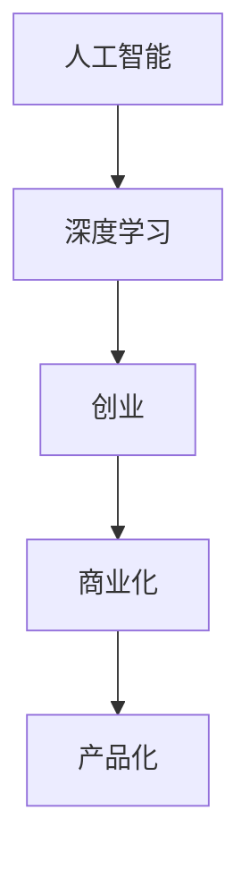

                 

# AI创业码头故事：博士创业之路

## 1. 背景介绍

### 1.1 问题由来

在当今科技迅猛发展的时代，人工智能（AI）技术已经成为推动经济和社会进步的重要力量。尤其是深度学习技术的突破，使得AI技术在医疗、金融、教育、安防等多个领域展现出巨大的应用潜力。然而，AI技术的落地应用并非一帆风顺，技术、市场、人才等多方面的挑战使得AI创业之路充满不确定性。本文将通过一位博士创业者的故事，探索AI创业的艰辛与机遇，揭示背后的核心技术原理与创新思维。

### 1.2 问题核心关键点

AI创业的核心在于将前沿的AI技术转化为具有商业价值的产品和服务。这不仅需要深厚的技术积累，还需要敏锐的市场洞察力和商业敏锐度。博士创业者在面对AI创业挑战时，需要平衡技术实现与商业化的关系，找到两者之间的最佳平衡点。

博士创业者通常具备以下几个核心关键点：

1. **技术积累**：在AI领域有深厚的研究背景，掌握多种AI算法和技术。
2. **项目执行力**：能够将复杂的AI技术转化为实际可用的产品或服务。
3. **市场洞察力**：对市场需求有敏锐的洞察力，能够发现潜在的商业机会。
4. **团队协作能力**：能够组建并管理一支高效、有创意的团队。

## 2. 核心概念与联系

### 2.1 核心概念概述

为了更好地理解AI创业的过程和挑战，本节将介绍几个关键概念：

- **人工智能（AI）**：指模拟人类智能行为的技术，涵盖机器学习、深度学习、自然语言处理等子领域。
- **深度学习（DL）**：一种基于神经网络的机器学习技术，通过多层次特征提取和抽象，实现复杂数据的自动学习和预测。
- **创业（Entrepreneurship）**：指创立和管理新企业的过程，包含技术创新、市场开拓、资源配置等多个方面。
- **商业化（Commercialization）**：将技术转化为实际商业应用的过程，包括产品设计、市场推广、用户反馈等环节。
- **产品化（Productization）**：将技术实现转化为用户可用的产品的过程，注重用户体验和市场适应性。

这些核心概念之间的逻辑关系可以通过以下Mermaid流程图来展示：



这个流程图展示了AI技术到实际应用的基本路径，其中创业和商业化是连接技术研发和市场应用的关键环节。产品化则是将技术转化为用户可用的产品的最后一步。

## 3. 核心算法原理 & 具体操作步骤

### 3.1 算法原理概述

AI创业的核心在于如何将前沿的AI技术转化为具有商业价值的产品和服务。这涉及多个关键环节，包括技术选型、算法优化、产品设计、市场推广等。以下是几个核心算法原理的概述：

- **算法选型**：根据市场需求和技术可行性，选择合适的AI算法和技术框架。
- **算法优化**：在现有算法基础上进行优化，提升模型性能和效率。
- **产品设计**：根据用户需求和市场反馈，设计满足用户需求的AI产品。
- **市场推广**：通过有效的市场推广策略，将产品推向市场，吸引用户。

### 3.2 算法步骤详解

**步骤1：技术选型**

在AI创业初期，首先需要根据市场需求和技术可行性，选择合适的AI算法和技术框架。例如，对于图像识别任务，可以选择基于卷积神经网络（CNN）的算法，对于自然语言处理任务，可以选择基于循环神经网络（RNN）或Transformer的算法。

**步骤2：算法优化**

在选型之后，需要对现有算法进行优化，提升模型的性能和效率。优化方法包括但不限于：

- **模型压缩**：减少模型参数量，提升模型运行速度。
- **迁移学习**：在现有算法基础上进行微调，适应新任务。
- **超参数调优**：调整模型超参数，如学习率、批大小等，以获得最佳性能。

**步骤3：产品设计**

产品设计是AI创业中至关重要的一环。好的产品设计能够满足用户需求，提升用户体验。产品设计包括：

- **用户体验设计（UX）**：注重界面设计和用户交互，提升用户体验。
- **功能设计**：根据用户需求设计核心功能，提供实际价值。
- **技术架构设计**：设计高效、可扩展的技术架构，保障产品稳定性和可维护性。

**步骤4：市场推广**

市场推广是AI产品走向市场的重要环节。有效的市场推广策略包括：

- **营销策略**：通过广告、推广活动等方式，提升产品知名度。
- **渠道建设**：建立多渠道销售网络，拓展市场覆盖范围。
- **用户反馈**：收集用户反馈，不断改进产品，提升用户满意度。

### 3.3 算法优缺点

AI创业的算法选型和优化具有以下优缺点：

**优点**：

- **技术领先**：选择前沿的AI技术，能够获得市场竞争优势。
- **灵活性高**：根据市场反馈和用户需求，快速调整产品功能和设计。
- **资源高效**：通过优化算法，提升模型效率，降低资源成本。

**缺点**：

- **技术难度高**：选型和优化需要深厚的技术积累和研究背景。
- **市场需求不确定**：技术领先不代表市场需求，需要市场验证。
- **资源投入大**：AI技术研发和优化需要大量资源投入。

### 3.4 算法应用领域

AI创业的算法和优化技术在多个领域具有广泛应用：

- **医疗**：基于AI的医学影像分析、疾病诊断等应用，提升医疗服务水平。
- **金融**：利用AI进行风险评估、信用评分等，优化金融服务流程。
- **教育**：通过AI进行个性化教育、智能辅导等，提升教育效果。
- **安防**：利用AI进行图像识别、人脸识别等，提升安防水平。
- **智能制造**：基于AI进行质量控制、生产调度等，提升制造业效率。

## 4. 数学模型和公式 & 详细讲解 & 举例说明

### 4.1 数学模型构建

在AI创业中，数学模型是技术选型和算法优化的重要工具。以下是几个常见的数学模型：

- **卷积神经网络（CNN）**：用于图像识别、视频分析等任务。
- **循环神经网络（RNN）**：用于序列数据处理，如自然语言处理。
- **Transformer**：用于语言建模、机器翻译等任务。

### 4.2 公式推导过程

以卷积神经网络（CNN）为例，其基本结构包括卷积层、池化层、全连接层等。以下是一个简单的CNN模型公式推导过程：

$$
f(x) = W_3 \cdot h_2(x) + b_3
$$

其中，$x$ 为输入数据，$h_2(x)$ 为卷积层输出，$W_3$ 为全连接层权重，$b_3$ 为全连接层偏置。

### 4.3 案例分析与讲解

以图像识别为例，CNN模型通过卷积层提取图像特征，通过池化层降维，通过全连接层进行分类。以下是一个简单的CNN模型在图像分类任务中的应用案例：

1. **数据准备**：准备训练集、验证集和测试集，进行数据增强和预处理。
2. **模型训练**：使用训练集进行模型训练，调整超参数，优化模型性能。
3. **模型评估**：在验证集和测试集上进行模型评估，对比不同模型的性能。
4. **模型应用**：将训练好的模型应用到实际图像识别任务中，提升识别精度。

## 5. 项目实践：代码实例和详细解释说明

### 5.1 开发环境搭建

在AI创业项目中，开发环境搭建是技术选型和算法优化的重要基础。以下是Python环境搭建的详细步骤：

1. **安装Python**：从官网下载并安装Python，建议安装最新版本。
2. **安装虚拟环境**：使用`virtualenv`或`conda`创建虚拟环境，隔离项目依赖。
3. **安装必要的库**：使用`pip`安装必要的库，如`TensorFlow`、`Keras`、`PyTorch`等。
4. **配置开发工具**：配置编辑器（如VSCode）和版本控制系统（如Git），提升开发效率。

### 5.2 源代码详细实现

以下是一个简单的基于CNN的图像分类项目代码实现：

```python
import tensorflow as tf
from tensorflow.keras import layers

# 定义模型
model = tf.keras.Sequential([
    layers.Conv2D(32, (3, 3), activation='relu', input_shape=(28, 28, 1)),
    layers.MaxPooling2D((2, 2)),
    layers.Conv2D(64, (3, 3), activation='relu'),
    layers.MaxPooling2D((2, 2)),
    layers.Flatten(),
    layers.Dense(64, activation='relu'),
    layers.Dense(10, activation='softmax')
])

# 编译模型
model.compile(optimizer='adam', loss='sparse_categorical_crossentropy', metrics=['accuracy'])

# 加载数据集
(x_train, y_train), (x_test, y_test) = tf.keras.datasets.mnist.load_data()
x_train = x_train.reshape(-1, 28, 28, 1) / 255.0
x_test = x_test.reshape(-1, 28, 28, 1) / 255.0

# 训练模型
model.fit(x_train, y_train, epochs=10, validation_data=(x_test, y_test))
```

### 5.3 代码解读与分析

以上代码实现了基于CNN的图像分类模型。其中，`Sequential`表示线性模型，`Conv2D`和`MaxPooling2D`表示卷积层和池化层，`Dense`表示全连接层。编译模型时，使用`adam`优化器和`softmax`损失函数。

### 5.4 运行结果展示

在训练过程中，可以通过`model.evaluate()`方法评估模型性能：

```python
loss, accuracy = model.evaluate(x_test, y_test)
print(f'Test loss: {loss:.3f}')
print(f'Test accuracy: {accuracy:.3f}')
```

## 6. 实际应用场景

### 6.1 智能医疗

在智能医疗领域，AI技术可以应用于疾病诊断、医学影像分析、个性化医疗等多个方面。以下是一个基于CNN的医学影像分类项目的实际应用场景：

1. **数据准备**：收集和整理医学影像数据，标注影像类别。
2. **模型训练**：使用预训练的卷积神经网络模型，进行疾病分类。
3. **模型评估**：在测试集上进行模型评估，对比不同模型的性能。
4. **模型应用**：将训练好的模型应用到实际医疗影像分类任务中，提升诊断精度。

### 6.2 金融风控

在金融领域，AI技术可以应用于风险评估、信用评分、欺诈检测等多个方面。以下是一个基于RNN的金融欺诈检测项目的实际应用场景：

1. **数据准备**：收集和整理金融交易数据，标注交易类别。
2. **模型训练**：使用预训练的循环神经网络模型，进行交易分类。
3. **模型评估**：在测试集上进行模型评估，对比不同模型的性能。
4. **模型应用**：将训练好的模型应用到实际金融欺诈检测任务中，提升欺诈识别能力。

### 6.3 智能制造

在智能制造领域，AI技术可以应用于质量控制、生产调度、设备维护等多个方面。以下是一个基于CNN的质量控制项目的实际应用场景：

1. **数据准备**：收集和整理生产过程中的图像数据，标注质量类别。
2. **模型训练**：使用预训练的卷积神经网络模型，进行质量分类。
3. **模型评估**：在测试集上进行模型评估，对比不同模型的性能。
4. **模型应用**：将训练好的模型应用到实际生产质量控制任务中，提升产品质量。

## 7. 工具和资源推荐

### 7.1 学习资源推荐

为了帮助AI创业者掌握前沿技术，以下是一些优质的学习资源：

1. **《深度学习》**：由Ian Goodfellow等作者所著，系统介绍了深度学习的基本原理和应用。
2. **《TensorFlow官方文档》**：详细介绍了TensorFlow框架的使用方法和最佳实践。
3. **Kaggle**：一个数据科学竞赛平台，提供丰富的数据集和竞赛项目，提升数据处理和模型训练能力。
4. **Coursera**：一个在线学习平台，提供多门深度学习课程，涵盖理论和实践。

### 7.2 开发工具推荐

以下是几个常用的AI创业开发工具：

1. **Jupyter Notebook**：一个交互式的编程环境，支持Python、R等多种语言，适合进行数据处理和模型训练。
2. **PyCharm**：一个Python集成开发环境，提供代码调试、版本控制等功能，提升开发效率。
3. **Git**：一个版本控制系统，用于代码版本管理和团队协作。
4. **Docker**：一个容器化平台，用于打包和部署应用，提升应用的稳定性和可移植性。

### 7.3 相关论文推荐

以下是几篇具有代表性的AI创业相关论文：

1. **《Deep Learning》**：Ian Goodfellow等作者所著，介绍了深度学习的理论和应用。
2. **《TensorFlow: A System for Large-Scale Machine Learning》**：Jeffrey Dean等作者所著，介绍了TensorFlow框架的实现原理和应用。
3. **《Neural Networks and Deep Learning》**：Michael Nielsen所著，介绍了神经网络的基本原理和应用。

## 8. 总结：未来发展趋势与挑战

### 8.1 总结

本文通过对AI创业过程中关键算法原理和操作步骤的详细阐述，揭示了AI创业背后的技术选型、算法优化、产品设计、市场推广等多个环节。通过一个博士创业者的故事，展示了AI创业的艰辛与机遇，强调了技术积累、市场需求和团队协作的重要性。

### 8.2 未来发展趋势

未来AI创业将呈现以下几个发展趋势：

1. **技术融合**：AI技术与其他技术的融合将不断深入，如AI与区块链、物联网等结合，产生新的应用场景。
2. **数据驱动**：数据驱动将成为AI创业的主导模式，通过大数据分析提升产品性能和市场竞争力。
3. **模型可解释性**：可解释性将成为AI模型的重要特性，提升用户信任度和市场接受度。
4. **多模态融合**：多模态融合将成为AI产品的趋势，提升用户体验和应用效果。
5. **伦理合规**：AI创业将越来越注重伦理和合规问题，保护用户隐私和数据安全。

### 8.3 面临的挑战

尽管AI创业充满机遇，但也面临诸多挑战：

1. **技术瓶颈**：AI技术在实际应用中仍然存在一些瓶颈，如模型复杂度高、训练时间长等。
2. **市场需求不确定**：AI产品的市场需求具有不确定性，需要不断调整产品策略。
3. **人才短缺**：AI技术需要高水平的人才支持，但目前人才短缺问题依然存在。
4. **资源投入大**：AI创业需要大量资源投入，包括资金、设备、人力等。
5. **市场竞争激烈**：AI市场竞争激烈，需要不断创新和优化产品。

### 8.4 研究展望

未来AI创业需要在多个方面进行创新和优化：

1. **技术创新**：不断探索新的AI技术，如量子计算、神经网络结构优化等，提升模型性能和效率。
2. **市场洞察**：加强市场调研和用户需求分析，提升产品市场适应性。
3. **团队建设**：建立高效的团队协作机制，提升产品开发效率。
4. **资源管理**：优化资源配置和利用，降低创业成本。
5. **伦理合规**：注重AI产品的伦理和合规问题，保护用户隐私和数据安全。

## 9. 附录：常见问题与解答

**Q1：AI创业与传统的软件开发有何不同？**

A: AI创业与传统的软件开发相比，具有以下不同点：

1. **技术复杂度**：AI创业涉及的数据量、算法复杂度远高于传统软件开发。
2. **市场应用**：AI创业更多关注市场应用，需要不断优化产品性能和用户体验。
3. **数据依赖**：AI创业高度依赖数据，需要不断收集和处理数据。

**Q2：AI创业过程中如何平衡技术积累和市场应用？**

A: AI创业过程中，技术积累和市场应用是相辅相成的，需要平衡两者的关系：

1. **技术积累**：在产品开发过程中，不断进行技术研究和优化，提升模型性能和算法效率。
2. **市场应用**：在技术选型和优化过程中，注重市场反馈和用户需求，提升产品市场适应性。
3. **资源分配**：合理分配技术研发和市场推广的资源，实现两者协同发展。

**Q3：AI创业过程中如何规避技术风险？**

A: AI创业过程中，规避技术风险需要从多个方面进行考虑：

1. **数据质量**：保证数据的质量和多样性，避免数据偏见和过拟合。
2. **模型验证**：在模型训练和优化过程中，不断进行模型验证和评估，避免模型过拟合。
3. **风险控制**：建立风险控制机制，及时发现和应对技术风险。

**Q4：AI创业过程中如何管理项目进度和资源？**

A: AI创业过程中，项目进度和资源管理需要从多个方面进行考虑：

1. **项目管理**：制定详细的项目计划和时间表，明确各阶段的里程碑和目标。
2. **资源分配**：合理分配团队成员和技术资源，提升工作效率。
3. **风险管理**：建立风险管理机制，及时发现和应对项目风险。

**Q5：AI创业过程中如何保护用户隐私和数据安全？**

A: AI创业过程中，保护用户隐私和数据安全是至关重要的，需要从多个方面进行考虑：

1. **数据匿名化**：在数据处理和存储过程中，对敏感数据进行匿名化处理。
2. **安全传输**：采用加密传输技术，保障数据传输过程中的安全性。
3. **访问控制**：建立严格的数据访问控制机制，限制数据的访问权限。

---

作者：禅与计算机程序设计艺术 / Zen and the Art of Computer Programming

