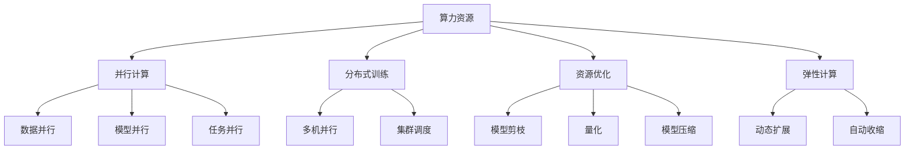

                 

# AI创业者如何应对算力资源挑战?

## 1. 背景介绍

### 1.1 问题由来
随着人工智能(AI)技术的迅速发展，算力资源需求快速增长。对于AI创业者来说，如何高效利用有限的算力资源，是一个亟需解决的难题。算力不足可能影响AI应用的开发速度和效果，限制企业的成长潜力。因此，本文旨在为AI创业者提供一些应对算力资源挑战的策略和方法。

### 1.2 问题核心关键点
算力资源挑战的核心在于如何在有限的资源下，实现高效的AI应用开发和模型训练。具体问题包括：
- 如何优化算法和模型结构，减少计算量和内存消耗。
- 如何利用现有资源进行高效的多任务并行和分布式训练。
- 如何结合云资源，实现算力资源的动态扩展和弹性管理。
- 如何采用资源优化技术，提升计算效率和系统稳定性。

## 2. 核心概念与联系

### 2.1 核心概念概述

为更好地理解如何应对算力资源挑战，本节将介绍几个密切相关的核心概念：

- **算力资源**：指硬件设备（如GPU、TPU、CPU等）提供的计算能力。算力资源的多少直接决定了AI应用的开发和训练速度。

- **并行计算**：通过将一个大任务拆分为多个子任务，同时并行执行，以提高计算效率。并行计算可以分为数据并行、模型并行、任务并行等多种形式。

- **分布式训练**：在多个计算节点上并行执行模型训练任务，以利用多台计算设备的能力，加速模型训练过程。

- **资源优化**：通过算法和系统的优化，减少算力资源的消耗，提高计算效率和系统稳定性。常见的资源优化技术包括模型剪枝、量化、模型压缩等。

- **弹性计算**：指根据计算需求动态调整计算资源，实现计算资源的弹性管理。弹性计算支持按需扩展和缩小，以适应不同场景下的计算需求。

这些核心概念之间的逻辑关系可以通过以下Mermaid流程图来展示：



这个流程图展示了算力资源的利用过程：

1. 算力资源提供计算能力，通过并行计算来提高效率。
2. 并行计算进一步分为数据并行、模型并行、任务并行等多种形式，适应不同任务需求。
3. 分布式训练利用多台设备并行执行，加速模型训练。
4. 资源优化通过算法和系统优化，减少资源消耗，提升效率。
5. 弹性计算根据需求动态扩展和缩小资源，实现高效管理。

## 3. 核心算法原理 & 具体操作步骤

### 3.1 算法原理概述

为了高效利用有限的算力资源，AI创业者需要采用多种算法和优化技术，减少计算量和内存消耗。具体来说，可以从以下几个方面入手：

- **模型剪枝**：通过剪去不必要的连接和参数，减少模型复杂度，降低计算量。
- **量化**：将模型参数从浮点数转为整数或固定点数值，减小内存占用，提高计算速度。
- **模型压缩**：通过知识蒸馏、参数共享等技术，减少模型大小，加速推理和训练过程。
- **分布式训练**：通过将训练任务分布在多台设备上，利用并行计算，加速模型训练。
- **动态资源管理**：根据计算需求动态调整计算资源，实现资源弹性管理。

### 3.2 算法步骤详解

以下是具体应对算力资源挑战的步骤：

**Step 1: 算法和模型选择**
- 选择合适的算法和模型结构，如卷积神经网络(CNN)、循环神经网络(RNN)、Transformer等。
- 针对特定任务，考虑使用已有的高性能模型或框架，如TensorFlow、PyTorch等。

**Step 2: 数据和资源优化**
- 对数据进行预处理，如归一化、降维、特征选择等，减少数据复杂度。
- 对模型进行优化，如剪枝、量化、模型压缩等，减少计算量和内存占用。
- 利用并行计算技术，提高计算效率，如数据并行、模型并行、任务并行等。

**Step 3: 分布式训练**
- 设计合理的分布式训练策略，如模型分割、数据分割、梯度聚合等。
- 选择合适的分布式训练框架，如Horovod、Ray等。
- 利用集群资源，进行多机并行训练，提高计算速度。

**Step 4: 动态资源管理**
- 采用弹性计算策略，根据计算需求动态调整计算资源。
- 利用容器化技术，如Docker、Kubernetes等，实现资源的高效管理。
- 设计自动化的资源调度算法，确保计算资源的合理分配和使用。

**Step 5: 系统部署和优化**
- 选择合适的云平台，如AWS、Google Cloud、阿里云等，利用云资源进行高效计算。
- 采用高效的部署策略，如模型推理优化、缓存机制、负载均衡等。
- 进行持续监控和优化，及时发现和解决系统问题。

### 3.3 算法优缺点

应对算力资源挑战的算法和优化方法具有以下优缺点：

**优点：**
- 显著减少计算量和内存消耗，提高计算效率和系统稳定性。
- 利用多台设备进行分布式训练，加速模型训练速度。
- 实现资源的高效管理和弹性扩展，满足不同计算需求。

**缺点：**
- 算法和优化技术的选择和实施需要一定的专业知识，可能增加开发复杂度。
- 分布式训练可能引入通信开销，影响系统整体效率。
- 动态资源管理需要精细的调度算法，可能增加系统复杂度。

## 4. 数学模型和公式 & 详细讲解

### 4.1 数学模型构建

为更好地理解如何应对算力资源挑战，我们引入以下数学模型：

- **模型剪枝**：定义模型剪枝率为 $\alpha$，表示保留的参数比例。通过剪枝后，模型参数数量减少为原模型参数数量的 $\alpha$ 倍。
- **量化**：定义量化位数为 $b$，表示量化后的参数位数。通过量化后，模型参数数量减少为原模型参数数量的 $\frac{1}{2^b}$ 倍。
- **模型压缩**：定义压缩率为 $\beta$，表示压缩后的模型参数数量减少为原模型参数数量的 $\beta$ 倍。
- **分布式训练**：定义多机并行度为 $n$，表示参与并行训练的计算节点数。通过并行计算，加速模型训练速度。

### 4.2 公式推导过程

以下是对应的公式推导过程：

**模型剪枝**：
假设原模型参数数量为 $P$，保留参数数量为 $P'$，则剪枝率为：
$$ \alpha = \frac{P'}{P} $$

**量化**：
假设原模型参数数量为 $P$，量化后参数数量为 $P'$，则量化位数为：
$$ b = \log_2 \left(\frac{P}{P'}\right) $$

**模型压缩**：
假设原模型参数数量为 $P$，压缩后参数数量为 $P'$，则压缩率为：
$$ \beta = \frac{P'}{P} $$

**分布式训练**：
假设模型训练时间为 $T$，单机训练时间为 $T'$，多机并行度为 $n$，则分布式训练时间为：
$$ T_{\text{dist}} = \frac{T}{n} $$

### 4.3 案例分析与讲解

**案例1: 模型剪枝**
假设原模型有100万个参数，剪枝率为50%，则保留参数数量为：
$$ P' = P \times (1 - \alpha) = 100 \times (1 - 0.5) = 50 \text{万个} $$
剪枝后的模型性能不受影响，但计算量大幅减少。

**案例2: 量化**
假设原模型有10万个参数，量化为8位整数，则量化后的参数数量为：
$$ P' = \frac{P}{2^b} = \frac{10}{2^8} = 0.39 \text{万个} $$
量化后的模型存储空间和计算速度均显著降低。

**案例3: 分布式训练**
假设单机训练时间为1小时，多机并行度为8，则分布式训练时间为：
$$ T_{\text{dist}} = \frac{T}{n} = \frac{1}{8} \text{小时} = 7.5 \text{分钟} $$
通过分布式训练，模型训练时间大幅缩短。

## 5. 项目实践：代码实例和详细解释说明

### 5.1 开发环境搭建

在进行算力资源挑战应对实践前，我们需要准备好开发环境。以下是使用Python进行PyTorch开发的环境配置流程：

1. 安装Anaconda：从官网下载并安装Anaconda，用于创建独立的Python环境。

2. 创建并激活虚拟环境：
```bash
conda create -n pytorch-env python=3.8 
conda activate pytorch-env
```

3. 安装PyTorch：根据CUDA版本，从官网获取对应的安装命令。例如：
```bash
conda install pytorch torchvision torchaudio cudatoolkit=11.1 -c pytorch -c conda-forge
```

4. 安装各类工具包：
```bash
pip install numpy pandas scikit-learn matplotlib tqdm jupyter notebook ipython
```

完成上述步骤后，即可在`pytorch-env`环境中开始实践。

### 5.2 源代码详细实现

这里我们以模型剪枝和量化为例，给出使用PyTorch进行模型优化的代码实现。

```python
import torch
import torch.nn as nn
import torchvision.transforms as transforms
from torchvision.models import resnet18

# 加载预训练模型
model = resnet18(pretrained=True)

# 定义剪枝率
alpha = 0.5

# 定义剪枝函数
def prune_model(model, alpha):
    for param in model.parameters():
        if torch.rand(1) < alpha:
            param.data[0] = 0

    # 强制更新
    model.apply(prune_model)

# 应用剪枝函数
prune_model(model, alpha)

# 定义量化位数
b = 8

# 定义量化函数
def quantize_model(model, b):
    for param in model.parameters():
        param.data = param.data.to(torch.quint8)

    # 强制更新
    model.apply(quantize_model)

# 应用量化函数
quantize_model(model, b)
```

在这个例子中，我们首先加载了一个预训练的ResNet-18模型，然后定义了剪枝率和量化位数。接着定义了剪枝函数和量化函数，对模型进行剪枝和量化处理。最后，应用剪枝函数和量化函数，完成了模型的优化。

### 5.3 代码解读与分析

让我们再详细解读一下关键代码的实现细节：

**剪枝函数**：
- 遍历模型的所有参数，以一定概率随机选择保留或丢弃参数。
- 被保留的参数仍保留其原始值，未被保留的参数设置为0，表示删除该参数。
- 强制更新模型，确保剪枝后的模型参数有效。

**量化函数**：
- 遍历模型的所有参数，将其转换为指定位数的整数。
- 转换后的参数数据类型为torch.quint8，即8位无符号整数。
- 强制更新模型，确保量化后的模型参数有效。

## 6. 实际应用场景

### 6.1 智能安防系统

智能安防系统对实时性和准确性要求极高。通过分布式训练和模型压缩，可以有效应对安防场景下的计算资源挑战。具体来说，可以将安防数据集分成多个子集，在多个计算节点上并行训练，加速模型训练过程。同时，采用模型剪枝和量化技术，减少模型大小，提高推理速度和稳定性。

### 6.2 智慧医疗诊断

智慧医疗诊断需要高效处理海量医疗数据，进行实时分析。通过分布式训练和模型压缩，可以有效应对医疗数据处理的计算资源需求。具体来说，可以采用多机并行策略，在分布式集群上训练模型，加速诊断结果生成。同时，利用模型剪枝和量化技术，降低计算量和内存占用，提升系统的实时性和稳定性。

### 6.3 智能推荐系统

智能推荐系统需要处理大量用户行为数据，进行实时推荐。通过分布式训练和模型压缩，可以有效应对推荐系统计算资源需求。具体来说，可以采用多机并行策略，在分布式集群上训练模型，加速推荐结果生成。同时，利用模型剪枝和量化技术，降低计算量和内存占用，提升系统的实时性和稳定性。

### 6.4 未来应用展望

随着算力资源的进一步发展，未来大语言模型和AI应用将能够处理更加复杂和庞大的数据，支持更加多样和高效的应用场景。

在智慧城市治理中，分布式训练和多机并行技术将进一步提升城市管理的智能化水平，构建更安全、高效的未来城市。

在自动驾驶领域，分布式训练和多机并行技术将支持实时环境感知和决策，提高自动驾驶系统的可靠性和安全性。

在工业制造中，分布式训练和多机并行技术将支持大规模数据处理和复杂模型训练，提高生产效率和产品质量。

总之，未来的AI应用将越来越依赖于高效的算力资源管理，分布式训练和多机并行技术将是其重要支撑。AI创业者需要不断探索和优化算力资源管理策略，以应对未来更加复杂和多变的计算需求。

## 7. 工具和资源推荐

### 7.1 学习资源推荐

为了帮助开发者系统掌握算力资源管理的技术基础和实践技巧，这里推荐一些优质的学习资源：

1. 《深度学习》系列博文：由大模型技术专家撰写，深入浅出地介绍了深度学习的基本概念和经典模型，涵盖模型剪枝、量化、分布式训练等技术。

2. CS231n《卷积神经网络》课程：斯坦福大学开设的经典课程，涵盖卷积神经网络的结构和训练，是学习计算机视觉的基础。

3. 《Deep Learning with PyTorch》书籍：PyTorch官方文档，提供了大量的深度学习实践案例和算法优化方法，包括分布式训练、模型剪枝、量化等。

4. TensorFlow官方文档：TensorFlow官方文档，提供了丰富的深度学习模型和算法实现，包括分布式训练、模型剪枝、量化等。

5. PyTorch官方文档：PyTorch官方文档，提供了丰富的深度学习模型和算法实现，包括分布式训练、模型剪枝、量化等。

通过对这些资源的学习实践，相信你一定能够快速掌握算力资源管理的精髓，并用于解决实际的AI应用问题。

### 7.2 开发工具推荐

高效的开发离不开优秀的工具支持。以下是几款用于算力资源管理的常用工具：

1. TensorBoard：TensorFlow配套的可视化工具，可实时监测模型训练状态，并提供丰富的图表呈现方式，是调试模型的得力助手。

2. Tune：HuggingFace开发的超参数优化工具，支持自动化的超参数搜索，快速寻找最优模型配置。

3. Horovod：一款开源的分布式训练框架，支持多机并行训练，支持多种深度学习框架，如TensorFlow、PyTorch等。

4. Ray：一款开源的分布式训练框架，支持多机并行训练，支持多种深度学习框架，如TensorFlow、PyTorch等。

5. Kubernetes：一款开源的容器编排系统，支持资源的高效管理和弹性扩展，支持多台计算设备的协同工作。

合理利用这些工具，可以显著提升AI应用的开发和训练效率，加快创新迭代的步伐。

### 7.3 相关论文推荐

算力资源管理的研究源于学界的持续探索。以下是几篇奠基性的相关论文，推荐阅读：

1. "Pruning Neural Networks with L1, L2, Elastic-Net and Nuclear Norm"：介绍模型剪枝技术，通过L1、L2、弹性网和核范数等方法进行剪枝。

2. "Quantization Aware Training: Reducing Model Compression Artifacts via Min-cut Regularization"：介绍量化技术，通过最小割正则化等方法进行量化。

3. "Model Parallelism: The New Frontier for Distributed Deep Learning"：介绍模型并行技术，通过模型分割和梯度聚合等方法进行分布式训练。

4. "Towards Automatic Machine Learning: Going Human-in-the-Loop"：介绍超参数优化技术，通过自动化的超参数搜索等方法进行模型调优。

5. "Efficient Model Training in Deep Learning"：介绍分布式训练技术，通过多机并行和数据并行等方法进行加速训练。

这些论文代表了大规模深度学习的应用和优化方法的研究进展，是学习和研究算力资源管理的宝贵资源。

## 8. 总结：未来发展趋势与挑战

### 8.1 总结

本文对AI创业者如何应对算力资源挑战的方法进行了全面系统的介绍。首先阐述了算力资源挑战的背景和核心关键点，明确了资源管理在AI应用开发中的重要性。其次，从原理到实践，详细讲解了分布式训练、模型剪枝、量化、弹性计算等算力优化技术的数学模型和实现方法，给出了具体的代码实例。同时，本文还探讨了这些技术在智能安防、智慧医疗、智能推荐等实际应用场景中的应用前景，展示了算力资源管理技术的广阔前景。最后，本文精选了相关学习资源、开发工具和论文，力求为AI创业者提供全方位的技术指引。

通过本文的系统梳理，可以看到，算力资源管理技术的进步将极大提升AI应用的开发速度和效果，支持AI创业者实现更高层次的技术创新和业务拓展。未来，伴随算力资源管理的不断演进，AI应用将能够处理更加复杂和庞大的数据，支持更加多样和高效的应用场景。

### 8.2 未来发展趋势

展望未来，算力资源管理技术将呈现以下几个发展趋势：

1. 分布式训练和多机并行技术将进一步发展，支持更大规模和更复杂的应用场景。通过多机并行，加速模型训练和推理过程。

2. 模型剪枝和量化技术将不断优化，减少计算量和内存占用，提升系统效率和稳定性。

3. 弹性计算和资源管理技术将更加成熟，实现计算资源的按需扩展和自动收缩，支持动态计算需求。

4. 深度学习框架和优化工具将不断演进，提供更丰富的分布式训练和模型优化功能，支持多样化的应用需求。

5. 自动化和智能化技术将进一步发展，实现超参数优化、模型选择等自动化的资源管理功能，降低人工干预成本。

6. 算法和系统优化技术将不断融合，实现端到端的深度学习系统优化，提升整体系统效率和性能。

以上趋势凸显了算力资源管理技术的广阔前景，为AI应用提供了强大的计算支撑。AI创业者需要不断探索和优化算法和系统优化技术，以应对未来更加复杂和多变的计算需求。

### 8.3 面临的挑战

尽管算力资源管理技术已经取得了不小的进展，但在迈向更加智能化、普适化应用的过程中，仍面临诸多挑战：

1. 分布式训练可能引入通信开销，影响系统整体效率。如何在保证系统稳定性的同时，提升计算效率，是未来的一个重要研究方向。

2. 模型剪枝和量化技术可能引入一定的精度损失，如何在保证模型效果的同时，减少计算量和内存消耗，是未来的一个重要研究方向。

3. 动态资源管理需要精细的调度算法，可能增加系统复杂度。如何在保证系统稳定性的同时，实现资源的弹性管理，是未来的一个重要研究方向。

4. 自动化和智能化技术可能引入新的复杂性，如何实现高效的自动化和智能化优化，降低人工干预成本，是未来的一个重要研究方向。

5. 深度学习框架和优化工具的灵活性不足，可能无法完全适应多样化的应用需求。如何实现更灵活的框架和工具，支持多样化的应用场景，是未来的一个重要研究方向。

6. 模型剪枝和量化技术可能引入新的复杂性，如何实现高效的模型压缩和量化，降低计算量和内存消耗，是未来的一个重要研究方向。

以上挑战凸显了算力资源管理技术的复杂性和多样性，需要AI创业者持续探索和创新，才能不断突破技术瓶颈，实现更高层次的技术创新和业务拓展。

### 8.4 研究展望

面对算力资源管理所面临的种种挑战，未来的研究需要在以下几个方面寻求新的突破：

1. 探索新的分布式训练算法和模型并行策略，提升计算效率和系统稳定性。

2. 开发更高效的模型剪枝和量化方法，减少计算量和内存消耗，提升模型效果。

3. 引入深度学习和运筹学的方法，优化计算资源分配和调度算法，实现动态资源管理。

4. 结合机器学习和运筹学的思想，实现自动化的超参数优化和模型选择。

5. 开发更加灵活和易于扩展的深度学习框架和优化工具，支持多样化的应用需求。

6. 引入符号化推理和知识图谱的方法，提升模型的可解释性和可审计性。

7. 引入伦理和道德的考量，确保模型输出的安全和合规性。

这些研究方向的探索，必将引领算力资源管理技术迈向更高的台阶，为AI应用提供更加强大和灵活的计算支撑。只有勇于创新、敢于突破，才能不断拓展AI应用的技术边界，实现更高层次的技术创新和业务拓展。

## 9. 附录：常见问题与解答

**Q1: 如何选择合适的深度学习框架和工具？**

A: 选择合适的深度学习框架和工具需要考虑以下几个因素：
1. 应用场景：不同应用场景可能需要不同的框架和工具，如计算机视觉任务适合使用TensorFlow，自然语言处理任务适合使用PyTorch。
2. 社区支持和文档：选择社区活跃、文档丰富的框架和工具，可以更容易获得帮助和解决问题。
3. 计算资源：选择适合你计算资源的框架和工具，如需要高性能计算资源，可以选择TensorFlow，需要移动端计算资源，可以选择TensorFlow Lite。
4. 可扩展性：选择具有良好可扩展性的框架和工具，可以支持未来规模化应用。

**Q2: 分布式训练如何提高系统效率？**

A: 分布式训练通过将训练任务分布在多台设备上，利用并行计算，可以有效提高系统效率。具体来说，分布式训练的效率可以通过以下几个方面提升：
1. 多机并行：通过多台设备并行执行训练任务，加速模型训练过程。
2. 数据并行：通过在多台设备上并行加载数据，加速数据加载和处理过程。
3. 模型并行：通过在多台设备上并行加载模型，加速模型加载和推理过程。
4. 自动优化：通过自动化的超参数优化和任务调度，提升分布式训练的效率。

**Q3: 模型剪枝和量化如何影响模型效果？**

A: 模型剪枝和量化技术在减少计算量和内存消耗的同时，可能引入一定的精度损失，影响模型效果。具体来说，模型剪枝和量化可能对模型效果的影响如下：
1. 剪枝率过高，可能导致模型结构过于简单，丢失部分复杂特征，影响模型效果。
2. 量化位数过低，可能导致模型参数精度不足，影响模型效果。
3. 量化位数过高，可能导致模型参数存储空间增加，影响模型推理效率。

**Q4: 弹性计算如何实现资源的高效管理？**

A: 弹性计算通过动态调整计算资源，实现资源的按需扩展和自动收缩，支持不同场景下的计算需求。具体来说，弹性计算的实现方法包括：
1. 容器化技术：通过容器技术，如Docker、Kubernetes等，实现计算资源的按需扩展和自动收缩。
2. 自动调度算法：通过自动化的资源调度算法，根据计算需求动态调整计算资源。
3. 服务化封装：通过服务化封装，实现计算资源的灵活管理。

**Q5: 分布式训练可能引入哪些通信开销？**

A: 分布式训练可能引入以下通信开销：
1. 数据通信开销：多台设备之间需要交换数据，可能产生较大的通信开销。
2. 参数通信开销：多台设备之间需要交换模型参数，可能产生较大的通信开销。
3. 同步开销：多台设备需要同步更新模型参数，可能产生较大的通信开销。
4. 通信优化：通过优化通信算法和协议，可以降低通信开销。

以上是AI创业者应对算力资源挑战的全面系统介绍。通过本文的系统梳理，相信你一定能够掌握算力资源管理的精髓，并用于解决实际的AI应用问题。随着算力资源的不断演进，AI应用将能够处理更加复杂和庞大的数据，支持更加多样和高效的应用场景。AI创业者需要不断探索和优化算力资源管理策略，以应对未来更加复杂和多变的计算需求。

