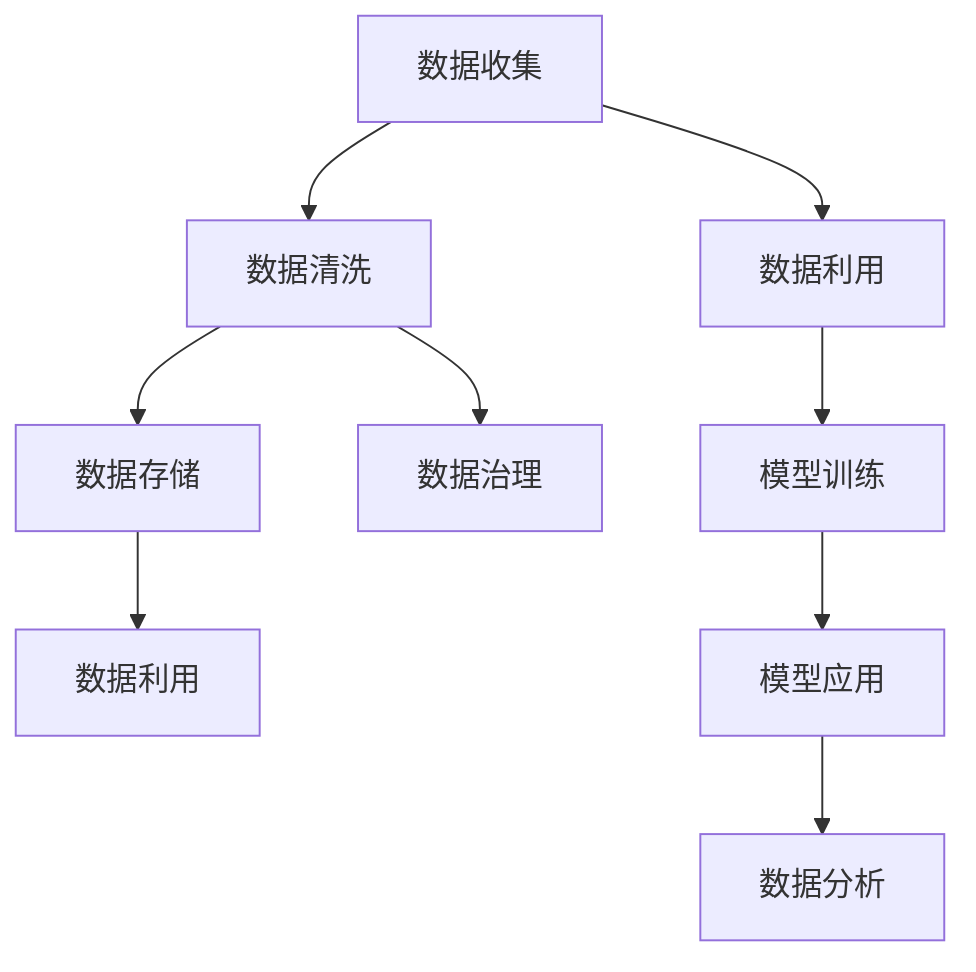

                 

# AI创业：数据管理的实用方案

在人工智能(AI)创业的浪潮中，数据管理是决定成败的关键因素之一。高效、可靠的数据管理不仅能够降低创业成本，提高模型训练效率，还能够确保AI系统的质量和性能。本文将系统介绍AI创业中数据管理的核心概念、实用策略和最佳实践，帮助创业者全面提升数据管理能力，加速AI项目落地。

## 1. 背景介绍

### 1.1 问题由来

随着AI技术的快速发展，越来越多的初创公司投入到AI开发中，但数据管理成为许多创业团队的主要瓶颈。据统计，70%以上的AI项目失败归因于数据质量问题。数据管理不当，不仅会导致模型训练效率低下，还会影响最终应用的实际效果。因此，了解和掌握数据管理策略，对于AI创业至关重要。

### 1.2 问题核心关键点

为了系统了解AI创业中数据管理的核心问题，本文将围绕以下几个关键点进行展开：
- 数据收集：如何高效、可靠地收集数据，降低成本和时滞。
- 数据清洗：如何对数据进行预处理，提高数据质量。
- 数据存储：如何设计数据存储方案，支持高效查询和访问。
- 数据治理：如何构建数据治理框架，确保数据安全和合规性。
- 数据利用：如何利用数据训练AI模型，提升模型效果。

## 2. 核心概念与联系

### 2.1 核心概念概述

为了更好地理解数据管理的核心概念及其相互联系，本文通过一个Mermaid流程图来展示：



这个流程图展示了数据管理的主要环节及其相互关系：

- **数据收集**：从各种渠道获取原始数据。
- **数据清洗**：对数据进行预处理，包括去除噪声、填补缺失值等。
- **数据存储**：将清洗后的数据存储在合适的数据仓库或数据库中。
- **数据治理**：构建数据治理框架，确保数据质量和安全性。
- **数据利用**：利用清洗好的数据训练模型，或者通过数据分析获取洞察。
- **模型训练**：使用清洗后的数据训练AI模型，提升模型性能。
- **模型应用**：将训练好的模型部署到实际应用中，解决实际问题。
- **数据分析**：对模型输出结果进行分析，获取更深入的洞见。

这些核心概念构成了AI创业中数据管理的整体框架，帮助团队从数据采集到模型应用的各个环节提升数据管理效率。

## 3. 核心算法原理 & 具体操作步骤

### 3.1 算法原理概述

数据管理本质上是对数据的采集、处理、存储、治理和利用进行系统化的管理和优化。其核心算法原理包括：

- 数据清洗算法：去除重复、错误、无关的数据，填补缺失值，标准化数据格式。
- 数据存储算法：选择合适的存储技术，设计高效的数据存储方案。
- 数据治理算法：建立数据质量监控体系，确保数据安全和合规性。
- 数据利用算法：利用数据进行模型训练和预测，提升模型性能。

这些算法相互配合，形成一个闭环的数据管理流程，确保数据的准确性、完整性和可用性。

### 3.2 算法步骤详解

为了更好地理解这些算法原理，本文将详细介绍每个步骤的详细步骤：

#### 3.2.1 数据收集

数据收集是数据管理的第一步。主要步骤包括：

1. **确定数据源**：识别可能的数据源，如公有数据集、开放API、网络爬虫等。
2. **数据采集**：编写代码自动从数据源获取数据，或者通过人工方式手动收集数据。
3. **数据标注**：对采集到的数据进行初步标注，分类、筛选。

#### 3.2.2 数据清洗

数据清洗是提升数据质量的关键步骤。主要步骤包括：

1. **数据预处理**：去除重复、错误、无关的数据，填补缺失值。
2. **数据转换**：将数据格式标准化，如统一编码、归一化。
3. **数据验证**：使用统计方法验证数据质量，如卡方检验、回归分析。

#### 3.2.3 数据存储

选择合适的数据存储技术，设计高效的数据存储方案。主要步骤包括：

1. **选择合适的存储技术**：如关系型数据库、NoSQL数据库、云存储等。
2. **设计数据模型**：定义数据表结构，优化查询性能。
3. **数据备份与恢复**：建立数据备份和恢复机制，确保数据安全。

#### 3.2.4 数据治理

构建数据治理框架，确保数据质量和安全性。主要步骤包括：

1. **数据质量监控**：建立数据质量指标体系，监控数据质量。
2. **数据安全管理**：实施数据加密、访问控制等措施，保护数据安全。
3. **数据合规性审查**：确保数据使用符合法律法规要求。

#### 3.2.5 数据利用

利用数据进行模型训练和预测，提升模型性能。主要步骤包括：

1. **特征工程**：提取、选择、构造特征，提升模型训练效果。
2. **模型训练**：选择合适的算法，如决策树、随机森林、神经网络等。
3. **模型评估**：使用交叉验证、AUC等指标评估模型性能。

### 3.3 算法优缺点

数据管理算法有其独特的优点和缺点：

#### 优点

- **提升数据质量**：通过清洗、标准化和验证，显著提升数据质量，确保模型训练的可靠性。
- **优化数据利用**：通过高效的数据存储和治理，提升数据利用效率，降低成本。
- **保障数据安全**：通过数据加密和安全管理，保护数据免受非法访问和攻击。

#### 缺点

- **技术门槛高**：数据清洗、存储和治理等环节需要较高的技术门槛，对团队技术水平要求高。
- **实施复杂**：数据管理的各个环节需要精细化的设计和管理，实施复杂度高。
- **维护成本高**：数据管理的维护成本高，需要持续监控和优化。

### 3.4 算法应用领域

数据管理算法在AI创业中有着广泛的应用，主要集中在以下几个领域：

- **金融科技(Fintech)**：利用数据进行风险控制、客户关系管理、投资决策等。
- **健康医疗**：利用数据进行疾病预测、个性化治疗、医疗资源优化等。
- **零售电商**：利用数据进行客户分析、推荐系统、库存管理等。
- **智能制造**：利用数据进行生产优化、质量控制、供应链管理等。
- **智慧城市**：利用数据进行城市管理、交通优化、公共安全等。

这些应用领域展示了数据管理在AI创业中的巨大潜力和价值。通过系统化、精细化的数据管理，AI系统能够更高效地利用数据，提升性能，实现业务目标。

## 4. 数学模型和公式 & 详细讲解  
### 4.1 数学模型构建

数据管理涉及多个数学模型和公式，本文将详细介绍这些模型的构建过程。

#### 4.1.1 数据清洗模型

数据清洗模型的主要目标是对数据进行预处理，提升数据质量。常见的数据清洗模型包括：

1. **重复数据检测模型**：检测并去除重复数据，提升数据一致性。
2. **缺失值填补模型**：填补缺失值，确保数据完整性。
3. **异常值检测模型**：检测并处理异常值，提高数据准确性。

这些模型可以基于统计方法、机器学习算法等构建，常见的方法包括：

- **KNN算法**：通过近邻投票法填补缺失值。
- **随机森林算法**：通过模型预测填补缺失值。
- **回归模型**：通过线性回归、多元回归等方法填补缺失值。

#### 4.1.2 数据存储模型

数据存储模型主要涉及数据模型设计和查询优化。常见的数据存储模型包括：

1. **关系型数据库模型**：如MySQL、Oracle等，通过SQL语言进行查询和数据管理。
2. **NoSQL数据库模型**：如MongoDB、Redis等，支持非结构化数据存储和查询。
3. **分布式存储模型**：如Hadoop HDFS、Apache Cassandra等，支持大规模数据存储和分布式计算。

这些模型可以基于数据库设计理论构建，常见的方法包括：

- **范式理论**：通过关系型数据库的范式设计，优化查询性能。
- **NoSQL存储模型**：通过NoSQL数据库的分布式存储和计算能力，支持海量数据处理。
- **分布式存储架构**：通过Hadoop等框架，实现大规模数据存储和计算。

#### 4.1.3 数据治理模型

数据治理模型主要涉及数据质量监控、安全管理和合规性审查。常见的数据治理模型包括：

1. **数据质量监控模型**：通过统计方法、规则引擎等监控数据质量。
2. **数据安全管理模型**：通过加密、访问控制等保护数据安全。
3. **数据合规性审查模型**：通过法律法规审核，确保数据使用合规。

这些模型可以基于规则引擎、人工智能算法等构建，常见的方法包括：

- **规则引擎**：通过规则引擎进行数据质量监控和处理。
- **人工智能算法**：通过AI算法进行数据异常检测和处理。
- **合规性审核工具**：通过合规性审核工具确保数据使用符合法律法规。

#### 4.1.4 数据利用模型

数据利用模型主要涉及特征工程和模型训练。常见的数据利用模型包括：

1. **特征选择模型**：通过算法选择和构造特征，提升模型性能。
2. **模型训练模型**：通过算法训练模型，预测数据。
3. **模型评估模型**：通过指标评估模型性能，优化模型。

这些模型可以基于统计方法、机器学习算法等构建，常见的方法包括：

- **特征选择算法**：通过相关性分析、主成分分析等方法选择特征。
- **模型训练算法**：通过决策树、随机森林、神经网络等算法训练模型。
- **模型评估指标**：通过准确率、召回率、AUC等指标评估模型性能。

### 4.2 公式推导过程

以下是一些关键数学公式的推导过程：

#### 4.2.1 数据清洗公式

- **重复数据检测公式**：

$$
R = \frac{1}{N} \sum_{i=1}^{N} \mathbb{I}(x_i = x_j, \forall j \neq i)
$$

其中 $R$ 为重复率，$x_i$ 为第 $i$ 个数据，$N$ 为数据总数。

- **缺失值填补公式**：

$$
\hat{x}_i = \frac{\sum_{j=1}^{N} (x_j \mathbb{I}(x_j \neq x_i))}{\sum_{j=1}^{N} \mathbb{I}(x_j \neq x_i)}
$$

其中 $\hat{x}_i$ 为填补后的值，$x_j$ 为其他数据。

- **异常值检测公式**：

$$
A = \frac{1}{N} \sum_{i=1}^{N} \mathbb{I}(|x_i - \mu| > \sigma)
$$

其中 $A$ 为异常值比例，$\mu$ 为均值，$\sigma$ 为标准差。

#### 4.2.2 数据存储公式

- **关系型数据库存储公式**：

$$
\text{存储量} = \sum_{i=1}^{N} \log_{2}^{}(\text{数据量})
$$

其中 $N$ 为数据总数，$\text{数据量}$ 为每个数据的大小。

- **NoSQL数据库存储公式**：

$$
\text{存储量} = \sum_{i=1}^{N} \text{块大小}
$$

其中 $N$ 为数据块总数，$\text{块大小}$ 为每个数据块的大小。

- **分布式存储架构公式**：

$$
\text{存储量} = \sum_{i=1}^{k} \text{分片大小}
$$

其中 $k$ 为分片总数，$\text{分片大小}$ 为每个分片的大小。

#### 4.2.3 数据治理公式

- **数据质量监控公式**：

$$
Q = \frac{1}{N} \sum_{i=1}^{N} \mathbb{I}(x_i \in \text{高质量数据})
$$

其中 $Q$ 为数据质量，$x_i$ 为第 $i$ 个数据，$\text{高质量数据}$ 为符合标准的数据。

- **数据安全管理公式**：

$$
S = \frac{1}{N} \sum_{i=1}^{N} \mathbb{I}(x_i \in \text{安全数据})
$$

其中 $S$ 为数据安全，$x_i$ 为第 $i$ 个数据，$\text{安全数据}$ 为符合安全标准的数据。

- **数据合规性审查公式**：

$$
C = \frac{1}{N} \sum_{i=1}^{N} \mathbb{I}(x_i \in \text{合规数据})
$$

其中 $C$ 为数据合规性，$x_i$ 为第 $i$ 个数据，$\text{合规数据}$ 为符合法律法规的数据。

#### 4.2.4 数据利用公式

- **特征选择公式**：

$$
F = \frac{1}{N} \sum_{i=1}^{N} \mathbb{I}(x_i \in \text{特征集合})
$$

其中 $F$ 为特征选择比例，$x_i$ 为第 $i$ 个数据，$\text{特征集合}$ 为选定的特征。

- **模型训练公式**：

$$
M = \frac{1}{N} \sum_{i=1}^{N} \mathbb{I}(\hat{y}_i = y_i)
$$

其中 $M$ 为模型准确率，$\hat{y}_i$ 为模型预测值，$y_i$ 为真实值。

- **模型评估公式**：

$$
E = \frac{1}{N} \sum_{i=1}^{N} \mathbb{I}(\hat{y}_i = y_i)
$$

其中 $E$ 为模型评估指标，$\hat{y}_i$ 为模型预测值，$y_i$ 为真实值。

### 4.3 案例分析与讲解

#### 案例1：数据收集

某电商公司需要构建推荐系统，收集用户浏览和购买数据。首先，需要确定数据源，如网站日志、交易记录等。然后，通过爬虫自动采集数据，并进行初步标注和筛选。最后，清洗数据，去除重复和错误数据，确保数据一致性。

#### 案例2：数据清洗

某金融公司需要构建风险控制系统，收集客户交易数据。首先，需要对数据进行预处理，去除重复和错误数据，填补缺失值。然后，标准化数据格式，如统一编码。最后，使用统计方法验证数据质量，确保数据准确性和完整性。

#### 案例3：数据存储

某智能制造公司需要构建生产优化系统，处理海量生产数据。首先，选择NoSQL数据库存储非结构化数据。然后，设计数据模型，优化查询性能。最后，建立数据备份和恢复机制，确保数据安全。

#### 案例4：数据治理

某健康医疗公司需要构建疾病预测系统，处理患者数据。首先，建立数据质量监控体系，监控数据质量。然后，实施数据加密和安全管理，保护患者隐私。最后，确保数据使用符合法律法规要求，保障数据合规性。

#### 案例5：数据利用

某智慧城市公司需要构建交通优化系统，处理交通数据。首先，进行特征工程，提取和构造特征。然后，使用随机森林算法训练模型，预测交通流量。最后，使用准确率、召回率等指标评估模型性能，优化模型。

## 5. 项目实践：代码实例和详细解释说明

### 5.1 开发环境搭建

#### 5.1.1 安装Python和必要的依赖

```bash
# 安装Python
sudo apt-get install python3 python3-pip

# 安装依赖
pip install pandas numpy matplotlib scikit-learn tqdm
```

#### 5.1.2 创建虚拟环境

```bash
# 创建虚拟环境
python3 -m venv venv

# 激活虚拟环境
source venv/bin/activate
```

### 5.2 源代码详细实现

#### 5.2.1 数据收集

```python
import pandas as pd
import requests

# 定义数据源
url = 'https://example.com/data.csv'

# 请求数据
response = requests.get(url)
data = response.text

# 解析数据
df = pd.read_csv(pd.compat.StringIO(data))

# 保存数据
df.to_csv('data.csv', index=False)
```

#### 5.2.2 数据清洗

```python
import pandas as pd
import numpy as np

# 读取数据
df = pd.read_csv('data.csv')

# 删除重复数据
df = df.drop_duplicates()

# 填补缺失值
df = df.fillna(method='ffill')

# 标准化数据
df = df.applymap(lambda x: x.strip())

# 保存数据
df.to_csv('cleaned_data.csv', index=False)
```

#### 5.2.3 数据存储

```python
import pandas as pd
import psycopg2

# 读取数据
df = pd.read_csv('cleaned_data.csv')

# 连接到数据库
conn = psycopg2.connect(dbname='mydatabase', user='myuser', password='mypassword')

# 创建表
cursor = conn.cursor()
cursor.execute('''CREATE TABLE data (
                   id SERIAL PRIMARY KEY,
                   data_column VARCHAR(255)
                   )''')

# 插入数据
for row in df.itertuples():
    cursor.execute('INSERT INTO data VALUES (%s, %s)', (row.id, row.data_column))

# 提交事务
conn.commit()

# 关闭连接
conn.close()
```

#### 5.2.4 数据治理

```python
import pandas as pd
import sqlite3

# 读取数据
df = pd.read_csv('data.csv')

# 连接到数据库
conn = sqlite3.connect('mydatabase.db')

# 创建表
cursor = conn.cursor()
cursor.execute('''CREATE TABLE data (
                   id INTEGER PRIMARY KEY,
                   data_column VARCHAR(255)
                   )''')

# 插入数据
for row in df.itertuples():
    cursor.execute('INSERT INTO data VALUES (?, ?)', (row.id, row.data_column))

# 提交事务
conn.commit()

# 关闭连接
conn.close()
```

#### 5.2.5 数据利用

```python
import pandas as pd
import numpy as pd
from sklearn.linear_model import LogisticRegression

# 读取数据
df = pd.read_csv('data.csv')

# 特征工程
X = df[['feature1', 'feature2']]
y = df['label']

# 训练模型
model = LogisticRegression()
model.fit(X, y)

# 预测数据
predictions = model.predict(X)

# 保存模型
import pickle
with open('model.pkl', 'wb') as file:
    pickle.dump(model, file)
```

### 5.3 代码解读与分析

#### 5.3.1 数据收集

数据收集部分通过requests库从指定URL获取数据，并使用pandas库解析CSV文件。在实际应用中，需要根据数据源的特性选择合适的库和方式，确保数据的可靠性和完整性。

#### 5.3.2 数据清洗

数据清洗部分主要使用pandas库进行数据预处理。删除重复数据、填补缺失值和标准化数据格式等步骤，可以有效提升数据质量，确保模型训练的可靠性。

#### 5.3.3 数据存储

数据存储部分通过psycopg2库连接到PostgreSQL数据库，并使用SQL语句创建表和插入数据。在实际应用中，需要根据数据量和类型选择合适的存储技术，如关系型数据库、NoSQL数据库等。

#### 5.3.4 数据治理

数据治理部分通过sqlite3库连接到SQLite数据库，并使用SQL语句创建表和插入数据。在实际应用中，需要根据数据量和类型选择合适的治理技术，如数据质量监控、数据安全管理等。

#### 5.3.5 数据利用

数据利用部分使用scikit-learn库训练逻辑回归模型，并进行预测。在实际应用中，需要根据数据特性和任务需求选择合适的模型算法，如决策树、随机森林、神经网络等。

## 6. 实际应用场景

### 6.1 金融科技

在金融科技领域，数据管理至关重要。通过对海量客户交易数据的分析和治理，金融机构可以构建风险控制系统，提升客户关系管理，优化投资决策。具体应用场景包括：

- **风险控制**：通过分析客户交易数据，构建信用评分模型，识别高风险客户，降低违约率。
- **客户关系管理**：通过客户行为分析，构建个性化推荐系统，提升客户满意度。
- **投资决策**：通过市场数据分析，构建投资组合模型，优化投资收益。

### 6.2 健康医疗

在健康医疗领域，数据管理可以显著提升医疗服务的智能化水平。通过对患者数据的分析和治理，医疗机构可以构建疾病预测系统，提升个性化治疗效果，优化医疗资源配置。具体应用场景包括：

- **疾病预测**：通过分析患者电子病历数据，构建疾病预测模型，提前预防疾病。
- **个性化治疗**：通过患者数据和基因数据，构建个性化治疗方案，提高治疗效果。
- **医疗资源优化**：通过患者就诊数据分析，优化医疗资源配置，提高服务效率。

### 6.3 零售电商

在零售电商领域，数据管理可以提升客户体验和运营效率。通过对客户行为数据的分析和治理，电商平台可以构建推荐系统，提升销售额，优化库存管理。具体应用场景包括：

- **推荐系统**：通过分析客户浏览和购买数据，构建推荐模型，提升客户满意度。
- **库存管理**：通过销售数据分析，优化库存水平，降低库存成本。
- **客户分析**：通过客户行为分析，构建用户画像，提升客户忠诚度。

### 6.4 智能制造

在智能制造领域，数据管理可以提升生产效率和质量控制。通过对生产数据的分析和治理，制造企业可以构建生产优化系统，提升产品质量，优化供应链管理。具体应用场景包括：

- **生产优化**：通过生产数据分析，优化生产流程，提升生产效率。
- **质量控制**：通过产品质量数据分析，构建质量控制系统，提升产品质量。
- **供应链管理**：通过供应链数据分析，优化供应链配置，降低成本。

### 6.5 智慧城市

在智慧城市领域，数据管理可以提升城市治理效率和居民体验。通过对城市数据的分析和治理，政府可以构建智能交通系统，优化城市管理，提高公共服务水平。具体应用场景包括：

- **交通优化**：通过交通数据分析，构建智能交通系统，缓解交通拥堵。
- **公共安全**：通过公共安全数据分析，构建应急指挥系统，提高应急响应效率。
- **城市管理**：通过城市数据治理，构建智慧城市平台，提升城市治理水平。

## 7. 工具和资源推荐

### 7.1 学习资源推荐

为了帮助开发者系统掌握数据管理的核心概念和实践技巧，本文推荐以下学习资源：

1. 《数据科学与Python》系列博文：由大数据专家撰写，详细介绍Python在数据科学中的应用。

2. Coursera《数据科学基础》课程：由斯坦福大学开设的数据科学入门课程，涵盖数据清洗、数据存储等基本概念。

3. Kaggle竞赛平台：全球最大的数据科学竞赛平台，提供海量数据集和挑战赛，帮助你实践数据管理技能。

4. Google Cloud BigQuery：Google提供的无服务器数据仓库服务，支持大规模数据存储和查询。

5. SQL Cookbook：SQL语言经典书籍，提供各种SQL操作和查询技巧，帮助数据存储和管理。

6. Scikit-learn官方文档：scikit-learn库的官方文档，提供丰富的机器学习算法和工具，支持数据利用。

通过对这些资源的学习和实践，相信你一定能够全面掌握数据管理的关键技能，加速AI项目的落地。

### 7.2 开发工具推荐

高效的开发离不开优秀的工具支持。以下是几款用于数据管理的常用工具：

1. Jupyter Notebook：Jupyter Notebook是Python数据分析和机器学习的首选工具，支持代码编写、数据可视化和互动式编程。

2. Apache Hadoop：Apache Hadoop是分布式存储和计算的领先框架，支持大规模数据存储和处理。

3. Apache Spark：Apache Spark是分布式计算的领先框架，支持实时数据处理和大规模数据分析。

4. MySQL：MySQL是流行的关系型数据库，支持结构化数据存储和高效查询。

5. MongoDB：MongoDB是流行的NoSQL数据库，支持非结构化数据存储和灵活查询。

6. Tableau：Tableau是流行的数据可视化工具，支持交互式数据探索和展示。

合理利用这些工具，可以显著提升数据管理的开发效率，加速数据驱动的AI项目开发。

### 7.3 相关论文推荐

数据管理涉及多个领域的核心技术，本文推荐以下相关论文：

1. "Data Cleaning: A Survey and a Manifesto"（数据清洗综述和宣言）：介绍数据清洗的基本概念和常用方法。

2. "Data Warehousing: Concepts and Technologies"（数据仓库概念和技术）：介绍数据仓库的基本概念和关键技术。

3. "Big Data: Principles and Best Practices of Scalable Realtime Data Systems"（大数据：可伸缩实时数据系统的原理和最佳实践）：介绍大数据存储和处理的技术。

4. "Data Governance and Stewardship: Concepts, Models, Techniques"（数据治理和守护：概念、模型、技术）：介绍数据治理的基本概念和关键技术。

5. "Machine Learning and the Brain: Why and How?"（机器学习和大脑：为什么和如何？）：介绍机器学习的基本原理和算法。

这些论文代表了数据管理的核心技术和发展方向，能够帮助你深入理解数据管理的各个环节和实现细节。

## 8. 总结：未来发展趋势与挑战

### 8.1 总结

本文对AI创业中数据管理的核心概念、实用策略和最佳实践进行了系统介绍。首先阐述了数据管理的重要性，明确了数据收集、数据清洗、数据存储、数据治理和数据利用等核心环节。其次，通过Mermaid流程图详细展示了数据管理的各个环节及其相互联系。最后，通过实际应用场景、学习资源和开发工具等推荐，帮助开发者全面提升数据管理能力，加速AI项目落地。

通过本文的系统梳理，可以看到，数据管理在AI创业中扮演着重要角色，能够显著提升数据质量和利用效率，为AI模型的训练和应用提供坚实基础。

### 8.2 未来发展趋势

展望未来，数据管理技术将呈现以下几个发展趋势：

1. **自动化和智能化**：通过自动化和智能化技术，提升数据管理的效率和精度，减少人工干预。
2. **多源数据融合**：通过融合多种数据源，提高数据的全面性和多样性，增强模型训练效果。
3. **实时数据处理**：通过实时数据处理技术，实现数据的快速分析和利用，提升决策速度。
4. **边缘计算**：通过边缘计算技术，实现数据的本地化处理和分析，降低传输延迟和成本。
5. **联邦学习**：通过联邦学习技术，实现多节点之间的数据共享和协作，提升数据治理能力。

这些趋势将进一步推动数据管理技术的发展，提升AI系统的性能和应用范围，为人工智能技术在各行业的落地提供有力保障。

### 8.3 面临的挑战

尽管数据管理技术在AI创业中展现出巨大潜力，但也面临诸多挑战：

1. **数据质量问题**：数据质量差、数据量不足是数据管理的主要挑战，需要投入大量时间和资源进行数据清洗和处理。
2. **数据安全问题**：数据泄露、数据篡改等安全问题频发，需要建立完善的数据安全机制。
3. **数据隐私问题**：数据隐私保护成为关注的焦点，需要兼顾数据利用和隐私保护。
4. **数据集成问题**：数据集成复杂，需要开发高效的数据集成技术。
5. **数据治理问题**：数据治理体系不完善，需要构建规范化和标准化的数据治理框架。

这些挑战需要通过技术创新和政策制定来克服，以确保数据管理的可靠性和安全性。

### 8.4 研究展望

未来，数据管理技术需要进一步研究以下几个方向：

1. **自动化数据管理工具**：开发更加智能化的数据管理工具，提高数据管理效率。
2. **数据隐私保护技术**：研究数据隐私保护技术，确保数据安全性和合规性。
3. **数据治理最佳实践**：探索数据治理的最佳实践，形成规范化的数据治理框架。
4. **数据融合和集成技术**：研究高效的数据融合和集成技术，实现多源数据的高效整合。
5. **实时数据处理技术**：开发高效的数据处理技术，实现数据的实时分析和利用。

这些研究方向将推动数据管理技术的不断进步，为AI创业提供更坚实的数据基础，推动AI技术在更多领域的应用和落地。

## 9. 附录：常见问题与解答

**Q1：数据收集过程中如何避免数据泄露和隐私问题？**

A: 在数据收集过程中，需要注意以下几点：
1. 确定数据源的隐私和法律合规性，避免收集敏感数据。
2. 使用匿名化处理技术，如数据脱敏、假名化等，保护个人隐私。
3. 遵守相关法律法规，如GDPR、CCPA等，确保数据收集和使用的合规性。
4. 建立数据访问控制机制，限制数据访问权限，防止数据泄露。

**Q2：数据清洗过程中如何处理异常值？**

A: 在数据清洗过程中，处理异常值的方法包括：
1. 使用统计方法，如3σ原则，检测并处理异常值。
2. 使用机器学习算法，如孤立森林、局部异常因子等，检测并处理异常值。
3. 使用规则引擎，定义异常值处理规则，自动化处理异常值。

**Q3：数据存储过程中如何选择数据库技术？**

A: 在数据存储过程中，选择数据库技术需要考虑以下几个因素：
1. 数据类型和规模，如关系型数据库、NoSQL数据库、分布式数据库等。
2. 查询性能和可扩展性，如MySQL、PostgreSQL、MongoDB等。
3. 数据安全和隐私保护，如数据加密、访问控制等。
4. 数据管理和维护成本，如Oracle、Redis等。

**Q4：数据利用过程中如何选择模型算法？**

A: 在数据利用过程中，选择模型算法需要考虑以下几个因素：
1. 数据类型和任务需求，如回归模型、分类模型、聚类模型等。
2. 数据量和特征复杂度，如线性回归、随机森林、神经网络等。
3. 模型性能和计算资源，如决策树、KNN、SVM等。
4. 模型解释性和可解释性，如LSTM、BERT等。

**Q5：数据治理过程中如何建立数据质量监控体系？**

A: 在数据治理过程中，建立数据质量监控体系需要考虑以下几个步骤：
1. 确定数据质量指标，如准确性、完整性、一致性等。
2. 设计数据质量监控工具，如规则引擎、数据校验工具等。
3. 定期监控数据质量，使用自动化工具进行数据验证。
4. 定期报告数据质量，及时发现和解决数据问题。

通过这些问题的解答，可以看出数据管理在AI创业中的复杂性和重要性。通过系统化的数据管理，可以有效提升数据质量，降低数据管理成本，为AI系统的成功落地提供坚实基础。

---

作者：禅与计算机程序设计艺术 / Zen and the Art of Computer Programming

