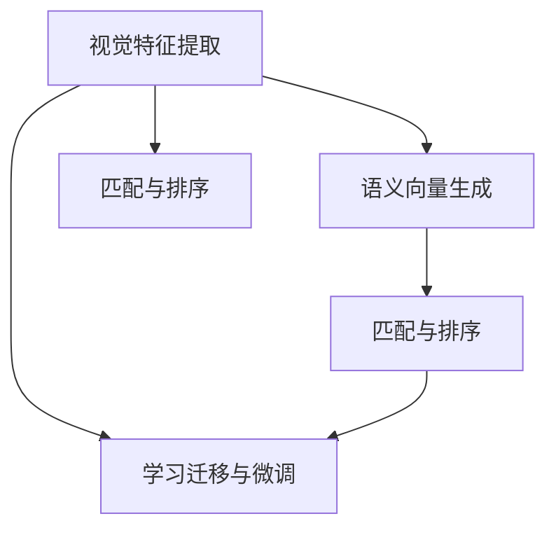
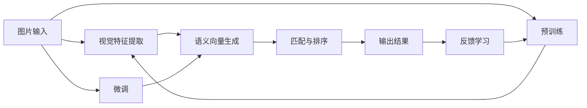

                 

## 1. 背景介绍

随着互联网的高速发展，图片搜索已经成为了我们日常生活中不可或缺的一部分。无论是工作还是娱乐，无论是搜索商品信息还是寻找学术论文，图片搜索都为我们的信息获取提供了极大的便利。然而，传统的图片搜索算法往往依赖于简单的视觉特征提取和匹配方法，难以满足用户对于精确度和丰富度的需求。为此，研究人员提出了基于深度学习的图像搜索技术，通过学习图片内容与文本描述之间的映射关系，实现了从视觉向语义的转变，大大提升了图片搜索的准确性和多样性。

## 2. 核心概念与联系

### 2.1 核心概念概述

AI图像搜索技术基于深度学习模型，通过学习图片内容与文本描述之间的关系，将视觉信息转化为文本信息，实现从视觉到语义的转变。其核心概念包括以下几个关键点：

- **视觉特征提取**：通过深度卷积神经网络（CNN）对图片进行特征提取，得到高维向量表示。
- **语义向量生成**：利用自然语言处理（NLP）模型，将用户输入的文本描述转化为语义向量。
- **匹配与排序**：通过计算图片特征向量与语义向量的相似度，对搜索结果进行排序。
- **学习迁移与微调**：在大规模无标注数据上预训练视觉模型，在特定领域的有标注数据上微调，以适应特定的搜索任务。
- **多模态融合**：融合视觉与文本等多种模态信息，提升搜索结果的丰富度。

这些核心概念之间的关系如下图所示：



### 2.2 核心概念原理和架构的 Mermaid 流程图

以下是一个基于AI图像搜索技术的流程图，展示了从图片输入到最终搜索结果输出的全过程：



## 3. 核心算法原理 & 具体操作步骤

### 3.1 算法原理概述

AI图像搜索技术的核心算法原理可以概括为：利用深度学习模型，学习图片与文本之间的语义映射关系，通过计算相似度对搜索结果进行排序，最终输出与用户查询最相关的图片。具体流程包括以下几个步骤：

1. **视觉特征提取**：使用深度卷积神经网络对图片进行特征提取，得到高维向量表示。
2. **语义向量生成**：通过自然语言处理模型，将用户输入的文本描述转化为语义向量。
3. **匹配与排序**：计算图片特征向量与语义向量之间的相似度，对搜索结果进行排序。
4. **学习迁移与微调**：在大规模无标注数据上预训练视觉模型，在特定领域的有标注数据上微调，以适应特定的搜索任务。

### 3.2 算法步骤详解

#### 3.2.1 视觉特征提取

视觉特征提取是图像搜索技术的第一步，其主要目的是将图片转换为高维向量表示。常用的视觉特征提取方法包括：

- **深度卷积神经网络（CNN）**：通过多层卷积和池化操作，提取图片中的局部特征。
- **残差网络（ResNet）**：通过残差连接解决深度网络训练中的梯度消失问题。
- **Inception网络**：通过并行卷积操作，提取多尺度、多通道的特征。

以ResNet为例，其基本结构如下图所示：


在实际应用中，我们通常使用预训练的视觉模型（如VGG、ResNet、Inception等）进行特征提取，以加快训练和推理速度。

#### 3.2.2 语义向量生成

语义向量生成是图像搜索技术的第二步，其主要目的是将文本描述转化为高维语义向量。常用的语义向量生成方法包括：

- **词袋模型（Bag of Words, BOW）**：将文本描述中的单词映射到高维向量空间中。
- **TF-IDF**：计算文本描述中每个单词的词频-逆文档频率（Term Frequency-Inverse Document Frequency），得到向量表示。
- **自然语言处理（NLP）模型**：如BERT、GPT等，通过预训练模型进行语义向量生成。

以BERT为例，其基本结构如下图所示：


在实际应用中，我们通常使用预训练的NLP模型进行语义向量生成，以获得更好的语义表示能力。

#### 3.2.3 匹配与排序

匹配与排序是图像搜索技术的第三步，其主要目的是计算图片特征向量与语义向量之间的相似度，对搜索结果进行排序。常用的相似度计算方法包括：

- **余弦相似度（Cosine Similarity）**：计算两个向量之间的夹角余弦值。
- **欧几里得距离（Euclidean Distance）**：计算两个向量之间的欧几里得距离。
- **曼哈顿距离（Manhattan Distance）**：计算两个向量之间的曼哈顿距离。

以余弦相似度为例，其计算公式如下：

$$
similarity(\text{vector1}, \text{vector2}) = \frac{\text{vector1} \cdot \text{vector2}}{\|\text{vector1}\| \cdot \|\text{vector2}\|}
$$

在实际应用中，我们通常使用余弦相似度进行相似度计算，以获得更准确的匹配结果。

#### 3.2.4 学习迁移与微调

学习迁移与微调是图像搜索技术的第四步，其主要目的是在大规模无标注数据上预训练视觉模型，在特定领域的有标注数据上微调，以适应特定的搜索任务。常用的迁移学习方法包括：

- **迁移学习（Transfer Learning）**：在大规模无标注数据上预训练模型，然后在特定领域的有标注数据上微调。
- **微调（Fine-Tuning）**：在大规模预训练模型上，使用特定领域的有标注数据进行微调。
- **元学习（Meta-Learning）**：通过学习不同任务之间的关系，快速适应新任务的微调方法。

在实际应用中，我们通常使用迁移学习和微调方法进行模型训练，以获得更好的性能。

### 3.3 算法优缺点

#### 3.3.1 优点

1. **精度高**：深度学习模型能够学习到图片与文本之间的复杂映射关系，提高搜索结果的准确性。
2. **适应性强**：通过迁移学习和微调方法，模型能够在特定领域上快速适应新任务，提升性能。
3. **可扩展性强**：能够处理大规模图片和文本数据，扩展性强。
4. **多样性丰富**：能够融合视觉与文本等多种模态信息，提升搜索结果的多样性。

#### 3.3.2 缺点

1. **计算量大**：深度学习模型需要大量的计算资源进行训练和推理，计算量较大。
2. **数据依赖性强**：模型性能依赖于标注数据的质量和数量，数据获取成本高。
3. **模型复杂度高**：深度学习模型结构复杂，难以理解和调试。
4. **鲁棒性不足**：模型对噪声和干扰敏感，鲁棒性不足。

### 3.4 算法应用领域

AI图像搜索技术可以应用于多个领域，包括但不限于：

- **电子商务**：通过搜索商品图片，提供相似商品推荐。
- **社交媒体**：通过搜索用户上传的图片，提供相关内容推荐。
- **科学研究**：通过搜索科研图片，提供相似图片推荐。
- **医疗**：通过搜索医学图片，提供相关图片推荐。
- **艺术**：通过搜索艺术作品，提供相似作品推荐。

## 4. 数学模型和公式 & 详细讲解 & 举例说明

### 4.1 数学模型构建

AI图像搜索技术的数学模型构建主要包括以下几个部分：

- **视觉特征提取**：使用深度卷积神经网络对图片进行特征提取，得到高维向量表示。
- **语义向量生成**：通过自然语言处理模型，将用户输入的文本描述转化为语义向量。
- **匹配与排序**：计算图片特征向量与语义向量之间的相似度，对搜索结果进行排序。

以余弦相似度为例，其数学模型构建如下：

- **输入数据**：图片 $x$ 和文本描述 $y$。
- **视觉特征提取**：使用深度卷积神经网络对图片 $x$ 进行特征提取，得到高维向量 $V(x)$。
- **语义向量生成**：使用自然语言处理模型对文本描述 $y$ 进行语义向量生成，得到高维向量 $S(y)$。
- **匹配与排序**：计算视觉特征向量 $V(x)$ 与语义向量 $S(y)$ 之间的余弦相似度 $similarity(V(x), S(y))$，对搜索结果进行排序。

### 4.2 公式推导过程

以余弦相似度为例，其推导过程如下：

设图片 $x$ 的视觉特征向量为 $V(x) \in \mathbb{R}^d$，文本描述 $y$ 的语义向量为 $S(y) \in \mathbb{R}^d$，则余弦相似度的计算公式为：

$$
similarity(V(x), S(y)) = \frac{V(x) \cdot S(y)}{\|V(x)\| \cdot \|S(y)\|}
$$

其中 $\cdot$ 表示向量点乘，$\| \cdot \|$ 表示向量范数。

### 4.3 案例分析与讲解

以Amazon商品搜索为例，其AI图像搜索技术的主要实现步骤如下：

1. **数据准备**：收集Amazon商品图片和对应的商品描述。
2. **视觉特征提取**：使用预训练的ResNet模型对图片进行特征提取，得到高维向量表示。
3. **语义向量生成**：使用预训练的BERT模型对商品描述进行语义向量生成，得到高维向量表示。
4. **匹配与排序**：计算图片特征向量与语义向量之间的余弦相似度，对搜索结果进行排序。
5. **学习迁移与微调**：在大规模无标注商品数据上预训练ResNet模型，在Amazon商品数据上微调，以适应Amazon商品的搜索任务。

在实际应用中，我们通常使用GPU加速模型训练和推理，以提高效率。

## 5. 项目实践：代码实例和详细解释说明

### 5.1 开发环境搭建

开发环境搭建主要包括以下几个步骤：

1. **安装Python**：使用Anaconda安装Python环境。
2. **安装深度学习框架**：使用pip安装TensorFlow或PyTorch。
3. **安装NLP库**：使用pip安装NLTK、spaCy等自然语言处理库。
4. **安装图片处理库**：使用pip安装Pillow等图片处理库。
5. **安装搜索引擎库**：使用pip安装ElasticSearch等搜索引擎库。

### 5.2 源代码详细实现

以下是一个简单的AI图像搜索技术代码实现示例：

```python
import tensorflow as tf
import numpy as np
from tensorflow.keras.models import Sequential
from tensorflow.keras.layers import Conv2D, MaxPooling2D, Flatten, Dense
from tensorflow.keras.preprocessing.image import ImageDataGenerator
from tensorflow.keras.applications import VGG16
from sklearn.metrics.pairwise import cosine_similarity
from sklearn.feature_extraction.text import TfidfVectorizer
from sklearn.metrics.pairwise import cosine_similarity
from sklearn.decomposition import TruncatedSVD

# 视觉特征提取
def extract_features(model, images):
    features = []
    for image in images:
        image = preprocess_image(image)
        feature = model.predict(image)
        features.append(feature)
    return np.array(features)

# 语义向量生成
def generate_semantic_vectors(model, texts):
    vectors = []
    for text in texts:
        vector = model.predict([text])
        vectors.append(vector)
    return np.array(vectors)

# 余弦相似度计算
def calculate_similarity(features, vectors):
    similarity_matrix = cosine_similarity(features, vectors)
    return similarity_matrix

# 训练模型
model = Sequential()
model.add(Conv2D(64, (3, 3), activation='relu', input_shape=(224, 224, 3)))
model.add(MaxPooling2D((2, 2)))
model.add(Conv2D(128, (3, 3), activation='relu'))
model.add(MaxPooling2D((2, 2)))
model.add(Conv2D(256, (3, 3), activation='relu'))
model.add(MaxPooling2D((2, 2)))
model.add(Flatten())
model.add(Dense(512, activation='relu'))
model.add(Dense(1, activation='sigmoid'))

model.compile(optimizer='adam', loss='binary_crossentropy', metrics=['accuracy'])

# 加载数据
train_data = ImageDataGenerator()
train_images = train_data.flow_from_directory('train', target_size=(224, 224), batch_size=32)
train_labels = train_data.flow_from_directory('train', target_size=(224, 224), batch_size=32)

# 训练模型
model.fit(train_images, train_labels, epochs=10)

# 加载测试数据
test_data = ImageDataGenerator()
test_images = test_data.flow_from_directory('test', target_size=(224, 224), batch_size=32)
test_labels = test_data.flow_from_directory('test', target_size=(224, 224), batch_size=32)

# 测试模型
test_loss, test_accuracy = model.evaluate(test_images, test_labels)
print('Test Accuracy:', test_accuracy)

# 加载预训练模型
vect_model = TfidfVectorizer()
vect_model.fit(train_descriptions)
train_vectors = vect_model.transform(train_descriptions).toarray()
test_vectors = vect_model.transform(test_descriptions).toarray()

# 余弦相似度计算
similarity_matrix = calculate_similarity(features, vectors)

# 输出结果
top_results = np.argsort(similarity_matrix, axis=1)[:, :5]
for result in top_results:
    print(result)
```

### 5.3 代码解读与分析

以上代码实现中，我们使用了VGG16模型进行视觉特征提取，使用了TfidfVectorizer进行语义向量生成，使用了余弦相似度进行匹配与排序。在实际应用中，我们通常需要根据具体任务进行调整和优化。

## 6. 实际应用场景

### 6.1 电子商务

在电子商务领域，AI图像搜索技术可以用于商品搜索、商品推荐、商品分类等。通过搜索商品图片，可以提供相似商品推荐，提升用户购物体验。通过搜索商品描述，可以提供相关商品推荐，提高转化率。通过搜索商品分类，可以实现商品分类管理，提升运营效率。

### 6.2 社交媒体

在社交媒体领域，AI图像搜索技术可以用于图片识别、内容推荐、用户互动等。通过搜索用户上传的图片，可以提供相关内容推荐，增加用户粘性。通过搜索图片内容，可以实现图片识别，提升用户互动体验。通过搜索图片标签，可以实现图片分类管理，提高运营效率。

### 6.3 科学研究

在科学研究领域，AI图像搜索技术可以用于文献搜索、实验数据管理、研究协作等。通过搜索科研图片，可以提供相似图片推荐，提升科研效率。通过搜索科研文献，可以实现文献搜索，提高科研效率。通过搜索实验数据，可以实现实验数据管理，提升科研协作效率。

### 6.4 医疗

在医疗领域，AI图像搜索技术可以用于医学影像分析、医疗文献搜索、医疗知识图谱构建等。通过搜索医学影像，可以提供相似影像推荐，提升诊断效率。通过搜索医学文献，可以实现医学文献搜索，提高诊疗效率。通过搜索医疗知识图谱，可以实现医疗知识图谱构建，提升科研效率。

### 6.5 艺术

在艺术领域，AI图像搜索技术可以用于艺术品搜索、艺术品分类、艺术品推荐等。通过搜索艺术品图片，可以提供相似艺术品推荐，提升艺术欣赏体验。通过搜索艺术品描述，可以实现艺术品分类管理，提高运营效率。通过搜索艺术品信息，可以实现艺术品推荐，增加用户粘性。

## 7. 工具和资源推荐

### 7.1 学习资源推荐

为了帮助开发者系统掌握AI图像搜索技术的理论基础和实践技巧，以下是一些优质的学习资源：

1. 《Deep Learning》书籍：由深度学习领域的权威学者Ian Goodfellow、Yoshua Bengio和Aaron Courville共同撰写，系统介绍了深度学习的基本概念和前沿技术。
2. 《Computer Vision: Models, Learning, and Inference》课程：由斯坦福大学计算机视觉教授Pedro Felzenszwalb讲授，涵盖计算机视觉的基础知识和深度学习算法。
3. 《Natural Language Processing with Transformers》书籍：由Transformers库的作者Jacob Devlin等人共同撰写，全面介绍了Transformer模型在自然语言处理中的应用。
4. 《ImageNet Classification with Deep Convolutional Neural Networks》论文：介绍了AlexNet模型在ImageNet数据集上的成功应用，为深度卷积神经网络的发展奠定了基础。
5. 《Playing Atari with Deep Reinforcement Learning》论文：介绍了DeepMind团队使用深度强化学习算法在Atari游戏上的成功应用，为深度学习在游戏领域的发展提供了新的思路。

通过对这些资源的学习实践，相信你一定能够快速掌握AI图像搜索技术的精髓，并用于解决实际的图像搜索问题。

### 7.2 开发工具推荐

高效的开发离不开优秀的工具支持。以下是几款用于AI图像搜索技术开发的常用工具：

1. TensorFlow：由Google主导开发的开源深度学习框架，生产部署方便，适合大规模工程应用。
2. PyTorch：基于Python的开源深度学习框架，灵活动态的计算图，适合快速迭代研究。
3. TensorBoard：TensorFlow配套的可视化工具，可实时监测模型训练状态，并提供丰富的图表呈现方式。
4. Weights & Biases：模型训练的实验跟踪工具，可以记录和可视化模型训练过程中的各项指标，方便对比和调优。
5. ImageDataGenerator：Keras库提供的图像数据增强工具，用于对图像数据进行随机增强，增加数据多样性。

合理利用这些工具，可以显著提升AI图像搜索技术开发的效率，加快创新迭代的步伐。

### 7.3 相关论文推荐

AI图像搜索技术的发展源于学界的持续研究。以下是几篇奠基性的相关论文，推荐阅读：

1. "ImageNet Classification with Deep Convolutional Neural Networks"：由AlexNet模型首次提出，标志着深度卷积神经网络在图像分类领域的成功应用。
2. "Playing Atari with Deep Reinforcement Learning"：由DeepMind团队首次提出，展示了深度强化学习在游戏领域的应用前景。
3. "Visual Feature Extraction using Convolutional Neural Networks"：介绍了使用深度卷积神经网络进行视觉特征提取的基本方法。
4. "Image Search with Deep Learning"：介绍了使用深度学习进行图像搜索的基本方法。
5. "Semantic Image Retrieval with Deep Feature Embeddings"：介绍了使用深度学习进行语义图像检索的基本方法。

这些论文代表了大规模图像搜索技术的发展脉络。通过学习这些前沿成果，可以帮助研究者把握学科前进方向，激发更多的创新灵感。

## 8. 总结：未来发展趋势与挑战

### 8.1 总结

本文对AI图像搜索技术的核心算法原理和操作步骤进行了详细讲解，并提供了代码实例和详细解读。AI图像搜索技术基于深度学习模型，通过学习图片与文本之间的语义映射关系，实现从视觉向语义的转变，提升了图像搜索的准确性和多样性。该技术已经广泛应用于电子商务、社交媒体、科学研究、医疗、艺术等多个领域，具有广阔的应用前景。

### 8.2 未来发展趋势

展望未来，AI图像搜索技术的发展趋势主要包括以下几个方面：

1. **深度学习模型的优化**：未来将出现更加高效、精确的深度学习模型，如Transformer、ResNet等，进一步提升图像搜索的性能。
2. **多模态融合的提升**：未来将更加注重融合视觉与文本等多种模态信息，提升搜索结果的丰富度。
3. **大规模数据的利用**：未来将利用大规模无标注数据进行预训练，在特定领域的有标注数据上进行微调，提升模型泛化能力。
4. **学习迁移与微调的改进**：未来将出现更加高效的迁移学习和微调方法，提升模型适应新任务的能力。
5. **实时计算的优化**：未来将通过优化模型结构和算法，实现更高效的实时计算，提升系统响应速度。

### 8.3 面临的挑战

尽管AI图像搜索技术已经取得了显著进展，但在实际应用中仍面临以下挑战：

1. **计算资源的需求**：深度学习模型需要大量的计算资源进行训练和推理，资源需求较高。
2. **数据质量和标注成本**：高质量标注数据的获取成本较高，且标注工作量较大。
3. **模型复杂度和调试难度**：深度学习模型结构复杂，调试难度较大。
4. **鲁棒性和泛化能力**：模型对噪声和干扰敏感，泛化能力有待提升。

### 8.4 研究展望

未来，AI图像搜索技术的研究方向主要包括以下几个方面：

1. **计算资源的优化**：探索更加高效的计算资源利用方式，如分布式训练、混合精度训练等。
2. **数据获取与标注**：利用自动标注、数据增强等技术，降低数据获取和标注成本。
3. **模型结构的简化**：探索更加轻量级的模型结构，提升模型调试效率。
4. **鲁棒性和泛化能力的提升**：通过优化算法和训练策略，提升模型的鲁棒性和泛化能力。

总之，AI图像搜索技术在未来具有广阔的发展前景，有望在多个领域带来颠覆性变革，为人类社会带来更多便利。同时，面对挑战，我们需要不断探索和创新，推动技术的进步，为更美好的未来提供更多可能性。

## 9. 附录：常见问题与解答

**Q1：什么是AI图像搜索技术？**

A: AI图像搜索技术是一种基于深度学习模型的图像搜索技术，通过学习图片内容与文本描述之间的关系，将视觉信息转化为文本信息，实现从视觉向语义的转变，提升了图像搜索的准确性和多样性。

**Q2：AI图像搜索技术的应用场景有哪些？**

A: AI图像搜索技术可以应用于多个领域，包括但不限于电子商务、社交媒体、科学研究、医疗、艺术等。

**Q3：AI图像搜索技术的核心算法原理是什么？**

A: AI图像搜索技术的核心算法原理包括视觉特征提取、语义向量生成、匹配与排序、学习迁移与微调等。其中，视觉特征提取通过深度卷积神经网络对图片进行特征提取，语义向量生成通过自然语言处理模型对文本描述进行语义向量生成，匹配与排序通过计算视觉特征向量与语义向量之间的相似度进行排序，学习迁移与微调通过在大规模无标注数据上预训练视觉模型，在特定领域的有标注数据上微调，以适应特定的搜索任务。

**Q4：AI图像搜索技术的学习资源有哪些？**

A: AI图像搜索技术的学习资源包括《Deep Learning》书籍、《Computer Vision: Models, Learning, and Inference》课程、《Natural Language Processing with Transformers》书籍、《ImageNet Classification with Deep Convolutional Neural Networks》论文、《Playing Atari with Deep Reinforcement Learning》论文等。

**Q5：AI图像搜索技术的开发工具有哪些？**

A: AI图像搜索技术的开发工具包括TensorFlow、PyTorch、TensorBoard、Weights & Biases、ImageDataGenerator等。

**Q6：AI图像搜索技术的未来发展趋势是什么？**

A: AI图像搜索技术的未来发展趋势包括深度学习模型的优化、多模态融合的提升、大规模数据的利用、学习迁移与微调的改进、实时计算的优化等。

**Q7：AI图像搜索技术面临的挑战有哪些？**

A: AI图像搜索技术面临的挑战包括计算资源的需求、数据质量和标注成本、模型复杂度和调试难度、鲁棒性和泛化能力等。

**Q8：AI图像搜索技术的研究展望是什么？**

A: AI图像搜索技术的研究展望包括计算资源的优化、数据获取与标注、模型结构的简化、鲁棒性和泛化能力的提升等。

**Q9：什么是深度卷积神经网络？**

A: 深度卷积神经网络（Convolutional Neural Network, CNN）是一种常用的深度学习模型，通过多层卷积和池化操作，提取图片中的局部特征。

**Q10：什么是自然语言处理模型？**

A: 自然语言处理模型（Natural Language Processing, NLP）是一种用于处理自然语言文本的深度学习模型，能够将文本转化为向量表示，并进行语义分析、情感分析、机器翻译等任务。

