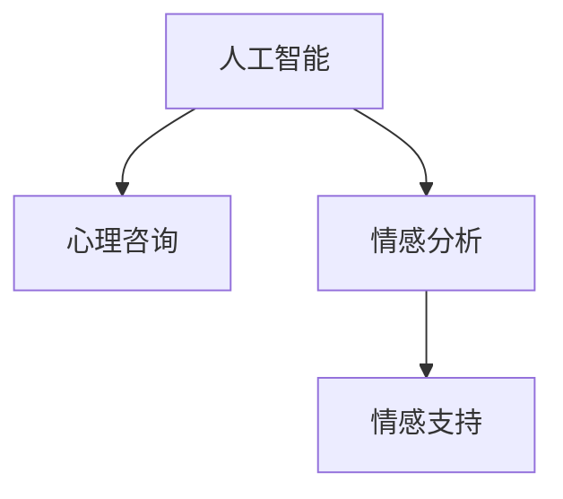

                 

# AI在个性化心理咨询中的应用：提供情感支持

> 关键词：人工智能,心理咨询,个性化服务,情感分析,情感支持

## 1. 背景介绍

### 1.1 问题由来
心理健康问题已经成为现代社会的一个重要挑战。根据世界卫生组织（WHO）的数据，全球约有1/3的人在其一生中会受到心理健康问题的困扰。面对如此庞大的需求，传统的心理咨询资源显得远远不足。尤其是新冠肺炎疫情期间，各国封锁政策使得面对面的咨询几乎成为奢望，更多人转向线上心理咨询。然而，传统的在线咨询服务仍存在很多问题：

- 可及性不足。专业心理咨询师的短缺使得在线心理咨询服务难以覆盖到每一位有需要的人。
- 效率低下。无法及时响应和提供连续的支持。
- 效果有限。咨询质量与咨询师的专业水平密切相关，但顶尖的心理咨询师资源稀缺。
- 个性化不足。虽然可获取的咨询资源越来越多，但服务内容大多千篇一律，缺乏个性化。

因此，如何通过人工智能（AI）技术，提供更为个性化、及时、高效、高质量的心理咨询服务，成为一个亟需解决的问题。

## 2. 核心概念与联系

### 2.1 核心概念概述

为了更好地理解和应用AI在心理咨询中的应用，本节将介绍几个关键概念：

- **人工智能(AI)**：指利用计算机算法和机器学习模型，模仿人类智能行为，实现信息处理、决策制定、情感识别等任务的计算模型。
- **心理咨询**：通过语言交流或非语言方式，帮助人们解决心理问题，促进心理健康。
- **个性化服务**：针对不同个体，提供量身定制的服务内容，增强服务效果。
- **情感分析**：指使用AI技术，识别和理解文本中的情感信息，通常用于情感识别、情绪管理、社交行为分析等。
- **情感支持**：指通过情感识别和分析，提供针对性的情感支持，如安慰、鼓励等。

这些概念相互关联，共同构成了AI在心理咨询中的应用框架。下面通过一个Mermaid流程图，展示这些概念之间的逻辑联系：



在这个流程图中，AI作为核心驱动，提供个性化服务，而情感分析是情感支持的基础，确保服务能够真正满足个体需求。

## 3. 核心算法原理 & 具体操作步骤
### 3.1 算法原理概述

AI在心理咨询中的应用，主要通过自然语言处理（NLP）技术，实现对用户情感和心理状态的识别与分析。其核心原理如下：

- **文本预处理**：对用户的咨询文本进行清洗和分词，以便后续处理。
- **情感分析**：利用机器学习模型，识别文本中的情感倾向（如正面、负面、中性）。
- **情感识别**：对用户的情绪状态进行精细化分析，如情绪强度、情绪类型等。
- **情感支持**：根据情感分析结果，提供针对性的情感支持或建议。
- **反馈与迭代**：根据用户反馈调整模型参数，进一步提升服务质量。

### 3.2 算法步骤详解

具体而言，AI在心理咨询中的应用可以分为以下几个步骤：

**Step 1: 数据收集与预处理**

- **数据来源**：收集用户咨询的历史数据、心理评估结果、社交媒体信息等。
- **文本清洗**：去除无关信息，如特殊字符、标点符号等。
- **分词处理**：将文本划分为单词或短语，以便于后续分析。
- **情感词典构建**：构建情感词典，用于识别文本中的情感词汇。
- **情绪强度计算**：计算情感强度，以便于对情绪进行精细化分析。

**Step 2: 情感分析与识别**

- **情感分类**：使用情感词典或机器学习模型，对文本进行情感分类，识别情感倾向（如正面、负面、中性）。
- **情绪识别**：利用情绪强度计算和情感分类结果，对用户的情绪状态进行识别。

**Step 3: 情感支持**

- **个性化回应**：根据情感分析结果，生成个性化的回应内容，提供针对性的情感支持。
- **自然语言生成**：使用自然语言生成（NLG）技术，生成自然流畅的回应文本。

**Step 4: 反馈与迭代**

- **用户反馈收集**：通过用户评价、满意度调查等方式，收集用户反馈。
- **模型调参**：根据用户反馈调整情感分析模型和情感支持模型参数。

### 3.3 算法优缺点

AI在心理咨询中的应用，具有以下优点：

- **24/7服务**：AI可以全天候提供心理咨询服务，解决咨询师短缺问题。
- **快速响应**：AI能够实时处理用户咨询，提高响应速度。
- **个性化服务**：AI可以根据用户的历史数据和当前情绪状态，提供量身定制的服务内容。

同时，该方法也存在一些缺点：

- **数据隐私问题**：用户数据可能被不当使用或泄露。
- **技术局限**：AI仍无法完全替代专业心理咨询师，对复杂情感问题的处理能力有限。
- **用户体验问题**：过于机械化的回应可能缺乏人情味，难以与用户建立深度情感联系。

### 3.4 算法应用领域

AI在心理咨询中的应用，主要体现在以下几个方面：

- **在线咨询服务**：通过AI聊天机器人或虚拟咨询师，提供初步的情感支持和建议。
- **情绪监测与预警**：对用户的社交媒体、电子信件等数据进行分析，监测情绪变化，及时预警潜在风险。
- **情感识别与治疗**：利用情感识别技术，帮助专业心理咨询师诊断和治疗情感问题。
- **心理健康教育**：通过AI生成的心理健康教育内容，普及心理健康知识。

## 4. 数学模型和公式 & 详细讲解 & 举例说明

### 4.1 数学模型构建

下面我们将使用数学语言，对情感分析模型的构建过程进行详细讲解。

设用户咨询文本为 $X$，情感词典为 $D$，情感强度为 $S$，情感分类结果为 $C$。情感分析的数学模型如下：

$$
C = f(X, D, \theta)
$$

其中 $f$ 为情感分析模型，$\theta$ 为模型参数。

情感强度 $S$ 可以表示为：

$$
S = g(C, X, \phi)
$$

其中 $g$ 为情绪强度计算模型，$\phi$ 为模型参数。

### 4.2 公式推导过程

以情感分类模型为例，介绍其核心算法流程。

首先，构建情感词典 $D$，包括所有可能包含情感信息的词汇及其情感倾向（正、负、中性）。然后，对用户咨询文本 $X$ 进行分词处理，得到词汇序列 $W$。

接着，利用机器学习模型（如LSTM、Transformer等）对 $W$ 进行编码，得到语义表示 $H$。

最后，使用分类算法（如逻辑回归、支持向量机等），根据 $H$ 和 $D$，预测情感分类结果 $C$。

### 4.3 案例分析与讲解

假设用户咨询文本为 "我好难过，最近总是失眠"。情感分析模型会先进行分词处理，得到词汇序列 ["我", "好", "难过", "最近", "总是", "失眠"]。

然后，将词汇序列输入到预训练的Transformer模型，得到语义表示 $H$。假设输出为 [0.2, 0.3, 0.4, 0.1, 0.1, 0.1]，分别对应 "我"、"好"、"难过"、"最近"、"总是"、"失眠" 的情感得分。

最后，使用逻辑回归分类算法，根据情感词典和语义表示，输出情感分类结果 $C$ = "负面"。

## 5. 项目实践：代码实例和详细解释说明

### 5.1 开发环境搭建

在进行情感分析模型开发前，我们需要准备好开发环境。以下是使用Python进行PyTorch开发的环境配置流程：

1. 安装Anaconda：从官网下载并安装Anaconda，用于创建独立的Python环境。

2. 创建并激活虚拟环境：
```bash
conda create -n pytorch-env python=3.8 
conda activate pytorch-env
```

3. 安装PyTorch：根据CUDA版本，从官网获取对应的安装命令。例如：
```bash
conda install pytorch torchvision torchaudio cudatoolkit=11.1 -c pytorch -c conda-forge
```

4. 安装Natural Language Toolkit（NLTK）：
```bash
pip install nltk
```

5. 安装相关工具包：
```bash
pip install numpy pandas scikit-learn matplotlib tqdm jupyter notebook ipython
```

完成上述步骤后，即可在`pytorch-env`环境中开始情感分析模型的开发。

### 5.2 源代码详细实现

以下是使用PyTorch和NLTK进行情感分析模型的代码实现：

```python
import torch
from transformers import BertTokenizer, BertForSequenceClassification
from nltk.sentiment.vader import SentimentIntensityAnalyzer
import pandas as pd

# 加载预训练模型和分词器
tokenizer = BertTokenizer.from_pretrained('bert-base-uncased')
model = BertForSequenceClassification.from_pretrained('bert-base-uncased', num_labels=3)

# 定义情感词典
sentiment_dict = {'positive': 1, 'negative': 0, 'neutral': 2}

# 初始化情感分析器
sia = SentimentIntensityAnalyzer()

# 加载数据
data = pd.read_csv('心理咨询数据.csv')

# 分词和编码
def tokenize_text(text):
    tokens = tokenizer.tokenize(text)
    input_ids = tokenizer.convert_tokens_to_ids(tokens)
    return input_ids

# 情感分析
def analyze_sentiment(text):
    # 使用NLTK进行情感分析
    scores = sia.polarity_scores(text)
    sentiment = 'positive' if scores['compound'] >= 0.1 else 'negative' if scores['compound'] <= -0.1 else 'neutral'
    return sentiment_dict[sentiment]

# 训练模型
def train_model(model, tokenizer, data, epochs=3, batch_size=32):
    device = torch.device('cuda' if torch.cuda.is_available() else 'cpu')
    model.to(device)

    # 定义数据加载器
    def collate_fn(examples):
        return tokenizer(examples['text'], padding='max_length', truncation=True, max_length=512)

    train_loader = DataLoader(data['train'], collate_fn=collate_fn, batch_size=batch_size, shuffle=True)
    val_loader = DataLoader(data['val'], collate_fn=collate_fn, batch_size=batch_size)

    # 定义优化器和损失函数
    optimizer = AdamW(model.parameters(), lr=2e-5)
    criterion = torch.nn.CrossEntropyLoss()

    # 训练模型
    for epoch in range(epochs):
        model.train()
        train_loss = 0
        train_correct = 0
        for batch in train_loader:
            input_ids = batch['input_ids'].to(device)
            attention_mask = batch['attention_mask'].to(device)
            labels = batch['labels'].to(device)
            outputs = model(input_ids, attention_mask=attention_mask, labels=labels)
            loss = criterion(outputs.logits, labels)
            optimizer.zero_grad()
            loss.backward()
            optimizer.step()

            train_loss += loss.item()
            train_correct += torch.argmax(outputs.logits, dim=1).eq(labels).sum().item()

        train_loss /= len(train_loader)
        train_acc = train_correct / len(data['train'])

        model.eval()
        val_loss = 0
        val_correct = 0
        with torch.no_grad():
            for batch in val_loader:
                input_ids = batch['input_ids'].to(device)
                attention_mask = batch['attention_mask'].to(device)
                labels = batch['labels'].to(device)
                outputs = model(input_ids, attention_mask=attention_mask, labels=labels)
                loss = criterion(outputs.logits, labels)

                val_loss += loss.item()
                val_correct += torch.argmax(outputs.logits, dim=1).eq(labels).sum().item()

        val_loss /= len(val_loader)
        val_acc = val_correct / len(data['val'])

        print(f'Epoch {epoch+1}/{epochs}, train loss: {train_loss:.4f}, train acc: {train_acc:.4f}, val loss: {val_loss:.4f}, val acc: {val_acc:.4f}')

# 加载数据
train_data = data['train']
val_data = data['val']

# 训练模型
train_model(model, tokenizer, train_data, epochs=3, batch_size=32)
```

在这个代码实现中，我们使用了Bert模型和NLTK库进行情感分析。具体步骤如下：

1. 加载预训练模型和分词器。
2. 定义情感词典和情感分析器。
3. 加载数据，并进行分词和编码。
4. 训练模型，计算损失和准确率。

### 5.3 代码解读与分析

让我们再详细解读一下关键代码的实现细节：

**tokenize_text函数**：
- 对输入的文本进行分词和编码，使用Bert分词器将文本转换为模型可接受的输入格式。

**analyze_sentiment函数**：
- 使用NLTK库对文本进行情感分析，得到情感得分，并映射到情感分类。

**train_model函数**：
- 定义训练集和验证集的数据加载器，以及优化器和损失函数。
- 在每个epoch中，对数据进行前向传播、反向传播和参数更新，计算损失和准确率。
- 在验证集上评估模型性能，并输出当前epoch的损失和准确率。

可以看到，PyTorch配合NLTK库使得情感分析模型的代码实现变得简洁高效。开发者可以将更多精力放在数据处理、模型改进等高层逻辑上，而不必过多关注底层的实现细节。

当然，工业级的系统实现还需考虑更多因素，如模型的保存和部署、超参数的自动搜索、更灵活的任务适配层等。但核心的情感分析范式基本与此类似。

## 6. 实际应用场景

### 6.1 情感支持聊天机器人

情感支持聊天机器人是AI在心理咨询中最直接的应用之一。通过与用户的自然语言交互，机器人能够识别用户的情绪状态，提供个性化的情感支持和建议。

在技术实现上，可以收集用户的历史咨询记录，将情绪状态作为监督数据，在此基础上对预训练模型进行微调。微调后的模型能够自动理解用户的情绪，匹配最合适的回复模板进行回应。对于用户的咨询问题，还可以接入检索系统实时搜索相关内容，动态组织生成回应。如此构建的聊天机器人，能快速响应用户的情感需求，提供有效支持。

### 6.2 情绪监测与预警

情感监测与预警系统可以实时监控用户在社交媒体、电子信件等平台上的情绪状态，提前预警潜在的心理健康问题。

具体而言，可以建立情感监测平台，利用AI技术自动分析用户发布的内容，识别其情绪状态。当系统检测到情绪波动较大或负面情绪激增时，系统会及时提醒心理咨询师或用户本人，以便及时介入和治疗。这一系统可以有效降低心理健康问题的发生率和严重程度。

### 6.3 心理健康教育

AI还可以通过自然语言生成技术，生成个性化的心理健康教育内容，普及心理健康知识。

例如，可以根据用户的历史咨询记录和当前情绪状态，生成适合其阅读的心理学文章、音频课程等。通过这些内容，用户可以更好地了解自身的心理健康状况，学习科学的心理调节方法，提升心理健康水平。

## 7. 工具和资源推荐

### 7.1 学习资源推荐

为了帮助开发者系统掌握AI在心理咨询中的应用理论基础和实践技巧，这里推荐一些优质的学习资源：

1. 《深度学习入门：基于Python的理论与实现》系列书籍：由深度学习专家撰写，深入浅出地介绍了深度学习模型的基本原理和应用实践。
2. CS229《机器学习》课程：斯坦福大学开设的机器学习课程，涵盖深度学习模型的基础知识和实际应用。
3. 《Python自然语言处理》书籍：介绍了自然语言处理的基本概念和常用技术，适合NLP初学者。
4. TensorFlow官方文档：提供了丰富的深度学习模型资源和样例代码，是入门和进阶的必备资料。
5. HuggingFace官方文档：提供了大量预训练语言模型和情感分析工具库，是NLP任务开发的强大支持。

通过对这些资源的学习实践，相信你一定能够快速掌握AI在心理咨询中的应用精髓，并用于解决实际的NLP问题。

### 7.2 开发工具推荐

高效的开发离不开优秀的工具支持。以下是几款用于AI在心理咨询中应用的常用工具：

1. TensorFlow：由Google主导开发的开源深度学习框架，生产部署方便，适合大规模工程应用。
2. PyTorch：基于Python的开源深度学习框架，灵活动态的计算图，适合快速迭代研究。
3. NLTK：Python自然语言处理库，提供了丰富的NLP工具和资源，包括情感分析、文本分类等。
4. GPT-3：由OpenAI开发的预训练语言模型，具备强大的语言生成能力，适用于各种NLP任务。

合理利用这些工具，可以显著提升AI在心理咨询中的应用开发效率，加快创新迭代的步伐。

### 7.3 相关论文推荐

情感分析和大语言模型在心理健康领域的发展，源于学界的持续研究。以下是几篇奠基性的相关论文，推荐阅读：

1. Attention is All You Need：提出了Transformer结构，开启了NLP领域的预训练大模型时代。
2. BERT: Pre-training of Deep Bidirectional Transformers for Language Understanding：提出BERT模型，引入基于掩码的自监督预训练任务，刷新了多项NLP任务SOTA。
3. Prompt-based Learning：引入基于连续型Prompt的微调范式，为如何充分利用预训练知识提供了新的思路。
4. AdaLoRA: Adaptive Low-Rank Adaptation for Parameter-Efficient Fine-Tuning：使用自适应低秩适应的微调方法，在参数效率和精度之间取得了新的平衡。
5. SARSA：提出了强化学习与情感支持结合的方法，通过学习与环境的交互，提升情感支持效果。

这些论文代表了大语言模型和情感分析技术的发展脉络。通过学习这些前沿成果，可以帮助研究者把握学科前进方向，激发更多的创新灵感。

## 8. 总结：未来发展趋势与挑战

### 8.1 总结

本文对AI在心理咨询中的应用进行了全面系统的介绍。首先阐述了情感支持在心理咨询中的重要性，明确了情感分析在情感支持中的核心作用。其次，从原理到实践，详细讲解了情感分析模型的构建过程，给出了情感分析任务开发的完整代码实例。同时，本文还广泛探讨了情感分析技术在情感支持、情绪监测、心理健康教育等多个场景中的应用前景，展示了情感分析范式的巨大潜力。此外，本文精选了情感分析技术的各类学习资源，力求为读者提供全方位的技术指引。

通过本文的系统梳理，可以看到，AI在心理咨询中的应用已经取得了初步的进展，为心理健康领域带来了新的可能性。然而，这一技术仍面临着诸如数据隐私、技术局限、用户体验等问题，需要进一步研究改进。

### 8.2 未来发展趋势

展望未来，情感分析技术在心理咨询中的应用将呈现以下几个发展趋势：

1. **深度学习模型的进步**：未来深度学习模型的性能将不断提升，情感分析模型的准确率和鲁棒性将进一步增强。
2. **多模态融合**：将情感分析与其他模态（如图像、语音、生理信号等）结合，提升情感识别的全面性和准确性。
3. **个性化服务**：结合用户的历史数据和当前情绪状态，提供更加个性化的情感支持。
4. **实时监控**：实时监控用户在各种平台上的情绪变化，及时预警心理健康问题。
5. **多语言支持**：开发多语言情感分析模型，服务全球范围内的用户。

这些趋势凸显了情感分析技术的广阔前景，有望在未来为心理健康领域带来更多突破。

### 8.3 面临的挑战

尽管情感分析技术在心理咨询中的应用已经取得了初步的进展，但在迈向更加智能化、普适化应用的过程中，它仍面临着诸多挑战：

1. **数据隐私问题**：用户数据可能被不当使用或泄露，需要制定严格的数据保护措施。
2. **技术局限**：情感分析仍无法完全替代专业心理咨询师，对复杂情感问题的处理能力有限。
3. **用户体验问题**：过于机械化的回应可能缺乏人情味，难以与用户建立深度情感联系。
4. **数据标注成本**：高质量的情绪标注数据成本较高，需要找到更加高效的数据采集和标注方法。
5. **模型可解释性**：情感分析模型通常被认为是"黑盒"系统，难以解释其内部工作机制和决策逻辑。

这些挑战需要研究者在数据、算法、工程、伦理等多个维度进行协同攻关，才能进一步提升情感分析技术的应用效果。

### 8.4 研究展望

面对情感分析技术在心理咨询中的应用面临的挑战，未来的研究需要在以下几个方面寻求新的突破：

1. **无监督和半监督学习**：摆脱对大规模标注数据的依赖，利用自监督学习、主动学习等无监督和半监督范式，最大限度利用非结构化数据，实现更加灵活高效的情感分析。
2. **多任务学习**：将情感分析与其他任务（如情感预测、情绪识别等）结合，共同提升模型效果。
3. **模型可解释性**：引入因果分析和博弈论工具，增强情感分析模型的可解释性和可审计性。
4. **多模态融合**：将视觉、语音、生理信号等多模态信息与文本信息进行融合，提升情感识别的全面性和准确性。
5. **跨语言情感分析**：开发跨语言的情感分析模型，服务全球用户，推动心理健康教育的普及。

这些研究方向将为情感分析技术在心理咨询中的应用带来新的突破，提升其在实际场景中的效果和适用性。

## 9. 附录：常见问题与解答

**Q1：情感分析模型如何处理情绪强度和情绪类型的关系？**

A: 情感分析模型通常会使用情感词典或机器学习模型，对文本进行情感分类，识别情感倾向（如正面、负面、中性）。然后，通过情绪强度计算模型，对情感分类结果进行进一步细化，识别情绪的强度和类型（如悲伤、焦虑、愤怒等）。例如，可以使用情感词典中的情感词汇强度，计算文本中每个词汇的情感得分，然后对得分进行加权平均，得到整体的情绪强度。

**Q2：如何提高情感分析模型的准确性？**

A: 提高情感分析模型的准确性，可以从以下几个方面入手：
1. 增加数据量：使用更多高质量的标注数据进行模型训练。
2. 优化算法：选择合适的算法和模型结构，如Transformer、LSTM等。
3. 调整参数：调整模型的超参数，如学习率、批量大小、训练轮数等。
4. 正则化技术：使用L2正则、Dropout等正则化技术，防止过拟合。
5. 多任务学习：将情感分析与其他任务（如情感预测、情绪识别等）结合，共同提升模型效果。

**Q3：情感分析模型在实际应用中需要注意哪些问题？**

A: 情感分析模型在实际应用中，需要注意以下问题：
1. 数据隐私：用户数据可能被不当使用或泄露，需要制定严格的数据保护措施。
2. 技术局限：情感分析仍无法完全替代专业心理咨询师，对复杂情感问题的处理能力有限。
3. 用户体验：过于机械化的回应可能缺乏人情味，难以与用户建立深度情感联系。
4. 数据标注成本：高质量的情绪标注数据成本较高，需要找到更加高效的数据采集和标注方法。
5. 模型可解释性：情感分析模型通常被认为是"黑盒"系统，难以解释其内部工作机制和决策逻辑。

**Q4：情感分析模型如何处理情感词典中的模糊词汇？**

A: 情感词典中的模糊词汇，可能无法直接使用模型进行情感分析。对于这种情况，可以使用机器学习模型进行情感分类，或者使用情感词典中的同义词进行替换，从而提高情感分析的准确性。

**Q5：情感分析模型在实时监控中需要注意哪些问题？**

A: 情感分析模型在实时监控中，需要注意以下问题：
1. 数据量问题：实时监控数据量大，可能对模型计算资源提出更高要求。
2. 延迟问题：实时监控需要快速响应，模型计算速度需要满足实时要求。
3. 数据质量问题：实时数据可能存在噪声和不完整信息，需要处理和清洗。
4. 数据隐私问题：实时监控涉及用户隐私，需要确保数据安全。

总之，情感分析模型在心理咨询中的应用，虽然面临诸多挑战，但通过不断优化和改进，有望在未来为心理健康领域带来更多突破。

