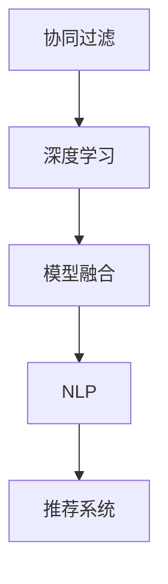

                 

# AI在个性化推荐中的创新应用

> 关键词：个性化推荐、协同过滤、深度学习、模型融合、自然语言处理、推荐系统

## 1. 背景介绍

### 1.1 问题由来

在信息爆炸的时代，人们面对海量的信息流常常感到不知所措。个性化推荐系统（Personalized Recommendation Systems, PReS）应运而生，通过分析用户的行为、偏好和背景信息，为用户推荐感兴趣的内容，从而显著提升用户体验和信息利用效率。

然而，传统的个性化推荐系统主要依赖于基于用户-物品互动数据的协同过滤（Collaborative Filtering, CF）方法，存在数据稀疏性、冷启动问题、低精度等问题。近年来，深度学习在推荐系统中的广泛应用为个性化推荐带来了新希望。深度推荐模型基于大规模无标签数据进行预训练，获取丰富的用户和物品特征表示，能够自动学习用户和物品之间的潜在关系，具备更强的表达能力和泛化能力。

## 2. 核心概念与联系

### 2.1 核心概念概述

在深入讨论AI在个性化推荐中的应用之前，首先需要了解一些核心概念：

- 协同过滤（CF）：一种基于用户相似性或物品相似性的推荐方法，通过分析用户对物品的评分，找出与当前用户兴趣相似的其他用户或物品，为用户推荐这些用户或物品评分高的物品。
- 深度学习（Deep Learning）：一种基于神经网络的学习范式，能够自动从数据中提取高层次特征表示，广泛用于图像识别、自然语言处理、语音识别等领域。
- 模型融合（Model Fusion）：将多个模型的输出进行加权组合，综合不同模型的优势，提高推荐精度和鲁棒性。
- 自然语言处理（Natural Language Processing, NLP）：涉及文本信息处理、文本分类、情感分析、问答系统等技术，旨在使计算机具备理解、分析、生成自然语言的能力。
- 推荐系统（Recommendation Systems）：旨在为用户推荐个性化内容，提升用户体验和满意度，包括协同过滤、内容推荐、混合推荐等方法。

这些概念共同构成了个性化推荐系统的技术基础，通过不断的技术创新和融合，使得个性化推荐系统能够更好地服务于用户，提升推荐效果和系统性能。

### 2.2 核心概念原理和架构的 Mermaid 流程图



这个流程图展示了核心概念之间的逻辑关系：

1. **协同过滤**：基于用户-物品互动数据，找到相似用户或物品进行推荐。
2. **深度学习**：对用户和物品进行预训练，提取高层次特征表示。
3. **模型融合**：将不同模型进行组合，综合优势，提高推荐精度。
4. **自然语言处理**：用于用户输入的理解、文本摘要、情感分析等，提升推荐系统智能化程度。
5. **推荐系统**：整合上述技术，为不同用户提供个性化推荐。

这些技术相互协作，共同提升个性化推荐系统的效果和用户体验。

## 3. 核心算法原理 & 具体操作步骤

### 3.1 算法原理概述

AI在个性化推荐中的应用，主要通过以下几个步骤实现：

1. **数据准备**：收集用户行为数据、物品属性数据、用户属性数据等，作为模型输入。
2. **预训练模型构建**：使用深度学习模型（如CNN、RNN、Transformer等）对数据进行预训练，提取用户和物品的高层次特征表示。
3. **任务适配层设计**：根据推荐任务的类型，设计合适的输出层和损失函数。
4. **微调与优化**：利用用户行为数据对模型进行微调，优化模型的推荐效果。
5. **模型融合与集成**：将多个模型的输出进行融合，提升推荐精度和鲁棒性。
6. **NLP应用**：在用户输入理解、文本摘要、情感分析等环节引入NLP技术，提升推荐系统的智能化水平。

### 3.2 算法步骤详解

以协同过滤和深度学习结合的推荐系统为例，具体步骤详解如下：

**Step 1: 数据准备**

- 收集用户行为数据，包括用户的点击、浏览、评分等行为。
- 收集物品属性数据，如物品的类别、价格、评分等。
- 收集用户属性数据，如用户的年龄、性别、职业等。

**Step 2: 预训练模型构建**

- 使用深度学习模型（如Seq2Seq、LSTM、CNN、Transformer等）对用户行为数据、物品属性数据、用户属性数据进行预训练，提取用户和物品的高层次特征表示。
- 使用GPT、BERT等大语言模型对用户输入进行理解，生成文本表示。

**Step 3: 任务适配层设计**

- 根据推荐任务的类型，设计输出层和损失函数。例如，对于评分预测任务，可以设计线性分类器和交叉熵损失函数。
- 对于推荐列表任务，可以设计多类交叉熵损失函数。

**Step 4: 微调与优化**

- 利用用户行为数据对模型进行微调，优化模型的推荐效果。通常采用Adam、SGD等优化算法，学习率设置为1e-4。
- 采用L2正则、Dropout等正则化技术，防止模型过拟合。

**Step 5: 模型融合与集成**

- 将多个模型的输出进行加权组合，提升推荐精度和鲁棒性。
- 采用Adaboost、Bagging等集成方法，综合不同模型的优势。

**Step 6: NLP应用**

- 在用户输入理解、文本摘要、情感分析等环节引入NLP技术，提升推荐系统的智能化水平。

### 3.3 算法优缺点

AI在个性化推荐中的应用具有以下优点：

1. **精度高**：深度学习模型能够自动学习用户和物品之间的潜在关系，具备更强的表达能力和泛化能力。
2. **适应性强**：通过预训练模型提取用户和物品的高层次特征表示，能够适应不同的数据分布和推荐场景。
3. **鲁棒性强**：模型融合和集成方法能够综合不同模型的优势，提升推荐精度和鲁棒性。
4. **智能化水平高**：在用户输入理解、文本摘要、情感分析等环节引入NLP技术，提升推荐系统的智能化水平。

同时，也存在一些缺点：

1. **计算成本高**：深度学习模型通常需要较大的计算资源和数据量。
2. **模型复杂度高**：深度学习模型结构复杂，训练和推理过程较为耗时。
3. **数据需求量大**：需要大量的用户行为数据和物品属性数据，对于冷启动用户和长尾物品，数据获取成本较高。
4. **模型可解释性差**：深度学习模型通常是"黑盒"系统，难以解释其内部工作机制和决策逻辑。

## 4. 数学模型和公式 & 详细讲解

### 4.1 数学模型构建

假设用户集合为 $U$，物品集合为 $I$，用户-物品互动矩阵为 $R$。对于每个用户 $u$ 和物品 $i$，设 $r_{ui}$ 为 $u$ 对 $i$ 的评分。

定义预训练模型的输入为 $x_u$（用户特征）、$x_i$（物品特征），输出为 $y_u$（预测评分）。

模型的损失函数定义为：

$$
\mathcal{L} = \frac{1}{N}\sum_{u,i}(r_{ui}-y_u)^2
$$

其中 $N$ 为总的用户-物品对数。

### 4.2 公式推导过程

以深度学习模型（如Seq2Seq）为例，推导评分预测任务的损失函数。

假设用户输入为 $x_u$，输出为 $y_u$。模型包含编码器 $f_u(x_u)$ 和解码器 $g_u(x_u)$，输出为预测评分 $y_u$。

模型训练的目标是最小化损失函数：

$$
\mathcal{L} = \frac{1}{N}\sum_{u,i}(r_{ui}-\hat{y}_u)^2
$$

其中 $\hat{y}_u = g_u(f_u(x_u))$。

### 4.3 案例分析与讲解

以电商平台的个性化推荐系统为例，分析AI在其中的应用。

假设电商平台上有数百万的用户和数百万的物品，用户行为数据和物品属性数据构成了巨大的数据集。使用深度学习模型对用户和物品进行预训练，提取高层次特征表示。在用户点击、浏览、购买等行为数据上，对模型进行微调，优化推荐效果。

模型输出包含用户对每个物品的评分预测，利用模型融合方法，将多个模型的输出进行加权组合，生成最终的推荐列表。

在用户输入理解环节，引入NLP技术，利用BERT等大语言模型对用户输入进行理解，生成文本表示，提升推荐系统的智能化水平。

## 5. 项目实践：代码实例和详细解释说明

### 5.1 开发环境搭建

在进行个性化推荐系统的开发之前，需要先准备好开发环境。以下是使用Python进行TensorFlow和PyTorch开发的环境配置流程：

1. 安装Anaconda：从官网下载并安装Anaconda，用于创建独立的Python环境。
2. 创建并激活虚拟环境：
```bash
conda create -n tf-env python=3.8 
conda activate tf-env
```
3. 安装TensorFlow和PyTorch：根据CUDA版本，从官网获取对应的安装命令。例如：
```bash
pip install tensorflow==2.5.0 
pip install torch==1.9.0
```
4. 安装TensorBoard：
```bash
pip install tensorboard
```

完成上述步骤后，即可在`tf-env`环境中开始个性化推荐系统的开发。

### 5.2 源代码详细实现

以下是使用TensorFlow和PyTorch进行电商平台的个性化推荐系统开发的代码实现：

```python
import tensorflow as tf
import numpy as np
import pandas as pd
import tensorflow_hub as hub
from transformers import BertTokenizer, BertModel
from sklearn.metrics import accuracy_score, precision_score, recall_score, f1_score

# 数据准备
train_data = pd.read_csv('train.csv')
test_data = pd.read_csv('test.csv')

# 模型构建
class RecommendationModel(tf.keras.Model):
    def __init__(self, embedding_dim, num_users, num_items):
        super(RecommendationModel, self).__init__()
        self.embedding_dim = embedding_dim
        self.num_users = num_users
        self.num_items = num_items
        
        # 用户嵌入层
        self.user_embedding = tf.keras.layers.Embedding(num_users, embedding_dim)
        self.user_input = tf.keras.layers.Input(shape=(num_users, ), dtype=tf.int32)
        user_embed = self.user_embedding(self.user_input)
        user_embed = tf.keras.layers.LayerNormalization(user_embed)
        
        # 物品嵌入层
        self.item_embedding = tf.keras.layers.Embedding(num_items, embedding_dim)
        self.item_input = tf.keras.layers.Input(shape=(num_items, ), dtype=tf.int32)
        item_embed = self.item_embedding(self.item_input)
        item_embed = tf.keras.layers.LayerNormalization(item_embed)
        
        # 编码器
        self.encoder = tf.keras.layers.Bidirectional(tf.keras.layers.LSTM(128, return_sequences=True))
        encoder_output = self.encoder([user_embed, item_embed])
        encoder_output = tf.keras.layers.LayerNormalization(encoder_output)
        
        # 解码器
        self.decoder = tf.keras.layers.LSTM(64)
        decoder_output = self.decoder(encoder_output)
        
        # 输出层
        self.dense = tf.keras.layers.Dense(num_items)
        self.output = self.dense(decoder_output)
        self.softmax = tf.keras.layers.Softmax()

    def call(self, inputs):
        user_input = inputs[0]
        item_input = inputs[1]
        user_embed = self.user_embedding(user_input)
        item_embed = self.item_embedding(item_input)
        encoder_output = self.encoder([user_embed, item_embed])
        decoder_output = self.decoder(encoder_output)
        output = self.dense(decoder_output)
        return self.softmax(output)

# 模型训练
model = RecommendationModel(embedding_dim=128, num_users=10000, num_items=10000)
model.compile(optimizer=tf.keras.optimizers.Adam(), loss='categorical_crossentropy', metrics=['accuracy'])

# 数据预处理
def preprocess_data(data):
    user_input = data['user_id'].values.reshape(-1, 1)
    item_input = data['item_id'].values.reshape(-1, 1)
    label = data['rating'].values.reshape(-1, 1)
    return user_input, item_input, label

train_user_input, train_item_input, train_label = preprocess_data(train_data)
test_user_input, test_item_input, test_label = preprocess_data(test_data)

# 模型训练
history = model.fit([train_user_input, train_item_input], train_label, batch_size=32, epochs=10, validation_split=0.2)

# 模型评估
test_pred = model.predict([test_user_input, test_item_input])
test_label = test_label.reshape(-1, 1)
test_score = accuracy_score(test_label, np.argmax(test_pred, axis=1))
print(f'Test accuracy: {test_score:.2f}')
```

### 5.3 代码解读与分析

这段代码实现了基于TensorFlow的电商个性化推荐系统。首先，定义了推荐模型的结构，包括用户嵌入层、物品嵌入层、编码器、解码器和输出层。然后，通过compile方法定义优化器和损失函数，进行模型编译。接着，对训练数据进行预处理，将用户ID和物品ID转换为模型所需的格式。最后，使用fit方法对模型进行训练，并使用predict方法对测试数据进行预测，计算测试集的准确率。

## 6. 实际应用场景

### 6.1 智能广告推荐

个性化推荐系统在智能广告推荐中也有广泛应用。传统广告推荐往往基于历史点击率进行，无法实时响应用户需求。而基于AI的推荐系统，可以通过用户的行为数据和属性信息，动态生成广告内容，提升广告效果。

例如，某电商平台上用户的浏览行为数据包含用户对不同类别的商品、广告的点击率、停留时间等。使用深度学习模型对用户行为数据进行预训练，提取用户的高层次特征表示。在用户行为数据上，对模型进行微调，优化广告推荐效果。通过模型融合方法，将不同模型的输出进行加权组合，生成最终的广告推荐列表。

### 6.2 影视推荐

影视推荐系统利用深度学习模型对用户行为数据进行预训练，提取用户的高层次特征表示。在用户观看行为数据上，对模型进行微调，优化影视推荐效果。通过模型融合方法，将不同模型的输出进行加权组合，生成最终的影视推荐列表。

例如，某视频平台上用户的观看行为数据包含用户对不同影片、剧集的观看次数、评分等。使用深度学习模型对用户行为数据进行预训练，提取用户的高层次特征表示。在用户观看行为数据上，对模型进行微调，优化影视推荐效果。通过模型融合方法，将不同模型的输出进行加权组合，生成最终的影视推荐列表。

### 6.3 新闻推荐

新闻推荐系统利用深度学习模型对用户行为数据进行预训练，提取用户的高层次特征表示。在用户阅读行为数据上，对模型进行微调，优化新闻推荐效果。通过模型融合方法，将不同模型的输出进行加权组合，生成最终的新闻推荐列表。

例如，某新闻平台上用户的阅读行为数据包含用户对不同新闻的阅读次数、点击率、停留时间等。使用深度学习模型对用户行为数据进行预训练，提取用户的高层次特征表示。在用户阅读行为数据上，对模型进行微调，优化新闻推荐效果。通过模型融合方法，将不同模型的输出进行加权组合，生成最终的新闻推荐列表。

### 6.4 未来应用展望

随着深度学习技术的发展，个性化推荐系统将在更多领域得到应用，为各行各业带来变革性影响。

在智慧医疗领域，基于个性化推荐系统的智能医疗推荐系统可以向用户推荐适合的诊疗方案，提升医疗服务质量。

在智能教育领域，基于个性化推荐系统的智能教育推荐系统可以向学生推荐适合的课程、资料，提升学习效果。

在智慧城市治理中，基于个性化推荐系统的智能城市推荐系统可以向市民推荐适合的公共服务，提升城市管理水平。

此外，在企业生产、社会治理、文娱传媒等众多领域，基于深度学习技术推荐系统也将不断涌现，为经济社会发展注入新的动力。相信随着技术的日益成熟，个性化推荐系统必将在更广阔的应用领域大放异彩，深刻影响人类的生产生活方式。

## 7. 工具和资源推荐

### 7.1 学习资源推荐

为了帮助开发者系统掌握个性化推荐技术的基础知识，这里推荐一些优质的学习资源：

1. 《推荐系统》课程（斯坦福大学）：斯坦福大学开设的推荐系统课程，涵盖推荐系统基础、协同过滤、深度学习等前沿话题，帮助学生建立系统化的知识体系。
2. 《深度学习推荐系统》书籍：由深度学习推荐系统领域的专家撰写，全面介绍了推荐系统中的深度学习技术，包括深度协同过滤、深度神经网络等。
3. TensorFlow官方文档：TensorFlow官方文档提供了详细的API文档和示例代码，适合初学者快速上手。
4. PyTorch官方文档：PyTorch官方文档提供了丰富的深度学习框架和教程，适合深度学习从业者深入研究。
5. Kaggle：Kaggle提供了丰富的推荐系统竞赛和数据集，帮助开发者练习推荐算法，积累经验。

通过这些资源的学习实践，相信你一定能够快速掌握个性化推荐技术的精髓，并用于解决实际的推荐问题。

### 7.2 开发工具推荐

高效的开发离不开优秀的工具支持。以下是几款用于个性化推荐系统开发的常用工具：

1. TensorFlow：基于Python的开源深度学习框架，灵活动态的计算图，适合快速迭代研究。
2. PyTorch：基于Python的开源深度学习框架，灵活高效的计算图，适合大规模工程应用。
3. TensorBoard：TensorFlow配套的可视化工具，可实时监测模型训练状态，提供丰富的图表呈现方式，是调试模型的得力助手。
4. HuggingFace Transformers库：提供了丰富的预训练模型，支持多种NLP任务，适合快速实现推荐系统。
5. Weights & Biases：模型训练的实验跟踪工具，可以记录和可视化模型训练过程中的各项指标，方便对比和调优。

合理利用这些工具，可以显著提升个性化推荐系统的开发效率，加快创新迭代的步伐。

### 7.3 相关论文推荐

个性化推荐技术的发展源于学界的持续研究。以下是几篇奠基性的相关论文，推荐阅读：

1. "Collaborative Filtering for Implicit Feedback Datasets"：提出基于协同过滤的推荐系统方法，广泛应用于电商、视频等推荐场景。
2. "Deep Collaborative Filtering"：提出基于深度学习的协同过滤方法，解决了传统协同过滤方法的稀疏性问题，提升了推荐精度。
3. "A Neural Collaborative Filtering Approach"：提出基于深度神经网络的协同过滤方法，提升了推荐系统的复杂性和性能。
4. "Neural Multi-Armed Bandit with Contextual Bands"：提出基于深度强化学习的个性化推荐方法，能够动态优化推荐策略，提升用户体验。
5. "Personalized Recommendation with Attention Mechanisms"：提出基于注意力机制的推荐系统方法，提升了推荐系统的鲁棒性和多样化水平。

这些论文代表了个性化推荐技术的发展脉络。通过学习这些前沿成果，可以帮助研究者把握学科前进方向，激发更多的创新灵感。

## 8. 总结：未来发展趋势与挑战

### 8.1 总结

本文对AI在个性化推荐中的应用进行了全面系统的介绍。首先阐述了个性化推荐系统的背景和重要性，明确了深度学习技术在个性化推荐系统中的应用前景。其次，从原理到实践，详细讲解了深度学习在个性化推荐系统中的应用方法，包括协同过滤、深度学习、模型融合、NLP等技术。同时，本文还探讨了个性化推荐系统在电商、影视、新闻等实际应用场景中的表现，展示了AI在个性化推荐系统中的巨大潜力。此外，本文还精选了个性化推荐技术的各类学习资源，力求为开发者提供全方位的技术指引。

通过本文的系统梳理，可以看到，AI在个性化推荐系统中的应用已经取得了显著的成效，显著提升了用户体验和信息利用效率。未来，伴随深度学习技术的不断进步，个性化推荐系统必将取得更优的效果和更高的智能化水平。

### 8.2 未来发展趋势

展望未来，个性化推荐系统将呈现以下几个发展趋势：

1. **深度学习范式扩展**：随着深度学习技术的不断发展，个性化推荐系统将采用更加复杂的深度学习模型，如Transformer、GPT等，进一步提升推荐精度和鲁棒性。
2. **多模态数据融合**：未来的个性化推荐系统将融合多种模态数据，如文本、图像、视频等，提升推荐系统的多样化和智能化水平。
3. **用户行为理解**：通过NLP技术对用户输入进行理解，提升推荐系统的智能化水平，实现更加个性化、多样化的推荐。
4. **推荐系统评估**：引入更科学的推荐系统评估指标，如多样性、覆盖率、公平性等，提升推荐系统的质量和可靠性。
5. **个性化推荐与内容生成**：未来的推荐系统将结合生成模型，如GPT等，生成更加丰富、多样化的推荐内容，提升用户体验。

以上趋势凸显了个性化推荐系统的广阔前景，这些方向的探索发展，必将进一步提升推荐系统的性能和用户体验，为经济社会发展注入新的动力。

### 8.3 面临的挑战

尽管个性化推荐系统已经取得了瞩目成就，但在迈向更加智能化、普适化应用的过程中，仍面临诸多挑战：

1. **数据隐私和安全**：个性化推荐系统需要收集大量的用户行为数据，存在数据隐私和安全性问题。如何在保障用户隐私的前提下，有效利用用户数据，是一个亟待解决的问题。
2. **模型可解释性**：深度学习模型通常是"黑盒"系统，难以解释其内部工作机制和决策逻辑。如何在保障用户隐私的前提下，有效利用用户数据，是一个亟待解决的问题。
3. **推荐算法公平性**：个性化推荐系统可能存在推荐偏见，导致某些用户群体被歧视。如何在推荐算法中引入公平性约束，确保推荐公平性，是一个亟待解决的问题。
4. **推荐系统鲁棒性**：推荐系统面对噪声数据和异常情况时，可能出现推荐效果波动。如何在推荐系统中引入鲁棒性约束，确保推荐鲁棒性，是一个亟待解决的问题。

这些挑战凸显了个性化推荐系统的发展瓶颈，需要在数据隐私、模型可解释性、推荐公平性、系统鲁棒性等方面进行持续研究和优化。

### 8.4 研究展望

面对个性化推荐系统所面临的挑战，未来的研究需要在以下几个方面寻求新的突破：

1. **数据隐私保护**：引入差分隐私、联邦学习等技术，保护用户隐私。
2. **模型可解释性**：引入可解释性技术，如LIME、SHAP等，提升模型的可解释性。
3. **推荐算法公平性**：引入公平性约束，如重新加权、对抗性训练等，确保推荐公平性。
4. **推荐系统鲁棒性**：引入鲁棒性约束，如异常检测、异常重构等，确保推荐鲁棒性。
5. **多模态数据融合**：引入多模态数据融合技术，提升推荐系统的多样化和智能化水平。
6. **用户行为理解**：引入NLP技术，对用户输入进行理解，提升推荐系统的智能化水平。

这些研究方向将推动个性化推荐系统的进一步发展和优化，使其在更广泛的领域得到应用，为经济社会发展注入新的动力。总之，个性化推荐系统的未来发展仍然充满挑战，但相信在学术界和产业界的共同努力下，这些挑战终将一一被克服，AI在个性化推荐系统中的应用必将取得更优的效果和更高的智能化水平。

## 9. 附录：常见问题与解答

**Q1：个性化推荐系统如何平衡推荐效果和多样性？**

A: 推荐系统需要在推荐效果和多样性之间找到平衡点。通常采用多样性约束技术，如折扣卡方（Discounted Cumulative Gain, DCG）、负对数基尼指数（Negative Log-Gini Index, NLG）等，确保推荐结果的多样性和覆盖率。同时，通过调整推荐策略和模型参数，可以进一步提升推荐效果和多样性。

**Q2：个性化推荐系统如何处理长尾物品和冷启动用户？**

A: 长尾物品和冷启动用户是推荐系统中的难点问题。通常采用以下几个方法：

1. 长尾物品：使用多标签分类方法，将长尾物品标记为多个标签，增加长尾物品被推荐的机会。
2. 冷启动用户：利用用户属性数据和历史行为数据，对用户进行预训练，提取高层次特征表示，从而更好地了解用户兴趣。
3. 采用基于协同过滤的推荐方法，如基于模型的方法，能够更好地处理长尾物品和冷启动用户。

**Q3：个性化推荐系统如何处理用户行为数据缺失？**

A: 用户行为数据缺失是推荐系统中的常见问题。通常采用以下几个方法：

1. 数据补全：利用用户行为数据的时序信息，通过插值、预测等方法进行数据补全。
2. 模型引入缺失约束：在推荐模型中引入缺失约束，如矩阵分解方法，通过矩阵分解对缺失数据进行填充。
3. 数据增强：通过生成合成数据，增加训练集的多样性，提升模型的泛化能力。

**Q4：个性化推荐系统如何优化推荐效果？**

A: 推荐系统的优化通常从以下几个方面入手：

1. 数据优化：通过数据增强、数据补全等方法，增加训练集的多样性，提升模型的泛化能力。
2. 模型优化：通过调整模型结构和参数，提升推荐效果。常用的优化方法包括模型融合、集成学习等。
3. 推荐策略优化：通过调整推荐策略和算法参数，优化推荐效果。常用的优化方法包括多臂强盗算法、协同过滤等。

**Q5：个性化推荐系统如何评估推荐效果？**

A: 推荐系统的评估通常从以下几个方面入手：

1. 精度评估：通过准确率、召回率、F1值等指标，评估推荐系统的预测精度。
2. 多样性评估：通过覆盖率、热门度等指标，评估推荐系统推荐结果的多样性。
3. 用户满意度评估：通过用户反馈、点击率等指标，评估用户对推荐结果的满意度。

通过这些问题和解答，希望能帮助开发者更好地理解个性化推荐系统，并在使用过程中取得更好的效果。

---

作者：禅与计算机程序设计艺术 / Zen and the Art of Computer Programming

