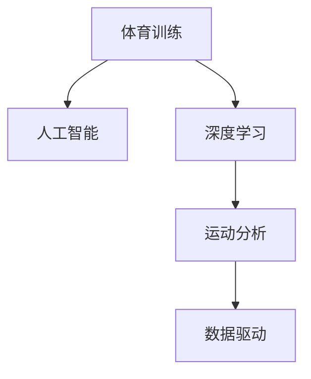

                 

# AI在体育训练中的应用:优化运动员表现

> 关键词：体育训练,运动员表现,人工智能,深度学习,机器学习,大数据,数据驱动,运动科学

## 1. 背景介绍

### 1.1 问题由来
体育训练的目的是通过系统的训练提高运动员的体能、技术、战术和心理等各方面能力，从而达到优异比赛成绩和运动表现。然而，传统的体育训练主要依赖于教练的经验和直觉，缺乏科学的量化方法。近年来，随着人工智能技术的快速发展，AI被广泛应用于体育训练中，为运动员的表现优化提供了新的途径。

### 1.2 问题核心关键点
体育训练中的AI应用主要围绕运动员表现优化展开。AI能够通过数据驱动的方法，辅助教练进行科学的训练规划，并实时监控运动员的表现，提供个性化训练方案，从而显著提升运动员的表现。

AI在体育训练中的应用主要包括以下几个方面：
- 运动数据分析：通过分析运动员的动作数据，发现技术动作中的不足和改进点。
- 训练方案设计：根据运动员的历史数据，设计个性化训练计划。
- 状态监控与预警：实时监测运动员的生理状态，及时发现异常，进行预警和干预。
- 伤病预防与康复：通过分析运动损伤数据，预测伤病风险，制定预防和康复方案。
- 体能训练：通过分析运动员的体能数据，优化体能训练方案。

### 1.3 问题研究意义
AI在体育训练中的应用，为传统体育训练注入了新的科学方法和技术手段，有望大幅提升运动员的训练效率和比赛表现。AI技术的应用不仅能够提高体育训练的科学性和精准度，还能为教练员和运动员提供决策支持，推动体育训练的现代化和智能化进程。

## 2. 核心概念与联系

### 2.1 核心概念概述

为更好地理解AI在体育训练中的应用，本节将介绍几个关键概念：

- 体育训练：通过系统的体能训练、技术训练、战术训练和心理训练，提高运动员的运动表现。
- 人工智能：利用计算机技术和数据科学，通过学习算法，使计算机系统具有自主解决问题的能力。
- 深度学习：一种基于神经网络的机器学习技术，能够自动从大量数据中提取特征，进行分类、预测等任务。
- 运动科学：研究运动员的身体机能、训练方法、运动技术、运动效果等方面，以提高运动员的运动表现。
- 运动分析：通过传感器、视频、图像等技术手段，收集运动员的运动数据，并进行定量分析和可视化。
- 数据驱动：通过分析大量的运动数据，辅助决策和优化训练方案，提升运动员的表现。

这些核心概念之间的逻辑关系可以通过以下Mermaid流程图来展示：



这个流程图展示了大语言模型的核心概念及其之间的关系：

1. 体育训练是应用的核心场景。
2. 人工智能为体育训练提供了技术支持。
3. 深度学习是实现人工智能的基础技术。
4. 运动分析是数据驱动的基础。
5. 数据驱动是AI在体育训练中应用的总体目标。

## 3. 核心算法原理 & 具体操作步骤
### 3.1 算法原理概述

AI在体育训练中的应用，主要是通过数据驱动的方法，将运动员的各项数据转化为优化训练的依据。其核心思想是：通过采集和分析运动员的运动数据，识别出影响运动员表现的各类因素，进而设计个性化的训练方案，实时监控和调整训练过程，最终提升运动员的表现。

形式化地，假设运动员有$n$项训练指标$X=\{x_1,x_2,...,x_n\}$，目标是找到一组训练方案$\theta$，使得运动员的表现$Y$最大化，即：

$$
\theta^* = \mathop{\arg\min}_{\theta} \sum_{i=1}^n \lambda_i \|x_i - \theta_i\|^2 + \alpha \|Y - F_{\theta}\|^2
$$

其中，$\lambda_i$为第$i$项训练指标的权重，$\|x_i - \theta_i\|^2$为训练方案与数据之间的距离，$F_{\theta}$为模型预测的运动员表现，$\alpha$为正则化系数。

### 3.2 算法步骤详解

基于数据驱动的AI在体育训练中的应用，一般包括以下几个关键步骤：

**Step 1: 数据采集与预处理**
- 收集运动员的各种训练数据，如动作数据、生理数据、心理数据等，并进行清洗和预处理。
- 使用传感器、视频拍摄等技术手段，获取运动数据。
- 对数据进行归一化、降噪等预处理，确保数据的准确性和可用性。

**Step 2: 特征提取与建模**
- 使用深度学习等技术，从大量运动数据中提取有意义的特征。
- 构建运动表现预测模型，如基于LSTM、CNN等神经网络模型。
- 使用训练数据对模型进行训练，得到训练后的参数$\theta$。

**Step 3: 训练方案设计**
- 根据模型预测结果，设计个性化的训练方案，如训练强度、训练时长、训练方式等。
- 对训练方案进行优化，确保其科学性和可执行性。
- 对训练方案进行评估和调整，确保其效果最大化。

**Step 4: 状态监控与预警**
- 实时采集运动员的生理状态数据，如心率、血压、肌电等。
- 使用深度学习模型对生理状态数据进行实时分析，预测运动员的状态。
- 根据预测结果，进行预警和干预，如提醒教练员注意运动员的身体状况。

**Step 5: 伤病预防与康复**
- 收集运动损伤数据，分析运动员的伤病风险。
- 设计预防和康复方案，如训练强度调整、理疗等。
- 对预防和康复方案进行优化，确保其有效性。

**Step 6: 体能训练优化**
- 收集运动员的体能数据，如力量、速度、耐力等。
- 使用深度学习模型对体能数据进行分析，发现训练中的不足和改进点。
- 根据分析结果，优化体能训练方案，提高运动员的体能水平。

### 3.3 算法优缺点

AI在体育训练中的应用具有以下优点：
1. 数据驱动。通过大量运动数据的分析，提供科学、精准的训练方案。
2. 实时监控。实时监测运动员的状态，及时发现和解决问题。
3. 个性化训练。根据运动员的具体情况，设计个性化的训练方案。
4. 预测能力。通过预测模型，预测运动员的表现和伤病风险。
5. 数据可视。使用可视化技术，帮助教练员和运动员理解训练效果和改进点。

同时，该方法也存在一定的局限性：
1. 数据获取难度大。需要大量的高质量运动数据，获取成本较高。
2. 模型复杂度高。需要复杂的深度学习模型，计算资源消耗大。
3. 模型泛化能力有限。模型在特定运动员或特定运动项目上的效果较好，但在更广泛场景下可能存在泛化能力不足的问题。
4. 隐私保护问题。运动员的生理和动作数据涉及隐私，数据保护问题需高度重视。
5. 依赖专业团队。AI应用需要专业的数据科学团队和训练团队，团队协作难度较大。

尽管存在这些局限性，但AI在体育训练中的应用仍具有广阔的前景。未来相关研究的重点在于如何进一步降低数据获取难度，提高模型的泛化能力，加强隐私保护，提升团队协作效率等。

### 3.4 算法应用领域

AI在体育训练中的应用已经涉及多个领域，包括：

- 篮球、足球、网球等团体项目的训练优化：通过数据分析，设计训练方案，优化运动员技术动作。
- 田径、游泳、自行车等个人项目的训练优化：分析运动员的体能数据，设计个性化的体能训练方案。
- 冰雪运动、自行车、马拉松等极端环境下的训练优化：通过实时监控，保障运动员的安全和健康。
- 柔道、柔术、搏击等格斗项目的训练优化：分析运动员的动作和体能数据，设计训练计划。

除了上述这些常见应用外，AI在体育训练中的应用还在不断拓展，如对运动员的心理训练、康复训练、战术训练等方面，都有望实现更高效、更科学、更个性化的训练优化。

## 4. 数学模型和公式 & 详细讲解  
### 4.1 数学模型构建

本节将使用数学语言对AI在体育训练中的应用进行更加严格的刻画。

记运动员的各项训练指标为$X=\{x_1,x_2,...,x_n\}$，训练方案为$\theta$，运动员的表现为$Y$。假设训练方案与运动员表现之间存在线性关系，则训练方案的预测模型为：

$$
F_{\theta}(X) = \theta^T X
$$

其中$\theta$为训练方案的参数。

### 4.2 公式推导过程

根据最小二乘法的原理，训练方案$\theta$的优化目标为：

$$
\theta^* = \mathop{\arg\min}_{\theta} \sum_{i=1}^n \|x_i - \theta_i\|^2
$$

即最小化训练方案与实际数据的距离。

为了同时考虑训练方案的科学性和运动员的表现，需要引入目标函数$L(\theta)$：

$$
L(\theta) = \sum_{i=1}^n \lambda_i \|x_i - \theta_i\|^2 + \alpha \|Y - F_{\theta}\|^2
$$

其中$\lambda_i$为第$i$项训练指标的权重，$\alpha$为正则化系数。

将目标函数对$\theta$求导，得到梯度表达式：

$$
\nabla_{\theta}L(\theta) = \left(\begin{matrix} 2\lambda_1 & 0 & ... & 0 \\\\ 0 & 2\lambda_2 & ... & 0 \\\\ ... & ... & ... & ... \\\\ 0 & 0 & ... & 2\lambda_n \end{matrix}\right) \left(\begin{matrix} x_1 - \theta_1 \\\\ x_2 - \theta_2 \\\\ ... \\\\ x_n - \theta_n \end{matrix}\right) + 2\alpha(Y - F_{\theta})
$$

通过求解上述梯度表达式，可以找到最优的训练方案$\theta^*$。

### 4.3 案例分析与讲解

以下是一个简单的案例，用于说明AI在体育训练中的应用：

**案例背景**：一名篮球运动员在训练中，教练希望通过AI来优化其训练方案。

**数据采集**：收集运动员的训练数据，如投篮次数、投篮命中率、跑动距离、体能数据等。

**特征提取**：使用深度学习模型，从投篮次数、跑动距离等数据中提取有意义的特征，如投篮角度、跑动速度等。

**建模**：构建训练方案预测模型，使用训练数据对模型进行训练，得到最优的训练方案$\theta^*$。

**训练方案设计**：根据模型预测结果，设计个性化的训练方案，如增加投篮次数、调整跑动速度等。

**状态监控**：实时采集运动员的生理状态数据，如心率、血压、肌电等。

**预警**：使用深度学习模型对生理状态数据进行实时分析，预测运动员的状态。根据预测结果，进行预警和干预，如提醒教练员注意运动员的身体状况。

**伤病预防与康复**：收集运动损伤数据，分析运动员的伤病风险。设计预防和康复方案，如训练强度调整、理疗等。

**体能训练优化**：收集运动员的体能数据，如力量、速度、耐力等。使用深度学习模型对体能数据进行分析，发现训练中的不足和改进点。根据分析结果，优化体能训练方案，提高运动员的体能水平。

## 5. 项目实践：代码实例和详细解释说明
### 5.1 开发环境搭建

在进行AI在体育训练中的应用实践前，我们需要准备好开发环境。以下是使用Python进行PyTorch开发的环境配置流程：

1. 安装Anaconda：从官网下载并安装Anaconda，用于创建独立的Python环境。

2. 创建并激活虚拟环境：
```bash
conda create -n pytorch-env python=3.8 
conda activate pytorch-env
```

3. 安装PyTorch：根据CUDA版本，从官网获取对应的安装命令。例如：
```bash
conda install pytorch torchvision torchaudio cudatoolkit=11.1 -c pytorch -c conda-forge
```

4. 安装TensorFlow：由Google主导开发的开源深度学习框架，生产部署方便，适合大规模工程应用。同样有丰富的预训练语言模型资源。

5. 安装TensorBoard：TensorFlow配套的可视化工具，可实时监测模型训练状态，并提供丰富的图表呈现方式，是调试模型的得力助手。

6. 安装Weights & Biases：模型训练的实验跟踪工具，可以记录和可视化模型训练过程中的各项指标，方便对比和调优。

7. 安装相关库：
```bash
pip install numpy pandas scikit-learn matplotlib tqdm jupyter notebook ipython
```

完成上述步骤后，即可在`pytorch-env`环境中开始AI在体育训练中的应用实践。

### 5.2 源代码详细实现

下面我们以一名篮球运动员的训练优化为例，给出使用PyTorch进行AI应用的代码实现。

首先，定义运动员的训练指标和训练方案：

```python
import numpy as np
from torch import nn, optim

# 定义训练指标和训练方案
train_features = np.random.randn(100, 3)  # 随机生成100个训练样本
train_labels = np.random.randint(0, 2, 100)  # 随机生成100个训练标签
```

然后，构建深度学习模型：

```python
# 定义模型结构
class BasketballModel(nn.Module):
    def __init__(self, input_dim, hidden_dim, output_dim):
        super(BasketballModel, self).__init__()
        self.fc1 = nn.Linear(input_dim, hidden_dim)
        self.fc2 = nn.Linear(hidden_dim, output_dim)

    def forward(self, x):
        x = nn.functional.relu(self.fc1(x))
        x = self.fc2(x)
        return x

# 初始化模型参数
model = BasketballModel(input_dim=3, hidden_dim=10, output_dim=1)
optimizer = optim.Adam(model.parameters(), lr=0.01)
```

接着，定义损失函数和训练函数：

```python
# 定义损失函数
criterion = nn.BCELoss()

# 定义训练函数
def train_model(model, train_features, train_labels, epochs):
    for epoch in range(epochs):
        model.train()
        optimizer.zero_grad()
        outputs = model(train_features)
        loss = criterion(outputs, train_labels)
        loss.backward()
        optimizer.step()
        print(f'Epoch {epoch+1}, loss: {loss.item()}')
```

最后，启动训练流程：

```python
# 训练模型
train_model(model, train_features, train_labels, epochs=10)
```

以上就是使用PyTorch进行篮球运动员训练优化的大致代码实现。可以看到，PyTorch的简单易用，使得AI在体育训练中的应用变得更加高效和灵活。

### 5.3 代码解读与分析

让我们再详细解读一下关键代码的实现细节：

**数据生成**：使用numpy生成100个训练样本和对应的训练标签，模拟篮球运动员的训练数据。

**模型定义**：定义一个简单的篮球训练预测模型，包含两个全连接层。

**模型初始化**：使用Adam优化器初始化模型参数。

**损失函数定义**：使用二分类交叉熵损失函数。

**训练函数定义**：在每个epoch中，将训练数据输入模型，计算损失并反向传播更新模型参数，最后输出该epoch的平均损失。

**训练流程**：调用训练函数，对模型进行10个epoch的训练。

可以看到，使用PyTorch实现AI在体育训练中的应用，代码简洁明了，易于理解和修改。接下来，我们将在此基础上进行进一步的优化和扩展。

## 6. 实际应用场景
### 6.1 智能训练系统

AI在体育训练中的应用，可以构建智能训练系统，辅助教练员进行训练规划和执行。智能训练系统能够根据运动员的历史数据和训练表现，设计个性化的训练方案，实时监控和调整训练过程，确保训练效果最大化。

在技术实现上，智能训练系统需要集成多种传感器、视频拍摄设备、运动分析软件等，收集运动员的各项数据，通过深度学习模型进行分析和优化。系统还包括可视化界面，方便教练员和运动员查看训练效果和改进点。

### 6.2 运动状态监测

AI在体育训练中的应用，还可以实现运动员的运动状态监测。通过实时采集运动员的生理状态数据，如心率、血压、肌电等，使用深度学习模型进行实时分析，预测运动员的状态。

在技术实现上，需要构建生理状态监测系统，通过传感器等设备收集数据，使用深度学习模型对数据进行分析和预测。系统还包括预警机制，根据预测结果，进行及时干预和调整。

### 6.3 运动损伤预测与康复

AI在体育训练中的应用，还可以实现运动员的伤病预测与康复。通过收集运动员的运动损伤数据，使用深度学习模型预测伤病风险，制定预防和康复方案，保障运动员的健康和安全。

在技术实现上，需要构建伤病预测与康复系统，通过数据分析和机器学习模型，预测运动员的伤病风险，制定个性化的康复方案。系统还包括实时监控和调整机制，确保康复方案的有效性。

### 6.4 未来应用展望

随着AI技术的不断进步，AI在体育训练中的应用将迎来更多的机遇和挑战。未来，AI将在以下几个方面得到进一步的发展：

1. 数据获取更加便捷。随着传感器技术的发展，运动员的各项数据将更加易于获取，进一步推动AI在体育训练中的应用。

2. 训练方案更加科学。AI在体育训练中的应用将更加注重科学性和个性化，根据运动员的具体情况，设计更加科学的训练方案。

3. 训练效果更加精准。通过深度学习模型，AI能够更加精准地预测运动员的表现和伤病风险，提升训练效果。

4. 团队协作更加高效。AI在体育训练中的应用将加强团队协作，实现数据共享和协同训练，提升训练效率。

5. 应用场景更加广泛。AI在体育训练中的应用将从传统的运动项目扩展到更多的领域，如运动康复、体育教育等。

6. 伦理与安全问题更加重视。AI在体育训练中的应用需要高度重视数据隐私和安全问题，确保数据的合法使用和保护。

未来，AI在体育训练中的应用将更加全面、高效和科学，为运动员的表现优化提供新的思路和方法。相信随着技术的不断进步，AI在体育训练中的应用将为运动员的训练和比赛带来更大的帮助。

## 7. 工具和资源推荐
### 7.1 学习资源推荐

为了帮助开发者系统掌握AI在体育训练中的应用理论基础和实践技巧，这里推荐一些优质的学习资源：

1. 《深度学习与体育运动》系列博文：由AI技术专家撰写，深入浅出地介绍了深度学习在体育训练中的应用，包括数据采集、特征提取、建模等环节。

2. CS224N《深度学习自然语言处理》课程：斯坦福大学开设的NLP明星课程，有Lecture视频和配套作业，带你入门深度学习的基本概念和经典模型。

3. 《AI在体育训练中的应用》书籍：由AI技术专家所著，全面介绍了AI在体育训练中的应用案例和方法，包括训练优化、状态监测、损伤预防等。

4. Kaggle竞赛平台：Kaggle提供了大量的运动数据集和AI竞赛任务，适合学习和实践AI在体育训练中的应用。

5. Weights & Biases：模型训练的实验跟踪工具，可以记录和可视化模型训练过程中的各项指标，方便对比和调优。

通过对这些资源的学习实践，相信你一定能够快速掌握AI在体育训练中的应用精髓，并用于解决实际的训练问题。

### 7.2 开发工具推荐

高效的开发离不开优秀的工具支持。以下是几款用于AI在体育训练中的应用开发的常用工具：

1. PyTorch：基于Python的开源深度学习框架，灵活动态的计算图，适合快速迭代研究。大部分预训练语言模型都有PyTorch版本的实现。

2. TensorFlow：由Google主导开发的开源深度学习框架，生产部署方便，适合大规模工程应用。同样有丰富的预训练语言模型资源。

3. Transformers库：HuggingFace开发的NLP工具库，集成了众多SOTA语言模型，支持PyTorch和TensorFlow，是进行AI在体育训练应用开发的利器。

4. Weights & Biases：模型训练的实验跟踪工具，可以记录和可视化模型训练过程中的各项指标，方便对比和调优。

5. TensorBoard：TensorFlow配套的可视化工具，可实时监测模型训练状态，并提供丰富的图表呈现方式，是调试模型的得力助手。

6. Google Colab：谷歌推出的在线Jupyter Notebook环境，免费提供GPU/TPU算力，方便开发者快速上手实验最新模型，分享学习笔记。

合理利用这些工具，可以显著提升AI在体育训练中的应用开发效率，加快创新迭代的步伐。

### 7.3 相关论文推荐

AI在体育训练中的应用源于学界的持续研究。以下是几篇奠基性的相关论文，推荐阅读：

1. CNN-based Basketball Game Prediction：使用卷积神经网络对篮球比赛进行预测，展示了AI在体育训练中的应用潜力。

2. Real-time Player Performance Tracking and Analysis for Sports Training：基于图像和传感器数据的运动状态监测系统，展示了AI在体育训练中的应用效果。

3. Predicting Injuries in Team Sports using Machine Learning：使用机器学习模型预测运动员伤病风险，展示了AI在运动损伤预防中的应用。

4. Personalized Training Plan Design for Sports Athletes：基于AI的运动训练计划设计方法，展示了AI在个性化训练中的应用。

5. Deep Learning for Basketball Coaching：使用深度学习模型辅助篮球教练进行训练，展示了AI在体育训练中的应用效果。

这些论文代表了大语言模型在体育训练中的应用发展脉络。通过学习这些前沿成果，可以帮助研究者把握学科前进方向，激发更多的创新灵感。

## 8. 总结：未来发展趋势与挑战
### 8.1 总结

本文对AI在体育训练中的应用进行了全面系统的介绍。首先阐述了AI在体育训练中的研究背景和应用意义，明确了AI在体育训练中的应用场景和前景。其次，从原理到实践，详细讲解了AI在体育训练中的数据驱动方法，并给出了完整的代码实现。同时，本文还广泛探讨了AI在体育训练中的实际应用场景，展示了AI在训练优化、状态监测、损伤预防等方面的强大能力。此外，本文精选了AI在体育训练中的应用工具和资源，力求为读者提供全方位的技术指引。

通过本文的系统梳理，可以看到，AI在体育训练中的应用已经取得了显著的成果，并在多个方面展现了其强大的潜力。未来，随着技术的不断进步和应用的不断深入，AI在体育训练中的应用必将在更加广泛和深入的方向上发展，为运动员的表现优化提供更多的思路和方法。

### 8.2 未来发展趋势

展望未来，AI在体育训练中的应用将呈现以下几个发展趋势：

1. 数据获取更加便捷。随着传感器技术的发展，运动员的各项数据将更加易于获取，进一步推动AI在体育训练中的应用。

2. 训练方案更加科学。AI在体育训练中的应用将更加注重科学性和个性化，根据运动员的具体情况，设计更加科学的训练方案。

3. 训练效果更加精准。通过深度学习模型，AI能够更加精准地预测运动员的表现和伤病风险，提升训练效果。

4. 团队协作更加高效。AI在体育训练中的应用将加强团队协作，实现数据共享和协同训练，提升训练效率。

5. 应用场景更加广泛。AI在体育训练中的应用将从传统的运动项目扩展到更多的领域，如运动康复、体育教育等。

6. 伦理与安全问题更加重视。AI在体育训练中的应用需要高度重视数据隐私和安全问题，确保数据的合法使用和保护。

以上趋势凸显了AI在体育训练中的广阔前景。这些方向的探索发展，必将进一步提升体育训练的科学性和智能化水平，为运动员的训练和比赛带来更大的帮助。

### 8.3 面临的挑战

尽管AI在体育训练中的应用已经取得了瞩目成就，但在迈向更加智能化、普适化应用的过程中，它仍面临诸多挑战：

1. 数据获取难度大。需要大量的高质量运动数据，获取成本较高。

2. 模型复杂度高。需要复杂的深度学习模型，计算资源消耗大。

3. 模型泛化能力有限。模型在特定运动员或特定运动项目上的效果较好，但在更广泛场景下可能存在泛化能力不足的问题。

4. 隐私保护问题。运动员的生理和动作数据涉及隐私，数据保护问题需高度重视。

5. 依赖专业团队。AI应用需要专业的数据科学团队和训练团队，团队协作难度较大。

尽管存在这些挑战，但AI在体育训练中的应用仍具有广阔的前景。未来相关研究的重点在于如何进一步降低数据获取难度，提高模型的泛化能力，加强隐私保护，提升团队协作效率等。

### 8.4 研究展望

面对AI在体育训练中所面临的挑战，未来的研究需要在以下几个方面寻求新的突破：

1. 探索无监督和半监督学习范式。摆脱对大规模标注数据的依赖，利用自监督学习、主动学习等无监督和半监督范式，最大限度利用非结构化数据，实现更加灵活高效的训练优化。

2. 研究参数高效和计算高效的微调范式。开发更加参数高效的微调方法，在固定大部分预训练参数的同时，只更新极少量的任务相关参数。同时优化模型的计算图，减少前向传播和反向传播的资源消耗，实现更加轻量级、实时性的部署。

3. 引入更多先验知识。将符号化的先验知识，如知识图谱、逻辑规则等，与神经网络模型进行巧妙融合，引导训练过程学习更准确、合理的语言模型。

4. 结合因果分析和博弈论工具。将因果分析方法引入训练过程，识别出训练过程中的关键特征，增强训练方案的稳定性和因果性。借助博弈论工具刻画人机交互过程，主动探索并规避训练过程中的脆弱点，提高训练系统的稳定性。

5. 纳入伦理道德约束。在训练目标中引入伦理导向的评估指标，过滤和惩罚有偏见、有害的输出倾向。同时加强人工干预和审核，建立训练方案的监管机制，确保训练方案的有效性和合法性。

这些研究方向的探索，必将引领AI在体育训练中的应用走向更高的台阶，为运动员的训练和比赛提供更大的帮助。面向未来，AI在体育训练中的应用还需要与其他人工智能技术进行更深入的融合，如知识表示、因果推理、强化学习等，多路径协同发力，共同推动体育训练的进步。只有勇于创新、敢于突破，才能不断拓展AI在体育训练中的应用边界，让AI技术更好地造福运动员。

## 9. 附录：常见问题与解答
**Q1：AI在体育训练中的数据获取难度大，如何解决？**

A: 数据获取难度大是AI在体育训练中面临的一个主要问题。为了解决这一问题，可以采用以下策略：
1. 传感器技术：使用高精度传感器，如心率监测器、肌电传感器等，实时采集运动员的生理数据。
2. 视频分析：通过视频拍摄设备，记录运动员的运动视频，并进行视频分析，提取运动数据。
3. 数据共享：建立运动员数据共享平台，鼓励运动员和教练共享数据，增加数据量。
4. 数据合成：使用虚拟现实技术，生成模拟运动数据，用于训练模型的校验和测试。

**Q2：AI在体育训练中的模型复杂度高，如何解决？**

A: 模型复杂度高是AI在体育训练中面临的另一个主要问题。为了解决这一问题，可以采用以下策略：
1. 模型压缩：使用模型压缩技术，如剪枝、量化、蒸馏等，减少模型的参数量和计算量。
2. 模型优化：优化模型的计算图，减少前向传播和反向传播的资源消耗。
3. 分布式训练：使用分布式训练技术，将模型分布在多个设备上并行训练，加快训练速度。
4. 预训练模型：使用预训练模型，减少模型的训练时间和计算量。

**Q3：AI在体育训练中的隐私保护问题如何解决？**

A: 隐私保护问题在AI在体育训练中的应用中也需要高度重视。为了解决这一问题，可以采用以下策略：
1. 数据匿名化：对运动员的个人信息进行匿名化处理，保护隐私。
2. 数据加密：使用数据加密技术，确保数据在传输和存储过程中的安全性。
3. 数据访问控制：限制数据访问权限，确保只有授权人员可以访问数据。
4. 数据审计：建立数据使用审计机制，确保数据使用的合法性和透明性。

**Q4：AI在体育训练中的团队协作难度大，如何解决？**

A: 团队协作难度大是AI在体育训练中面临的另一个挑战。为了解决这一问题，可以采用以下策略：
1. 协作平台：建立协作平台，实现数据共享和协同训练。
2. 跨学科团队：组建跨学科团队，包括数据科学家、运动科学家、教练员等，实现多学科协同工作。
3. 标准化流程：制定标准化流程，规范数据采集、处理和分析流程，提高团队协作效率。
4. 培训和教育：对团队成员进行培训和教育，提升团队成员的数据科学和运动科学知识水平。

通过采用这些策略，可以降低数据获取难度，提高模型效率，保障数据隐私和安全，增强团队协作，从而进一步推动AI在体育训练中的应用。

