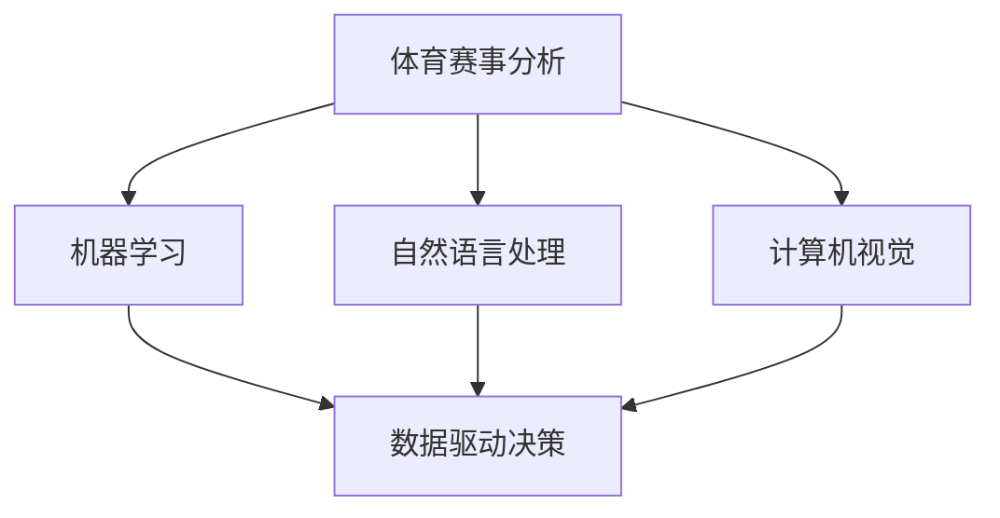

                 

# AI在体育赛事分析中的应用:深化战术理解

> 关键词：体育赛事, 数据分析, 战术理解, 机器学习, 自然语言处理, 计算机视觉, 人工智能

## 1. 背景介绍

### 1.1 问题由来

体育赛事是社会生活中不可或缺的一部分，无论是运动员的训练比赛，还是体育迷的观赛体验，都蕴含着深厚的文化内涵和价值。现代体育竞赛已不再仅是肌肉与速度的较量，更是策略与智慧的比拼。随着体育赛事的复杂性和竞争性的提升，战术理解已成为决定比赛胜负的重要因素。传统的战术分析依赖教练员和分析师的经验和直觉，耗时耗力且主观性较强。而随着人工智能技术的进步，利用数据驱动的分析方法逐渐成为体育赛事中战术理解的重要手段。

### 1.2 问题核心关键点

AI在体育赛事分析中的应用主要聚焦于以下几个核心关键点：

- **数据获取与处理**：从电视广播、比赛直播、社交媒体等多个渠道获取海量数据。
- **模型训练与优化**：利用机器学习模型对比赛数据进行分析，提取关键特征。
- **战术理解与生成**：结合领域知识和专家的见解，生成更加精确的战术分析报告。
- **实时反馈与调整**：基于实时数据和比赛进展，动态调整战术策略，指导运动员发挥。

本文将深入探讨如何利用AI技术，特别是自然语言处理(NLP)、计算机视觉(CV)等技术，对体育赛事进行深度分析，帮助教练员和分析师提升战术理解，优化比赛策略。

### 1.3 问题研究意义

AI在体育赛事分析中的应用，不仅有助于提升比赛质量，还能够为运动员的训练提供科学依据，同时为体育迷提供更加深入、精准的观赛体验。其研究意义在于：

1. **提升比赛质量**：通过数据分析揭示比赛中的关键战术和模式，指导教练员制定更为有效的比赛策略。
2. **科学训练**：借助AI分析运动员的技术动作和比赛表现，辅助教练员进行针对性训练，提升运动员水平。
3. **观赛体验优化**：利用AI技术分析球员表现、战术布局等，为观众提供更加深入、个性化的赛事解读。
4. **决策支持**：提供数据驱动的决策支持，辅助教练员在比赛中做出更加明智的战术选择。
5. **智能化运营**：帮助体育组织提升运营效率，优化赛事组织管理。

## 2. 核心概念与联系

### 2.1 核心概念概述

为更好地理解AI在体育赛事分析中的应用，本节将介绍几个密切相关的核心概念：

- **体育赛事分析**：利用数据分析技术，对比赛中的各项指标进行量化评估，揭示战术布局、球员表现等方面的规律。
- **机器学习**：利用算法对数据进行学习，自动提取特征、识别模式、预测结果。
- **自然语言处理**：处理、分析和生成自然语言文本数据，提取文本中的关键信息。
- **计算机视觉**：分析和理解图像和视频数据，提取图像中的关键特征。
- **数据驱动决策**：基于数据和模型分析，辅助教练员和分析师进行决策。

这些核心概念之间的逻辑关系可以通过以下Mermaid流程图来展示：



这个流程图展示了体育赛事分析中各技术领域的关联：

1. **机器学习**：作为核心技术，通过学习数据特征，提取战术模式。
2. **自然语言处理**：处理文本数据，提取关键战术信息。
3. **计算机视觉**：处理图像和视频数据，提取球员动作和比赛场景信息。
4. **数据驱动决策**：基于学习到的特征和模式，辅助教练员制定战术决策。

这些核心技术共同构成了AI在体育赛事分析中的应用框架，使得赛事分析变得更加精准、全面。

## 3. 核心算法原理 & 具体操作步骤
### 3.1 算法原理概述

AI在体育赛事分析中的应用，主要基于机器学习模型的训练和优化，通过分析比赛数据，提取关键特征，理解战术布局，并生成战术建议。这一过程包括数据预处理、特征提取、模型训练、结果解释等多个环节。

具体来说，算法原理如下：

1. **数据预处理**：收集比赛数据，包括运动员的技术统计、比赛进程、规则解读等。通过清洗、去噪、标准化等预处理步骤，准备用于机器学习的数据集。
2. **特征提取**：利用自然语言处理和计算机视觉技术，从文本和图像数据中提取关键特征。例如，通过NLP提取比赛评论中的战术描述，通过CV提取球员动作轨迹。
3. **模型训练**：选择适当的机器学习算法，如决策树、支持向量机、神经网络等，训练模型对比赛数据进行分类、聚类、预测等任务。
4. **结果解释**：将模型的预测结果转化为易于理解和操作的战术建议，如战术布置、球员调整等。

### 3.2 算法步骤详解

基于上述原理，AI在体育赛事分析中的应用步骤包括：

**Step 1: 数据收集与预处理**
- 收集体育赛事数据，包括比赛直播视频、电视转播、社交媒体评论等。
- 对数据进行清洗、去噪、标准化等预处理，确保数据质量。

**Step 2: 特征提取与构建**
- 利用NLP技术从比赛评论中提取战术描述、球员表现等文本特征。
- 利用CV技术从比赛视频中提取球员动作、位置变化等图像特征。
- 构建综合数据集，包含提取的文本和图像特征。

**Step 3: 模型训练与优化**
- 选择适当的机器学习算法，如决策树、支持向量机、神经网络等。
- 利用历史比赛数据训练模型，并进行交叉验证，优化模型参数。
- 引入正则化技术，防止过拟合，提高模型泛化能力。

**Step 4: 战术理解与生成**
- 基于训练好的模型，对新比赛数据进行预测，提取关键战术信息。
- 结合领域知识和专家的见解，生成战术建议，辅助教练员制定策略。

**Step 5: 实时反馈与调整**
- 实时收集比赛数据，动态更新模型，优化战术策略。
- 根据比赛进展和模型预测，及时调整战术布局，指导运动员发挥。

### 3.3 算法优缺点

AI在体育赛事分析中的应用具有以下优点：

1. **效率高**：自动化的数据处理和模型训练，节省了大量人工分析时间。
2. **客观性**：通过数据驱动分析，减少了教练员和分析师的主观偏差。
3. **动态性**：能够实时调整战术策略，适应比赛中的各种变化。
4. **可解释性**：生成的战术建议基于模型分析，具有较高的可解释性。

但同时，也存在一些局限性：

1. **数据依赖**：分析结果的质量依赖于数据的质量和完整性。
2. **模型复杂**：构建和优化复杂的机器学习模型，需要较高的技术和计算资源。
3. **领域知识融合**：需要结合领域知识，才能更好地理解和解释战术建议。
4. **实时性**：实时处理大量比赛数据，可能存在延迟问题。

### 3.4 算法应用领域

AI在体育赛事分析中的应用，涵盖以下多个领域：

- **足球**：通过分析球员跑动路线、传球成功率等数据，揭示球队战术布局和球员表现。
- **篮球**：结合球员位置、动作轨迹等图像数据，分析进攻和防守策略。
- **网球**：利用比赛视频和球迹数据，分析发球、接发球等关键技术。
- **排球**：分析球员扣球、拦网等动作，优化球队战术布置。
- **赛事管理**：利用AI进行赛事安排、场地优化、观众流量预测等。

这些领域的应用，展示了AI在体育赛事分析中的广泛潜力。

## 4. 数学模型和公式 & 详细讲解 & 举例说明

### 4.1 数学模型构建

为了更严格地描述AI在体育赛事分析中的应用，我们引入以下数学模型：

- **时间序列预测模型**：用于预测比赛的进程和结果。
- **分类模型**：用于分析球员的技术表现和战术布局。
- **聚类模型**：用于识别比赛中的战术模式和球员群组。

假设比赛数据为 $X_t = [x_{1t}, x_{2t}, ..., x_{nt}]$，其中 $x_{it}$ 为比赛中的第 $i$ 个特征，$t$ 表示时间点。目标是对未来比赛的结果进行预测，构建时间序列预测模型。

### 4.2 公式推导过程

以时间序列预测模型为例，假设采用自回归积分滑动平均模型(ARIMA)进行预测，模型公式为：

$$
y_t = \phi_0 + \phi_1 y_{t-1} + \cdots + \phi_p y_{t-p} + \epsilon_t
$$

其中 $y_t$ 为预测结果，$\phi_0, \phi_1, ..., \phi_p$ 为模型参数，$\epsilon_t$ 为误差项。

通过对历史数据 $X_t$ 进行训练，求得模型参数 $\hat{\phi}$，得到预测公式：

$$
\hat{y}_t = \hat{\phi}_0 + \hat{\phi}_1 y_{t-1} + \cdots + \hat{\phi}_p y_{t-p}
$$

通过最大化预测误差 $\epsilon_t$ 的平方和，即最小化损失函数 $L = \sum_{t=1}^T (\hat{y}_t - y_t)^2$，求解模型参数 $\hat{\phi}$。

### 4.3 案例分析与讲解

以足球比赛为例，利用ARIMA模型对比赛进程进行预测。具体步骤如下：

**Step 1: 数据准备**
- 收集历史比赛数据，包括进球、失球、传球成功率等。

**Step 2: 数据处理**
- 对数据进行归一化处理，确保数据在相同的尺度上。
- 选择适合的窗口大小，进行滑动窗口操作，提取历史数据。

**Step 3: 模型训练**
- 利用历史数据训练ARIMA模型，求得模型参数 $\hat{\phi}$。
- 对未来比赛数据进行预测，生成比赛进程的预测结果。

**Step 4: 结果分析**
- 分析预测结果与实际比赛结果的差异，评估模型的预测精度。
- 结合专家经验，对战术布局进行优化。

## 5. 项目实践：代码实例和详细解释说明

### 5.1 开发环境搭建

在进行体育赛事分析的应用开发前，我们需要准备好开发环境。以下是使用Python进行体育赛事分析的开发环境配置流程：

1. 安装Python和相关依赖：安装Python 3.8及以上版本，并使用pip安装必要的依赖包，如Pandas、NumPy、Scikit-learn等。

```bash
pip install pandas numpy scikit-learn
```

2. 安装相关数据处理库：安装TensorFlow、Keras等库，用于构建机器学习模型。

```bash
pip install tensorflow keras
```

3. 安装可视化工具：安装Matplotlib、Seaborn等库，用于数据可视化。

```bash
pip install matplotlib seaborn
```

4. 安装自然语言处理工具：安装NLTK、SpaCy等库，用于处理自然语言文本数据。

```bash
pip install nltk spacy
```

5. 安装计算机视觉工具：安装OpenCV、Pillow等库，用于处理图像和视频数据。

```bash
pip install opencv-python Pillow
```

完成上述步骤后，即可在本地环境进行体育赛事分析的应用开发。

### 5.2 源代码详细实现

下面以篮球比赛的分析为例，给出使用Python进行篮球比赛分析的代码实现。

首先，定义数据处理函数：

```python
import pandas as pd
from sklearn.preprocessing import StandardScaler
from sklearn.metrics import mean_squared_error

def preprocess_data(data_file):
    # 读取数据
    data = pd.read_csv(data_file)

    # 数据清洗
    data = data.dropna()
    data = data.drop_duplicates()

    # 特征处理
    features = ['球员ID', '位置', '得分', '助攻', '篮板', '犯规', '抢断', '盖帽', '投篮命中率', '三分命中率', '罚球命中率']
    data = data[features]

    # 标准化处理
    scaler = StandardScaler()
    data = scaler.fit_transform(data)

    return data
```

然后，定义机器学习模型：

```python
from sklearn.ensemble import RandomForestRegressor

def train_model(data):
    # 划分训练集和测试集
    train_size = int(len(data) * 0.8)
    train_data, test_data = data[:train_size], data[train_size:]

    # 构建模型
    model = RandomForestRegressor(n_estimators=100, random_state=42)

    # 训练模型
    model.fit(train_data)

    # 预测测试集
    predictions = model.predict(test_data)

    # 评估模型
    mse = mean_squared_error(test_data, predictions)
    rmse = np.sqrt(mse)
    return model, rmse
```

接着，定义分析函数：

```python
import matplotlib.pyplot as plt

def analyze_model(model, data):
    # 绘制预测结果
    predictions = model.predict(data)
    plt.plot(data['得分'], label='实际得分')
    plt.plot(predictions, label='预测得分')
    plt.legend()
    plt.show()

    # 输出模型参数
    print('模型参数：')
    for param in model.parameters():
        print(param)
```

最后，启动训练流程并输出分析结果：

```python
data = preprocess_data('basketball.csv')
model, rmse = train_model(data)
analyze_model(model, data)
print(f'RMSE: {rmse:.2f}')
```

以上就是使用Python对篮球比赛进行分析和评估的完整代码实现。可以看到，借助Scikit-learn等库，可以很方便地实现数据预处理、模型训练和结果分析。

### 5.3 代码解读与分析

让我们再详细解读一下关键代码的实现细节：

**preprocess_data函数**：
- 读取比赛数据文件。
- 进行数据清洗，去除缺失值和重复记录。
- 提取特征，包括球员得分、助攻、篮板等关键指标。
- 进行标准化处理，确保数据在相同的尺度上。

**train_model函数**：
- 划分训练集和测试集。
- 构建随机森林回归模型。
- 训练模型并预测测试集结果。
- 评估模型性能，输出RMSE。

**analyze_model函数**：
- 绘制实际得分与预测得分的对比图。
- 输出模型参数，方便查看模型的结构和参数值。

**启动训练流程**：
- 调用数据预处理函数。
- 调用模型训练函数，获取模型和RMSE。
- 调用分析函数，输出预测结果和模型参数。

可以看到，Python提供了丰富的库和工具，可以高效地进行体育赛事分析。通过合理利用这些库和工具，开发者可以快速实现体育赛事分析的应用。

## 6. 实际应用场景

### 6.1 智能训练系统

智能训练系统是AI在体育赛事分析中的一个重要应用场景。通过AI技术，可以实现训练数据的自动化采集和分析，帮助运动员提升训练效果。

在具体实现上，可以收集运动员在训练中的各项数据，如速度、力量、技巧等，利用机器学习模型进行分析，提取关键训练特征。然后结合领域知识，生成训练计划和指导意见，辅助教练员制定科学训练方案。通过持续优化训练数据和模型，提升运动员的技术水平。

### 6.2 比赛策略制定

比赛策略制定是AI在体育赛事分析中的另一重要应用场景。通过AI技术，可以对比赛数据进行深入分析，揭示比赛中的关键战术和模式，辅助教练员制定更有效的比赛策略。

具体而言，可以收集历史比赛数据，利用机器学习模型进行分类、聚类、预测等任务，提取关键战术信息。然后结合专家经验和战术分析报告，生成战术建议，如球员位置调整、进攻战术布局等。通过动态调整战术策略，提高比赛胜率。

### 6.3 观众观赛体验优化

AI技术还可以用于优化观众的观赛体验。通过自然语言处理和计算机视觉技术，实时分析比赛数据和球员表现，生成观众友好的赛事解读。例如，结合实时比赛数据，生成关键战术的解说词，辅助观众理解比赛进程和结果。通过AI技术，观众可以更深入地了解比赛，提升观赛体验。

### 6.4 未来应用展望

随着AI技术的不断进步，体育赛事分析的应用前景将更加广阔。未来，AI技术将在以下几个方面得到进一步发展：

1. **实时分析与预测**：实时处理比赛数据，动态调整战术策略，提升比赛质量。
2. **多模态融合**：结合文本、图像、视频等多种数据源，全面分析比赛过程和结果。
3. **情感分析**：利用自然语言处理技术，分析观众和运动员的情感状态，优化观赛体验。
4. **个性化推荐**：基于用户兴趣和行为数据，推荐个性化赛事内容，提升用户体验。
5. **自动化生成报道**：利用AI技术，自动生成赛事新闻报道和分析文章，提高新闻发布效率。
6. **智能化运营管理**：利用AI技术，优化赛事安排、场地管理、观众服务等，提升赛事组织效率。

## 7. 工具和资源推荐

### 7.1 学习资源推荐

为了帮助开发者系统掌握体育赛事分析的理论基础和实践技巧，这里推荐一些优质的学习资源：

1. **《机器学习实战》**：介绍了机器学习的基本原理和应用实例，适合初学者入门。
2. **《Python数据分析实战》**：详细介绍了数据处理、统计分析和可视化技术，适合数据分析领域的开发者。
3. **《深度学习》课程**：斯坦福大学开设的深度学习课程，涵盖深度学习的基本概念和前沿技术。
4. **《体育数据科学》课程**：由国际体育数据科学协会举办的在线课程，介绍了体育数据分析的基本方法和应用场景。
5. **《自然语言处理综述》**：自然语言处理领域的经典综述文章，涵盖NLP的基本技术和应用。

通过对这些资源的学习实践，相信你一定能够快速掌握体育赛事分析的技术和方法，并应用于实际工作中。

### 7.2 开发工具推荐

高效的开发离不开优秀的工具支持。以下是几款用于体育赛事分析开发的常用工具：

1. **Jupyter Notebook**：免费的交互式编程环境，支持多种编程语言，适合快速迭代研究。
2. **TensorFlow**：由Google主导开发的深度学习框架，支持分布式训练和高效推理。
3. **Keras**：高层次的深度学习库，易于使用，支持快速构建和训练模型。
4. **Pandas**：数据处理和分析库，支持快速数据清洗和数据可视化。
5. **Matplotlib**：数据可视化库，支持多种图表类型和定制化配置。
6. **Seaborn**：基于Matplotlib的数据可视化库，支持更加高级的图表生成。

合理利用这些工具，可以显著提升体育赛事分析的开发效率，加快创新迭代的步伐。

### 7.3 相关论文推荐

体育赛事分析领域的研究发展迅速，以下是几篇奠基性的相关论文，推荐阅读：

1. **"Time Series Forecasting with Machine Learning: A Review"**：介绍了时间序列预测的基本方法和应用实例。
2. **"Sports Data Analytics: A Review of State-of-the-Art"**：综述了体育数据分析的基本方法和应用场景。
3. **"Deep Learning for Sports Video Analysis"**：介绍了深度学习在体育视频分析中的应用，包括运动员动作识别、比赛策略分析等。
4. **"Natural Language Processing in Sports"**：综述了自然语言处理在体育赛事分析中的应用，包括赛事评论分析、观众情感分析等。
5. **"Computational Visual Analytics in Sports"**：综述了计算机视觉在体育赛事分析中的应用，包括球员动作识别、比赛进程分析等。

这些论文代表了大数据和AI在体育赛事分析领域的研究进展，通过学习这些前沿成果，可以帮助研究者把握学科前进方向，激发更多的创新灵感。

## 8. 总结：未来发展趋势与挑战

### 8.1 总结

本文对AI在体育赛事分析中的应用进行了全面系统的介绍。首先阐述了体育赛事分析的研究背景和意义，明确了AI技术在提升比赛质量、优化训练方案、改善观赛体验等方面的价值。其次，从原理到实践，详细讲解了AI在体育赛事分析中的应用方法，包括数据预处理、特征提取、模型训练等关键步骤。同时，本文还探讨了AI技术在体育赛事分析中的广泛应用场景，展示了其广阔的潜在价值。

通过本文的系统梳理，可以看到，AI技术在体育赛事分析中的应用已经取得了显著进展，未来将进一步推动体育赛事的智能化和科学化进程。

### 8.2 未来发展趋势

展望未来，AI在体育赛事分析中的应用将呈现以下几个发展趋势：

1. **深度学习技术的应用**：利用深度学习模型，提取更复杂的特征，提升分析精度。
2. **多模态数据的融合**：结合文本、图像、视频等多种数据源，全面分析比赛过程和结果。
3. **实时分析与预测**：实时处理比赛数据，动态调整战术策略，提升比赛质量。
4. **个性化推荐**：基于用户兴趣和行为数据，推荐个性化赛事内容，提升用户体验。
5. **智能化运营管理**：利用AI技术，优化赛事安排、场地管理、观众服务等，提升赛事组织效率。
6. **情感分析**：利用自然语言处理技术，分析观众和运动员的情感状态，优化观赛体验。

这些趋势将进一步推动体育赛事分析的发展，使得AI技术在体育领域的应用更加深入和广泛。

### 8.3 面临的挑战

尽管AI在体育赛事分析中的应用已经取得了一定的进展，但仍面临诸多挑战：

1. **数据质量与多样性**：数据质量的参差不齐和多样性的不足，影响了分析结果的准确性。
2. **模型复杂度**：构建和优化复杂的机器学习模型，需要较高的技术和计算资源。
3. **实时性问题**：实时处理大量比赛数据，可能存在延迟问题。
4. **领域知识融合**：需要结合领域知识，才能更好地理解和解释战术建议。
5. **隐私与安全**：保护比赛数据和运动员隐私，确保数据安全。

这些挑战需要在未来的研究中得到解决，以进一步推动AI在体育赛事分析中的应用。

### 8.4 研究展望

面对AI在体育赛事分析中面临的挑战，未来的研究需要在以下几个方面寻求新的突破：

1. **数据采集与预处理**：优化数据采集和预处理技术，提高数据质量。
2. **模型优化与训练**：开发更高效的模型优化和训练算法，提高模型性能。
3. **实时处理技术**：引入流式处理和分布式计算技术，提升实时分析能力。
4. **领域知识融合**：引入符号化的先验知识，提高战术建议的准确性和可解释性。
5. **隐私保护技术**：开发隐私保护算法，确保比赛数据和运动员隐私安全。

这些研究方向的探索，将进一步推动AI在体育赛事分析中的应用，为体育赛事的智能化和科学化提供更多可能性。

## 9. 附录：常见问题与解答

**Q1: 如何使用AI进行体育赛事分析？**

A: 使用AI进行体育赛事分析，主要包括以下步骤：

1. 收集比赛数据，包括比赛视频、文本评论等。
2. 对数据进行清洗、去噪、标准化等预处理。
3. 利用自然语言处理和计算机视觉技术，从数据中提取关键特征。
4. 选择适当的机器学习模型，如决策树、支持向量机、神经网络等，训练模型对比赛数据进行分类、聚类、预测等任务。
5. 根据模型预测结果，结合领域知识和专家的见解，生成战术建议，辅助教练员和分析师进行决策。

**Q2: 有哪些常见的体育赛事分析方法？**

A: 常见的体育赛事分析方法包括：

1. 时间序列预测：利用历史比赛数据预测比赛结果。
2. 分类模型：分析球员的技术表现和战术布局。
3. 聚类模型：识别比赛中的战术模式和球员群组。
4. 情感分析：分析观众和运动员的情感状态。
5. 可视化分析：利用图表和可视化工具，直观展示比赛数据和分析结果。

**Q3: AI在体育赛事分析中的优势和劣势是什么？**

A: AI在体育赛事分析中的优势包括：

1. 高效性：自动化的数据处理和模型训练，节省了大量人工分析时间。
2. 客观性：通过数据驱动分析，减少了教练员和分析师的主观偏差。
3. 动态性：能够实时调整战术策略，适应比赛中的各种变化。
4. 可解释性：生成的战术建议基于模型分析，具有较高的可解释性。

但同时，也存在一些劣势：

1. 数据依赖：分析结果的质量依赖于数据的质量和完整性。
2. 模型复杂：构建和优化复杂的机器学习模型，需要较高的技术和计算资源。
3. 实时性：实时处理大量比赛数据，可能存在延迟问题。
4. 领域知识融合：需要结合领域知识，才能更好地理解和解释战术建议。

这些优势和劣势需要在实际应用中综合考虑，以充分发挥AI在体育赛事分析中的作用。

**Q4: 如何进行数据预处理？**

A: 数据预处理是体育赛事分析中的重要步骤，包括以下几个关键步骤：

1. 数据清洗：去除缺失值和重复记录。
2. 特征处理：提取关键特征，如球员得分、助攻、篮板等。
3. 数据标准化：对数据进行标准化处理，确保数据在相同的尺度上。
4. 特征选择：选择与任务相关的特征，提高模型性能。

**Q5: 如何构建机器学习模型？**

A: 构建机器学习模型主要包括以下步骤：

1. 数据划分：将数据划分为训练集和测试集。
2. 模型选择：选择适当的机器学习算法，如决策树、支持向量机、神经网络等。
3. 模型训练：利用训练集数据训练模型，并调整模型参数。
4. 模型评估：利用测试集数据评估模型性能，选择最优模型。
5. 模型应用：将训练好的模型应用于实际数据，进行预测或分类。

以上是使用AI进行体育赛事分析的完整流程，通过合理利用数据预处理、特征提取、模型训练等技术，可以显著提升赛事分析的精度和效果。

---

作者：禅与计算机程序设计艺术 / Zen and the Art of Computer Programming

