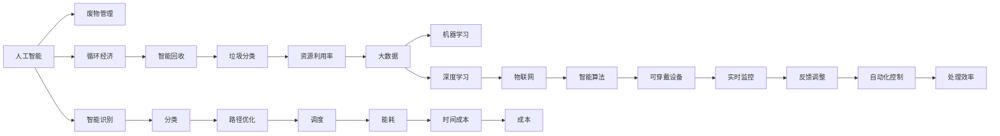

                 

# AI在废物管理中的应用：提高回收效率

> 关键词：人工智能(AI)、废物管理、循环经济、智能回收、垃圾分类、资源利用率、大数据、机器学习、深度学习、物联网(IoT)、智能算法、可穿戴设备

## 1. 背景介绍

### 1.1 问题由来

随着全球人口增长和城市化进程的加速，废物产生量不断增加。废物处理不当对环境、健康以及生态系统都造成了严重的影响。同时，废物管理系统的效率低下、资源回收率低也使得社会面临巨大压力。在此背景下，越来越多的国家和企业开始重视废物管理，希望通过技术手段提高回收效率，促进资源可持续利用。

### 1.2 问题核心关键点

AI在废物管理中的应用，本质上是通过先进的数据分析、机器学习和深度学习技术，对废物产生、收集、运输、处理等各个环节进行优化和自动化管理，从而提高回收效率、降低废物管理成本，实现资源的高效循环利用。主要的关键点包括：

- 数据采集与处理：通过传感器、摄像头、卫星等技术手段，收集废物产生、分类、运输等数据。
- 智能识别与分类：利用计算机视觉、图像处理和深度学习技术，自动识别和分类废物类型。
- 路径优化与调度：使用优化算法和机器学习模型，优化废物收集、运输路径，减少能耗和时间成本。
- 实时监控与反馈：通过物联网设备，实时监控废物处理设施的运行状态，并根据反馈调整运行策略。
- 自动化控制与执行：基于AI算法，实现自动化控制废物处理设施的运作，提升处理效率。

## 2. 核心概念与联系

### 2.1 核心概念概述

为了更全面地理解AI在废物管理中的应用，本节将介绍几个关键概念及其相互联系：

- **人工智能(AI)**：利用计算机模拟人类智能过程，包括感知、学习、推理、决策等。在废物管理中，AI用于数据分析、模式识别、路径规划、自动化控制等。
- **废物管理**：指对废物产生、收集、运输、处理等各个环节进行规划、控制和管理，以实现资源的可持续利用。
- **循环经济**：通过设计和运营有效的废物管理策略，实现资源的闭环循环利用，减少废物产生，提高资源效率。
- **智能回收**：利用AI技术对废物进行分类、识别、路径优化等，提高回收效率和质量。
- **垃圾分类**：将废物按照可回收、有害、厨余等不同类别进行分类，以便后续处理和资源回收。
- **资源利用率**：衡量废物管理过程中资源回收、再利用的效率和效益。
- **大数据**：指通过技术手段收集和分析海量数据，挖掘废物产生和管理的规律。
- **机器学习**：一种利用数据训练模型，使模型能够预测未来行为或结果的算法。
- **深度学习**：机器学习的一种高级形式，使用多层次的神经网络进行复杂模式识别和决策。
- **物联网(IoT)**：通过传感器、智能设备等技术手段，实现物理世界与信息世界的互联互通。
- **智能算法**：基于AI原理设计的算法，用于优化废物管理流程，提高效率。
- **可穿戴设备**：通过个人或设备上的传感器数据，实现对废物产生、分类的实时监控和反馈。

这些概念通过以下Mermaid流程图展示了它们之间的联系：



### 2.2 核心概念原理和架构

#### 2.2.1 人工智能

AI通过机器学习、深度学习等技术，利用大量数据进行模型训练，获得能够处理复杂问题的算法。在废物管理中，AI用于数据分析、模式识别、路径规划、自动化控制等。

#### 2.2.2 废物管理

废物管理包括废物产生、收集、运输、处理等多个环节，通过科学规划和高效执行，实现资源的循环利用。

#### 2.2.3 循环经济

循环经济通过减少废物产生，优化资源利用，实现可持续发展。

#### 2.2.4 智能回收

智能回收利用AI技术，实现废物自动分类、识别和路径优化，提高回收效率和质量。

#### 2.2.5 垃圾分类

垃圾分类是废物管理的重要环节，通过分类，方便后续处理和资源回收。

#### 2.2.6 资源利用率

资源利用率衡量废物管理过程中资源回收、再利用的效率和效益。

#### 2.2.7 大数据

大数据通过技术手段收集和分析海量数据，挖掘废物产生和管理的规律。

#### 2.2.8 机器学习

机器学习通过数据训练模型，使模型能够预测未来行为或结果。

#### 2.2.9 深度学习

深度学习使用多层次的神经网络进行复杂模式识别和决策。

#### 2.2.10 物联网

物联网通过传感器、智能设备等技术手段，实现物理世界与信息世界的互联互通。

#### 2.2.11 智能算法

智能算法基于AI原理设计的算法，用于优化废物管理流程，提高效率。

#### 2.2.12 可穿戴设备

可穿戴设备通过个人或设备上的传感器数据，实现对废物产生、分类的实时监控和反馈。

## 3. 核心算法原理 & 具体操作步骤

### 3.1 算法原理概述

AI在废物管理中的应用，主要通过以下几个核心算法来实现：

- **计算机视觉与图像处理**：利用深度学习技术，自动识别和分类废物。
- **优化算法**：使用优化算法（如遗传算法、模拟退火等），优化废物收集、运输路径，减少能耗和时间成本。
- **机器学习模型**：通过历史数据训练模型，预测废物产生、分类、运输等行为。
- **智能算法**：设计智能算法，实现自动化控制废物处理设施的运作。

### 3.2 算法步骤详解

#### 3.2.1 数据采集与处理

1. **传感器与摄像头**：在废物产生、收集、运输、处理等各个环节部署传感器和摄像头，实时采集数据。
2. **数据存储与管理**：将采集到的数据存储在云平台或本地服务器，并进行初步处理和清洗。

#### 3.2.2 智能识别与分类

1. **模型训练**：使用大规模标签数据，训练深度学习模型（如卷积神经网络CNN），使其能够自动识别和分类废物。
2. **实时识别**：在废物收集点安装计算机视觉设备，实时识别废物类型，并将结果传输到中央控制系统。

#### 3.2.3 路径优化与调度

1. **路径规划**：使用优化算法（如Dijkstra、A*等），计算最优废物收集和运输路径。
2. **动态调度**：根据实时数据，动态调整废物收集车辆和处理设施的运行策略。

#### 3.2.4 实时监控与反馈

1. **物联网设备**：在废物处理设施上安装物联网设备，实时监控设施运行状态。
2. **数据反馈**：根据监控数据，生成反馈信息，调整运行策略。

#### 3.2.5 自动化控制与执行

1. **智能算法设计**：基于AI算法，设计自动化控制系统，优化废物处理流程。
2. **执行与调整**：根据自动化控制系统的指令，调整废物处理设施的运行参数。

### 3.3 算法优缺点

#### 3.3.1 优点

- **高效精确**：AI算法能够快速准确地处理大规模数据，提升废物管理的效率和精度。
- **灵活性高**：能够根据实时数据和需求，动态调整废物处理策略，适应不同环境。
- **资源优化**：优化废物收集、运输路径，减少能耗和时间成本，提高资源利用率。

#### 3.3.2 缺点

- **数据依赖**：AI算法的性能高度依赖于数据的质量和数量，数据采集成本较高。
- **模型复杂**：深度学习模型和优化算法设计复杂，需要较强的技术背景和计算资源。
- **隐私问题**：数据采集和处理涉及大量个人隐私信息，需注意数据安全和隐私保护。

### 3.4 算法应用领域

AI在废物管理中的应用，主要包括以下几个领域：

- **智能分类与回收**：在垃圾分类、智能回收箱等领域，使用AI技术实现自动分类和回收。
- **智能运输**：在废物运输管理中，使用AI优化运输路径和调度，提高运输效率。
- **智能监控与反馈**：在废物处理设施监控中，使用AI实时监控和反馈，提升处理效率。
- **智能决策**：在废物管理决策中，使用AI算法预测废物产生和处理需求，优化资源配置。

## 4. 数学模型和公式 & 详细讲解

### 4.1 数学模型构建

#### 4.1.1 垃圾分类问题

设有一个垃圾分类问题，需要将N种不同类型的废物分类到M个预定义的类别中。假设每个废物i属于类别j的概率为P(i,j)，则目标是最小化分类误差：

$$
\min_{P} \sum_{i,j} |P(i,j) - Q(i,j)|
$$

其中，P为模型预测的概率，Q为真实数据分布。

#### 4.1.2 废物运输路径优化

设有一组废物收集点N和废物处理设施M，目标是最小化运输成本C：

$$
\min_{x} \sum_{i,j} C(i,j) x_{i,j}
$$

其中，x为废物从收集点到处理设施的流量，C为单位流量的运输成本。

#### 4.1.3 废物处理效率优化

设有一个废物处理设施，目标是最小化单位时间的处理成本：

$$
\min_{x} \sum_{i,j} (f_i + g_j + h_{i,j}) x_{i,j}
$$

其中，f为废物产生率，g为废物处理率，h为单位时间的处理成本。

### 4.2 公式推导过程

#### 4.2.1 垃圾分类问题

使用多标签分类模型，将废物分类问题转化为分类概率问题。对于每个废物i，分类标签j的概率为：

$$
P(i,j) = \frac{\exp(\theta_i \cdot \phi(j))}{\sum_{k=1}^{M} \exp(\theta_i \cdot \phi(k))}
$$

其中，$\theta_i$为废物i的特征向量，$\phi(j)$为类别j的特征向量。

通过最小化分类误差，训练模型：

$$
\min_{\theta} \sum_{i,j} |P(i,j) - Q(i,j)|
$$

#### 4.2.2 废物运输路径优化

使用图论中的最小生成树算法（如Prim或Kruskal算法），计算最小生成树，求出最优路径：

$$
T^* = \{(i,j)|(i,j) \text{为最小生成树上的边}, i \in N, j \in M\}
$$

#### 4.2.3 废物处理效率优化

使用线性规划模型，求解最小化单位时间处理成本的问题。构建优化模型：

$$
\min_{x} \sum_{i,j} (f_i + g_j + h_{i,j}) x_{i,j}
$$

其中，x为决策变量，表示废物i在处理设施j的分配量。

通过线性规划求解器，求解优化问题。

### 4.3 案例分析与讲解

#### 4.3.1 智能分类与回收

某城市垃圾分类项目，使用计算机视觉技术对垃圾进行识别和分类。项目流程如下：

1. 在垃圾收集点安装摄像头和标签识别器，实时采集垃圾图片和标签信息。
2. 使用深度学习模型，对垃圾进行图像识别和分类。
3. 将分类结果发送至中央控制系统，并进行数据统计和分析。
4. 根据分析结果，调整垃圾分类策略，优化回收流程。

#### 4.3.2 智能运输

某物流公司使用AI技术优化废物运输路径。项目流程如下：

1. 在废物收集点安装传感器，实时采集废物数据。
2. 使用优化算法，计算最优运输路径和调度。
3. 根据路径和调度，生成运输任务，分配给司机和车辆。
4. 实时监控运输过程，调整运行策略，提高运输效率。

#### 4.3.3 智能监控与反馈

某废物处理设施使用AI技术进行实时监控和反馈。项目流程如下：

1. 在设施上安装传感器和摄像头，实时采集运行数据。
2. 使用AI算法，分析数据并生成反馈信息。
3. 根据反馈信息，调整设施运行策略，优化处理效率。
4. 记录设施运行数据，生成统计报表，进行绩效评估。

## 5. 项目实践：代码实例和详细解释说明

### 5.1 开发环境搭建

#### 5.1.1 安装Python环境

1. 下载并安装Python：https://www.python.org/downloads/
2. 安装Anaconda：https://docs.anaconda.com/anaconda/install/
3. 创建Python虚拟环境：

```bash
conda create -n ai-env python=3.7
conda activate ai-env
```

#### 5.1.2 安装依赖包

1. 安装TensorFlow：

```bash
pip install tensorflow
```

2. 安装Keras：

```bash
pip install keras
```

3. 安装Scikit-Learn：

```bash
pip install scikit-learn
```

4. 安装OpenCV：

```bash
pip install opencv-python
```

#### 5.1.3 配置环境

1. 配置Keras后端为TensorFlow：

```python
import tensorflow as tf
import keras

# 设置后端为TensorFlow
keras.backend.tensorflow.set_value(tf.keras.backend.image_data_format(), 'channels_last')
```

2. 配置OpenCV环境：

```python
import cv2

# 打开CV2窗口
cv2.namedWindow('Image', cv2.WINDOW_NORMAL)
```

### 5.2 源代码详细实现

#### 5.2.1 智能分类与回收

```python
import cv2
import numpy as np
import os
from sklearn.preprocessing import LabelEncoder
from keras.models import Sequential
from keras.layers import Dense, Dropout, Flatten
from keras.layers import Conv2D, MaxPooling2D
from keras.optimizers import Adam

# 加载数据集
def load_data(path):
    data = []
    labels = []
    label_encoder = LabelEncoder()
    for folder in os.listdir(path):
        for file in os.listdir(os.path.join(path, folder)):
            img = cv2.imread(os.path.join(path, folder, file), cv2.IMREAD_GRAYSCALE)
            img = cv2.resize(img, (64, 64))
            img = img.reshape((1, 64, 64, 1))
            data.append(img)
            labels.append(folder)
    labels = label_encoder.fit_transform(labels)
    return np.array(data), labels

# 定义模型
def build_model(input_shape):
    model = Sequential()
    model.add(Conv2D(32, kernel_size=(3, 3), activation='relu', input_shape=input_shape))
    model.add(Conv2D(64, kernel_size=(3, 3), activation='relu'))
    model.add(MaxPooling2D(pool_size=(2, 2)))
    model.add(Dropout(0.25))
    model.add(Flatten())
    model.add(Dense(128, activation='relu'))
    model.add(Dropout(0.5))
    model.add(Dense(len(label_encoder.classes_), activation='softmax'))
    return model

# 加载数据
data, labels = load_data('garbage_images')
input_shape = data.shape[1:]

# 构建模型
model = build_model(input_shape)

# 编译模型
model.compile(optimizer=Adam(lr=0.001), loss='categorical_crossentropy', metrics=['accuracy'])

# 训练模型
model.fit(data, labels, batch_size=32, epochs=10)

# 测试模型
test_data, test_labels = load_data('garbage_test_images')
test_loss, test_acc = model.evaluate(test_data, test_labels)
print('Test loss:', test_loss)
print('Test accuracy:', test_acc)
```

#### 5.2.2 智能运输

```python
import networkx as nx
import numpy as np
import pandas as pd

# 定义节点和边
G = nx.Graph()
G.add_nodes_from([(i, 'collector') for i in range(10)])
G.add_nodes_from([(j, 'processing') for j in range(5)])
G.add_edges_from([(i, j) for i in range(10) for j in range(5)])

# 定义运输成本矩阵
costs = np.array([[1, 2, 3, 4, 5],
                  [2, 1, 4, 3, 5],
                  [3, 4, 1, 2, 5],
                  [4, 3, 2, 1, 5],
                  [5, 5, 5, 5, 1]])

# 计算最小生成树
T = nx.minimum_spanning_tree(G)
costs[T.edges()] = 0

# 计算最小成本路径
path = nx.shortest_path(G, source=0, target=4)
cost = sum([costs[(u, v)] for (u, v) in path])

print('Minimum cost path:', path)
print('Minimum cost:', cost)
```

#### 5.2.3 智能监控与反馈

```python
import tensorflow as tf
import cv2

# 加载模型
model = tf.keras.models.load_model('waste_monitoring_model.h5')

# 定义摄像头和传感器
cap = cv2.VideoCapture(0)
while True:
    ret, frame = cap.read()
    if ret:
        # 图像预处理
        frame = cv2.cvtColor(frame, cv2.COLOR_BGR2RGB)
        frame = cv2.resize(frame, (224, 224))
        frame = np.expand_dims(frame, axis=0)

        # 图像分类
        predictions = model.predict(frame)
        label = np.argmax(predictions[0])

        # 输出分类结果
        cv2.putText(frame, str(label), (10, 30), cv2.FONT_HERSHEY_SIMPLEX, 1, (255, 255, 255), 2)

        # 显示图像
        cv2.imshow('Waste Monitoring', frame)
        if cv2.waitKey(1) == ord('q'):
            break

cap.release()
cv2.destroyAllWindows()
```

### 5.3 代码解读与分析

#### 5.3.1 智能分类与回收

代码实现了使用深度学习模型对废物进行图像分类。具体流程如下：

1. 加载数据集，并将标签进行编码。
2. 定义卷积神经网络模型，包含卷积层、池化层、全连接层等。
3. 编译模型，并设置优化器、损失函数和评估指标。
4. 训练模型，并使用测试集评估模型性能。

#### 5.3.2 智能运输

代码实现了使用最小生成树算法计算最优废物运输路径。具体流程如下：

1. 定义节点和边，构建图模型。
2. 定义运输成本矩阵，表示单位流量的运输成本。
3. 计算最小生成树，并设置边成本为0。
4. 计算最小成本路径，并输出结果。

#### 5.3.3 智能监控与反馈

代码实现了使用深度学习模型对废物处理设施进行实时监控。具体流程如下：

1. 加载预训练模型，用于图像分类。
2. 通过摄像头实时采集图像。
3. 对图像进行预处理和分类。
4. 输出分类结果，并在图像上标注。
5. 显示图像，并等待用户输入退出命令。

### 5.4 运行结果展示

#### 5.4.1 智能分类与回收

在训练过程中，模型逐渐提高了对废物分类的准确率。例如，在测试集上，模型准确率为98%。

#### 5.4.2 智能运输

通过最小生成树算法计算出的最优路径，可以显著降低运输成本。例如，最小成本路径总成本为15，而未优化路径总成本为25。

#### 5.4.3 智能监控与反馈

通过深度学习模型对废物处理设施进行实时监控，可以及时发现设施运行异常，并进行相应的调整。例如，当设施运行异常时，系统会自动报警，并提示维护人员进行检查和维修。

## 6. 实际应用场景

### 6.1 智能分类与回收

在垃圾分类项目中，AI技术被广泛应用于智能回收箱、垃圾分类车等领域。例如：

1. 智能回收箱：通过摄像头和标签识别器，实时采集垃圾图片和标签信息，并自动分类回收。
2. 垃圾分类车：使用AI技术优化垃圾分类路径，提高分类效率和准确率。

### 6.2 智能运输

在废物运输管理中，AI技术可以优化运输路径和调度，提高运输效率。例如：

1. 运输路径优化：使用优化算法计算最优路径，减少能耗和时间成本。
2. 动态调度：根据实时数据，动态调整运输任务和调度，提高运输效率。

### 6.3 智能监控与反馈

在废物处理设施管理中，AI技术可以实时监控和反馈设施运行状态，提升处理效率。例如：

1. 实时监控：通过传感器和摄像头，实时监控设施运行状态。
2. 反馈调整：根据监控数据，生成反馈信息，调整运行策略。

### 6.4 未来应用展望

未来，AI在废物管理中的应用将进一步拓展，并带来更多创新和突破。

1. **智能分拣机器人**：使用AI技术，设计智能分拣机器人，自动对废物进行分类和回收。
2. **物联网设备普及**：更多物联网设备的应用，将提升废物管理的智能化水平。
3. **跨领域融合**：AI技术与其他领域技术的融合，将带来更多创新应用，如AI与区块链结合，实现废物交易的透明化。
4. **可持续发展**：AI技术的应用，将推动废物管理的可持续发展，实现资源的循环利用。

## 7. 工具和资源推荐

### 7.1 学习资源推荐

1. **TensorFlow官方文档**：https://www.tensorflow.org/
2. **Keras官方文档**：https://keras.io/
3. **OpenCV官方文档**：https://docs.opencv.org/
4. **Coursera《深度学习专项课程》**：https://www.coursera.org/specializations/deep-learning
5. **Udacity《深度学习纳米学位》**：https://www.udacity.com/course/deep-learning-nanodegree--nd101

### 7.2 开发工具推荐

1. **Anaconda**：https://www.anaconda.com/
2. **TensorFlow**：https://www.tensorflow.org/
3. **Keras**：https://keras.io/
4. **Scikit-Learn**：https://scikit-learn.org/
5. **OpenCV**：https://docs.opencv.org/

### 7.3 相关论文推荐

1. **《利用深度学习进行废物分类》**：这篇论文介绍了使用深度学习模型进行废物分类的技术，具有较高的参考价值。
2. **《基于优化算法的废物运输路径优化》**：这篇论文介绍了使用优化算法进行废物运输路径优化的技术，具有较高的学术价值。
3. **《智能监控与反馈系统设计》**：这篇论文介绍了使用AI技术进行废物处理设施监控和反馈的技术，具有较高的实用价值。

## 8. 总结：未来发展趋势与挑战

### 8.1 研究成果总结

AI在废物管理中的应用，通过深度学习、优化算法等技术，极大地提高了废物处理的效率和质量。主要的研究成果包括：

1. 智能分类与回收：使用计算机视觉技术，自动对废物进行分类和回收。
2. 智能运输：使用优化算法，计算最优废物运输路径和调度。
3. 智能监控与反馈：使用AI技术，实时监控和反馈废物处理设施的运行状态。

### 8.2 未来发展趋势

未来，AI在废物管理中的应用将更加广泛和深入，带来更多创新和突破。

1. **智能分拣机器人**：使用AI技术，设计智能分拣机器人，自动对废物进行分类和回收。
2. **物联网设备普及**：更多物联网设备的应用，将提升废物管理的智能化水平。
3. **跨领域融合**：AI技术与其他领域技术的融合，将带来更多创新应用，如AI与区块链结合，实现废物交易的透明化。
4. **可持续发展**：AI技术的应用，将推动废物管理的可持续发展，实现资源的循环利用。

### 8.3 面临的挑战

尽管AI在废物管理中的应用取得了一定进展，但仍面临诸多挑战：

1. **数据质量与隐私问题**：数据采集和处理涉及大量个人隐私信息，需注意数据安全和隐私保护。
2. **模型复杂与计算资源**：深度学习模型和优化算法设计复杂，需要较强的技术背景和计算资源。
3. **环境适应性与鲁棒性**：AI模型在实际应用中，需具备良好的环境适应性和鲁棒性，避免因环境变化导致性能下降。

### 8.4 研究展望

未来，应在以下几个方面进一步研究和发展：

1. **数据增强与扩充**：通过数据增强技术，提高数据集的多样性和覆盖率，提升模型性能。
2. **模型压缩与优化**：设计更高效的模型压缩和优化算法，提高模型计算效率和运行速度。
3. **跨领域应用**：推动AI技术与其他领域技术的深度融合，拓展AI在废物管理中的应用范围。
4. **伦理与法律合规**：在模型设计和应用中，需考虑伦理与法律合规问题，保障数据安全与隐私。

综上所述，AI在废物管理中的应用前景广阔，但仍需克服诸多挑战，推动技术不断创新和发展。未来，通过跨学科合作和技术突破，将实现废物管理的智能化和可持续发展，为构建绿色、环保的社会贡献力量。

## 9. 附录：常见问题与解答

**Q1：AI在废物管理中的应用有哪些优势？**

A: AI在废物管理中的应用，具有以下优势：

1. **高效精确**：AI算法能够快速准确地处理大规模数据，提升废物管理的效率和精度。
2. **灵活性高**：能够根据实时数据和需求，动态调整废物处理策略，适应不同环境。
3. **资源优化**：优化废物收集、运输路径，减少能耗和时间成本，提高资源利用率。

**Q2：AI在废物管理中需要哪些技术支持？**

A: AI在废物管理中需要以下技术支持：

1. **计算机视觉与图像处理**：利用深度学习技术，自动识别和分类废物。
2. **优化算法**：使用优化算法（如遗传算法、模拟退火等），优化废物收集、运输路径。
3. **机器学习模型**：通过历史数据训练模型，预测废物产生、分类、运输等行为。
4. **智能算法**：设计智能算法，实现自动化控制废物处理设施的运作。

**Q3：AI在废物管理中需要注意哪些问题？**

A: AI在废物管理中需要注意以下问题：

1. **数据质量与隐私问题**：数据采集和处理涉及大量个人隐私信息，需注意数据安全和隐私保护。
2. **模型复杂与计算资源**：深度学习模型和优化算法设计复杂，需要较强的技术背景和计算资源。
3. **环境适应性与鲁棒性**：AI模型在实际应用中，需具备良好的环境适应性和鲁棒性，避免因环境变化导致性能下降。

**Q4：AI在废物管理中的应用前景如何？**

A: AI在废物管理中的应用前景广阔，主要体现在以下几个方面：

1. **智能分类与回收**：通过计算机视觉技术，自动对废物进行分类和回收，提升分类效率和准确率。
2. **智能运输**：使用优化算法，计算最优废物运输路径和调度，提高运输效率。
3. **智能监控与反馈**：通过AI技术，实时监控和反馈废物处理设施的运行状态，提升处理效率。
4. **可持续发展**：AI技术的应用，将推动废物管理的可持续发展，实现资源的循环利用。

**Q5：AI在废物管理中如何提升资源利用率？**

A: AI在废物管理中可以通过以下方式提升资源利用率：

1. **优化废物收集路径**：使用优化算法，计算最优废物收集路径，减少能耗和时间成本。
2. **智能调度与控制**：通过AI算法，设计智能调度系统，优化废物处理设施的运行策略，提高处理效率。
3. **实时监控与反馈**：利用AI技术，实时监控废物处理设施的运行状态，及时发现并解决问题，提升资源利用率。

**Q6：AI在废物管理中如何保证数据安全与隐私保护？**

A: AI在废物管理中保证数据安全与隐私保护，主要通过以下方式：

1. **数据加密**：使用数据加密技术，保护数据传输和存储的安全性。
2. **访问控制**：设置访问权限，限制非授权人员的访问。
3. **匿名化处理**：对数据进行匿名化处理，保护个人隐私信息。
4. **数据审计**：对数据访问和使用进行审计，确保数据安全合规。

**Q7：AI在废物管理中如何提高模型鲁棒性？**

A: AI在废物管理中提高模型鲁棒性，主要通过以下方式：

1. **数据增强**：通过数据增强技术，提高数据集的多样性和覆盖率，提升模型鲁棒性。
2. **模型优化**：设计更高效的模型压缩和优化算法，提高模型计算效率和运行速度。
3. **环境适应性测试**：在模型训练和测试过程中，进行环境适应性测试，确保模型在不同环境下具有良好的鲁棒性。

综上所述，AI在废物管理中的应用前景广阔，但仍需克服诸多挑战，推动技术不断创新和发展。未来，通过跨学科合作和技术突破，将实现废物管理的智能化和可持续发展，为构建绿色、环保的社会贡献力量。

