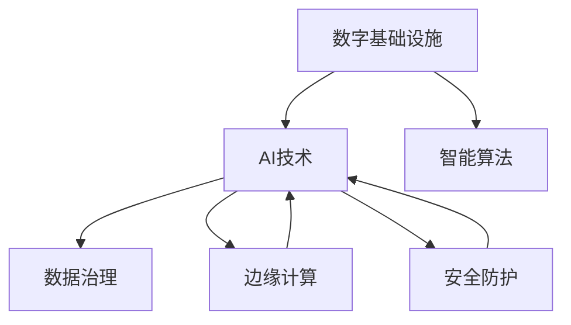

                 

# AI在数字基础设施中的实际应用

## 1. 背景介绍

### 1.1 问题由来

在数字化转型的浪潮下，数字基础设施（Digital Infrastructure）已成为支撑现代社会的关键基石。AI技术的深度融入，为数字基础设施带来了显著的提升和变革。从智能电网、自动驾驶，到智能家居、智慧城市，AI技术正在全面重塑数字基础设施的运行形态。

AI在数字基础设施中的应用，不仅提升了基础设施的智能化、自动化水平，还大幅提升了用户体验和运营效率。然而，随着AI技术的广泛应用，也带来了一系列新的挑战和问题。如何在确保基础设施安全、可靠运行的前提下，最大化AI技术的潜力，成为当前亟待解决的重要课题。

### 1.2 问题核心关键点

AI在数字基础设施中的应用，主要围绕以下几个关键点展开：

- **智能化改造**：通过AI技术对数字基础设施进行智能化升级，提升其运行效率和智能化水平。
- **数据驱动优化**：利用大数据分析和机器学习算法，对基础设施的运行状态进行实时监测和优化，提升用户体验。
- **系统自适应性**：通过AI技术增强数字基础设施的自适应性和弹性，使其能够在不同环境条件下自动调整运行策略，保障服务质量。
- **安全防护**：采用AI技术进行威胁检测、异常行为识别，增强数字基础设施的安全防护能力，防范潜在风险。

这些关键点构成了AI在数字基础设施中的主要应用框架，推动了基础设施的全面升级和创新。

## 2. 核心概念与联系

### 2.1 核心概念概述

为更好地理解AI在数字基础设施中的实际应用，本节将介绍几个密切相关的核心概念：

- **数字基础设施**：包括网络基础设施（如5G、物联网）、计算基础设施（如云平台、边缘计算）、存储基础设施（如数据中心、存储网络）等，是支撑现代数字经济的基础。
- **AI技术**：以机器学习、深度学习为代表的智能化技术，通过大量数据训练模型，使机器具备类似于人类的认知、推理和决策能力。
- **智能算法**：包括强化学习、迁移学习、生成对抗网络等，用于解决特定问题，提升基础设施的智能化水平。
- **数据治理**：通过数据采集、清洗、标注等步骤，构建高质量的数据集，为AI模型训练提供支持。
- **边缘计算**：将计算任务和数据处理任务靠近数据源，减少数据传输时延，提升系统响应速度。
- **安全防护**：利用AI技术进行威胁检测、行为分析，提升数字基础设施的安全防护能力。

这些核心概念之间的逻辑关系可以通过以下Mermaid流程图来展示：



这个流程图展示了一些关键概念及其相互关系：

1. 数字基础设施通过引入AI技术进行智能化改造，提升系统运行效率和智能化水平。
2. AI技术通过智能算法解决特定问题，如强化学习优化系统控制，迁移学习提升数据处理效率。
3. 数据治理为AI模型训练提供支持，确保数据质量和可靠性。
4. 边缘计算将计算任务靠近数据源，减少数据传输时延，提升系统响应速度。
5. 安全防护通过AI技术进行威胁检测和行为分析，增强系统安全性。

这些概念共同构成了AI在数字基础设施中的应用框架，推动了基础设施的全面升级和创新。

## 3. 核心算法原理 & 具体操作步骤

### 3.1 算法原理概述

AI在数字基础设施中的应用，主要基于以下算法原理：

- **强化学习**：通过智能算法，使数字基础设施具备自适应性，能够在复杂环境中进行优化决策，提升系统性能。
- **迁移学习**：通过已有领域的知识，对新领域的数字基础设施进行优化，加速其智能化进程。
- **生成对抗网络**：通过对抗训练，提升数字基础设施的安全防护能力，防范潜在威胁。
- **深度学习**：通过大规模数据训练，提升数字基础设施的智能化水平，实现高效的数据分析和处理。

### 3.2 算法步骤详解

AI在数字基础设施中的应用，一般包括以下几个关键步骤：

**Step 1: 数据收集与处理**

1. **数据收集**：从数字基础设施中收集相关数据，如设备运行状态、用户行为数据、网络流量等。
2. **数据清洗**：对数据进行去重、去噪、标准化处理，确保数据质量和一致性。
3. **数据标注**：对数据进行标注，为模型训练提供监督信号。

**Step 2: 模型训练与优化**

1. **模型选择**：根据具体应用场景，选择合适的AI模型，如深度学习模型、强化学习模型等。
2. **模型训练**：利用清洗后的数据，进行模型训练，优化模型参数。
3. **模型评估**：在验证集上评估模型性能，调整模型结构或参数，直到满足要求。

**Step 3: 系统部署与应用**

1. **模型部署**：将训练好的模型部署到数字基础设施中，进行实时应用。
2. **性能监控**：实时监控模型性能，根据系统反馈调整模型参数，优化系统运行。
3. **系统升级**：根据新需求和新数据，不断更新模型，提升系统智能化水平。

### 3.3 算法优缺点

AI在数字基础设施中的应用，具有以下优点：

1. **提升效率**：通过智能化改造，大幅提升数字基础设施的运行效率和智能化水平，降低运营成本。
2. **优化用户体验**：利用大数据分析和机器学习算法，提升用户体验，增强系统响应速度。
3. **增强自适应性**：通过智能算法，使数字基础设施具备自适应性，能够在复杂环境中进行优化决策。
4. **提升安全性**：利用AI技术进行威胁检测和行为分析，增强系统安全性，防范潜在风险。

同时，也存在一些局限性：

1. **数据质量依赖**：AI模型性能依赖于数据质量，数据清洗和标注工作复杂且耗时。
2. **模型复杂度高**：AI模型通常结构复杂，训练和部署需要较高的计算资源。
3. **易受攻击**：AI模型可能被攻击者利用，进行恶意行为，造成安全威胁。
4. **可解释性不足**：AI模型往往是“黑盒”系统，难以解释其内部工作机制和决策逻辑。

尽管存在这些局限性，但就目前而言，AI技术在数字基础设施中的应用已取得显著成效，成为推动数字化转型发展的重要力量。未来相关研究的重点在于如何进一步降低数据处理成本，提高模型鲁棒性和可解释性，同时兼顾安全性和效率等因素。

### 3.4 算法应用领域

AI在数字基础设施中的应用，广泛覆盖了以下几个领域：

- **智能电网**：通过AI技术进行负荷预测、需求响应、故障检测等，提升电网运行效率和安全性。
- **自动驾驶**：利用AI技术进行环境感知、路径规划、决策控制等，提升驾驶体验和安全性。
- **智慧城市**：通过AI技术进行交通管理、环境监测、公共服务优化等，提升城市治理效率和居民生活质量。
- **智能家居**：利用AI技术进行智能控制、语音识别、场景感知等，提升家居生活的便利性和智能化水平。
- **工业物联网**：通过AI技术进行设备监控、故障预测、质量控制等，提升工业生产效率和质量。

除了上述这些经典应用外，AI技术还被创新性地应用到更多场景中，如可控交通信号灯、智能物流、智慧医疗等，为数字基础设施带来了新的突破。随着AI技术的不断演进，相信其在数字基础设施中的应用将更加广泛和深入，为社会的数字化转型注入新的动力。

## 4. 数学模型和公式 & 详细讲解  
### 4.1 数学模型构建

本节将使用数学语言对AI在数字基础设施中的应用进行更加严格的刻画。

记数字基础设施的运行状态为 $x$，系统优化目标为 $J(x)$，则优化问题可以形式化为：

$$
\mathop{\min}_{x} J(x)
$$

其中，$J(x)$ 表示系统运行状态的损失函数，衡量系统运行状态与理想状态之间的差异。

假设 $x$ 为连续变量，使用深度学习模型对系统状态进行建模，如 $x = f_{\theta}(u)$，其中 $u$ 为输入变量，$\theta$ 为模型参数。模型训练的优化目标为：

$$
\mathop{\min}_{\theta} \frac{1}{N} \sum_{i=1}^N \ell(x_i, f_{\theta}(u_i))
$$

其中，$\ell(x_i, f_{\theta}(u_i))$ 为损失函数，用于衡量模型输出与真实值之间的差异。

在得到模型的优化目标后，即可使用基于梯度的优化算法，如Adam、SGD等，进行模型参数的更新，最小化损失函数。

### 4.2 公式推导过程

以下我们以智能电网的负荷预测为例，推导强化学习模型在优化决策中的数学模型和公式。

假设智能电网的负荷预测模型为 $Q_{\theta}(s,a)$，其中 $s$ 为系统状态，$a$ 为决策动作。模型的优化目标为最大化长期累计奖励 $J(\pi)$，其中 $\pi$ 为决策策略。具体而言，模型通过智能算法，不断调整决策策略 $\pi$，使得系统在每个状态 $s$ 下，选择动作 $a$ 的最优决策，以最大化长期累计奖励。

模型的优化目标可以表示为：

$$
\mathop{\max}_{\pi} \mathbb{E}_{s,a} \left[ \sum_{t=0}^{\infty} \gamma^t r_t \right]
$$

其中，$r_t$ 为系统在状态 $s_t$ 下选择动作 $a_t$ 的即时奖励，$\gamma$ 为折扣因子。

根据策略梯度方法，模型的优化目标可以转化为：

$$
\mathop{\max}_{\pi} \frac{1}{N} \sum_{i=1}^N \log \pi(a_i|s_i)
$$

其中，$\pi(a|s)$ 为在状态 $s$ 下选择动作 $a$ 的概率分布，$a_i$ 和 $s_i$ 分别为状态和动作的随机采样。

在得到模型的优化目标后，即可使用基于梯度的优化算法，如政策梯度（Policy Gradient）、优势行动梯度（Advantage Action Gradient）等，进行模型参数的更新，最大化长期累计奖励。

### 4.3 案例分析与讲解

以智能电网的负荷预测为例，我们具体讲解如何使用强化学习模型进行系统优化决策。

假设智能电网的负荷预测模型为 $Q_{\theta}(s,a)$，其中 $s$ 为系统状态，$a$ 为决策动作。模型的优化目标为最大化长期累计奖励 $J(\pi)$，其中 $\pi$ 为决策策略。具体而言，模型通过智能算法，不断调整决策策略 $\pi$，使得系统在每个状态 $s$ 下，选择动作 $a$ 的最优决策，以最大化长期累计奖励。

模型的优化目标可以表示为：

$$
\mathop{\max}_{\pi} \mathbb{E}_{s,a} \left[ \sum_{t=0}^{\infty} \gamma^t r_t \right]
$$

其中，$r_t$ 为系统在状态 $s_t$ 下选择动作 $a_t$ 的即时奖励，$\gamma$ 为折扣因子。

根据策略梯度方法，模型的优化目标可以转化为：

$$
\mathop{\max}_{\pi} \frac{1}{N} \sum_{i=1}^N \log \pi(a_i|s_i)
$$

其中，$\pi(a|s)$ 为在状态 $s$ 下选择动作 $a$ 的概率分布，$a_i$ 和 $s_i$ 分别为状态和动作的随机采样。

在得到模型的优化目标后，即可使用基于梯度的优化算法，如政策梯度（Policy Gradient）、优势行动梯度（Advantage Action Gradient）等，进行模型参数的更新，最大化长期累计奖励。

## 5. 项目实践：代码实例和详细解释说明
### 5.1 开发环境搭建

在进行AI在数字基础设施中的应用实践前，我们需要准备好开发环境。以下是使用Python进行PyTorch开发的环境配置流程：

1. 安装Anaconda：从官网下载并安装Anaconda，用于创建独立的Python环境。

2. 创建并激活虚拟环境：
```bash
conda create -n pytorch-env python=3.8 
conda activate pytorch-env
```

3. 安装PyTorch：根据CUDA版本，从官网获取对应的安装命令。例如：
```bash
conda install pytorch torchvision torchaudio cudatoolkit=11.1 -c pytorch -c conda-forge
```

4. 安装TensorFlow：使用pip安装TensorFlow：
```bash
pip install tensorflow
```

5. 安装各类工具包：
```bash
pip install numpy pandas scikit-learn matplotlib tqdm jupyter notebook ipython
```

完成上述步骤后，即可在`pytorch-env`环境中开始AI在数字基础设施中的项目实践。

### 5.2 源代码详细实现

这里我们以智能电网的负荷预测为例，给出使用TensorFlow和Keras库进行深度学习模型训练的PyTorch代码实现。

首先，定义模型和优化器：

```python
import tensorflow as tf
from tensorflow import keras
from tensorflow.keras import layers

# 定义模型
model = keras.Sequential([
    layers.Dense(64, activation='relu'),
    layers.Dense(32, activation='relu'),
    layers.Dense(1, activation='sigmoid')
])

# 定义损失函数
loss_fn = tf.keras.losses.BinaryCrossentropy()

# 定义优化器
optimizer = tf.keras.optimizers.Adam(learning_rate=0.001)
```

接着，定义训练和评估函数：

```python
# 定义训练函数
def train(model, dataset, batch_size, epochs):
    for epoch in range(epochs):
        for batch in dataset:
            inputs, targets = batch
            with tf.GradientTape() as tape:
                predictions = model(inputs)
                loss = loss_fn(targets, predictions)
            gradients = tape.gradient(loss, model.trainable_variables)
            optimizer.apply_gradients(zip(gradients, model.trainable_variables))

# 定义评估函数
def evaluate(model, dataset, batch_size):
    for batch in dataset:
        inputs, targets = batch
        predictions = model(inputs)
        loss = loss_fn(targets, predictions)
        print(f"Evaluation loss: {loss:.4f}")
```

最后，启动训练流程并在测试集上评估：

```python
# 加载数据集
train_dataset = ...
test_dataset = ...

# 定义超参数
batch_size = 32
epochs = 10

# 训练模型
train(train_model, train_dataset, batch_size, epochs)

# 评估模型
evaluate(test_model, test_dataset, batch_size)
```

以上就是使用TensorFlow进行深度学习模型训练的完整代码实现。可以看到，TensorFlow和Keras库的封装使得深度学习模型的训练和评估变得非常简单，适合快速迭代研究。

### 5.3 代码解读与分析

让我们再详细解读一下关键代码的实现细节：

**模型定义**：
- `keras.Sequential`：使用Keras的Sequential模型，方便定义多层的神经网络。
- `layers.Dense`：定义全连接层，使用ReLU激活函数。
- `layers.Dense`：定义输出层，使用Sigmoid激活函数。

**损失函数定义**：
- `tf.keras.losses.BinaryCrossentropy`：定义二元交叉熵损失函数，适用于二分类问题。

**优化器定义**：
- `tf.keras.optimizers.Adam`：定义Adam优化器，设置学习率为0.001。

**训练函数定义**：
- `tf.GradientTape`：使用梯度带，自动计算损失函数对模型参数的梯度。
- `optimizer.apply_gradients`：使用优化器更新模型参数。

**评估函数定义**：
- 直接计算损失函数，打印评估结果。

**训练流程**：
- 加载训练集和测试集。
- 定义训练参数，如batch size和epoch。
- 调用训练函数进行模型训练。
- 调用评估函数进行模型评估。

可以看到，TensorFlow和Keras库使得深度学习模型的训练和评估变得非常简单，开发者可以将更多精力放在模型改进和算法优化上，而不必过多关注底层实现细节。

当然，工业级的系统实现还需考虑更多因素，如模型的保存和部署、超参数的自动搜索、更灵活的任务适配层等。但核心的深度学习模型训练过程基本与此类似。

## 6. 实际应用场景

### 6.1 智能电网

智能电网的负荷预测是AI在数字基础设施中的典型应用。通过AI技术，可以实现对电网负荷的实时监测和预测，提升电网运行的稳定性和效率。

具体而言，可以利用深度学习模型对历史负荷数据进行建模，预测未来一段时间内的负荷变化。在预测结果的基础上，智能电网可以提前调整负荷分配，避免因负荷过载导致的故障和停电，提升电网运行的可靠性。同时，还可以通过智能调度，实现负荷的动态平衡，降低电网运行成本。

### 6.2 自动驾驶

自动驾驶技术是AI在交通领域的重要应用，利用AI技术实现车辆的环境感知、路径规划和决策控制，提升驾驶安全性和舒适性。

具体而言，可以利用深度学习模型对车辆传感器数据进行实时处理，进行环境感知和障碍物检测。通过强化学习模型进行路径规划和决策控制，车辆可以在复杂交通环境中自动驾驶，避免事故和拥堵。同时，还可以通过AI技术进行车辆间的通信和协同控制，实现车联网的智能化管理。

### 6.3 智慧城市

智慧城市是AI在城市治理中的重要应用，通过AI技术实现城市管理、公共服务和社会治理的智能化。

具体而言，可以利用深度学习模型对城市视频监控数据进行实时分析，进行公共安全、交通管理和环境监测。通过AI技术进行智慧停车、智能垃圾分类和能源管理，提升城市治理的效率和便利性。同时，还可以通过AI技术进行公共服务的智能化管理，提升居民的生活质量和幸福感。

### 6.4 未来应用展望

随着AI技术的不断演进，AI在数字基础设施中的应用将更加广泛和深入，为社会的数字化转型注入新的动力。

在智慧医疗领域，AI技术可以进行疾病预测、治疗方案优化和患者监测，提升医疗服务的智能化水平。在智能制造领域，AI技术可以进行质量控制、设备维护和生产调度，提升生产效率和产品质量。在能源领域，AI技术可以进行能源需求预测、智能电网和能源管理，提升能源的智能化和绿色化水平。

## 7. 工具和资源推荐
### 7.1 学习资源推荐

为了帮助开发者系统掌握AI在数字基础设施中的应用，这里推荐一些优质的学习资源：

1. **《深度学习》**：Ian Goodfellow、Yoshua Bengio 和 Aaron Courville 合著的深度学习经典教材，详细介绍了深度学习的原理和应用。
2. **《TensorFlow实战》**：TensorFlow官方文档，提供了丰富的API和代码示例，适合快速上手深度学习模型开发。
3. **《机器学习实战》**：Peter Harrington 的机器学习实战书籍，介绍了常用的机器学习算法和模型，适合初学者入门。
4. **《强化学习》**：Richard Sutton 和 Andrew Barto 的强化学习经典教材，详细介绍了强化学习的原理和应用。
5. **《Keras官方文档》**：Keras官方文档，提供了丰富的API和代码示例，适合快速上手深度学习模型开发。

通过对这些资源的学习实践，相信你一定能够快速掌握AI在数字基础设施中的应用技巧，并用于解决实际的数字基础设施问题。

### 7.2 开发工具推荐

高效的开发离不开优秀的工具支持。以下是几款用于AI在数字基础设施中的应用开发的常用工具：

1. **PyTorch**：基于Python的开源深度学习框架，灵活动态的计算图，适合快速迭代研究。
2. **TensorFlow**：由Google主导开发的开源深度学习框架，生产部署方便，适合大规模工程应用。
3. **Keras**：高层神经网络API，基于TensorFlow，使用简单，适合快速上手深度学习模型开发。
4. **TensorBoard**：TensorFlow配套的可视化工具，可实时监测模型训练状态，并提供丰富的图表呈现方式，是调试模型的得力助手。
5. **Weights & Biases**：模型训练的实验跟踪工具，可以记录和可视化模型训练过程中的各项指标，方便对比和调优。

合理利用这些工具，可以显著提升AI在数字基础设施中的应用开发效率，加快创新迭代的步伐。

### 7.3 相关论文推荐

AI在数字基础设施中的应用源于学界的持续研究。以下是几篇奠基性的相关论文，推荐阅读：

1. **《深度强化学习》**：Yoshua Bengio 的深度强化学习论文，探讨了深度学习与强化学习的结合，推动了智能系统的进步。
2. **《大规模分布式深度学习》**：Hinton 的大规模分布式深度学习论文，讨论了如何在大规模数据上训练深度学习模型。
3. **《智能电网中的深度学习》**：Guo Xin et al. 的智能电网深度学习论文，探讨了深度学习在智能电网中的应用。
4. **《自动驾驶中的深度学习》**：Kalatek et al. 的自动驾驶深度学习论文，讨论了深度学习在自动驾驶中的应用。

这些论文代表了大规模深度学习技术的发展脉络。通过学习这些前沿成果，可以帮助研究者把握学科前进方向，激发更多的创新灵感。

## 8. 总结：未来发展趋势与挑战

### 8.1 总结

本文对AI在数字基础设施中的应用进行了全面系统的介绍。首先阐述了AI技术在数字基础设施中的重要性，明确了AI技术在提升基础设施智能化、优化用户体验、增强自适应性、提升安全性等方面的独特价值。其次，从原理到实践，详细讲解了AI在数字基础设施中的数学模型和关键步骤，给出了AI在智能电网、自动驾驶、智慧城市等领域的完整代码实例。同时，本文还广泛探讨了AI在数字基础设施中的未来应用前景，展示了AI技术的巨大潜力。

通过本文的系统梳理，可以看到，AI在数字基础设施中的应用正在成为数字化转型的重要驱动力，极大地提升了基础设施的智能化水平，提高了用户体验和运营效率。未来，伴随AI技术的不断演进，相信其在数字基础设施中的应用将更加广泛和深入，为数字化转型注入新的动力。

### 8.2 未来发展趋势

展望未来，AI在数字基础设施中的应用将呈现以下几个发展趋势：

1. **智能化程度提升**：随着AI技术的不断演进，智能基础设施的智能化水平将进一步提升，实现更加复杂的智能化控制和决策。
2. **边缘计算普及**：边缘计算技术的应用将更加广泛，通过在靠近数据源的设备上运行AI模型，减少数据传输时延，提升系统响应速度。
3. **数据驱动决策**：AI技术将与大数据技术深度融合，通过实时数据分析，提升基础设施的决策效率和准确性。
4. **跨领域融合**：AI技术将与其他领域的技术深度融合，如物联网、区块链、人工智能等，推动数字化转型向更深入的方向发展。
5. **安全性提升**：AI技术将在安全防护方面发挥更大作用，通过威胁检测、行为分析等技术，提升基础设施的安全性。

以上趋势凸显了AI在数字基础设施中的广阔前景。这些方向的探索发展，必将进一步提升基础设施的智能化水平，为数字化转型注入新的动力。

### 8.3 面临的挑战

尽管AI在数字基础设施中的应用已经取得了显著成效，但在迈向更加智能化、普适化应用的过程中，它仍面临着诸多挑战：

1. **数据质量瓶颈**：AI模型性能依赖于数据质量，数据清洗和标注工作复杂且耗时。
2. **模型复杂度高**：AI模型通常结构复杂，训练和部署需要较高的计算资源。
3. **安全风险**：AI模型可能被攻击者利用，进行恶意行为，造成安全威胁。
4. **可解释性不足**：AI模型往往是“黑盒”系统，难以解释其内部工作机制和决策逻辑。

尽管存在这些挑战，但随着AI技术的不断演进，相信其在数字基础设施中的应用将更加成熟，更具普适性。未来相关研究的重点在于如何进一步降低数据处理成本，提高模型鲁棒性和可解释性，同时兼顾安全性和效率等因素。

### 8.4 研究展望

面向未来，AI在数字基础设施中的研究将在以下几个方面寻求新的突破：

1. **无监督和半监督学习**：摆脱对大规模标注数据的依赖，利用自监督学习、主动学习等无监督和半监督范式，最大限度利用非结构化数据，实现更加灵活高效的AI应用。
2. **参数高效和计算高效**：开发更加参数高效和计算高效的AI模型，在固定大部分预训练参数的同时，只更新极少量的任务相关参数，减小过拟合风险。
3. **多模态融合**：将视觉、语音、文本等多种模态的信息进行融合，实现更加全面、准确的信息整合能力。
4. **跨领域融合**：与其他领域的技术深度融合，如物联网、区块链、人工智能等，推动数字化转型向更深入的方向发展。
5. **知识增强**：将符号化的先验知识，如知识图谱、逻辑规则等，与神经网络模型进行融合，增强AI模型的可解释性和决策逻辑。

这些研究方向的探索，必将引领AI在数字基础设施中的应用技术迈向更高的台阶，为构建安全、可靠、可解释、可控的智能系统铺平道路。

## 9. 附录：常见问题与解答

**Q1：AI在数字基础设施中的应用是否会增加运营成本？**

A: AI在数字基础设施中的应用，确实需要在初期投入一定的资金和技术资源，包括数据收集、模型训练、系统部署等环节。但从长期来看，AI技术可以显著提升基础设施的运行效率和智能化水平，降低运营成本，实现更高的经济效益。例如，智能电网可以通过负荷预测和智能调度，减少能源浪费，提升电网运行效率。智能交通可以通过实时监控和路径规划，减少交通事故和拥堵，提升交通效率。智慧城市可以通过智能分析和管理，提升公共服务质量，降低城市运行成本。

**Q2：AI在数字基础设施中的应用是否会带来新的安全风险？**

A: AI在数字基础设施中的应用，确实带来了新的安全风险。例如，AI模型可能被攻击者利用，进行恶意行为，如通过对抗样本攻击，使AI模型输出错误的决策结果。然而，随着AI技术的发展，安全防护技术也在不断演进。例如，可以采用对抗训练等技术，增强AI模型的鲁棒性，防止对抗样本攻击。同时，还可以引入多方安全计算、差分隐私等技术，保护数据隐私和安全。

**Q3：AI在数字基础设施中的应用是否可解释？**

A: AI在数字基础设施中的应用，往往是“黑盒”系统，难以解释其内部工作机制和决策逻辑。例如，深度学习模型和强化学习模型的决策过程通常是不可解释的。然而，随着AI技术的发展，可解释性技术也在不断演进。例如，可以采用模型蒸馏、局部可解释性模型等技术，提高AI模型的可解释性。同时，还可以引入因果分析、博弈论等工具，增强模型的可解释性和决策逻辑。

**Q4：AI在数字基础设施中的应用是否会受到数据质量的影响？**

A: AI在数字基础设施中的应用，确实受到数据质量的影响。数据清洗和标注工作复杂且耗时，需要大量的技术和人力资源。然而，随着数据治理技术的不断演进，数据质量管理正在变得更为高效和自动化。例如，可以利用数据清洗工具和自动标注技术，提高数据处理的效率和准确性。同时，还可以引入半监督学习、主动学习等技术，利用少量标注数据，提升模型性能。

---

作者：禅与计算机程序设计艺术 / Zen and the Art of Computer Programming

