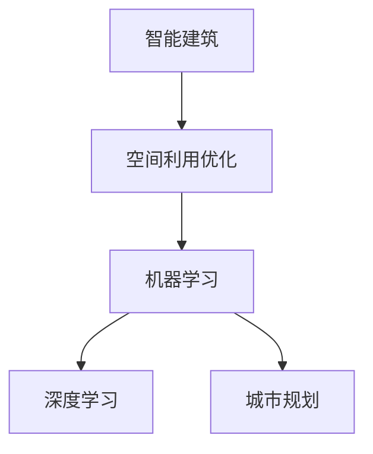

                 

# AI在智能建筑设计中的应用：优化空间利用

> 关键词：智能建筑,空间利用优化,建筑设计,人工智能,机器学习,深度学习,城市规划

## 1. 背景介绍

### 1.1 问题由来
随着城市化的推进和人口的增长，建筑设计领域面临着前所未有的挑战。如何高效利用有限的土地和建筑资源，满足人们日益增长的居住、工作、娱乐等需求，成为一个亟待解决的问题。人工智能（AI）技术，尤其是机器学习和深度学习，为解决这一问题提供了新的思路和方法。AI技术可以辅助设计师进行更精准的空间规划和布局设计，优化建筑空间利用效率，从而提升建筑项目的整体质量和可持续性。

### 1.2 问题核心关键点
智能建筑设计中应用AI技术的关键点包括：

- **数据采集与处理**：收集建筑环境的数据，如地形地貌、气候条件、人口分布等，并将其转化为可用于机器学习模型的格式。
- **模型构建与训练**：选择合适的机器学习模型，利用历史建筑数据和优化目标进行训练。
- **空间利用优化**：利用训练好的模型对新的建筑项目进行空间规划和布局设计，优化空间利用效率。
- **可持续性评估**：评估优化后的建筑在环境、经济和社会效益方面的可持续性。

## 2. 核心概念与联系

### 2.1 核心概念概述

智能建筑设计中应用AI技术，主要涉及以下几个核心概念：

- **智能建筑**：结合现代信息技术和传统建筑理念，实现智能化、高效化、舒适化的建筑。
- **空间利用优化**：通过对建筑空间进行合理规划和布局，最大化其使用效率，减少资源浪费。
- **机器学习**：通过算法模型从数据中学习规律，用于建筑设计的优化和预测。
- **深度学习**：一种基于多层神经网络的机器学习方法，能够处理大规模复杂数据。
- **城市规划**：对城市空间资源进行合理配置和管理，指导智能建筑的建设。

这些概念之间的联系可以通过以下Mermaid流程图来展示：



该流程图展示了智能建筑设计中AI技术的应用脉络：智能建筑是最终目标，空间利用优化是其核心内容，机器学习和深度学习是实现优化的方法，城市规划为智能建筑提供了宏观指导。

## 3. 核心算法原理 & 具体操作步骤
### 3.1 算法原理概述

AI在智能建筑设计中的核心算法原理是利用机器学习和深度学习技术，对建筑空间进行优化设计。具体而言，通过以下步骤实现空间利用优化：

1. **数据采集**：收集建筑环境的数据，包括地形地貌、气候条件、人口分布等。
2. **数据预处理**：将收集到的数据进行清洗、归一化等处理，转化为可用于机器学习模型的格式。
3. **模型构建**：选择合适的机器学习或深度学习模型，如神经网络、支持向量机、决策树等。
4. **模型训练**：利用历史建筑数据和优化目标进行模型训练，优化模型参数。
5. **空间规划**：将训练好的模型应用于新的建筑项目，进行空间规划和布局设计。
6. **优化评估**：评估优化后的建筑在环境、经济和社会效益方面的表现，进行持续优化。

### 3.2 算法步骤详解

#### 3.2.1 数据采集与预处理

数据采集是AI在智能建筑设计中的第一步。主要涉及以下几个方面：

- **地形地貌数据**：使用卫星遥感、激光扫描等技术，获取建筑所在区域的地形地貌信息。
- **气候条件数据**：收集建筑的气象数据，如温度、湿度、日照、风速等，用于分析建筑的能源需求和环境影响。
- **人口分布数据**：通过人口普查、地理信息系统等方法，获取建筑区域内的人口分布信息。

数据预处理主要包括数据清洗和归一化：

- **数据清洗**：去除噪声数据、缺失值等，保证数据质量。
- **数据归一化**：将不同单位的数据转化为标准化的数值范围，便于模型训练。

#### 3.2.2 模型构建与训练

模型构建和训练是AI在智能建筑设计中的核心环节。主要涉及以下几个步骤：

- **选择模型**：根据具体问题选择合适的机器学习或深度学习模型。例如，对于建筑布局优化问题，可以选择神经网络模型。
- **数据划分**：将数据集划分为训练集、验证集和测试集，用于模型训练、调参和评估。
- **模型训练**：利用训练集对模型进行训练，优化模型参数。

#### 3.2.3 空间规划与布局设计

空间规划与布局设计是AI在智能建筑设计中的关键应用。主要涉及以下几个步骤：

- **输入数据**：将待优化的建筑项目信息输入到模型中。
- **模型预测**：模型根据输入数据预测最优的空间规划方案。
- **输出方案**：将模型预测的结果转化为可行的建筑设计方案。

#### 3.2.4 优化评估与持续优化

优化评估和持续优化是AI在智能建筑设计中的重要环节。主要涉及以下几个步骤：

- **性能评估**：评估优化后的建筑在环境、经济和社会效益方面的表现。
- **反馈调整**：根据评估结果调整优化策略，进行持续优化。

### 3.3 算法优缺点

AI在智能建筑设计中应用的优点包括：

- **高效性**：利用AI技术可以大幅提高空间利用效率，减少资源浪费。
- **精确性**：AI模型能够处理大规模复杂数据，提供高精度的优化方案。
- **可扩展性**：AI技术可以应用于不同类型的建筑项目，具有广泛的应用前景。

同时，AI在智能建筑设计中应用的缺点包括：

- **数据依赖**：AI模型依赖于高质量的数据，数据采集和预处理需要大量的时间和成本。
- **模型复杂性**：深度学习模型参数多、结构复杂，训练和调参难度大。
- **可解释性不足**：AI模型的决策过程复杂，难以提供直观的解释和理解。

## 4. 数学模型和公式 & 详细讲解 & 举例说明

### 4.1 数学模型构建

智能建筑设计中常用的数学模型包括神经网络、支持向量机、决策树等。以神经网络模型为例，其数学模型构建如下：

- **输入层**：输入建筑项目的关键数据，如地形、气候、人口等。
- **隐藏层**：通过多层神经网络进行处理和特征提取。
- **输出层**：输出建筑项目的空间规划方案，如建筑密度、建筑面积等。

### 4.2 公式推导过程

以神经网络模型为例，其训练过程的数学推导如下：

1. **前向传播**：将输入数据通过多层神经网络，计算输出结果。
2. **损失函数**：计算模型预测结果与真实结果之间的误差，常用损失函数包括均方误差（MSE）、交叉熵（Cross-Entropy）等。
3. **反向传播**：根据损失函数计算梯度，更新模型参数。

### 4.3 案例分析与讲解

以下以一个具体的案例来说明AI在智能建筑设计中的应用：

假设某城市需要进行一个新小区的建设，规划目标是在有限的土地上最大化居住面积，同时确保通风、采光等环境质量。收集该区域的地理信息系统数据、气象数据和人口分布数据，构建神经网络模型。模型训练后，可以对新小区进行空间规划和布局设计，输出最优的建筑密度和建筑面积。

## 5. 项目实践：代码实例和详细解释说明
### 5.1 开发环境搭建

在进行AI在智能建筑设计中的应用开发前，需要先准备好开发环境。以下是使用Python进行TensorFlow开发的环境配置流程：

1. 安装Anaconda：从官网下载并安装Anaconda，用于创建独立的Python环境。

2. 创建并激活虚拟环境：
```bash
conda create -n tf-env python=3.8 
conda activate tf-env
```

3. 安装TensorFlow：根据CUDA版本，从官网获取对应的安装命令。例如：
```bash
conda install tensorflow=2.6 -c pytorch -c conda-forge
```

4. 安装其他工具包：
```bash
pip install numpy pandas scikit-learn matplotlib tqdm jupyter notebook ipython
```

完成上述步骤后，即可在`tf-env`环境中开始AI在智能建筑设计中的实践。

### 5.2 源代码详细实现

这里我们以一个简单的神经网络模型为例，说明AI在智能建筑设计中的应用。

首先，定义神经网络模型：

```python
import tensorflow as tf

class NeuralNetwork(tf.keras.Model):
    def __init__(self):
        super(NeuralNetwork, self).__init__()
        self.dense1 = tf.keras.layers.Dense(64, activation='relu')
        self.dense2 = tf.keras.layers.Dense(32, activation='relu')
        self.dense3 = tf.keras.layers.Dense(1, activation='sigmoid')
        
    def call(self, x):
        x = self.dense1(x)
        x = self.dense2(x)
        x = self.dense3(x)
        return x
```

然后，定义模型训练函数：

```python
def train_model(model, train_data, train_labels, epochs=10, batch_size=32):
    optimizer = tf.keras.optimizers.Adam(learning_rate=0.001)
    loss_fn = tf.keras.losses.BinaryCrossentropy(from_logits=True)
    
    for epoch in range(epochs):
        for batch in train_data:
            with tf.GradientTape() as tape:
                predictions = model(batch)
                loss = loss_fn(predictions, train_labels)
            gradients = tape.gradient(loss, model.trainable_variables)
            optimizer.apply_gradients(zip(gradients, model.trainable_variables))
            
    return model
```

接着，定义数据预处理函数：

```python
def preprocess_data(data):
    # 将数据转化为模型输入所需的格式
    return (data / 255.0).reshape(-1, 28, 28, 1)
```

最后，启动训练流程并在测试集上评估：

```python
# 加载数据
train_data = load_train_data()
train_labels = load_train_labels()
test_data = load_test_data()
test_labels = load_test_labels()

# 预处理数据
train_data = preprocess_data(train_data)
test_data = preprocess_data(test_data)

# 构建模型
model = NeuralNetwork()

# 训练模型
model = train_model(model, train_data, train_labels)

# 评估模型
test_loss = model.evaluate(test_data, test_labels)
print(f"Test loss: {test_loss}")
```

以上就是使用TensorFlow对神经网络模型进行智能建筑设计优化的完整代码实现。可以看到，利用TensorFlow可以简洁高效地实现神经网络模型的构建和训练。

### 5.3 代码解读与分析

让我们再详细解读一下关键代码的实现细节：

**NeuralNetwork类**：
- `__init__`方法：定义模型的各个层，包括输入层、隐藏层和输出层。
- `call`方法：定义模型的前向传播过程。

**train_model函数**：
- 定义优化器和损失函数。
- 循环迭代，对每个批次数据进行前向传播、计算损失和反向传播，更新模型参数。

**preprocess_data函数**：
- 将原始数据转化为模型所需的输入格式。

**训练流程**：
- 加载数据。
- 预处理数据。
- 构建模型。
- 训练模型。
- 评估模型。

可以看到，TensorFlow提供了强大的深度学习工具，使得AI在智能建筑设计中的实现变得相对简单。开发者可以更加专注于算法和业务逻辑的实现，而不必过多关注底层技术细节。

## 6. 实际应用场景

### 6.1 智能住宅小区规划

在智能住宅小区规划中，AI可以辅助设计师进行空间利用优化。具体应用场景包括：

- **建筑密度优化**：利用AI模型对不同建筑密度下的居住面积和环境质量进行评估，选取最优的建筑密度。
- **楼宇布局设计**：利用AI模型对建筑布局进行优化，最大化居住面积，同时确保通风、采光等环境质量。

### 6.2 商业综合体设计

在商业综合体设计中，AI可以辅助设计师进行空间规划和布局设计。具体应用场景包括：

- **空间利用效率优化**：利用AI模型对不同空间布局下的商业价值进行评估，选取最优的空间利用方案。
- **流线设计**：利用AI模型对商业流线进行优化，提升客户体验和商业运营效率。

### 6.3 办公大楼设计

在办公大楼设计中，AI可以辅助设计师进行空间规划和布局设计。具体应用场景包括：

- **空间利用效率优化**：利用AI模型对不同空间布局下的办公效率进行评估，选取最优的空间利用方案。
- **环境优化**：利用AI模型对办公环境进行优化，提升员工的舒适度和工作效率。

### 6.4 未来应用展望

随着AI技术的发展，未来的智能建筑设计将呈现以下几个趋势：

1. **多模态数据融合**：除了地形、气候和人口数据外，未来还可能引入视频、声音等多模态数据，提升AI模型的预测精度。
2. **动态调整与优化**：利用实时数据和反馈机制，对建筑空间进行动态调整和优化，提高建筑设计的灵活性和适应性。
3. **跨领域应用**：AI在智能建筑设计中的应用将不仅限于住宅、商业和办公等传统领域，还将拓展到医疗、教育、娱乐等领域，提供更加多样化的设计解决方案。
4. **智能建筑管理系统**：利用AI技术构建智能建筑管理系统，实现对建筑环境的自动监控和优化，提升建筑的智能化水平。

## 7. 工具和资源推荐

### 7.1 学习资源推荐

为了帮助开发者系统掌握AI在智能建筑设计中的应用，这里推荐一些优质的学习资源：

1. TensorFlow官方文档：TensorFlow的官方文档，提供了丰富的API和教程，帮助开发者深入理解TensorFlow的使用。
2. Coursera《深度学习专项课程》：由斯坦福大学教授Andrew Ng开设的深度学习课程，涵盖了深度学习的基础理论和实践应用。
3. 《TensorFlow实战》书籍：TensorFlow的实战指南，适合初学者和进阶者，提供了大量实例和项目实践。
4. Kaggle竞赛平台：Kaggle提供了丰富的数据集和竞赛项目，帮助开发者通过实践提升AI技能。

通过对这些资源的学习实践，相信你一定能够快速掌握AI在智能建筑设计中的应用，并用于解决实际的建筑优化问题。

### 7.2 开发工具推荐

高效的开发离不开优秀的工具支持。以下是几款用于AI在智能建筑设计中开发的常用工具：

1. TensorFlow：由Google主导开发的深度学习框架，支持多GPU、多TPU等高性能设备，适合大规模工程应用。
2. Jupyter Notebook：开源的交互式编程环境，支持Python等多种编程语言，方便开发者进行数据处理和模型训练。
3. Weights & Biases：模型训练的实验跟踪工具，可以记录和可视化模型训练过程中的各项指标，方便对比和调优。
4. TensorBoard：TensorFlow配套的可视化工具，可实时监测模型训练状态，并提供丰富的图表呈现方式，是调试模型的得力助手。
5. HuggingFace Transformers库：提供了丰富的预训练模型和模型转换工具，方便开发者进行模型训练和微调。

合理利用这些工具，可以显著提升AI在智能建筑设计中的开发效率，加快创新迭代的步伐。

### 7.3 相关论文推荐

AI在智能建筑设计中的应用还在不断探索和发展中。以下是几篇奠基性的相关论文，推荐阅读：

1. Architectural Design and Analysis Using Deep Reinforcement Learning：探讨了利用深度强化学习进行建筑设计和分析的方法。
2. Optimizing Building Design with Deep Learning：介绍了利用深度学习进行建筑设计的优化方法。
3. Smart Building Design and Simulation Using AI：讨论了利用AI技术进行智能建筑设计和模拟的方法。

这些论文代表了大数据、人工智能在智能建筑设计中的最新进展，为研究者提供了宝贵的理论基础和技术支持。

## 8. 总结：未来发展趋势与挑战

### 8.1 总结

本文对AI在智能建筑设计中的应用进行了全面系统的介绍。首先阐述了AI技术在智能建筑设计中的背景和意义，明确了AI技术在空间利用优化中的独特价值。其次，从原理到实践，详细讲解了AI在智能建筑设计中的数学模型和操作步骤，给出了AI在智能建筑设计中的应用实例。同时，本文还探讨了AI在智能建筑设计中的实际应用场景和未来发展趋势，展示了AI技术的广泛应用前景。最后，本文精选了AI在智能建筑设计中的学习资源、开发工具和相关论文，力求为读者提供全方位的技术指引。

通过本文的系统梳理，可以看到，AI在智能建筑设计中的应用正在成为建筑行业的新的趋势，极大地拓展了建筑设计的边界，提升了建筑设计的智能化水平。未来，伴随AI技术的进一步发展和应用，智能建筑设计必将迎来更加广阔的前景。

### 8.2 未来发展趋势

展望未来，AI在智能建筑设计中应用的趋势包括：

1. **数据驱动的设计**：利用大数据和AI技术，从数据中学习建筑设计的优化规律，实现数据驱动的设计决策。
2. **多模态数据的融合**：引入视频、声音等多模态数据，提升AI模型的预测精度和应用范围。
3. **动态调整与优化**：利用实时数据和反馈机制，对建筑空间进行动态调整和优化，提高建筑设计的灵活性和适应性。
4. **跨领域应用**：AI在智能建筑设计中的应用将不仅限于传统建筑领域，还将拓展到医疗、教育、娱乐等领域，提供更加多样化的设计解决方案。
5. **智能建筑管理系统**：利用AI技术构建智能建筑管理系统，实现对建筑环境的自动监控和优化，提升建筑的智能化水平。

以上趋势凸显了AI技术在智能建筑设计中的广阔前景，这些方向的探索发展，必将进一步提升建筑设计的智能化水平，为人类认知智能的进化带来深远影响。

### 8.3 面临的挑战

尽管AI在智能建筑设计中已经取得了瞩目成就，但在迈向更加智能化、普适化应用的过程中，仍面临诸多挑战：

1. **数据质量与获取成本**：高质量的数据是AI技术应用的基础，但数据采集和预处理需要大量的时间和成本。
2. **模型复杂性与可解释性**：AI模型参数多、结构复杂，难以解释其内部工作机制和决策逻辑，增加了模型的维护和优化难度。
3. **跨学科协作**：AI在智能建筑设计中的应用涉及建筑学、工程学、计算机科学等多个学科，需要跨学科协作才能取得最佳效果。

## 8.4 研究展望

面向未来，AI在智能建筑设计中的研究展望包括：

1. **多模态数据的融合**：利用视频、声音等多模态数据，提升AI模型的预测精度和应用范围。
2. **动态调整与优化**：利用实时数据和反馈机制，对建筑空间进行动态调整和优化，提高建筑设计的灵活性和适应性。
3. **跨学科协作**：加强建筑学、工程学、计算机科学等多学科的合作，共同探索AI在智能建筑设计中的应用。
4. **智能建筑管理系统**：利用AI技术构建智能建筑管理系统，实现对建筑环境的自动监控和优化，提升建筑的智能化水平。
5. **可持续性设计**：利用AI技术进行可持续性评估，优化建筑设计的环保、节能和可持续发展。

这些研究方向将为AI在智能建筑设计中的应用提供新的思路和方法，进一步提升建筑设计的智能化和可持续性水平。

## 9. 附录：常见问题与解答

**Q1：AI在智能建筑设计中如何优化空间利用？**

A: AI在智能建筑设计中通过构建机器学习或深度学习模型，利用历史建筑数据和优化目标进行训练。模型能够处理大量复杂数据，从中学习出建筑空间利用的优化规律，并在新的建筑项目中应用这些规律进行空间规划和布局设计，从而最大化建筑空间的利用效率。

**Q2：AI在智能建筑设计中如何选择合适的模型？**

A: 选择AI在智能建筑设计中使用的模型需要考虑以下几个因素：

1. **问题类型**：不同类型的建筑设计问题需要选择不同类型的模型，如分类问题可以使用决策树或神经网络，回归问题可以使用线性回归或神经网络等。
2. **数据量**：数据量大的问题适合使用深度学习模型，数据量小的问题适合使用浅层模型。
3. **计算资源**：计算资源充足的问题适合使用复杂模型，计算资源有限的问题适合使用轻量级模型。

**Q3：AI在智能建筑设计中如何缓解过拟合问题？**

A: AI在智能建筑设计中缓解过拟合问题的方法包括：

1. **数据增强**：通过对训练数据进行扩充，增加数据多样性，减少模型过拟合。
2. **正则化**：通过L2正则化、Dropout等技术，限制模型的复杂度，减少过拟合。
3. **早停策略**：在模型训练过程中，当验证集误差不再下降时停止训练，防止模型过拟合。
4. **模型集成**：利用多个模型进行集成预测，减少单个模型的过拟合风险。

**Q4：AI在智能建筑设计中的学习资源有哪些？**

A: 以下是一些推荐的AI在智能建筑设计中的学习资源：

1. TensorFlow官方文档：提供了丰富的API和教程，帮助开发者深入理解TensorFlow的使用。
2. Coursera《深度学习专项课程》：由斯坦福大学教授Andrew Ng开设的深度学习课程，涵盖了深度学习的基础理论和实践应用。
3. 《TensorFlow实战》书籍：TensorFlow的实战指南，适合初学者和进阶者，提供了大量实例和项目实践。
4. Kaggle竞赛平台：提供了丰富的数据集和竞赛项目，帮助开发者通过实践提升AI技能。

这些资源将帮助开发者系统掌握AI在智能建筑设计中的应用，从而更好地解决实际的建筑优化问题。

---

作者：禅与计算机程序设计艺术 / Zen and the Art of Computer Programming

