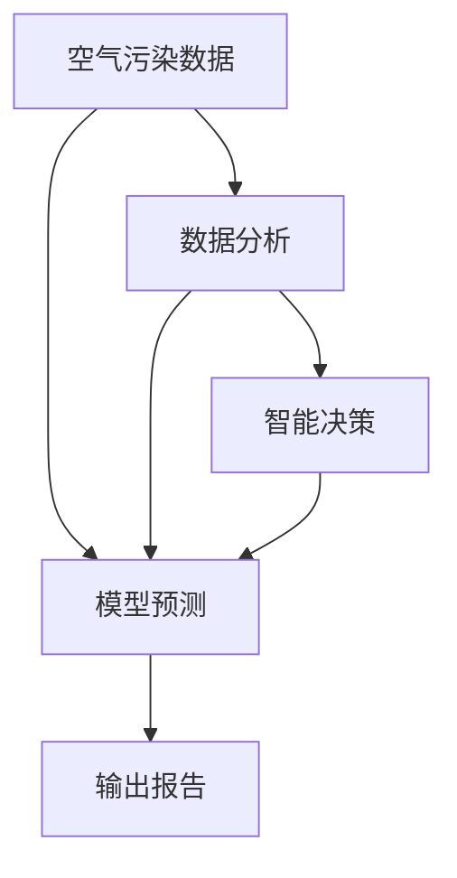

                 

# AI在智能空气污染控制中的应用：改善空气质量

> 关键词：人工智能(AI), 空气污染控制, 智能算法, 数据分析, 预测模型, 实时监测, 环境优化

## 1. 背景介绍

### 1.1 问题由来

空气污染问题已成为全球性的公共健康问题，严重影响了人类的生活质量和健康。根据世界卫生组织（WHO）的数据，每年因空气污染导致的过早死亡超过700万人。在城市化进程中，交通尾气、工业排放、建筑施工等活动释放的大量污染物，使得城市空气质量不断恶化，导致呼吸道疾病、心血管疾病等疾病频发。因此，如何有效监测和控制空气污染，改善空气质量，成为一个亟待解决的重大问题。

### 1.2 问题核心关键点

空气污染控制的核心在于实时监测、数据分析和模型预测。通过部署大量的传感器，收集城市空气中的污染数据，然后利用人工智能技术进行数据分析和模型预测，可以提前预警污染事件，科学制定减排方案，有效控制污染源，从而改善空气质量。

人工智能（AI）在空气污染控制中的应用，主要包括数据分析、模型预测和智能决策三个方面。数据分析用于处理和清洗传感器收集的大量数据，提取有用的信息；模型预测则基于历史数据，建立污染预测模型，实时预警；智能决策则结合预测结果，动态调整减排策略，优化空气质量。

## 2. 核心概念与联系

### 2.1 核心概念概述

为更好地理解AI在空气污染控制中的应用，本节将介绍几个密切相关的核心概念：

- **空气污染数据**：来自各种传感器（如PM2.5、PM10、SO2、NO2等传感器）的实时监测数据，用于分析污染状况。
- **人工智能算法**：包括机器学习、深度学习等技术，用于数据建模和分析，预测污染趋势。
- **数据分析工具**：如Pandas、NumPy等，用于数据处理、清洗、统计和可视化。
- **模型预测框架**：如Scikit-learn、TensorFlow等，用于建立和训练各种预测模型。
- **智能决策系统**：如决策树、强化学习等，用于基于预测结果进行智能决策，调整减排策略。

这些核心概念之间的逻辑关系可以通过以下Mermaid流程图来展示：



这个流程图展示了大语言模型的核心概念及其之间的关系：

1. 空气污染数据通过传感器收集，用于数据分析。
2. 数据分析处理后，用于模型预测。
3. 模型预测结果用于智能决策。
4. 智能决策输出报告，调整减排策略。

## 3. 核心算法原理 & 具体操作步骤

### 3.1 算法原理概述

AI在空气污染控制中的应用，主要基于以下算法原理：

- **数据清洗与预处理**：对传感器采集的原始数据进行清洗和预处理，去除噪声和异常值。
- **特征工程**：从数据中提取有用特征，如天气、季节、人口密度等，用于模型训练。
- **模型选择与训练**：选择适当的机器学习或深度学习模型（如回归模型、神经网络等），基于历史数据进行训练，预测污染趋势。
- **智能决策**：利用预测结果，结合专家知识，构建决策树、强化学习等智能决策系统，动态调整减排策略。

### 3.2 算法步骤详解

AI在空气污染控制中的具体操作步骤如下：

**Step 1: 数据收集与预处理**
- 部署传感器，收集城市空气中的污染物数据。
- 对传感器数据进行清洗和预处理，去除异常值和噪声。
- 提取有用的特征，如天气、季节、人口密度等，用于模型训练。

**Step 2: 模型选择与训练**
- 选择合适的模型，如线性回归、决策树、神经网络等，进行模型训练。
- 使用历史数据，训练模型，预测未来的污染水平。

**Step 3: 智能决策**
- 基于模型预测结果，结合专家知识，构建智能决策系统。
- 动态调整减排策略，优化空气质量。

**Step 4: 输出报告**
- 将模型预测结果和决策结果输出为报告，供相关部门参考。
- 实时监测空气质量，调整减排措施。

### 3.3 算法优缺点

AI在空气污染控制中的应用，具有以下优点：

- **数据驱动**：通过大量数据训练模型，预测准确率高。
- **实时性**：能够实时监测和预警污染事件，及时调整减排策略。
- **可扩展性**：适用于大规模、多污染物的监测与控制。
- **灵活性**：结合专家知识，构建智能决策系统，动态调整减排方案。

同时，该方法也存在一定的局限性：

- **数据依赖**：需要大量高质量的传感器数据，获取成本高。
- **模型复杂性**：模型训练复杂，需要丰富的领域知识和专业知识。
- **鲁棒性**：对异常值和噪声敏感，需要加强数据清洗和预处理。
- **实时性**：数据传输和处理需要实时性要求，对设备性能要求高。

尽管存在这些局限性，但AI在空气污染控制中的应用已经显现出巨大的潜力。未来相关研究的重点在于如何进一步降低数据获取成本，提高模型训练效率和鲁棒性，同时兼顾实时性和可扩展性等因素。

### 3.4 算法应用领域

AI在空气污染控制中的应用，已经拓展到多个领域，包括但不限于：

- **智能监测**：利用传感器实时监测城市空气质量，及时预警污染事件。
- **预测分析**：基于历史数据，预测未来的污染趋势，指导减排策略。
- **智能决策**：结合专家知识，动态调整减排策略，优化空气质量。
- **政策支持**：为政府决策提供科学依据，制定合理的减排政策。

## 4. 数学模型和公式 & 详细讲解 & 举例说明

### 4.1 数学模型构建

本节将使用数学语言对AI在空气污染控制中的应用进行更加严格的刻画。

假设传感器收集的污染数据为 $y_i=\mu+\epsilon_i$，其中 $\mu$ 为真实的污染水平，$\epsilon_i$ 为噪声。模型的目标是基于历史数据 $D=\{(y_i,x_i)\}_{i=1}^N$，其中 $x_i$ 为影响污染水平的相关因素，如温度、湿度、人口密度等，建立预测模型 $f(x_i)$，使得 $f(x_i)$ 能够尽可能逼近真实的污染水平 $\mu$。

常见的模型有线性回归、逻辑回归、决策树、神经网络等。其中，线性回归模型形式化表示为：

$$
\hat{y} = \beta_0 + \beta_1 x_1 + \cdots + \beta_k x_k
$$

其中，$\beta_i$ 为回归系数，$x_i$ 为特征变量。

### 4.2 公式推导过程

线性回归模型的最小二乘法求解如下：

$$
\hat{\beta} = (X^TX)^{-1}X^Ty
$$

其中 $X$ 为特征矩阵，$y$ 为标签向量。

在深度学习中，常用的模型包括神经网络。以多层感知器（MLP）为例，其形式化表示为：

$$
\hat{y} = f(W^{(L)}h^{(L-1)}, b^{(L)})
$$

其中，$f$ 为激活函数，$h^{(L-1)}$ 为前一层输出，$W^{(L)}$ 和 $b^{(L)}$ 为当前层的权重和偏置。

对于深度神经网络，常用的优化算法包括随机梯度下降（SGD）、Adam等，目标函数为均方误差损失函数：

$$
\mathcal{L} = \frac{1}{N} \sum_{i=1}^N (y_i - f(x_i))^2
$$

通过反向传播算法，对网络参数 $W^{(L)}$ 和 $b^{(L)}$ 进行优化，最小化损失函数 $\mathcal{L}$。

### 4.3 案例分析与讲解

以城市空气质量预测为例，假设模型基于温度、湿度、人口密度等特征，预测PM2.5污染水平。

首先，收集历史数据，提取特征 $x_i=[temp, humidity, population]$，标签 $y_i=[PM2.5]$。

然后，使用线性回归模型进行建模，得到：

$$
\hat{PM2.5} = \beta_0 + \beta_1 temp + \beta_2 humidity + \beta_3 population
$$

通过最小二乘法求解 $\beta_i$，得到预测模型。

最后，在实时数据中，使用该模型进行预测，输出PM2.5污染水平，供智能决策系统参考。

## 5. 项目实践：代码实例和详细解释说明

### 5.1 开发环境搭建

在进行AI在空气污染控制中的应用实践前，我们需要准备好开发环境。以下是使用Python进行TensorFlow开发的环境配置流程：

1. 安装Anaconda：从官网下载并安装Anaconda，用于创建独立的Python环境。

2. 创建并激活虚拟环境：
```bash
conda create -n tensorflow-env python=3.8 
conda activate tensorflow-env
```

3. 安装TensorFlow：根据CUDA版本，从官网获取对应的安装命令。例如：
```bash
conda install tensorflow -c conda-forge -c pytorch
```

4. 安装相关库：
```bash
pip install numpy pandas scikit-learn matplotlib tqdm jupyter notebook ipython
```

完成上述步骤后，即可在`tensorflow-env`环境中开始AI在空气污染控制中的应用实践。

### 5.2 源代码详细实现

下面以城市空气质量预测为例，给出使用TensorFlow进行线性回归模型的PyTorch代码实现。

首先，定义模型和优化器：

```python
import tensorflow as tf
from tensorflow.keras import layers, models
from sklearn.metrics import mean_squared_error

model = models.Sequential([
    layers.Dense(32, activation='relu', input_shape=(3,)),
    layers.Dense(1)
])

optimizer = tf.keras.optimizers.Adam(learning_rate=0.01)
```

然后，定义训练和评估函数：

```python
def train_epoch(model, dataset, batch_size, optimizer):
    for batch in dataset:
        x, y = batch
        with tf.GradientTape() as tape:
            y_pred = model(x)
            loss = mean_squared_error(y, y_pred)
        grads = tape.gradient(loss, model.trainable_variables)
        optimizer.apply_gradients(zip(grads, model.trainable_variables))

def evaluate(model, dataset):
    mse = mean_squared_error(y_true, y_pred)
    print('Mean Squared Error:', mse)
```

最后，启动训练流程并在测试集上评估：

```python
epochs = 100
batch_size = 32

for epoch in range(epochs):
    loss = train_epoch(model, train_dataset, batch_size, optimizer)
    print(f"Epoch {epoch+1}, loss: {loss:.3f}")
    
    print(f"Epoch {epoch+1}, test results:")
    evaluate(model, test_dataset)
```

以上就是使用TensorFlow进行城市空气质量预测的完整代码实现。可以看到，得益于TensorFlow的强大封装，我们可以用相对简洁的代码完成模型训练和评估。

### 5.3 代码解读与分析

让我们再详细解读一下关键代码的实现细节：

**定义模型和优化器**：
- `Sequential`模型：使用序列模型构建，堆叠多个神经网络层。
- `Dense`层：定义全连接层，输入维度为3（温度、湿度、人口密度），输出维度为1（PM2.5）。
- `Adam`优化器：使用Adam优化算法进行参数更新，学习率为0.01。

**训练和评估函数**：
- `train_epoch`函数：遍历训练集数据，进行前向传播和反向传播，更新模型参数。
- `evaluate`函数：在测试集上计算均方误差，评估模型性能。

**训练流程**：
- 定义总的epoch数和batch size，开始循环迭代
- 每个epoch内，先在训练集上训练，输出平均loss
- 在测试集上评估，输出均方误差
- 所有epoch结束后，输出最终测试结果

可以看到，TensorFlow配合其丰富的API接口，使得线性回归模型的实现变得简洁高效。开发者可以将更多精力放在数据处理、模型改进等高层逻辑上，而不必过多关注底层的实现细节。

当然，工业级的系统实现还需考虑更多因素，如模型的保存和部署、超参数的自动搜索、更灵活的任务适配层等。但核心的预测过程基本与此类似。

## 6. 实际应用场景

### 6.1 智能监测

智能监测系统可以通过部署大量的传感器，实时监测城市空气中的各种污染物浓度，并将数据传输到中央服务器进行分析和预测。一旦检测到异常数据，系统立即发出警报，通知相关部门进行现场检查和处理。

在技术实现上，可以利用TensorFlow等深度学习框架，搭建多层次的传感器网络，通过GPU加速数据处理和模型训练，实现快速、准确的空气质量监测。同时，结合物联网技术，实现远程监控和实时预警。

### 6.2 预测分析

预测分析系统基于历史数据，建立污染预测模型，实时预测未来的污染水平。通过预测结果，政府可以制定合理的减排政策，优化工业生产和城市规划，减少空气污染对居民健康的影响。

在具体实现上，可以使用深度学习模型（如神经网络）对多维度数据进行建模，通过反向传播算法更新模型参数，实现高精度的预测。同时，结合时间序列分析、空间分析等方法，进一步提高预测精度。

### 6.3 智能决策

智能决策系统结合专家知识，动态调整减排策略，优化空气质量。通过预测模型输出的结果，智能决策系统可以自动推荐最优的减排措施，如限行、关闭污染工厂等，避免对空气质量造成更大的影响。

在具体实现上，可以结合强化学习等智能决策算法，构建多目标优化模型，根据预测结果和专家知识，生成最优的决策方案。同时，引入模拟仿真等技术，评估减排方案的实际效果，不断迭代优化。

### 6.4 未来应用展望

随着AI在空气污染控制中的应用不断发展，未来将在多个领域得到广泛应用，为城市空气质量改善提供新的解决方案：

- **智慧城市治理**：结合智慧城市建设，实现空气质量的实时监测和智能预警，提升城市管理的智能化水平。
- **绿色交通建设**：通过智能监测和预测，优化交通流量，减少交通尾气排放，提升空气质量。
- **环境污染治理**：利用AI技术，优化工业生产流程，减少污染排放，提升环境治理效率。
- **公共健康管理**：通过空气质量监测和预警，指导居民防护，提升公共健康水平。
- **城市规划**：利用AI技术，优化城市布局和规划，提升城市宜居性。

此外，在企业生产、社会治理、文娱传媒等众多领域，AI在空气污染控制中的应用也将不断涌现，为人类生产生活带来新的改变。

## 7. 工具和资源推荐
### 7.1 学习资源推荐

为了帮助开发者系统掌握AI在空气污染控制中的应用技术，这里推荐一些优质的学习资源：

1. 《深度学习实战》系列博文：由深度学习专家撰写，深入浅出地介绍了深度学习的基本原理和实际应用。

2. 《TensorFlow实战》书籍：TensorFlow的官方文档，提供了全面的API接口和代码实现，是入门TensorFlow的必备资料。

3. 《机器学习实战》书籍：经典机器学习教程，涵盖回归、分类、聚类等多种算法，适合初学者入门。

4. 《深度学习框架Python实现》书籍：介绍多个深度学习框架的实现原理和应用技巧，帮助开发者深入理解深度学习技术。

5. Kaggle数据科学竞赛平台：提供丰富的数据集和竞赛任务，供开发者学习和实践。

通过对这些资源的学习实践，相信你一定能够快速掌握AI在空气污染控制中的应用精髓，并用于解决实际的空气污染问题。
###  7.2 开发工具推荐

高效的开发离不开优秀的工具支持。以下是几款用于AI在空气污染控制中的应用开发的常用工具：

1. TensorFlow：由Google主导开发的开源深度学习框架，生产部署方便，适合大规模工程应用。同时提供了丰富的预训练模型资源，如Keras、TensorBoard等。

2. PyTorch：基于Python的开源深度学习框架，灵活动态的计算图，适合快速迭代研究。

3. Scikit-learn：Python机器学习库，提供了多种经典算法，如回归、分类、聚类等。

4. Pandas：Python数据处理库，用于数据清洗、处理和分析。

5. NumPy：Python科学计算库，用于高效矩阵计算和数据处理。

6. Matplotlib：Python绘图库，用于数据可视化。

7. Jupyter Notebook：Python交互式开发环境，便于代码调试和交互式学习。

合理利用这些工具，可以显著提升AI在空气污染控制中的应用开发效率，加快创新迭代的步伐。

### 7.3 相关论文推荐

AI在空气污染控制中的应用，得益于学界的持续研究。以下是几篇奠基性的相关论文，推荐阅读：

1. "Air Quality Prediction Using Deep Learning"：介绍基于深度学习的空气质量预测模型，通过多个维度数据建模，提高预测精度。

2. "Real-Time Air Quality Monitoring with Sensor Networks"：探讨基于物联网的实时空气质量监测技术，利用传感器网络实现快速监测和预警。

3. "Environmental Monitoring with AI"：讨论AI在环境监测中的应用，利用深度学习技术，优化环境监测和预测。

4. "Optimizing Reducing Measures for Air Pollution Control"：分析不同减排措施的效果，构建智能决策系统，优化减排策略。

5. "AI-Driven Smart City Governance"：介绍基于AI的智慧城市治理技术，实现实时监测和智能决策。

这些论文代表了大语言模型在空气污染控制中的应用研究发展脉络。通过学习这些前沿成果，可以帮助研究者把握学科前进方向，激发更多的创新灵感。

## 8. 总结：未来发展趋势与挑战

### 8.1 总结

本文对AI在空气污染控制中的应用进行了全面系统的介绍。首先阐述了AI在空气污染控制中的研究背景和意义，明确了预测、智能监测和智能决策三个关键步骤。其次，从原理到实践，详细讲解了AI在空气污染控制中的应用，给出了具体的代码实现。同时，本文还广泛探讨了AI在智能监测、预测分析和智能决策等多个领域的应用前景，展示了AI在空气污染控制中的巨大潜力。最后，本文精选了AI在空气污染控制中的学习资源和工具，力求为读者提供全方位的技术指引。

通过本文的系统梳理，可以看到，AI在空气污染控制中的应用，正在成为改善空气质量的重要手段。AI技术能够实时监测和预测空气污染，科学制定减排策略，有效控制污染源，从而改善空气质量。未来，伴随AI技术的持续演进，相信AI在空气污染控制中将发挥更大的作用，为人类健康和环境提供更强的保障。

### 8.2 未来发展趋势

展望未来，AI在空气污染控制中的应用将呈现以下几个发展趋势：

1. **深度学习模型的普及**：深度学习模型具有强大的预测能力，未来将在更多领域得到应用，提升空气质量监测和预测的精度。

2. **多维度数据融合**：结合气象、交通、地理等多维度数据，构建更全面、准确的环境监测系统。

3. **实时性和动态性**：利用物联网技术，实现实时监测和动态调整减排策略，提高系统响应速度和鲁棒性。

4. **知识驱动**：结合领域专家的知识和经验，构建知识图谱和规则库，提升AI系统的决策能力和适应性。

5. **智能化决策**：结合强化学习、博弈论等智能决策算法，构建更高效、科学的减排决策系统。

6. **跨领域应用**：将AI技术应用于智慧城市、绿色交通、环境治理等多个领域，推动环境保护和可持续发展。

以上趋势凸显了AI在空气污染控制中的广阔前景。这些方向的探索发展，必将进一步提升空气质量监测和控制的能力，为环境保护和可持续发展提供强大的技术支撑。

### 8.3 面临的挑战

尽管AI在空气污染控制中的应用已经取得了显著进展，但在迈向更加智能化、普适化应用的过程中，它仍面临诸多挑战：

1. **数据获取成本高**：大量高质量的传感器数据获取成本高，需要政府和社会共同投入。

2. **模型训练复杂**：深度学习模型训练复杂，需要丰富的领域知识和专业知识。

3. **鲁棒性不足**：对异常值和噪声敏感，需要加强数据清洗和预处理。

4. **实时性要求高**：数据传输和处理需要实时性要求，对设备性能要求高。

5. **知识融合困难**：知识图谱和规则库的构建复杂，需要大量领域专家的支持和协作。

6. **决策透明度低**：AI系统的决策过程复杂，缺乏可解释性和可审计性。

7. **伦理和安全问题**：AI系统可能存在偏见和歧视，需要严格的伦理和安全审查。

这些挑战凸显了AI在空气污染控制中的复杂性和复杂性。只有从技术、应用、伦理等多方面协同发力，才能真正实现AI在空气污染控制中的应用，为环境保护和可持续发展提供更强的保障。

### 8.4 研究展望

面对AI在空气污染控制中所面临的挑战，未来的研究需要在以下几个方面寻求新的突破：

1. **数据获取和处理**：开发高效的数据采集和处理技术，降低数据获取成本，提升数据处理效率。

2. **模型训练优化**：简化模型结构，提高训练效率，降低对领域知识的要求。

3. **鲁棒性提升**：引入数据增强、对抗训练等技术，提高模型的鲁棒性和泛化能力。

4. **实时性和动态性**：优化数据传输和处理算法，提高系统实时性和动态性。

5. **知识融合**：构建多维度知识库和规则库，提升AI系统的决策能力和适应性。

6. **决策透明化**：引入可解释性技术，增强AI系统的决策透明度和可审计性。

7. **伦理和安全保障**：建立伦理和安全审查机制，确保AI系统符合人类价值观和伦理道德。

这些研究方向和突破，将推动AI在空气污染控制中的应用进一步成熟，为人类环境保护和可持续发展提供更强的技术支撑。

## 9. 附录：常见问题与解答

**Q1：AI在空气污染控制中的核心算法是什么？**

A: AI在空气污染控制中的核心算法包括数据清洗和预处理、特征工程、模型选择和训练、智能决策等。其中，线性回归、深度神经网络、逻辑回归等机器学习算法被广泛应用。

**Q2：AI在空气污染控制中需要注意哪些关键步骤？**

A: 关键步骤包括数据收集和预处理、模型选择和训练、智能决策和输出报告。数据预处理和特征工程是确保模型训练效果的关键，模型训练和智能决策是实现预测和决策的关键。

**Q3：AI在空气污染控制中需要哪些关键数据？**

A: AI在空气污染控制中需要大量的传感器数据，包括PM2.5、PM10、SO2、NO2等污染物浓度，以及相关的环境数据，如温度、湿度、人口密度等。

**Q4：AI在空气污染控制中常用的工具和资源有哪些？**

A: 常用的工具和资源包括TensorFlow、PyTorch、Scikit-learn、Pandas、NumPy、Matplotlib、Jupyter Notebook等，以及相关的学习资源，如TensorFlow官方文档、Kaggle数据科学竞赛平台等。

**Q5：AI在空气污染控制中需要注意哪些技术挑战？**

A: AI在空气污染控制中面临的数据获取成本高、模型训练复杂、鲁棒性不足、实时性要求高等技术挑战，需要结合领域知识和应用需求，不断优化算法和技术。

通过本文的系统梳理，可以看到，AI在空气污染控制中的应用正在成为改善空气质量的重要手段。AI技术能够实时监测和预测空气污染，科学制定减排策略，有效控制污染源，从而改善空气质量。未来，伴随AI技术的持续演进，相信AI在空气污染控制中将发挥更大的作用，为人类健康和环境提供更强的保障。

---

作者：禅与计算机程序设计艺术 / Zen and the Art of Computer Programming

