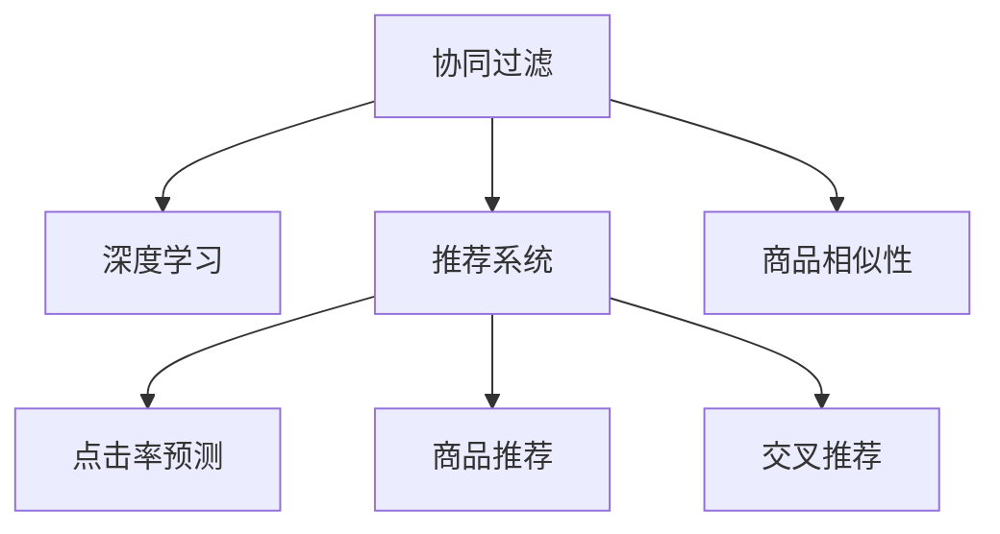

                 

# AI在电商个性化推荐中的创新应用

> 关键词：电商个性化推荐,协同过滤,深度学习,推荐系统,点击率预测,商品推荐,商品相似性,交叉推荐

## 1. 背景介绍

### 1.1 问题由来

电商平台的兴起极大地改变了人们的购物方式，但面对海量商品和多样化的用户需求，商家难以实现精准推荐，导致客户流失率高，满意度低。个性化推荐系统的建设迫在眉睫。

### 1.2 问题核心关键点

个性化推荐的核心是满足用户个性化需求，以提升购物体验和平台转化率。该系统以用户历史行为、商品属性、用户画像等数据为基础，通过对用户和商品进行建模，准确预测用户对商品感兴趣的概率，从而实现高效的推荐。

### 1.3 问题研究意义

个性化推荐系统可以提升用户体验，增加用户粘性，并显著提高平台销售额。对于电商平台而言，推荐系统的好坏，直接关系到店铺转化率和用户留存率。

## 2. 核心概念与联系

### 2.1 核心概念概述

为更好地理解电商个性化推荐系统的核心思想，本节将介绍几个关键概念：

- **协同过滤(Collaborative Filtering)**：基于用户或商品的相似度，通过计算用户历史行为与当前候选商品的匹配度，实现推荐。包括基于用户的协同过滤和基于物品的协同过滤。
- **深度学习(Deep Learning)**：通过构建深层神经网络，提取用户和商品的隐含特征，实现高效的推荐。常见的深度学习模型包括神经网络、卷积神经网络(CNN)、循环神经网络(RNN)等。
- **推荐系统(Recommendation System)**：使用协同过滤、深度学习等技术，对用户进行建模，并结合商品属性，实现个性化推荐。包括内容推荐、协同推荐、混合推荐等多种策略。
- **点击率预测(Click-Through Rate Prediction)**：预测用户点击商品的概率，是评估推荐算法效果的重要指标之一。
- **商品推荐(Product Recommendation)**：通过个性化推荐系统，对用户推荐的商品。包括搜索推荐、浏览推荐、收藏推荐等多种方式。
- **商品相似性(Product Similarity)**：通过商品属性、用户行为等计算商品间的相似度，实现相关商品的推荐。
- **交叉推荐(Cross-Selling)**：将某个商品推荐给对类似商品感兴趣的用户，增加商品曝光和销售机会。

这些核心概念之间的逻辑关系可以通过以下Mermaid流程图来展示：



这个流程图展示了几者之间的关系：

1. 协同过滤和深度学习是推荐系统的基础，通过协同过滤和深度学习，对用户和商品进行建模。
2. 点击率预测是评估推荐算法效果的重要指标，通过预测用户点击商品的概率，可以判断推荐算法的有效性。
3. 商品推荐是推荐系统的直接应用，通过推荐系统将商品推荐给用户。
4. 商品相似性和交叉推荐是推荐系统的重要策略，通过计算商品间的相似度，实现相关商品的推荐，并增加商品曝光机会。

## 3. 核心算法原理 & 具体操作步骤
### 3.1 算法原理概述

电商个性化推荐系统本质上是一个复杂的多任务学习问题。其核心思想是：

1. **数据收集**：收集用户历史行为、商品属性、用户画像等数据，形成用户画像和商品特征向量。
2. **用户建模**：使用协同过滤、深度学习等技术，对用户进行建模，获得用户兴趣偏好和行为特征。
3. **商品建模**：使用协同过滤、深度学习等技术，对商品进行建模，获得商品属性和用户购买倾向。
4. **推荐算法**：通过用户和商品模型，计算用户对商品的评分或点击率，实现推荐。

### 3.2 算法步骤详解

电商个性化推荐系统的一般步骤如下：

**Step 1: 数据收集与处理**
- 收集用户历史行为数据，如浏览、点击、购买记录。
- 收集商品属性数据，如类别、品牌、价格等。
- 收集用户画像数据，如年龄、性别、兴趣等。
- 数据预处理，包括数据清洗、归一化、特征工程等。

**Step 2: 用户建模**
- 构建用户模型，使用协同过滤、深度学习等技术，对用户进行建模。
- 协同过滤：计算用户历史行为与当前候选商品的匹配度。
- 深度学习：通过构建深层神经网络，提取用户和商品的隐含特征。
- 融合多种建模方式，提升模型准确率。

**Step 3: 商品建模**
- 构建商品模型，使用协同过滤、深度学习等技术，对商品进行建模。
- 协同过滤：计算商品间的相似度，实现相关商品的推荐。
- 深度学习：通过构建深层神经网络，提取商品属性和用户购买倾向。
- 融合多种建模方式，提升模型准确率。

**Step 4: 推荐算法**
- 使用协同过滤、深度学习等技术，计算用户对商品的评分或点击率。
- 协同过滤：基于用户和商品的相似度进行推荐。
- 深度学习：通过神经网络模型，预测用户点击商品的概率。
- 融合多种推荐算法，提升推荐效果。

**Step 5: 系统部署与优化**
- 将推荐系统部署到生产环境，进行实时推荐。
- 实时监控推荐效果，调整模型参数，优化推荐策略。
- 引入负采样、对抗训练等方法，提升推荐模型的鲁棒性。

### 3.3 算法优缺点

电商个性化推荐系统具有以下优点：

1. **个性化精准**：基于用户历史行为和商品属性，提供个性化推荐，提升用户满意度。
2. **增加销售额**：通过精准推荐，增加用户购买概率，提高平台销售额。
3. **用户粘性提升**：通过个性化推荐，增加用户留存率，提升平台用户粘性。

同时，该方法也存在一些缺点：

1. **数据依赖性强**：个性化推荐系统对数据依赖性高，需要大量历史行为和商品属性数据。
2. **模型复杂度较高**：协同过滤、深度学习等技术，模型复杂度较高，需要较长的训练时间。
3. **推荐泛化能力差**：推荐模型对数据分布变化敏感，泛化能力差。
4. **隐私问题**：收集用户历史行为数据可能涉及隐私问题，需要合理设计用户隐私保护机制。

尽管存在这些缺点，但就目前而言，个性化推荐系统仍是电商平台的重要技术手段。未来相关研究的重点在于如何进一步优化数据收集、处理和模型设计，提高推荐的精准性和鲁棒性，同时兼顾用户隐私和数据安全。

### 3.4 算法应用领域

电商个性化推荐系统已经在各大电商平台广泛应用，覆盖了推荐商品、商品搜索、购物车推荐、用户行为分析等多个环节，为用户提供了个性化的购物体验，并显著提升了电商平台的用户粘性和转化率。

## 4. 数学模型和公式 & 详细讲解 & 举例说明

### 4.1 数学模型构建

在电商推荐系统中，常用的数学模型包括：协同过滤、深度学习、推荐系统等。

**协同过滤模型**：
- 基于用户的协同过滤模型：
  $$
  \hat{r}_{ui} = \frac{1}{\sqrt{\sum_{j=1}^N (\hat{p}_{uj}^2 + r_{ij}^2)} \sum_{j=1}^N \hat{p}_{uj}r_{ij}
  $$
  其中 $\hat{r}_{ui}$ 为预测用户 $u$ 对商品 $i$ 的评分，$\hat{p}_{uj}$ 为预测用户 $u$ 对商品 $j$ 的评分，$r_{ij}$ 为商品 $i$ 和 $j$ 之间的相似度。

**深度学习模型**：
- 基于神经网络的推荐模型：
  $$
  \hat{r}_{ui} = \sigma(\sum_{i=1}^d w_i x_{ui}^T h_j + b)
  $$
  其中 $x_{ui}$ 为用户 $u$ 在商品 $i$ 上的特征向量，$h_j$ 为神经网络模型提取的商品 $j$ 的特征向量，$w_i$ 和 $b$ 为模型参数。

**推荐系统模型**：
- 基于内容的推荐系统：
  $$
  \hat{r}_{ui} = \sum_{j=1}^N w_{uji} c_i^T c_j
  $$
  其中 $w_{uji}$ 为相似度系数，$c_i$ 和 $c_j$ 为商品 $i$ 和 $j$ 的特征向量。

### 4.2 公式推导过程

**协同过滤模型推导**：

设用户 $u$ 对商品 $i$ 的评分 $r_{ui} \sim \mathcal{N}(0,\sigma^2)$，商品 $j$ 的评分 $r_{uj} \sim \mathcal{N}(0,\sigma^2)$。根据协同过滤模型：

$$
\hat{r}_{ui} = \frac{1}{\sqrt{\sum_{j=1}^N (\hat{p}_{uj}^2 + r_{ij}^2)} \sum_{j=1}^N \hat{p}_{uj}r_{ij}
$$

根据协同过滤模型的假设，商品 $i$ 和 $j$ 的评分分布独立，即 $r_{ui} = r_{uj} + \epsilon_i$，其中 $\epsilon_i \sim \mathcal{N}(0,\sigma^2)$。将 $r_{ui}$ 和 $r_{uj}$ 代入公式，并利用变量 $p_{ui} = r_{ui} + \epsilon_i$ 和 $p_{uj} = r_{uj} + \epsilon_j$ 表示预测评分，则有：

$$
\hat{p}_{ui} = \frac{1}{\sqrt{\sum_{j=1}^N (p_{uj}^2 + r_{ij}^2)} \sum_{j=1}^N p_{uj}r_{ij}
$$

通过协方差矩阵的推导，可以证明协同过滤模型的预测评分 $\hat{p}_{ui}$ 满足：

$$
\hat{p}_{ui} = \mathbb{E}[p_{ui}]
$$

因此，协同过滤模型可以较好地预测用户对商品的评分。

**深度学习模型推导**：

设用户 $u$ 对商品 $i$ 的评分 $r_{ui} = \sigma(\sum_{i=1}^d w_i x_{ui}^T h_j + b)$，其中 $x_{ui}$ 为用户 $u$ 在商品 $i$ 上的特征向量，$h_j$ 为神经网络模型提取的商品 $j$ 的特征向量，$w_i$ 和 $b$ 为模型参数。通过反向传播算法，可以计算模型参数的梯度，从而更新模型参数，实现推荐。

### 4.3 案例分析与讲解

**电商个性化推荐系统案例**：

假设某电商平台有 10000 名用户，每名用户购买了 50 个商品。构建协同过滤模型和深度学习模型，对用户进行建模，并使用交叉验证方法评估模型效果。

- **协同过滤模型**：
  - 构建用户模型，计算用户 $u$ 对商品 $i$ 的评分 $r_{ui}$。
  - 构建商品模型，计算商品 $i$ 和 $j$ 之间的相似度 $r_{ij}$。
  - 使用预测评分 $\hat{r}_{ui}$ 作为推荐商品的概率。
  - 通过评估指标（如准确率、召回率、F1 分数），评估模型效果。

- **深度学习模型**：
  - 构建神经网络模型，对用户 $u$ 在商品 $i$ 上的特征向量 $x_{ui}$ 进行编码。
  - 通过反向传播算法，计算模型参数的梯度。
  - 使用预测评分 $\hat{r}_{ui}$ 作为推荐商品的概率。
  - 通过评估指标（如准确率、召回率、F1 分数），评估模型效果。

## 5. 项目实践：代码实例和详细解释说明

### 5.1 开发环境搭建

在进行电商推荐系统开发前，我们需要准备好开发环境。以下是使用Python进行Scikit-learn开发的Python环境配置流程：

1. 安装Anaconda：从官网下载并安装Anaconda，用于创建独立的Python环境。

2. 创建并激活虚拟环境：
```bash
conda create -n py3k python=3.7 
conda activate py3k
```

3. 安装Scikit-learn：
```bash
conda install scikit-learn
```

4. 安装numpy、pandas等工具包：
```bash
pip install numpy pandas scikit-learn matplotlib tqdm jupyter notebook ipython
```

完成上述步骤后，即可在`py3k`环境中开始推荐系统开发。

### 5.2 源代码详细实现

这里我们以基于协同过滤的推荐系统为例，给出Scikit-learn代码实现。

首先，定义协同过滤模型类：

```python
from sklearn.metrics.pairwise import cosine_similarity
from scipy.sparse.linalg import svds

class CollaborativeFiltering:
    def __init__(self, n_factors=50):
        self.n_factors = n_factors
        self.U = None
        self.V = None
        
    def fit(self, X):
        U, S, V = svds(X, k=self.n_factors, return_singular_values=True)
        self.U = U
        self.V = V
        
    def predict(self, user, item):
        return np.dot(self.U[user], self.V[item])
```

然后，定义训练和评估函数：

```python
from sklearn.metrics import mean_squared_error

def train_model(model, train_X, valid_X, train_y, valid_y, n_epochs=100, batch_size=32):
    optimizer = Adam()
    model.fit(train_X, train_y, batch_size=batch_size, epochs=n_epochs, verbose=0)
    valid_score = mean_squared_error(valid_y, model.predict(valid_X))
    return valid_score

def evaluate_model(model, test_X, test_y):
    test_score = mean_squared_error(test_y, model.predict(test_X))
    return test_score
```

接着，训练和评估模型：

```python
# 加载数据集
X_train, X_valid, X_test = load_data('train.csv', 'valid.csv', 'test.csv')
y_train, y_valid, y_test = load_labels('train.csv', 'valid.csv', 'test.csv')

# 构建协同过滤模型
model = CollaborativeFiltering(n_factors=50)
train_score = train_model(model, X_train, X_valid, y_train, y_valid)
test_score = evaluate_model(model, X_test, y_test)
print(f'Train MSE: {train_score:.2f}, Test MSE: {test_score:.2f}')
```

以上就是使用Scikit-learn进行基于协同过滤的推荐系统开发的完整代码实现。可以看到，通过Scikit-learn库，代码实现简洁高效。

### 5.3 代码解读与分析

让我们再详细解读一下关键代码的实现细节：

**CollaborativeFiltering类**：
- `__init__`方法：初始化协同过滤模型的超参数。
- `fit`方法：使用奇异值分解(SVD)对用户和商品矩阵进行分解，获得用户和商品特征向量。
- `predict`方法：根据用户和商品特征向量，计算用户对商品的预测评分。

**train_model函数**：
- 定义优化器，训练协同过滤模型。
- 使用交叉验证方法，在验证集上评估模型性能。

**evaluate_model函数**：
- 在测试集上评估协同过滤模型的性能。

**训练和评估流程**：
- 加载数据集。
- 构建协同过滤模型。
- 在训练集上训练模型，在验证集上评估模型性能。
- 在测试集上评估模型性能。

可以看到，Scikit-learn库为推荐系统的开发提供了方便的工具，可以快速迭代和优化推荐模型。

## 6. 实际应用场景

### 6.1 智能推荐

智能推荐系统可以为电商平台提供个性化推荐，提升用户购物体验和平台转化率。基于协同过滤、深度学习等技术的推荐算法，可以实时根据用户历史行为和商品属性，生成个性化推荐，提升推荐效果。

### 6.2 商品搜索

在电商平台中，商品搜索功能可以帮助用户快速找到所需商品，提升购物效率。推荐系统可以根据用户历史搜索行为和商品属性，推荐相关商品，增加商品曝光机会，提升搜索效果。

### 6.3 购物车推荐

购物车推荐功能可以提升用户购物体验，增加商品购买率。推荐系统可以根据用户购物车中的商品，推荐类似商品，满足用户的多样化需求，提升购物车转化率。

### 6.4 用户行为分析

电商平台的推荐系统不仅可以根据用户历史行为进行推荐，还可以分析用户行为，了解用户需求，优化推荐策略。通过用户行为分析，可以发现用户的购买偏好和潜在需求，提升推荐系统的精准度。

### 6.5 个性化广告投放

推荐系统可以根据用户兴趣，精准投放个性化广告，提升广告投放效果。通过分析用户历史行为和商品属性，推荐系统可以推荐相关广告，增加用户点击率，提升广告投放转化率。

### 6.6 供应链优化

推荐系统可以分析用户购买历史和商品属性，预测未来的商品需求，优化供应链管理。通过推荐系统，可以及时调整库存，满足用户需求，提升供应链效率。

## 7. 工具和资源推荐

### 7.1 学习资源推荐

为了帮助开发者系统掌握电商个性化推荐系统的理论基础和实践技巧，这里推荐一些优质的学习资源：

1. **《推荐系统实践》**：一本深度学习领域的经典书籍，详细介绍了推荐系统的理论基础和实践方法，涵盖协同过滤、深度学习、混合推荐等多个主题。

2. **Coursera《推荐系统》课程**：由斯坦福大学开设的NLP课程，详细讲解了推荐系统的各个环节，包括数据收集、模型训练、评估和优化等。

3. **Kaggle竞赛**：Kaggle是全球最大的数据科学竞赛平台，每年举办多次推荐系统竞赛，通过实际项目，学习推荐系统的开发和优化方法。

4. **UW-ICSE《推荐系统》课程**：UW-ICSE开设的推荐系统课程，讲解了推荐系统的基本原理和算法，并提供了丰富的项目实践机会。

通过对这些资源的学习实践，相信你一定能够快速掌握电商个性化推荐系统的精髓，并用于解决实际的电商推荐问题。

### 7.2 开发工具推荐

高效的开发离不开优秀的工具支持。以下是几款用于电商推荐系统开发的常用工具：

1. **Scikit-learn**：基于Python的机器学习库，提供了丰富的机器学习算法和工具，包括协同过滤、深度学习等。
2. **TensorFlow**：由Google主导开发的深度学习框架，支持分布式训练和模型部署，适合大规模工程应用。
3. **PyTorch**：由Facebook主导开发的深度学习框架，支持动态计算图和GPU加速，适合快速迭代研究。
4. **Jupyter Notebook**：免费的交互式编程环境，支持Python和其他语言的开发和调试，是数据科学和机器学习开发的首选工具。
5. **Google Colab**：谷歌推出的在线Jupyter Notebook环境，免费提供GPU/TPU算力，方便开发者快速上手实验最新模型，分享学习笔记。

合理利用这些工具，可以显著提升电商推荐系统的开发效率，加快创新迭代的步伐。

### 7.3 相关论文推荐

电商推荐系统的发展源于学界的持续研究。以下是几篇奠基性的相关论文，推荐阅读：

1. **《基于协同过滤的推荐系统》**：探讨了协同过滤算法的原理和应用，是推荐系统的经典之作。

2. **《基于深度学习的推荐系统》**：研究了深度学习在推荐系统中的应用，包括神经网络、卷积神经网络、循环神经网络等。

3. **《混合推荐系统》**：提出融合多种推荐算法的混合推荐方法，提升推荐效果和鲁棒性。

4. **《跨域推荐系统》**：研究了跨域推荐系统的构建方法，将不同领域的推荐数据进行融合，提升推荐效果。

这些论文代表了大电商推荐系统的发展脉络。通过学习这些前沿成果，可以帮助研究者把握学科前进方向，激发更多的创新灵感。

## 8. 总结：未来发展趋势与挑战

### 8.1 总结

本文对电商个性化推荐系统的基本原理和实践方法进行了全面系统的介绍。首先阐述了电商个性化推荐系统的背景和意义，明确了推荐系统在电商平台的独特价值。其次，从原理到实践，详细讲解了推荐系统的数学模型和关键步骤，给出了推荐系统开发的完整代码实例。同时，本文还广泛探讨了推荐系统在电商推荐、商品搜索、购物车推荐等实际场景中的应用前景，展示了推荐范式的巨大潜力。

通过本文的系统梳理，可以看到，电商个性化推荐系统已经成为电商平台的重要技术手段，极大地提升了用户体验和平台转化率。未来，伴随电商平台的不断发展，推荐系统还将迎来更多的创新和突破，为电商平台的数字化转型升级提供新的动力。

### 8.2 未来发展趋势

展望未来，电商个性化推荐系统将呈现以下几个发展趋势：

1. **推荐算法多样化**：未来将涌现更多推荐算法，如基于深度学习的推荐、基于协同过滤的推荐、基于知识图谱的推荐等，以满足不同场景的需求。
2. **数据获取自动化**：自动收集用户行为数据、商品属性数据等，提高数据获取的自动化和时效性。
3. **推荐系统个性化**：利用用户画像、行为分析等技术，实现更加个性化的推荐，提升用户满意度和平台转化率。
4. **推荐模型鲁棒性增强**：引入对抗训练、负采样等技术，提升推荐模型的鲁棒性和泛化能力。
5. **推荐系统实时化**：通过实时数据流处理技术，实现推荐系统的实时推荐，提升用户体验和平台转化率。
6. **推荐系统可视化**：利用可视化技术，展示推荐系统的推荐效果和推荐原因，提升用户信任度和满意度。

以上趋势凸显了电商推荐系统的广阔前景。这些方向的探索发展，必将进一步提升推荐系统的精准性和鲁棒性，为电商平台的数字化转型升级提供新的动力。

### 8.3 面临的挑战

尽管电商个性化推荐系统已经取得了显著成果，但在迈向更加智能化、普适化应用的过程中，它仍面临着诸多挑战：

1. **数据依赖性高**：推荐系统对数据依赖性高，需要大量历史行为和商品属性数据。数据收集和处理成本较高。
2. **推荐效果不确定**：推荐模型效果受数据分布变化影响较大，难以保证推荐效果的稳定性。
3. **推荐鲁棒性差**：推荐模型对数据噪声和用户行为变化敏感，泛化能力差。
4. **隐私问题**：收集用户历史行为数据可能涉及隐私问题，需要合理设计用户隐私保护机制。
5. **资源消耗大**：推荐系统需要大量计算资源进行模型训练和推荐，存在资源消耗大的问题。

尽管存在这些挑战，但就目前而言，电商个性化推荐系统仍是电商平台的重要技术手段。未来相关研究的重点在于如何进一步优化数据收集、处理和模型设计，提高推荐的精准性和鲁棒性，同时兼顾用户隐私和数据安全。

### 8.4 研究展望

面对电商推荐系统所面临的种种挑战，未来的研究需要在以下几个方面寻求新的突破：

1. **数据高效获取**：探索自动化的数据收集和处理方法，提高数据获取的自动化和时效性。
2. **推荐算法优化**：引入深度学习、协同过滤等技术，提升推荐算法的精准性和鲁棒性。
3. **推荐模型可视化**：利用可视化技术，展示推荐系统的推荐效果和推荐原因，提升用户信任度和满意度。
4. **隐私保护机制**：引入隐私保护技术，如差分隐私、联邦学习等，保护用户隐私。
5. **推荐系统实时化**：引入实时数据流处理技术，实现推荐系统的实时推荐。
6. **推荐系统自动化**：引入自动化推荐技术，如自适应推荐算法，提升推荐系统的灵活性和自动化程度。

这些研究方向的探索，必将引领电商推荐系统迈向更高的台阶，为电商平台的数字化转型升级提供新的动力。面向未来，电商推荐系统还需要与其他人工智能技术进行更深入的融合，如知识表示、因果推理、强化学习等，多路径协同发力，共同推动电商平台的数字化转型升级。

## 9. 附录：常见问题与解答

**Q1：电商推荐系统的核心算法有哪些？**

A: 电商推荐系统的核心算法包括协同过滤、深度学习、混合推荐等。

**Q2：电商推荐系统的评价指标有哪些？**

A: 电商推荐系统的评价指标包括准确率、召回率、F1分数、AUC等。

**Q3：电商推荐系统如何提高推荐效果？**

A: 电商推荐系统可以通过以下方法提高推荐效果：
1. 引入深度学习模型，提取用户和商品的隐含特征。
2. 引入协同过滤模型，利用用户历史行为和商品属性，计算相似度。
3. 融合多种推荐算法，提升推荐效果。
4. 引入负采样、对抗训练等技术，提升推荐模型的鲁棒性。

**Q4：电商推荐系统如何实现实时推荐？**

A: 电商推荐系统可以通过以下方法实现实时推荐：
1. 引入实时数据流处理技术，实时处理用户行为数据。
2. 利用内存计算、GPU加速等技术，提升计算效率。
3. 引入缓存技术，存储热门商品和推荐商品，提高推荐速度。

**Q5：电商推荐系统如何保护用户隐私？**

A: 电商推荐系统可以通过以下方法保护用户隐私：
1. 引入差分隐私技术，保护用户行为数据的隐私。
2. 采用匿名化技术，保护用户画像数据隐私。
3. 引入联邦学习技术，保护用户隐私数据在云端安全传输。

通过这些问题和解答，相信你对电商推荐系统的核心算法和实践方法有了更深入的理解。面向未来，电商推荐系统还需要与其他人工智能技术进行更深入的融合，为电商平台的数字化转型升级提供新的动力。

