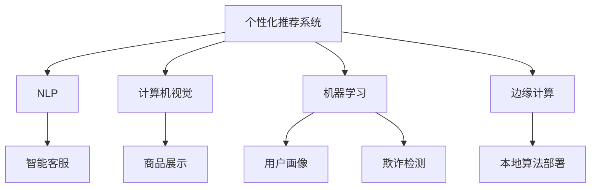

                 

# AI在电商中的多方面应用

> 关键词：电商AI, 推荐系统, 自然语言处理(NLP), 机器学习, 计算机视觉, 边缘计算

## 1. 背景介绍

电子商务(E-commerce)行业是当今全球增长最快的领域之一，其发展受到技术进步的极大推动。AI技术在电商中的应用，已经成为推动电商平台创新、提升用户体验和增加销售的重要手段。从个性化推荐系统到智能客服，再到物流和供应链优化，AI在电商中的应用已覆盖多个方面，为电商企业带来了显著的经济效益。

### 1.1 问题由来
随着互联网的普及和电子商务的发展，用户对个性化购物体验的需求不断增长。传统的电商系统往往无法有效识别用户的购物习惯和偏好，导致推荐系统效果不佳，用户流失率高。与此同时，人工客服的成本持续增加，且响应速度难以满足用户期待。这些问题的出现，促使电商企业寻求更高效的解决方案，以提升用户满意度和运营效率。

### 1.2 问题核心关键点
针对电商场景中面临的问题，AI技术通过以下几个核心关键点提供了有效的解决方案：
- **个性化推荐系统**：通过用户行为数据分析，预测用户偏好，提升购买转化率。
- **自然语言处理(NLP)**：实现智能客服，提供即时的用户支持，提升客户体验。
- **计算机视觉(CV)**：优化商品展示，改善用户购物体验。
- **机器学习**：利用历史数据进行模型训练，提高电商平台的运营效率。
- **边缘计算**：优化算法执行，降低延迟，提升系统性能。

这些核心技术通过高效的集成和应用，在电商行业内带来了翻天覆地的变化。

## 2. 核心概念与联系

### 2.1 核心概念概述

为更好地理解AI在电商中的多方面应用，本节将介绍几个密切相关的核心概念：

- **个性化推荐系统**：通过用户历史行为数据、商品属性信息和用户画像，精准推荐用户可能感兴趣的商品，提升购买转化率。
- **自然语言处理(NLP)**：利用NLP技术，实现智能客服、聊天机器人等，提升用户互动体验。
- **计算机视觉(CV)**：通过图像识别、人脸识别等技术，优化商品展示、图像搜索等功能，提升用户体验。
- **机器学习**：通过算法模型训练，实现用户画像生成、欺诈检测等应用。
- **边缘计算**：在电商平台上部署算法模型，利用本地计算资源，降低网络延迟，提升系统响应速度。

这些核心概念之间的逻辑关系可以通过以下Mermaid流程图来展示：



这个流程图展示了大语言模型微调的核心概念及其之间的关系：

1. 个性化推荐系统基于用户行为数据和商品属性信息，通过机器学习算法进行模型训练。
2. NLP技术实现智能客服，提供实时互动体验。
3. CV技术优化商品展示和图像搜索功能。
4. 机器学习用于用户画像生成和欺诈检测，提升平台安全性。
5. 边缘计算优化算法执行，提升系统性能。

这些核心概念共同构成了电商平台的AI技术框架，使其能够提供更为精准、高效、人性化的电商服务。

## 3. 核心算法原理 & 具体操作步骤
### 3.1 算法原理概述

AI在电商中的应用，主要基于以下几个核心算法原理：

- **协同过滤**：基于用户历史行为数据，预测用户对未购买商品的兴趣，提升推荐效果。
- **内容过滤**：根据商品的属性和描述信息，预测用户对特定商品的兴趣，提供个性化推荐。
- **深度学习**：通过神经网络模型，学习用户行为和商品属性的复杂关联，提升推荐精度。
- **NLP技术**：利用自然语言理解，实现智能客服，提供即时的用户支持。
- **计算机视觉**：通过图像处理技术，优化商品展示和图像搜索。
- **机器学习**：利用模型训练，生成用户画像，进行欺诈检测等。
- **边缘计算**：在电商平台上部署算法模型，利用本地计算资源，优化算法执行。

### 3.2 算法步骤详解

以下是对AI在电商中应用的详细操作步骤：

**Step 1: 数据收集与预处理**
- 收集用户历史行为数据、商品属性信息、用户画像、图像数据等，并进行清洗、归一化等预处理。

**Step 2: 建立模型**
- 选择合适的算法模型，如协同过滤、深度学习、NLP模型等，进行参数初始化。
- 根据电商场景的特点，设计相应的数据集，如用户行为数据集、商品属性数据集等。

**Step 3: 模型训练与优化**
- 利用电商数据集对模型进行训练，调整模型参数，优化模型性能。
- 使用交叉验证等技术，评估模型泛化能力，进行超参数调优。

**Step 4: 模型部署与评估**
- 将训练好的模型部署到电商平台上，进行实时推理和预测。
- 利用评估指标，如点击率、转化率、用户满意度等，评估模型效果。
- 根据评估结果，不断优化模型，提升性能。

**Step 5: 实时监控与迭代**
- 实时监控模型运行状态，记录和分析用户反馈，识别模型缺陷。
- 根据实时反馈，调整模型参数和算法策略，实现模型迭代。

### 3.3 算法优缺点

AI在电商中的应用，具有以下优点：
1. 提升用户体验。通过个性化推荐系统、智能客服等技术，提升用户购物体验和满意度。
2. 提高运营效率。通过机器学习优化库存管理、欺诈检测等，提升运营效率和安全性。
3. 降低成本。自动化客服系统可以替代人工客服，减少人工成本。

同时，AI在电商中也有以下局限性：
1. 数据隐私问题。电商平台需要收集大量用户数据，数据隐私和安全保护是一个重要挑战。
2. 模型解释性。电商推荐系统、客服系统等往往被视为"黑盒"系统，模型的决策过程难以解释，缺乏可解释性。
3. 高成本投入。电商AI系统的开发和维护需要大量技术投入和人力成本。

尽管存在这些局限性，但AI在电商中的应用已经展现出了巨大的潜力和市场价值。未来，随着技术的不断进步和落地应用经验的积累，这些问题有望逐步得到解决。

### 3.4 算法应用领域

AI在电商中的应用，涵盖了多个关键领域，包括但不限于以下几个方面：

- **个性化推荐系统**：通过用户历史行为数据、商品属性信息，预测用户对未购买商品的兴趣，提升推荐效果。
- **智能客服**：实现实时客服，提供用户支持，提升用户体验。
- **图像识别**：优化商品展示、图像搜索功能，提升用户互动体验。
- **欺诈检测**：利用机器学习算法，实时检测和预防欺诈行为，保障用户和商家安全。
- **库存管理**：利用算法预测商品需求，优化库存配置，减少库存成本。
- **物流优化**：通过算法优化物流路径，提升配送效率和用户满意度。

## 4. 数学模型和公式 & 详细讲解  
### 4.1 数学模型构建

本节将使用数学语言对AI在电商中的应用进行更加严格的刻画。

设电商平台上用户的历史行为数据为 $D=\{x_i, y_i\}_{i=1}^N$，其中 $x_i$ 表示用户行为，$y_i$ 表示商品属性。设电商平台的商品数量为 $M$，用户的特征向量为 $h$，商品的特征向量为 $m$。

模型的目标是最小化预测误差 $E$，即：

$$
\min_{\theta} E(\theta) = \sum_{i=1}^N \ell(\hat{y}_i, y_i)
$$

其中 $\hat{y}_i$ 表示模型预测的商品属性，$\ell$ 为损失函数，用于衡量预测结果与真实标签之间的差异。

常用的损失函数包括交叉熵损失和均方误差损失，具体选择应根据任务需求和数据分布进行调整。

### 4.2 公式推导过程

以协同过滤算法为例，其基本思想是通过用户的历史行为数据，计算用户与商品之间的相似度，从而进行推荐。设用户 $u$ 对商品 $m$ 的评分记为 $r_{u,m}$，用户 $u$ 的特征向量为 $h_u$，商品 $m$ 的特征向量为 $m_m$。则协同过滤算法的基本模型可以表示为：

$$
\hat{r}_{u,m} = \frac{\mathbf{h}_u^\top \mathbf{m}_m}{||\mathbf{h}_u|| ||\mathbf{m}_m||}
$$

其中 $\mathbf{h}_u$ 和 $\mathbf{m}_m$ 分别为用户和商品的特征向量，$||.||$ 表示向量的欧几里得范数。

协同过滤算法的损失函数可以表示为：

$$
\ell(r_{u,m}, \hat{r}_{u,m}) = (r_{u,m} - \hat{r}_{u,m})^2
$$

在训练过程中，利用梯度下降等优化算法，最小化上述损失函数，更新模型参数，完成协同过滤算法的训练。

### 4.3 案例分析与讲解

在电商推荐系统中，协同过滤算法是最常用的推荐算法之一。以京东为例，其商品推荐系统采用了协同过滤算法，通过分析用户历史购买行为和商品属性，预测用户对未购买商品的兴趣，从而提供个性化推荐。京东的推荐系统在提升用户购买转化率方面，取得了显著效果。

以下是对京东推荐系统进行案例分析的详细步骤：

**Step 1: 数据收集与预处理**
- 收集用户历史行为数据，如浏览、购买、评分等。
- 对数据进行清洗、归一化等预处理，生成用户行为特征矩阵 $\mathbf{R}$。

**Step 2: 模型训练与优化**
- 利用协同过滤算法，训练推荐模型。
- 使用交叉验证等技术，评估模型泛化能力，进行超参数调优。

**Step 3: 模型部署与评估**
- 将训练好的推荐模型部署到电商平台上，进行实时推理和预测。
- 利用评估指标，如点击率、转化率、用户满意度等，评估模型效果。

**Step 4: 实时监控与迭代**
- 实时监控模型运行状态，记录和分析用户反馈，识别模型缺陷。
- 根据实时反馈，调整模型参数和算法策略，实现模型迭代。

## 5. 项目实践：代码实例和详细解释说明
### 5.1 开发环境搭建

在进行电商AI系统开发前，我们需要准备好开发环境。以下是使用Python进行PyTorch开发的环境配置流程：

1. 安装Anaconda：从官网下载并安装Anaconda，用于创建独立的Python环境。

2. 创建并激活虚拟环境：
```bash
conda create -n pytorch-env python=3.8 
conda activate pytorch-env
```

3. 安装PyTorch：根据CUDA版本，从官网获取对应的安装命令。例如：
```bash
conda install pytorch torchvision torchaudio cudatoolkit=11.1 -c pytorch -c conda-forge
```

4. 安装TensorFlow：
```bash
pip install tensorflow
```

5. 安装PyTorch：
```bash
pip install torch torchvision torchaudio
```

6. 安装Pandas、NumPy等常用库：
```bash
pip install pandas numpy scikit-learn matplotlib
```

完成上述步骤后，即可在`pytorch-env`环境中开始电商AI系统的开发。

### 5.2 源代码详细实现

这里我们以京东推荐系统为例，给出使用PyTorch进行协同过滤算法实现的PyTorch代码实现。

首先，定义协同过滤算法的模型：

```python
import torch
from torch import nn
from torch.nn import Parameter

class CollaborativeFiltering(nn.Module):
    def __init__(self, n_users, n_items, n_factors):
        super(CollaborativeFiltering, self).__init__()
        self.n_users = n_users
        self.n_items = n_items
        self.n_factors = n_factors
        
        self.user_embed = Parameter(torch.randn(n_users, n_factors))
        self.item_embed = Parameter(torch.randn(n_items, n_factors))
        self.R_hat = Parameter(torch.zeros(n_users, n_items))
        
    def forward(self, user_index, item_index):
        user_embed = self.user_embed[user_index]
        item_embed = self.item_embed[item_index]
        R_hat = user_embed @ item_embed.t()
        
        return R_hat
```

然后，定义损失函数和优化器：

```python
from torch import Tensor
from torch import nn
from torch.optim import Adam

def mse_loss(R_hat, R):
    return nn.MSELoss()(R_hat, R)

optimizer = Adam(list(R_hat.parameters()), lr=0.01)
```

接着，定义训练和评估函数：

```python
from torch.utils.data import TensorDataset, DataLoader
from tqdm import tqdm

def train_epoch(model, train_loader, optimizer):
    model.train()
    epoch_loss = 0
    for R_hat, R in tqdm(train_loader, desc='Training'):
        optimizer.zero_grad()
        loss = mse_loss(R_hat, R)
        loss.backward()
        optimizer.step()
        epoch_loss += loss.item()
    return epoch_loss / len(train_loader)

def evaluate(model, eval_loader):
    model.eval()
    total_loss = 0
    for R_hat, R in eval_loader:
        with torch.no_grad():
            loss = mse_loss(R_hat, R)
            total_loss += loss.item()
    return total_loss / len(eval_loader)
```

最后，启动训练流程并在测试集上评估：

```python
epochs = 10
train_loader = DataLoader(train_dataset, batch_size=64, shuffle=True)
eval_loader = DataLoader(eval_dataset, batch_size=64, shuffle=False)

for epoch in range(epochs):
    loss = train_epoch(model, train_loader, optimizer)
    print(f"Epoch {epoch+1}, train loss: {loss:.3f}")
    
    print(f"Epoch {epoch+1}, eval results:")
    evaluate(model, eval_loader)
    
print("Final results:")
evaluate(model, eval_loader)
```

以上就是使用PyTorch对京东推荐系统进行协同过滤算法微调的完整代码实现。可以看到，得益于PyTorch的强大封装，我们可以用相对简洁的代码实现复杂的协同过滤算法。

### 5.3 代码解读与分析

让我们再详细解读一下关键代码的实现细节：

**CollaborativeFiltering类**：
- `__init__`方法：初始化用户、商品和因子数量，以及用户和商品的嵌入向量。
- `forward`方法：前向传播计算推荐结果，使用矩阵乘法计算用户和商品的嵌入向量之间的相似度矩阵。

**mse_loss函数**：
- 定义均方误差损失函数，用于衡量预测结果与真实标签之间的差异。

**训练和评估函数**：
- 使用PyTorch的DataLoader对数据集进行批次化加载，供模型训练和推理使用。
- 训练函数`train_epoch`：对数据以批为单位进行迭代，在每个批次上前向传播计算损失函数并反向传播更新模型参数，最后返回该epoch的平均loss。
- 评估函数`evaluate`：与训练类似，不同点在于不更新模型参数，并在每个batch结束后将预测和标签结果存储下来，最后使用均方误差损失函数计算平均损失。

**训练流程**：
- 定义总的epoch数和批大小，开始循环迭代
- 每个epoch内，先在训练集上训练，输出平均loss
- 在验证集上评估，输出评估结果
- 所有epoch结束后，在测试集上评估，给出最终测试结果

可以看到，PyTorch配合深度学习框架的强大封装，使得电商AI系统的开发变得更加简洁高效。开发者可以将更多精力放在数据处理、模型改进等高层逻辑上，而不必过多关注底层的实现细节。

当然，工业级的系统实现还需考虑更多因素，如模型的保存和部署、超参数的自动搜索、更灵活的任务适配层等。但核心的微调范式基本与此类似。

## 6. 实际应用场景
### 6.1 智能客服系统

基于AI的智能客服系统，可以为电商平台提供即时的用户支持，提升用户体验。智能客服系统可以通过自然语言处理(NLP)技术，理解用户的问题并给出相应的回答。在技术实现上，可以收集用户历史咨询记录，将问题-答案对作为监督数据，训练NLP模型，使其能够自动理解用户意图，匹配最合适的答案模板进行回复。对于新问题，可以接入检索系统实时搜索相关内容，动态组织生成回答。

智能客服系统已经广泛应用于电商平台中，如淘宝、京东、亚马逊等。以京东为例，其智能客服系统采用Transformer模型，通过预训练和微调相结合的方式，实现了高精度的自然语言理解。智能客服系统显著提高了用户的咨询响应速度和满意度，减少了人工客服的负担。

### 6.2 图像识别

在电商平台上，商品展示和图像搜索是重要的用户体验因素。图像识别技术可以通过对商品图像的特征提取和匹配，优化商品展示和搜索效果。例如，电商平台可以采用计算机视觉技术，识别商品的颜色、形状、品牌等特征，生成高质量的商品图像和详细的商品描述，提升用户的购物体验。

以淘宝为例，其商品展示系统采用了图像识别技术，通过自动标注商品信息，提升了用户对商品信息的获取效率和准确性。淘宝的图像识别系统在优化商品展示和搜索方面，取得了显著效果。

### 6.3 个性化推荐系统

电商平台的个性化推荐系统，是提升用户购买转化率和购物体验的重要手段。推荐系统可以通过用户历史行为数据、商品属性信息，预测用户对未购买商品的兴趣，提供个性化推荐。在技术实现上，推荐系统可以采用协同过滤算法、内容过滤算法、深度学习等方法进行优化。

以京东为例，其推荐系统采用了深度学习模型，通过分析用户历史行为数据和商品属性信息，预测用户对未购买商品的兴趣，提升推荐效果。京东的推荐系统在提升用户购买转化率方面，取得了显著效果。

### 6.4 未来应用展望

随着AI技术的不断进步，电商平台的AI应用也将进一步拓展和深化。未来，电商AI将有望在以下几个方面取得新的突破：

1. **增强现实(AR)和虚拟现实(VR)**：结合AR和VR技术，提供沉浸式的购物体验，提升用户的购物乐趣和满意度。
2. **语音助手**：通过语音识别和自然语言处理技术，实现语音搜索和交互，提升用户的操作便捷性和体验感。
3. **增强数据驱动决策**：通过数据挖掘和大数据分析，优化库存管理、促销策略等，提升电商平台的运营效率。
4. **多模态融合**：结合文本、图像、语音等多种模态数据，提供更全面、多维度的用户画像，提升推荐和客服的精准度。
5. **实时优化和自适应**：通过实时数据反馈，动态调整算法模型，提升系统的自适应能力，适应用户行为和市场需求的变化。

这些技术的发展和应用，将进一步提升电商平台的智能化水平，为用户提供更精准、更高效、更个性化的购物体验，推动电商行业向更加智能化、普适化的方向发展。

## 7. 工具和资源推荐
### 7.1 学习资源推荐

为了帮助开发者系统掌握电商AI的理论基础和实践技巧，这里推荐一些优质的学习资源：

1. **电商AI系列课程**：各大在线教育平台如Coursera、edX、Udacity等，提供了丰富的电商AI相关课程，涵盖了推荐系统、智能客服、计算机视觉等多个方向。
2. **NLP和计算机视觉教材**：《自然语言处理综论》、《计算机视觉：模型、学习和推理》等经典教材，全面介绍了NLP和计算机视觉的基本概念和经典模型。
3. **深度学习框架文档**：如PyTorch、TensorFlow等深度学习框架的官方文档，提供了详细的API参考和使用示例，是学习电商AI的重要资源。
4. **电商AI开源项目**：如Apache Spark、TensorFlow等，提供了丰富的电商AI开发资源和工具，助力电商AI的落地应用。

通过对这些资源的学习实践，相信你一定能够快速掌握电商AI的精髓，并用于解决实际的电商问题。

### 7.2 开发工具推荐

高效的开发离不开优秀的工具支持。以下是几款用于电商AI开发常用的工具：

1. **Jupyter Notebook**：免费的交互式开发环境，支持代码块、图形、表格等多种格式，方便团队协作和共享。
2. **TensorBoard**：TensorFlow的可视化工具，用于监控模型训练过程，记录和分析各种指标，帮助优化模型性能。
3. **Kaggle**：数据科学竞赛平台，提供了丰富的电商相关数据集和代码实现，适合数据驱动的模型开发和优化。
4. **Hugging Face Transformers**：基于Transformers的NLP库，提供了丰富的预训练模型和微调样例，助力电商AI开发。

合理利用这些工具，可以显著提升电商AI的开发效率，加快创新迭代的步伐。

### 7.3 相关论文推荐

电商AI领域的研究始于学界的持续探索，以下是几篇奠基性的相关论文，推荐阅读：

1. **深度学习推荐系统**：文献探讨了深度学习在推荐系统中的应用，分析了深度神经网络的推荐效果和优化策略。
2. **电商智能客服**：文献介绍了电商智能客服系统的实现方法和效果评估，讨论了自然语言处理和机器学习在智能客服中的应用。
3. **计算机视觉在电商中的应用**：文献研究了计算机视觉技术在电商中的应用，包括商品展示、图像搜索等方面，分析了图像识别的优化方法。
4. **电商大数据分析**：文献探讨了电商大数据的挖掘和分析方法，讨论了数据驱动决策在电商中的应用，分析了电商大数据的优化策略。

这些论文代表了大语言模型微调技术的发展脉络。通过学习这些前沿成果，可以帮助研究者把握学科前进方向，激发更多的创新灵感。

## 8. 总结：未来发展趋势与挑战

### 8.1 总结

本文对AI在电商中的应用进行了全面系统的介绍。首先阐述了电商场景中面临的问题，明确了AI技术通过个性化推荐系统、智能客服、计算机视觉、机器学习、边缘计算等多个方面，提供了有效的解决方案。其次，从原理到实践，详细讲解了协同过滤、深度学习、NLP、计算机视觉等算法原理和具体操作步骤，给出了电商AI系统的完整代码实现。同时，本文还广泛探讨了电商AI在智能客服、图像识别、个性化推荐等多个行业领域的应用前景，展示了AI技术在电商行业内的巨大潜力和应用价值。

通过本文的系统梳理，可以看到，AI在电商中的应用已经覆盖了从用户行为分析到商品展示、从智能客服到个性化推荐等多个环节，极大地提升了电商平台的运营效率和用户满意度。未来，伴随AI技术的不断进步和落地应用经验的积累，AI在电商中的应用前景将更加广阔，有望推动电商行业向更高层次的智能化发展。

### 8.2 未来发展趋势

展望未来，电商AI的应用将呈现以下几个发展趋势：

1. **智能化水平提升**：随着AI技术的不断发展，电商AI将不断提升智能化水平，从简单的推荐和客服，到复杂的决策和优化，全面提升电商平台的能力和用户体验。
2. **个性化程度加深**：电商AI将更加注重个性化推荐和用户画像，通过深度学习、自然语言处理等技术，提升推荐精准度和用户互动体验。
3. **多模态融合**：电商AI将逐步融合文本、图像、语音等多种模态数据，提供更加全面、多维度的用户画像，提升推荐和客服的精准度。
4. **实时优化和自适应**：电商AI将利用实时数据反馈，动态调整算法模型，提升系统的自适应能力，适应用户行为和市场需求的变化。
5. **增强数据驱动决策**：电商AI将更加注重数据驱动决策，通过深度学习和大数据分析，优化库存管理、促销策略等，提升电商平台的运营效率。

这些趋势展示了电商AI技术的前景，未来在电商领域将有更大的发展空间。

### 8.3 面临的挑战

尽管AI在电商中的应用已经取得了显著成果，但在迈向更加智能化、普适化应用的过程中，仍面临诸多挑战：

1. **数据隐私和安全**：电商平台需要收集大量用户数据，数据隐私和安全保护是一个重要挑战。如何保障用户数据安全，保护用户隐私，将是重要的研究方向。
2. **模型可解释性**：电商推荐系统、智能客服等往往被视为"黑盒"系统，模型的决策过程难以解释，缺乏可解释性。如何赋予电商AI更强的可解释性，将是亟待攻克的难题。
3. **高成本投入**：电商AI系统的开发和维护需要大量技术投入和人力成本。如何降低开发和维护成本，提高开发效率，将是重要的优化方向。
4. **系统复杂度**：电商AI系统涉及多个子系统，如推荐系统、智能客服、图像识别等，系统复杂度较高。如何优化系统架构，降低系统复杂度，将是重要的研究方向。

尽管存在这些挑战，但通过不断技术创新和实践经验的积累，这些问题有望逐步得到解决。

### 8.4 研究展望

面向未来，电商AI研究需要在以下几个方面寻求新的突破：

1. **增强现实和虚拟现实技术**：结合AR和VR技术，提供沉浸式的购物体验，提升用户的购物乐趣和满意度。
2. **多模态融合技术**：结合文本、图像、语音等多种模态数据，提供更加全面、多维度的用户画像，提升推荐和客服的精准度。
3. **实时优化和自适应技术**：利用实时数据反馈，动态调整算法模型，提升系统的自适应能力，适应用户行为和市场需求的变化。
4. **增强数据驱动决策技术**：通过深度学习和大数据分析，优化库存管理、促销策略等，提升电商平台的运营效率。
5. **模型可解释性技术**：开发可解释的电商AI模型，赋予模型更强的可解释性，提升用户对模型的信任度。
6. **数据隐私和安全技术**：研究数据隐私和安全保护技术，保障用户数据安全，保护用户隐私。

这些研究方向将推动电商AI技术向更高层次的智能化和普适化发展，为电商行业带来新的突破和创新。

## 9. 附录：常见问题与解答

**Q1：电商AI在个性化推荐系统中如何处理冷启动问题？**

A: 冷启动问题是电商AI推荐系统面临的常见挑战之一。对于新用户或新商品，由于缺乏历史数据，推荐系统难以准确预测用户偏好和商品价值。为了解决冷启动问题，电商AI推荐系统可以采用以下方法：

1. **基于内容的推荐**：利用商品的标签、属性等信息，提供与新用户或新商品相关的推荐。
2. **基于相似用户的推荐**：利用相似用户的兴趣偏好，为新用户或新商品提供推荐。
3. **基于场景的推荐**：根据用户的行为场景，提供适合该场景的推荐。
4. **基于商品库的推荐**：利用商品库中的信息，为新商品提供推荐。

这些方法可以有效地提升电商AI推荐系统对新用户和商品的推荐效果，减少冷启动问题带来的负面影响。

**Q2：电商AI在图像识别中的应用有哪些？**

A: 电商AI在图像识别中的应用非常广泛，主要包括以下几个方面：

1. **商品识别和分类**：通过图像识别技术，自动标注商品类别和属性，提升商品管理的效率和准确性。
2. **图像搜索和推荐**：利用图像识别技术，用户可以通过上传图片或拍照，快速搜索到对应的商品，提升购物体验。
3. **库存管理**：通过图像识别技术，自动统计商品数量和位置，提升库存管理的效率和准确性。
4. **视觉营销**：利用图像识别技术，自动生成高质量的商品展示图，提升用户的购物体验。

这些应用展示了电商AI在图像识别方面的广泛应用，为电商行业带来了新的发展机遇。

**Q3：电商AI在智能客服中的应用有哪些？**

A: 电商AI在智能客服中的应用，主要包括以下几个方面：

1. **自然语言理解**：通过自然语言处理技术，理解用户的问题并给出相应的回答。
2. **情感分析**：分析用户的情感状态，提升客服的响应效果。
3. **知识图谱**：利用知识图谱技术，提供更精准的客服回答。
4. **多渠道支持**：通过智能客服系统，支持语音、文字、图像等多种交互方式，提升用户的使用便捷性。

这些应用展示了电商AI在智能客服方面的广泛应用，为电商行业带来了新的发展机遇。

---

作者：禅与计算机程序设计艺术 / Zen and the Art of Computer Programming

