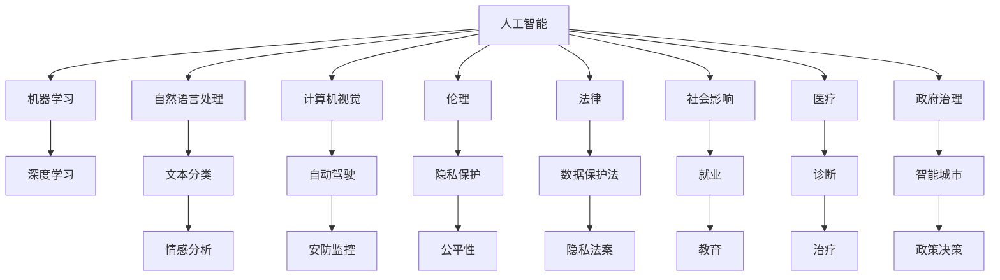

                 

# AI在社会中的角色与应用

## 1. 背景介绍

### 1.1 问题由来

人工智能（AI）技术的飞速发展，正深刻改变着人类社会的各个方面，从医疗健康、教育到城市管理、环境保护，AI的应用无处不在。这不仅展示了其强大的技术潜力，也引发了关于AI在社会中的角色和应用的广泛讨论。

### 1.2 问题核心关键点

1. **AI的定义与范围**：AI不仅仅是机器学习，更是一个涵盖算法、数据、计算资源等多方面的综合性技术。AI在社会中的角色不仅在于技术手段，更在于其背后的伦理、法律和社会影响。
2. **AI的伦理与社会责任**：AI技术的普及应用，如何平衡技术创新与伦理道德，避免滥用带来的负面影响，是当前和未来面临的重要问题。
3. **AI的潜在风险与挑战**：包括数据隐私、算法偏见、安全性、透明度等，都是AI应用中需要考虑的关键问题。
4. **AI与人类共生的未来**：AI如何与人类社会和谐共生，既发挥其技术优势，又避免技术异化，是需要深思的课题。

### 1.3 问题研究意义

研究AI在社会中的角色与应用，对于理解AI技术的发展趋势、社会影响以及如何更好地发挥AI的潜力具有重要意义。通过深入探讨AI的伦理、法律和社会影响，有助于制定合理的政策法规，引导AI技术的健康发展，实现技术与社会的良性互动。

## 2. 核心概念与联系

### 2.1 核心概念概述

为更好地理解AI在社会中的角色与应用，本节将介绍几个密切相关的核心概念：

- **人工智能（AI）**：涉及机器学习、深度学习、自然语言处理、计算机视觉等多个领域的综合性技术。AI技术通过算法模型处理大量数据，实现自动决策和优化。

- **机器学习（ML）**：一种通过数据训练模型，使模型能够对新数据进行预测或决策的算法。是AI的核心技术之一。

- **深度学习（DL）**：一种基于神经网络的机器学习方法，能够处理复杂的非线性关系，广泛应用于图像、语音、文本等领域。

- **自然语言处理（NLP）**：使计算机能够理解和处理人类语言的技术，包括文本分类、情感分析、机器翻译等。

- **计算机视觉（CV）**：使计算机能够识别、分析和理解图像和视频的技术，应用于自动驾驶、安防监控等领域。

- **伦理**：AI技术的开发和应用需要遵循的道德原则，包括隐私保护、公平性、透明性等。

- **法律**：为规范AI技术应用，保护公共利益和个体权益，而制定的相关法律法规。

- **社会影响**：AI技术对就业、教育、医疗、政府治理等方面的广泛影响。

这些核心概念之间的逻辑关系可以通过以下Mermaid流程图来展示：



这个流程图展示了一些核心概念以及它们之间的关联关系，包括AI技术在多个领域的应用，以及伦理和法律对AI技术的规范作用。

## 3. 核心算法原理 & 具体操作步骤
### 3.1 算法原理概述

AI在社会中的应用，通常涉及多个领域的技术，其中机器学习和深度学习是核心的算法原理。AI在特定任务中的表现，很大程度上取决于模型的训练数据、模型架构和训练过程。

以深度学习为例，模型的训练过程可以概括为以下几个步骤：

1. **数据准备**：收集并处理训练数据，确保数据的质量和多样性。
2. **模型设计**：选择合适的模型架构，如卷积神经网络（CNN）、循环神经网络（RNN）、Transformer等。
3. **模型训练**：通过反向传播算法，调整模型参数以最小化损失函数，优化模型性能。
4. **模型评估**：使用验证集评估模型性能，调整参数，防止过拟合。
5. **模型部署**：将训练好的模型应用于实际问题，进行推理和决策。

### 3.2 算法步骤详解

以深度学习中的卷积神经网络（CNN）为例，详细说明其训练步骤：

1. **数据准备**：收集和预处理图像数据，如标准化、归一化、数据增强等。
2. **模型设计**：定义卷积层、池化层、全连接层等组件，搭建CNN模型。
3. **模型训练**：
   - 将数据划分为训练集、验证集和测试集。
   - 使用反向传播算法，通过前向传播计算损失函数，反向传播更新模型参数。
   - 调整学习率、批量大小等超参数，防止过拟合。
4. **模型评估**：
   - 使用验证集评估模型性能，如准确率、召回率、F1分数等。
   - 调整模型参数，优化模型性能。
5. **模型部署**：
   - 将训练好的模型应用于实际问题，进行推理和决策。
   - 实时处理输入数据，生成预测结果。

### 3.3 算法优缺点

深度学习的优点包括：

- **自适应能力**：深度学习模型能够自动学习输入数据的特征，无需人工设计特征。
- **泛化能力**：经过大量数据训练的模型，通常具有较强的泛化能力，能够在未见过的数据上表现良好。
- **处理复杂问题**：深度学习模型能够处理复杂的非线性关系，适用于图像、语音、文本等多个领域。

但深度学习也存在一些缺点：

- **计算资源需求高**：深度学习模型通常需要大量的计算资源，包括高性能的GPU和TPU等。
- **数据依赖性强**：深度学习模型的性能依赖于高质量的数据，数据不足可能导致模型性能不佳。
- **可解释性差**：深度学习模型通常被视为"黑箱"，难以解释其内部工作机制。

### 3.4 算法应用领域

深度学习在多个领域得到了广泛应用，以下是一些典型的应用场景：

- **图像识别**：如人脸识别、物体检测等，深度学习模型在图像识别领域取得了显著的成果。
- **语音识别**：如语音转文本、语音合成等，深度学习模型能够识别和生成自然语言。
- **自然语言处理**：如机器翻译、情感分析、问答系统等，深度学习模型在自然语言处理领域也表现出色。
- **自动驾驶**：如无人驾驶、智能交通系统等，深度学习模型在感知、决策等方面发挥重要作用。
- **医疗影像分析**：如病理图像分析、医学影像诊断等，深度学习模型能够帮助医生进行疾病诊断和预测。

## 4. 数学模型和公式 & 详细讲解 & 举例说明

### 4.1 数学模型构建

深度学习模型的数学模型通常包括输入、模型参数、损失函数和优化算法。以卷积神经网络（CNN）为例，其数学模型可以表示为：

$$
y = h(Wx + b)
$$

其中，$y$表示模型的输出，$h$表示激活函数，$W$表示权重矩阵，$x$表示输入数据，$b$表示偏置向量。

### 4.2 公式推导过程

以简单的线性回归为例，推导模型训练过程中的梯度下降算法：

1. **损失函数**：
   $$
   \mathcal{L}(\theta) = \frac{1}{2} \sum_{i=1}^n (y_i - \hat{y}_i)^2
   $$

   其中，$y_i$表示真实标签，$\hat{y}_i$表示模型的预测值，$\theta$表示模型参数。

2. **梯度计算**：
   $$
   \nabla_{\theta} \mathcal{L}(\theta) = \sum_{i=1}^n (y_i - \hat{y}_i)\nabla_{\theta} \hat{y}_i
   $$

3. **参数更新**：
   $$
   \theta \leftarrow \theta - \eta \nabla_{\theta} \mathcal{L}(\theta)
   $$

   其中，$\eta$表示学习率。

### 4.3 案例分析与讲解

以图像分类任务为例，使用CNN进行图像分类的过程：

1. **数据准备**：收集和预处理图像数据，如标准化、归一化、数据增强等。
2. **模型设计**：搭建CNN模型，包括卷积层、池化层、全连接层等组件。
3. **模型训练**：
   - 将数据划分为训练集、验证集和测试集。
   - 使用反向传播算法，通过前向传播计算损失函数，反向传播更新模型参数。
   - 调整学习率、批量大小等超参数，防止过拟合。
4. **模型评估**：
   - 使用验证集评估模型性能，如准确率、召回率、F1分数等。
   - 调整模型参数，优化模型性能。
5. **模型部署**：
   - 将训练好的模型应用于实际问题，进行推理和决策。
   - 实时处理输入数据，生成预测结果。

## 5. 项目实践：代码实例和详细解释说明

### 5.1 开发环境搭建

进行深度学习项目开发时，需要准备一些基础环境：

1. **安装Python**：使用最新版的Python，如Python 3.8及以上版本。
2. **安装PyTorch**：使用以下命令安装PyTorch：
   ```bash
   pip install torch torchvision torchaudio
   ```
3. **安装TensorFlow**：使用以下命令安装TensorFlow：
   ```bash
   pip install tensorflow
   ```
4. **安装OpenCV**：使用以下命令安装OpenCV：
   ```bash
   pip install opencv-python
   ```

### 5.2 源代码详细实现

以下是一个简单的CNN图像分类示例代码，包含数据准备、模型定义、训练和评估：

```python
import torch
import torch.nn as nn
import torch.optim as optim
import torchvision.transforms as transforms
import torchvision.datasets as datasets

# 数据准备
transform = transforms.Compose([
    transforms.ToTensor(),
    transforms.Normalize((0.5, 0.5, 0.5), (0.5, 0.5, 0.5))
])

train_dataset = datasets.CIFAR10(root='data', train=True, transform=transform, download=True)
test_dataset = datasets.CIFAR10(root='data', train=False, transform=transform, download=True)

train_loader = torch.utils.data.DataLoader(train_dataset, batch_size=32, shuffle=True)
test_loader = torch.utils.data.DataLoader(test_dataset, batch_size=32, shuffle=False)

# 模型定义
class Net(nn.Module):
    def __init__(self):
        super(Net, self).__init__()
        self.conv1 = nn.Conv2d(3, 6, 5)
        self.pool = nn.MaxPool2d(2, 2)
        self.conv2 = nn.Conv2d(6, 16, 5)
        self.fc1 = nn.Linear(16 * 5 * 5, 120)
        self.fc2 = nn.Linear(120, 84)
        self.fc3 = nn.Linear(84, 10)

    def forward(self, x):
        x = self.pool(nn.functional.relu(self.conv1(x)))
        x = self.pool(nn.functional.relu(self.conv2(x)))
        x = x.view(-1, 16 * 5 * 5)
        x = nn.functional.relu(self.fc1(x))
        x = nn.functional.relu(self.fc2(x))
        x = self.fc3(x)
        return x

net = Net()
criterion = nn.CrossEntropyLoss()
optimizer = optim.SGD(net.parameters(), lr=0.001, momentum=0.9)

# 模型训练
for epoch in range(2):  # 多轮训练
    running_loss = 0.0
    for i, data in enumerate(train_loader, 0):
        inputs, labels = data
        optimizer.zero_grad()
        outputs = net(inputs)
        loss = criterion(outputs, labels)
        loss.backward()
        optimizer.step()
        running_loss += loss.item()
        if i % 100 == 99:    # 每训练2000步输出一次结果
            print('[%d, %5d] loss: %.3f' %
                  (epoch + 1, i + 1, running_loss / 2000))
            running_loss = 0.0

print('Finished Training')

# 模型评估
correct = 0
total = 0
with torch.no_grad():
    for data in test_loader:
        images, labels = data
        outputs = net(images)
        _, predicted = torch.max(outputs.data, 1)
        total += labels.size(0)
        correct += (predicted == labels).sum().item()

print('Accuracy of the network on the 10000 test images: %d %%' % (
    100 * correct / total))
```

### 5.3 代码解读与分析

**Net类定义**：
- `__init__`方法：定义模型的结构，包括卷积层、池化层和全连接层。
- `forward`方法：定义模型的前向传播过程，包括卷积、激活、池化和全连接操作。

**训练过程**：
- 使用`DataLoader`对数据进行批量加载。
- 定义损失函数和优化器，并调整超参数。
- 使用梯度下降算法进行模型训练。

**评估过程**：
- 使用验证集评估模型性能，计算准确率。
- 输出模型在测试集上的准确率。

## 6. 实际应用场景

### 6.1 智能医疗

AI在医疗领域的应用已经初见成效，特别是在医疗影像分析、疾病诊断和个性化治疗等方面。

- **医疗影像分析**：使用深度学习模型对医学影像进行分类和分割，帮助医生进行疾病诊断和预测。
- **疾病诊断**：利用自然语言处理技术，分析电子病历和医学文献，辅助医生进行诊断和治疗方案制定。
- **个性化治疗**：通过分析患者的基因信息和临床数据，使用机器学习模型推荐个性化治疗方案。

### 6.2 智能交通

AI在交通领域的应用包括智能驾驶、交通流量分析和智能监控等。

- **智能驾驶**：使用计算机视觉和深度学习技术，实现自动驾驶和智能交通系统。
- **交通流量分析**：使用机器学习模型对交通流量数据进行分析，优化交通管理和调度。
- **智能监控**：使用计算机视觉技术，对视频数据进行实时分析和处理，提升公共安全水平。

### 6.3 智能制造

AI在制造业中的应用包括智能生产、质量控制和供应链优化等。

- **智能生产**：使用机器学习模型对生产数据进行分析，优化生产流程和设备维护。
- **质量控制**：使用计算机视觉技术，对产品质量进行实时检测和分析。
- **供应链优化**：使用机器学习模型对供应链数据进行分析，优化供应链管理和物流调度。

### 6.4 未来应用展望

未来，AI在社会中的角色和应用将进一步深化和拓展，预计会有以下发展趋势：

1. **跨领域应用**：AI技术将逐步应用于更多领域，如金融、教育、环保等，提升各行业的智能化水平。
2. **人机协同**：AI系统将与人类协同工作，形成更高效、更智能的解决方案。
3. **数据驱动**：数据将成为AI系统的重要驱动源，通过数据积累和分析，提升AI系统的性能和应用范围。
4. **伦理和法律规范**：随着AI技术的发展，相关伦理和法律规范也将逐步完善，保障AI技术的健康发展。
5. **跨模态融合**：AI技术将突破单一模态的限制，融合视觉、语音、文本等多种模态数据，提升系统综合能力。

## 7. 工具和资源推荐

### 7.1 学习资源推荐

为帮助开发者系统掌握AI技术，这里推荐一些优质的学习资源：

1. **DeepLearning.AI Coursera课程**：由Andrew Ng教授开设的深度学习课程，系统介绍深度学习的基本原理和实践应用。
2. **《Deep Learning》书籍**：Ian Goodfellow等人的深度学习经典教材，全面介绍深度学习的理论基础和实际应用。
3. **PyTorch官方文档**：PyTorch官方文档提供了丰富的教程和样例代码，是学习和应用PyTorch的重要资源。
4. **Kaggle竞赛平台**：Kaggle提供大量的数据集和竞赛项目，帮助开发者实践AI技术和提升实战能力。
5. **HuggingFace Transformers库文档**：Transformers库提供了丰富的预训练模型和微调样例，是学习和应用NLP技术的重要工具。

### 7.2 开发工具推荐

为提高AI项目开发效率，这里推荐一些常用的开发工具：

1. **PyTorch**：深度学习的主流框架，提供了动态计算图和丰富的工具库，支持GPU加速。
2. **TensorFlow**：Google开发的深度学习框架，支持分布式计算和生产部署。
3. **Jupyter Notebook**：交互式的编程环境，支持Python、R等语言，便于数据处理和模型训练。
4. **Scikit-learn**：Python数据处理和机器学习库，提供了丰富的数据预处理和模型评估工具。
5. **TensorBoard**：TensorFlow配套的可视化工具，可以实时监测模型训练状态和性能。

### 7.3 相关论文推荐

以下是几篇具有代表性的AI领域论文，推荐阅读：

1. **《Deep Learning》书籍**：Ian Goodfellow等人的深度学习经典教材，全面介绍深度学习的理论基础和实际应用。
2. **《Natural Language Processing with Transformers》书籍**：Jacob Devlin等人的NLP经典教材，全面介绍NLP技术的基本原理和应用。
3. **《Reinforcement Learning: An Introduction》书籍**：Richard S. Sutton和Andrew G. Barto的经典教材，全面介绍强化学习的基本原理和应用。
4. **《ImageNet Classification with Deep Convolutional Neural Networks》论文**：Alex Krizhevsky等人在ImageNet数据集上的经典论文，奠定了深度学习在图像识别领域的应用基础。
5. **《Attention is All You Need》论文**：谷歌的Transformer模型，引入了自注意力机制，在NLP领域取得了显著的成果。

## 8. 总结：未来发展趋势与挑战

### 8.1 总结

本文对AI在社会中的角色与应用进行了全面系统的介绍。首先阐述了AI技术的定义和范围，明确了AI技术在多个领域的应用前景。其次，从原理到实践，详细讲解了AI技术的核心算法和操作步骤，提供了代码实例和详细解释。同时，本文还广泛探讨了AI技术在医疗、交通、制造等领域的应用场景，展示了AI技术的强大潜力和广泛前景。最后，本文精选了AI技术的各类学习资源和开发工具，力求为开发者提供全方位的技术指引。

通过本文的系统梳理，可以看到，AI技术在社会中的应用正在逐步深化，将在更多领域带来革命性的变化。AI技术的广泛应用，需要技术、伦理、法律等多方面的协同发展，才能实现人与机器的和谐共生，共同推动社会的进步和创新。

### 8.2 未来发展趋势

展望未来，AI技术在社会中的应用将呈现以下几个发展趋势：

1. **跨领域应用**：AI技术将逐步应用于更多领域，如金融、教育、环保等，提升各行业的智能化水平。
2. **人机协同**：AI系统将与人类协同工作，形成更高效、更智能的解决方案。
3. **数据驱动**：数据将成为AI系统的重要驱动源，通过数据积累和分析，提升AI系统的性能和应用范围。
4. **伦理和法律规范**：随着AI技术的发展，相关伦理和法律规范也将逐步完善，保障AI技术的健康发展。
5. **跨模态融合**：AI技术将突破单一模态的限制，融合视觉、语音、文本等多种模态数据，提升系统综合能力。

### 8.3 面临的挑战

尽管AI技术在社会中的应用前景广阔，但在其发展过程中仍面临诸多挑战：

1. **数据隐私和安全**：AI技术的应用需要大量数据，如何保护个人隐私和数据安全，是一个重要的问题。
2. **算法偏见和歧视**：AI模型可能会学习到数据中的偏见，导致歧视性决策，如何减少算法偏见，确保公平性，是一个亟待解决的问题。
3. **透明度和可解释性**：AI模型的内部工作机制难以解释，缺乏透明性，如何提高模型可解释性，是当前研究的热点之一。
4. **计算资源限制**：AI技术的应用需要高性能计算资源，如何降低计算成本，提升模型效率，是一个需要解决的问题。
5. **伦理和法律规范**：AI技术的广泛应用需要完善伦理和法律规范，如何制定合理的法规政策，保障公众利益，是一个重要课题。

### 8.4 研究展望

面对AI技术在社会中的应用面临的挑战，未来的研究需要在以下几个方面寻求新的突破：

1. **数据隐私保护**：开发新的数据保护技术，如差分隐私、联邦学习等，保护个人隐私。
2. **算法公平性**：设计公平性算法，减少算法偏见，提升模型的公正性。
3. **模型可解释性**：开发可解释性模型，提高模型的透明度和可信度。
4. **计算资源优化**：优化模型结构，使用混合精度计算、分布式计算等技术，降低计算成本。
5. **伦理和法律规范**：制定合理的AI伦理和法律规范，保障公众利益，推动AI技术的健康发展。

这些研究方向将引领AI技术在社会中的健康发展，实现技术与社会的良性互动，推动社会的进步和创新。

## 9. 附录：常见问题与解答

**Q1：AI技术在医疗领域有哪些应用？**

A: AI技术在医疗领域的应用包括：
1. 医疗影像分析：使用深度学习模型对医学影像进行分类和分割，帮助医生进行疾病诊断和预测。
2. 疾病诊断：利用自然语言处理技术，分析电子病历和医学文献，辅助医生进行诊断和治疗方案制定。
3. 个性化治疗：通过分析患者的基因信息和临床数据，使用机器学习模型推荐个性化治疗方案。

**Q2：AI技术的开发和应用需要考虑哪些伦理问题？**

A: AI技术的开发和应用需要考虑的伦理问题包括：
1. 隐私保护：保护用户数据隐私，避免数据泄露和滥用。
2. 公平性：确保AI系统在各个群体中公平无偏。
3. 透明性：提高AI系统的透明度，避免"黑箱"问题。
4. 安全性：确保AI系统的安全性，避免恶意攻击和滥用。
5. 法律合规：确保AI技术的开发和应用符合相关法律法规。

**Q3：AI技术在智能交通中的应用有哪些？**

A: AI技术在智能交通中的应用包括：
1. 智能驾驶：使用计算机视觉和深度学习技术，实现自动驾驶和智能交通系统。
2. 交通流量分析：使用机器学习模型对交通流量数据进行分析，优化交通管理和调度。
3. 智能监控：使用计算机视觉技术，对视频数据进行实时分析和处理，提升公共安全水平。

**Q4：AI技术的开发和应用需要考虑哪些法律问题？**

A: AI技术的开发和应用需要考虑的法律问题包括：
1. 数据保护法：保护数据隐私，防止数据滥用和泄露。
2. 知识产权法：确保AI技术开发中的知识产权保护。
3. 隐私法案：保护个人隐私，避免数据滥用。
4. 反垄断法：防止AI技术的滥用和垄断。
5. 责任认定：明确AI技术的责任归属，保障公众利益。

**Q5：AI技术在金融领域有哪些应用？**

A: AI技术在金融领域的应用包括：
1. 金融风险管理：使用机器学习模型预测金融市场风险，进行风险管理。
2. 信用评分：使用深度学习模型分析客户数据，进行信用评分和贷款审批。
3. 股票交易：使用自然语言处理技术，分析新闻和社交媒体数据，辅助股票交易决策。

---

作者：禅与计算机程序设计艺术 / Zen and the Art of Computer Programming

