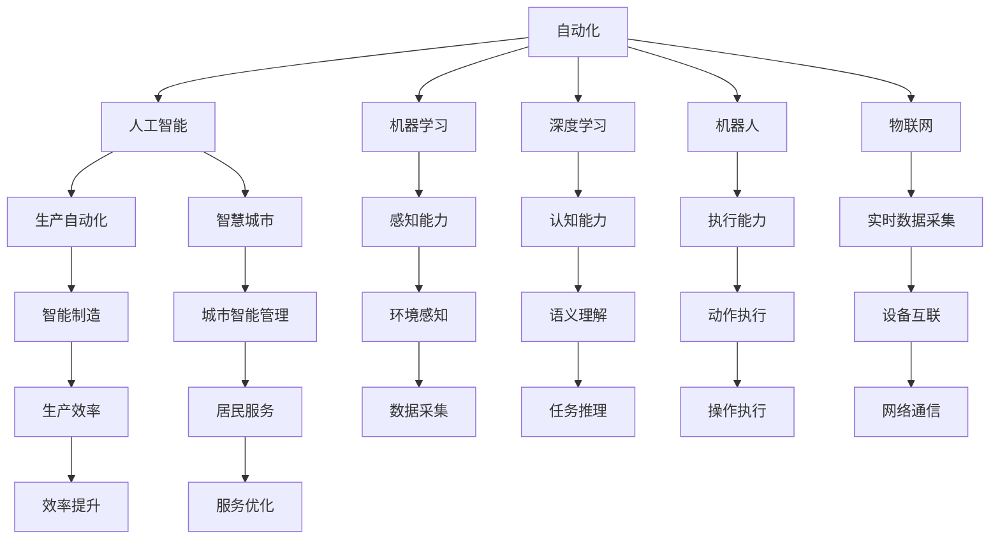

                 

# AI在自动化领域的应用前景

> 关键词：人工智能,自动化,机器学习,机器人,工业4.0,物联网(IoT),生产自动化

## 1. 背景介绍

### 1.1 问题由来

随着技术的不断进步，人工智能(AI)在自动化领域的应用前景变得愈加广阔。从工业制造到智慧城市，从医疗健康到智能家居，AI技术正在以前所未有的速度和规模深入各行各业。自动化系统在提高生产效率、降低成本、改善用户体验等方面展现出了巨大的潜力。然而，传统的自动化系统往往依赖固定的规则和预先编写的代码，难以应对复杂的动态环境和实时需求变化。而基于AI的自动化系统，通过学习和适应，可以更灵活、智能地应对复杂场景，提升自动化系统的可靠性和效率。

### 1.2 问题核心关键点

AI在自动化领域的应用，关键在于通过机器学习、深度学习等技术，使自动化系统具备智能推理和决策能力。具体而言：

- **感知能力**：通过计算机视觉、传感器融合等技术，实现对环境的实时感知和理解。
- **认知能力**：通过自然语言处理、知识图谱等技术，实现对任务的语义理解和推理。
- **决策能力**：通过强化学习、模型预测等技术，实现对复杂场景的智能决策和行动。
- **执行能力**：通过机器人、自动化机械等硬件设备，将决策结果转化为实际行动。

这些核心能力构成了AI在自动化领域的基础框架，使得AI系统能够胜任更加复杂、多样化的任务。

### 1.3 问题研究意义

研究AI在自动化领域的应用前景，对于推动产业升级、提升经济效率、改善生活质量具有重要意义：

- **产业升级**：通过AI技术，传统制造业、农业等领域的自动化水平大幅提升，实现智能制造、精准农业等目标。
- **经济效率**：AI自动化系统通过智能化管理、优化决策，大幅降低人力成本，提高生产效率和资源利用率。
- **生活质量**：AI在医疗、教育、安全等领域的自动化应用，显著提升了服务质量和用户体验，促进了社会的数字化转型。
- **创新驱动**：AI技术不断迭代更新，推动新产业、新模式、新业态的涌现，加速全球技术竞争格局的变化。

## 2. 核心概念与联系

### 2.1 核心概念概述

为了更好地理解AI在自动化领域的应用，本节将介绍几个密切相关的核心概念：

- **自动化(Automation)**：通过技术手段，将人或系统的部分或全部操作自动化，以提高效率、降低成本。
- **人工智能(AI)**：使用计算机系统模拟人类智能行为，包括感知、认知、决策和执行。
- **机器学习(Machine Learning)**：使机器通过数据学习模式，从而进行预测、分类、识别等任务。
- **深度学习(Deep Learning)**：一种特殊的机器学习方法，通过多层次的神经网络模型，处理和分析复杂数据。
- **机器人(Robotics)**：结合机械和电子技术的自动化设备，可以执行复杂任务和动作。
- **物联网(IoT)**：通过互联网技术将传感器、设备、系统等互联互通，实现数据的实时采集和处理。
- **生产自动化(Production Automation)**：通过机器人和自动化设备，实现生产过程的自动化控制。
- **智慧城市(Smart City)**：结合AI、物联网、大数据等技术，实现城市的智能管理和高效运营。

这些概念之间的逻辑关系可以通过以下Mermaid流程图来展示：



这个流程图展示了一些关键概念及其之间的关系：

1. 自动化通过引入AI技术，提升了系统的智能化水平。
2. 机器学习和深度学习是AI的核心方法，为自动化系统提供了强大的知识库和推理能力。
3. 机器人是自动化执行的具体实现，可以执行复杂操作和任务。
4. 物联网技术实现了设备的互联互通，为自动化系统提供了实时数据支持。
5. 生产自动化和智慧城市分别代表了制造业和服务业的自动化应用。
6. 感知、认知和执行能力构成了AI系统的主要功能模块。

这些概念共同构成了AI在自动化领域的应用框架，为其在实际场景中的应用提供了坚实的基础。

## 3. 核心算法原理 & 具体操作步骤
### 3.1 算法原理概述

AI在自动化领域的应用，核心在于通过AI技术提升自动化系统的感知、认知和决策能力。这通常包括以下几个步骤：

1. **数据采集与预处理**：通过传感器、摄像头等设备采集环境数据，并进行数据清洗、去噪等预处理。
2. **特征提取与表示**：将原始数据转换为机器可理解的特征表示，如图像像素、文本词向量等。
3. **模型训练与优化**：利用机器学习、深度学习等算法，训练模型对环境数据进行分类、预测等任务。
4. **决策与执行**：根据训练好的模型，进行智能决策并驱动机器人或其他自动化设备执行相应动作。

这些步骤通过算法实现，具体流程可以进一步细化：

- **感知模块**：通过计算机视觉、传感器融合等技术，实现对环境的实时感知和理解。
- **认知模块**：通过自然语言处理、知识图谱等技术，实现对任务的语义理解和推理。
- **决策模块**：通过强化学习、模型预测等技术，实现对复杂场景的智能决策和行动。
- **执行模块**：通过机器人、自动化机械等硬件设备，将决策结果转化为实际行动。

### 3.2 算法步骤详解

以下是AI在自动化领域应用的一般步骤：

**Step 1: 数据采集与预处理**
- 使用传感器、摄像头等设备采集环境数据，如温度、湿度、位置、姿态等。
- 对采集的数据进行清洗、去噪、标准化等预处理，以保证数据的质量和一致性。

**Step 2: 特征提取与表示**
- 将原始数据转换为机器可理解的特征表示，如将图像转换为像素矩阵，将文本转换为词向量。
- 使用特征工程技术，提取对任务有帮助的特征，如边缘检测、纹理分析、词嵌入等。

**Step 3: 模型训练与优化**
- 根据任务需求，选择合适的机器学习或深度学习模型。
- 使用标注数据训练模型，并通过交叉验证、参数调优等技术优化模型性能。
- 采用正则化技术（如L2正则、Dropout）和对抗训练等方法，避免过拟合。

**Step 4: 决策与执行**
- 将训练好的模型部署到实际应用场景中，进行实时决策。
- 根据决策结果，驱动机器人或自动化设备执行相应动作，如操作设备、调整参数、进行作业等。

**Step 5: 持续学习与优化**
- 根据实时反馈数据，定期对模型进行微调，不断提升模型的性能。
- 引入反馈控制机制，动态调整系统参数，实现系统的自适应优化。

### 3.3 算法优缺点

AI在自动化领域的应用，具有以下优点：

1. **智能化水平高**：通过学习和适应，AI系统能够处理复杂、多变的任务环境，具备高度的灵活性和适应性。
2. **决策效率高**：AI系统能够实时进行决策和执行，显著提高生产效率和响应速度。
3. **误差率低**：通过大量数据的训练和优化，AI系统在感知、认知和决策上具备较高的准确性和可靠性。
4. **维护成本低**：一旦系统部署完成，后续的运行和维护成本相对较低，能够显著降低企业的运营成本。

然而，AI在自动化领域的应用也存在一些缺点：

1. **高昂的初期投资**：AI系统的研发和部署需要大量的资金投入，尤其是高质量的数据和先进的硬件设备。
2. **数据依赖性强**：AI系统的效果高度依赖于训练数据的数量和质量，对于缺乏标注数据的场景，表现可能较差。
3. **可解释性不足**：AI系统的决策过程往往缺乏可解释性，难以理解和调试。
4. **安全风险**：AI系统在执行复杂任务时可能出现意外故障，影响系统的安全性和稳定性。

### 3.4 算法应用领域

AI在自动化领域的应用，已经广泛涉及以下领域：

- **工业自动化**：在制造业中，AI系统可以用于自动化生产、质量控制、设备维护等。通过机器视觉、传感器融合等技术，实现生产过程的自动化和智能化。
- **智慧农业**：AI系统可以用于农田监测、精准农业、农业机器人等。通过传感器和图像分析，实现对作物生长、土壤状况、病虫害等实时监控和智能管理。
- **智能交通**：AI系统可以用于交通流量控制、自动驾驶、智能调度等。通过计算机视觉和传感器融合，实现对交通场景的实时感知和智能决策。
- **医疗健康**：AI系统可以用于影像诊断、病历分析、健康监测等。通过自然语言处理和知识图谱，实现对医疗数据的智能分析和推理。
- **智能家居**：AI系统可以用于智能家电控制、语音助手、家庭安全等。通过自然语言理解和机器学习，实现对家庭环境的智能感知和互动。
- **智能零售**：AI系统可以用于客户分析、库存管理、推荐系统等。通过数据挖掘和机器学习，实现对客户需求的智能分析和个性化推荐。
- **智能物流**：AI系统可以用于路径规划、货物识别、自动化分拣等。通过计算机视觉和机器学习，实现对物流场景的实时感知和智能决策。
- **能源管理**：AI系统可以用于能源监控、智能电网、智能家居等。通过传感器融合和机器学习，实现对能源使用的智能管理和优化。

以上领域只是AI在自动化应用的一部分，随着技术的不断进步和应用的不断拓展，AI在自动化领域的应用前景将更加广阔。

## 4. 数学模型和公式 & 详细讲解  
### 4.1 数学模型构建

在本节中，我们将使用数学语言对AI在自动化领域的应用进行更加严格的刻画。

设环境数据为 $x \in \mathcal{X}$，其中 $\mathcal{X}$ 为数据空间。通过传感器采集到的数据 $x$ 可以表示为 $x = (x_1, x_2, ..., x_n)$，其中 $x_i$ 表示第 $i$ 个特征值。假设任务为分类任务，目标标签为 $y \in \{0, 1\}$，表示该数据是否属于某一特定类别。

定义模型 $M_{\theta}:\mathcal{X} \rightarrow \{0, 1\}$，其中 $\theta$ 为模型参数。模型 $M_{\theta}$ 通过训练数据 $D = \{(x_i, y_i)\}_{i=1}^N$，学习到环境数据 $x$ 与目标标签 $y$ 之间的关系。

定义损失函数 $\ell(M_{\theta}(x), y)$，衡量模型预测结果与真实标签之间的差异。常用的损失函数包括交叉熵损失、均方误差损失等。目标是最小化经验风险 $\mathcal{L}(\theta) = \frac{1}{N} \sum_{i=1}^N \ell(M_{\theta}(x_i), y_i)$。

在得到损失函数后，使用梯度下降等优化算法，最小化损失函数 $\mathcal{L}(\theta)$，得到最优参数 $\theta^* = \mathop{\arg\min}_{\theta} \mathcal{L}(\theta)$。

### 4.2 公式推导过程

以下我们以图像分类任务为例，推导交叉熵损失函数及其梯度的计算公式。

设输入图像为 $x$，模型预测结果为 $\hat{y} = M_{\theta}(x) \in [0, 1]$，表示样本属于正类的概率。真实标签 $y \in \{0, 1\}$。二分类交叉熵损失函数定义为：

$$
\ell(M_{\theta}(x), y) = -[y\log \hat{y} + (1-y)\log (1-\hat{y})]
$$

将其代入经验风险公式，得：

$$
\mathcal{L}(\theta) = -\frac{1}{N}\sum_{i=1}^N [y_i\log M_{\theta}(x_i)+(1-y_i)\log(1-M_{\theta}(x_i))]
$$

根据链式法则，损失函数对参数 $\theta_k$ 的梯度为：

$$
\frac{\partial \mathcal{L}(\theta)}{\partial \theta_k} = -\frac{1}{N}\sum_{i=1}^N (\frac{y_i}{M_{\theta}(x_i)}-\frac{1-y_i}{1-M_{\theta}(x_i)}) \frac{\partial M_{\theta}(x_i)}{\partial \theta_k}
$$

其中 $\frac{\partial M_{\theta}(x_i)}{\partial \theta_k}$ 可进一步递归展开，利用自动微分技术完成计算。

在得到损失函数的梯度后，即可带入参数更新公式，完成模型的迭代优化。重复上述过程直至收敛，最终得到适应自动化任务的最优模型参数 $\theta^*$。

## 5. 项目实践：代码实例和详细解释说明
### 5.1 开发环境搭建

在进行AI在自动化领域的应用实践前，我们需要准备好开发环境。以下是使用Python进行PyTorch开发的环境配置流程：

1. 安装Anaconda：从官网下载并安装Anaconda，用于创建独立的Python环境。

2. 创建并激活虚拟环境：
```bash
conda create -n pytorch-env python=3.8 
conda activate pytorch-env
```

3. 安装PyTorch：根据CUDA版本，从官网获取对应的安装命令。例如：
```bash
conda install pytorch torchvision torchaudio cudatoolkit=11.1 -c pytorch -c conda-forge
```

4. 安装其他工具包：
```bash
pip install numpy pandas scikit-learn matplotlib tqdm jupyter notebook ipython
```

完成上述步骤后，即可在`pytorch-env`环境中开始AI在自动化领域的应用实践。

### 5.2 源代码详细实现

下面我们以工业自动化中的图像分类任务为例，给出使用Transformers库对预训练模型进行微调的PyTorch代码实现。

首先，定义图像分类任务的数据处理函数：

```python
from transformers import BertTokenizer
from torch.utils.data import Dataset
import torch

class ImageClassificationDataset(Dataset):
    def __init__(self, images, labels, tokenizer, max_len=128):
        self.images = images
        self.labels = labels
        self.tokenizer = tokenizer
        self.max_len = max_len
        
    def __len__(self):
        return len(self.images)
    
    def __getitem__(self, item):
        image = self.images[item]
        label = self.labels[item]
        
        encoding = self.tokenizer(image, return_tensors='pt', max_length=self.max_len, padding='max_length', truncation=True)
        input_ids = encoding['input_ids'][0]
        attention_mask = encoding['attention_mask'][0]
        
        # 对label进行编码
        encoded_label = label2id[label] if label in label2id else 0
        labels = torch.tensor(encoded_label, dtype=torch.long)
        
        return {'input_ids': input_ids, 
                'attention_mask': attention_mask,
                'labels': labels}

# 标签与id的映射
label2id = {'positive': 1, 'negative': 0}

# 创建dataset
tokenizer = BertTokenizer.from_pretrained('bert-base-cased')

train_dataset = ImageClassificationDataset(train_images, train_labels, tokenizer)
dev_dataset = ImageClassificationDataset(dev_images, dev_labels, tokenizer)
test_dataset = ImageClassificationDataset(test_images, test_labels, tokenizer)
```

然后，定义模型和优化器：

```python
from transformers import BertForTokenClassification, AdamW

model = BertForTokenClassification.from_pretrained('bert-base-cased', num_labels=len(label2id))

optimizer = AdamW(model.parameters(), lr=2e-5)
```

接着，定义训练和评估函数：

```python
from torch.utils.data import DataLoader
from tqdm import tqdm
from sklearn.metrics import classification_report

device = torch.device('cuda') if torch.cuda.is_available() else torch.device('cpu')
model.to(device)

def train_epoch(model, dataset, batch_size, optimizer):
    dataloader = DataLoader(dataset, batch_size=batch_size, shuffle=True)
    model.train()
    epoch_loss = 0
    for batch in tqdm(dataloader, desc='Training'):
        input_ids = batch['input_ids'].to(device)
        attention_mask = batch['attention_mask'].to(device)
        labels = batch['labels'].to(device)
        model.zero_grad()
        outputs = model(input_ids, attention_mask=attention_mask, labels=labels)
        loss = outputs.loss
        epoch_loss += loss.item()
        loss.backward()
        optimizer.step()
    return epoch_loss / len(dataloader)

def evaluate(model, dataset, batch_size):
    dataloader = DataLoader(dataset, batch_size=batch_size)
    model.eval()
    preds, labels = [], []
    with torch.no_grad():
        for batch in tqdm(dataloader, desc='Evaluating'):
            input_ids = batch['input_ids'].to(device)
            attention_mask = batch['attention_mask'].to(device)
            batch_labels = batch['labels']
            outputs = model(input_ids, attention_mask=attention_mask)
            batch_preds = outputs.logits.argmax(dim=2).to('cpu').tolist()
            batch_labels = batch_labels.to('cpu').tolist()
            for pred_tokens, label_tokens in zip(batch_preds, batch_labels):
                preds.append(pred_tokens[:len(label_tokens)])
                labels.append(label_tokens)
                
    print(classification_report(labels, preds))
```

最后，启动训练流程并在测试集上评估：

```python
epochs = 5
batch_size = 16

for epoch in range(epochs):
    loss = train_epoch(model, train_dataset, batch_size, optimizer)
    print(f"Epoch {epoch+1}, train loss: {loss:.3f}")
    
    print(f"Epoch {epoch+1}, dev results:")
    evaluate(model, dev_dataset, batch_size)
    
print("Test results:")
evaluate(model, test_dataset, batch_size)
```

以上就是使用PyTorch对预训练模型进行图像分类任务微调的完整代码实现。可以看到，得益于Transformers库的强大封装，我们可以用相对简洁的代码完成预训练模型的微调。

### 5.3 代码解读与分析

让我们再详细解读一下关键代码的实现细节：

**ImageClassificationDataset类**：
- `__init__`方法：初始化图像、标签、分词器等关键组件。
- `__len__`方法：返回数据集的样本数量。
- `__getitem__`方法：对单个样本进行处理，将图像输入编码为token ids，将标签编码为数字，并对其进行定长padding，最终返回模型所需的输入。

**label2id和id2label字典**：
- 定义了标签与数字id之间的映射关系，用于将预测结果解码回真实的标签。

**训练和评估函数**：
- 使用PyTorch的DataLoader对数据集进行批次化加载，供模型训练和推理使用。
- 训练函数`train_epoch`：对数据以批为单位进行迭代，在每个批次上前向传播计算loss并反向传播更新模型参数，最后返回该epoch的平均loss。
- 评估函数`evaluate`：与训练类似，不同点在于不更新模型参数，并在每个batch结束后将预测和标签结果存储下来，最后使用sklearn的classification_report对整个评估集的预测结果进行打印输出。

**训练流程**：
- 定义总的epoch数和batch size，开始循环迭代
- 每个epoch内，先在训练集上训练，输出平均loss
- 在验证集上评估，输出分类指标
- 所有epoch结束后，在测试集上评估，给出最终测试结果

可以看到，PyTorch配合Transformers库使得预训练模型微调的代码实现变得简洁高效。开发者可以将更多精力放在数据处理、模型改进等高层逻辑上，而不必过多关注底层的实现细节。

当然，工业级的系统实现还需考虑更多因素，如模型的保存和部署、超参数的自动搜索、更灵活的任务适配层等。但核心的微调范式基本与此类似。

## 6. 实际应用场景
### 6.1 智能制造

AI在智能制造中的应用，可以通过自动化设备和系统，实现生产过程的智能化、高效化。例如，在工业生产中，AI系统可以用于设备监控、质量检测、故障诊断等。通过计算机视觉、传感器融合等技术，AI系统能够实时感知设备状态和环境变化，进行智能决策和执行。

具体而言，AI系统可以在生产线上进行实时监控，通过摄像头采集视频数据，使用计算机视觉技术进行目标检测和物体识别。一旦发现异常情况，系统可以自动发出警报，并指导设备进行自我维护或调整。例如，某设备出现故障时，AI系统可以自动停止该设备，并指引维修人员进行故障排查和修复。

### 6.2 智能仓储

在仓储管理中，AI系统可以用于库存管理、货物调度、配送路径优化等。通过传感器和标签技术，AI系统可以实现对货物的实时跟踪和精确管理。例如，某仓储系统可以使用RFID标签和传感器，实时记录货物位置和状态，并自动生成库存清单和配送路径。AI系统可以通过深度学习算法，预测货物需求和库存水平，优化库存管理策略。

此外，AI系统还可以用于配送路径优化，通过算法计算最优路径，减少运输成本和配送时间。例如，某快递公司可以使用AI系统对配送路线进行实时优化，自动生成最优路径，提升配送效率。

### 6.3 智能服务

AI在智能服务中的应用，可以通过自动化设备和服务系统，提升客户体验和服务质量。例如，在金融领域，AI系统可以用于智能客服、风险评估、信用评分等。通过自然语言处理和知识图谱，AI系统可以实时理解客户需求，提供个性化服务和建议。

具体而言，AI系统可以在客服系统中应用，通过语音识别和自然语言处理技术，实时处理客户咨询和投诉。AI系统可以自动分析客户问题，并生成相应答案，提高服务响应速度和准确性。例如，某银行可以使用AI系统对客户咨询进行自动回复，减轻人工客服压力，提升客户满意度。

### 6.4 未来应用展望

随着AI技术的发展，其在自动化领域的应用前景将更加广阔。未来的AI自动化系统将具备更强的感知、认知、决策和执行能力，能够处理更加复杂、多样化的任务。以下是几个可能的发展方向：

- **深度强化学习**：利用深度强化学习技术，使AI系统能够进行复杂的决策和行动，提升自动化系统的智能水平。
- **多模态融合**：将视觉、听觉、触觉等多种模态信息进行融合，使AI系统具备更全面的感知能力。
- **自适应优化**：利用反馈控制和自适应学习，使AI系统能够动态调整自身参数，提升系统的鲁棒性和适应性。
- **人机协同**：通过人机协同技术，使AI系统能够与人类进行交互和合作，提高系统的灵活性和效率。
- **持续学习**：通过在线学习和迁移学习，使AI系统能够不断学习新知识，提升系统的通用性和持续性。
- **分布式协同**：利用分布式计算和云计算技术，使AI系统能够在大规模数据和计算资源下进行协同优化，提升系统的性能和可扩展性。
- **安全与隐私保护**：通过加密技术和隐私保护算法，使AI系统能够保障数据安全和个人隐私，提高系统的可信性和可靠性。

总之，AI在自动化领域的应用前景将更加广阔，随着技术的不断进步，AI自动化系统将在各行各业中发挥越来越重要的作用。

## 7. 工具和资源推荐
### 7.1 学习资源推荐

为了帮助开发者系统掌握AI在自动化领域的应用，这里推荐一些优质的学习资源：

1. 《深度学习》系列课程：由斯坦福大学和Coursera合作开设的深度学习课程，深入浅出地介绍了深度学习的基本概念和算法，适合初学者和进阶者。

2. 《机器学习》课程：斯坦福大学开设的机器学习课程，涵盖机器学习的基础理论和应用实践，是学习AI的核心课程之一。

3. 《自动驾驶系统》系列书籍：介绍了自动驾驶系统中的感知、决策和控制技术，是自动驾驶领域的经典教材。

4. 《机器人学》系列书籍：介绍了机器人的机械设计、控制系统和感知技术，是机器人领域的经典教材。

5. 《智慧城市》系列书籍：介绍了智慧城市中的传感器、物联网和AI技术，适合城市规划和智能化管理的从业者学习。

6. 《生产自动化》系列书籍：介绍了生产自动化中的机械设计、过程控制和系统优化技术，是工业自动化领域的经典教材。

通过对这些资源的学习实践，相信你一定能够快速掌握AI在自动化领域的应用精髓，并用于解决实际的自动化问题。

### 7.2 开发工具推荐

高效的开发离不开优秀的工具支持。以下是几款用于AI在自动化领域开发常用的工具：

1. PyTorch：基于Python的开源深度学习框架，灵活动态的计算图，适合快速迭代研究。大部分预训练语言模型都有PyTorch版本的实现。

2. TensorFlow：由Google主导开发的开源深度学习框架，生产部署方便，适合大规模工程应用。同样有丰富的预训练语言模型资源。

3. Transformers库：HuggingFace开发的NLP工具库，集成了众多SOTA语言模型，支持PyTorch和TensorFlow，是进行AI在自动化领域开发的利器。

4. Weights & Biases：模型训练的实验跟踪工具，可以记录和可视化模型训练过程中的各项指标，方便对比和调优。与主流深度学习框架无缝集成。

5. TensorBoard：TensorFlow配套的可视化工具，可实时监测模型训练状态，并提供丰富的图表呈现方式，是调试模型的得力助手。

6. Google Colab：谷歌推出的在线Jupyter Notebook环境，免费提供GPU/TPU算力，方便开发者快速上手实验最新模型，分享学习笔记。

合理利用这些工具，可以显著提升AI在自动化领域的应用开发效率，加快创新迭代的步伐。

### 7.3 相关论文推荐

AI在自动化领域的应用源于学界的持续研究。以下是几篇奠基性的相关论文，推荐阅读：

1. AlphaGo论文：DeepMind提出的基于深度强化学习的围棋AI系统，展示了AI在决策复杂性方面的巨大潜力。

2. OpenAI Gym论文：OpenAI开发的通用环境库，提供了大量模拟环境和AI算法的演示，是学习强化学习的经典工具。

3. DeepAutoML论文：提出的自动化机器学习算法，能够在有限的标注数据上自动选择模型和参数，提升模型训练效率和性能。

4. PPO论文：提出了一种高效的深度强化学习算法，能够在大规模环境和任务上取得优异的性能。

5. OpenAI Codex论文：提出的基于大规模无监督学习的编程助手，能够在自然语言描述下生成代码，加速软件开发。

这些论文代表了大语言模型在自动化领域的应用进展。通过学习这些前沿成果，可以帮助研究者把握学科前进方向，激发更多的创新灵感。

## 8. 总结：未来发展趋势与挑战

### 8.1 总结

本文对AI在自动化领域的应用进行了全面系统的介绍。首先阐述了AI在自动化领域的研究背景和意义，明确了AI技术在提升生产效率、降低成本、改善用户体验等方面的独特价值。其次，从原理到实践，详细讲解了AI在自动化领域应用的数学原理和关键步骤，给出了应用实例和详细解释说明。同时，本文还探讨了AI在工业制造、智慧城市、智能服务等领域的实际应用场景，展示了AI技术的强大潜力。此外，本文精选了AI在自动化领域的各类学习资源，力求为读者提供全方位的技术指引。

通过本文的系统梳理，可以看到，AI在自动化领域的应用前景将更加广阔。得益于AI技术在感知、认知、决策和执行上的突破，AI系统能够处理更加复杂、多样化的任务，提升自动化系统的智能化水平。未来，随着AI技术的不断进步，AI自动化系统将在各行各业中发挥越来越重要的作用，推动全球经济社会的数字化转型。

### 8.2 未来发展趋势

展望未来，AI在自动化领域的应用将呈现以下几个发展趋势：

1. **智能化水平提升**：AI系统将具备更强的感知、认知、决策和执行能力，能够处理更加复杂、多样化的任务。
2. **跨领域应用拓展**：AI技术将向更多领域渗透，如智慧城市、智能农业、智能交通等，实现全场景的智能化应用。
3. **人机协同增强**：AI系统将与人类进行更深入的交互和协同，提升系统的灵活性和效率。
4. **分布式计算优化**：AI系统将利用分布式计算和云计算技术，实现大规模数据和计算资源的协同优化。
5. **安全与隐私保护加强**：AI系统将通过加密技术和隐私保护算法，保障数据安全和个人隐私，提高系统的可信性和可靠性。
6. **持续学习与优化**：AI系统将通过在线学习和自适应优化，不断提升自身的智能水平和性能。

这些趋势凸显了AI在自动化领域应用的广阔前景。AI技术将在多个领域实现突破，提升生产效率和服务质量，推动全球经济社会的数字化转型。

### 8.3 面临的挑战

尽管AI在自动化领域的应用前景广阔，但在实现过程中仍面临诸多挑战：

1. **高昂的初期投资**：AI系统的研发和部署需要大量的资金投入，尤其是高质量的数据和先进的硬件设备。
2. **数据依赖性强**：AI系统的效果高度依赖于训练数据的数量和质量，对于缺乏标注数据的场景，表现可能较差。
3. **可解释性不足**：AI系统的决策过程往往缺乏可解释性，难以理解和调试。
4. **安全风险**：AI系统在执行复杂任务时可能出现意外故障，影响系统的安全性和稳定性。
5. **技术复杂度高**：AI系统在设计和开发过程中涉及多个技术领域，如计算机视觉、自然语言处理、强化学习等，技术复杂度高。
6. **标准化和规范缺乏**：AI技术在各行业的应用标准和规范尚未统一，导致系统互操作性和兼容性较差。

这些挑战需要各方共同努力，逐步克服，才能推动AI在自动化领域的应用不断进步。

### 8.4 研究展望

面对AI在自动化领域面临的挑战，未来的研究需要在以下几个方面寻求新的突破：

1. **多模态融合**：将视觉、听觉、触觉等多种模态信息进行融合，使AI系统具备更全面的感知能力。
2. **深度强化学习**：利用深度强化学习技术，使AI系统能够进行复杂的决策和行动，提升自动化系统的智能水平。
3. **自适应优化**：利用反馈控制和自适应学习，使AI系统能够动态调整自身参数，提升系统的鲁棒性和适应性。
4. **持续学习**：通过在线学习和自适应优化，使AI系统能够不断学习新知识，提升系统的通用性和持续性。
5. **跨领域协同**：通过跨领域协同技术，使AI系统能够实现不同领域之间的知识和信息的整合和共享。
6. **标准化和规范**：建立AI技术在各行业的应用标准和规范，促进系统的互操作性和兼容性。
7. **人机协同**：通过人机协同技术，使AI系统能够与人类进行交互和合作，提高系统的灵活性和效率。

这些研究方向的研究突破，将推动AI在自动化领域的应用不断进步，为全球经济社会的数字化转型提供新的动力。

## 9. 附录：常见问题与解答

**Q1：AI在自动化领域的应用是否会取代人类？**

A: AI在自动化领域的应用旨在提升生产效率和服务质量，但并不会取代人类。AI系统主要负责处理数据、进行决策和执行，而人类的智慧和经验仍然在创新、设计、管理和监督等方面发挥重要作用。AI系统的应用将使人类从繁琐、重复的劳动中解放出来，聚焦于更有价值和创造性的工作。

**Q2：AI在自动化领域的应用是否需要大量标注数据？**

A: AI在自动化领域的应用通常需要大量标注数据来训练模型。然而，随着深度学习技术的不断发展，一些最新的AI算法（如自监督学习、迁移学习等）可以在少量甚至无标注数据下进行训练，从而降低对标注数据的依赖。例如，一些最新的视觉识别算法可以通过图像增强、数据增强等技术，在无标注数据下取得不错的性能。

**Q3：AI在自动化领域的应用是否需要高昂的硬件设备？**

A: AI在自动化领域的应用确实需要高昂的硬件设备，尤其是深度学习模型和大规模训练所需的GPU、TPU等高性能设备。然而，随着硬件技术的不断进步和成本的下降，AI系统的硬件需求也在逐渐降低。同时，一些新的AI算法和模型压缩技术，可以进一步降低硬件需求，使得AI在自动化领域的应用更加普及和便捷。

**Q4：AI在自动化领域的应用是否会引入数据偏见？**

A: AI在自动化领域的应用可能会引入数据偏见。这是因为训练数据中可能包含隐含的偏见和歧视，这些偏见在模型训练过程中会被放大和传播。为了缓解这个问题，AI系统开发者需要在使用数据时进行仔细审查和清洗，确保数据的公正性和代表性。同时，引入公平性约束和对抗训练等技术，可以帮助AI系统减少数据偏见的影响。

**Q5：AI在自动化领域的应用是否会影响就业？**

A: AI在自动化领域的应用确实会对就业产生一定影响。一些重复性、低技能的岗位可能会被AI系统取代，但同时也会产生大量新的技术岗位和管理岗位。AI技术的发展将推动经济结构的转型升级，带来新的产业、新的商业模式和新的职业机会。因此，AI在自动化领域的应用将有助于提升就业质量和效率，为经济社会的发展注入新的动力。

总之，AI在自动化领域的应用具有广阔的前景和深远的意义。尽管面临一些挑战，但通过技术进步和社会各界的共同努力，AI系统将为各行各业带来新的变革，推动全球经济社会的数字化转型。

