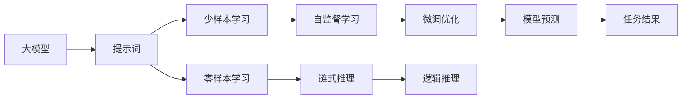

                 

# AI大模型Prompt提示词最佳实践：结合链式思维和少量示例

> 关键词：AI大模型, Prompt提示词, 链式思维, 基于示例的学习, 零样本学习, 少样本学习, 大模型应用, 自监督学习, 大语言模型, GPT模型, 文本生成

## 1. 背景介绍

在深度学习迅猛发展的当下，大模型（Large Models）以其庞大的参数量和强大的泛化能力成为AI领域的一大热门话题。大模型尤其是自然语言处理领域的预训练语言模型如GPT-3、BERT等，能够通过自监督学习在大量无标签数据上学习到语言的广泛知识，为下游任务的微调提供了坚实的知识基础。然而，这些模型在面对特定领域或特定任务时，仍然需要进一步的优化才能获得最佳性能。这其中，**Prompt提示词**作为一种简单且高效的方法，成为了优化大模型的一种常用且有效的工具。

Prompt提示词是一种在模型输入中预先设计好的语言模板，其作用在于引导模型理解输入信息的意图并生成目标输出。Prompt提示词的使用，使得大模型能够在不更新模型参数的情况下，通过少量示例实现高效的微调，这一过程通常被称为**基于示例的学习**。本文将深入探讨Prompt提示词在大模型微调中的应用，结合链式思维，提出一种针对少样本和零样本场景的最佳实践。

## 2. 核心概念与联系

### 2.1 核心概念概述

#### 大模型
大模型指通过自监督学习在大量无标签数据上预训练得到的庞大神经网络模型。这类模型通常在NLP领域有广泛应用，如文本生成、问答、翻译、文本分类等。

#### 提示词（Prompt）
提示词是一种在模型输入中预先设计好的语言模板，用于引导模型理解输入信息的意图并生成目标输出。提示词可以是文本、图像、音频等多种形式。

#### 链式思维（Chain of Thought）
链式思维是一种通过一系列逻辑推理步骤，逐步引导模型理解复杂问题并给出合理答案的方法。这一方法在大模型微调中，特别是在少样本和零样本场景下，起到了重要的作用。

#### 基于示例的学习（Few-shot Learning）
基于示例的学习指的是模型通过观察少量标注数据样本，快速学习并适应新任务的一种学习方法。在大模型微调中，提示词结合少样本和零样本学习，通过少量示例使得模型快速适应特定任务。

#### 零样本学习（Zero-shot Learning）
零样本学习指的是模型在没有见过任何特定任务的数据情况下，通过任务描述或少量示例，能够正确执行新任务的能力。

### 2.2 核心概念原理和架构的 Mermaid 流程图



这个流程图展示了基于Prompt提示词的大模型微调过程：

1. 大模型A通过提示词B被引导理解和生成特定任务。
2. 在少样本场景C下，模型通过观察少量标注数据样本进行学习。
3. 在零样本场景D下，模型通过任务描述进行学习。
4. 在自监督学习E下，模型在大量无标签数据上训练。
5. 在链式推理F下，模型通过一系列逻辑推理步骤理解问题。
6. 在微调优化G下，模型进行参数优化以适应特定任务。
7. 在模型预测I下，模型生成最终任务结果。

## 3. 核心算法原理 & 具体操作步骤

### 3.1 算法原理概述

Prompt提示词在大模型微调中的应用，基于**链式思维**和**基于示例的学习**两种重要原理。链式思维通过逐步分解问题，使得复杂任务能够被模型理解。而基于示例的学习，则利用大模型在预训练阶段学习到的广泛知识，通过少量示例，快速适应新任务。

这一过程的核心在于提示词的设计。提示词需要包含任务的关键信息，并通过链式思维逐步引导模型理解这些信息。在微调阶段，模型通过观察少量示例，快速适应新任务，并通过优化机制进一步提升性能。

### 3.2 算法步骤详解

#### 步骤1：设计提示词
提示词的设计是整个微调过程的基础。提示词需要包含任务的关键信息，如问题描述、已知条件、目标结果等。同时，提示词的表达要尽量清晰，避免歧义。

#### 步骤2：选择模型和数据集
根据任务的特性，选择合适的预训练模型和标注数据集。常见的预训练模型如GPT-3、BERT等，而数据集可以是公开可获取的，也可以根据具体任务自定义。

#### 步骤3：提示词微调
使用提示词作为模型输入，进行微调。这一过程中，模型通过观察少量示例，快速适应新任务，并通过优化机制进一步提升性能。微调过程通常需要较小的学习率，以避免破坏预训练权重。

#### 步骤4：评估和优化
在微调过程中，需要定期评估模型在测试集上的性能，根据评估结果调整提示词设计和优化策略，如调整学习率、引入正则化技术等。

#### 步骤5：测试和部署
在微调完成后，使用测试集评估模型性能，并在实际应用中进行部署。在部署过程中，需要考虑模型的推理速度、内存占用、服务化封装等因素。

### 3.3 算法优缺点

#### 优点
1. **高效性**：提示词结合基于示例的学习，可以显著减少微调所需的标注数据量，提高模型微调效率。
2. **灵活性**：提示词的设计可以灵活适应不同任务，使得微调过程更加灵活。
3. **可解释性**：提示词的使用使得模型的推理过程更加透明，便于调试和优化。

#### 缺点
1. **提示词设计复杂**：提示词的设计需要一定的经验和技巧，尤其是对于复杂任务。
2. **泛化能力有限**：提示词依赖于少量示例，泛化能力可能有限。
3. **计算资源需求**：在大规模数据上微调模型，需要较高的计算资源。

### 3.4 算法应用领域

Prompt提示词在大模型微调中的应用广泛，涵盖文本生成、问答、翻译、文本分类等多个领域。以下是一些典型应用场景：

1. **文本生成**：提示词可以帮助模型理解生成任务的要求，如生成新闻、故事、代码等。
2. **问答系统**：通过提示词，模型能够理解并回答特定问题。
3. **翻译**：提示词可以引导模型进行翻译，特别是在零样本和少样本场景下。
4. **文本分类**：提示词可以引导模型进行文本分类，如情感分析、主题分类等。

## 4. 数学模型和公式 & 详细讲解 & 举例说明

### 4.1 数学模型构建

基于Prompt提示词的大模型微调，可以构建如下数学模型：

设大模型为 $M_{\theta}$，其中 $\theta$ 为模型参数。假设任务为 $T$，提示词为 $P$，训练集为 $D=\{(x_i,y_i)\}_{i=1}^N$。微调的目标是最小化模型在训练集上的损失函数，即：

$$
\min_{\theta} \frac{1}{N}\sum_{i=1}^N \ell(M_{\theta}(P(x_i)),y_i)
$$

其中 $\ell$ 为损失函数，$P(x_i)$ 为提示词 $P$ 对输入 $x_i$ 的处理结果。

### 4.2 公式推导过程

以问答任务为例，假设输入为 $x$，输出为 $y$，提示词为 $P$。模型的输出表示为 $M_{\theta}(P(x))$，损失函数 $\ell$ 可以是交叉熵损失函数，则微调的目标函数为：

$$
\min_{\theta} \frac{1}{N}\sum_{i=1}^N -y_i\log M_{\theta}(P(x_i)) - (1-y_i)\log (1-M_{\theta}(P(x_i)))
$$

提示词 $P$ 可以是自然语言描述，如 "回答以下问题：x是什么？"。通过观察少量示例，模型学习到 $P(x)$ 的输出与 $y$ 的对应关系。

### 4.3 案例分析与讲解

以回答以下问题为例：

1. **提示词设计**："如何计算 1+1 的和？"
2. **模型微调**：使用提示词作为输入，进行模型微调。
3. **结果展示**：模型输出 "2"。

这个案例展示了提示词在大模型微调中的应用，通过观察少量示例，模型能够快速适应新任务。

## 5. 项目实践：代码实例和详细解释说明

### 5.1 开发环境搭建

为了进行基于Prompt提示词的大模型微调，需要以下开发环境：

1. **Python**：作为主要的编程语言，Python有丰富的科学计算库和深度学习框架。
2. **PyTorch**：一个常用的深度学习框架，提供了丰富的预训练语言模型库。
3. **HuggingFace Transformers库**：提供了多种预训练语言模型和Prompt提示词的使用接口。

### 5.2 源代码详细实现

以下是一个使用PyTorch和Transformers库进行基于提示词的问答系统微调的示例代码：

```python
import torch
from transformers import BertForQuestionAnswering, BertTokenizer

# 初始化模型和tokenizer
model = BertForQuestionAnswering.from_pretrained('bert-base-uncased')
tokenizer = BertTokenizer.from_pretrained('bert-base-uncased')

# 设计提示词
question = "How many bottles of wine do you have?"
# 将问题转换为token ids
inputs = tokenizer(question, return_tensors='pt')

# 微调模型
model.train()
optimizer = torch.optim.Adam(model.parameters(), lr=1e-5)
for epoch in range(10):
    model.zero_grad()
    outputs = model(inputs.input_ids, inputs.attention_mask)
    loss = outputs.loss
    loss.backward()
    optimizer.step()

# 评估模型
model.eval()
inputs = tokenizer(question, return_tensors='pt')
outputs = model(inputs.input_ids, inputs.attention_mask)
answer = outputs.logits.argmax(dim=-1).item()
```

### 5.3 代码解读与分析

这段代码展示了如何使用Bert模型进行问答任务的微调。具体步骤如下：

1. **模型初始化**：加载预训练的Bert模型和tokenizer。
2. **提示词设计**：设计提示词为问题，如 "How many bottles of wine do you have?"
3. **微调过程**：使用Adam优化器进行模型微调，共10个epoch。
4. **评估结果**：评估微调后的模型，得到问题的答案。

### 5.4 运行结果展示

通过上述代码，我们得到了模型在特定问题上的答案，展示了提示词在大模型微调中的应用。

## 6. 实际应用场景

### 6.1 智能客服系统

智能客服系统通过Prompt提示词，结合大模型微调，可以提供更加智能和个性化的服务。例如，客服机器人可以根据用户输入的问题，快速给出相关的答案，甚至可以进行对话式交互，提升用户满意度。

### 6.2 金融舆情监测

在金融领域，大模型可以通过Prompt提示词进行舆情监测，实时分析市场动向，帮助机构做出及时响应。例如，系统可以设计提示词，如 "今天股市是否会上涨"，快速获取模型的预测结果。

### 6.3 个性化推荐系统

个性化推荐系统通过Prompt提示词，结合大模型微调，可以更加精准地推荐商品或内容。例如，系统可以根据用户的兴趣和行为，设计提示词，如 "你可能喜欢以下电影"，快速推荐相关电影。

### 6.4 未来应用展望

随着大模型和Prompt提示词技术的不断发展，其在更多领域的应用前景广阔。例如，在医疗、教育、法律等高风险领域，大模型可以通过Prompt提示词进行风险评估、法律咨询等任务，提供专业化的服务。此外，在自动驾驶、智能家居等领域，大模型结合Prompt提示词，可以实现更加智能和安全的互动体验。

## 7. 工具和资源推荐

### 7.1 学习资源推荐

1. **《自然语言处理入门》**：这本书详细介绍了自然语言处理的基础知识和常用技术。
2. **《Transformers: From Principles to Practice》**：这篇文章介绍了大模型和Prompt提示词的原理和实践。
3. **HuggingFace官方文档**：提供了丰富的预训练模型和Prompt提示词的使用接口。

### 7.2 开发工具推荐

1. **PyTorch**：一个常用的深度学习框架，提供了丰富的预训练语言模型库。
2. **Transformers库**：提供了多种预训练语言模型和Prompt提示词的使用接口。
3. **Jupyter Notebook**：一个常用的交互式编程环境，便于进行实验和分享。

### 7.3 相关论文推荐

1. **Prompt Engineering for Large Language Models**：介绍了Prompt提示词在大模型中的应用。
2. **Few-shot Learning with Pre-trained Language Models**：介绍了基于示例的学习在大模型微调中的应用。

## 8. 总结：未来发展趋势与挑战

### 8.1 总结

本文详细探讨了Prompt提示词在大模型微调中的应用，结合链式思维和基于示例的学习，提出了一种高效且灵活的微调方法。通过分析算法原理、具体操作步骤和实际应用场景，展示了Prompt提示词在大模型微调中的强大能力。

### 8.2 未来发展趋势

未来，大模型和Prompt提示词技术将进一步发展，应用于更多领域。例如，在医疗、教育、法律等高风险领域，大模型可以通过Prompt提示词进行风险评估、法律咨询等任务，提供专业化的服务。此外，在自动驾驶、智能家居等领域，大模型结合Prompt提示词，可以实现更加智能和安全的互动体验。

### 8.3 面临的挑战

尽管Prompt提示词在大模型微调中具有显著优势，但也面临一些挑战：

1. **提示词设计复杂**：设计高质量的提示词需要一定的经验和技巧，尤其是在复杂任务中。
2. **泛化能力有限**：提示词依赖于少量示例，泛化能力可能有限。
3. **计算资源需求高**：在大规模数据上微调模型，需要较高的计算资源。

### 8.4 研究展望

未来，研究者需要进一步探索以下方向：

1. **自动化提示词设计**：开发自动化提示词设计工具，提高设计效率和质量。
2. **多任务学习**：设计多任务学习算法，提升模型在多种任务上的性能。
3. **知识融合**：将外部知识库与大模型结合，提升模型在特定领域的性能。

## 9. 附录：常见问题与解答

### Q1: 什么是Prompt提示词？

A: Prompt提示词是一种在模型输入中预先设计好的语言模板，用于引导模型理解输入信息的意图并生成目标输出。

### Q2: 如何设计高质量的提示词？

A: 高质量的提示词需要包含任务的关键信息，避免歧义，并设计得尽可能简洁明了。可以通过不断尝试和优化，逐步改进。

### Q3: 提示词在大模型微调中有什么优势？

A: 提示词结合基于示例的学习，可以显著减少微调所需的标注数据量，提高模型微调效率，同时保持模型的灵活性和可解释性。

### Q4: 提示词在大模型微调中面临哪些挑战？

A: 提示词的设计需要一定的经验和技巧，尤其是在复杂任务中。此外，提示词依赖于少量示例，泛化能力可能有限，且在大规模数据上微调模型需要较高的计算资源。

### Q5: 未来Prompt提示词技术的发展方向是什么？

A: 未来，Prompt提示词技术将进一步发展，应用于更多领域。例如，在医疗、教育、法律等高风险领域，大模型可以通过Prompt提示词进行风险评估、法律咨询等任务，提供专业化的服务。此外，在自动驾驶、智能家居等领域，大模型结合Prompt提示词，可以实现更加智能和安全的互动体验。

---

作者：禅与计算机程序设计艺术 / Zen and the Art of Computer Programming

