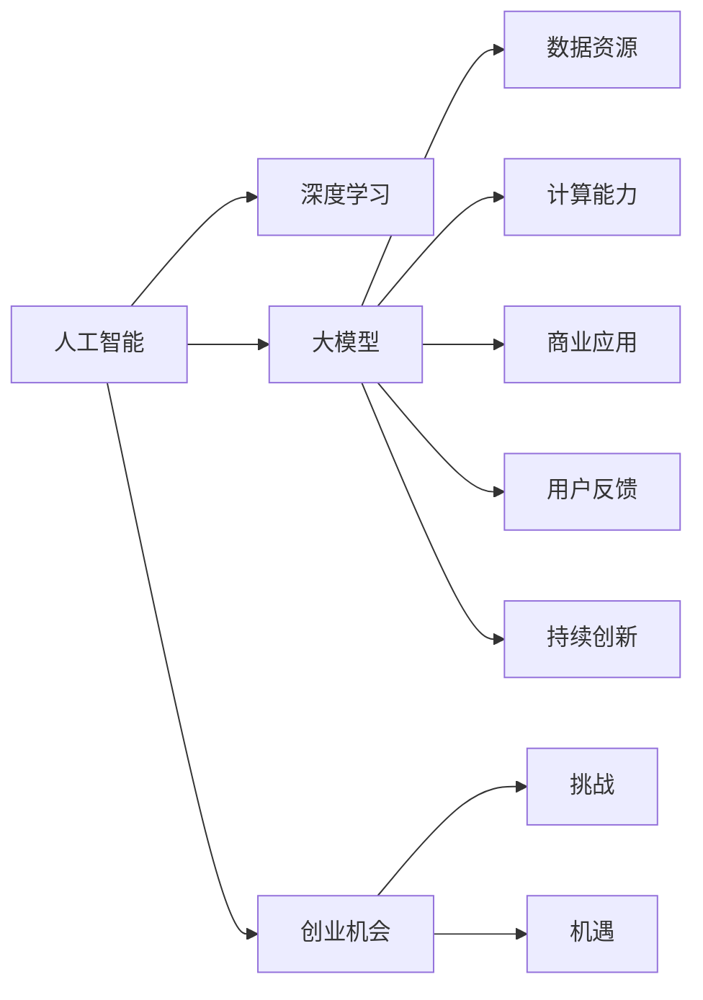

                 

# AI大模型创业战：挑战与机遇并存的思考探讨

> 关键词：人工智能, 大模型创业, 深度学习, 创业机会, 挑战与机遇

## 1. 背景介绍

### 1.1 问题由来
在人工智能（AI）领域，尤其是在深度学习时代，大模型逐渐成为主流趋势。随着GPT-3等大模型的问世，AI领域进入了一个新的里程碑阶段。与此同时，深度学习的普及也孕育了大量AI初创企业。这些企业在人工智能的前沿技术上竞争激烈，既面临技术创新的挑战，也迎来巨大的市场机遇。

### 1.2 问题核心关键点
大模型创业成功的关键在于以下几个方面：
1. **技术壁垒**：大模型需要深厚的技术储备，包括计算机视觉、自然语言处理、机器学习等。
2. **数据资源**：高质量的数据集是训练和验证大模型的基础，数据获取和标注成本高。
3. **计算能力**：大模型训练需要强大的计算资源，包括高性能计算硬件和算法优化。
4. **商业应用**：如何将大模型的技术和应用推向市场，实现商业化是关键。
5. **用户反馈**：收集用户反馈，不断优化产品，提升用户体验。
6. **持续创新**：紧跟技术发展，不断推出新产品和新功能，保持竞争力。

## 2. 核心概念与联系

### 2.1 核心概念概述

在探讨大模型创业时，首先需要理解几个核心概念：

- **人工智能（AI）**：利用计算机科学和数学模型，模拟人类的认知和行为能力。
- **深度学习**：一种基于神经网络的机器学习方法，通过多层非线性变换，实现特征提取和模式识别。
- **大模型**：指具有数十亿甚至数百亿参数的神经网络模型，如GPT-3、BERT等。
- **创业机会**：在大模型应用领域的市场空白和未被满足的需求，为创业公司提供了广阔的空间。
- **挑战与机遇**：在大模型创业中，既要克服技术、数据、计算等挑战，也要抓住市场和应用领域的机遇。

### 2.2 核心概念原理和架构的 Mermaid 流程图(Mermaid 流程节点中不要有括号、逗号等特殊字符)



这个流程图展示了AI、深度学习、大模型和创业机会之间的联系，以及它们如何相互作用和影响。

## 3. 核心算法原理 & 具体操作步骤

### 3.1 算法原理概述

大模型创业的核心算法原理主要围绕以下两点展开：

1. **算法创新**：研发能够提升模型性能和降低计算成本的新算法。例如，采用注意力机制、残差连接、自适应学习率等。
2. **数据增强**：通过数据扩充、数据清洗等技术，提升数据质量和多样性，优化模型训练效果。

### 3.2 算法步骤详解

大模型创业的算法步骤通常包括：

1. **数据获取与预处理**：收集和清洗数据，进行数据增强，确保数据的质量和多样性。
2. **模型选择与训练**：选择合适的深度学习模型架构，如卷积神经网络（CNN）、循环神经网络（RNN）、Transformer等，进行模型训练和优化。
3. **模型部署与优化**：将训练好的模型部署到生产环境，进行性能调优和持续改进。
4. **应用开发与集成**：将大模型嵌入到具体应用场景中，如图像识别、自然语言处理、智能推荐等。
5. **用户反馈与迭代**：收集用户反馈，进行模型迭代和优化，提升用户体验。

### 3.3 算法优缺点

大模型创业算法的优缺点如下：

**优点**：
1. **模型性能**：大模型具有强大的特征提取能力，能够处理复杂的模式识别任务。
2. **应用广泛**：广泛应用于图像识别、语音识别、自然语言处理等领域。
3. **商业潜力**：大模型在应用中的表现往往能够创造显著的经济价值。

**缺点**：
1. **计算成本高**：训练大模型需要大量的计算资源和存储资源。
2. **数据依赖性强**：高质量的数据集是模型训练的基础，数据获取和标注成本高。
3. **技术门槛高**：需要深入理解和掌握深度学习算法和模型架构。
4. **竞争激烈**：大模型领域竞争激烈，需要持续创新以保持竞争力。

### 3.4 算法应用领域

大模型创业算法的应用领域包括：

- **计算机视觉**：如图像识别、目标检测、图像生成等。
- **自然语言处理**：如机器翻译、文本生成、语音识别等。
- **智能推荐**：如个性化推荐、广告推荐等。
- **智能安防**：如人脸识别、行为识别等。
- **医疗健康**：如医学影像分析、疾病预测等。

## 4. 数学模型和公式 & 详细讲解 & 举例说明

### 4.1 数学模型构建

大模型创业的数学模型通常基于以下原理：

- **神经网络模型**：由多个神经元层堆叠组成，每个层包含多个神经元，通过前向传播和反向传播实现特征提取和误差修正。
- **损失函数**：用于衡量模型预测值与实际值之间的差异，如均方误差、交叉熵等。
- **优化算法**：如随机梯度下降（SGD）、Adam、Adagrad等，用于更新模型参数以最小化损失函数。

### 4.2 公式推导过程

以神经网络模型的前向传播和反向传播为例，其公式推导如下：

设神经网络模型由多个隐藏层和输出层组成，其中第$l$层有$n_l$个神经元，输入为$x$，输出为$a^{[l]}$，权重为$W^{[l]}$，偏置为$b^{[l]}$，激活函数为$f$。

前向传播：
$$
a^{[l]} = f(\sum_{i=1}^{n_{l-1}} W^{[l]}_i x_i + b^{[l]})
$$

反向传播：
$$
\frac{\partial C}{\partial W^{[l]}} = \frac{\partial C}{\partial z^{[l]}} \frac{\partial z^{[l]}}{\partial a^{[l]}} \frac{\partial a^{[l]}}{\partial z^{[l]}} \frac{\partial z^{[l-1]}}{\partial a^{[l-1]}} \cdots \frac{\partial z^{[1]}}{\partial a^{[1]}} \frac{\partial C}{\partial x}
$$

其中$C$为损失函数，$z^{[l]}$为第$l$层的输入，$a^{[l]}$为第$l$层的输出。

### 4.3 案例分析与讲解

以图像识别为例，大模型的前向传播和反向传播过程如下：

1. 输入图像$x$通过卷积层和池化层，得到特征图$z^{[1]}$。
2. 将特征图$z^{[1]}$输入到多个卷积层和池化层，逐步提取特征。
3. 最后通过全连接层输出图像分类结果。

反向传播时，通过计算损失函数$C$对输出结果的梯度，逐层反向传播到卷积层和池化层的权重$W^{[l]}$和偏置$b^{[l]}$，进行参数更新。

## 5. 项目实践：代码实例和详细解释说明

### 5.1 开发环境搭建

在Python环境下，需要安装深度学习框架，如TensorFlow、PyTorch等，以及相关的数据处理和模型训练库。

```bash
pip install tensorflow==2.3.0
pip install torch==1.8.1
pip install scikit-image
```

### 5.2 源代码详细实现

以图像识别为例，实现过程如下：

```python
import tensorflow as tf
from tensorflow.keras import layers
from scikit_image import datasets

# 加载数据集
data = datasets.load_digits()
x_train, y_train = data.data, data.target

# 定义模型
model = tf.keras.Sequential([
    layers.Flatten(input_shape=(8, 8)),
    layers.Dense(128, activation='relu'),
    layers.Dense(10, activation='softmax')
])

# 编译模型
model.compile(optimizer='adam', loss='sparse_categorical_crossentropy', metrics=['accuracy'])

# 训练模型
model.fit(x_train, y_train, epochs=10)

# 评估模型
model.evaluate(x_test, y_test)
```

### 5.3 代码解读与分析

- **数据加载**：使用`scikit_image`库加载手写数字数据集。
- **模型定义**：使用`Sequential`模型定义多层神经网络结构，包括一个扁平层、一个全连接层和一个输出层。
- **模型编译**：设置优化器、损失函数和评价指标。
- **模型训练**：使用`fit`方法进行模型训练，设置训练轮数。
- **模型评估**：使用`evaluate`方法评估模型性能。

## 6. 实际应用场景

### 6.1 计算机视觉

在计算机视觉领域，大模型可以应用于图像识别、目标检测、图像生成等任务。例如，使用大模型训练的模型可以在医疗影像中检测出肿瘤等关键区域。

### 6.2 自然语言处理

在自然语言处理领域，大模型可以应用于机器翻译、文本生成、语音识别等任务。例如，使用大模型训练的模型可以翻译不同语言的文档，生成自然流畅的文本。

### 6.3 智能推荐

在智能推荐领域，大模型可以应用于个性化推荐、广告推荐等任务。例如，使用大模型训练的模型可以根据用户的历史行为数据，推荐其可能感兴趣的商品。

### 6.4 未来应用展望

未来，大模型将广泛应用于更多领域，例如：

- **医疗健康**：如医学影像分析、疾病预测等。
- **智能安防**：如人脸识别、行为识别等。
- **智慧城市**：如智能交通、智能监控等。
- **自动驾驶**：如车辆行为识别、路况预测等。

## 7. 工具和资源推荐

### 7.1 学习资源推荐

1. **Coursera《Deep Learning》课程**：由Andrew Ng教授讲授，涵盖深度学习的基本概念和算法。
2. **Stanford CS231n《Convolutional Neural Networks for Visual Recognition》课程**：涵盖计算机视觉中的深度学习算法和模型。
3. **《Hands-On Machine Learning with Scikit-Learn, Keras, and TensorFlow》书籍**：介绍使用Scikit-Learn、Keras和TensorFlow进行机器学习和深度学习开发的实践。
4. **Kaggle数据竞赛**：参与Kaggle数据竞赛，实战练习深度学习算法和模型。

### 7.2 开发工具推荐

1. **TensorFlow**：由Google开发，支持分布式计算和GPU加速。
2. **PyTorch**：由Facebook开发，支持动态图和GPU加速。
3. **Scikit-Learn**：支持数据预处理、模型训练和评估等。
4. **Keras**：提供高层API，简化深度学习模型的构建。

### 7.3 相关论文推荐

1. **《ImageNet Classification with Deep Convolutional Neural Networks》**：提出使用卷积神经网络（CNN）进行图像分类。
2. **《Attention is All You Need》**：提出Transformer模型，用于自然语言处理任务。
3. **《BERT: Pre-training of Deep Bidirectional Transformers for Language Understanding》**：提出BERT模型，用于语言理解任务。

## 8. 总结：未来发展趋势与挑战

### 8.1 研究成果总结

大模型创业在技术上已经取得了显著进展，但依然存在许多挑战。

### 8.2 未来发展趋势

未来，大模型创业将呈现以下几个趋势：

1. **模型规模扩大**：随着算力成本下降，大模型规模将进一步扩大，提升模型性能。
2. **算法优化**：新的算法和技术将不断涌现，提升模型的训练和推理效率。
3. **应用拓展**：大模型将应用于更多领域，提升各行各业的效率和智能化水平。
4. **商业落地**：更多大模型将成功商业化，形成新的商业模式和市场机会。

### 8.3 面临的挑战

大模型创业面临的挑战包括：

1. **数据获取**：高质量数据的获取和标注成本高，影响模型训练效果。
2. **计算资源**：大模型训练和推理需要大量计算资源，成本高。
3. **技术复杂性**：深度学习算法和技术复杂，需要持续学习和创新。
4. **模型解释性**：大模型往往是“黑盒”系统，难以解释其决策过程。
5. **市场竞争**：大模型领域竞争激烈，需要持续创新以保持竞争力。

### 8.4 研究展望

未来，大模型创业需要在以下几个方面进行研究：

1. **数据生成技术**：研发更高效的数据生成技术，减少对标注数据的依赖。
2. **模型压缩技术**：研发模型压缩技术，提升模型的推理速度和计算效率。
3. **可解释性技术**：研发模型解释技术，提升模型的透明度和可信度。
4. **跨领域应用**：研发跨领域应用技术，提升大模型的泛化能力。
5. **伦理与安全**：研发伦理与安全技术，确保模型应用的安全性和公平性。

## 9. 附录：常见问题与解答

### Q1: 大模型创业的挑战是什么？

**A1:** 大模型创业的主要挑战包括数据获取和标注成本高、计算资源需求大、技术复杂性和市场竞争激烈等。

### Q2: 大模型创业的机会在哪里？

**A2:** 大模型创业的机会在于新算法、新技术的不断涌现，以及市场对智能化、自动化需求的提升。

### Q3: 大模型创业如何进行有效的商业落地？

**A3:** 大模型创业需要寻找合适的应用场景，进行模型优化和参数调整，同时注重用户体验和反馈，进行持续迭代和优化。

### Q4: 如何提高大模型的计算效率？

**A4:** 提高大模型的计算效率可以从模型压缩、模型并行、硬件加速等方面入手，降低计算资源需求，提升推理速度。

### Q5: 大模型创业的未来发展趋势是什么？

**A5:** 未来大模型创业将呈现模型规模扩大、算法优化、应用拓展、商业落地等趋势，但也面临数据获取、计算资源、技术复杂性等挑战。

