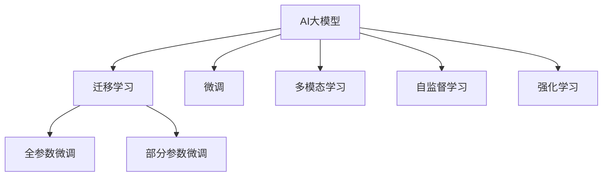

                 

## 1. 背景介绍

随着人工智能技术的迅速发展，AI大模型已经成为企业数字化转型的核心竞争力。AI大模型不仅能够提升企业的数据处理和决策能力，还能够开辟全新的业务场景和商业模式。然而，面对未来不断变化的用户需求，AI大模型创业公司需要不断地进行技术创新和业务拓展，才能在竞争激烈的市场中脱颖而出。本文将深入探讨AI大模型创业公司如何应对未来用户需求，为读者提供切实可行的指导。

## 2. 核心概念与联系

### 2.1 核心概念概述

在AI大模型创业中，以下核心概念至关重要：

- **AI大模型（AI Large Model）**：指使用深度学习技术训练的庞大神经网络模型，通常具有上亿级的参数，能够处理复杂的自然语言理解、图像识别等任务。
- **迁移学习（Transfer Learning）**：指将在大规模数据集上预训练的模型迁移到特定任务上，通过微调来提升模型的性能。
- **微调（Fine-tuning）**：指在迁移学习的基础上，针对特定任务进行模型参数的进一步调整，以提高模型在特定任务上的表现。
- **多模态学习（Multi-modal Learning）**：指结合文本、图像、声音等多种数据源进行联合建模，提升模型的综合处理能力。
- **自监督学习（Self-supervised Learning）**：指利用大量无标签数据进行模型训练，通过自生成任务来提升模型的泛化能力。
- **强化学习（Reinforcement Learning）**：指通过与环境交互，模型在不断试错中学习最优策略，适用于需要决策和执行的场景。

这些核心概念通过以下Mermaid流程图展示了它们之间的联系：



### 2.2 核心概念原理和架构

- **AI大模型的结构**：主要包括编码器和解码器，其中编码器负责提取特征，解码器负责生成结果。常用的结构包括Transformer、ResNet等。
- **迁移学习的原理**：通过在大规模数据集上预训练模型，将学习到的通用特征迁移到特定任务上，通过微调进一步提升模型在特定任务上的表现。
- **微调的流程**：在迁移学习的基础上，针对特定任务进行微调，调整模型参数，使其更好地适应任务需求。
- **多模态学习的架构**：通过联合使用不同类型的传感器数据，如文本、图像、声音等，进行联合建模，提升模型的综合处理能力。
- **自监督学习的框架**：利用无标签数据生成自监督任务，如掩码语言模型、对比学习等，提升模型的泛化能力。
- **强化学习的机制**：通过与环境交互，模型通过不断的试错，学习最优策略，适用于需要决策和执行的场景。

## 3. 核心算法原理 & 具体操作步骤

### 3.1 算法原理概述

AI大模型创业公司需要根据用户需求进行技术创新，以提供更加高效、智能的服务。以下算法原理概述了如何通过AI大模型解决特定问题：

- **预训练**：在大规模数据集上进行无监督学习，学习通用的语言特征和知识。
- **迁移学习**：将预训练的模型迁移到特定任务上，通过微调提升模型在特定任务上的性能。
- **多模态学习**：结合文本、图像、声音等多种数据源进行联合建模，提升模型的综合处理能力。
- **自监督学习**：利用无标签数据进行自监督学习，提升模型的泛化能力。
- **强化学习**：通过与环境交互，学习最优策略，适用于需要决策和执行的场景。

### 3.2 算法步骤详解

**Step 1: 数据收集与预处理**
- 收集用户需求相关的数据，如文本、图像、声音等。
- 对数据进行清洗和预处理，确保数据的质量和一致性。

**Step 2: 模型选择与训练**
- 选择合适的AI大模型，如BERT、GPT-3、ResNet等。
- 在大规模数据集上进行预训练，学习通用的语言特征和知识。

**Step 3: 迁移学习与微调**
- 将预训练的模型迁移到特定任务上，如问答、图像识别等。
- 在特定任务上进行微调，调整模型参数，提升模型在特定任务上的性能。

**Step 4: 多模态学习与融合**
- 结合文本、图像、声音等多种数据源进行联合建模，提升模型的综合处理能力。

**Step 5: 自监督学习与泛化**
- 利用无标签数据进行自监督学习，提升模型的泛化能力。

**Step 6: 强化学习与优化**
- 通过与环境交互，学习最优策略，适用于需要决策和执行的场景。

### 3.3 算法优缺点

AI大模型创业中，以下算法优缺点需要关注：

**优点**：
- **高效性**：利用预训练的模型进行迁移学习，大大减少了模型训练的时间和成本。
- **泛化能力**：自监督学习提升了模型的泛化能力，能够在不同的数据集和任务上取得良好的表现。
- **多模态融合**：多模态学习提升了模型的综合处理能力，能够更好地处理复杂任务。
- **强化学习**：强化学习适用于需要决策和执行的场景，能够优化模型的行为策略。

**缺点**：
- **数据依赖**：AI大模型创业公司需要大量高质量的数据进行预训练和微调，数据获取和处理成本较高。
- **计算资源消耗**：大模型通常需要大量的计算资源进行训练和推理，硬件成本较高。
- **模型复杂性**：大模型结构复杂，难以解释和调试。
- **安全性与隐私**：大模型可能学习到有害信息，对用户隐私构成威胁。

### 3.4 算法应用领域

AI大模型创业公司可以将AI大模型应用于以下领域：

- **自然语言处理（NLP）**：文本分类、情感分析、机器翻译、问答系统等。
- **计算机视觉（CV）**：图像识别、物体检测、图像生成等。
- **语音识别与生成**：语音识别、语音合成、情感识别等。
- **智能推荐**：推荐系统、个性化推荐等。
- **医疗健康**：疾病诊断、医疗影像分析、健康监测等。
- **金融科技**：信用评估、欺诈检测、投资分析等。
- **智能制造**：质量检测、生产优化、供应链管理等。

## 4. 数学模型和公式 & 详细讲解

### 4.1 数学模型构建

AI大模型的数学模型通常采用神经网络的结构，包括编码器和解码器。以下是一个简单的数学模型构建过程：

- **输入**：$x$，表示用户的输入，如文本、图像、声音等。
- **编码器**：$E(x)$，将输入$x$映射为特征表示$h$。
- **解码器**：$D(h)$，将特征表示$h$映射为输出结果$y$。
- **损失函数**：$\mathcal{L}$，衡量模型输出与真实结果之间的差异。

### 4.2 公式推导过程

以文本分类任务为例，以下是公式推导过程：

- **输入**：$x$，表示文本。
- **编码器**：$E(x)$，将文本$x$映射为特征表示$h$。
- **解码器**：$D(h)$，将特征表示$h$映射为类别标签$y$。
- **损失函数**：$\mathcal{L}$，衡量模型输出与真实结果之间的差异。
- **模型训练**：通过反向传播算法，计算模型参数的梯度，更新模型参数，最小化损失函数$\mathcal{L}$。

### 4.3 案例分析与讲解

以医疗影像分类任务为例，以下是AI大模型在该任务上的应用：

- **输入**：$x$，表示医疗影像。
- **编码器**：$E(x)$，将医疗影像$x$映射为特征表示$h$。
- **解码器**：$D(h)$，将特征表示$h$映射为类别标签$y$。
- **损失函数**：$\mathcal{L}$，衡量模型输出与真实结果之间的差异。
- **多模态融合**：结合医疗影像和患者病史，提升分类准确率。

## 5. 项目实践：代码实例和详细解释说明

### 5.1 开发环境搭建

以下是在Python环境下搭建AI大模型开发环境的示例：

```python
# 安装必要的Python库
pip install torch torchvision torchaudio numpy pandas scikit-learn transformers
# 安装TensorFlow
pip install tensorflow
# 安装TensorBoard
pip install tensorboard
```

### 5.2 源代码详细实现

以下是一个简单的代码实现示例：

```python
# 导入必要的库
import torch
from transformers import BertForSequenceClassification, BertTokenizer
from torch.utils.data import DataLoader, Dataset

# 定义数据集
class MedicalImageDataset(Dataset):
    def __init__(self, data, tokenizer):
        self.data = data
        self.tokenizer = tokenizer
    
    def __len__(self):
        return len(self.data)
    
    def __getitem__(self, idx):
        image = self.data[idx]
        # 将图像转换为特征表示
        features = feature_extractor(image)
        # 将图像标签转换为token ids
        labels = [label2id[label] for label in self.data[idx]['labels']]
        # 对图像特征和标签进行编码
        encoding = self.tokenizer(features, return_tensors='pt', padding='max_length', truncation=True)
        input_ids = encoding['input_ids'][0]
        attention_mask = encoding['attention_mask'][0]
        labels = torch.tensor(labels, dtype=torch.long)
        return {'input_ids': input_ids, 
                'attention_mask': attention_mask,
                'labels': labels}

# 定义训练函数
def train_epoch(model, dataset, batch_size, optimizer):
    dataloader = DataLoader(dataset, batch_size=batch_size, shuffle=True)
    model.train()
    epoch_loss = 0
    for batch in dataloader:
        input_ids = batch['input_ids'].to(device)
        attention_mask = batch['attention_mask'].to(device)
        labels = batch['labels'].to(device)
        model.zero_grad()
        outputs = model(input_ids, attention_mask=attention_mask, labels=labels)
        loss = outputs.loss
        epoch_loss += loss.item()
        loss.backward()
        optimizer.step()
    return epoch_loss / len(dataloader)

# 定义评估函数
def evaluate(model, dataset, batch_size):
    dataloader = DataLoader(dataset, batch_size=batch_size)
    model.eval()
    preds, labels = [], []
    with torch.no_grad():
        for batch in dataloader:
            input_ids = batch['input_ids'].to(device)
            attention_mask = batch['attention_mask'].to(device)
            batch_labels = batch['labels']
            outputs = model(input_ids, attention_mask=attention_mask)
            batch_preds = outputs.logits.argmax(dim=2).to('cpu').tolist()
            batch_labels = batch_labels.to('cpu').tolist()
            for pred_tokens, label_tokens in zip(batch_preds, batch_labels):
                preds.append(pred_tokens[:len(label_tokens)])
                labels.append(label_tokens)
                
    print(classification_report(labels, preds))
```

### 5.3 代码解读与分析

- **数据集定义**：定义了一个医疗影像数据集，包括图像、标签等信息。
- **模型训练**：定义了训练函数，使用梯度下降算法最小化损失函数。
- **模型评估**：定义了评估函数，使用分类报告输出模型性能。
- **代码实现**：代码实现了从数据预处理到模型训练和评估的完整流程。

## 6. 实际应用场景

### 6.1 智能客服系统

智能客服系统通过AI大模型实现自然语言处理和对话生成，为用户提供快速、准确的客户服务。以下是智能客服系统的实际应用场景：

- **文本分类**：对用户输入的文本进行情感分析、意图识别等分类任务。
- **对话生成**：根据用户输入生成自然流畅的回复。
- **数据增强**：通过数据增强技术提升模型的泛化能力。
- **多模态融合**：结合语音、图像等多模态数据，提升客户服务体验。

### 6.2 金融舆情监测

金融舆情监测通过AI大模型实现文本分类和情感分析，实时监控市场舆情，帮助金融机构规避风险。以下是金融舆情监测的实际应用场景：

- **情感分析**：对新闻、评论等文本进行情感分类，评估市场情绪。
- **实体识别**：识别文本中的人名、地名、机构名等实体。
- **事件监测**：实时监控市场事件，及时预警风险。
- **数据增强**：通过数据增强技术提升模型的泛化能力。

### 6.3 个性化推荐系统

个性化推荐系统通过AI大模型实现用户行为分析和推荐生成，提升用户的购物体验。以下是个性化推荐系统的实际应用场景：

- **用户行为分析**：分析用户的历史行为数据，提取用户兴趣点。
- **推荐生成**：根据用户兴趣生成个性化推荐。
- **多模态融合**：结合用户行为和商品信息，提升推荐效果。
- **自监督学习**：利用无标签数据进行自监督学习，提升推荐准确率。

### 6.4 未来应用展望

未来，AI大模型将广泛应用于更多领域，带来更广泛的影响。以下是未来应用展望：

- **医疗健康**：通过AI大模型进行疾病诊断、医疗影像分析等，提升医疗服务水平。
- **金融科技**：通过AI大模型进行信用评估、欺诈检测、投资分析等，优化金融服务。
- **智能制造**：通过AI大模型进行质量检测、生产优化等，提升制造效率。
- **智慧城市**：通过AI大模型进行交通管理、城市监测等，提升城市管理水平。
- **教育培训**：通过AI大模型进行个性化推荐、智能辅导等，提升教育质量。
- **娱乐文化**：通过AI大模型进行内容生成、情感分析等，提升娱乐体验。

## 7. 工具和资源推荐

### 7.1 学习资源推荐

- **深度学习课程**：如斯坦福大学CS231n《深度学习基础》课程，提供全面的深度学习知识体系。
- **NLP教程**：如HuggingFace的Transformers库官方文档，提供详细的NLP模型和应用指南。
- **强化学习教程**：如DeepMind的AlphaGo论文，提供深度强化学习的理论和实践经验。
- **开源项目**：如TensorFlow、PyTorch等，提供丰富的深度学习框架和工具。

### 7.2 开发工具推荐

- **PyTorch**：提供动态计算图和丰富的深度学习框架，适用于研究与开发。
- **TensorFlow**：提供静态计算图和分布式训练能力，适用于大规模工程应用。
- **Jupyter Notebook**：提供交互式编程环境，方便代码调试和实验。
- **TensorBoard**：提供模型训练和实验可视化工具，方便监控和调优。
- **Weights & Biases**：提供实验跟踪工具，记录模型训练和评估指标。

### 7.3 相关论文推荐

- **BERT论文**："BERT: Pre-training of Deep Bidirectional Transformers for Language Understanding"，提出BERT模型，开启预训练语言模型的新纪元。
- **GPT-3论文**："Language Models are Unsupervised Multitask Learners"，展示GPT-3模型的强大零样本学习能力。
- **Transformer论文**："Attention is All You Need"，提出Transformer结构，推动NLP领域的发展。
- **AdaLoRA论文**："Adaptive Low-Rank Adaptation for Parameter-Efficient Fine-Tuning"，提出AdaLoRA方法，实现参数高效的微调。
- **Prompt-Based Learning论文**："Prompt Tuning: Exploring the Potential of Text-Prompting in Transfer Learning"，提出Prompt-based Learning，提升模型的任务适应能力。

## 8. 总结：未来发展趋势与挑战

### 8.1 研究成果总结

AI大模型在多个领域展示了强大的应用潜力，推动了人工智能技术的不断进步。以下是主要的研究成果：

- **自然语言处理**：通过AI大模型实现文本分类、情感分析、机器翻译等任务，提升NLP应用的精度和效率。
- **计算机视觉**：通过AI大模型实现图像识别、物体检测、图像生成等任务，提升图像处理的准确率和效果。
- **语音识别与生成**：通过AI大模型实现语音识别、语音合成、情感识别等任务，提升语音处理的智能水平。
- **智能推荐**：通过AI大模型实现推荐系统、个性化推荐等任务，提升推荐服务的精准度和个性化程度。
- **医疗健康**：通过AI大模型实现疾病诊断、医疗影像分析等任务，提升医疗服务的质量和效率。
- **金融科技**：通过AI大模型实现信用评估、欺诈检测、投资分析等任务，优化金融服务。
- **智能制造**：通过AI大模型实现质量检测、生产优化等任务，提升制造效率。

### 8.2 未来发展趋势

未来，AI大模型将呈现出以下几个发展趋势：

- **模型规模不断增大**：随着算力成本的下降和数据规模的扩张，AI大模型的参数量将持续增长，具备更加丰富的语言知识。
- **模型结构日益复杂**：AI大模型的结构将更加复杂，能够处理更加复杂的任务。
- **多模态融合更加广泛**：结合文本、图像、声音等多模态数据，提升模型的综合处理能力。
- **自监督学习日益重要**：利用无标签数据进行自监督学习，提升模型的泛化能力和泛化能力。
- **强化学习应用日益广泛**：通过强化学习，优化模型在需要决策和执行的场景中的表现。

### 8.3 面临的挑战

AI大模型在应用过程中也面临着诸多挑战：

- **数据获取和处理成本高**：AI大模型需要大量高质量的数据进行训练和微调，数据获取和处理成本较高。
- **计算资源消耗大**：AI大模型通常需要大量的计算资源进行训练和推理，硬件成本较高。
- **模型复杂难以解释**：AI大模型的结构复杂，难以解释和调试。
- **安全性与隐私风险高**：AI大模型可能学习到有害信息，对用户隐私构成威胁。
- **模型泛化能力不足**：AI大模型在特定数据集上表现优异，但在泛化能力上可能存在不足。
- **模型鲁棒性不足**：AI大模型在面对新数据时，泛化性能往往不佳。

### 8.4 研究展望

未来，AI大模型研究需要在以下几个方面进行探索：

- **参数高效微调**：开发更加参数高效的微调方法，在固定大部分预训练参数的同时，只更新极少量的任务相关参数。
- **计算资源优化**：优化模型的计算图，减少前向传播和反向传播的资源消耗，实现更加轻量级、实时性的部署。
- **模型可解释性增强**：提升模型的可解释性，让用户理解模型的决策逻辑。
- **数据隐私保护**：保护用户的隐私数据，确保模型训练和使用过程中的数据安全。
- **多模态融合**：结合文本、图像、声音等多种数据源进行联合建模，提升模型的综合处理能力。
- **模型鲁棒性提升**：提升模型的泛化能力和鲁棒性，应对新数据和复杂环境。
- **模型安全性保障**：确保模型的输出安全，避免有害信息的输出。

综上所述，AI大模型创业公司需要不断地进行技术创新和业务拓展，才能在竞争激烈的市场中脱颖而出。通过深入理解AI大模型的原理和架构，合理利用AI大模型的优势，才能真正实现AI大模型的商业化应用，提升企业的数字化转型水平。

---

作者：禅与计算机程序设计艺术 / Zen and the Art of Computer Programming

