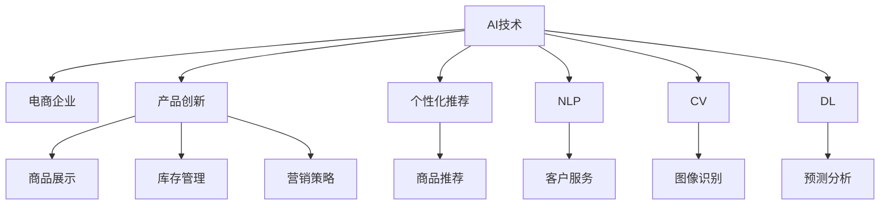

                 

## 1. 背景介绍

### 1.1 电商行业的现状与挑战
近年来，电商行业在互联网技术驱动下经历了爆发式增长。随着消费者需求的不断变化和市场的激烈竞争，传统电商企业面临着诸多挑战。首先，产品的同质化现象日益严重，导致市场竞争激烈，利润空间受限。其次，数据驱动的产品创新能力不足，缺乏精准的用户需求理解和市场趋势预测，难以把握市场机会。最后，营销策略的多样化和精细化要求较高，需要动态调整和优化，以适应不同客户群体的需求变化。

### 1.2 AI技术在电商行业的应用
AI技术在电商行业的应用已经从最初的库存管理、订单处理等自动化流程，逐渐向更深层次的产品创新和个性化推荐演进。AI不仅能够提高电商平台的运营效率，还能通过智能算法和数据洞察，推动电商企业进行更精准、更快速的产品创新。

## 2. 核心概念与联系

### 2.1 核心概念概述
- **AI（人工智能）**：利用机器学习和数据分析技术，使计算机具备一定的智能决策能力，从而更好地服务人类社会。
- **电商企业**：指从事商品交易的在线平台，包括B2B、B2C、C2C等多种模式。
- **产品创新**：指通过AI技术对现有产品进行改进、优化和升级，以满足市场需求的变化，提升用户满意度和市场竞争力。
- **个性化推荐**：指利用AI算法，根据用户历史行为和兴趣，为其推荐个性化的商品或服务，提升用户购买转化率和满意度。
- **自然语言处理（NLP）**：使计算机能够理解、解释和生成自然语言，从而提升AI与用户互动的智能程度。
- **计算机视觉（CV）**：使计算机能够识别、理解并处理图像和视频，应用于商品展示、库存管理等领域。
- **深度学习（DL）**：基于神经网络构建的多层感知模型，能够从大量数据中学习特征，实现复杂的决策和预测。

这些核心概念之间的联系可以通过以下Mermaid流程图来展示：



这个流程图展示了AI技术在电商企业中的多种应用场景，以及这些技术如何相互配合，共同推动电商企业的创新和发展。

## 3. 核心算法原理 & 具体操作步骤

### 3.1 算法原理概述
基于AI的产品创新流程，主要包括数据收集、模型训练、产品测试和迭代优化等步骤。其中，数据收集和模型训练是核心，通过大量的用户数据和先进算法，实现对商品、用户和市场环境的精准分析，从而指导产品创新和个性化推荐。

具体而言，AI通过以下步骤帮助电商企业进行产品创新：
1. **数据收集**：从电商平台收集用户行为数据、商品属性数据和市场环境数据。
2. **数据预处理**：对收集的数据进行清洗、归一化和特征工程，生成可用于模型训练的数据集。
3. **模型训练**：利用深度学习算法（如卷积神经网络CNN、循环神经网络RNN、长短时记忆网络LSTM等），构建商品推荐模型、用户画像模型和市场趋势模型。
4. **产品测试**：在电商平台上部署新开发的AI模型，测试其效果和用户体验。
5. **迭代优化**：根据测试结果和用户反馈，不断优化AI模型，提升产品创新的精准度和效果。

### 3.2 算法步骤详解

#### 数据收集
电商企业的数据来源主要包括以下几个方面：
1. **用户行为数据**：包括用户的浏览记录、点击率、购买行为、评价反馈等。
2. **商品属性数据**：如商品分类、价格、库存、属性标签等。
3. **市场环境数据**：如季节性因素、节假日、竞争者信息等。

#### 数据预处理
数据预处理的主要步骤包括：
1. **数据清洗**：去除无效数据、处理缺失值、去除异常值等。
2. **数据归一化**：将不同范围的数据转换为0-1之间的小数，方便模型训练。
3. **特征工程**：提取和构造特征，如用户画像、商品特征、市场特征等。

#### 模型训练
模型训练通常采用深度学习框架（如TensorFlow、PyTorch等）和预训练模型（如BERT、GPT等），构建商品推荐、用户画像和市场趋势模型。具体流程如下：
1. **数据划分**：将数据集划分为训练集、验证集和测试集。
2. **模型选择**：选择合适的深度学习模型，如CNN、RNN、LSTM等。
3. **超参数调整**：调整学习率、批量大小、迭代次数等超参数。
4. **模型训练**：利用训练集数据对模型进行训练，并使用验证集数据进行模型评估和优化。
5. **模型评估**：在测试集上评估模型性能，如准确率、召回率、F1-score等指标。

#### 产品测试
产品测试主要通过以下方式进行：
1. **A/B测试**：将新开发的AI模型与现有模型进行对比，测试用户对新模型的接受程度和效果。
2. **用户反馈**：收集用户对新模型的使用体验和建议，进行进一步优化。
3. **迭代优化**：根据测试结果和用户反馈，不断优化AI模型，提升产品创新的精准度和效果。

### 3.3 算法优缺点
基于AI的产品创新方法具有以下优点：
1. **精准度**：利用大量数据和先进算法，实现对商品、用户和市场环境的精准分析。
2. **效率高**：自动化流程减少了人工干预，提高了电商平台的运营效率。
3. **动态调整**：能够实时调整和优化产品策略，适应市场变化。

同时，该方法也存在一些缺点：
1. **数据依赖**：需要大量高质量的数据，否则模型效果难以保证。
2. **算法复杂**：深度学习模型训练复杂，需要高性能计算资源。
3. **用户隐私**：用户数据隐私和安全需要得到充分保护。

### 3.4 算法应用领域
基于AI的产品创新方法在电商行业有着广泛的应用场景，包括但不限于以下领域：

- **商品推荐系统**：利用AI算法，根据用户历史行为和兴趣，推荐个性化的商品，提升用户购买转化率和满意度。
- **用户画像建模**：构建详细的用户画像，了解用户需求和行为，实现精准营销。
- **库存管理优化**：利用AI预测市场需求和销售趋势，优化库存水平和商品陈列。
- **市场趋势预测**：分析市场数据，预测销售季节、竞争对手变化等，指导产品创新和市场策略调整。
- **智能客服**：通过自然语言处理技术，提升客服系统对用户需求的理解和响应速度。
- **视觉搜索**：利用计算机视觉技术，实现用户通过图片搜索商品的功能，提升用户体验。

## 4. 数学模型和公式 & 详细讲解 & 举例说明

### 4.1 数学模型构建
基于AI的产品创新，主要涉及以下数学模型：
1. **用户画像模型**：用户画像模型通过用户行为数据和属性数据，构建用户的兴趣、偏好和需求画像。
2. **商品推荐模型**：商品推荐模型通过用户画像和商品属性，预测用户对各个商品的兴趣程度，推荐最相关的商品。
3. **市场趋势模型**：市场趋势模型通过时间序列分析和预测模型，预测市场趋势和季节性变化。

### 4.2 公式推导过程

#### 用户画像模型
用户画像模型通常采用协同过滤算法，如基于用户历史行为的协同过滤和基于用户兴趣的协同过滤。协同过滤的数学公式为：
$$
\text{Similarity}(i,j) = \frac{1}{\sqrt{\sum_k \text{Rating}(i,k) \times \text{Rating}(j,k)}}
$$
其中，$Rate(i,j)$表示用户$i$对商品$j$的评分，$\text{Similarity}(i,j)$表示用户$i$和用户$j$的相似度。

#### 商品推荐模型
商品推荐模型通常采用基于协同过滤的推荐算法，如基于用户兴趣的协同过滤和基于物品属性的协同过滤。以基于用户兴趣的协同过滤为例，推荐模型的公式为：
$$
\text{Rating}(i,j) = \alpha \times \text{Similarity}(i,j) \times \text{Rating}(i,k) + (1-\alpha) \times \text{Item}(k)
$$
其中，$\text{Rating}(i,j)$表示用户$i$对商品$j$的推荐评分，$\text{Item}(k)$表示商品$k$的属性评分，$\alpha$为兴趣权重。

#### 市场趋势模型
市场趋势模型通常采用时间序列分析和预测模型，如ARIMA模型和LSTM模型。ARIMA模型的公式为：
$$
y_t = c + \sum_{i=1}^p \phi_i (y_{t-i}) + \sum_{j=1}^q \theta_j (\Delta^j y_{t-s_j}) + \sum_{k=1}^K \epsilon_k (z_{t-k})
$$
其中，$y_t$表示市场趋势，$\Delta$表示差分操作，$z_k$表示外部因素（如节假日、季节性变化等）。

### 4.3 案例分析与讲解
以电商企业的智能推荐系统为例，具体分析AI技术在该系统中的应用：
1. **用户画像模型**：利用用户的浏览历史、购买记录和属性数据，构建详细的用户画像，了解用户的需求和偏好。
2. **商品推荐模型**：根据用户画像和商品属性，推荐用户最感兴趣的商品，提升用户的购买转化率。
3. **市场趋势模型**：分析市场数据，预测销售季节和竞争者变化，指导商品的采购和促销策略。
4. **视觉搜索**：利用计算机视觉技术，实现用户通过图片搜索商品的功能，提升用户体验。

## 5. 项目实践：代码实例和详细解释说明

### 5.1 开发环境搭建
电商企业的AI产品创新项目，通常需要搭建Python开发环境，主要步骤如下：
1. **安装Python**：选择Python版本（如3.6或3.7），并从官网下载并安装。
2. **安装Pip**：在Python环境中安装Pip，用于安装第三方库。
3. **安装深度学习框架**：安装TensorFlow、PyTorch等深度学习框架，用于构建和训练AI模型。
4. **安装其他库**：安装Numpy、Pandas、Scikit-learn等常用库，用于数据处理和分析。
5. **安装Web框架**：安装Flask或Django等Web框架，用于构建电商平台的前端和后端系统。

### 5.2 源代码详细实现

#### 用户画像模型
```python
import numpy as np
from sklearn.metrics.pairwise import cosine_similarity

class UserProfiling:
    def __init__(self, data):
        self.data = data
        self.similarity_matrix = np.zeros((len(data), len(data)))
        
    def fit(self):
        for i, user1 in enumerate(self.data):
            for j, user2 in enumerate(self.data):
                if i != j:
                    self.similarity_matrix[i, j] = cosine_similarity(user1, user2)[0][1]
                    
    def predict(self, user_index):
        similarity_scores = self.similarity_matrix[user_index]
        return similarity_scores
```

#### 商品推荐模型
```python
import numpy as np
from sklearn.metrics.pairwise import cosine_similarity

class ItemRecommendation:
    def __init__(self, data):
        self.data = data
        self.user_profiles = None
        
    def fit(self, user_profiles):
        self.user_profiles = user_profiles
        
    def predict(self, user_index):
        similarity_scores = self.user_profiles[user_index]
        item_scores = cosine_similarity(similarity_scores.reshape(1, -1), self.data).flatten()
        return item_scores
```

#### 市场趋势模型
```python
from statsmodels.tsa.arima_model import ARIMA
import pandas as pd

class MarketTrend:
    def __init__(self, data):
        self.data = data
        self.model = None
        
    def fit(self):
        self.model = ARIMA(self.data, order=(5, 1, 0))
        self.model_fit = self.model.fit(disp=0)
        
    def predict(self, horizon):
        forecast = self.model_fit.forecast(horizon)
        return forecast
```

### 5.3 代码解读与分析
上述代码实现了用户画像模型、商品推荐模型和市场趋势模型的基本功能，具体分析如下：
- **用户画像模型**：利用余弦相似度计算用户之间的相似度，生成用户画像矩阵。
- **商品推荐模型**：利用余弦相似度计算商品之间的相似度，生成商品推荐列表。
- **市场趋势模型**：利用ARIMA模型预测市场趋势，生成未来预测值。

### 5.4 运行结果展示
运行上述代码后，可以生成用户画像矩阵、商品推荐列表和市场趋势预测值，用于指导电商企业的产品创新和市场策略调整。例如，用户画像矩阵可以帮助电商企业了解用户需求和行为，优化商品推荐算法，提升用户体验。市场趋势预测值可以指导电商企业的库存管理，避免过剩或短缺。

## 6. 实际应用场景

### 6.1 智能推荐系统
智能推荐系统是电商企业利用AI技术进行产品创新的重要工具。通过分析用户历史行为和兴趣，推荐个性化的商品，提升用户的购买转化率和满意度。具体应用场景包括：
1. **商品推荐**：根据用户浏览和购买历史，推荐相关商品，提高用户购买率。
2. **个性化广告**：基于用户画像，推送个性化广告，提升广告效果。
3. **促销活动**：利用市场趋势预测，优化促销活动的时间和内容，提升用户参与度和转化率。

### 6.2 视觉搜索
视觉搜索是电商企业利用AI技术提升用户体验的重要手段。通过计算机视觉技术，实现用户通过图片搜索商品的功能，提升搜索效率和准确度。具体应用场景包括：
1. **图片搜索**：用户上传商品图片，系统自动推荐相关商品。
2. **图像识别**：系统自动识别商品属性和类别，生成商品推荐列表。
3. **图片标注**：系统自动标注商品图片，提升搜索排序的准确度。

### 6.3 库存管理优化
库存管理优化是电商企业利用AI技术提升运营效率的重要手段。通过市场趋势预测和用户行为分析，优化库存水平和商品陈列，避免过剩或短缺。具体应用场景包括：
1. **库存预测**：利用市场趋势模型，预测未来商品需求量，优化库存水平。
2. **库存调拨**：根据用户购买历史和市场趋势，优化库存调拨策略，提升库存周转率。
3. **库存展示**：根据用户浏览和购买历史，优化商品展示策略，提升用户购买率。

## 7. 工具和资源推荐

### 7.1 学习资源推荐
- **《Python深度学习》**：深度学习领域的经典教材，涵盖深度学习基础、模型构建和优化等知识。
- **《深度学习与推荐系统》**：推荐系统领域的经典教材，涵盖推荐算法和实践。
- **Coursera《深度学习专项课程》**：由Google和深度学习专家联合开设，涵盖深度学习基础、卷积神经网络、循环神经网络等内容。
- **Kaggle平台**：数据科学和机器学习竞赛平台，提供海量数据集和模型优化资源。

### 7.2 开发工具推荐
- **TensorFlow**：由Google主导的深度学习框架，支持分布式计算和GPU加速。
- **PyTorch**：Facebook开源的深度学习框架，支持动态计算图和GPU加速。
- **Jupyter Notebook**：交互式编程环境，支持Python代码的快速开发和调试。
- **Flask**：轻量级的Web框架，用于构建电商平台的前端和后端系统。
- **Django**：全功能的Web框架，支持ORM和模板引擎，用于电商平台的后端系统开发。

### 7.3 相关论文推荐
- **《深度学习在推荐系统中的应用》**：综述了深度学习在推荐系统中的应用，涵盖协同过滤、深度神经网络等方法。
- **《用户画像建模：理论、方法与应用》**：介绍了用户画像建模的理论基础和实践方法，涵盖用户画像构建和分析。
- **《电商企业AI创新实践》**：介绍了电商企业利用AI技术进行产品创新的实践案例，涵盖智能推荐、视觉搜索、库存管理等内容。

## 8. 总结：未来发展趋势与挑战

### 8.1 研究成果总结
本文详细介绍了AI技术在电商企业产品创新中的应用，涵盖数据收集、模型训练、产品测试和迭代优化等步骤。通过用户画像、商品推荐和市场趋势模型的构建，提升了电商企业的运营效率和用户体验。

### 8.2 未来发展趋势
未来，AI技术在电商企业中的应用将更加广泛和深入，主要趋势如下：
1. **AI技术融合**：AI技术与物联网、区块链、5G等新兴技术结合，实现更全面、更智能的电商应用。
2. **个性化推荐**：利用深度学习算法和用户画像，实现更精准、更个性化的商品推荐。
3. **市场趋势预测**：利用深度学习模型和大数据技术，提升市场趋势预测的准确度。
4. **用户行为分析**：利用自然语言处理技术和大数据分析，深入理解用户行为和需求，实现精准营销。
5. **智能客服**：利用自然语言处理技术，提升客服系统的响应速度和准确度，提升用户满意度。

### 8.3 面临的挑战
尽管AI技术在电商企业中的应用取得了显著成效，但仍面临以下挑战：
1. **数据隐私和安全**：用户数据隐私和安全需要得到充分保护，防止数据泄露和滥用。
2. **模型鲁棒性**：AI模型需要具备良好的鲁棒性，能够应对市场变化和异常数据。
3. **算法复杂度**：深度学习模型的训练和优化复杂，需要高性能计算资源。
4. **用户接受度**：AI技术需要得到用户的信任和接受，才能实现广泛应用。
5. **跨领域应用**：AI技术在不同领域的应用需要进一步拓展和深化，实现更广泛的商业价值。

### 8.4 研究展望
未来，AI技术在电商企业中的应用需要从以下几个方面进行深入研究和探索：
1. **用户隐私保护**：制定数据隐私保护策略，确保用户数据的安全和隐私。
2. **模型鲁棒性提升**：通过数据增强、对抗训练等技术，提升AI模型的鲁棒性和泛化能力。
3. **深度学习优化**：探索新的深度学习算法和优化方法，降低模型的计算复杂度。
4. **跨领域应用拓展**：将AI技术应用于更多领域，提升跨领域的商业价值和应用效果。
5. **人机协同创新**：结合人类智慧和AI技术，实现人机协同创新，推动电商企业的持续发展。

## 9. 附录：常见问题与解答

**Q1：电商企业如何收集用户数据？**
A: 电商企业可以通过以下方式收集用户数据：
1. **网站日志**：记录用户的浏览记录、点击率、停留时间等行为数据。
2. **购买记录**：记录用户的购买记录、评价反馈等交易数据。
3. **用户反馈**：收集用户对商品、服务和营销活动的反馈数据。

**Q2：电商企业如何保护用户数据隐私？**
A: 电商企业可以采取以下措施保护用户数据隐私：
1. **数据匿名化**：对用户数据进行匿名化处理，防止数据泄露。
2. **访问控制**：限制对用户数据的访问权限，确保数据安全。
3. **加密技术**：采用加密技术，保护用户数据在传输和存储过程中的安全性。

**Q3：电商企业如何优化库存管理？**
A: 电商企业可以采取以下措施优化库存管理：
1. **需求预测**：利用市场趋势模型，预测未来商品需求量，优化库存水平。
2. **库存调拨**：根据用户购买历史和市场趋势，优化库存调拨策略，提升库存周转率。
3. **库存展示**：根据用户浏览和购买历史，优化商品展示策略，提升用户购买率。

**Q4：电商企业如何提升推荐系统的精准度？**
A: 电商企业可以采取以下措施提升推荐系统的精准度：
1. **特征工程**：提取和构造更多有意义的特征，提升模型的预测能力。
2. **模型优化**：采用更先进的深度学习算法和模型优化方法，提升模型的精度和鲁棒性。
3. **实时更新**：利用实时数据更新推荐模型，提升推荐的时效性和准确度。

**Q5：电商企业如何构建用户画像？**
A: 电商企业可以采取以下措施构建用户画像：
1. **行为数据**：收集用户浏览、点击、购买、评价等行为数据。
2. **属性数据**：收集用户的个人信息、偏好、兴趣等属性数据。
3. **社交数据**：收集用户在社交媒体上的行为数据，了解用户的社交关系和兴趣。

---

作者：禅与计算机程序设计艺术 / Zen and the Art of Computer Programming

