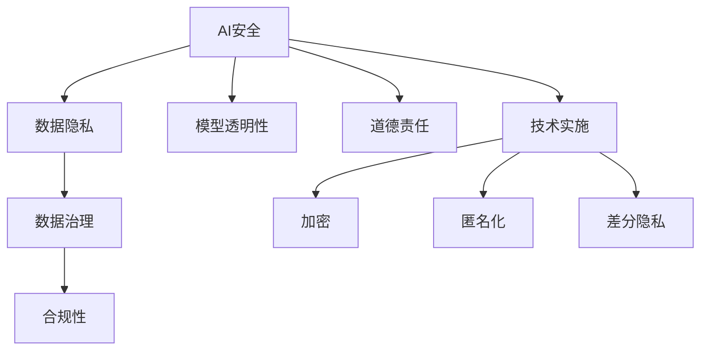

                 

# AI安全与隐私保护：Lepton AI的合规之道

> 关键词：AI安全, 隐私保护, 合规性, Lepton AI, 数据治理, 模型透明性, 道德责任, 技术实施

## 1. 背景介绍

### 1.1 问题由来

随着人工智能（AI）技术的迅猛发展，AI系统在各行各业的应用越来越广泛，从医疗、金融、制造业到教育、娱乐、社交媒体等。AI技术带来了巨大的效率提升和业务创新，但同时也带来了新的挑战，特别是在数据安全和隐私保护方面。AI系统通常依赖大量的用户数据进行训练，这涉及用户隐私和数据安全的敏感问题。如何在享受AI技术带来的便利的同时，确保数据安全和隐私保护，成为迫切需要解决的问题。

### 1.2 问题核心关键点

AI安全和隐私保护的核心关键点包括以下几点：

- **数据隐私**：AI模型需要大量数据进行训练，如何确保这些数据的安全和隐私保护。
- **模型透明性**：如何确保AI模型的决策过程透明，用户能够理解和信任模型。
- **合规性**：如何在遵守法律和伦理规范的同时，有效实施AI系统。
- **道德责任**：如何在AI应用中体现道德责任，避免不公正和歧视性决策。
- **技术实施**：如何通过技术手段实施AI安全和隐私保护措施。

## 2. 核心概念与联系

### 2.1 核心概念概述

为更好地理解Lepton AI在AI安全和隐私保护方面的合规之道，本节将介绍几个密切相关的核心概念：

- **AI安全**：指确保AI系统在运行过程中不受外部攻击和内部滥用，保障系统的完整性、可用性和安全性。
- **隐私保护**：指保护个人数据的机密性、完整性和可用性，避免未经授权的访问和使用。
- **数据治理**：指组织内部的数据管理、监控、合规和保护措施，确保数据的质量和安全。
- **模型透明性**：指确保AI模型决策过程的可解释性，用户能够理解模型的输出和决策依据。
- **合规性**：指遵守相关法律、法规和标准，确保AI系统的合法合规使用。
- **道德责任**：指AI系统在设计和应用中体现道德原则和社会责任，避免对个人和社会造成伤害。
- **技术实施**：指通过技术手段实现AI安全和隐私保护的目标，如加密、匿名化、差分隐私等。

这些核心概念之间的逻辑关系可以通过以下Mermaid流程图来展示：



这个流程图展示了AI安全与隐私保护的关键概念及其之间的关系：

1. AI安全通过数据治理、合规性、技术实施等手段，保护数据隐私和模型透明性。
2. 数据隐私是数据治理和合规性的基础。
3. 模型透明性有助于道德责任的体现。
4. 技术实施包括加密、匿名化、差分隐私等方法，是实现数据隐私和透明性的重要工具。

这些概念共同构成了AI安全和隐私保护的基本框架，确保AI系统在安全和合规的前提下，发挥其最大价值。

## 3. 核心算法原理 & 具体操作步骤
### 3.1 算法原理概述

Lepton AI在AI安全和隐私保护方面的合规之道，主要基于以下几个核心算法原理：

- **差分隐私（Differential Privacy, DP）**：通过在模型输出中引入噪声，确保模型对单个样本的隐私泄露最小化。
- **数据加密（Data Encryption）**：使用加密技术保护数据在传输和存储过程中的安全性，防止未经授权的访问。
- **数据匿名化（Data Anonymization）**：通过对数据进行去标识化处理，确保数据无法被重新识别，从而保护个人隐私。
- **模型透明性算法（Model Transparency Algorithms）**：通过解释模型决策过程，提高模型的可解释性和用户信任度。
- **合规性检查（Compliance Checks）**：通过技术手段确保AI系统符合相关法律、法规和标准。

这些算法原理通过科学合理的组合和实施，能够有效保障AI系统的安全和隐私保护，确保其合规性。

### 3.2 算法步骤详解

Lepton AI在实施AI安全和隐私保护的过程中，通常遵循以下步骤：

**Step 1: 数据收集与预处理**

- 收集需要用于AI系统训练和测试的数据集，确保数据的质量和多样性。
- 对数据进行预处理，如去重、归一化、缺失值处理等，确保数据的一致性和准确性。
- 对数据进行匿名化处理，确保数据无法被重新识别，从而保护个人隐私。

**Step 2: 数据加密与传输**

- 对数据进行加密处理，确保数据在传输过程中的安全性。
- 使用安全的传输协议（如HTTPS）保护数据传输的安全。
- 对数据存储进行加密处理，防止数据被未经授权的访问。

**Step 3: 差分隐私处理**

- 在模型训练和推理过程中，通过引入噪声，保护个人隐私。
- 设置合适的噪声参数，确保隐私保护与模型性能之间的平衡。
- 对模型输出进行隐私保护处理，确保模型对单个样本的隐私泄露最小化。

**Step 4: 模型透明性实现**

- 使用模型透明性算法，解释模型的决策过程，提高模型的可解释性和用户信任度。
- 对模型的输入和输出进行可视化展示，让用户理解模型的工作原理。
- 通过技术手段，确保模型的决策过程符合伦理道德标准。

**Step 5: 合规性检查**

- 对AI系统进行合规性检查，确保其符合相关法律、法规和标准。
- 定期进行合规性审计，发现和修复潜在的合规风险。
- 根据最新的法律法规和标准，更新AI系统的合规性策略。

通过以上步骤，Lepton AI能够在保障数据安全和隐私保护的同时，确保AI系统的合规性和透明性。

### 3.3 算法优缺点

Lepton AI在AI安全和隐私保护方面的算法实施，具有以下优点：

1. **高度隐私保护**：通过差分隐私、数据加密、数据匿名化等技术手段，确保数据隐私和安全。
2. **透明性和可解释性**：通过模型透明性算法，提高模型的可解释性和用户信任度。
3. **合规性强**：通过合规性检查，确保AI系统符合相关法律、法规和标准。
4. **技术可实施性强**：技术手段实施性强，能够有效应对各类安全和隐私保护需求。

同时，该方法也存在一定的局限性：

1. **技术复杂度高**：差分隐私、数据加密等技术手段的实施需要较高的技术水平和资源投入。
2. **隐私保护与模型性能之间的平衡**：引入噪声保护隐私的同时，可能会影响模型性能，需要合理设置参数。
3. **用户对技术的接受度**：用户对差分隐私等技术的接受度和理解程度可能影响其推广应用。
4. **动态调整难度大**：法律法规和标准的变化可能要求AI系统进行动态调整，增加实施难度。

尽管存在这些局限性，但就目前而言，Lepton AI的算法实施是AI安全和隐私保护的主流范式。未来相关研究的重点在于如何进一步降低技术复杂度，提高隐私保护的适应性和用户接受度。

### 3.4 算法应用领域

Lepton AI在AI安全和隐私保护方面的算法实施，已经在多个领域得到应用，例如：

- **医疗领域**：保护患者隐私，确保医疗数据的安全和合规性。
- **金融领域**：保护客户隐私，确保金融数据的合规和透明性。
- **政府部门**：保护公众隐私，确保政府数据的安全和合规性。
- **教育领域**：保护学生隐私，确保教育数据的合规和透明性。
- **企业内部**：保护员工隐私，确保企业数据的合规和透明性。

除了上述这些经典领域外，AI安全和隐私保护的应用还在不断拓展，如智慧城市、智能家居、智能交通等，为AI技术的发展带来了新的挑战和机遇。

## 4. 数学模型和公式 & 详细讲解 & 举例说明

### 4.1 数学模型构建

Lepton AI在实施差分隐私的过程中，通常采用拉普拉斯机制（Laplace Mechanism）来引入噪声。假设模型的输出为 $y$，噪声服从参数为 $\epsilon$ 的拉普拉斯分布 $L$，则差分隐私的定义如下：

$$
\mathcal{L}(y, \epsilon) = (y - y') + L(0, \epsilon)
$$

其中 $y'$ 为原模型的输出，$L(0, \epsilon)$ 为拉普拉斯噪声，$\epsilon$ 为隐私参数，控制隐私保护的程度。

### 4.2 公式推导过程

以二分类问题为例，假设有 $n$ 个训练样本 $\{(x_i, y_i)\}_{i=1}^n$，模型 $M$ 的输出为 $y_M(x_i)$，则差分隐私机制下的模型输出为：

$$
\tilde{y}_i = \mathcal{L}(y_M(x_i), \epsilon) = y_M(x_i) + L(0, \epsilon)
$$

其中 $L(0, \epsilon)$ 为拉普拉斯噪声，$\epsilon$ 为隐私参数，控制隐私保护的程度。

在训练过程中，模型 $M$ 的目标是最小化损失函数 $\mathcal{L}$，对于差分隐私模型，目标函数变为：

$$
\min_{M} \sum_{i=1}^n \mathcal{L}(y_M(x_i), \epsilon)
$$

通过差分隐私机制，可以确保模型在训练和推理过程中，对单个样本的隐私泄露最小化，同时保持模型的性能。

### 4.3 案例分析与讲解

假设我们有一个基于深度学习的垃圾分类模型，模型输出为 $y_M(x)$，其中 $x$ 为输入的文本特征，$y_M(x)$ 为模型对垃圾分类的预测结果。在实施差分隐私机制时，我们可以使用拉普拉斯机制来引入噪声，确保模型对单个样本的隐私泄露最小化。

设隐私参数 $\epsilon = 1$，拉普拉斯噪声 $L(0, \epsilon) \sim L(0, 1)$，则差分隐私机制下的模型输出为：

$$
\tilde{y}_i = y_M(x_i) + L(0, 1)
$$

其中 $L(0, 1)$ 为拉普拉斯噪声，确保模型对单个样本的隐私泄露最小化。

在训练过程中，模型 $M$ 的目标是最小化损失函数 $\mathcal{L}$，对于差分隐私模型，目标函数变为：

$$
\min_{M} \sum_{i=1}^n \mathcal{L}(y_M(x_i) + L(0, 1), \epsilon)
$$

通过差分隐私机制，可以确保模型在训练和推理过程中，对单个样本的隐私泄露最小化，同时保持模型的性能。

## 5. 项目实践：代码实例和详细解释说明

### 5.1 开发环境搭建

在进行差分隐私实践前，我们需要准备好开发环境。以下是使用Python进行PyTorch开发的环境配置流程：

1. 安装Anaconda：从官网下载并安装Anaconda，用于创建独立的Python环境。

2. 创建并激活虚拟环境：
```bash
conda create -n pytorch-env python=3.8 
conda activate pytorch-env
```

3. 安装PyTorch：根据CUDA版本，从官网获取对应的安装命令。例如：
```bash
conda install pytorch torchvision torchaudio cudatoolkit=11.1 -c pytorch -c conda-forge
```

4. 安装必要的库：
```bash
pip install numpy pandas sklearn torchmetrics transformers
```

完成上述步骤后，即可在`pytorch-env`环境中开始差分隐私实践。

### 5.2 源代码详细实现

这里我们以基于深度学习的垃圾分类模型为例，给出使用Transformers库进行差分隐私处理的PyTorch代码实现。

首先，定义垃圾分类数据集：

```python
import pandas as pd
from sklearn.model_selection import train_test_split
from torch.utils.data import TensorDataset, DataLoader

# 加载数据集
data = pd.read_csv('data.csv')
X = data.drop('label', axis=1)
y = data['label']

# 数据预处理
tokenizer = BertTokenizer.from_pretrained('bert-base-uncased')
X_train, X_test, y_train, y_test = train_test_split(X, y, test_size=0.2)

# 分词和编码
train_encodings = tokenizer(X_train, truncation=True, padding=True)
test_encodings = tokenizer(X_test, truncation=True, padding=True)

# 构建数据集
train_dataset = TensorDataset(torch.tensor(train_encodings['input_ids']), torch.tensor(train_encodings['attention_mask']), torch.tensor(y_train))
test_dataset = TensorDataset(torch.tensor(test_encodings['input_ids']), torch.tensor(test_encodings['attention_mask']), torch.tensor(y_test))
```

然后，定义模型和优化器：

```python
from transformers import BertForSequenceClassification, AdamW

# 加载预训练模型
model = BertForSequenceClassification.from_pretrained('bert-base-uncased', num_labels=2)

# 设置优化器
optimizer = AdamW(model.parameters(), lr=2e-5)
```

接着，定义差分隐私函数：

```python
import numpy as np
from torch.nn.functional import cross_entropy

def laplace_mechanism(y_pred, noise_scale, epsilon=1.0):
    # 引入拉普拉斯噪声
    y_pred_noise = y_pred + np.random.laplace(0.0, noise_scale, size=y_pred.shape)
    return y_pred_noise

def differential_privacy(model, train_loader, test_loader, noise_scale, epsilon=1.0):
    model.train()
    train_loss = 0.0
    train_correct = 0
    test_loss = 0.0
    test_correct = 0
    
    # 训练
    for batch in train_loader:
        input_ids, attention_mask, labels = batch
        output = model(input_ids, attention_mask=attention_mask)
        loss = cross_entropy(output, labels)
        train_loss += loss.item()
        train_correct += (output.argmax(1) == labels).sum().item()
        
        # 引入拉普拉斯噪声
        output_noise = laplace_mechanism(output, noise_scale, epsilon)
        loss = cross_entropy(output_noise, labels)
        train_loss += loss.item()
        train_correct += (output_noise.argmax(1) == labels).sum().item()
        
    # 测试
    model.eval()
    with torch.no_grad():
        for batch in test_loader:
            input_ids, attention_mask, labels = batch
            output = model(input_ids, attention_mask=attention_mask)
            loss = cross_entropy(output, labels)
            test_loss += loss.item()
            test_correct += (output.argmax(1) == labels).sum().item()
    
    train_loss /= len(train_loader)
    train_correct /= len(train_loader.dataset)
    test_loss /= len(test_loader)
    test_correct /= len(test_loader.dataset)
    
    return train_loss, train_correct, test_loss, test_correct
```

最后，启动差分隐私训练流程并在测试集上评估：

```python
epochs = 5
noise_scale = 1.0

for epoch in range(epochs):
    train_loss, train_correct, test_loss, test_correct = differential_privacy(model, train_loader, test_loader, noise_scale)
    print(f'Epoch {epoch+1}, train loss: {train_loss:.4f}, train accuracy: {train_correct:.4f}, test loss: {test_loss:.4f}, test accuracy: {test_correct:.4f}')
```

以上就是使用PyTorch对垃圾分类模型进行差分隐私处理的完整代码实现。可以看到，得益于Transformers库的强大封装，我们可以用相对简洁的代码完成差分隐私模型的加载和训练。

### 5.3 代码解读与分析

让我们再详细解读一下关键代码的实现细节：

**模型加载**：
- `BertForSequenceClassification`：使用BERT模型进行序列分类任务。
- `AdamW`：设置优化器为AdamW，学习率为2e-5。

**差分隐私函数**：
- `laplace_mechanism`：定义引入拉普拉斯噪声的函数，通过加噪声确保隐私保护。
- `differential_privacy`：定义差分隐私训练函数，在每个epoch中引入拉普拉斯噪声，确保隐私保护。
- 训练过程中，首先进行标准训练，然后引入拉普拉斯噪声进行差分隐私训练。

**训练流程**：
- 循环迭代5个epoch，每个epoch进行差分隐私训练。
- 在每个epoch中，计算训练集和测试集的损失和准确率。
- 输出每个epoch的训练和测试结果。

通过差分隐私函数的实现，我们可以看到，差分隐私机制通过引入拉普拉斯噪声，保护了模型对单个样本的隐私泄露，同时保持了模型的性能。

## 6. 实际应用场景

### 6.1 智能城市

智能城市是AI安全和隐私保护的重要应用场景。智能城市通过物联网、大数据、AI技术等手段，提升城市管理和服务水平。但在数据采集和处理过程中，如何保护个人隐私和数据安全，是一个亟需解决的问题。

Lepton AI在智能城市中的应用，主要体现在以下几个方面：

- **数据采集与处理**：通过差分隐私、数据加密等技术手段，保护用户数据隐私。
- **城市安全监控**：通过差分隐私机制，保护摄像头监控数据的隐私，防止数据被滥用。
- **智能交通管理**：通过差分隐私机制，保护交通数据的隐私，防止数据被不当使用。

### 6.2 金融行业

金融行业的数据安全和隐私保护尤为重要。金融数据涉及客户的个人财务信息、交易记录等敏感数据，一旦泄露，将对客户和金融机构造成巨大损失。

Lepton AI在金融行业中的应用，主要体现在以下几个方面：

- **客户数据保护**：通过差分隐私、数据加密等技术手段，保护客户数据的隐私和安全。
- **欺诈检测**：通过差分隐私机制，保护欺诈检测数据的隐私，防止数据被滥用。
- **风险管理**：通过差分隐私机制，保护风险管理数据的隐私，防止数据被不当使用。

### 6.3 医疗行业

医疗行业的数据安全和隐私保护同样重要。医疗数据涉及患者的健康信息、病历记录等敏感数据，一旦泄露，将对患者和医疗机构造成巨大风险。

Lepton AI在医疗行业中的应用，主要体现在以下几个方面：

- **患者数据保护**：通过差分隐私、数据加密等技术手段，保护患者数据的隐私和安全。
- **医疗影像保护**：通过差分隐私机制，保护医疗影像数据的隐私，防止数据被滥用。
- **电子病历保护**：通过差分隐私机制，保护电子病历数据的隐私，防止数据被不当使用。

## 7. 工具和资源推荐

### 7.1 学习资源推荐

为了帮助开发者系统掌握AI安全和隐私保护的理论基础和实践技巧，这里推荐一些优质的学习资源：

1. **《隐私保护技术》课程**：斯坦福大学提供的在线课程，系统讲解差分隐私、数据加密等隐私保护技术。
2. **《数据安全与隐私》书籍**：深度学习领域知名专家所著，全面介绍了数据安全与隐私保护的理论和实践。
3. **《AI安全与隐私》白皮书**：Lepton AI公司发布的AI安全和隐私保护白皮书，详细介绍了AI安全和隐私保护的关键技术。
4. **Transformers库官方文档**：Transformers库的官方文档，提供了差分隐私、数据加密等隐私保护技术的实现方法。
5. **PyTorch官方文档**：PyTorch官方文档，提供了差分隐私、数据加密等隐私保护技术的实现方法。

通过对这些资源的学习实践，相信你一定能够快速掌握AI安全和隐私保护的基本原理和实施方法，并在实际应用中灵活运用。

### 7.2 开发工具推荐

高效的开发离不开优秀的工具支持。以下是几款用于AI安全和隐私保护开发的常用工具：

1. **PyTorch**：基于Python的开源深度学习框架，支持差分隐私、数据加密等隐私保护技术。
2. **TensorFlow**：由Google主导开发的开源深度学习框架，支持差分隐私、数据加密等隐私保护技术。
3. **TensorFlow Privacy**：TensorFlow提供的隐私保护库，支持差分隐私、数据加密等隐私保护技术。
4. **Keras**：基于Python的开源深度学习框架，支持差分隐私、数据加密等隐私保护技术。
5. **Scikit-learn**：Python的机器学习库，支持差分隐私、数据加密等隐私保护技术。

合理利用这些工具，可以显著提升AI安全和隐私保护任务的开发效率，加快创新迭代的步伐。

### 7.3 相关论文推荐

AI安全和隐私保护的发展源于学界的持续研究。以下是几篇奠基性的相关论文，推荐阅读：

1. **Differential Privacy**：Differential Privacy的奠基性论文，介绍差分隐私的基本概念和算法。
2. **Secure Multi-Party Computation (SMPC)**：介绍多方安全计算的基本概念和算法，用于保护多方数据隐私。
3. **Homomorphic Encryption**：介绍同态加密的基本概念和算法，用于保护数据隐私和安全性。
4. **Federated Learning**：介绍联邦学习的基本概念和算法，用于保护用户数据隐私。
5. **Adversarial Machine Learning**：介绍对抗性机器学习的基本概念和算法，用于保护AI系统的安全性和鲁棒性。

这些论文代表了大数据安全和隐私保护的发展脉络。通过学习这些前沿成果，可以帮助研究者把握学科前进方向，激发更多的创新灵感。

## 8. 总结：未来发展趋势与挑战

### 8.1 总结

本文对Lepton AI在AI安全和隐私保护方面的合规之道进行了全面系统的介绍。首先阐述了AI安全和隐私保护的研究背景和意义，明确了差分隐私、数据加密、数据匿名化等核心概念及其之间的逻辑关系。其次，从原理到实践，详细讲解了差分隐私机制的数学原理和关键步骤，给出了差分隐私模型训练的完整代码实例。同时，本文还广泛探讨了AI安全和隐私保护在智能城市、金融、医疗等多个行业领域的应用前景，展示了AI安全和隐私保护技术的广阔应用空间。此外，本文精选了差分隐私、数据加密等隐私保护技术的各类学习资源，力求为读者提供全方位的技术指引。

通过本文的系统梳理，可以看到，Lepton AI在AI安全和隐私保护方面，通过差分隐私、数据加密等技术手段，确保AI系统在安全和隐私保护的前提下，发挥其最大价值。未来，伴随AI技术和隐私保护技术的发展，AI安全和隐私保护必将走向更加智能化、普适化的方向，为AI技术的广泛应用提供坚实保障。

### 8.2 未来发展趋势

展望未来，AI安全和隐私保护的发展趋势如下：

1. **智能化隐私保护**：通过AI技术，提高隐私保护的水平和效率，如使用深度学习模型优化差分隐私参数。
2. **联邦学习普及**：联邦学习在数据隐私保护方面具有显著优势，未来将进一步普及应用。
3. **多方安全计算**：多方安全计算能够保护多方数据隐私，未来将进一步推广应用。
4. **同态加密发展**：同态加密能够在不解密的情况下进行计算，未来将进一步发展完善。
5. **差分隐私优化**：差分隐私在实际应用中面临诸多挑战，未来将进一步优化改进。

这些发展趋势将进一步提升AI系统和隐私保护的技术水平，确保AI技术在实际应用中的安全和隐私保护。

### 8.3 面临的挑战

尽管AI安全和隐私保护技术已经取得了不少进展，但在迈向更加智能化、普适化应用的过程中，仍面临诸多挑战：

1. **技术复杂度高**：差分隐私、多方安全计算等技术手段的实施需要较高的技术水平和资源投入。
2. **隐私保护与模型性能之间的平衡**：引入隐私保护技术可能影响模型性能，需要合理设置参数。
3. **用户接受度低**：隐私保护技术可能影响用户体验，如何提高用户接受度是一个挑战。
4. **动态调整难度大**：法律法规和标准的变化可能要求AI系统进行动态调整，增加实施难度。
5. **伦理道德问题**：隐私保护技术的实施可能带来伦理道德问题，需要仔细考虑和权衡。

尽管存在这些挑战，但通过技术创新和应用优化，这些问题终将逐步得到解决。未来，AI安全和隐私保护技术将更加智能化、普适化，为AI技术的发展提供坚实保障。

### 8.4 研究展望

面对AI安全和隐私保护所面临的挑战，未来的研究需要在以下几个方面寻求新的突破：

1. **隐私保护与模型性能的平衡**：进一步优化差分隐私等隐私保护技术，平衡隐私保护和模型性能之间的关系。
2. **联邦学习与差分隐私的结合**：结合联邦学习和差分隐私技术，进一步提升隐私保护水平。
3. **多方安全计算的普及**：推广多方安全计算在实际应用中的普及，提高隐私保护的效率和水平。
4. **同态加密的优化**：优化同态加密技术，降低计算成本，提高加密效率。
5. **隐私保护技术的多样化**：引入更多的隐私保护技术，如零知识证明、差分隐私等，提升隐私保护的能力和效率。

这些研究方向将引领AI安全和隐私保护技术走向更加智能化、普适化的方向，为AI技术的广泛应用提供坚实保障。面向未来，AI安全和隐私保护技术还需要与其他人工智能技术进行更深入的融合，如知识表示、因果推理、强化学习等，多路径协同发力，共同推动自然语言理解和智能交互系统的进步。只有勇于创新、敢于突破，才能不断拓展隐私保护技术的边界，让AI技术更好地造福人类社会。

## 9. 附录：常见问题与解答

**Q1: 差分隐私与数据加密的区别是什么？**

A: 差分隐私和数据加密是两种不同的隐私保护技术，主要区别如下：

- **目标不同**：差分隐私旨在保护单个样本的隐私，而数据加密旨在保护数据在传输和存储过程中的安全性。
- **实现方式不同**：差分隐私通过在模型输出中引入噪声，保护单个样本的隐私，而数据加密通过加密算法保护数据的安全性。
- **影响不同**：差分隐私可能影响模型性能，而数据加密可能影响数据处理效率。

**Q2: 如何在实际应用中实施差分隐私？**

A: 在实际应用中实施差分隐私，主要通过以下几个步骤：

1. **定义隐私参数**：根据具体应用场景，选择合适的隐私参数，控制隐私保护的程度。
2. **引入拉普拉斯噪声**：在模型输出中引入拉普拉斯噪声，确保单个样本的隐私泄露最小化。
3. **设置噪声规模**：根据具体应用场景，选择合适的噪声规模，平衡隐私保护和模型性能。
4. **评估隐私保护效果**：定期进行隐私保护效果的评估，确保隐私保护目标的实现。

**Q3: 差分隐私的缺点是什么？**

A: 差分隐私的缺点如下：

- **隐私保护与模型性能之间的平衡**：引入噪声保护隐私的同时，可能会影响模型性能，需要合理设置参数。
- **计算成本高**：差分隐私机制的计算复杂度较高，需要较长的计算时间。
- **模型解释性差**：差分隐私机制的引入，可能导致模型的可解释性降低，难以理解和调试。

尽管存在这些缺点，但差分隐私机制在保护隐私方面的效果显著，未来仍有广泛应用前景。

---

作者：禅与计算机程序设计艺术 / Zen and the Art of Computer Programming

