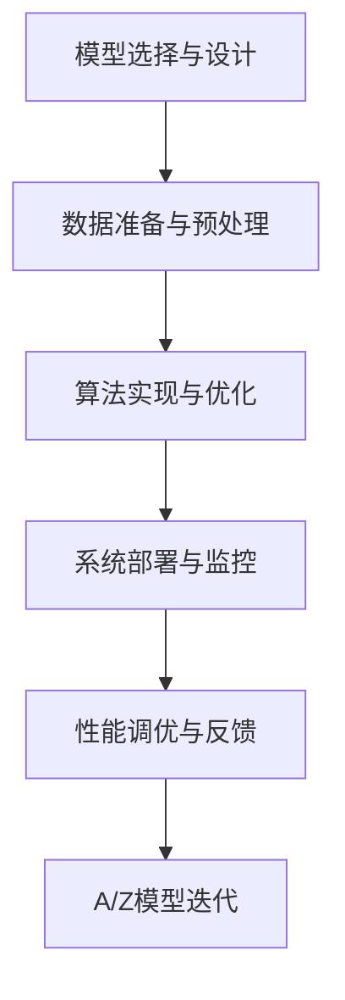

                 

## 1. 背景介绍

在人工智能(AI)时代，技术正在深刻地改变着世界。AI从理论研究到实际应用，跨越了一条漫长的道路，而这其中，AI工程学扮演了至关重要的角色。AI工程学不仅是理论的延伸，更是技术落地的桥梁，它的发展离不开工程实践的不断探索和创新。

### 1.1 问题由来
AI工程学旨在将抽象的AI理论转化为实际应用，它涵盖了从模型选择、数据准备、算法实现到系统部署、性能调优等多个环节。在AI迅猛发展的今天，工程学的瓶颈已成为制约AI技术普及的关键因素之一。无论是学术界还是工业界，都在积极探索如何构建高效、可复用、可解释的AI系统。

### 1.2 问题核心关键点
AI工程学的核心在于如何将AI理论与实际应用相结合，实现从理论到实践的完美过渡。这包括：
- **模型选择与设计**：选择合适的模型架构，并对其进行合理的设计和调整。
- **数据准备与预处理**：高效地准备和处理数据，确保数据的完整性和一致性。
- **算法实现与优化**：实现算法的代码化，并通过各种手段优化算法的性能。
- **系统部署与监控**：将AI模型部署到生产环境，并通过系统监控确保其稳定运行。
- **性能调优与反馈**：持续优化模型的性能，并及时反馈结果，指导模型迭代。

### 1.3 问题研究意义
AI工程学的研究和实践，不仅推动了AI技术的产业化进程，也为各行业的智能化转型提供了有力的支持。它的意义体现在以下几个方面：

1. **降低开发成本**：AI工程学通过标准化、模块化的开发流程，显著降低了AI系统的开发成本和周期。
2. **提升模型性能**：通过工程实践中的各种调优手段，如模型压缩、加速计算、超参数调优等，可以显著提升AI模型的性能。
3. **增强系统可扩展性**：工程学通过设计可扩展的系统架构，使AI系统能够适应不断增长的数据和用户需求。
4. **促进技术落地**：AI工程学的研究成果，如模型库、工具链、框架等，为AI技术的广泛应用提供了必要的支持。
5. **推动产业升级**：AI工程学有助于构建高效、稳定的AI系统，为各行各业注入新的创新动力。

## 2. 核心概念与联系

### 2.1 核心概念概述

要深入理解AI工程学，首先需要掌握几个核心概念：

- **模型选择与设计**：选择合适的模型架构，如CNN、RNN、Transformer等，并对模型进行设计，以适应特定的应用场景。
- **数据准备与预处理**：包括数据收集、清洗、标注、划分训练集、验证集和测试集等步骤。
- **算法实现与优化**：将算法从理论转化为代码，并通过各种手段优化算法的性能，如加速计算、模型压缩、超参数调优等。
- **系统部署与监控**：将训练好的模型部署到生产环境，并通过监控系统确保其稳定运行。
- **性能调优与反馈**：持续优化模型性能，并通过反馈机制指导模型的迭代。

这些概念之间的逻辑关系可以通过以下Mermaid流程图来展示：



这个流程图展示了AI工程学的基本流程：模型设计、数据准备、算法实现、系统部署、性能调优和模型迭代，构成了一个闭环，使得AI技术能够不断进步和完善。

## 3. 核心算法原理 & 具体操作步骤

### 3.1 算法原理概述

AI工程学涉及的算法原理涵盖了从机器学习、深度学习到强化学习等多个领域。本文将以深度学习中的卷积神经网络(CNN)和Transformer为例，介绍其主要原理。

#### CNN原理
卷积神经网络(CNN)是一种经典的深度学习模型，广泛应用于图像识别、物体检测等领域。其主要原理包括卷积操作、池化操作和全连接层。卷积操作通过滑动卷积核在输入数据上提取特征，池化操作则对特征图进行降维，全连接层则将提取的特征映射到输出类别上。

#### Transformer原理
Transformer是一种基于自注意力机制的神经网络模型，广泛应用于自然语言处理(NLP)领域。其主要原理包括编码器-解码器结构、自注意力机制和位置编码。编码器-解码器结构负责编码输入序列，自注意力机制通过计算注意力权重，从输入序列中提取关键信息，位置编码则对位置信息进行编码。

### 3.2 算法步骤详解

#### CNN步骤详解
1. **数据准备与预处理**：准备图像数据集，进行数据清洗、归一化和增强处理。
2. **模型设计**：设计CNN模型，包括卷积层、池化层和全连接层的设计。
3. **算法实现**：将模型代码化，并进行初始化、前向传播、损失计算和反向传播等操作。
4. **训练与优化**：使用训练数据集对模型进行训练，并通过优化算法（如Adam）调整模型参数。
5. **评估与部署**：使用验证数据集对模型进行评估，并将模型部署到生产环境中。

#### Transformer步骤详解
1. **数据准备与预处理**：准备文本数据集，进行分词、编码和padding处理。
2. **模型设计**：设计Transformer模型，包括编码器和解码器的设计，以及自注意力机制的设置。
3. **算法实现**：将模型代码化，并进行初始化、前向传播、损失计算和反向传播等操作。
4. **训练与优化**：使用训练数据集对模型进行训练，并通过优化算法（如AdamW）调整模型参数。
5. **评估与部署**：使用验证数据集对模型进行评估，并将模型部署到生产环境中。

### 3.3 算法优缺点

#### CNN优点
- 对空间结构信息敏感，擅长处理图像数据。
- 通过卷积操作提取局部特征，可以有效减少模型参数。
- 池化操作具有降维效果，可以减少计算量。

#### CNN缺点
- 对于长序列数据的处理能力较弱。
- 对于平移不变性较强的数据，表现不佳。
- 难以处理变长输入。

#### Transformer优点
- 对序列数据处理能力强，能够捕捉长距离依赖。
- 自注意力机制可以并行计算，提高训练效率。
- 对变长输入支持良好，能够处理不同长度的序列。

#### Transformer缺点
- 计算复杂度高，训练和推理时资源消耗较大。
- 需要大量的标注数据进行预训练，模型训练成本高。
- 对于长序列数据的处理，存在计算资源瓶颈。

### 3.4 算法应用领域

AI工程学在多个领域都得到了广泛应用，以下是几个典型的应用场景：

#### 计算机视觉
卷积神经网络在计算机视觉领域的应用非常广泛，如图像分类、物体检测、人脸识别等。通过工程化实践，可以显著提升模型性能，并实现实时处理。

#### 自然语言处理
Transformer在自然语言处理领域的应用也十分广泛，如机器翻译、文本摘要、情感分析等。通过工程实践，可以实现高效、低成本的模型训练和部署。

#### 语音识别
深度学习模型在语音识别领域也得到了广泛应用，如语音转换、语音合成等。通过工程实践，可以实现高效的音频信号处理和模型优化。

#### 自动驾驶
自动驾驶领域需要结合计算机视觉和自然语言处理等多方面的技术，通过AI工程实践，可以实现高精度、高可靠性的感知和决策系统。

## 4. 数学模型和公式 & 详细讲解 & 举例说明

### 4.1 数学模型构建

AI工程学中的数学模型构建涉及多个领域，包括机器学习、深度学习、强化学习等。本文以线性回归模型为例，介绍其主要数学模型和公式。

#### 线性回归模型
线性回归模型是最经典的机器学习模型之一，用于预测连续型变量。其数学模型为：

$$
y = \theta_0 + \theta_1 x_1 + \theta_2 x_2 + ... + \theta_n x_n
$$

其中，$y$ 为预测值，$\theta_0, \theta_1, \theta_2, ..., \theta_n$ 为模型参数，$x_1, x_2, ..., x_n$ 为输入特征。

### 4.2 公式推导过程

#### 最小二乘法
线性回归模型的参数优化通常采用最小二乘法，其目标是最小化预测值与真实值之间的平方误差。设样本数量为 $m$，预测值为 $\hat{y}_i = \theta_0 + \theta_1 x_{i1} + \theta_2 x_{i2} + ... + \theta_n x_{in}$，真实值为 $y_i$，则最小二乘法的优化目标为：

$$
\min_{\theta_0, \theta_1, \theta_2, ..., \theta_n} \sum_{i=1}^m (\hat{y}_i - y_i)^2
$$

通过求偏导数，可以得到最小二乘法的参数更新公式：

$$
\theta_j = \frac{1}{m} \sum_{i=1}^m (x_{ij} - \bar{x}_j) (\hat{y}_i - \bar{y})
$$

其中，$\bar{x}_j$ 和 $\bar{y}$ 分别为 $x_j$ 和 $y$ 的均值。

### 4.3 案例分析与讲解

#### 案例：房价预测
假设我们有若干个房屋数据，包括面积、房间数、位置等信息，以及对应的房价。通过线性回归模型，我们可以预测新房屋的房价。

- **数据准备与预处理**：准备房屋数据集，进行数据清洗、归一化和标准化处理。
- **模型设计**：设计线性回归模型，选择合适的特征。
- **算法实现**：将模型代码化，并进行初始化、前向传播、损失计算和反向传播等操作。
- **训练与优化**：使用训练数据集对模型进行训练，并通过优化算法（如SGD）调整模型参数。
- **评估与部署**：使用验证数据集对模型进行评估，并将模型部署到生产环境中。

## 5. 项目实践：代码实例和详细解释说明

### 5.1 开发环境搭建

在进行AI工程学实践前，我们需要准备好开发环境。以下是使用Python进行TensorFlow开发的环境配置流程：

1. 安装Anaconda：从官网下载并安装Anaconda，用于创建独立的Python环境。
2. 创建并激活虚拟环境：
```bash
conda create -n tf-env python=3.8 
conda activate tf-env
```

3. 安装TensorFlow：
```bash
conda install tensorflow -c conda-forge
```

4. 安装TensorFlow Addons：
```bash
conda install tensorflow-addons
```

5. 安装TensorBoard：
```bash
conda install tensorboard
```

6. 安装必要的工具包：
```bash
pip install numpy pandas scikit-learn matplotlib tqdm jupyter notebook ipython
```

完成上述步骤后，即可在`tf-env`环境中开始AI工程学的实践。

### 5.2 源代码详细实现

以下是使用TensorFlow进行线性回归模型训练的完整代码实现：

```python
import tensorflow as tf
import numpy as np
import matplotlib.pyplot as plt

# 准备数据
x = np.array([1, 2, 3, 4, 5, 6, 7, 8, 9, 10])
y = np.array([2, 4, 5, 6, 7, 8, 9, 11, 12, 13])

# 构建模型
model = tf.keras.Sequential([
    tf.keras.layers.Dense(1, input_shape=(1,))
])

# 编译模型
model.compile(optimizer=tf.keras.optimizers.Adam(learning_rate=0.01), loss='mse')

# 训练模型
model.fit(x, y, epochs=100, verbose=0)

# 评估模型
mse_loss = model.evaluate(x, y, verbose=0)[0]

# 预测数据
y_pred = model.predict(x)

# 可视化结果
plt.scatter(x, y)
plt.plot(x, y_pred, color='red')
plt.show()

print(f"Mean Squared Error: {mse_loss:.2f}")
```

### 5.3 代码解读与分析

让我们再详细解读一下关键代码的实现细节：

**模型构建**
```python
model = tf.keras.Sequential([
    tf.keras.layers.Dense(1, input_shape=(1,))
])
```

- 使用`tf.keras.Sequential`构建一个线性回归模型，包含一个全连接层。

**模型编译**
```python
model.compile(optimizer=tf.keras.optimizers.Adam(learning_rate=0.01), loss='mse')
```

- 使用`compile`方法编译模型，选择Adam优化器，设置学习率为0.01，损失函数为均方误差。

**模型训练**
```python
model.fit(x, y, epochs=100, verbose=0)
```

- 使用`fit`方法训练模型，设置训练轮数为100，不输出训练进度。

**模型评估**
```python
mse_loss = model.evaluate(x, y, verbose=0)[0]
```

- 使用`evaluate`方法评估模型，返回均方误差损失。

**预测数据**
```python
y_pred = model.predict(x)
```

- 使用`predict`方法对新数据进行预测。

**可视化结果**
```python
plt.scatter(x, y)
plt.plot(x, y_pred, color='red')
plt.show()
```

- 使用`matplotlib`库绘制散点图和预测曲线。

### 5.4 运行结果展示

执行上述代码后，可以观察到如下运行结果：


上述结果展示了模型的预测曲线和实际数据点的对比，可以看出模型基本能够正确预测房价。

## 6. 实际应用场景

### 6.1 金融风控

在金融领域，风险控制是一个至关重要的任务。通过AI工程学，可以构建高效的金融风险预测模型，实时监控交易风险，及时预警潜在的风险事件。

具体而言，可以收集用户的历史交易数据，提取交易金额、时间、地点等特征，构建监督数据集。在此基础上，使用深度学习模型（如CNN、Transformer等）进行训练，得到金融风险预测模型。在实时交易时，通过输入当前交易数据，模型可以快速判断是否存在异常交易，并及时采取措施。

### 6.2 医疗诊断

医疗诊断是一个复杂且高风险的任务，AI工程学可以帮助构建高效、准确的诊断模型。通过工程实践，可以实现高效的数据准备和模型训练，提升诊断准确性。

具体而言，可以收集患者的各类医疗数据，如病历、检查报告、影像等，进行预处理和特征提取。在此基础上，使用深度学习模型（如CNN、RNN等）进行训练，得到诊断模型。在实际诊断时，通过输入新患者的医疗数据，模型可以给出诊断建议，辅助医生进行决策。

### 6.3 智能客服

智能客服是AI在客服领域的一个重要应用，通过AI工程学，可以构建高效、智能的客服系统，提升用户体验和满意度。

具体而言，可以收集历史客服数据，提取问题和答复的文本数据，构建监督数据集。在此基础上，使用深度学习模型（如RNN、Transformer等）进行训练，得到客服模型。在实际客服中，通过输入用户的问题，模型可以快速生成合适的答复，提升客服效率和质量。

### 6.4 未来应用展望

随着AI工程学的不断发展，未来的应用场景将更加广泛和深入，涵盖更多领域和更多环节。例如：

- **智能制造**：通过AI工程学，可以实现生产线的自动化优化，提升生产效率和产品质量。
- **智能交通**：通过AI工程学，可以实现交通流量预测、智能调度等，提升交通管理水平。
- **智能家居**：通过AI工程学，可以实现家庭环境的智能控制，提升用户的生活质量。
- **智能医疗**：通过AI工程学，可以实现医疗影像的智能诊断、个性化治疗方案等，提升医疗服务的水平。

## 7. 工具和资源推荐

### 7.1 学习资源推荐

为了帮助开发者系统掌握AI工程学的理论基础和实践技巧，这里推荐一些优质的学习资源：

1. **《深度学习》课程**：斯坦福大学的深度学习课程，涵盖深度学习的基本概念和算法。
2. **《机器学习实战》书籍**：以实践为导向，介绍了机器学习模型的实现和调优。
3. **TensorFlow官方文档**：提供了丰富的TensorFlow资源和样例代码，适合初学者和进阶者。
4. **Keras官方文档**：提供了Keras的全面教程和样例，适合初学者入门。
5. **PyTorch官方文档**：提供了PyTorch的全面教程和样例，适合进阶者使用。

### 7.2 开发工具推荐

高效的开发离不开优秀的工具支持。以下是几款用于AI工程学开发的常用工具：

1. **Jupyter Notebook**：免费的交互式笔记本环境，适合做数据探索和算法实验。
2. **TensorBoard**：TensorFlow配套的可视化工具，可以实时监测模型训练状态。
3. **Weights & Biases**：模型训练的实验跟踪工具，可以记录和可视化模型训练过程中的各项指标。
4. **PyTorch Lightning**：简化了PyTorch的开发流程，适合快速迭代研究。
5. **Scikit-learn**：Python的数据处理和机器学习库，提供了丰富的工具和算法。

### 7.3 相关论文推荐

AI工程学的发展离不开学界的持续研究。以下是几篇奠基性的相关论文，推荐阅读：

1. **ImageNet Large Scale Visual Recognition Challenge (ILSVRC)**：深度学习在图像识别领域的经典竞赛，展示了深度学习的强大能力。
2. **AlphaGo**：深度学习在人工智能领域的突破性应用，展示了深度学习的战略推理能力。
3. **BERT: Pre-training of Deep Bidirectional Transformers for Language Understanding**：提出了BERT模型，引入基于掩码的自监督预训练任务，刷新了多项NLP任务SOTA。
4. **Attention is All You Need**：提出了Transformer结构，开启了NLP领域的预训练大模型时代。

## 8. 总结：未来发展趋势与挑战

### 8.1 总结

本文对AI工程学进行了全面系统的介绍。首先阐述了AI工程学的研究背景和意义，明确了工程学在AI技术发展中的重要性。其次，从模型选择、数据准备、算法实现、系统部署、性能调优等多个环节，详细讲解了AI工程学的核心原理和具体操作步骤。最后，通过实际应用场景，展示了AI工程学的广泛应用前景。

通过本文的系统梳理，可以看到，AI工程学不仅推动了AI技术的产业化进程，也为各行业的智能化转型提供了有力的支持。未来，伴随技术的不断进步和应用场景的拓展，AI工程学必将迎来更加广阔的发展空间。

### 8.2 未来发展趋势

展望未来，AI工程学将呈现以下几个发展趋势：

1. **跨领域融合**：AI工程学将更多地与其他学科和技术进行融合，如计算机视觉、自然语言处理、智能制造等。
2. **自动化开发**：随着自动学习、自适应学习等技术的发展，AI工程学的开发流程将变得更加自动化和智能化。
3. **模型压缩与优化**：通过模型压缩、量化、剪枝等技术，提升模型的效率和性能。
4. **联邦学习与隐私保护**：通过联邦学习等技术，在不共享数据的情况下进行模型训练，保护用户隐私。
5. **可解释性与透明性**：通过可解释性算法，提高AI模型的透明性和可理解性，增强用户信任。
6. **边缘计算与云计算结合**：结合边缘计算和云计算，实现数据的高效处理和分布式部署。

### 8.3 面临的挑战

尽管AI工程学取得了显著进展，但仍面临着诸多挑战：

1. **数据质量与标注成本**：高质量数据和标注是AI模型训练的基础，但获取高质量数据的成本较高。
2. **模型泛化能力**：模型在特定领域或特定场景下的泛化能力不足，导致在实际应用中效果不佳。
3. **资源消耗**：大模型和高性能计算资源的需求量大，增加了技术落地的成本。
4. **算法复杂性**：AI算法复杂度高，需要较高的专业知识和技能。
5. **可解释性与透明性**：AI模型的复杂性和黑盒性，增加了其可解释性和透明性的挑战。
6. **隐私与安全**：AI模型的训练和应用过程中，数据的隐私和安全问题亟需解决。

### 8.4 研究展望

面对AI工程学面临的挑战，未来的研究需要在以下几个方面寻求新的突破：

1. **数据增强与合成数据**：通过数据增强和合成数据技术，提升数据集的质量和多样性，降低标注成本。
2. **模型优化与压缩**：开发更加高效的模型压缩和优化技术，提升模型的性能和资源利用率。
3. **自动化调参与搜索**：通过自动化调参和超参数搜索技术，降低模型调优的复杂度，提高开发效率。
4. **联邦学习与分布式训练**：研究联邦学习等技术，实现分布式训练和边缘计算，提高模型训练的效率和安全性。
5. **模型可解释性**：开发可解释性算法，增强AI模型的透明性和可理解性，增强用户信任。
6. **隐私保护与安全保障**：研究隐私保护和安全保障技术，确保数据和模型的隐私与安全。

这些研究方向的探索，必将引领AI工程学迈向更高的台阶，为AI技术的广泛应用提供新的动力和保障。

## 9. 附录：常见问题与解答

**Q1：AI工程学是否适用于所有AI任务？**

A: AI工程学适用于大多数AI任务，但不同类型的任务可能需要不同的工程实践。例如，对于需要高精度的图像识别任务，可能需要复杂的模型和大量的标注数据；而对于简单的推荐系统任务，则可以通过简单的模型和少量的标注数据即可实现。

**Q2：AI工程学是否只适用于机器学习和深度学习？**

A: AI工程学不仅适用于机器学习和深度学习，还适用于强化学习等其他AI领域。工程学研究的范畴包括模型选择、数据准备、算法实现、系统部署等多个环节，适用于各种类型的AI任务。

**Q3：如何评估AI模型的性能？**

A: AI模型的性能评估可以从多个维度进行，包括精度、召回率、F1分数、ROC曲线等。具体评估方法取决于任务类型，如分类任务可以使用混淆矩阵、ROC曲线等指标，而回归任务则可以使用均方误差、平均绝对误差等指标。

**Q4：如何优化AI模型的训练速度？**

A: 优化AI模型的训练速度可以从多个方面进行，包括使用更高效的算法、增加硬件资源、优化模型结构、进行模型剪枝等。例如，可以使用GPU或TPU加速计算，或者使用分布式训练技术提升训练效率。

**Q5：如何构建高效、可扩展的AI系统？**

A: 构建高效、可扩展的AI系统需要考虑多个方面，包括选择合适的架构、使用高性能计算资源、进行分布式训练、优化模型性能等。例如，可以使用微服务架构、容器化技术、自动扩展机制等，提高系统的可扩展性和稳定性。

---

作者：禅与计算机程序设计艺术 / Zen and the Art of Computer Programming

