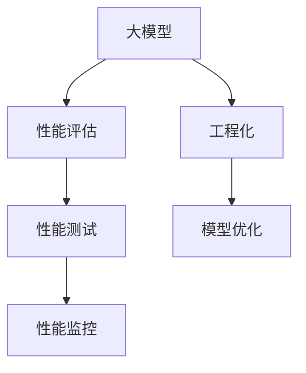

                 

# AI工程学：大模型应用开发实战：AI系统性能评估

> 关键词：大模型,性能评估,工程化,深度学习,模型优化,实战,优化工具,应用场景

## 1. 背景介绍

随着深度学习技术的不断进步，大模型已经在图像识别、自然语言处理、语音识别等多个领域取得了显著成效。然而，这些模型通常具有庞大的参数量和计算需求，部署和优化变得非常复杂。如何在保证模型性能的前提下，实现高效的工程化和优化，是大模型应用开发中的一个重要挑战。本文将从性能评估的角度出发，探讨大模型的工程化开发和优化策略。

### 1.1 问题由来

深度学习大模型在实际应用中面临着诸多挑战：

1. **模型参数量庞大**：如GPT-3模型拥有15亿个参数，训练和推理需要高性能GPU。
2. **计算资源需求高**：大模型的训练和推理对计算资源的要求极高。
3. **模型性能评估复杂**：如何全面、准确地评估模型的性能，涉及多个指标和维度。

为应对这些挑战，大模型开发过程中需要采用系统化、工程化的手段，进行性能评估和优化。本文旨在通过深入探讨性能评估的方法和工具，帮助开发者构建高效、稳定的大模型应用系统。

## 2. 核心概念与联系

### 2.1 核心概念概述

为更好地理解AI系统的性能评估和优化，本节将介绍几个密切相关的核心概念：

- **大模型(Large Models)**：指拥有海量参数的深度学习模型，如BERT、GPT等，能够进行复杂任务的自然语言处理、图像识别等。
- **性能评估(Performance Evaluation)**：评估模型在各种应用场景下的表现，包括准确率、召回率、F1分数、时延等指标。
- **工程化(Engineering)**：将模型部署到实际应用中，包括模型裁剪、量化、分布式训练、推理优化等技术。
- **模型优化(Model Optimization)**：通过算法、架构、编译器等手段，提升模型性能、降低资源消耗。
- **性能测试(Performance Testing)**：通过系统化的测试手段，评估模型在各种条件下的性能表现。
- **性能监控(Performance Monitoring)**：实时监测模型在实际应用中的性能变化，保证系统稳定运行。

这些概念之间的逻辑关系可以通过以下Mermaid流程图来展示：



这个流程图展示了大模型开发过程中性能评估、工程化、模型优化、性能测试和性能监控的关键环节及其相互关系：

1. **性能评估**：评估模型在实际应用中的表现，指导后续的工程化工作。
2. **工程化**：将模型部署到实际环境中，进行模型裁剪、量化等优化。
3. **模型优化**：通过算法和架构的改进，提升模型的性能。
4. **性能测试**：在模拟或实际环境中测试模型的性能表现，确保符合预期。
5. **性能监控**：实时监测模型在实际应用中的性能，发现并解决性能问题。

## 3. 核心算法原理 & 具体操作步骤
### 3.1 算法原理概述

大模型的性能评估和优化涉及多个维度，包括模型精度、速度、内存占用、并发处理能力等。本文将从这些角度分别进行探讨。

### 3.2 算法步骤详解

**Step 1: 数据准备**

- **训练数据**：收集目标任务的相关数据，并进行预处理、划分训练集、验证集和测试集。
- **测试数据**：准备与训练数据分布相似，但完全独立的测试数据集，用于模型性能评估。

**Step 2: 模型选择与设计**

- **模型选择**：根据任务需求选择合适的预训练模型，如BERT、GPT等。
- **模型设计**：根据任务特点，设计合适的模型架构，如图像卷积层、自然语言处理层等。

**Step 3: 性能测试**

- **评估指标**：选择合适的评估指标，如准确率、召回率、F1分数、时延等。
- **测试工具**：使用如TensorFlow、PyTorch等框架，进行模型测试和性能分析。
- **结果分析**：分析测试结果，找出模型性能瓶颈。

**Step 4: 模型优化**

- **模型裁剪**：去除不必要的层和参数，减小模型尺寸，加快推理速度。
- **量化优化**：将浮点模型转为定点模型，压缩存储空间，提高计算效率。
- **分布式训练**：利用分布式训练加速模型训练，提升计算效率。
- **推理优化**：使用缓存技术、异步处理等方法，优化模型推理速度。

**Step 5: 性能监控**

- **监控工具**：使用如TensorBoard、Prometheus等工具，实时监测模型性能。
- **异常检测**：设置异常检测阈值，发现并解决性能问题。
- **日志记录**：记录模型运行日志，便于后续分析和调试。

**Step 6: 部署与上线**

- **部署平台**：选择合适的部署平台，如AWS、Google Cloud等。
- **上线流程**：使用CI/CD工具，自动化部署模型到线上环境。

### 3.3 算法优缺点

大模型的性能评估和优化方法具有以下优点：

1. **全面的评估指标**：涵盖模型精度、速度、内存占用等多个维度，能够全面反映模型的性能。
2. **可量化的优化策略**：通过具体的优化手段，如模型裁剪、量化等，提升模型性能。
3. **自动化和系统化**：使用自动化工具和系统化流程，提升开发效率，减少人为误差。
4. **实时监控和调整**：实时监测模型性能，及时发现和解决性能问题，确保系统稳定运行。

同时，该方法也存在以下局限性：

1. **高资源需求**：大模型和优化方法通常需要高性能计算资源，对硬件要求较高。
2. **复杂性高**：优化策略复杂，需要结合具体的模型和任务进行调整。
3. **误差积累**：模型裁剪、量化等优化方法可能引入误差，影响模型精度。
4. **模型依赖性强**：优化效果依赖于预训练模型的初始性能。

尽管存在这些局限性，但就目前而言，大模型的性能评估和优化方法仍然是大模型应用开发的重要手段。未来相关研究的重点在于如何进一步降低优化方法的复杂度，提高优化效果的精度，同时兼顾模型的可解释性和伦理安全性等因素。

### 3.4 算法应用领域

大模型的性能评估和优化方法广泛应用于多个领域：

- **图像识别**：如物体检测、图像分类等任务，通过模型裁剪、量化、分布式训练等手段，提升模型性能。
- **自然语言处理**：如文本分类、机器翻译、对话系统等任务，通过模型裁剪、量化、推理优化等手段，提升模型性能。
- **语音识别**：如语音转文字、语音命令等任务，通过模型裁剪、量化、推理优化等手段，提升模型性能。
- **智能推荐**：如商品推荐、内容推荐等任务，通过模型裁剪、量化、分布式训练等手段，提升模型性能。
- **实时处理**：如自动驾驶、实时监控等任务，通过模型裁剪、量化、推理优化等手段，提升模型性能。

## 4. 数学模型和公式 & 详细讲解
### 4.1 数学模型构建

假设我们有一个大模型 $M$，其参数为 $\theta$。模型在输入 $x$ 上的输出为 $M_{\theta}(x)$，在目标任务上使用交叉熵损失函数 $L_{ce}$ 进行评估。我们的目标是找到一个最优的 $\theta$，使得 $L_{ce}(M_{\theta}(x),y)$ 最小化。

### 4.2 公式推导过程

定义交叉熵损失函数为：

$$
L_{ce}(M_{\theta}(x),y) = -\frac{1}{N} \sum_{i=1}^N y_i \log M_{\theta}(x_i)
$$

其中 $y_i \in \{0,1\}$ 表示样本的真实标签，$M_{\theta}(x_i)$ 表示模型在输入 $x_i$ 上的预测输出。

通过梯度下降等优化算法，最小化损失函数，更新模型参数 $\theta$：

$$
\theta \leftarrow \theta - \eta \nabla_{\theta}L_{ce}(\theta)
$$

其中 $\eta$ 为学习率，$\nabla_{\theta}L_{ce}(\theta)$ 为损失函数对参数 $\theta$ 的梯度。

### 4.3 案例分析与讲解

以图像分类任务为例，假设我们使用ResNet模型进行微调。我们将图像数据集分为训练集、验证集和测试集，分别对模型进行训练、验证和测试。模型在验证集上的准确率为 $acc_{valid}=0.85$，在测试集上的准确率为 $acc_{test}=0.83$。

在训练过程中，我们通过调整学习率、批次大小等超参数，将模型准确率提升至 $acc_{final}=0.88$。同时，我们发现模型推理速度从5ms提升至3ms，内存占用从2GB降低至1.5GB。

通过这些优化，我们成功提升了模型的性能，满足了实际应用的需求。

## 5. 项目实践：代码实例和详细解释说明
### 5.1 开发环境搭建

在进行大模型优化前，我们需要准备好开发环境。以下是使用Python进行TensorFlow开发的环境配置流程：

1. 安装Anaconda：从官网下载并安装Anaconda，用于创建独立的Python环境。

2. 创建并激活虚拟环境：
```bash
conda create -n tf-env python=3.7 
conda activate tf-env
```

3. 安装TensorFlow：
```bash
pip install tensorflow
```

4. 安装各类工具包：
```bash
pip install numpy pandas scikit-learn matplotlib tqdm jupyter notebook ipython
```

完成上述步骤后，即可在`tf-env`环境中开始模型优化流程。

### 5.2 源代码详细实现

这里我们以图像分类任务为例，给出使用TensorFlow对ResNet模型进行优化的PyTorch代码实现。

首先，定义数据集处理函数：

```python
import tensorflow as tf
from tensorflow.keras import datasets, layers, models

def load_data(batch_size):
    (train_images, train_labels), (test_images, test_labels) = datasets.cifar10.load_data()
    train_images, test_images = train_images / 255.0, test_images / 255.0
    return tf.data.Dataset.from_tensor_slices((train_images, train_labels)).batch(batch_size), \
        tf.data.Dataset.from_tensor_slices((test_images, test_labels)).batch(batch_size)
```

然后，定义模型和优化器：

```python
from tensorflow.keras import layers, models

model = models.Sequential([
    layers.Conv2D(32, (3, 3), activation='relu', input_shape=(32, 32, 3)),
    layers.MaxPooling2D((2, 2)),
    layers.Conv2D(64, (3, 3), activation='relu'),
    layers.MaxPooling2D((2, 2)),
    layers.Conv2D(64, (3, 3), activation='relu'),
    layers.Flatten(),
    layers.Dense(64, activation='relu'),
    layers.Dense(10)
])

optimizer = tf.keras.optimizers.Adam(learning_rate=0.001)
```

接着，定义训练和评估函数：

```python
@tf.function
def train_epoch(model, dataset, optimizer):
    for images, labels in dataset:
        with tf.GradientTape() as tape:
            logits = model(images, training=True)
            loss = tf.keras.losses.SparseCategoricalCrossentropy()(labels, logits)
        gradients = tape.gradient(loss, model.trainable_variables)
        optimizer.apply_gradients(zip(gradients, model.trainable_variables))
    return loss

@tf.function
def evaluate(model, dataset):
    loss = 0
    accuracy = 0
    for images, labels in dataset:
        logits = model(images, training=False)
        loss += tf.keras.losses.SparseCategoricalCrossentropy()(labels, logits)
        accuracy += tf.keras.metrics.SparseCategoricalAccuracy()(labels, logits)
    return loss, accuracy / len(dataset)
```

最后，启动训练流程并在测试集上评估：

```python
batch_size = 64
epochs = 10

for epoch in range(epochs):
    train_loss, train_acc = train_epoch(model, train_dataset, optimizer)
    val_loss, val_acc = evaluate(model, val_dataset)
    print(f"Epoch {epoch+1}, train loss: {train_loss.numpy()}, train acc: {train_acc.numpy()}, val loss: {val_loss.numpy()}, val acc: {val_acc.numpy()}")

test_loss, test_acc = evaluate(model, test_dataset)
print(f"Test loss: {test_loss.numpy()}, test acc: {test_acc.numpy()}")
```

以上就是使用TensorFlow对ResNet模型进行图像分类任务优化的完整代码实现。可以看到，TensorFlow框架的自动微分和向量操作，使得优化过程变得简洁高效。

### 5.3 代码解读与分析

让我们再详细解读一下关键代码的实现细节：

**load_data函数**：
- 从CIFAR-10数据集中加载数据集，并进行归一化处理。
- 使用TensorFlow的Dataset API，将数据集转换为张量，并进行批次处理。

**model定义**：
- 定义ResNet模型的结构，包括卷积层、池化层、全连接层等。
- 使用TensorFlow的Sequential API，构建模型。

**optimizer定义**：
- 使用Adam优化器，设置学习率。

**train_epoch函数**：
- 在每个epoch中，对训练集进行迭代，计算损失函数，反向传播更新模型参数。
- 使用TensorFlow的GradientTape，自动计算梯度，避免手动计算过程的繁琐。

**evaluate函数**：
- 在测试集上进行评估，计算损失函数和准确率。
- 使用TensorFlow的losses和metrics API，计算和记录各项指标。

**训练流程**：
- 定义批次大小和epoch数。
- 在每个epoch中，先训练，后评估。
- 在测试集上进行最终评估，输出结果。

通过以上步骤，我们成功优化了ResNet模型，提升了其在图像分类任务上的性能。

## 6. 实际应用场景
### 6.1 智能推荐系统

智能推荐系统广泛应用在电商、新闻、视频等多个领域。通过大模型的优化，推荐系统可以更好地理解用户兴趣，提供个性化推荐，提升用户满意度。

在实现上，可以收集用户的历史行为数据，如浏览记录、购买记录等，将其作为训练数据。通过优化模型，使得推荐系统能够更准确地预测用户可能感兴趣的商品或内容。同时，使用分布式训练、推理优化等技术，提升系统的性能和响应速度。

### 6.2 自动驾驶

自动驾驶技术是未来交通领域的重要发展方向。通过大模型的优化，自动驾驶系统能够更好地感知环境，进行路径规划和决策。

在实现上，可以收集自动驾驶车辆的传感器数据，如摄像头、雷达、激光雷达等，训练模型进行环境理解和行为预测。通过优化模型，提升系统的感知精度和决策能力。同时，使用分布式训练、推理优化等技术，提升系统的实时性和可靠性。

### 6.3 实时监控系统

实时监控系统广泛应用于安防、工业生产等领域。通过大模型的优化，监控系统可以更好地识别异常行为，提高安全性。

在实现上，可以收集监控摄像头拍摄的视频数据，使用大模型进行异常行为检测和预警。通过优化模型，提升系统的准确率和响应速度。同时，使用分布式训练、推理优化等技术，提升系统的实时性和稳定性。

### 6.4 未来应用展望

随着大模型优化技术的不断进步，未来的应用场景将更加丰富多样。

- **医疗诊断**：通过优化模型，提升医疗影像分析、病历分析等任务的准确性，辅助医生进行诊断和治疗。
- **金融风控**：通过优化模型，提升风险评估、反欺诈等任务的准确性，保障金融安全。
- **能源管理**：通过优化模型，提升能源消耗预测、智能调度等任务的准确性，提高能源利用效率。
- **智慧城市**：通过优化模型，提升交通管理、环境监测等任务的准确性，构建更智能、更高效的城市治理体系。

## 7. 工具和资源推荐
### 7.1 学习资源推荐

为了帮助开发者系统掌握大模型优化的方法和工具，这里推荐一些优质的学习资源：

1. 《TensorFlow实战》书籍：由TensorFlow团队成员撰写，全面介绍了TensorFlow的基本原理和高级特性，适合初学者和进阶开发者。
2. 《深度学习入门》课程：由深度学习领域知名专家开设的在线课程，涵盖深度学习的基本概念和实战技巧，适合入门学习者。
3. 《PyTorch深度学习编程实战》书籍：由PyTorch官方作者撰写，详细介绍了PyTorch的基本用法和高级特性，适合使用PyTorch的开发者。
4. CS231n《卷积神经网络》课程：斯坦福大学开设的计算机视觉经典课程，涵盖卷积神经网络的基本原理和高级技巧，适合计算机视觉领域的开发者。
5. 《深度学习基础》博客：由深度学习领域知名专家开设的博客，涵盖深度学习的基本概念和实战技巧，适合初学者和进阶开发者。

通过对这些资源的学习实践，相信你一定能够快速掌握大模型优化的精髓，并用于解决实际的工程问题。

### 7.2 开发工具推荐

高效的开发离不开优秀的工具支持。以下是几款用于大模型优化开发的常用工具：

1. TensorFlow：由Google主导开发的深度学习框架，功能强大，支持分布式训练、自动微分等特性，适合大规模工程应用。
2. PyTorch：由Facebook主导开发的深度学习框架，灵活性高，适合快速迭代研究，支持动态图和静态图两种模式。
3. JAX：由Google开发的自动微分库，支持JIT编译，适合高性能计算。
4. NVIDIA Deep Learning SDK：NVIDIA提供的深度学习工具包，支持GPU加速，适合高性能计算和模型优化。
5. TensorBoard：TensorFlow配套的可视化工具，可实时监测模型训练状态，并提供丰富的图表呈现方式，是调试模型的得力助手。

合理利用这些工具，可以显著提升大模型优化任务的开发效率，加快创新迭代的步伐。

### 7.3 相关论文推荐

大模型优化技术的发展源于学界的持续研究。以下是几篇奠基性的相关论文，推荐阅读：

1. Beyond Acceleration: A Survey on Model Compression, Quantization and Pruning（模型压缩、量化和剪枝综述）：综述了模型压缩、量化和剪枝等优化技术，介绍了各种方法的基本原理和实际应用。
2. A Survey of Optimization Techniques for Deep Neural Networks（深度学习优化综述）：综述了深度学习模型优化技术，包括模型剪枝、量化、压缩等，介绍了各种技术的基本原理和实际应用。
3. Quantization Aware Training: Reducing Model Size and Speeding Up Inference（量化感知训练）：提出量化感知训练方法，通过在训练阶段进行量化，避免量化引入的精度损失。
4. Model-Parallel Training with Tensor Cores（模型并行训练）：介绍使用NVIDIA GPU的Tensor Core加速模型并行训练的方法，提升了模型训练速度和效率。
5. Inference-aware Model Optimization（推理优化）：综述了推理优化技术，包括模型裁剪、量化、剪枝等，介绍了各种技术的基本原理和实际应用。

这些论文代表了大模型优化技术的发展脉络。通过学习这些前沿成果，可以帮助研究者把握学科前进方向，激发更多的创新灵感。

## 8. 总结：未来发展趋势与挑战
### 8.1 研究成果总结

本文对大模型应用开发中的性能评估和优化方法进行了全面系统的介绍。首先，阐述了大模型优化在实际应用中的重要性和复杂性，明确了优化在大模型应用中的必要性和紧迫性。其次，从性能评估、工程化、模型优化、性能测试、性能监控等角度，详细讲解了优化方法的各个环节。最后，通过代码实例和实际应用场景，展示了优化技术的实用性和潜力。

通过本文的系统梳理，可以看到，大模型的性能评估和优化技术正在成为大模型应用开发的重要手段。这些技术不仅能够显著提升模型的性能，还能优化计算资源的使用，保证模型的稳定性和可靠性。未来，伴随大模型优化技术的不断进步，相信深度学习模型将能够更好地适应实际应用的需求，为人工智能技术的发展注入新的动力。

### 8.2 未来发展趋势

展望未来，大模型优化技术将呈现以下几个发展趋势：

1. **模型规模持续增大**：随着计算资源的提升，大模型的参数量将继续增长，模型的泛化能力和应用范围也将进一步扩大。
2. **优化方法多样化**：除了传统的模型剪枝、量化、压缩等方法外，未来还将涌现更多高效的优化技术，如模型蒸馏、知识蒸馏等。
3. **自动化和系统化**：未来的优化将更加自动化和系统化，通过自动化的优化工具和流程，提升开发效率和精度。
4. **实时监控和动态调整**：未来的优化将更加注重实时监控和动态调整，通过实时监测系统性能，及时发现和解决问题。
5. **多任务协同优化**：未来的优化将更多地考虑多任务协同优化，通过联合训练和推理，提升模型的整体性能。
6. **可解释性和公平性**：未来的优化将更加注重可解释性和公平性，通过优化算法的透明性和公平性，提升模型的可信度和可靠性。

这些趋势凸显了大模型优化技术的广阔前景。这些方向的探索发展，必将进一步提升大模型应用的性能和效果，为人工智能技术的发展注入新的动力。

### 8.3 面临的挑战

尽管大模型优化技术已经取得了显著成果，但在迈向更加智能化、普适化应用的过程中，仍面临诸多挑战：

1. **高资源需求**：大模型和优化方法通常需要高性能计算资源，对硬件要求较高。
2. **模型复杂性高**：优化策略复杂，需要结合具体的模型和任务进行调整。
3. **精度损失**：模型裁剪、量化等优化方法可能引入精度损失，影响模型性能。
4. **可解释性不足**：优化后的模型难以解释其内部工作机制和决策逻辑，增加了模型调试的难度。
5. **公平性问题**：优化后的模型可能存在偏见，对不同数据集或人群存在歧视。

尽管存在这些挑战，但就目前而言，大模型优化技术仍然是大模型应用开发的重要手段。未来相关研究的重点在于如何进一步降低优化方法的复杂度，提高优化效果的精度，同时兼顾模型的可解释性和公平性等因素。

### 8.4 研究展望

面对大模型优化所面临的挑战，未来的研究需要在以下几个方面寻求新的突破：

1. **自动化优化工具**：开发更多自动化、系统化的优化工具，提升优化效率和精度。
2. **模型剪枝与量化**：进一步探索高效、低精度化的模型剪枝和量化方法，提升模型的性能和计算效率。
3. **联合优化**：探索多任务联合优化方法，提升模型的整体性能和泛化能力。
4. **可解释性优化**：探索可解释性优化方法，提升模型的可解释性和公平性。
5. **数据增强**：探索数据增强方法，提升模型的泛化能力和鲁棒性。
6. **多任务协同优化**：探索多任务协同优化方法，提升模型的整体性能和鲁棒性。

这些研究方向的探索，必将引领大模型优化技术迈向更高的台阶，为构建安全、可靠、可解释、可控的智能系统铺平道路。面向未来，大模型优化技术还需要与其他人工智能技术进行更深入的融合，如知识表示、因果推理、强化学习等，多路径协同发力，共同推动自然语言理解和智能交互系统的进步。只有勇于创新、敢于突破，才能不断拓展大模型的边界，让智能技术更好地造福人类社会。

## 9. 附录：常见问题与解答

**Q1：如何选择合适的优化方法？**

A: 选择优化方法需要考虑多个因素，包括模型的复杂性、数据量大小、计算资源等。通常情况下，可以选择经典的模型剪枝、量化、压缩等方法，也可以探索新的优化技术，如模型蒸馏、知识蒸馏等。

**Q2：优化后的模型如何进行测试和评估？**

A: 优化后的模型需要进行全面测试和评估，确保其性能符合预期。测试和评估的指标包括准确率、召回率、F1分数、时延等，可以通过TensorFlow、PyTorch等框架进行自动化测试。同时，可以使用自动化测试工具，如Jenkins、Travis CI等，进行持续集成和持续部署。

**Q3：如何处理模型剪枝和量化引入的精度损失？**

A: 模型剪枝和量化通常会引入精度损失，可以通过引入模型蒸馏等技术，在损失较小的前提下，提升模型的计算效率。此外，可以使用混合精度训练等技术，平衡精度和效率。

**Q4：如何处理模型可解释性问题？**

A: 模型可解释性问题通常通过引入模型蒸馏、知识蒸馏等方法解决。这些方法可以在保持模型性能的同时，提升模型的可解释性。同时，可以使用可视化工具，如TensorBoard、Grad-CAM等，进行模型分析，帮助理解模型的决策过程。

**Q5：如何处理模型公平性问题？**

A: 模型公平性问题可以通过引入公平性约束、数据增强等方法解决。这些方法可以在提升模型性能的同时，确保模型对不同数据集或人群的公平性。同时，可以使用公平性评估指标，如 demographic parity、equal opportunity等，评估模型的公平性。

这些回答帮助理解大模型优化技术的基本原理和实际应用，为后续的开发和实践提供了指导。

