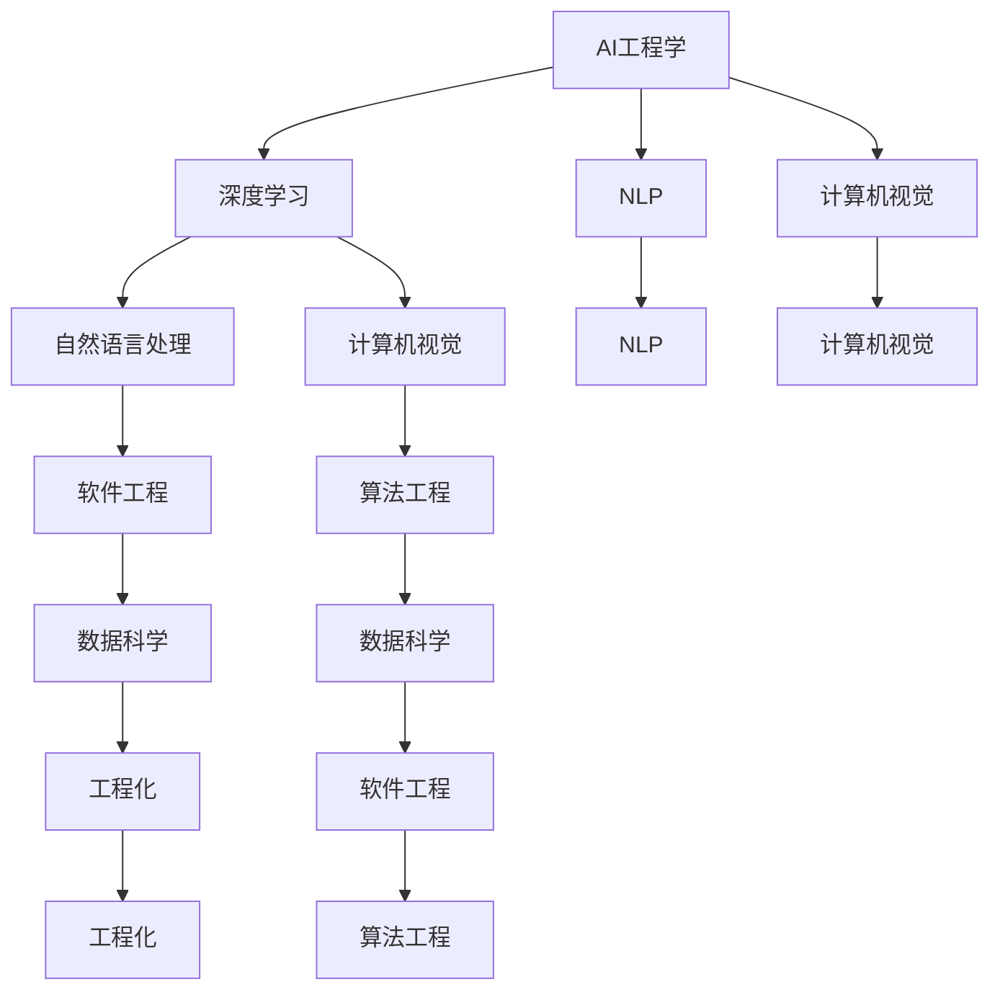

                 

# AI工程学：应用开发实战手册

> 关键词：AI工程学, 应用开发, 软件架构, 深度学习, 自然语言处理, 计算机视觉, 工程实践, 数据科学

## 1. 背景介绍

### 1.1 问题由来
随着人工智能技术的飞速发展，AI工程学的理论和实践方法也在不断成熟。从最初的理论探索，到如今的大规模应用，AI工程学已经成为一个跨学科、跨领域的综合性学科。它涉及计算机科学、数学、统计学、心理学等多个学科领域，旨在解决实际问题，构建高效、可维护、可扩展的AI系统。

然而，AI工程学在快速发展的同时，也面临一些问题。如模型训练耗时长、模型可解释性差、模型性能不稳定等。这些问题不仅限制了AI技术的普及，也影响了其应用效果。因此，研究如何提升AI应用的工程质量，构建高质量、高效率、高可靠性的AI系统，成为AI工程学的核心任务。

### 1.2 问题核心关键点
AI工程学主要关注两个核心问题：一是如何高效地构建和部署AI模型，二是如何提升AI模型的工程质量，使其具备高效、稳定、可解释的特性。本文将从这两个方面进行深入探讨，以期为AI应用的开发和实践提供更多参考和指导。

## 2. 核心概念与联系

### 2.1 核心概念概述

为更好地理解AI工程学的核心内容，本节将介绍几个密切相关的核心概念：

- AI工程学(AI Engineering)：涵盖从AI模型构建到应用部署的全过程，包括数据工程、模型训练、模型优化、系统集成、应用部署等多个环节。

- 深度学习(Deep Learning)：基于人工神经网络的机器学习范式，通过多层神经网络进行特征学习，能够自动学习复杂模式，广泛应用于图像、语音、自然语言处理等领域。

- 自然语言处理(Natural Language Processing, NLP)：使计算机能够理解、处理和生成人类语言的技术，包括文本分类、机器翻译、情感分析、问答系统等任务。

- 计算机视觉(Computer Vision)：使计算机能够理解和解析图像、视频等内容的技术，包括图像分类、目标检测、图像生成等任务。

- 工程化(Architecturalizing)：将AI模型与具体应用场景结合，构建高效的系统架构，提升系统的可扩展性和可维护性。

- 数据科学(Data Science)：利用数据进行科学研究和决策支持，包括数据收集、数据预处理、特征工程、模型训练、模型评估等多个环节。

- 软件工程(Software Engineering)：构建高质量软件系统的工程实践，包括需求分析、设计、实现、测试、部署等环节。

- 算法工程(Algorithm Engineering)：针对特定任务设计高效、稳定的算法，通过优化算法和参数，提升模型性能和工程质量。

这些核心概念之间的逻辑关系可以通过以下Mermaid流程图来展示：



这个流程图展示了大语言模型的核心概念及其之间的关系：

1. AI工程学包括深度学习、自然语言处理、计算机视觉等多个领域。
2. 深度学习是AI工程学的核心技术之一，广泛应用于各种任务。
3. 自然语言处理和计算机视觉是深度学习的重要应用领域。
4. 数据科学和算法工程是深度学习的关键环节，分别涉及数据工程和算法优化。
5. 软件工程和工程化是AI模型应用部署的重要保障，涉及系统设计和实现。

这些概念共同构成了AI工程学的学习和应用框架，使其能够在各种场景下发挥强大的作用。通过理解这些核心概念，我们可以更好地把握AI工程学的内涵和实践方法。

## 3. 核心算法原理 & 具体操作步骤
### 3.1 算法原理概述

AI工程学涉及多种算法和工程实践，包括深度学习算法、自然语言处理算法、计算机视觉算法等。本文将以深度学习算法为例，详细介绍AI工程学的核心算法原理。

深度学习算法通过多层神经网络对数据进行特征提取和分类。其核心思想是利用神经网络进行多层非线性映射，通过反向传播算法更新模型参数，最小化损失函数。常用的深度学习算法包括卷积神经网络(CNN)、循环神经网络(RNN)、Transformer等。

### 3.2 算法步骤详解

深度学习算法通常包括以下几个关键步骤：

**Step 1: 数据准备**
- 收集数据集，并对数据进行预处理，如数据清洗、归一化、扩充等。

**Step 2: 模型构建**
- 选择或设计合适的神经网络架构，如卷积神经网络、循环神经网络、Transformer等。
- 定义损失函数和优化器，常用的有交叉熵损失、均方误差损失、Adam优化器等。

**Step 3: 模型训练**
- 将数据集分为训练集和验证集，进行模型训练和验证。
- 使用训练集数据进行模型参数的优化，最小化损失函数。

**Step 4: 模型评估**
- 在验证集上评估模型的性能，如准确率、召回率、F1值等。
- 根据评估结果调整模型参数，优化模型性能。

**Step 5: 模型应用**
- 将训练好的模型应用于实际任务，进行预测、分类、生成等。

**Step 6: 模型优化**
- 根据实际应用场景，对模型进行优化，如剪枝、量化、融合等。

**Step 7: 模型部署**
- 将优化后的模型部署到目标设备或系统中，进行生产环境下的测试和维护。

### 3.3 算法优缺点

深度学习算法具有以下优点：

1. 自动特征提取：深度神经网络能够自动学习数据特征，无需人工设计特征。
2. 可扩展性：多层的神经网络可以处理复杂的多维数据，适用于大规模数据集。
3. 泛化能力强：通过训练大量数据，深度学习模型具有良好的泛化能力，能够适应不同的数据分布。

但深度学习算法也存在一些缺点：

1. 计算量大：深度学习模型参数量巨大，训练和推理需要大量计算资源。
2. 过拟合风险：深层神经网络容易发生过拟合，需要大量的数据和正则化技术。
3. 可解释性差：深层神经网络的黑箱性质使得其难以解释，不利于模型调试和应用。
4. 易受干扰：深层神经网络对输入数据的微小变化非常敏感，易受噪音干扰。

### 3.4 算法应用领域

深度学习算法广泛应用于以下几个领域：

1. 图像识别：如图像分类、目标检测、图像生成等任务。
2. 语音识别：如语音识别、语音合成等任务。
3. 自然语言处理：如文本分类、机器翻译、情感分析等任务。
4. 推荐系统：如协同过滤、基于内容的推荐等任务。
5. 医疗影像：如医学影像分类、病变检测等任务。
6. 金融预测：如股票预测、信用评分等任务。
7. 交通预测：如交通流量预测、车辆识别等任务。
8. 游戏AI：如博弈对手、机器人控制等任务。

以上深度学习算法应用涵盖了从视觉、语音、自然语言处理到医疗、金融等多个领域，体现了深度学习在多个领域的广泛应用。

## 4. 数学模型和公式 & 详细讲解 & 举例说明

### 4.1 数学模型构建

深度学习算法的核心是神经网络模型。这里以卷积神经网络(CNN)为例，介绍其数学模型构建。

假设输入数据为 $x \in \mathbb{R}^n$，神经网络模型包含卷积层、池化层、全连接层等。定义卷积核参数为 $W_k \in \mathbb{R}^{m \times m \times n \times f_k}$，卷积运算定义为：

$$
y_k = \sigma_k(\mathbb{F}_k(x,W_k))
$$

其中 $\sigma_k$ 为激活函数，$\mathbb{F}_k$ 为卷积运算。

### 4.2 公式推导过程

以图像分类为例，介绍卷积神经网络的公式推导过程。

假设输入图像 $x \in \mathbb{R}^{H \times W \times C}$，其中 $H$、$W$ 为图像的高和宽，$C$ 为通道数。假设卷积核大小为 $k \times k$，卷积步长为 $s$，激活函数为 ReLU。

卷积层输出的特征图 $y \in \mathbb{R}^{H' \times W' \times f_k}$，其中 $H'=\frac{H-k+2p}{s}+1$，$W'=\frac{W-k+2p}{s}+1$，$p$ 为填充层的大小。

池化层输出的特征图 $y \in \mathbb{R}^{H' \times W' \times f_k}$，其中 $H'=\lfloor \frac{H'}{p} \rfloor$，$W'=\lfloor \frac{W'}{p} \rfloor$。

全连接层输出为 $y \in \mathbb{R}^{d_{out}}$，其中 $d_{out}$ 为输出维度。

### 4.3 案例分析与讲解

以图像分类任务为例，展示卷积神经网络模型的应用。

假设输入图像为 $x \in \mathbb{R}^{H \times W \times C}$，卷积层参数为 $W_k \in \mathbb{R}^{3 \times 3 \times C \times 64}$，池化层步长为 $2$，激活函数为 ReLU，输出维度为 $10$。

首先，将输入图像 $x$ 输入卷积层，得到特征图 $y_k$。然后，将特征图 $y_k$ 输入池化层，得到特征图 $y$。最后，将特征图 $y$ 输入全连接层，输出分类结果 $y$。

## 5. 项目实践：代码实例和详细解释说明
### 5.1 开发环境搭建

在进行AI工程学项目开发前，我们需要准备好开发环境。以下是使用Python进行TensorFlow开发的环境配置流程：

1. 安装Anaconda：从官网下载并安装Anaconda，用于创建独立的Python环境。

2. 创建并激活虚拟环境：
```bash
conda create -n tf-env python=3.8 
conda activate tf-env
```

3. 安装TensorFlow：从官网获取对应的安装命令。例如：
```bash
conda install tensorflow -c pytorch -c conda-forge
```

4. 安装TensorBoard：用于可视化模型训练过程。
```bash
pip install tensorboard
```

5. 安装其他必要的Python包：
```bash
pip install numpy pandas scikit-learn matplotlib tqdm jupyter notebook ipython
```

完成上述步骤后，即可在`tf-env`环境中开始AI工程学项目开发。

### 5.2 源代码详细实现

下面我们以图像分类任务为例，给出使用TensorFlow进行卷积神经网络训练的PyTorch代码实现。

首先，定义数据处理函数：

```python
import tensorflow as tf
from tensorflow.keras import datasets, layers, models
import matplotlib.pyplot as plt

(train_images, train_labels), (test_images, test_labels) = datasets.cifar10.load_data()

train_images, test_images = train_images / 255.0, test_images / 255.0
```

然后，定义卷积神经网络模型：

```python
model = models.Sequential([
    layers.Conv2D(32, (3, 3), activation='relu', input_shape=(32, 32, 3)),
    layers.MaxPooling2D((2, 2)),
    layers.Conv2D(64, (3, 3), activation='relu'),
    layers.MaxPooling2D((2, 2)),
    layers.Conv2D(64, (3, 3), activation='relu'),
    layers.Flatten(),
    layers.Dense(64, activation='relu'),
    layers.Dense(10)
])
```

接着，编译模型并训练：

```python
model.compile(optimizer='adam',
              loss=tf.keras.losses.SparseCategoricalCrossentropy(from_logits=True),
              metrics=['accuracy'])

history = model.fit(train_images, train_labels, epochs=10, 
                    validation_data=(test_images, test_labels))
```

最后，评估模型并在测试集上进行预测：

```python
test_loss, test_acc = model.evaluate(test_images, test_labels, verbose=2)
print(test_acc)

predictions = model.predict(test_images)
```

以上就是使用TensorFlow进行卷积神经网络训练的完整代码实现。可以看到，得益于TensorFlow的强大封装，我们可以用相对简洁的代码完成卷积神经网络的构建和训练。

### 5.3 代码解读与分析

让我们再详细解读一下关键代码的实现细节：

**数据处理函数**：
- `load_data`方法：从CIFAR-10数据集中加载训练集和测试集，并进行预处理。
- `train_images, test_images`：将图像像素值归一化到[0,1]之间。

**卷积神经网络模型**：
- `Sequential`类：定义卷积神经网络模型。
- `Conv2D`层：卷积层，参数为卷积核大小、激活函数。
- `MaxPooling2D`层：池化层，参数为池化大小。
- `Dense`层：全连接层，参数为输出维度、激活函数。
- `compile`方法：编译模型，设置优化器、损失函数、评估指标。
- `fit`方法：训练模型，参数为训练集、测试集、训练轮数。

**训练流程**：
- `evaluate`方法：在测试集上评估模型性能，返回损失和精度。
- `predict`方法：在测试集上进行预测。

可以看到，TensorFlow的API设计简洁明了，能够快速完成模型的定义、编译和训练。开发者可以将更多精力放在数据处理、模型改进等高层逻辑上，而不必过多关注底层的实现细节。

## 6. 实际应用场景
### 6.1 智能客服系统

基于AI工程学的智能客服系统，可以实时处理客户咨询，提供高质量的客户服务。传统客服往往需要大量人工参与，高峰期响应缓慢，无法满足客户需求。智能客服系统利用AI工程学的深度学习算法，可以在24小时内不间断服务，快速响应客户咨询，并提供自然流畅的语言回答。

在技术实现上，可以收集企业内部的历史客服对话记录，将问题和最佳答复构建成监督数据，在此基础上训练卷积神经网络模型。模型能够自动理解客户意图，匹配最合适的回答。对于客户提出的新问题，还可以接入检索系统实时搜索相关内容，动态组织生成回答。

### 6.2 医疗影像诊断

AI工程学在医疗影像诊断中的应用非常广泛。利用卷积神经网络模型，可以自动分析医学影像，判断是否存在病变，并确定病变类型和位置。传统的医疗影像诊断需要大量专业医生进行人工分析，耗时长且容易出错。利用智能诊断系统，可以显著提高诊断速度和准确率，辅助医生进行快速诊断。

在技术实现上，可以收集大量医学影像数据，进行标注和预处理，训练卷积神经网络模型。模型在新的医学影像上运行，输出病变检测结果，辅助医生进行诊断。

### 6.3 智能推荐系统

AI工程学在智能推荐系统中的应用也非常重要。利用深度学习算法，可以构建高效推荐模型，分析用户行为数据，推荐符合用户偏好的商品。传统的推荐系统往往基于用户历史行为数据进行推荐，无法深入理解用户兴趣和偏好。利用智能推荐系统，可以更好地挖掘用户语义信息，提高推荐精度和个性化程度。

在技术实现上，可以收集用户浏览、点击、评论、分享等行为数据，提取和商品标题、描述、标签等文本内容。将文本内容作为模型输入，用户的后续行为作为监督信号，训练卷积神经网络模型。模型能够从文本内容中准确把握用户兴趣点，生成推荐列表，提升用户满意度。

### 6.4 未来应用展望

随着AI工程学的不断发展，AI技术将在更多领域得到应用，为传统行业带来变革性影响。

在智慧医疗领域，AI工程学的智能诊断系统将大幅提升医疗服务的智能化水平，辅助医生诊疗，加速新药开发进程。

在智能教育领域，AI工程学的推荐系统将因材施教，促进教育公平，提高教学质量。

在智慧城市治理中，AI工程学的智能系统将提高城市管理的自动化和智能化水平，构建更安全、高效的未来城市。

此外，在企业生产、社会治理、文娱传媒等众多领域，AI工程学的应用也将不断涌现，为经济社会发展注入新的动力。相信随着技术的日益成熟，AI工程学必将在构建人机协同的智能时代中扮演越来越重要的角色。

## 7. 工具和资源推荐
### 7.1 学习资源推荐

为了帮助开发者系统掌握AI工程学的理论基础和实践技巧，这里推荐一些优质的学习资源：

1. 《深度学习入门：基于Python的理论与实现》系列博文：由大模型技术专家撰写，深入浅出地介绍了深度学习原理、TensorFlow实现、模型调优等前沿话题。

2. CS231n《卷积神经网络》课程：斯坦福大学开设的计算机视觉明星课程，涵盖卷积神经网络的基础理论和实践技巧。

3. 《TensorFlow官方文档》：TensorFlow官方文档，提供了全面的API参考和教程，是TensorFlow学习的必备资料。

4. HuggingFace官方文档：Transformers库的官方文档，提供了海量预训练模型和完整的AI工程学样例代码，是AI工程学开发的利器。

5. PyTorch官方文档：PyTorch官方文档，提供了全面API参考和教程，是深度学习模型开发的强大工具。

6. Kaggle：数据科学竞赛平台，提供大量开源数据集和算法竞赛，是学习和实践AI工程学的绝佳平台。

通过对这些资源的学习实践，相信你一定能够快速掌握AI工程学的精髓，并用于解决实际的AI问题。

### 7.2 开发工具推荐

高效的开发离不开优秀的工具支持。以下是几款用于AI工程学开发的常用工具：

1. PyTorch：基于Python的开源深度学习框架，灵活动态的计算图，适合快速迭代研究。大部分预训练语言模型都有PyTorch版本的实现。

2. TensorFlow：由Google主导开发的开源深度学习框架，生产部署方便，适合大规模工程应用。同样有丰富的预训练语言模型资源。

3. Transformers库：HuggingFace开发的NLP工具库，集成了众多SOTA语言模型，支持PyTorch和TensorFlow，是进行AI工程学开发的利器。

4. Weights & Biases：模型训练的实验跟踪工具，可以记录和可视化模型训练过程中的各项指标，方便对比和调优。与主流深度学习框架无缝集成。

5. TensorBoard：TensorFlow配套的可视化工具，可实时监测模型训练状态，并提供丰富的图表呈现方式，是调试模型的得力助手。

6. Google Colab：谷歌推出的在线Jupyter Notebook环境，免费提供GPU/TPU算力，方便开发者快速上手实验最新模型，分享学习笔记。

合理利用这些工具，可以显著提升AI工程学开发的效率，加快创新迭代的步伐。

### 7.3 相关论文推荐

AI工程学的发展源于学界的持续研究。以下是几篇奠基性的相关论文，推荐阅读：

1. AlexNet: One Million Training Examples for Deep Learning（AlexNet论文）：提出卷积神经网络，开创了深度学习时代。

2. Deep Residual Learning for Image Recognition（ResNet论文）：提出残差连接，使得深层神经网络能够训练更深度，并提高模型性能。

3. Multi-Task Learning Using Uncertainty to Weigh Losses: A New Framework for Modeling Uncertainty（MTL论文）：提出多任务学习，通过不确定性加权损失函数提高模型泛化能力。

4. Distributed Deep Learning（Distributed深度学习论文）：提出分布式深度学习，解决大规模深度学习模型的训练和推理问题。

5. Adversarial Examples in Deep Learning（对抗样本论文）：提出对抗样本，研究神经网络对对抗样本的鲁棒性，为模型安全性提供新思路。

这些论文代表了大模型工程化的发展脉络。通过学习这些前沿成果，可以帮助研究者把握学科前进方向，激发更多的创新灵感。

## 8. 总结：未来发展趋势与挑战
### 8.1 总结

本文对AI工程学的核心概念和应用开发实践进行了全面系统的介绍。首先阐述了AI工程学的发展背景和研究意义，明确了AI工程学在构建高效、稳定、可扩展AI系统中的重要作用。其次，从深度学习算法原理到工程实践，详细讲解了AI工程学的核心算法和操作步骤，给出了AI工程学项目开发的完整代码实例。同时，本文还广泛探讨了AI工程学在智能客服、医疗影像、智能推荐等多个行业领域的应用前景，展示了AI工程学的广阔应用范围。此外，本文精选了AI工程学的各类学习资源，力求为AI应用的开发和实践提供更多参考和指导。

通过本文的系统梳理，可以看到，AI工程学已经成为一个跨学科、跨领域的综合性学科，涵盖数据工程、模型训练、模型优化、系统集成、应用部署等多个环节。它在多个领域的应用，体现了其强大的工程能力和实际应用价值。

### 8.2 未来发展趋势

展望未来，AI工程学的发展趋势主要体现在以下几个方面：

1. 自动化与可解释性：自动化学习与可解释性是未来AI工程学的重要研究方向。未来的AI系统将能够自动发现和应用新知识，同时具备良好的可解释性，提高用户对AI系统的信任度。

2. 多模态融合：未来的AI系统将融合视觉、语音、自然语言等多种模态信息，构建更加全面的AI模型，提升模型表现。

3. 联邦学习：未来的AI系统将利用分布式计算资源，实现大规模数据协同学习，提升模型的泛化能力和隐私保护。

4. 智能系统优化：未来的AI系统将利用智能优化算法，实时调整模型参数，提高模型的训练速度和鲁棒性。

5. 人机协同：未来的AI系统将更加注重人机协同，提高人机交互的友好性和可控性。

6. 数据治理：未来的AI系统将注重数据治理，解决数据质量、数据隐私等问题，提高数据应用的价值。

以上趋势凸显了AI工程学的广阔前景。这些方向的探索发展，必将进一步提升AI系统的工程质量，提高AI系统的应用效果和用户满意度。

### 8.3 面临的挑战

尽管AI工程学已经取得了瞩目成就，但在迈向更加智能化、普适化应用的过程中，它仍面临诸多挑战：

1. 数据质量与隐私：数据质量差、数据隐私问题等成为制约AI系统发展的瓶颈。如何提高数据质量，保护数据隐私，是未来AI工程学的重大挑战。

2. 模型复杂度：现有深度学习模型复杂度不断增加，训练和推理资源消耗巨大。如何在不降低模型性能的情况下，减少模型复杂度，提高计算效率，是未来AI工程学的关键任务。

3. 模型鲁棒性：现有AI系统对输入数据的微小变化非常敏感，易受噪音干扰。如何提高模型鲁棒性，增强模型的抗干扰能力，是未来AI工程学的研究方向。

4. 模型可解释性：现有深度学习模型的黑箱性质，使得其难以解释，不利于模型调试和应用。如何提高模型可解释性，增强模型的透明度和可信度，是未来AI工程学的研究方向。

5. 模型安全性：现有AI系统可能被恶意利用，产生误导性、歧视性的输出，给实际应用带来安全隐患。如何提高模型安全性，构建安全可靠的AI系统，是未来AI工程学的研究重点。

6. 模型应用边界：现有AI系统往往在特定场景下表现良好，但难以泛化到其他场景。如何构建更通用的AI模型，拓展AI系统的应用边界，是未来AI工程学的研究方向。

正视AI工程学面临的这些挑战，积极应对并寻求突破，将是大规模AI系统成功应用的关键。相信随着学界和产业界的共同努力，这些挑战终将一一被克服，AI工程学必将在构建人机协同的智能时代中扮演越来越重要的角色。

### 8.4 研究展望

面对AI工程学所面临的挑战，未来的研究需要在以下几个方面寻求新的突破：

1. 自动化学习与可解释性：研究如何构建自动学习系统，同时提高模型的可解释性，提高用户对AI系统的信任度。

2. 多模态融合与联邦学习：研究如何融合多模态信息，同时保护数据隐私，构建高效、安全的AI系统。

3. 智能系统优化与模型鲁棒性：研究如何利用智能优化算法，实时调整模型参数，提高模型的训练速度和鲁棒性。

4. 人机协同与数据治理：研究如何构建人机协同系统，同时解决数据质量、数据隐私等问题，提高数据应用的价值。

这些研究方向的探索，必将引领AI工程学技术迈向更高的台阶，为构建安全、可靠、可解释、可控的智能系统铺平道路。面向未来，AI工程学还需要与其他AI技术进行更深入的融合，如知识表示、因果推理、强化学习等，多路径协同发力，共同推动自然语言理解和智能交互系统的进步。只有勇于创新、敢于突破，才能不断拓展AI工程学的边界，让智能技术更好地造福人类社会。

## 9. 附录：常见问题与解答

**Q1：AI工程学是否适用于所有AI应用场景？**

A: AI工程学适用于大多数AI应用场景，特别是需要大规模数据训练和优化应用的场景。但对于一些需要高度自定义或特殊需求的应用，可能需要更精细化的模型设计和工程实践。

**Q2：如何选择合适的深度学习算法？**

A: 选择合适的深度学习算法应根据具体应用场景和数据特点进行评估。常用的深度学习算法包括卷积神经网络、循环神经网络、Transformer等。对于图像识别任务，卷积神经网络是最优选择；对于自然语言处理任务，Transformer具有较好的效果。

**Q3：AI工程学开发过程中需要注意哪些问题？**

A: AI工程学开发过程中需要注意的问题包括数据质量、数据隐私、模型复杂度、模型鲁棒性、模型可解释性、模型安全性等。只有在数据、模型、训练、推理等各环节进行全面优化，才能构建高质量、高效率、高可靠性的AI系统。

**Q4：AI工程学在落地部署时需要注意哪些问题？**

A: AI工程学在落地部署时需要注意的问题包括模型压缩、模型量化、模型裁剪、模型并行等。合理利用这些技术，可以显著提升模型的推理速度和资源利用率，确保模型在生产环境下的高效稳定运行。

**Q5：AI工程学未来有哪些突破方向？**

A: AI工程学未来可能的突破方向包括自动化学习、多模态融合、联邦学习、智能系统优化、人机协同、数据治理等。这些方向的研究将进一步提升AI系统的工程质量，提高其应用效果和用户满意度。

通过本文的系统梳理，可以看到，AI工程学在构建高效、稳定、可扩展的AI系统方面具有重要价值。无论是深度学习算法的原理与实现，还是工程实践的各个环节，AI工程学都提供了全面、系统的指导。相信随着技术的不断进步，AI工程学将在更多领域得到广泛应用，推动AI技术向更深层次、更广范围发展。

