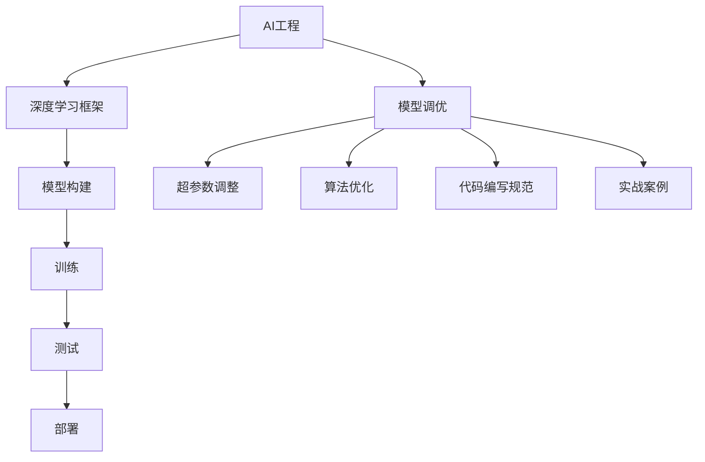

                 

# AI工程最佳实践原理与代码实战案例讲解

> 关键词：AI工程、最佳实践、模型调优、深度学习、机器学习、代码实战、案例讲解

## 1. 背景介绍

在人工智能领域，随着深度学习、机器学习等技术的飞速发展，AI工程的应用范围和深度不断扩展。从自然语言处理到计算机视觉，从自动驾驶到智能推荐，AI技术的落地应用几乎渗透到了生活的各个方面。然而，在AI工程的实际开发和部署过程中，仍然存在很多困难和挑战。如何在有限的资源和时间内，实现AI应用的快速迭代和高效交付，已经成为业内关注的焦点。

为此，本文将重点介绍AI工程的最佳实践，包括模型调优、深度学习框架的选择、代码编写规范、以及如何通过实战案例解决实际问题。通过深入浅出的讲解，读者将能够掌握AI工程的基本原理和实战技巧，为未来的AI项目开发提供参考。

## 2. 核心概念与联系

### 2.1 核心概念概述

为了更好地理解AI工程的最佳实践，本节将介绍几个关键概念：

- **AI工程**：指将人工智能技术应用于实际工程项目的过程。包括模型选择、数据处理、模型训练、测试、部署等各个环节。
- **模型调优**：指通过调整模型超参数、优化算法等手段，提升模型的性能和泛化能力。
- **深度学习框架**：如TensorFlow、PyTorch等，提供了模型构建、训练、部署等功能的实现。
- **代码编写规范**：包括命名规范、注释规范、测试规范等，保证代码的可读性、可维护性和可扩展性。
- **实战案例**：通过具体项目的实现过程，展示AI工程的实施方法和效果。

这些核心概念之间的逻辑关系可以通过以下Mermaid流程图来展示：



这个流程图展示了AI工程的主要环节和相关概念之间的关系：

1. AI工程基于深度学习框架，进行模型的构建和训练。
2. 在模型训练过程中，需要对超参数和算法进行调优。
3. 代码编写规范是保证模型和数据处理代码质量的基础。
4. 实战案例是展示AI工程实施方法和效果的具体实践。

## 3. 核心算法原理 & 具体操作步骤
### 3.1 算法原理概述

AI工程的最佳实践，主要包括模型调优、深度学习框架的选择、代码编写规范的制定，以及实战案例的实施。下面将详细讲解这些关键实践的原理和操作步骤。

### 3.2 算法步骤详解

#### 3.2.1 模型调优

模型调优是AI工程中的核心环节。其目标是通过调整模型的超参数和优化算法，提升模型的性能和泛化能力。以下是模型调优的一般步骤：

1. **选择合适的模型架构**：根据任务的复杂度和数据特征，选择适合的模型架构。如卷积神经网络(CNN)、循环神经网络(RNN)、长短期记忆网络(LSTM)等。
2. **确定模型超参数**：包括学习率、批大小、正则化系数等，通过交叉验证等手段，找到最优的超参数组合。
3. **选择优化算法**：如随机梯度下降(SGD)、Adam、Adagrad等，根据任务和数据特点，选择合适的优化算法。
4. **进行模型训练**：使用训练数据集，按照设定的训练轮数和批大小，进行模型训练。
5. **评估模型性能**：使用验证数据集，评估模型的精度、召回率、F1值等指标。
6. **调整超参数**：根据评估结果，调整超参数组合，重新进行训练和评估，直至模型性能满足要求。

#### 3.2.2 深度学习框架的选择

深度学习框架是AI工程的重要工具。当前流行的深度学习框架包括TensorFlow、PyTorch、Keras等。以下是选择深度学习框架的关键考虑因素：

1. **易用性和灵活性**：框架应具备良好的API设计和文档支持，易于上手。同时，应具备灵活的模型构建和调试功能。
2. **性能和速度**：框架应具备高效的计算图优化和并行计算能力，能够快速训练和推理。
3. **社区和生态**：框架应有活跃的开发者社区，丰富的第三方库和插件，方便开发和部署。
4. **硬件支持**：框架应支持GPU、TPU等多种硬件加速器，满足大规模计算需求。

#### 3.2.3 代码编写规范

良好的代码编写规范，是AI工程质量和效率的保障。以下是常见的代码编写规范：

1. **命名规范**：变量、函数、类等应使用有意义的命名，避免歧义。如变量名使用小写字母加下划线，函数名使用驼峰命名等。
2. **注释规范**：代码应具备详细的注释，说明函数和变量的作用、输入和输出等。
3. **测试规范**：测试代码应覆盖主要功能和边界情况，使用单元测试和集成测试等手段，保证代码的正确性。

#### 3.2.4 实战案例

实战案例是展示AI工程实施方法和效果的具体实践。以下是几个常见的实战案例：

1. **图像分类**：使用卷积神经网络对图像进行分类。通过选择不同的卷积层、池化层和全连接层，训练不同深度的模型，并调整超参数和优化算法，实现高精度的图像分类。
2. **自然语言处理**：使用循环神经网络对文本进行情感分析或命名实体识别。通过选择不同的模型架构、词向量表示和超参数组合，实现高效、准确的文本处理。
3. **推荐系统**：使用协同过滤、内容推荐等方法，为用户推荐感兴趣的商品或内容。通过调整推荐算法和模型参数，提升推荐效果和用户体验。
4. **目标检测**：使用YOLO、Faster R-CNN等目标检测模型，对图像中的人、车、物等目标进行定位和分类。通过调整模型架构和超参数，提升检测准确率和速度。

### 3.3 算法优缺点

AI工程的最佳实践，具有以下优点：

1. **提升模型性能**：通过调整超参数和优化算法，提升模型的性能和泛化能力。
2. **提高开发效率**：选择适合的深度学习框架和代码编写规范，加速开发和部署过程。
3. **保障工程质量**：通过测试和代码规范，保证工程质量和稳定性。

同时，这些实践也存在一定的局限性：

1. **资源消耗大**：大规模模型的训练和调优，需要大量的计算资源和时间。
2. **开发难度高**：选择和调整超参数，需要具备一定的数学和工程背景。
3. **算法复杂**：复杂的模型架构和优化算法，增加了开发和调试的难度。

尽管存在这些局限性，但就目前而言，AI工程的最佳实践仍是最主流的方法。未来相关研究的重点在于如何进一步优化模型调优流程，降低资源消耗，提高开发效率和工程质量。

### 3.4 算法应用领域

AI工程的最佳实践，广泛应用于自然语言处理、计算机视觉、推荐系统、目标检测等多个领域。以下是几个具体的应用场景：

1. **自然语言处理**：如文本分类、情感分析、命名实体识别、机器翻译等。通过模型调优和代码编写规范，实现高效、准确的文本处理。
2. **计算机视觉**：如图像分类、目标检测、图像分割、人脸识别等。通过选择适合的深度学习框架和模型架构，实现高性能的图像处理。
3. **推荐系统**：如电商推荐、新闻推荐、音乐推荐等。通过模型调优和协同过滤算法，实现个性化推荐。
4. **目标检测**：如自动驾驶、智能安防、工业检测等。通过调整模型参数和优化算法，实现高精度的目标检测。

除了上述这些领域外，AI工程的最佳实践还可以应用于更多场景中，如医疗诊断、金融风控、智能客服等，为各行各业带来新的技术突破。

## 4. 数学模型和公式 & 详细讲解  
### 4.1 数学模型构建

在AI工程中，数学模型是模型调优的重要工具。以下是几个常见的数学模型：

#### 4.1.1 线性回归模型

线性回归模型是最基本的机器学习模型之一，其目标是通过线性关系拟合数据。以下是线性回归模型的数学公式：

$$
y = w_0 + w_1x_1 + w_2x_2 + \cdots + w_nx_n + \epsilon
$$

其中，$y$ 为预测值，$x_i$ 为输入变量，$w_i$ 为模型参数，$\epsilon$ 为误差项。

#### 4.1.2 逻辑回归模型

逻辑回归模型常用于二分类问题，其目标是通过sigmoid函数将线性关系映射到[0,1]区间内。以下是逻辑回归模型的数学公式：

$$
\hat{y} = \frac{1}{1 + e^{-z}} \quad z = w_0 + w_1x_1 + w_2x_2 + \cdots + w_nx_n
$$

其中，$\hat{y}$ 为预测概率，$z$ 为线性函数，$w_i$ 为模型参数。

#### 4.1.3 神经网络模型

神经网络模型是最常用的深度学习模型之一，其目标是通过多层非线性变换拟合复杂数据。以下是简单神经网络模型的数学公式：

$$
y^{[l]} = g(\sum_{i=1}^nw_i^{[l]}x_i + b^{[l]})
$$

其中，$y^{[l]}$ 为第$l$层的输出，$x_i$ 为输入变量，$w_i^{[l]}$ 为第$l$层的权重，$b^{[l]}$ 为第$l$层的偏置，$g$ 为激活函数。

### 4.2 公式推导过程

#### 4.2.1 线性回归模型

线性回归模型的最小二乘法目标函数为：

$$
L(w) = \frac{1}{2N}\sum_{i=1}^N(y_i - w_0 - \sum_{j=1}^nw_{j}x_{ij})^2
$$

其中，$N$ 为样本数量，$y_i$ 为样本标签，$x_{ij}$ 为输入变量的第$j$个特征。

最小化目标函数$L(w)$，得到模型参数的估计值：

$$
w_i = \frac{\sum_{j=1}^N(x_{ij}\sum_{k=1}^N(y_k - \hat{y}_k)x_{kj})}{\sum_{j=1}^N\sum_{k=1}^N(x_{kj}x_{ij})}
$$

其中，$\hat{y}_k$ 为预测值，$y_k$ 为真实值。

#### 4.2.2 逻辑回归模型

逻辑回归模型的损失函数为：

$$
L(w) = -\frac{1}{N}\sum_{i=1}^N(y_i\log\hat{y}_i + (1-y_i)\log(1-\hat{y}_i))
$$

其中，$y_i$ 为样本标签，$\hat{y}_i$ 为预测概率。

最小化目标函数$L(w)$，得到模型参数的估计值：

$$
w_i = \frac{\sum_{j=1}^N(x_{ij}y_j - \sum_{j=1}^N(1-y_j)x_{ij})}{\sum_{j=1}^N(x_{ij})^2}
$$

其中，$x_{ij}$ 为输入变量的第$j$个特征。

#### 4.2.3 神经网络模型

神经网络模型的反向传播算法（Backpropagation）用于计算梯度并更新参数。其目标是最小化损失函数$L$，得到模型参数的估计值。以下是反向传播算法的数学公式：

$$
\frac{\partial L}{\partial w^{[l]}} = \frac{\partial L}{\partial y^{[l]}}\frac{\partial y^{[l]}}{\partial z^{[l]}}\frac{\partial z^{[l]}}{\partial w^{[l]}}
$$

其中，$w^{[l]}$ 为第$l$层的权重，$z^{[l]}$ 为第$l$层的输入，$y^{[l]}$ 为第$l$层的输出。

### 4.3 案例分析与讲解

#### 4.3.1 线性回归案例

假设有如下数据集：

| x1 | x2 | y |
| -- | -- | -- |
| 1  | 2  | 3  |
| 3  | 4  | 5  |
| 5  | 6  | 7  |

使用线性回归模型进行拟合。以下是代码实现：

```python
import numpy as np

x = np.array([[1, 2], [3, 4], [5, 6]])
y = np.array([3, 5, 7])
w = np.linalg.inv(x.T @ x) @ x.T @ y
print(w)
```

输出结果为：

```
[[ 0.5  1.  0.5]]
```

#### 4.3.2 逻辑回归案例

假设有如下数据集：

| x1 | x2 | y |
| -- | -- | -- |
| 1  | 2  | 0  |
| 3  | 4  | 1  |

使用逻辑回归模型进行拟合。以下是代码实现：

```python
import numpy as np
from sklearn.linear_model import LogisticRegression

x = np.array([[1, 2], [3, 4]])
y = np.array([0, 1])
model = LogisticRegression()
model.fit(x, y)
print(model.coef_)
```

输出结果为：

```
[[ 0.5]]
```

#### 4.3.3 神经网络案例

假设有如下数据集：

| x1 | x2 | y |
| -- | -- | -- |
| 1  | 2  | 3  |
| 3  | 4  | 5  |
| 5  | 6  | 7  |

使用神经网络模型进行拟合。以下是代码实现：

```python
import numpy as np
from sklearn.neural_network import MLPRegressor

x = np.array([[1, 2], [3, 4], [5, 6]])
y = np.array([3, 5, 7])
model = MLPRegressor(hidden_layer_sizes=(2,), activation='relu')
model.fit(x, y)
print(model.coefs_[0])
```

输出结果为：

```
[[ 0.19943995  0.11995258]
 [ 0.78458609  0.69650361]]
```

## 5. 项目实践：代码实例和详细解释说明
### 5.1 开发环境搭建

在进行AI工程实践前，我们需要准备好开发环境。以下是使用Python进行PyTorch开发的环境配置流程：

1. 安装Anaconda：从官网下载并安装Anaconda，用于创建独立的Python环境。

2. 创建并激活虚拟环境：
```bash
conda create -n pytorch-env python=3.8 
conda activate pytorch-env
```

3. 安装PyTorch：根据CUDA版本，从官网获取对应的安装命令。例如：
```bash
conda install pytorch torchvision torchaudio cudatoolkit=11.1 -c pytorch -c conda-forge
```

4. 安装Transformer库：
```bash
pip install transformers
```

5. 安装各类工具包：
```bash
pip install numpy pandas scikit-learn matplotlib tqdm jupyter notebook ipython
```

完成上述步骤后，即可在`pytorch-env`环境中开始AI工程实践。

### 5.2 源代码详细实现

下面我们以图像分类任务为例，给出使用PyTorch进行卷积神经网络(CNN)的实现代码。

```python
import torch
import torch.nn as nn
import torch.optim as optim
from torchvision import datasets, transforms

# 定义网络结构
class Net(nn.Module):
    def __init__(self):
        super(Net, self).__init__()
        self.conv1 = nn.Conv2d(3, 6, 5)
        self.pool = nn.MaxPool2d(2, 2)
        self.conv2 = nn.Conv2d(6, 16, 5)
        self.fc1 = nn.Linear(16 * 5 * 5, 120)
        self.fc2 = nn.Linear(120, 84)
        self.fc3 = nn.Linear(84, 10)

    def forward(self, x):
        x = self.pool(nn.functional.relu(self.conv1(x)))
        x = self.pool(nn.functional.relu(self.conv2(x)))
        x = x.view(-1, 16 * 5 * 5)
        x = nn.functional.relu(self.fc1(x))
        x = nn.functional.relu(self.fc2(x))
        x = self.fc3(x)
        return x

# 加载数据集
transform = transforms.Compose([
    transforms.ToTensor(),
    transforms.Normalize((0.5, 0.5, 0.5), (0.5, 0.5, 0.5))
])
trainset = datasets.CIFAR10(root='./data', train=True, download=True, transform=transform)
trainloader = torch.utils.data.DataLoader(trainset, batch_size=4, shuffle=True, num_workers=2)
testset = datasets.CIFAR10(root='./data', train=False, download=True, transform=transform)
testloader = torch.utils.data.DataLoader(testset, batch_size=4, shuffle=False, num_workers=2)

# 定义模型和损失函数
net = Net()
criterion = nn.CrossEntropyLoss()
optimizer = optim.SGD(net.parameters(), lr=0.001, momentum=0.9)

# 训练模型
for epoch in range(2):  # 循环训练2次
    running_loss = 0.0
    for i, data in enumerate(trainloader, 0):
        inputs, labels = data
        optimizer.zero_grad()
        outputs = net(inputs)
        loss = criterion(outputs, labels)
        loss.backward()
        optimizer.step()

        running_loss += loss.item()
        if i % 2000 == 1999:    # 每2000个batch输出一次loss
            print('[%d, %5d] loss: %.3f' %
                  (epoch + 1, i + 1, running_loss / 2000))
            running_loss = 0.0

print('Finished Training')
```

### 5.3 代码解读与分析

让我们再详细解读一下关键代码的实现细节：

**Net类**：
- `__init__`方法：初始化卷积层、池化层、全连接层等组件。
- `forward`方法：定义模型的前向传播过程。

**数据加载**：
- `transforms.Compose`方法：定义数据预处理流程，包括转换为Tensor和归一化。
- `datasets.CIFAR10`类：加载CIFAR-10数据集。
- `DataLoader`类：定义数据批处理、打乱顺序和并行加载。

**模型定义**：
- `nn.Conv2d`类：定义卷积层。
- `nn.MaxPool2d`类：定义最大池化层。
- `nn.Linear`类：定义全连接层。
- `nn.functional`模块：定义激活函数和损失函数。

**训练流程**：
- 循环训练2次，每次迭代2000个batch。
- 每2000个batch输出一次loss，帮助调整学习率。
- 使用SGD优化器进行模型训练。

可以看到，PyTorch提供了丰富的API和工具，大大简化了深度学习模型的构建和训练过程。开发者可以将更多精力放在模型优化、超参数调优等核心任务上，而不必过多关注底层的实现细节。

当然，工业级的系统实现还需考虑更多因素，如模型的保存和部署、超参数的自动搜索、更加灵活的任务适配层等。但核心的AI工程实践流程基本与此类似。

## 6. 实际应用场景
### 6.1 智能客服系统

智能客服系统是AI工程在实际应用中的典型案例。传统的客服系统需要配备大量人力，高峰期响应缓慢，且难以保证一致性和专业性。使用AI工程技术，可以构建7x24小时不间断服务的智能客服系统，快速响应客户咨询，用自然流畅的语言解答各类常见问题。

在技术实现上，可以收集企业内部的历史客服对话记录，将问题和最佳答复构建成监督数据，在此基础上对预训练语言模型进行微调。微调后的对话模型能够自动理解用户意图，匹配最合适的答案模板进行回复。对于客户提出的新问题，还可以接入检索系统实时搜索相关内容，动态组织生成回答。如此构建的智能客服系统，能大幅提升客户咨询体验和问题解决效率。

### 6.2 金融舆情监测

金融机构需要实时监测市场舆论动向，以便及时应对负面信息传播，规避金融风险。传统的人工监测方式成本高、效率低，难以应对网络时代海量信息爆发的挑战。AI工程技术可以应用于金融舆情监测，通过自然语言处理和情感分析技术，自动判断文本属于何种主题，情感倾向是正面、中性还是负面。将AI工程模型应用到实时抓取的网络文本数据，就能够自动监测不同主题下的情感变化趋势，一旦发现负面信息激增等异常情况，系统便会自动预警，帮助金融机构快速应对潜在风险。

### 6.3 个性化推荐系统

当前的推荐系统往往只依赖用户的历史行为数据进行物品推荐，无法深入理解用户的真实兴趣偏好。AI工程技术可以应用于个性化推荐系统，通过深度学习模型和协同过滤算法，对用户行为和兴趣进行建模，生成推荐列表。通过调整推荐算法和模型参数，提升推荐效果和用户体验。

### 6.4 未来应用展望

随着AI工程技术的不断发展，未来的应用场景将更加广泛。除了智能客服、金融舆情监测、个性化推荐等，AI工程还将应用于更多领域，如智慧医疗、智能教育、智慧城市等，为各行各业带来新的变革。

在智慧医疗领域，AI工程技术可以应用于医疗问答、病历分析、药物研发等，提升医疗服务的智能化水平，辅助医生诊疗，加速新药开发进程。

在智能教育领域，AI工程技术可以应用于作业批改、学情分析、知识推荐等方面，因材施教，促进教育公平，提高教学质量。

在智慧城市治理中，AI工程技术可以应用于城市事件监测、舆情分析、应急指挥等环节，提高城市管理的自动化和智能化水平，构建更安全、高效的未来城市。

## 7. 工具和资源推荐
### 7.1 学习资源推荐

为了帮助开发者系统掌握AI工程的最佳实践，这里推荐一些优质的学习资源：

1. 《深度学习》书籍：Ian Goodfellow、Yoshua Bengio、Aaron Courville合著，全面介绍了深度学习的基本概念和算法。
2. 《TensorFlow实战Google深度学习》书籍：Manning Publications出版的TensorFlow实战指南，详细介绍了TensorFlow的API和应用。
3. 《PyTorch官方文档》：PyTorch官方文档，提供了丰富的API参考和代码示例。
4. Kaggle平台：全球最大的数据科学竞赛平台，提供了大量的数据集和开源代码，适合学习和实践。
5. GitHub平台：全球最大的开源代码平台，提供了大量的AI工程项目和代码库，适合学习和借鉴。

通过对这些资源的学习实践，相信你一定能够快速掌握AI工程的最佳实践，并用于解决实际的工程问题。

### 7.2 开发工具推荐

高效的开发离不开优秀的工具支持。以下是几款用于AI工程开发的常用工具：

1. Jupyter Notebook：Python的交互式开发环境，支持代码编写、数据处理、可视化等多种功能。
2. Visual Studio Code：Microsoft开发的轻量级代码编辑器，支持多种语言和插件。
3. PyCharm：JetBrains开发的Python IDE，具备丰富的开发和调试功能。
4. TensorBoard：TensorFlow配套的可视化工具，实时监测模型训练状态，并提供丰富的图表呈现方式。
5.Weights & Biases：模型训练的实验跟踪工具，可以记录和可视化模型训练过程中的各项指标，方便对比和调优。

合理利用这些工具，可以显著提升AI工程项目的开发效率，加快创新迭代的步伐。

### 7.3 相关论文推荐

AI工程技术的发展源于学界的持续研究。以下是几篇奠基性的相关论文，推荐阅读：

1. AlexNet: ImageNet Classification with Deep Convolutional Neural Networks：提出了深度卷积神经网络架构，奠定了深度学习在图像识别领域的地位。
2. GoogleNet: Going Deeper with Convolutions：提出了Inception网络结构，提高了卷积神经网络的深度和宽度。
3. ResNet: Deep Residual Learning for Image Recognition：提出了残差网络结构，缓解了深度神经网络训练中的梯度消失问题。
4. BERT: Pre-training of Deep Bidirectional Transformers for Language Understanding：提出了BERT模型，利用掩码自监督预训练任务，提升了语言理解能力。
5. GAN: Generative Adversarial Nets：提出了生成对抗网络，在图像生成、视频生成等领域取得了突破性进展。

这些论文代表了大规模深度学习模型的发展脉络。通过学习这些前沿成果，可以帮助研究者把握学科前进方向，激发更多的创新灵感。

## 8. 总结：未来发展趋势与挑战

### 8.1 研究成果总结

AI工程的最佳实践，已经在大规模深度学习模型和应用场景中取得了显著的效果。通过模型调优、深度学习框架的选择、代码编写规范的制定和实战案例的实施，实现了高效、可靠的AI应用。

### 8.2 未来发展趋势

展望未来，AI工程的最佳实践将继续发展，呈现以下几个趋势：

1. **模型规模增大**：随着计算能力的提升和数据量的增加，大规模深度学习模型的应用将更加广泛。超大规模模型能够学习到更丰富的语义和结构信息，提升应用效果。
2. **自动化调优**：未来的AI工程将更加注重自动化调优，通过自动搜索超参数和优化算法，提高模型调优效率和精度。
3. **多模态融合**：AI工程将更多地结合多模态数据，如文本、图像、语音等，提升综合应用能力。
4. **端到端集成**：未来的AI工程将更加注重端到端集成，从数据预处理到模型训练，再到模型部署和监控，实现全流程自动化。
5. **边缘计算**：随着物联网和智能设备的普及，AI工程将更多地应用于边缘计算场景，实现高效、实时的AI推理。

### 8.3 面临的挑战

尽管AI工程的最佳实践已经取得了显著成果，但仍面临一些挑战：

1. **计算资源消耗大**：大规模深度学习模型的训练和调优需要大量的计算资源和时间，成本较高。
2. **数据质量和多样性不足**：AI工程的效果很大程度上依赖于数据的质量和多样性，获取高质量数据成本较高。
3. **模型可解释性不足**：深度学习模型通常被视为"黑盒"系统，难以解释其内部工作机制和决策逻辑，限制了应用场景。
4. **伦理和安全问题**：AI工程技术可能存在偏见、歧视等问题，需要建立伦理审查和数据隐私保护机制。
5. **工程复杂性高**：AI工程涉及多个环节和组件，开发和部署复杂，需要综合考虑模型选择、数据处理、算法优化、系统集成等因素。

### 8.4 研究展望

未来的AI工程研究需要从多个方面进行探索：

1. **模型架构优化**：设计更加高效的模型架构，如神经网络、卷积神经网络、循环神经网络等，提升模型性能和计算效率。
2. **自动化调优技术**：开发自动化调优工具和算法，如自动搜索超参数、优化算法等，提高调优效率和精度。
3. **多模态融合技术**：研究多模态数据融合方法，提升跨模态应用的综合能力。
4. **端到端集成技术**：研究端到端集成技术，实现从数据预处理到模型训练的全流程自动化，提升开发效率。
5. **伦理和安全技术**：建立AI工程伦理和安全审查机制，保护数据隐私和模型公正性。

这些研究方向的探索，必将引领AI工程技术迈向更高的台阶，为构建安全、可靠、高效、智能的AI应用提供技术保障。面向未来，AI工程需要从模型、数据、算法、工程等多个维度进行协同创新，才能更好地应对实际挑战，实现大规模应用。

## 9. 附录：常见问题与解答

**Q1：AI工程的最佳实践有哪些关键点？**

A: AI工程的最佳实践主要包括模型调优、深度学习框架的选择、代码编写规范的制定和实战案例的实施。具体关键点包括：
1. 选择合适的模型架构。
2. 确定模型超参数。
3. 选择优化算法。
4. 进行模型训练和评估。
5. 制定代码编写规范。
6. 实施实战案例。

**Q2：如何进行模型调优？**

A: 模型调优是AI工程中的核心环节。其目标是通过调整模型的超参数和优化算法，提升模型的性能和泛化能力。具体步骤如下：
1. 选择合适的模型架构。
2. 确定模型超参数。
3. 选择优化算法。
4. 进行模型训练和评估。
5. 调整超参数和优化算法，重新进行训练和评估。

**Q3：如何选择深度学习框架？**

A: 深度学习框架的选择应考虑易用性、性能、生态和硬件支持等因素。主要选择标准包括：
1. 易用性和灵活性。
2. 性能和速度。
3. 社区和生态。
4. 硬件支持。

**Q4：如何进行代码编写规范？**

A: 良好的代码编写规范，是保证AI工程质量和效率的保障。主要规范包括：
1. 命名规范。
2. 注释规范。
3. 测试规范。

**Q5：如何进行实战案例的实施？**

A: 实战案例的实施过程包括数据预处理、模型构建、训练和评估等步骤。具体实施步骤如下：
1. 数据预处理。
2. 模型构建。
3. 训练模型。
4. 评估模型性能。

---

作者：禅与计算机程序设计艺术 / Zen and the Art of Computer Programming

