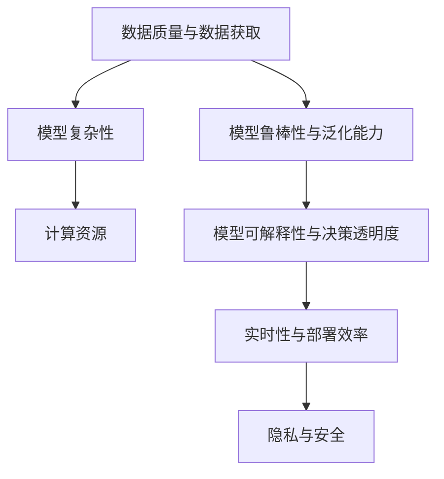

                 

## 1. 背景介绍

### 1.1 问题由来
随着人工智能(AI)技术的迅猛发展，其在各行业中的应用日益广泛。无论是智能客服、智能推荐系统、自动驾驶，还是医疗影像诊断、金融风控、工业质检，AI技术正逐步改变各行各业的生产效率和工作模式。然而，在实际应用中，AI技术也面临着诸多挑战，这些挑战不仅影响着AI系统的性能，还影响着其应用范围和商业落地。

### 1.2 问题核心关键点
AI技术在实际应用中面临的核心挑战主要包括：

- **数据质量与数据获取成本**：数据是AI技术的基石，但高质量数据获取成本高昂，且数据质量难以保证。
- **模型复杂性与计算资源**：AI模型通常参数量庞大，计算资源需求高，导致训练和推理成本高企。
- **模型鲁棒性与泛化能力**：模型面对新样本或噪声数据的泛化能力不足，容易出现过拟合或灾难性遗忘。
- **可解释性与决策透明度**：许多AI模型特别是深度神经网络模型，其决策过程缺乏可解释性，难以满足监管和伦理需求。
- **实时性与部署效率**：AI系统往往需要实时响应，如何在保证性能的同时提高部署效率，是关键问题。
- **隐私与安全**：AI系统在处理敏感数据时，如何保护用户隐私和数据安全，防止数据泄露和滥用。

这些挑战直接影响到AI技术的实用性和可持续性，需要通过技术创新和管理优化来加以应对。

## 2. 核心概念与联系

### 2.1 核心概念概述

为更好地理解AI技术在实际应用中面临的挑战，本节将介绍几个核心概念及其相互关系：

- **数据质量与数据获取**：高质量数据是AI技术成功的基础，数据质量直接影响模型性能。数据获取成本高昂，且数据标注和清洗工作量大，需要多轮验证。
- **模型复杂性**：AI模型尤其是深度神经网络，参数量庞大，计算资源需求高。模型复杂性与计算资源是制约AI技术应用的重要瓶颈。
- **模型鲁棒性与泛化能力**：模型在不同数据集和环境下的鲁棒性和泛化能力是衡量模型性能的重要指标，决定了模型在不同场景下的应用效果。
- **可解释性与决策透明度**：AI模型的决策过程难以解释，特别是在涉及人类生命和财产安全的关键决策中，缺乏透明度难以获得用户信任。
- **实时性与部署效率**：AI系统需要实时响应，部署效率直接影响用户体验。
- **隐私与安全**：AI系统在处理敏感数据时，数据隐私和安全保护是关键问题，需要防止数据泄露和滥用。

这些核心概念之间的逻辑关系可以通过以下Mermaid流程图来展示：



这个流程图展示了数据质量、模型复杂性、计算资源、模型鲁棒性、可解释性、实时性和隐私安全之间的相互关系。

## 3. 核心算法原理 & 具体操作步骤
### 3.1 算法原理概述

在AI技术应用中，面临的主要挑战之一是如何平衡模型的复杂性、计算资源和性能要求。这需要一种高效、可扩展的算法，能够在有限的资源下，获得最佳的模型性能。

### 3.2 算法步骤详解

以下以基于监督学习的神经网络模型为例，介绍AI技术在实际应用中的常见步骤：

**Step 1: 数据预处理**
- 数据清洗：去除噪声、缺失值、重复数据等。
- 数据增强：通过数据增强技术，如旋转、平移、缩放等，扩充数据集。
- 数据标准化：归一化、标准化等操作，使数据具备相似的分布。

**Step 2: 模型设计**
- 选择合适的模型架构，如卷积神经网络(CNN)、循环神经网络(RNN)、变压器(Transformer)等。
- 设计合适的损失函数，如交叉熵、均方误差等。
- 设置模型参数，如学习率、批大小、迭代轮数等。

**Step 3: 模型训练**
- 将数据集分为训练集、验证集和测试集。
- 使用梯度下降等优化算法，在训练集上进行模型训练。
- 周期性在验证集上评估模型性能，避免过拟合。
- 在测试集上评估模型性能，完成模型的部署。

**Step 4: 模型微调**
- 根据实际需求，调整模型结构和参数，提高模型泛化能力。
- 使用迁移学习等技术，利用预训练模型进行微调。
- 应用正则化技术，如L2正则、Dropout等，防止模型过拟合。

**Step 5: 模型优化**
- 采用模型压缩、剪枝、量化等技术，减少模型大小和计算资源消耗。
- 使用GPU、TPU等高性能计算资源，加速模型训练和推理。
- 引入自动化模型优化工具，如超参数调优、自动混合精度等，提高模型性能。

### 3.3 算法优缺点

基于监督学习的神经网络模型具有以下优点：

- 能够利用大量标注数据进行训练，获得较高精度的模型。
- 模型结构灵活，适用于多种任务和数据类型。
- 通过迁移学习，可以在少量标注数据上快速提升模型性能。

同时，该模型也存在一定的局限性：

- 需要大量计算资源，训练和推理成本高。
- 面对噪声数据和过拟合问题，泛化能力不足。
- 决策过程难以解释，缺乏透明性和可信度。

尽管存在这些局限性，基于监督学习的神经网络模型仍是当前AI技术应用的主流范式。未来相关研究的重点在于如何进一步优化模型设计，降低计算资源消耗，提高模型泛化能力和可解释性。

### 3.4 算法应用领域

基于监督学习的神经网络模型在众多领域得到了广泛应用，例如：

- 计算机视觉：如图像分类、目标检测、图像生成等。通过大规模图像数据进行预训练，在小样本数据上进行微调，获得优异的图像识别能力。
- 自然语言处理(NLP)：如文本分类、情感分析、机器翻译等。通过大规模文本数据进行预训练，在小样本数据上进行微调，获得优异的语言理解和生成能力。
- 推荐系统：如个性化推荐、广告推荐等。通过用户行为数据进行预训练，在小样本数据上进行微调，获得优异的推荐效果。
- 医疗影像诊断：如医学图像识别、病理学分析等。通过医学影像数据进行预训练，在小样本数据上进行微调，提高诊断精度。
- 智能客服：如自动问答、语音识别等。通过客户交互数据进行预训练，在小样本数据上进行微调，提供高效客服服务。

除了这些经典应用外，基于神经网络的AI技术还被创新性地应用到更多场景中，如可控文本生成、自然语言推理、智能导航、智能控制等，为各行业带来了全新的突破。

## 4. 数学模型和公式 & 详细讲解 & 举例说明

### 4.1 数学模型构建

本节将使用数学语言对基于监督学习的神经网络模型进行更加严格的刻画。

记神经网络模型为 $f(x; \theta)$，其中 $x$ 为输入，$\theta$ 为模型参数。假设数据集为 $D=\{(x_i, y_i)\}_{i=1}^N$，$y_i$ 为真实标签。模型的损失函数定义为：

$$
\mathcal{L}(\theta) = \frac{1}{N} \sum_{i=1}^N \ell(f(x_i; \theta), y_i)
$$

其中 $\ell$ 为损失函数，常用的有交叉熵损失、均方误差损失等。

### 4.2 公式推导过程

以下以二分类问题为例，推导交叉熵损失函数及其梯度的计算公式。

假设模型 $f(x; \theta)$ 在输入 $x$ 上的输出为 $\hat{y}=f(x; \theta)$，表示样本属于正类的概率。真实标签 $y \in \{0,1\}$。则二分类交叉熵损失函数定义为：

$$
\ell(f(x; \theta), y) = -[y\log \hat{y} + (1-y)\log (1-\hat{y})]
$$

将其代入损失函数公式，得：

$$
\mathcal{L}(\theta) = -\frac{1}{N}\sum_{i=1}^N [y_i\log f(x_i; \theta)+(1-y_i)\log(1-f(x_i; \theta))]
$$

根据链式法则，损失函数对参数 $\theta_k$ 的梯度为：

$$
\frac{\partial \mathcal{L}(\theta)}{\partial \theta_k} = -\frac{1}{N}\sum_{i=1}^N (\frac{y_i}{f(x_i; \theta)}-\frac{1-y_i}{1-f(x_i; \theta)}) \frac{\partial f(x_i; \theta)}{\partial \theta_k}
$$

其中 $\frac{\partial f(x_i; \theta)}{\partial \theta_k}$ 可进一步递归展开，利用自动微分技术完成计算。

### 4.3 案例分析与讲解

以图像分类为例，展示基于监督学习的神经网络模型的训练过程。

假设有一个二分类图像分类任务，目标是将输入图像 $x$ 分为猫和狗的类别。选取一组标记好的训练集 $D=\{(x_i, y_i)\}_{i=1}^N$，其中 $y_i \in \{0, 1\}$ 表示第 $i$ 个样本为猫或狗。

- **数据预处理**：对图像进行归一化、裁剪、旋转等预处理操作，增强数据多样性。
- **模型设计**：使用卷积神经网络(CNN)作为模型架构，设计合适的损失函数为交叉熵损失。
- **模型训练**：将训练集数据分成批处理数据，通过前向传播计算损失函数，反向传播更新模型参数。
- **模型微调**：在验证集上评估模型性能，调整模型结构和参数，提高模型泛化能力。

最终，通过模型训练和微调，获得一个能够准确识别图像类别的神经网络模型。

## 5. 项目实践：代码实例和详细解释说明
### 5.1 开发环境搭建

在进行AI技术应用实践前，我们需要准备好开发环境。以下是使用Python进行TensorFlow开发的环境配置流程：

1. 安装Anaconda：从官网下载并安装Anaconda，用于创建独立的Python环境。

2. 创建并激活虚拟环境：
```bash
conda create -n tf-env python=3.8 
conda activate tf-env
```

3. 安装TensorFlow：根据CUDA版本，从官网获取对应的安装命令。例如：
```bash
conda install tensorflow-gpu -c conda-forge -c pytorch
```

4. 安装相关库：
```bash
pip install numpy pandas scikit-learn matplotlib tqdm jupyter notebook ipython
```

完成上述步骤后，即可在`tf-env`环境中开始AI技术应用实践。

### 5.2 源代码详细实现

这里我们以图像分类任务为例，给出使用TensorFlow进行卷积神经网络模型训练和微调的代码实现。

首先，定义模型结构：

```python
import tensorflow as tf
from tensorflow.keras import layers, models

model = models.Sequential([
    layers.Conv2D(32, (3, 3), activation='relu', input_shape=(28, 28, 1)),
    layers.MaxPooling2D((2, 2)),
    layers.Conv2D(64, (3, 3), activation='relu'),
    layers.MaxPooling2D((2, 2)),
    layers.Conv2D(64, (3, 3), activation='relu'),
    layers.Flatten(),
    layers.Dense(64, activation='relu'),
    layers.Dense(10, activation='softmax')
])
```

然后，定义损失函数和优化器：

```python
model.compile(optimizer='adam', loss='categorical_crossentropy', metrics=['accuracy'])
```

接着，加载并预处理数据集：

```python
(x_train, y_train), (x_test, y_test) = tf.keras.datasets.mnist.load_data()

x_train = x_train / 255.0
x_test = x_test / 255.0

x_train = tf.expand_dims(x_train, axis=-1)
x_test = tf.expand_dims(x_test, axis=-1)
```

最后，进行模型训练和微调：

```python
history = model.fit(x_train, y_train, batch_size=32, epochs=10, validation_data=(x_test, y_test))

# 微调模型
model.trainable = True
model.compile(optimizer='adam', loss='categorical_crossentropy', metrics=['accuracy'])
history = model.fit(x_train, y_train, batch_size=32, epochs=10, validation_data=(x_test, y_test))
```

以上就是使用TensorFlow进行卷积神经网络模型训练和微调的完整代码实现。可以看到，TensorFlow提供了一体化的模型训练和微调接口，使得开发者能够快速构建和优化模型。

### 5.3 代码解读与分析

让我们再详细解读一下关键代码的实现细节：

**模型结构定义**：
- 使用`tf.keras.Sequential`定义多层神经网络结构。
- 采用卷积层、池化层、全连接层等组件构建模型。
- 使用`input_shape`定义输入张量维度。

**损失函数和优化器设置**：
- 使用`model.compile`方法，设置损失函数、优化器和评价指标。
- 使用`adam`优化器，适用于大规模数据集训练。
- 使用`categorical_crossentropy`损失函数，适用于多分类问题。

**数据预处理**：
- 使用`tf.keras.datasets.mnist.load_data`加载MNIST数据集。
- 对图像数据进行归一化处理，将像素值缩放到0-1之间。
- 使用`tf.expand_dims`添加通道维度，使得数据符合模型输入要求。

**模型训练和微调**：
- 使用`model.fit`方法进行模型训练，指定批大小和迭代轮数。
- 在训练过程中，使用`validation_data`参数指定验证集，评估模型性能。
- 在微调过程中，通过`model.trainable`属性打开模型的可训练性，继续使用`model.compile`方法设置损失函数和优化器。
- 再次使用`model.fit`方法进行微调训练，并在验证集上评估模型性能。

可以看到，TensorFlow提供了一整套完整的模型训练和微调接口，使得开发者能够轻松地构建、训练和优化模型。

## 6. 实际应用场景
### 6.1 智能推荐系统

基于神经网络的AI技术在智能推荐系统中的应用，极大地提升了用户推荐体验和推荐效果。智能推荐系统通过分析用户行为数据，利用神经网络模型学习用户兴趣和偏好，从而提供个性化的推荐内容。

在技术实现上，可以采用用户-物品互动数据进行预训练，通过微调神经网络模型，学习用户对不同物品的评分预测。在生成推荐列表时，先用候选物品的数据作为模型输入，由模型预测用户的评分，再结合其他特征综合排序，便可以得到个性化程度更高的推荐结果。

### 6.2 医疗影像诊断

AI技术在医疗影像诊断中的应用，显著提高了医疗诊断的准确性和效率。传统医疗影像诊断依赖于医生的经验，耗时长且容易出错。而使用基于神经网络的AI模型，可以在海量医疗影像数据上进行预训练，通过微调模型，使其能够自动检测和诊断不同类型的医疗影像，如X光片、CT、MRI等。

在技术实现上，可以采用大规模医疗影像数据进行预训练，通过微调模型，学习医疗影像中不同类型的病变特征。在实际应用中，医生可以借助AI模型快速诊断疾病，减少误诊和漏诊，提高诊断效率。

### 6.3 智能客服

基于神经网络的AI技术在智能客服中的应用，可以显著提升客服服务质量和效率。智能客服系统通过自然语言处理(NLP)技术，利用神经网络模型理解用户问题，自动生成和回复客服答案。

在技术实现上，可以采用历史客服对话记录进行预训练，通过微调神经网络模型，使其能够自动理解和生成自然语言对话。在实际应用中，智能客服系统可以24小时不间断地响应用户咨询，快速解答常见问题，提供高效客服服务。

### 6.4 未来应用展望

随着AI技术的不断进步，基于神经网络的AI技术将在更多领域得到应用，为各行业带来变革性影响。

- **智慧医疗**：基于AI技术的医疗影像诊断、电子病历分析、药物研发等应用将提升医疗服务的智能化水平，辅助医生诊疗，加速新药开发进程。
- **智能教育**：基于AI技术的作业批改、学情分析、知识推荐等应用将提升教育服务的智能化水平，因材施教，促进教育公平，提高教学质量。
- **智慧城市**：基于AI技术的交通管理、环境监测、安防监控等应用将提升城市治理的智能化水平，构建更安全、高效的未来城市。
- **金融风控**：基于AI技术的欺诈检测、风险评估、智能投顾等应用将提升金融服务的智能化水平，提高风险控制和收益管理能力。

此外，在智能制造、智能物流、智能家居等众多领域，基于神经网络的AI技术也将不断涌现，为各行业带来新的变革。相信随着AI技术的不断发展，基于神经网络的AI技术必将在更广泛的领域得到应用，为经济社会发展注入新的动力。

## 7. 工具和资源推荐
### 7.1 学习资源推荐

为了帮助开发者系统掌握神经网络模型的构建和微调技术，这里推荐一些优质的学习资源：

1. 《深度学习》课程：斯坦福大学Andrew Ng教授的深度学习课程，系统讲解深度学习的基本概念和经典模型。
2. 《动手学深度学习》书籍：清华大学教授和研究人员的深度学习实践指南，包含大量代码示例和应用案例。
3. 《TensorFlow实战Google深度学习框架》书籍：Google官方深度学习框架TensorFlow的入门和实战指南。
4. 《PyTorch深度学习》书籍：PyTorch深度学习框架的入门和实战指南，包含大量代码示例和应用案例。
5. 《自然语言处理综论》书籍：斯坦福大学教授的NLP领域经典教材，涵盖自然语言处理的理论基础和应用实践。

通过对这些资源的学习实践，相信你一定能够快速掌握神经网络模型的构建和微调技术，并用于解决实际的AI问题。

### 7.2 开发工具推荐

高效的开发离不开优秀的工具支持。以下是几款用于神经网络模型构建和微调开发的常用工具：

1. PyTorch：基于Python的开源深度学习框架，灵活动态的计算图，适合快速迭代研究。
2. TensorFlow：由Google主导开发的开源深度学习框架，生产部署方便，适合大规模工程应用。
3. Keras：基于TensorFlow和Theano的高级深度学习框架，易于上手，适合初学者和应用开发者。
4. MXNet：由Apache开发的开源深度学习框架，支持分布式计算，适合大规模分布式训练。
5. Caffe：由Berkeley Vision and Learning Center开发的深度学习框架，适合计算机视觉应用开发。

合理利用这些工具，可以显著提升神经网络模型构建和微调任务的开发效率，加快创新迭代的步伐。

### 7.3 相关论文推荐

神经网络模型的研究和应用不断进步，以下是几篇奠基性的相关论文，推荐阅读：

1. AlexNet：深度神经网络在ImageNet大规模视觉识别挑战赛中的突破性应用。
2. VGGNet：通过增加网络深度和宽度，进一步提升图像分类精度。
3. GoogLeNet：提出Inception模块，提高模型训练速度和泛化能力。
4. ResNet：通过残差连接解决深度网络退化问题，使网络更深。
5. Transformer：提出自注意力机制，使模型能够高效处理长序列数据。
6. BERT：提出预训练语言模型，极大提升自然语言理解能力。

这些论文代表了大规模深度学习模型的发展脉络。通过学习这些前沿成果，可以帮助研究者把握学科前进方向，激发更多的创新灵感。

## 8. 总结：未来发展趋势与挑战
### 8.1 总结

本文对基于神经网络的AI技术在实际应用中面临的主要挑战进行了全面系统的介绍。首先阐述了AI技术在各行业应用中的成功案例，明确了当前技术面临的瓶颈问题。其次，从原理到实践，详细讲解了神经网络模型的构建和微调过程，给出了实际应用中的代码实例。同时，本文还广泛探讨了AI技术在智能推荐、医疗影像、智能客服等众多行业领域的应用前景，展示了AI技术的巨大潜力。此外，本文精选了AI技术应用的各类学习资源，力求为读者提供全方位的技术指引。

通过本文的系统梳理，可以看到，基于神经网络的AI技术正在成为各行业应用的重要范式，极大地提升了生产效率和用户体验。然而，在实际应用中，仍需面对诸多挑战，如数据质量、模型复杂性、计算资源、模型鲁棒性、可解释性、实时性、隐私安全等。这些挑战需要通过技术创新和管理优化来加以应对。

### 8.2 未来发展趋势

展望未来，基于神经网络的AI技术将呈现以下几个发展趋势：

1. **模型规模持续增大**：随着算力成本的下降和数据规模的扩张，神经网络模型的参数量还将持续增长。超大规模神经网络模型蕴含的丰富知识，有望支撑更加复杂多变的任务。
2. **模型压缩与优化**：为了降低计算资源消耗，模型压缩、剪枝、量化等技术将不断改进，使得模型更轻量级，适合边缘计算和嵌入式设备。
3. **模型融合与协同**：神经网络模型将与其他AI技术如知识图谱、逻辑推理、强化学习等进行融合，提升模型的综合能力和泛化能力。
4. **模型可解释性与透明化**：模型决策过程的透明性和可解释性将受到更多关注，开发更多可解释性强的模型和工具，提高模型可信度。
5. **模型实时性与优化**：模型实时性将得到更多关注，采用模型压缩、混合精度训练、模型并行等技术，提高模型推理速度和部署效率。
6. **模型隐私与安全**：数据隐私和安全保护将得到更多重视，采用差分隐私、联邦学习等技术，保护用户隐私和数据安全。

这些趋势凸显了基于神经网络的AI技术的广阔前景。这些方向的探索发展，必将进一步提升AI系统的性能和应用范围，为各行业带来更深远的影响。

### 8.3 面临的挑战

尽管基于神经网络的AI技术已经取得了瞩目成就，但在迈向更加智能化、普适化应用的过程中，仍面临着诸多挑战：

1. **数据质量与获取成本**：高质量数据获取成本高昂，数据标注和清洗工作量大，制约着模型的训练和优化。
2. **模型复杂性与计算资源**：神经网络模型参数量庞大，计算资源需求高，导致训练和推理成本高企。
3. **模型鲁棒性与泛化能力**：模型面对噪声数据和过拟合问题，泛化能力不足，容易出现灾难性遗忘。
4. **可解释性与决策透明度**：神经网络模型决策过程难以解释，缺乏透明性和可信度，难以满足监管和伦理需求。
5. **实时性与部署效率**：AI系统需要实时响应，如何在保证性能的同时提高部署效率，是关键问题。
6. **隐私与安全**：AI系统在处理敏感数据时，数据隐私和安全保护是关键问题，需要防止数据泄露和滥用。

这些挑战直接影响到AI技术的实用性和可持续性，需要通过技术创新和管理优化来加以应对。

### 8.4 研究展望

面对AI技术在实际应用中面临的诸多挑战，未来的研究需要在以下几个方面寻求新的突破：

1. **探索无监督和半监督学习**：摆脱对大规模标注数据的依赖，利用自监督学习、主动学习等无监督和半监督范式，最大限度利用非结构化数据，实现更加灵活高效的AI技术。
2. **研究模型压缩与优化技术**：开发更加模型压缩、剪枝、量化等技术，在固定大部分预训练参数的同时，只更新极少量的任务相关参数，减小计算资源消耗。
3. **引入更多先验知识**：将符号化的先验知识，如知识图谱、逻辑规则等，与神经网络模型进行巧妙融合，引导AI技术学习更准确、合理的知识表示。
4. **结合因果分析和博弈论工具**：将因果分析方法引入AI技术，识别出模型决策的关键特征，增强输出的因果性和逻辑性。借助博弈论工具刻画人机交互过程，主动探索并规避模型的脆弱点，提高系统稳定性。
5. **纳入伦理道德约束**：在AI技术开发目标中引入伦理导向的评估指标，过滤和惩罚有害的输出倾向，确保输出的安全性和合法性。

这些研究方向的探索，必将引领AI技术迈向更高的台阶，为构建安全、可靠、可解释、可控的智能系统铺平道路。面向未来，基于神经网络的AI技术还需要与其他AI技术进行更深入的融合，如知识表示、因果推理、强化学习等，多路径协同发力，共同推动AI技术的发展和应用。

## 9. 附录：常见问题与解答

**Q1：如何优化神经网络模型的训练过程？**

A: 优化神经网络模型的训练过程，可以从以下几个方面进行：
1. **学习率调整**：选择合适的学习率，避免过大或过小。一般建议使用warmup策略，开始阶段使用较小的学习率，再逐渐过渡到预设值。
2. **批大小**：选择合适的批大小，一般在2的幂次方上选择，如32、64、128等。
3. **正则化**：使用L2正则、Dropout等技术，防止过拟合。
4. **模型初始化**：选择合适的模型初始化方法，如Xavier、He等，有助于模型更快收敛。
5. **随机梯度下降(SGD)**：使用随机梯度下降等优化算法，避免陷入局部最优解。
6. **学习率调度**：使用学习率衰减、动态学习率等方法，在训练后期逐步降低学习率，提升模型泛化能力。

**Q2：神经网络模型如何处理小样本数据？**

A: 神经网络模型在面对小样本数据时，容易出现过拟合问题。以下几种方法可以缓解这个问题：
1. **数据增强**：通过对原始数据进行旋转、平移、缩放等变换，扩充数据集。
2. **迁移学习**：利用大规模预训练模型，在少量标注数据上进行微调，利用迁移学习提升模型泛化能力。
3. **少样本学习**：采用基于计算图的方法，如Neural Architecture Search(NAS)等，在少量样本上进行模型搜索和优化。
4. **零样本学习**：通过预训练模型的语言理解和生成能力，对新样本进行推理预测，无需更新模型参数。

**Q3：如何优化神经网络模型的推理效率？**

A: 神经网络模型的推理效率可以通过以下方法进行优化：
1. **模型压缩与剪枝**：通过剪枝技术，删除冗余连接和参数，减小模型大小和计算资源消耗。
2. **量化加速**：将浮点模型转为定点模型，压缩存储空间，提高计算效率。
3. **模型并行**：采用模型并行技术，将模型分布在多个计算设备上，并行计算，提高推理速度。
4. **硬件加速**：使用GPU、TPU等高性能计算资源，加速模型推理。
5. **推理优化**：采用推理优化技术，如动态计算图、模型蒸馏等，提高推理效率。

**Q4：神经网络模型的决策过程如何解释？**

A: 神经网络模型的决策过程通常难以解释，以下几种方法可以尝试解释模型决策：
1. **梯度热力图**：展示模型在输入空间中的梯度分布，帮助理解模型学习到的关键特征。
2. **特征重要性分析**：使用特征重要性分析技术，如SHAP、LIME等，评估每个特征对模型输出的影响。
3. **模型可视化**：采用模型可视化技术，如t-SNE、PCA等，展示模型在输入空间中的分布和变化。
4. **规则提取**：使用规则提取技术，如决策树、规则归纳等，从模型中提取显式规则和特征，帮助理解模型决策。
5. **人机交互**：设计友好的人机交互界面，通过问答、提示等形式，帮助用户理解模型输出。

**Q5：神经网络模型如何保护数据隐私和安全？**

A: 神经网络模型在处理敏感数据时，数据隐私和安全保护是关键问题，以下几种方法可以保护数据隐私和安全：
1. **差分隐私**：在模型训练过程中引入噪声，保护数据隐私。
2. **联邦学习**：将模型训练任务分布到多个计算设备上，避免数据集中存储。
3. **模型蒸馏**：使用蒸馏技术，将大规模模型压缩为轻量级模型，减少数据泄露风险。
4. **数据脱敏**：在数据预处理阶段，对敏感数据进行脱敏处理，保护数据隐私。
5. **访问控制**：采用访问控制技术，限制对敏感数据的访问权限，防止数据滥用。

通过以上方法的综合应用，可以有效保护神经网络模型在处理敏感数据时的数据隐私和安全。

---

作者：禅与计算机程序设计艺术 / Zen and the Art of Computer Programming

