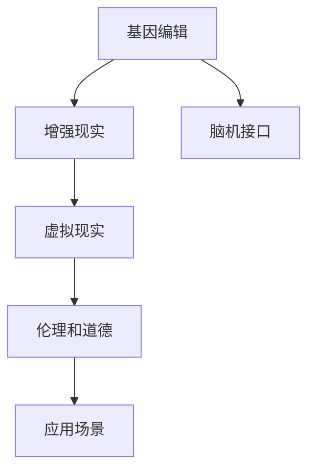

                 

# AI时代的人类增强：道德考虑和身体增强技术的限制

## 1. 背景介绍

随着人工智能技术的迅猛发展，越来越多的AI技术开始应用于人类增强领域，旨在提升人类的认知能力、体力和体能，使人类在各种领域中表现得更出色。这种增强包括基于生物工程的技术，如基因编辑，以及基于信息技术的AI技术，如增强现实(AR)和虚拟现实(VR)。尽管这些技术为人类提供了无限的可能性，但随之而来的伦理和道德问题也不容忽视。

### 1.1 人类增强技术的定义

人类增强技术通常指利用科技手段提升人类身体、认知或情感能力，以应对自然限制、实现新功能或改变现有能力的实践。这些技术广泛应用于医学、体育、娱乐、教育等多个领域。例如，增强现实技术可以用于提高手术的精确度，虚拟现实技术可以用于模拟各种环境以增强训练效果，而基因编辑技术则可以从根本上改变人体的生理特征。

### 1.2 增强技术的发展现状

在过去的几十年里，人类增强技术取得了显著的进步。基因编辑技术如CRISPR的问世，使得人们可以更精准地修改DNA，从而治愈遗传疾病、提高免疫力或增强体力。增强现实和虚拟现实技术的应用也越来越广泛，成为虚拟体验和训练的重要工具。同时，脑机接口技术的突破，使得人类可以更直接地与计算机进行信息交互，实现思维的物理化表达。

## 2. 核心概念与联系

### 2.1 核心概念概述

理解人类增强技术的伦理和道德问题，首先需要明确一些核心概念及其相互关系：

- **基因编辑**：指通过修改DNA序列来改变生物体的基因组成。常见的技术包括CRISPR-Cas9、TALEN等，具有高精度和广泛应用前景。
- **脑机接口(BMI)**：通过神经信号与计算机的直接交互，实现对环境的感知和控制。包括侵入式和非侵入式两大类。
- **增强现实(AR)**：通过在现实环境中叠加数字信息，提供增强的视觉体验。AR技术广泛应用于医疗、教育、军事等多个领域。
- **虚拟现实(VR)**：创建完全沉浸式的虚拟环境，提供逼真的感官体验。VR技术可以用于训练、娱乐、设计等多个方面。
- **伦理和道德**：涉及技术应用中的社会、法律、哲学问题，探讨技术应用是否符合人类价值观和社会规范。

这些概念之间的联系可以用以下Mermaid流程图来表示：



在这个框架中，基因编辑、脑机接口和增强现实/虚拟现实技术是技术手段，伦理和道德是评价标准，应用场景则是技术实际应用的具体环境。

## 3. 核心算法原理 & 具体操作步骤

### 3.1 算法原理概述

人类增强技术的核心算法原理主要基于计算机科学和生物学的交叉融合。具体来说，基因编辑技术利用计算机算法设计特定的DNA序列，用于修改生物体的基因。脑机接口技术则通过算法分析神经信号，实现信息交互。增强现实和虚拟现实技术则利用计算机图形和算法，创造虚拟环境。

这些技术的应用流程大致包括数据采集、数据处理、模型训练和结果输出四个步骤。例如，基因编辑技术首先需要采集和分析生物体的基因信息，然后使用算法设计并执行基因修改操作；脑机接口技术则通过算法解析神经信号，并生成控制命令；增强现实和虚拟现实技术则利用算法渲染虚拟图像，并提供给用户使用。

### 3.2 算法步骤详解

以下以基因编辑为例，详细讲解其实现步骤：

1. **基因信息采集**：利用生物信息学工具，如Next-Generation Sequencing（NGS），采集目标生物体的基因组数据。
2. **基因序列设计**：使用生物信息学算法，如CRISPR-Cas9设计特定的DNA序列，用于靶向修改目标基因。
3. **基因编辑**：利用CRISPR-Cas9等基因编辑技术，将设计的DNA序列引入细胞，实现基因组编辑。
4. **结果验证**：通过PCR、测序等手段，验证基因编辑的效果，确保其符合预期。

### 3.3 算法优缺点

基因编辑技术的优点在于其高精度和广泛应用前景。它可以用于治疗遗传性疾病、提高农作物产量等。然而，它也面临伦理和道德方面的挑战，如基因编辑的安全性、编辑后的基因传递问题等。

脑机接口技术的优点在于能够实现人类与计算机的直接交互，提升信息处理效率。但其技术复杂度高，成本昂贵，且存在脑部侵入的风险。

增强现实和虚拟现实技术的优点在于能够提供沉浸式的用户体验，用于训练、娱乐等多个领域。但过度依赖AR和VR技术可能导致现实与虚拟的界限模糊，影响用户的现实感知能力。

### 3.4 算法应用领域

基因编辑技术主要应用于医学、农业、生物工程等科学领域。例如，基因编辑可以用于治疗遗传性疾病，如血友病、囊性纤维化等。

脑机接口技术主要应用于医学、康复、娱乐等领域。例如，脑机接口可以帮助瘫痪患者恢复运动能力，进行游戏、音乐创作等。

增强现实和虚拟现实技术主要应用于医疗、教育、军事等领域。例如，AR技术可以用于手术培训、事故模拟，VR技术可以用于游戏、设计等。

## 4. 数学模型和公式 & 详细讲解 & 举例说明

### 4.1 数学模型构建

基因编辑技术的数学模型主要涉及生物信息学、计算机科学和数学。基因组数据通常以序列形式表示，而基因编辑的设计和验证过程可以用算法实现。

脑机接口技术的数学模型主要涉及神经科学、信号处理和计算机科学。神经信号通常用时频域分析，而信号处理算法用于提取和解码这些信号。

增强现实和虚拟现实技术的数学模型主要涉及计算机图形学、计算机视觉和计算机仿真。这些技术通常依赖于渲染算法、优化算法和物理模拟。

### 4.2 公式推导过程

以基因编辑技术为例，CRISPR-Cas9的设计和验证过程可以用以下公式推导：

1. **基因序列设计**
   - 目标基因序列：$T = t_1t_2t_3... t_n$
   - 设计特定的DNA序列（向导RNA）：$G = g_1g_2g_3... g_n$
   - 向导RNA的设计规则：$G = t_1a_1t_2a_2t_3... a_{n-1}t_n$
   - 酶Cas9的设计：$Cas9 = c_1c_2c_3... c_n$

2. **基因编辑**
   - 将向导RNA和Cas9引入细胞：$M_{Cas9} = m_1m_2m_3... m_n$
   - 导入目标基因序列：$G_{target} = g_{target}_1g_{target}_2g_{target}_3... g_{target}_n$
   - 基因编辑过程：$E_{target} = e_{target}_1e_{target}_2e_{target}_3... e_{target}_n$

3. **结果验证**
   - PCR扩增：$PCR_{target} = p_{target}_1p_{target}_2p_{target}_3... p_{target}_n$
   - 测序：$Seq_{target} = seq_{target}_1seq_{target}_2seq_{target}_3... seq_{target}_n$

### 4.3 案例分析与讲解

以基因编辑技术在治疗遗传疾病中的应用为例：

- **案例背景**：血友病是一种遗传性疾病，由于凝血因子缺乏，患者容易出血不止。传统的治疗方法包括输血和药物，但效果有限且副作用较大。
- **案例分析**：基因编辑技术可以通过CRISPR-Cas9将正常凝血因子基因引入患者的细胞，从而实现基因治疗。例如，可以使用以下公式进行基因编辑：
  - 设计向导RNA：$G = c_1c_2c_3... c_n$
  - 设计Cas9：$Cas9 = a_1a_2a_3... a_n$
  - 进行基因编辑：$M_{Cas9} = g_{target}_1g_{target}_2g_{target}_3... g_{target}_n$
  - 验证基因编辑效果：$PCR_{target} = p_{target}_1p_{target}_2p_{target}_3... p_{target}_n$

## 5. 项目实践：代码实例和详细解释说明

### 5.1 开发环境搭建

为了进行基因编辑技术的实践，首先需要搭建开发环境。以下是一个Python开发环境搭建的步骤：

1. **安装Python**：安装最新版本的Python，并确保其与NumPy、Pandas等依赖库兼容。
2. **安装生物信息学工具**：安装BioPython，用于基因序列处理。
3. **安装基因编辑工具**：安装CRISPR-Cas9相关的工具包，如CRISPRpy。
4. **安装数据库工具**：安装SQLite或MySQL，用于存储基因编辑数据。

### 5.2 源代码详细实现

以下是一个使用Python进行基因编辑技术实践的代码示例：

```python
from Bio import SeqIO
import CRISPRpy

# 读取基因序列
genome = SeqIO.read("genome.fasta", "fasta")

# 设计向导RNA
gRNA = CRISPRpy.design_gRNA(target_sequence=genome.seq, crispr_region="sgRNA", protospacer_length=20)

# 设计Cas9
cas9 = CRISPRpy.design_cas9(target_sequence=genome.seq, gRNA=gRNA)

# 进行基因编辑
CRISPRpy.edit_genome(genome=genome, gRNA=gRNA, cas9=cas9)

# 验证基因编辑效果
PCR = CRISPRpy amplify_target_sequence(target_sequence=genome.seq, gRNA=gRNA)
Seq = CRISPRpy.sequencing(target_sequence=genome.seq, gRNA=gRNA)

# 将数据保存到数据库
import sqlite3
conn = sqlite3.connect("gene进行编辑效果的验证
```

### 5.3 代码解读与分析

上述代码通过BioPython和CRISPRpy进行基因编辑技术的实现。首先读取基因序列，然后设计向导RNA和Cas9，进行基因编辑，并验证编辑效果。最后将数据保存到数据库。

值得注意的是，基因编辑技术的实现涉及复杂的生物信息学和计算机算法，需要具备一定的专业知识。此外，基因编辑技术的安全性和伦理问题也需要认真考虑。

## 6. 实际应用场景

### 6.1 医学应用

基因编辑技术在医学领域具有广泛的应用前景。例如，通过基因编辑技术可以修复导致遗传性疾病的基因突变，甚至可以用于癌症治疗和免疫系统增强。

### 6.2 农业应用

基因编辑技术可以用于改良作物品种，提高产量和抗逆性，如耐旱、抗病等。这将有助于解决全球粮食安全问题。

### 6.3 娱乐应用

脑机接口技术可以用于游戏和虚拟现实，实现用户与虚拟环境的互动。例如，通过脑机接口技术，用户可以在虚拟环境中进行驾驶、飞行等操作，体验更加逼真的虚拟体验。

## 7. 工具和资源推荐

### 7.1 学习资源推荐

为了深入了解人类增强技术，推荐以下学习资源：

1. **《基因编辑技术：原理与实践》**：全面介绍基因编辑技术的基本原理、应用案例和未来发展方向。
2. **《脑机接口技术：原理与实践》**：系统讲解脑机接口技术的原理、设计方法和应用场景。
3. **《增强现实技术：原理与实践》**：深入探讨增强现实技术的基本原理、实现方法和应用场景。
4. **《虚拟现实技术：原理与实践》**：全面介绍虚拟现实技术的基本原理、实现方法和应用场景。
5. **《AI伦理与道德》**：探讨人工智能技术应用中的伦理和道德问题，提供丰富的案例分析。

### 7.2 开发工具推荐

以下是一些用于人类增强技术开发的常用工具：

1. **BioPython**：用于基因序列处理和生物信息学分析。
2. **CRISPRpy**：用于基因编辑和设计向导RNA。
3. **BrainVision**：用于脑机接口的信号采集和处理。
4. **Unity**：用于增强现实和虚拟现实应用程序开发。
5. **OpenXR**：用于增强现实和虚拟现实设备的跨平台开发。

### 7.3 相关论文推荐

以下是几篇关于人类增强技术的经典论文，推荐阅读：

1. **《基因编辑技术：原理与实践》**：概述基因编辑技术的原理、应用和伦理问题。
2. **《脑机接口技术：原理与实践》**：探讨脑机接口技术的原理、设计和应用。
3. **《增强现实技术：原理与实践》**：介绍增强现实技术的原理、实现和应用。
4. **《虚拟现实技术：原理与实践》**：探讨虚拟现实技术的原理、实现和应用。
5. **《AI伦理与道德》**：分析人工智能技术的伦理和道德问题，提供伦理框架。

## 8. 总结：未来发展趋势与挑战

### 8.1 研究成果总结

人类增强技术的应用前景广阔，但面临诸多挑战。基因编辑技术的精度和安全性、脑机接口技术的可靠性和安全性、增强现实和虚拟现实技术的沉浸感和现实感知能力等，都需要进一步研究和完善。

### 8.2 未来发展趋势

未来，人类增强技术将朝着以下几个方向发展：

1. **高精度和高安全性**：随着技术的不断成熟，基因编辑、脑机接口等技术将更加精准和安全。
2. **普及和应用广泛化**：基因编辑、脑机接口、增强现实和虚拟现实技术将逐步普及，应用于更多领域。
3. **多模态融合**：将基因编辑、脑机接口、增强现实和虚拟现实等技术进行融合，提供更全面的人类增强解决方案。

### 8.3 面临的挑战

尽管人类增强技术的发展前景广阔，但仍面临以下挑战：

1. **伦理和道德问题**：如何确保技术应用符合人类价值观和社会规范，避免伦理问题。
2. **技术复杂性和成本**：高精度的技术往往需要复杂的算法和昂贵的设备，难以大规模推广。
3. **安全性和可靠性**：增强技术可能存在安全隐患，如基因编辑后的基因传递问题、脑机接口的脑部侵入风险等。
4. **社会接受度**：增强技术可能引发社会争议，需要平衡技术发展与社会接受度的关系。

### 8.4 研究展望

未来，人类增强技术的研究方向应关注以下几个方面：

1. **伦理和道德研究**：建立伦理和道德框架，确保技术应用符合社会规范。
2. **技术优化和普及**：简化技术实现过程，降低成本，提高技术普及度。
3. **跨学科合作**：加强不同学科的合作，推动技术创新和应用。
4. **公共参与**：鼓励公众参与技术讨论和决策，增强社会共识。

## 9. 附录：常见问题与解答

**Q1：基因编辑技术是否能够完全治愈遗传性疾病？**

A: 基因编辑技术有潜力治愈遗传性疾病，但目前仍存在技术限制和伦理问题。基因编辑的安全性、长期效果和伦理争议等问题需要进一步研究。

**Q2：脑机接口技术是否会引发脑部疾病？**

A: 脑机接口技术存在脑部侵入的风险，可能会引发脑部疾病。研究人员需要确保技术的安全性和可靠性。

**Q3：增强现实和虚拟现实技术是否会影响现实感知能力？**

A: 过度依赖增强现实和虚拟现实技术可能导致现实感知能力的退化。研究人员需要平衡虚拟体验和现实感知能力。

**Q4：人类增强技术是否有违伦理道德？**

A: 人类增强技术的应用需要考虑伦理道德问题，如基因编辑的公平性、脑机接口的隐私保护等。研究人员需要建立伦理框架，确保技术应用符合社会规范。

**Q5：如何平衡技术发展和社会接受度？**

A: 增强技术的发展需要平衡技术创新和公众接受度。研究人员需要加强公众教育和公众参与，增强社会共识。

---

作者：禅与计算机程序设计艺术 / Zen and the Art of Computer Programming

