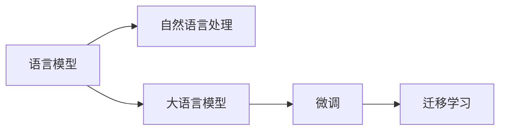

                 

# AI时代的自然语言处理发展：从学术到产业应用

在人工智能(AI)快速发展的今天，自然语言处理(Natural Language Processing, NLP)正成为连接人类与计算机的重要桥梁。从早期的基于规则的专家系统，到近年来的深度学习模型，NLP技术不断突破，广泛应用于搜索、推荐、翻译、问答、语音识别等诸多领域。本文将深入探讨AI时代下NLP的发展历程、核心技术、应用场景及其未来趋势，期待为您提供一个全方位的视角，帮助您更好地理解这一领域的最新动态。

## 1. 背景介绍

### 1.1 问题的由来

NLP作为人工智能的重要分支，旨在使计算机理解、处理和生成自然语言。其研究可追溯至20世纪50年代，早期基于规则的方法逐渐被数据驱动的统计模型所取代。尤其是2006年，深度学习模型在NLP任务中取得突破性进展，开启了基于神经网络的大模型时代。

近年来，大语言模型(Big Language Models, BLMs)，如BERT、GPT等，通过在大规模无标签文本上自监督预训练，学习丰富的语言知识和常识，并可以在下游任务上进行微调，实现高精度的自然语言处理。然而，尽管大模型取得了显著成就，但其在学术研究与产业应用中的表现仍存在差异，如何从学术走向产业成为当下亟待解决的问题。

### 1.2 问题核心关键点

在从学术走向产业的过程中，NLP面临的关键问题包括：

1. **数据质量与标注成本**：NLP任务的标注数据通常成本高、获取难，如何降低标注成本，提高数据质量，是实现规模化落地的一个主要挑战。
2. **模型可解释性与鲁棒性**：大模型的黑盒特性使其决策过程难以解释，且面对异常输入容易发生错误。如何提高模型的可解释性和鲁棒性，保障应用场景的安全可靠，是另一个核心议题。
3. **实时性与计算效率**：大模型往往计算资源需求大，推理速度慢。如何优化模型结构，提高实时性，是产业应用中的重要考量。
4. **跨领域迁移能力**：大模型在特定领域表现优异，但泛化能力受限。如何增强模型的跨领域迁移能力，使其在更多场景下保持高水平性能，是未来发展的一个方向。

## 2. 核心概念与联系

### 2.1 核心概念概述

在深入探讨NLP技术之前，让我们先了解几个核心概念：

- **自然语言处理(NLP)**：使计算机能够理解和处理人类语言的技术，包括分词、词性标注、命名实体识别、情感分析、机器翻译等。
- **语言模型(Language Model)**：预测文本序列的概率分布，是NLP任务的基础模型。
- **大语言模型(BLMs)**：如BERT、GPT等，通过大规模预训练学习通用语言知识，适用于各种NLP任务。
- **微调(Fine-tuning)**：在大模型基础上，使用少量标注数据优化模型，使其在特定任务上表现更好。
- **迁移学习(Transfer Learning)**：通过在大规模数据上预训练的模型，在特定任务上进行微调，提高模型性能。

这些概念通过Mermaid流程图进行联系，以帮助我们更好地理解NLP技术的核心脉络：



## 3. 核心算法原理 & 具体操作步骤

### 3.1 算法原理概述

NLP的核心算法原理主要包括语言模型、深度学习、大模型和微调等。这些技术共同构成了NLP的基石，使计算机能够理解和生成自然语言。

- **语言模型**：通过统计文本序列的概率分布，预测下一个词或词组的出现概率，是NLP任务的基础。
- **深度学习**：特别是卷积神经网络(CNN)、循环神经网络(RNN)、长短时记忆网络(LSTM)等，为语言模型提供强大的表征学习能力。
- **大模型**：如BERT、GPT等，通过在大规模无标签文本上预训练，学习丰富的语言知识和常识，适用于多种NLP任务。
- **微调**：在大模型基础上，使用少量标注数据优化模型，使其在特定任务上表现更好。

### 3.2 算法步骤详解

NLP的微调过程通常包括以下步骤：

1. **数据准备**：收集标注数据，划分为训练集、验证集和测试集。
2. **模型初始化**：选择合适的预训练模型，如BERT、GPT等。
3. **任务适配**：根据具体任务设计任务适配层，包括分类器、解码器等。
4. **微调训练**：在训练集上使用梯度下降等优化算法训练模型，最小化损失函数。
5. **模型评估**：在验证集和测试集上评估模型性能，调整超参数，直到模型表现达到预期。

### 3.3 算法优缺点

NLP微调技术具有以下优点：

- **高效性**：使用少量标注数据，即可对预训练模型进行快速适配。
- **普适性**：适用于多种NLP任务，包括分类、匹配、生成等。
- **效果显著**：微调技术使得通用预训练模型在大规模数据上表现优异。

同时，也存在以下缺点：

- **数据依赖**：微调的效果很大程度上依赖标注数据的质量和数量。
- **迁移能力有限**：当目标任务与预训练数据的分布差异较大时，微调的性能提升有限。
- **可解释性不足**：微调模型的决策过程难以解释。

### 3.4 算法应用领域

NLP微调技术广泛应用于搜索、推荐、翻译、问答、语音识别等诸多领域：

- **搜索**：通过用户输入的自然语言查询，快速返回相关信息。
- **推荐**：基于用户历史行为和文本数据，推荐感兴趣的物品。
- **翻译**：将一种语言翻译成另一种语言，帮助跨语言交流。
- **问答**：回答用户提出的自然语言问题，如智能客服、智能助手等。
- **语音识别**：将语音信号转换为文本，实现语音输入、语音搜索等。

## 4. 数学模型和公式 & 详细讲解 & 举例说明

### 4.1 数学模型构建

NLP的数学模型构建主要包括以下步骤：

1. **数据预处理**：将文本转换为数字表示，如词袋模型、TF-IDF、Word2Vec等。
2. **模型定义**：定义模型结构，如LSTM、Transformer等。
3. **损失函数**：设计损失函数，如交叉熵、均方误差等。
4. **优化算法**：选择优化算法，如Adam、SGD等。
5. **超参数调整**：调整学习率、批大小、迭代轮数等超参数。

### 4.2 公式推导过程

以分类任务为例，假设模型在输入$x$上的输出为$\hat{y} \in [0,1]$，真实标签为$y \in \{0,1\}$。则二分类交叉熵损失函数定义为：

$$
\ell(M_{\theta}(x),y) = -[y\log \hat{y} + (1-y)\log (1-\hat{y})]
$$

将其代入经验风险公式，得：

$$
\mathcal{L}(\theta) = -\frac{1}{N}\sum_{i=1}^N [y_i\log M_{\theta}(x_i)+(1-y_i)\log(1-M_{\theta}(x_i))]
$$

通过链式法则，损失函数对参数$\theta_k$的梯度为：

$$
\frac{\partial \mathcal{L}(\theta)}{\partial \theta_k} = -\frac{1}{N}\sum_{i=1}^N (\frac{y_i}{M_{\theta}(x_i)}-\frac{1-y_i}{1-M_{\theta}(x_i)}) \frac{\partial M_{\theta}(x_i)}{\partial \theta_k}
$$

通过反向传播算法，可以高效计算梯度并更新模型参数。

### 4.3 案例分析与讲解

假设我们在NLP任务上使用BERT模型进行微调，以情感分析为例：

1. **数据准备**：收集电影评论数据，划分为训练集、验证集和测试集。
2. **模型初始化**：使用BERT-base模型作为初始化参数。
3. **任务适配**：在BERT的顶层添加线性分类器，设计交叉熵损失函数。
4. **微调训练**：在训练集上使用AdamW优化算法，最小化损失函数。
5. **模型评估**：在验证集和测试集上评估模型性能，调整超参数。

## 5. 项目实践：代码实例和详细解释说明

### 5.1 开发环境搭建

在进行NLP微调项目开发前，我们需要准备好开发环境：

1. **安装Python**：确保Python版本为3.8及以上。
2. **安装PyTorch**：使用pip安装PyTorch，建议使用Anaconda或虚拟环境。
3. **安装TensorFlow**：如果计划使用TensorFlow，则需安装TensorFlow和相关依赖。
4. **安装相关库**：安装必要的第三方库，如TensorFlow、Transformers等。

### 5.2 源代码详细实现

下面以情感分析任务为例，展示使用PyTorch进行BERT微调的完整代码实现：

```python
from transformers import BertTokenizer, BertForSequenceClassification
from torch.utils.data import DataLoader, Dataset
from torch.nn import CrossEntropyLoss
from tqdm import tqdm

class TextDataset(Dataset):
    def __init__(self, texts, labels):
        self.texts = texts
        self.labels = labels
        self.tokenizer = BertTokenizer.from_pretrained('bert-base-cased')
        
    def __len__(self):
        return len(self.texts)
    
    def __getitem__(self, item):
        text = self.texts[item]
        label = self.labels[item]
        encoding = self.tokenizer(text, truncation=True, padding='max_length')
        input_ids = encoding['input_ids']
        attention_mask = encoding['attention_mask']
        return {'input_ids': input_ids, 'attention_mask': attention_mask, 'labels': label}

def train_epoch(model, data_loader, optimizer):
    model.train()
    total_loss = 0
    for batch in tqdm(data_loader):
        inputs = {k: v.to(device) for k, v in batch.items()}
        outputs = model(**inputs)
        loss = outputs.loss
        optimizer.zero_grad()
        loss.backward()
        optimizer.step()
        total_loss += loss.item()
    return total_loss / len(data_loader)

def evaluate(model, data_loader):
    model.eval()
    total_loss = 0
    correct = 0
    for batch in tqdm(data_loader):
        inputs = {k: v.to(device) for k, v in batch.items()}
        with torch.no_grad():
            outputs = model(**inputs)
            loss = outputs.loss
            predictions = outputs.logits.argmax(dim=1)
            total_loss += loss.item()
            correct += predictions.eq(batch['labels']).float().sum().item()
    return total_loss / len(data_loader), correct / len(data_loader)

def main():
    device = torch.device('cuda' if torch.cuda.is_available() else 'cpu')
    
    # 数据准备
    train_data = ...
    dev_data = ...
    test_data = ...
    
    # 模型初始化
    model = BertForSequenceClassification.from_pretrained('bert-base-cased', num_labels=2)
    model.to(device)
    
    # 数据加载
    train_loader = DataLoader(train_data, batch_size=16, shuffle=True)
    dev_loader = DataLoader(dev_data, batch_size=16, shuffle=False)
    test_loader = DataLoader(test_data, batch_size=16, shuffle=False)
    
    # 优化器
    optimizer = AdamW(model.parameters(), lr=2e-5)
    
    # 训练
    for epoch in range(5):
        train_loss = train_epoch(model, train_loader, optimizer)
        print(f'Epoch {epoch+1}, train loss: {train_loss:.3f}')
        
        val_loss, val_acc = evaluate(model, dev_loader)
        print(f'Epoch {epoch+1}, dev results: loss={val_loss:.3f}, acc={val_acc:.3f}')
    
    # 测试
    test_loss, test_acc = evaluate(model, test_loader)
    print(f'Test results: loss={test_loss:.3f}, acc={test_acc:.3f}')
    
    # 保存模型
    model.save_pretrained('saved_model')
    
if __name__ == '__main__':
    main()
```

### 5.3 代码解读与分析

上述代码实现了BERT模型在情感分析任务上的微调过程。关键步骤如下：

1. **数据处理**：定义`TextDataset`类，将文本数据和标签转换为模型所需的格式。
2. **模型初始化**：使用`BertForSequenceClassification`类初始化BERT模型，并设置线性分类器。
3. **数据加载**：将数据集加载为`DataLoader`对象，方便模型训练。
4. **训练过程**：定义`train_epoch`函数，使用AdamW优化器进行模型训练。
5. **评估过程**：定义`evaluate`函数，计算模型在验证集和测试集上的性能指标。
6. **主函数**：调用`train_epoch`和`evaluate`函数进行训练和评估。

## 6. 实际应用场景

### 6.1 搜索引擎

NLP在搜索引擎中的应用广泛。搜索引擎通过解析用户查询，快速返回相关网页。BERT等预训练模型能够捕捉文本的语义信息，提升搜索结果的准确性和相关性。

### 6.2 智能推荐系统

推荐系统通过分析用户行为和文本数据，推荐用户可能感兴趣的物品。BERT模型能够理解物品描述中的语义信息，提升推荐结果的个性化和多样性。

### 6.3 机器翻译

机器翻译将一种语言翻译成另一种语言。使用预训练模型进行微调，可以提高翻译质量和语言流畅度。

### 6.4 智能客服

智能客服系统通过理解用户意图，提供自动化的客服服务。BERT模型能够理解用户自然语言查询，自动生成回答，提升用户体验。

## 7. 工具和资源推荐

### 7.1 学习资源推荐

为了帮助开发者系统掌握NLP技术，以下是一些优质的学习资源：

1. **《深度学习与自然语言处理》课程**：斯坦福大学开设的NLP明星课程，涵盖语言模型、深度学习、Transformer等前沿话题。
2. **《自然语言处理综述》论文**：综述性文章，系统介绍了NLP技术的进展和应用。
3. **Transformers官方文档**：详细介绍了如何使用预训练模型进行微调等操作。
4. **CLUE开源项目**：中文语言理解测评基准，涵盖大量不同类型的中文NLP数据集。

### 7.2 开发工具推荐

NLP微调开发离不开优秀的工具支持：

1. **PyTorch**：基于Python的深度学习框架，支持动态计算图，适合快速迭代研究。
2. **TensorFlow**：由Google主导开发的深度学习框架，生产部署方便，适合大规模工程应用。
3. **Transformers库**：HuggingFace开发的NLP工具库，集成了多种预训练语言模型。
4. **Weights & Biases**：模型训练的实验跟踪工具，记录和可视化模型训练过程中的各项指标。
5. **TensorBoard**：TensorFlow配套的可视化工具，实时监测模型训练状态。

### 7.3 相关论文推荐

NLP技术的发展得益于学界的持续研究：

1. **Attention is All You Need**：Transformer论文，提出自注意力机制，开启了预训练大模型时代。
2. **BERT: Pre-training of Deep Bidirectional Transformers for Language Understanding**：BERT论文，提出双向Transformer预训练任务，刷新了多项NLP任务SOTA。
3. **GPT-3: Language Models are Unsupervised Multitask Learners**：GPT-3论文，展示了预训练语言模型的强大zero-shot学习能力。
4. **GPT-3的局限性**：探讨了GPT-3在实际应用中的局限性和改进方向。

## 8. 总结：未来发展趋势与挑战

### 8.1 研究成果总结

NLP技术在AI时代下取得了显著进展，预训练大模型和微调技术成为推动NLP进步的重要驱动力。从早期基于规则的专家系统到当前深度学习的广泛应用，NLP技术不断突破，解决了诸多实际问题，提升了人类的信息处理能力。

### 8.2 未来发展趋势

未来NLP技术将呈现以下趋势：

1. **多模态融合**：NLP将与图像、视频、语音等多模态数据进行融合，实现更全面的信息理解和生成。
2. **自监督学习**：通过无监督或半监督学习，降低对标注数据的依赖，提高模型的泛化能力。
3. **跨领域迁移**：提升模型的跨领域迁移能力，使其在更多场景下保持高水平性能。
4. **知识图谱整合**：将符号化的先验知识与神经网络模型进行融合，提高模型的逻辑推理能力。
5. **模型可解释性**：赋予模型更强的可解释性，增强其可信度和可靠性。
6. **鲁棒性提升**：提高模型的鲁棒性，避免在异常输入下的错误输出。

### 8.3 面临的挑战

尽管NLP技术取得了显著进展，但仍面临诸多挑战：

1. **数据质量与标注成本**：NLP任务标注数据成本高，难以获得充足的高质量数据。
2. **模型可解释性不足**：模型黑盒特性，难以解释其决策过程。
3. **计算资源需求大**：大规模预训练和微调模型计算资源需求大。
4. **跨领域迁移能力有限**：模型在特定领域表现优异，但泛化能力受限。
5. **模型鲁棒性不足**：面对异常输入，模型容易出现错误。

### 8.4 研究展望

未来的研究需要在以下几个方面进行深入探索：

1. **数据质量与标注成本**：探索无监督和半监督学习技术，降低对标注数据的依赖。
2. **模型可解释性**：研究模型可解释性，增强其可信度和可靠性。
3. **计算资源优化**：优化模型结构，提高推理速度和计算效率。
4. **跨领域迁移**：提升模型的跨领域迁移能力，使其在更多场景下保持高水平性能。
5. **知识图谱整合**：将符号化的先验知识与神经网络模型进行融合，提高模型的逻辑推理能力。
6. **鲁棒性提升**：提高模型的鲁棒性，避免在异常输入下的错误输出。

## 9. 附录：常见问题与解答

**Q1: 什么是自然语言处理？**

A: 自然语言处理是使计算机能够理解、处理和生成自然语言的技术。包括文本分类、命名实体识别、情感分析、机器翻译等任务。

**Q2: 什么是预训练语言模型？**

A: 预训练语言模型是在大规模无标签文本上训练的模型，如BERT、GPT等。这些模型通过自监督学习任务学习语言的通用表示。

**Q3: 什么是微调？**

A: 微调是在预训练模型的基础上，使用少量标注数据优化模型在特定任务上的性能。通常只需要调整顶层分类器或解码器。

**Q4: 微调过程中如何避免过拟合？**

A: 可以通过以下方法避免过拟合：
1. 数据增强：对训练样本进行改写、回译等操作，扩充训练集。
2. 正则化：使用L2正则、Dropout等技术。
3. 提前停止：在验证集性能不再提升时停止训练。

**Q5: 如何使用大模型进行微调？**

A: 使用大模型进行微调需要以下步骤：
1. 收集少量标注数据。
2. 选择预训练模型，如BERT、GPT等。
3. 设计任务适配层，如分类器、解码器等。
4. 使用梯度下降等优化算法进行模型训练。

---

作者：禅与计算机程序设计艺术 / Zen and the Art of Computer Programming

