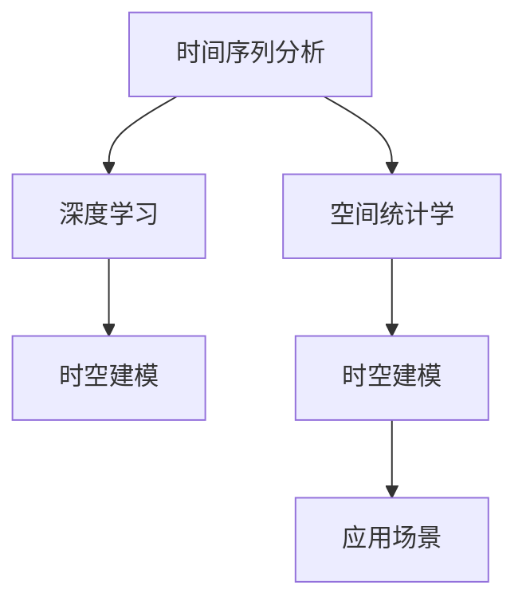

                 

## 1. 背景介绍

在当今信息爆炸的时代，如何有效地从海量数据中提取有价值的时空信息，成为各行各业关注的重点。时空建模（Temporal and Spatial Modeling）通过分析时间序列和空间分布，揭示数据背后的内在规律，为决策制定、市场预测、资源规划等领域提供强有力的支持。本文将系统解析时空建模的关键技术步骤，通过深入浅出的讲解，帮助读者理解该领域的重要理论和方法。

## 2. 核心概念与联系

### 2.1 核心概念概述

时空建模涉及的核心概念包括时间序列分析、空间统计学、深度学习等，这些概念在实际应用中常常相互交叉，共同构建起完整的时空建模框架。

- **时间序列分析**：研究时间序列数据的变化规律，通过对历史数据的观察和预测，揭示潜在的趋势和周期性变化。常见的技术包括自回归模型（AR）、滑动平均模型（MA）、自回归移动平均模型（ARMA）、自回归积分滑动平均模型（ARIMA）等。

- **空间统计学**：分析空间数据的内在关系，利用空间相关性揭示地理分布规律。主要技术包括空间自相关分析、空间插值、空间回归模型等。

- **深度学习**：利用神经网络结构对时空数据进行建模和分析，通过多层次非线性映射捕捉复杂的时空特征。主要技术包括卷积神经网络（CNN）、循环神经网络（RNN）、长短期记忆网络（LSTM）、变分自编码器（VAE）等。

这些概念之间的联系可以通过以下Mermaid流程图来展示：



这个流程图展示了一系列核心概念及其之间的关系：时间序列分析是空间统计学和深度学习的基础，通过深度学习技术对时空数据进行建模，应用到各种场景中。

## 3. 核心算法原理 & 具体操作步骤

### 3.1 算法原理概述

时空建模的核心理论可以归纳为以下几点：

1. **时序分解与重构**：将时间序列数据分解为趋势、季节性、随机误差等组成部分，利用差分、季节性分解等技术对其进行重构，以更好地捕捉数据特征。
2. **空间平滑与插值**：通过空间平滑和插值技术，对空间数据进行处理，消除异常值和噪声，揭示空间分布规律。
3. **特征工程与模型训练**：将时序和空间数据进行特征工程处理，生成适合深度学习模型的输入特征，通过深度学习模型进行训练和预测。

### 3.2 算法步骤详解

以下是时空建模的主要操作步骤：

1. **数据预处理**：对原始数据进行清洗、归一化、缺失值填充等预处理操作，确保数据质量。
2. **时序分解**：对时间序列数据进行差分、季节性分解等处理，以去除趋势和季节性因素，保留随机误差。
3. **空间平滑与插值**：对空间数据进行平滑处理，如加权平均、平滑样条等，去除异常值和噪声，通过空间插值技术填补缺失值。
4. **特征工程**：将处理后的时序和空间数据进行特征提取，如滑动窗口、滞后差分等，生成适合深度学习模型的输入特征。
5. **模型训练**：选择合适的深度学习模型，如RNN、LSTM、CNN等，对输入特征进行训练，优化模型参数。
6. **模型评估与验证**：在训练集和验证集上评估模型性能，使用均方误差（MSE）、均方根误差（RMSE）等指标进行评估，选择合适的超参数。
7. **预测与优化**：利用训练好的模型进行预测，对预测结果进行评估和优化，如调整学习率、引入正则化等。

### 3.3 算法优缺点

时空建模的优点在于能够同时考虑时间和空间维度，捕捉复杂的时空特征，适应多变的环境。但该方法也存在一些缺点：

- **数据需求高**：需要大量的时间序列和空间数据，数据采集和预处理成本较高。
- **模型复杂度高**：深度学习模型的训练复杂度较高，需要大量的计算资源和时间。
- **过拟合风险高**：由于模型复杂度高，容易发生过拟合现象，特别是在数据量较少的情况下。

### 3.4 算法应用领域

时空建模广泛应用于金融、气象、交通、健康等领域：

- **金融预测**：利用时空建模对股市、外汇等金融数据进行预测，评估市场风险和投资机会。
- **气象预报**：分析历史气象数据，建立时空模型预测天气变化，指导农业生产和生活安排。
- **交通流量预测**：通过时空建模分析交通数据，预测交通流量，优化交通管理。
- **健康监测**：利用时空建模对病人的健康数据进行监控，预测疾病风险，改善诊疗效果。

## 4. 数学模型和公式 & 详细讲解

### 4.1 数学模型构建

时空建模的数学模型可以抽象为：

$$
y_t = f(x_t, x_{t-1}, \ldots, x_1, w)
$$

其中，$y_t$ 表示时间序列在时间$t$的观测值，$x_t$ 表示时间$t$的空间特征，$x_{t-1}, \ldots, x_1$ 表示时间序列在过去时间点的特征，$w$ 表示模型的权重参数。

### 4.2 公式推导过程

以ARIMA模型为例，推导时间序列的预测公式。

ARIMA模型由差分、自回归和移动平均三个部分组成，其数学表达式为：

$$
(1-L)^d \Delta^D (y_t) = \sum_{i=0}^{p} \phi_i y_{t-i} + \sum_{j=0}^{q} \theta_j \epsilon_{t-j} + c
$$

其中，$d$ 为差分次数，$D$ 为季节性差分次数，$L$ 表示滞后算子，$\phi_i$ 为自回归系数，$\theta_j$ 为移动平均系数，$c$ 为常数项，$\epsilon_t$ 为白噪声序列。

### 4.3 案例分析与讲解

假设某城市每日的平均气温数据（单位：摄氏度）如下：

| 日期       | 气温（℃） |
|------------|----------|
| 2023-01-01 | 10.0     |
| 2023-01-02 | 12.5     |
| 2023-01-03 | 8.0      |
| ...        | ...      |

我们需要利用ARIMA模型对该城市的未来气温进行预测。

1. **数据预处理**：首先对气温数据进行归一化处理，使其在0到1之间。
2. **时序分解**：对气温数据进行一阶差分处理，去除趋势项。
3. **模型训练**：使用历史数据训练ARIMA模型，优化模型参数。
4. **预测与优化**：利用训练好的模型对未来气温进行预测，并对预测结果进行评估和优化。

## 5. 项目实践：代码实例和详细解释说明

### 5.1 开发环境搭建

在进行时空建模的实践前，我们需要准备好开发环境。以下是使用Python进行Python的开发环境配置流程：

1. 安装Anaconda：从官网下载并安装Anaconda，用于创建独立的Python环境。

2. 创建并激活虚拟环境：
```bash
conda create -n sp_model_env python=3.8 
conda activate sp_model_env
```

3. 安装必要的库：
```bash
conda install numpy pandas scikit-learn statsmodels pytorch torchvision torchaudio cudatoolkit=11.1 -c pytorch -c conda-forge
```

### 5.2 源代码详细实现

以下是利用ARIMA模型进行气温预测的Python代码实现：

```python
import pandas as pd
import numpy as np
import statsmodels.api as sm
from statsmodels.tsa.arima.model import ARIMA

# 读取气温数据
df = pd.read_csv('temperature.csv', index_col='date')

# 数据预处理：归一化
df['normalized_temp'] = (df['temp'] - df['temp'].min()) / (df['temp'].max() - df['temp'].min())

# 时序分解：一阶差分
df['diff_temp'] = df['normalized_temp'].diff(1)

# 模型训练：ARIMA模型
model = ARIMA(df['diff_temp'], order=(1, 0, 0))
results = model.fit()

# 预测未来气温
future_dates = pd.date_range(start='2023-01-04', periods=30, freq='D')
forecast = results.forecast(steps=len(future_dates))
forecast_df = pd.DataFrame(forecast, index=future_dates, columns=['predicted_temp'])

# 反向归一化
forecast_df['predicted_temp'] = (forecast_df['predicted_temp'] * (df['temp'].max() - df['temp'].min()) + df['temp'].min())

# 可视化预测结果
forecast_df.plot()
```

### 5.3 代码解读与分析

让我们再详细解读一下关键代码的实现细节：

**ARIMA模型**：
- 导入`statsmodels`库，使用`ARIMA`类构建ARIMA模型，并使用`fit`方法训练模型。
- `order=(1, 0, 0)`表示模型的AR参数、差分次数和MA参数。
- `forecast`方法进行未来气温的预测，`steps`参数指定预测步数。
- 通过`pd.DataFrame`将预测结果转换为DataFrame，方便后续处理和可视化。

**数据预处理**：
- `df['normalized_temp'] = (df['temp'] - df['temp'].min()) / (df['temp'].max() - df['temp'].min()`对原始数据进行归一化处理，使其在0到1之间。
- `df['diff_temp'] = df['normalized_temp'].diff(1)`对气温数据进行一阶差分处理，去除趋势项。

**模型预测与优化**：
- 利用训练好的ARIMA模型对未来气温进行预测，并将预测结果进行可视化展示。

## 6. 实际应用场景

### 6.1 金融预测

时空建模在金融预测中具有重要应用。通过分析历史股票价格和宏观经济数据，可以预测未来股票走势、市场波动等。时空建模可以帮助金融机构制定更好的投资策略，规避市场风险。

### 6.2 气象预报

时空建模在气象预报中具有重要应用。通过分析历史气象数据，可以建立时空模型预测天气变化，指导农业生产和生活安排。时空建模可以帮助政府和气象部门提高气象预测的准确性和及时性。

### 6.3 交通流量预测

时空建模在交通流量预测中具有重要应用。通过分析历史交通数据，可以建立时空模型预测交通流量，优化交通管理。时空建模可以帮助交通部门提高交通流量预测的准确性，缓解交通拥堵问题。

### 6.4 健康监测

时空建模在健康监测中具有重要应用。通过分析病人的健康数据，可以建立时空模型预测疾病风险，改善诊疗效果。时空建模可以帮助医疗机构提高疾病预测的准确性，改善医疗服务质量。

## 7. 工具和资源推荐

### 7.1 学习资源推荐

为了帮助开发者系统掌握时空建模的理论基础和实践技巧，这里推荐一些优质的学习资源：

1. 《时间序列分析》（Time Series Analysis）书籍：由Ramsay等作者撰写，详细介绍了时间序列分析的基本概念和方法。
2. 《空间统计学》（Spatial Statistics）书籍：由Cressie等作者撰写，详细介绍了空间统计学的基本概念和方法。
3. 《深度学习》（Deep Learning）书籍：由Goodfellow等作者撰写，详细介绍了深度学习的基本概念和方法。
4. Kaggle：全球最大的数据科学竞赛平台，提供了丰富的时空建模竞赛和数据集。
5. Coursera：全球最大的在线教育平台，提供了丰富的时空建模相关课程。

通过对这些资源的学习实践，相信你一定能够快速掌握时空建模的精髓，并用于解决实际的预测问题。

### 7.2 开发工具推荐

高效的开发离不开优秀的工具支持。以下是几款用于时空建模开发的常用工具：

1. Python：全球最流行的编程语言之一，具有强大的数据处理和科学计算能力。
2. R：数据科学领域的重要工具，具有强大的统计分析和可视化能力。
3. MATLAB：工程和科学计算的重要工具，具有强大的数值计算和图形化编程能力。
4. GIS工具：如ArcGIS、QGIS等，用于地理空间数据的处理和分析。
5. Gephi：用于社交网络和复杂网络分析的工具，支持空间网络可视化。

合理利用这些工具，可以显著提升时空建模任务的开发效率，加快创新迭代的步伐。

### 7.3 相关论文推荐

时空建模的研究源于学界的持续研究。以下是几篇奠基性的相关论文，推荐阅读：

1. Box, G. E. P., Jenkins, G. M., & Reinsel, G. C. (2015). Time series analysis: Forecasting and control (Vol. 5). Wiley.
2. Cressie, N., & Wikle, C. K. (2011). Statistics for Spatial Data (Vol. 340). Wiley.
3. Goodfellow, I., Bengio, Y., & Courville, A. (2016). Deep learning (Vol. 1, No. 1). MIT Press.
4. Hyndman, R. J., & Khandakar, Y. (2008). Automatic time series forecasting using exponential smoothing methods. Journal of forecasting, 27(1), 1-15.
5. Raftery, A. E., & Granger, C. W. (2013). Time series and forecasting: What do we know? The Journal of Business & Economic Statistics, 31(4), 482-488.

这些论文代表时空建模的发展脉络。通过学习这些前沿成果，可以帮助研究者把握学科前进方向，激发更多的创新灵感。

## 8. 总结：未来发展趋势与挑战

### 8.1 总结

本文对时空建模的关键技术步骤进行了全面系统的介绍。首先阐述了时空建模的研究背景和意义，明确了时空建模在多个领域的应用价值。其次，从原理到实践，详细讲解了时空建模的数学原理和关键步骤，给出了时空建模任务开发的完整代码实例。同时，本文还广泛探讨了时空建模方法在金融、气象、交通等多个行业领域的应用前景，展示了时空建模技术的巨大潜力。

通过本文的系统梳理，可以看到，时空建模方法在多个领域都具有重要的应用价值，能够有效地从海量数据中提取有价值的时空信息，为决策制定、市场预测、资源规划等领域提供强有力的支持。未来，伴随技术的发展和应用的拓展，时空建模必将在更广阔的领域大放异彩。

### 8.2 未来发展趋势

展望未来，时空建模将呈现以下几个发展趋势：

1. **多模态融合**：时空建模将与更多模态数据（如图像、视频等）进行融合，利用多模态信息提升预测准确性。
2. **自适应学习**：时空建模将采用自适应学习算法，根据数据变化自动调整模型参数，提高模型的鲁棒性和适应性。
3. **分布式计算**：时空建模将采用分布式计算技术，提高模型训练和预测的速度和效率。
4. **自动化建模**：时空建模将采用自动化建模技术，通过自动化调参和模型选择，降低模型的开发和部署成本。
5. **混合模型**：时空建模将采用混合模型，结合传统统计方法和深度学习算法，取长补短，提高模型的预测能力。

这些趋势展示了时空建模技术的广阔前景，为更高效、更智能的时空预测提供了新的方向。

### 8.3 面临的挑战

尽管时空建模已经取得了一定的成就，但在实际应用中仍面临诸多挑战：

1. **数据质量问题**：时空数据往往存在缺失、噪声等问题，如何处理和清洗数据是时空建模的重要挑战。
2. **模型复杂度**：时空建模的模型通常较为复杂，容易发生过拟合现象，特别是在数据量较少的情况下。
3. **计算资源消耗高**：时空建模需要大量的计算资源和时间，特别是在处理大规模数据时。
4. **解释性不足**：时空建模模型往往较为复杂，难以解释其内部工作机制和决策逻辑，缺乏可解释性。

### 8.4 研究展望

面对时空建模面临的这些挑战，未来的研究需要在以下几个方面寻求新的突破：

1. **数据增强与清洗**：开发更高效的数据增强和清洗技术，提升数据质量，减少异常值和噪声的影响。
2. **模型简化与优化**：简化模型结构，引入正则化技术，避免过拟合，提高模型的泛化能力。
3. **分布式计算**：采用分布式计算技术，提高模型训练和预测的速度和效率，适应大规模数据处理的需求。
4. **解释性与透明性**：增强模型的可解释性，通过可视化工具展示模型内部的决策过程，提高模型的透明性。
5. **混合模型与多模态融合**：结合传统统计方法和深度学习算法，利用多模态信息，提高模型的预测能力。

这些研究方向的探索，必将引领时空建模技术迈向更高的台阶，为构建更加智能和可靠的时空预测系统铺平道路。

## 9. 附录：常见问题与解答

**Q1：时空建模的适用范围是什么？**

A: 时空建模适用于处理具有时间序列和空间分布特性的大数据。常见的应用场景包括金融预测、气象预报、交通流量预测、健康监测等。

**Q2：时空建模中的自回归模型和移动平均模型有什么区别？**

A: 自回归模型（AR模型）主要用于处理时间序列数据中的自相关性，模型假设过去的数据对未来数据有影响；移动平均模型（MA模型）主要用于处理时间序列数据中的白噪声，模型假设过去的噪声对未来数据有影响。ARMA模型是自回归和移动平均模型的结合，可以更好地处理复杂的时间序列数据。

**Q3：时空建模中的数据清洗和预处理有哪些常见方法？**

A: 常见的数据清洗和预处理包括：
1. 缺失值处理：通过插值、删除等方法填补缺失值。
2. 异常值处理：通过平滑、剔除等方法去除异常值。
3. 归一化与标准化：将数据缩放到指定范围内，提高模型的收敛速度。
4. 特征选择与提取：选择与预测目标相关的特征，并进行特征工程处理，生成适合模型的输入特征。

**Q4：时空建模中如何评估模型性能？**

A: 时空建模的模型评估通常使用均方误差（MSE）、均方根误差（RMSE）等指标，衡量模型预测值与真实值之间的差距。在实际应用中，还需要结合业务需求，选择合适的评估指标，如平均绝对误差（MAE）、相关系数（R-squared）等。

**Q5：时空建模中如何选择模型参数？**

A: 模型参数的选择通常需要结合业务需求和数据特点，通过交叉验证、网格搜索等方法进行调参。在选择模型时，需要考虑模型的复杂度、泛化能力、计算资源消耗等因素，权衡取舍。

---

作者：禅与计算机程序设计艺术 / Zen and the Art of Computer Programming

