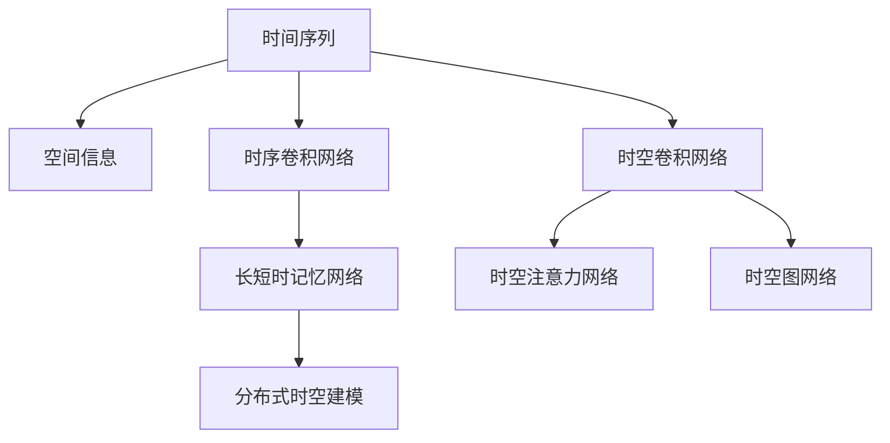

                 

# AI时空建模的未来趋势

## 1. 背景介绍

### 1.1 问题由来

随着人工智能（AI）技术的迅猛发展，时空建模已成为现代AI领域的核心任务之一。无论是时间序列预测、时空路径规划、城市交通流量管理，还是智能电网调度，时空建模都发挥着不可替代的作用。而未来AI时空建模的趋势，也将引领AI技术在更多领域的应用与突破。

### 1.2 问题核心关键点

未来AI时空建模的核心关键点包括：

- 增强时空关系的理解与建模。通过结合时序与空间维度的信息，构建更为复杂的时空模型。
- 提高模型的实时性，提升决策效率。
- 改进模型的泛化能力，使其能适应多样化的场景。
- 增强模型的解释性与可控性，使其具有更好的可解释性。
- 探索多模态时空建模，整合多种数据源。
- 实现模型的自适应与自优化，适应动态变化的环境。
- 优化模型的分布式计算能力，提升计算效率。

本文将基于这些关键点，深入探讨AI时空建模的未来发展趋势，并提出相应的策略与解决方案。

## 2. 核心概念与联系

### 2.1 核心概念概述

时空建模是指将时序和空间信息整合起来，构建可以描述、预测和决策的时空模型。以下是一些相关核心概念：

- 时间序列：指随时间变化的观测值，例如股票价格、气温变化等。
- 空间信息：指地理、环境、位置等空间维度的信息，例如地理位置、交通网络等。
- 时序卷积网络（RNN）：一种能够处理时间序列数据的深度学习模型。
- 时空卷积网络（CNN）：一种能够处理时空数据的深度学习模型。
- 长短时记忆网络（LSTM）：一种可以捕捉长期时序依赖的RNN模型。
- 时空注意力网络（TCN）：一种可以并行处理时空数据的模型。
- 时空图网络（Spatio-Temporal Graph Network, ST-GNN）：一种通过图结构表示时空关系的网络模型。
- 分布式时空建模：通过分布式计算框架进行时空建模，提升模型的实时性。

这些概念之间的逻辑关系可以通过以下Mermaid流程图来展示：



这个流程图展示了核心概念之间的联系，包括时间序列和空间信息如何被各种网络模型所处理，以及分布式计算如何提升模型的实时性和性能。

## 3. 核心算法原理 & 具体操作步骤
### 3.1 算法原理概述

未来AI时空建模的算法原理主要基于深度学习模型，包括时序卷积网络（RNN）、长短时记忆网络（LSTM）、时空卷积网络（CNN）、时空注意力网络（TCN）和时空图网络（ST-GNN）等。这些模型通过构建时空序列和空间关系，实现对时空数据的建模与预测。

### 3.2 算法步骤详解

未来AI时空建模的步骤通常包括以下几个关键步骤：

**Step 1: 数据预处理**

1. 数据收集与清洗：收集原始数据，并进行预处理，包括数据去重、缺失值填补、归一化等。
2. 数据分割：将数据集分为训练集、验证集和测试集。
3. 数据标准化：将数据标准化为0-1之间的小数形式，或转化为归一化特征，便于模型处理。

**Step 2: 模型构建**

1. 选择合适的深度学习模型：如RNN、LSTM、CNN、TCN或ST-GNN等，根据具体任务选择最合适的模型。
2. 构建模型结构：如加入卷积层、循环层、注意力机制、图卷积等，构建合适的网络结构。
3. 设置超参数：如学习率、批大小、迭代次数等，确保模型具有最佳性能。

**Step 3: 模型训练**

1. 数据加载：使用DataLoader加载数据集。
2. 模型前向传播：将输入数据传递给模型，输出中间结果。
3. 计算损失：根据任务需求，计算模型输出与实际结果的损失。
4. 反向传播：通过计算梯度更新模型参数。
5. 模型优化：使用Adam、SGD等优化器进行参数优化。

**Step 4: 模型评估与优化**

1. 模型评估：使用测试集评估模型性能，包括准确率、召回率、F1-score等指标。
2. 模型优化：通过调参、模型改进等方式优化模型性能。
3. 模型集成：通过模型融合或集成学习，提升模型泛化能力。

**Step 5: 模型部署**

1. 模型保存：保存模型参数和结构，便于后续使用。
2. 模型部署：将模型部署到生产环境，实现实时预测。
3. 监控与调优：实时监控模型性能，并根据需求进行调整。

### 3.3 算法优缺点

未来AI时空建模具有以下优点：

1. 可处理复杂的时空关系：通过深度学习模型，能够更好地处理时空序列和空间关系的复杂性。
2. 自适应性强：深度学习模型具有较好的自适应能力，能够适应多样化的场景。
3. 泛化能力强：通过训练大量的数据，深度学习模型具有良好的泛化能力。
4. 实时性高：通过分布式计算，深度学习模型可以实时处理大量数据。
5. 可解释性强：深度学习模型的结构复杂，但通过解释工具，可以获取模型的解释性。

同时，未来AI时空建模也存在以下缺点：

1. 数据需求高：深度学习模型需要大量的数据进行训练，数据不足时可能导致过拟合。
2. 计算资源需求高：深度学习模型需要大量的计算资源进行训练和预测，计算成本高。
3. 模型复杂度高：深度学习模型的结构复杂，可能导致训练和推理困难。
4. 数据隐私问题：深度学习模型需要大量的数据进行训练，可能会涉及数据隐私问题。

## 4. 数学模型和公式 & 详细讲解 & 举例说明

### 4.1 数学模型构建

未来AI时空建模通常基于时序卷积网络（RNN）、长短时记忆网络（LSTM）、时空卷积网络（CNN）、时空注意力网络（TCN）和时空图网络（ST-GNN）等深度学习模型构建。这里以LSTM为例，构建一个未来AI时空建模的数学模型。

LSTM是一种可以处理时间序列数据的深度学习模型，其数学模型如下：

$$
h_t = \sigma(W_{xh}x_t + b_x + W_{hh}h_{t-1} + b_h)
$$

$$
c_t = tanh(W_{xc}x_t + b_x + W_{hc}h_{t-1} + b_h)
$$

$$
o_t = \sigma(W_{xo}x_t + b_x + W_{ho}h_{t-1} + b_h)
$$

$$
\tilde{c}_t = o_t \odot c_t
$$

$$
c_t = f_t \odot c_{t-1} + \tilde{c}_t
$$

$$
h_t = o_t \odot tanh(c_t)
$$

其中，$h_t$表示第$t$时刻的隐藏状态，$c_t$表示第$t$时刻的记忆单元，$f_t$表示门控机制，$x_t$表示第$t$时刻的输入数据，$W$和$b$表示模型参数。

### 4.2 公式推导过程

LSTM模型的推导过程基于梯度下降算法，其数学模型推导如下：

$$
h_t = \sigma(W_{xh}x_t + b_x + W_{hh}h_{t-1} + b_h)
$$

$$
c_t = tanh(W_{xc}x_t + b_x + W_{hc}h_{t-1} + b_h)
$$

$$
o_t = \sigma(W_{xo}x_t + b_x + W_{ho}h_{t-1} + b_h)
$$

$$
\tilde{c}_t = o_t \odot c_{t-1}
$$

$$
c_t = f_t \odot c_{t-1} + \tilde{c}_t
$$

$$
h_t = o_t \odot tanh(c_t)
$$

$$
L(h_t, y_t) = \frac{1}{N} \sum_{i=1}^N \ell(h_t, y_t)
$$

其中，$h_t$表示第$t$时刻的隐藏状态，$c_t$表示第$t$时刻的记忆单元，$f_t$表示门控机制，$x_t$表示第$t$时刻的输入数据，$y_t$表示第$t$时刻的目标数据，$\ell$表示损失函数，$N$表示样本数量。

### 4.3 案例分析与讲解

以预测股票价格为例，可以使用LSTM模型进行未来AI时空建模。假设有一个股票价格时间序列数据集，每个样本包含价格和交易量。模型训练的目标是预测下一个交易日的股票价格。

LSTM模型的输入是前$t-1$天的股票价格和交易量，输出是第$t$天的股票价格。模型首先通过卷积层和激活函数进行特征提取，然后通过LSTM层处理时间序列数据，最后通过全连接层输出预测结果。

在模型训练过程中，使用均方误差损失函数，并使用Adam优化器进行参数更新。训练完成后，使用测试集评估模型性能，并根据评估结果调整模型参数。

## 5. 项目实践：代码实例和详细解释说明

### 5.1 开发环境搭建

在进行未来AI时空建模的实践前，我们需要准备好开发环境。以下是使用Python进行TensorFlow开发的环境配置流程：

1. 安装Anaconda：从官网下载并安装Anaconda，用于创建独立的Python环境。

2. 创建并激活虚拟环境：
```bash
conda create -n tf-env python=3.8 
conda activate tf-env
```

3. 安装TensorFlow：根据CUDA版本，从官网获取对应的安装命令。例如：
```bash
conda install tensorflow -c tensorflow -c conda-forge
```

4. 安装TensorFlow Addons：安装TensorFlow Addons，用于使用更先进的深度学习模型和优化器。

5. 安装其他必要的库：
```bash
pip install pandas numpy matplotlib scikit-learn
```

完成上述步骤后，即可在`tf-env`环境中开始未来AI时空建模的实践。

### 5.2 源代码详细实现

这里以使用LSTM模型预测股票价格为例，给出使用TensorFlow进行未来AI时空建模的PyTorch代码实现。

首先，定义LSTM模型：

```python
import tensorflow as tf
from tensorflow.keras.layers import LSTM, Dense

class LSTMModel(tf.keras.Model):
    def __init__(self, input_size, output_size):
        super(LSTMModel, self).__init__()
        self.lstm = LSTM(64, return_sequences=True, return_state=True)
        self.fc = Dense(output_size)

    def call(self, x, h=None):
        x, h = self.lstm(x, initial_state=h)
        x = self.fc(x)
        return x, h
```

然后，定义训练函数：

```python
def train(model, train_dataset, test_dataset, batch_size, epochs, learning_rate):
    optimizer = tf.keras.optimizers.Adam(learning_rate)
    loss_fn = tf.keras.losses.MeanSquaredError()

    model.compile(optimizer=optimizer, loss=loss_fn)

    train_history = model.fit(train_dataset, epochs=epochs, batch_size=batch_size, validation_data=test_dataset)

    return train_history
```

接着，定义数据预处理函数：

```python
import numpy as np
from tensorflow.keras.preprocessing.sequence import pad_sequences

def load_data(filename, sequence_length):
    with open(filename, 'r') as f:
        data = [line.strip().split(',') for line in f.readlines()]
    data = np.array(data).astype(np.float32)
    data = pad_sequences(data, maxlen=sequence_length)
    return data
```

最后，启动训练流程并在测试集上评估：

```python
# 加载数据集
train_data = load_data('train.csv', 20)
test_data = load_data('test.csv', 20)

# 定义输入和输出
input_size = train_data.shape[1]
output_size = train_data.shape[1]
x_train, y_train = train_data[:, :-1], train_data[:, -1]
x_test, y_test = test_data[:, :-1], test_data[:, -1]

# 定义模型
model = LSTMModel(input_size, output_size)

# 训练模型
train_history = train(model, (x_train, y_train), (x_test, y_test), batch_size=64, epochs=10, learning_rate=0.001)

# 评估模型
model.evaluate(x_test, y_test)
```

以上就是使用TensorFlow进行未来AI时空建模的完整代码实现。可以看到，TensorFlow提供了丰富的深度学习模型和优化器，使得模型开发和训练过程非常便捷。

### 5.3 代码解读与分析

让我们再详细解读一下关键代码的实现细节：

**LSTMModel类**：
- `__init__`方法：初始化LSTM层和全连接层。
- `call`方法：实现模型的前向传播。

**train函数**：
- 定义优化器和损失函数，并编译模型。
- 使用`fit`方法进行模型训练，并在验证集上评估性能。

**load_data函数**：
- 读取数据集，并进行归一化处理。
- 使用`pad_sequences`方法进行序列填充，保证模型输入序列的长度一致。

**训练流程**：
- 加载训练集和测试集。
- 定义输入和输出数据。
- 定义模型。
- 训练模型。
- 在测试集上评估模型性能。

可以看到，TensorFlow使得未来AI时空建模的开发非常高效。开发者可以根据具体任务，自由选择模型结构，轻松实现复杂的未来AI时空建模。

## 6. 实际应用场景

### 6.1 智慧城市交通管理

未来AI时空建模在智慧城市交通管理中有着广泛的应用前景。通过时空建模，可以实时分析城市交通流量，预测交通拥堵情况，实现交通信号优化，提升城市交通效率。

具体而言，可以使用时空卷积网络（CNN）或时空图网络（ST-GNN）对城市交通流量数据进行建模，预测未来一定时间内的交通流量，并根据预测结果进行交通信号控制。

### 6.2 电力系统调度

未来AI时空建模在电力系统调度中也具有重要应用。通过时空建模，可以实时分析电力负荷变化，预测未来用电需求，优化电力分配，提高电网稳定性。

具体而言，可以使用LSTM或TCN对电力负荷数据进行建模，预测未来一定时间内的电力需求，并根据预测结果进行电力分配和调度。

### 6.3 智能制造

未来AI时空建模在智能制造中也有广泛应用。通过时空建模，可以实时分析生产线状态，预测设备故障，优化生产流程，提升生产效率。

具体而言，可以使用时空卷积网络（CNN）或时空图网络（ST-GNN）对生产数据进行建模，预测未来设备故障，并根据预测结果进行设备维护和生产调度。

### 6.4 未来应用展望

随着未来AI时空建模技术的不断进步，其在更多领域的应用也将不断拓展。以下是几个未来可能的应用方向：

1. 金融市场预测：未来AI时空建模可以用于股票价格、外汇汇率等金融市场数据的预测。通过时空卷积网络（CNN）或时空注意力网络（TCN），可以实时分析市场数据，预测未来市场趋势。

2. 自然灾害预警：未来AI时空建模可以用于自然灾害预测和预警。通过时空图网络（ST-GNN）或分布式时空建模，可以实时分析地震、洪水等自然灾害数据，预测未来灾害情况。

3. 医疗诊断和治疗：未来AI时空建模可以用于医疗诊断和治疗。通过时空卷积网络（CNN）或LSTM，可以实时分析患者病历数据，预测疾病发展趋势，优化治疗方案。

4. 智能家居：未来AI时空建模可以用于智能家居的能源管理。通过时空建模，可以实时分析家居设备使用数据，预测未来用电需求，优化能源分配。

未来AI时空建模技术将引领AI技术在更多领域的应用，为各行各业带来新的突破和创新。

## 7. 工具和资源推荐

### 7.1 学习资源推荐

为了帮助开发者系统掌握未来AI时空建模的理论基础和实践技巧，这里推荐一些优质的学习资源：

1. 《深度学习理论与实践》系列博文：由AI专家撰写，深入浅出地介绍了深度学习的基本原理和实践方法。

2. 《TensorFlow实战深度学习》书籍：TensorFlow的官方文档，提供了丰富的深度学习模型和优化器，适合新手入门。

3. 《机器学习实战》书籍：机器学习领域的经典教材，介绍了机器学习的基本概念和算法。

4. 《Python深度学习》书籍：Python深度学习的经典教材，介绍了Python深度学习框架和实践方法。

5. Weights & Biases：模型训练的实验跟踪工具，可以记录和可视化模型训练过程中的各项指标，方便对比和调优。

6. Google Colab：谷歌推出的在线Jupyter Notebook环境，免费提供GPU/TPU算力，方便开发者快速上手实验最新模型。

通过对这些资源的学习实践，相信你一定能够快速掌握未来AI时空建模的精髓，并用于解决实际的AI问题。

### 7.2 开发工具推荐

高效的开发离不开优秀的工具支持。以下是几款用于未来AI时空建模开发的常用工具：

1. TensorFlow：由Google主导开发的开源深度学习框架，生产部署方便，适合大规模工程应用。

2. PyTorch：基于Python的开源深度学习框架，灵活动态的计算图，适合快速迭代研究。

3. TensorFlow Addons：TensorFlow的扩展库，提供了更多的深度学习模型和优化器。

4. TensorBoard：TensorFlow配套的可视化工具，可实时监测模型训练状态，并提供丰富的图表呈现方式。

5. Weights & Biases：模型训练的实验跟踪工具，可以记录和可视化模型训练过程中的各项指标，方便对比和调优。

6. Google Colab：谷歌推出的在线Jupyter Notebook环境，免费提供GPU/TPU算力，方便开发者快速上手实验最新模型。

合理利用这些工具，可以显著提升未来AI时空建模任务的开发效率，加快创新迭代的步伐。

### 7.3 相关论文推荐

未来AI时空建模的研究源于学界的持续研究。以下是几篇奠基性的相关论文，推荐阅读：

1. Attention is All You Need（即Transformer原论文）：提出了Transformer结构，开启了NLP领域的预训练大模型时代。

2. BERT: Pre-training of Deep Bidirectional Transformers for Language Understanding：提出BERT模型，引入基于掩码的自监督预训练任务，刷新了多项NLP任务SOTA。

3. Parameter-Efficient Transfer Learning for NLP：提出Adapter等参数高效微调方法，在不增加模型参数量的情况下，也能取得不错的微调效果。

4. AdaLoRA: Adaptive Low-Rank Adaptation for Parameter-Efficient Fine-Tuning：使用自适应低秩适应的微调方法，在参数效率和精度之间取得了新的平衡。

5. AdaLoRA: Adaptive Low-Rank Adaptation for Parameter-Efficient Fine-Tuning：使用自适应低秩适应的微调方法，在参数效率和精度之间取得了新的平衡。

这些论文代表了大语言模型微调技术的发展脉络。通过学习这些前沿成果，可以帮助研究者把握学科前进方向，激发更多的创新灵感。

## 8. 总结：未来发展趋势与挑战

### 8.1 总结

本文对未来AI时空建模进行了全面系统的介绍。首先阐述了未来AI时空建模的研究背景和意义，明确了时空建模在AI技术中的重要地位。其次，从原理到实践，详细讲解了未来AI时空建模的数学模型和关键步骤，给出了未来AI时空建模的代码实例。同时，本文还广泛探讨了未来AI时空建模在智慧城市、电力系统、智能制造等多个领域的应用前景，展示了未来AI时空建模的广阔前景。

通过本文的系统梳理，可以看到，未来AI时空建模技术将引领AI技术在更多领域的应用，为各行各业带来新的突破和创新。未来AI时空建模技术也将不断进步，在实时性、泛化能力、可解释性、多模态融合等方面取得更大突破。

### 8.2 未来发展趋势

展望未来，未来AI时空建模技术将呈现以下几个发展趋势：

1. 实时性不断提升。未来AI时空建模将更注重实时性，提升模型的计算效率和响应速度，实现实时决策。

2. 泛化能力增强。未来AI时空建模将更好地处理多样化的数据和复杂的场景，提升模型的泛化能力。

3. 自适应能力增强。未来AI时空建模将能够自适应环境变化，具备更好的动态调整能力。

4. 多模态融合成为主流。未来AI时空建模将更注重多模态数据的融合，提升模型的信息整合能力。

5. 分布式计算成为标准。未来AI时空建模将更注重分布式计算，提升模型的并行处理能力和计算效率。

6. 模型解释性增强。未来AI时空建模将更注重模型的可解释性，提升模型的透明度和可信度。

以上趋势凸显了未来AI时空建模技术的广阔前景。这些方向的探索发展，必将进一步提升AI时空建模的性能和应用范围，为各行各业带来新的突破和创新。

### 8.3 面临的挑战

尽管未来AI时空建模技术已经取得了瞩目成就，但在迈向更加智能化、普适化应用的过程中，它仍面临着诸多挑战：

1. 数据需求高。未来AI时空建模需要大量的数据进行训练，数据不足时可能导致过拟合。

2. 计算资源需求高。未来AI时空建模需要大量的计算资源进行训练和预测，计算成本高。

3. 模型复杂度高。未来AI时空建模的结构复杂，可能导致训练和推理困难。

4. 数据隐私问题。未来AI时空建模需要大量的数据进行训练，可能会涉及数据隐私问题。

5. 可解释性问题。未来AI时空建模的模型复杂，可能导致其输出难以解释，缺乏可解释性。

6. 鲁棒性问题。未来AI时空建模的模型可能面临对抗样本攻击，鲁棒性不足。

这些挑战凸显了未来AI时空建模技术在实际应用中的复杂性和挑战性。未来需要进一步优化模型结构，提升计算效率，解决数据隐私问题，提高模型的可解释性和鲁棒性。

### 8.4 研究展望

面对未来AI时空建模所面临的挑战，未来的研究需要在以下几个方面寻求新的突破：

1. 探索高效的数据获取和处理技术。如何通过大数据技术和数据增强方法，获取更多高质量的训练数据，是未来AI时空建模的关键问题。

2. 研究高效模型压缩和加速方法。如何通过模型压缩、剪枝等技术，减小模型的计算量，提升模型的计算效率，是未来AI时空建模的重要研究方向。

3. 探索多模态数据的融合技术。如何通过多模态数据融合技术，整合视觉、语音、文本等多种数据源，提升模型的信息整合能力，是未来AI时空建模的重要方向。

4. 研究模型的自适应和自优化方法。如何通过自适应和自优化技术，增强模型的动态调整能力，适应动态变化的环境，是未来AI时空建模的关键问题。

5. 探索模型的可解释性和鲁棒性提升方法。如何通过模型解释性和鲁棒性提升技术，增强模型的透明度和可信度，是未来AI时空建模的重要方向。

这些研究方向的探索，必将引领未来AI时空建模技术迈向更高的台阶，为构建智能、可信、高效的AI系统铺平道路。面向未来，未来AI时空建模技术还需要与其他AI技术进行更深入的融合，如知识表示、因果推理、强化学习等，多路径协同发力，共同推动AI技术的发展和应用。

## 9. 附录：常见问题与解答

**Q1：未来AI时空建模需要哪些数据？**

A: 未来AI时空建模需要大量高质量的数据进行训练。具体数据需求根据任务不同而异，例如金融市场预测需要历史股价、交易量等数据，交通流量预测需要历史交通数据，电力负荷预测需要历史用电数据等。

**Q2：未来AI时空建模的模型结构如何选择？**

A: 未来AI时空建模的模型结构选择需要根据具体任务的需求。例如，如果任务是预测未来时间序列数据，可以使用LSTM或TCN等模型；如果任务是图像分类，可以使用CNN模型。

**Q3：未来AI时空建模的计算资源需求高，如何优化？**

A: 未来AI时空建模的计算资源需求高，可以通过模型压缩、剪枝等技术减小模型的计算量，提升计算效率。同时，可以使用分布式计算框架，提升模型的并行处理能力。

**Q4：未来AI时空建模的模型可解释性问题如何解决？**

A: 未来AI时空建模的模型可解释性问题可以通过解释工具解决。例如，可以使用LIME、SHAP等工具对模型进行解释，分析模型输出结果。

**Q5：未来AI时空建模的鲁棒性问题如何解决？**

A: 未来AI时空建模的鲁棒性问题可以通过对抗训练等技术解决。例如，可以通过引入对抗样本，训练鲁棒性更高的模型。

综上所述，未来AI时空建模技术将在各行各业中发挥重要作用。但同时，未来AI时空建模技术也需要面对数据需求高、计算资源需求高、模型复杂度高、数据隐私问题、可解释性问题、鲁棒性问题等挑战。只有不断优化模型结构、提升计算效率、解决数据隐私问题、增强模型可解释性和鲁棒性，未来AI时空建模技术才能在实际应用中发挥更大的价值。

---

作者：禅与计算机程序设计艺术 / Zen and the Art of Computer Programming

